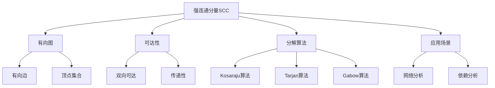

# 强连通分量算法

## 📖 核心概念

**强连通分量（Strongly Connected Components, SCC）**是有向图中的一个最大子图，其中任意两个顶点都相互可达。强连通分量算法用于将有向图分解为若干个强连通分量，是图论中的重要算法。

### 🏗️ 强连通分量的组成要素



## 🔍 强连通分量算法分类

### 按算法策略分类

| 算法 | 策略 | 时间复杂度 | 空间复杂度 | 特点 |
|------|------|------------|------------|------|
| **Kosaraju** | 两次DFS | O(V + E) | O(V) | 简单易懂 |
| **Tarjan** | 一次DFS | O(V + E) | O(V) | 效率最高 |
| **Gabow** | 改进Tarjan | O(V + E) | O(V) | 栈优化 |

### 按实现方式分类

| 实现方式 | 优点 | 缺点 | 适用场景 |
|----------|------|------|----------|
| **递归DFS** | 代码简洁 | 栈溢出风险 | 小规模图 |
| **迭代DFS** | 避免栈溢出 | 代码复杂 | 大规模图 |
| **并行实现** | 高效处理 | 实现复杂 | 超大规模图 |

## 💻 Kosaraju算法实现

### 基础Kosaraju算法

```cpp
template<typename T>
class KosarajuSCC {
private:
    const AdjacencyList<T>& graph;
    vector<bool> visited;
    vector<int> finishTime;
    vector<vector<int>> sccs;
    int time;
    
public:
    KosarajuSCC(const AdjacencyList<T>& g) : graph(g) {
        visited.resize(graph.getVertexCount(), false);
        finishTime.resize(graph.getVertexCount(), 0);
        time = 0;
    }
    
    // Kosaraju算法实现
    vector<vector<int>> findSCCs() {
        sccs.clear();
        fill(visited.begin(), visited.end(), false);
        time = 0;
        
        // 第一步：计算完成时间
        for (int i = 0; i < graph.getVertexCount(); i++) {
            if (!visited[i]) {
                dfs1(i);
            }
        }
        
        // 第二步：创建转置图
        AdjacencyList<T> transposeGraph = createTransposeGraph();
        
        // 第三步：按完成时间逆序DFS
        fill(visited.begin(), visited.end(), false);
        
        // 按完成时间排序
        vector<pair<int, int>> finishOrder;
        for (int i = 0; i < graph.getVertexCount(); i++) {
            finishOrder.push_back({finishTime[i], i});
        }
        sort(finishOrder.rbegin(), finishOrder.rend());
        
        for (const auto& [finish, vertex] : finishOrder) {
            if (!visited[vertex]) {
                vector<int> scc;
                dfs2(vertex, transposeGraph, scc);
                sccs.push_back(scc);
            }
        }
        
        return sccs;
    }
    
    // 获取强连通分量数量
    int getSCCCount() {
        if (sccs.empty()) {
            findSCCs();
        }
        return sccs.size();
    }
    
    // 检查两个顶点是否在同一个SCC中
    bool inSameSCC(int u, int v) {
        if (sccs.empty()) {
            findSCCs();
        }
        
        for (const auto& scc : sccs) {
            bool foundU = false, foundV = false;
            for (int vertex : scc) {
                if (vertex == u) foundU = true;
                if (vertex == v) foundV = true;
            }
            if (foundU && foundV) return true;
        }
        return false;
    }
    
private:
    // 第一次DFS：计算完成时间
    void dfs1(int vertex) {
        visited[vertex] = true;
        
        for (const auto& edge : graph.getNeighbors(vertex)) {
            if (!visited[edge.to]) {
                dfs1(edge.to);
            }
        }
        
        finishTime[vertex] = time++;
    }
    
    // 第二次DFS：在转置图中找SCC
    void dfs2(int vertex, const AdjacencyList<T>& transposeGraph, vector<int>& scc) {
        visited[vertex] = true;
        scc.push_back(vertex);
        
        for (const auto& edge : transposeGraph.getNeighbors(vertex)) {
            if (!visited[edge.to]) {
                dfs2(edge.to, transposeGraph, scc);
            }
        }
    }
    
    // 创建转置图
    AdjacencyList<T> createTransposeGraph() {
        AdjacencyList<T> transpose(graph.getVertexCount(), true);
        
        for (int i = 0; i < graph.getVertexCount(); i++) {
            for (const auto& edge : graph.getNeighbors(i)) {
                transpose.addEdge(edge.to, i, edge.weight);
            }
        }
        
        return transpose;
    }
};
```

## 💻 Tarjan算法实现

### 基础Tarjan算法

```cpp
template<typename T>
class TarjanSCC {
private:
    const AdjacencyList<T>& graph;
    vector<int> ids;
    vector<int> low;
    vector<bool> onStack;
    stack<int> stk;
    vector<vector<int>> sccs;
    int id;
    
public:
    TarjanSCC(const AdjacencyList<T>& g) : graph(g) {
        ids.resize(graph.getVertexCount(), -1);
        low.resize(graph.getVertexCount(), -1);
        onStack.resize(graph.getVertexCount(), false);
        id = 0;
    }
    
    // Tarjan算法实现
    vector<vector<int>> findSCCs() {
        sccs.clear();
        fill(ids.begin(), ids.end(), -1);
        fill(low.begin(), low.end(), -1);
        fill(onStack.begin(), onStack.end(), false);
        id = 0;
        
        while (!stk.empty()) stk.pop();
        
        for (int i = 0; i < graph.getVertexCount(); i++) {
            if (ids[i] == -1) {
                dfs(i);
            }
        }
        
        return sccs;
    }
    
    // 获取强连通分量数量
    int getSCCCount() {
        if (sccs.empty()) {
            findSCCs();
        }
        return sccs.size();
    }
    
    // 检查两个顶点是否在同一个SCC中
    bool inSameSCC(int u, int v) {
        if (sccs.empty()) {
            findSCCs();
        }
        
        for (const auto& scc : sccs) {
            bool foundU = false, foundV = false;
            for (int vertex : scc) {
                if (vertex == u) foundU = true;
                if (vertex == v) foundV = true;
            }
            if (foundU && foundV) return true;
        }
        return false;
    }
    
private:
    void dfs(int vertex) {
        ids[vertex] = low[vertex] = id++;
        stk.push(vertex);
        onStack[vertex] = true;
        
        for (const auto& edge : graph.getNeighbors(vertex)) {
            if (ids[edge.to] == -1) {
                dfs(edge.to);
            }
            
            if (onStack[edge.to]) {
                low[vertex] = min(low[vertex], low[edge.to]);
            }
        }
        
        // 如果当前顶点是SCC的根
        if (ids[vertex] == low[vertex]) {
            vector<int> scc;
            int w;
            
            do {
                w = stk.top();
                stk.pop();
                onStack[w] = false;
                scc.push_back(w);
            } while (w != vertex);
            
            sccs.push_back(scc);
        }
    }
};
```

### 优化版Tarjan算法

```cpp
template<typename T>
class OptimizedTarjanSCC {
private:
    const AdjacencyList<T>& graph;
    vector<int> ids;
    vector<int> low;
    vector<bool> onStack;
    stack<int> stk;
    vector<vector<int>> sccs;
    int id;
    
public:
    OptimizedTarjanSCC(const AdjacencyList<T>& g) : graph(g) {
        ids.resize(graph.getVertexCount(), -1);
        low.resize(graph.getVertexCount(), -1);
        onStack.resize(graph.getVertexCount(), false);
        id = 0;
    }
    
    // 优化的Tarjan算法
    vector<vector<int>> findSCCs() {
        sccs.clear();
        fill(ids.begin(), ids.end(), -1);
        fill(low.begin(), low.end(), -1);
        fill(onStack.begin(), onStack.end(), false);
        id = 0;
        
        while (!stk.empty()) stk.pop();
        
        for (int i = 0; i < graph.getVertexCount(); i++) {
            if (ids[i] == -1) {
                dfsIterative(i);
            }
        }
        
        return sccs;
    }
    
    // 获取SCC的层次结构
    map<int, vector<int>> getSCCHierarchy() {
        if (sccs.empty()) {
            findSCCs();
        }
        
        map<int, vector<int>> hierarchy;
        vector<int> sccId(graph.getVertexCount(), -1);
        
        // 为每个顶点分配SCC ID
        for (int i = 0; i < sccs.size(); i++) {
            for (int vertex : sccs[i]) {
                sccId[vertex] = i;
            }
        }
        
        // 构建SCC之间的依赖关系
        set<pair<int, int>> sccEdges;
        for (int i = 0; i < graph.getVertexCount(); i++) {
            for (const auto& edge : graph.getNeighbors(i)) {
                int fromSCC = sccId[i];
                int toSCC = sccId[edge.to];
                if (fromSCC != toSCC) {
                    sccEdges.insert({fromSCC, toSCC});
                }
            }
        }
        
        // 计算每个SCC的入度
        vector<int> inDegree(sccs.size(), 0);
        for (const auto& [from, to] : sccEdges) {
            inDegree[to]++;
        }
        
        // 按层次分组
        queue<pair<int, int>> q; // {sccId, level}
        for (int i = 0; i < sccs.size(); i++) {
            if (inDegree[i] == 0) {
                q.push({i, 0});
            }
        }
        
        while (!q.empty()) {
            auto [sccId, level] = q.front();
            q.pop();
            
            hierarchy[level].push_back(sccId);
            
            for (const auto& [from, to] : sccEdges) {
                if (from == sccId) {
                    inDegree[to]--;
                    if (inDegree[to] == 0) {
                        q.push({to, level + 1});
                    }
                }
            }
        }
        
        return hierarchy;
    }
    
private:
    void dfsIterative(int start) {
        stack<pair<int, bool>> dfsStack; // {vertex, isReturning}
        dfsStack.push({start, false});
        
        while (!dfsStack.empty()) {
            auto [vertex, isReturning] = dfsStack.top();
            dfsStack.pop();
            
            if (!isReturning) {
                // 第一次访问
                ids[vertex] = low[vertex] = id++;
                stk.push(vertex);
                onStack[vertex] = true;
                
                // 标记为返回状态
                dfsStack.push({vertex, true});
                
                // 添加邻接顶点
                for (const auto& edge : graph.getNeighbors(vertex)) {
                    if (ids[edge.to] == -1) {
                        dfsStack.push({edge.to, false});
                    }
                }
            } else {
                // 返回时更新low值
                for (const auto& edge : graph.getNeighbors(vertex)) {
                    if (onStack[edge.to]) {
                        low[vertex] = min(low[vertex], low[edge.to]);
                    }
                }
                
                // 检查是否是SCC的根
                if (ids[vertex] == low[vertex]) {
                    vector<int> scc;
                    int w;
                    
                    do {
                        w = stk.top();
                        stk.pop();
                        onStack[w] = false;
                        scc.push_back(w);
                    } while (w != vertex);
                    
                    sccs.push_back(scc);
                }
            }
        }
    }
};
```

## 🎯 强连通分量应用场景

### 1. 网络分析

```cpp
class NetworkAnalyzer {
private:
    AdjacencyList<string> graph;
    map<string, int> nodeToIndex;
    map<int, string> indexToNode;
    int nodeCount;
    
public:
    NetworkAnalyzer() : graph(1000, true), nodeCount(0) {}
    
    // 添加节点
    void addNode(const string& nodeName) {
        if (nodeToIndex.find(nodeName) == nodeToIndex.end()) {
            nodeToIndex[nodeName] = nodeCount;
            indexToNode[nodeCount] = nodeName;
            nodeCount++;
        }
    }
    
    // 添加边
    void addEdge(const string& from, const string& to) {
        addNode(from);
        addNode(to);
        
        int fromIndex = nodeToIndex[from];
        int toIndex = nodeToIndex[to];
        
        graph.addEdge(fromIndex, toIndex);
    }
    
    // 分析网络结构
    map<string, vector<string>> analyzeNetwork() {
        TarjanSCC<string> tarjan(graph);
        vector<vector<int>> sccs = tarjan.findSCCs();
        
        map<string, vector<string>> networkStructure;
        
        for (int i = 0; i < sccs.size(); i++) {
            string sccName = "SCC_" + to_string(i);
            vector<string> nodes;
            
            for (int vertex : sccs[i]) {
                if (indexToNode.find(vertex) != indexToNode.end()) {
                    nodes.push_back(indexToNode[vertex]);
                }
            }
            
            networkStructure[sccName] = nodes;
        }
        
        return networkStructure;
    }
    
    // 计算网络连通性
    double calculateConnectivity() {
        TarjanSCC<string> tarjan(graph);
        int sccCount = tarjan.getSCCCount();
        
        if (nodeCount == 0) return 0.0;
        
        // 连通性 = 1 - (SCC数量 - 1) / (节点数量 - 1)
        return 1.0 - (double)(sccCount - 1) / (nodeCount - 1);
    }
    
    // 找到关键节点
    vector<string> findCriticalNodes() {
        TarjanSCC<string> tarjan(graph);
        vector<vector<int>> sccs = tarjan.findSCCs();
        
        vector<string> criticalNodes;
        
        // 找到只有一个节点的SCC
        for (const auto& scc : sccs) {
            if (scc.size() == 1) {
                int vertex = scc[0];
                if (indexToNode.find(vertex) != indexToNode.end()) {
                    criticalNodes.push_back(indexToNode[vertex]);
                }
            }
        }
        
        return criticalNodes;
    }
};
```

### 2. 依赖关系分析

```cpp
class DependencyAnalyzer {
private:
    AdjacencyList<string> graph;
    map<string, int> componentToIndex;
    map<int, string> indexToComponent;
    int componentCount;
    
public:
    DependencyAnalyzer() : graph(1000, true), componentCount(0) {}
    
    // 添加组件
    void addComponent(const string& componentName) {
        if (componentToIndex.find(componentName) == componentToIndex.end()) {
            componentToIndex[componentName] = componentCount;
            indexToComponent[componentCount] = componentName;
            componentCount++;
        }
    }
    
    // 添加依赖关系
    void addDependency(const string& dependent, const string& dependency) {
        addComponent(dependent);
        addComponent(dependency);
        
        int depIndex = componentToIndex[dependent];
        int depOnIndex = componentToIndex[dependency];
        
        graph.addEdge(depOnIndex, depIndex); // 依赖指向被依赖的组件
    }
    
    // 分析依赖关系
    map<string, vector<string>> analyzeDependencies() {
        OptimizedTarjanSCC<string> tarjan(graph);
        vector<vector<int>> sccs = tarjan.findSCCs();
        
        map<string, vector<string>> dependencyGroups;
        
        for (int i = 0; i < sccs.size(); i++) {
            string groupName = "Group_" + to_string(i);
            vector<string> components;
            
            for (int vertex : sccs[i]) {
                if (indexToComponent.find(vertex) != indexToComponent.end()) {
                    components.push_back(indexToComponent[vertex]);
                }
            }
            
            dependencyGroups[groupName] = components;
        }
        
        return dependencyGroups;
    }
    
    // 检测循环依赖
    bool hasCircularDependency() {
        TarjanSCC<string> tarjan(graph);
        vector<vector<int>> sccs = tarjan.findSCCs();
        
        // 如果存在包含多个节点的SCC，则存在循环依赖
        for (const auto& scc : sccs) {
            if (scc.size() > 1) {
                return true;
            }
        }
        
        return false;
    }
    
    // 获取依赖层次
    map<int, vector<string>> getDependencyLevels() {
        OptimizedTarjanSCC<string> tarjan(graph);
        map<int, vector<int>> hierarchy = tarjan.getSCCHierarchy();
        
        map<int, vector<string>> dependencyLevels;
        
        for (const auto& [level, sccIds] : hierarchy) {
            for (int sccId : sccIds) {
                vector<string> components;
                
                // 这里需要从SCC ID获取组件名称
                // 简化实现，实际需要更复杂的映射
                for (int i = 0; i < componentCount; i++) {
                    if (indexToComponent.find(i) != indexToComponent.end()) {
                        components.push_back(indexToComponent[i]);
                    }
                }
                
                dependencyLevels[level] = components;
            }
        }
        
        return dependencyLevels;
    }
};
```

### 3. 社交网络分析

```cpp
class SocialNetworkAnalyzer {
private:
    AdjacencyList<string> graph;
    map<string, int> userToIndex;
    map<int, string> indexToUser;
    int userCount;
    
public:
    SocialNetworkAnalyzer() : graph(1000, true), userCount(0) {}
    
    // 添加用户
    void addUser(const string& userName) {
        if (userToIndex.find(userName) == userToIndex.end()) {
            userToIndex[userName] = userCount;
            indexToUser[userCount] = userName;
            userCount++;
        }
    }
    
    // 添加关注关系
    void addFollow(const string& follower, const string& following) {
        addUser(follower);
        addUser(following);
        
        int followerIndex = userToIndex[follower];
        int followingIndex = userToIndex[following];
        
        graph.addEdge(followerIndex, followingIndex);
    }
    
    // 分析社交群体
    map<string, vector<string>> analyzeSocialGroups() {
        TarjanSCC<string> tarjan(graph);
        vector<vector<int>> sccs = tarjan.findSCCs();
        
        map<string, vector<string>> socialGroups;
        
        for (int i = 0; i < sccs.size(); i++) {
            string groupName = "Group_" + to_string(i);
            vector<string> users;
            
            for (int vertex : sccs[i]) {
                if (indexToUser.find(vertex) != indexToUser.end()) {
                    users.push_back(indexToUser[vertex]);
                }
            }
            
            socialGroups[groupName] = users;
        }
        
        return socialGroups;
    }
    
    // 计算影响力
    map<string, double> calculateInfluence() {
        TarjanSCC<string> tarjan(graph);
        vector<vector<int>> sccs = tarjan.findSCCs();
        
        map<string, double> influence;
        
        for (const auto& scc : sccs) {
            double sccInfluence = (double)scc.size() / userCount;
            
            for (int vertex : scc) {
                if (indexToUser.find(vertex) != indexToUser.end()) {
                    influence[indexToUser[vertex]] = sccInfluence;
                }
            }
        }
        
        return influence;
    }
    
    // 找到意见领袖
    vector<string> findOpinionLeaders() {
        TarjanSCC<string> tarjan(graph);
        vector<vector<int>> sccs = tarjan.findSCCs();
        
        vector<string> opinionLeaders;
        
        // 找到最大的SCC
        int maxSize = 0;
        vector<int> largestSCC;
        
        for (const auto& scc : sccs) {
            if (scc.size() > maxSize) {
                maxSize = scc.size();
                largestSCC = scc;
            }
        }
        
        // 从最大SCC中选择意见领袖
        for (int vertex : largestSCC) {
            if (indexToUser.find(vertex) != indexToUser.end()) {
                opinionLeaders.push_back(indexToUser[vertex]);
            }
        }
        
        return opinionLeaders;
    }
};
```

## ⚡ 复杂度分析

### 时间复杂度

| 算法 | 时间复杂度 | 说明 |
|------|------------|------|
| **Kosaraju** | O(V + E) | 两次DFS遍历 |
| **Tarjan** | O(V + E) | 一次DFS遍历 |
| **Gabow** | O(V + E) | 改进的Tarjan算法 |

### 空间复杂度

| 算法 | 空间复杂度 | 说明 |
|------|------------|------|
| **Kosaraju** | O(V + E) | 转置图空间 |
| **Tarjan** | O(V) | 栈和数组空间 |
| **Gabow** | O(V) | 优化栈空间 |

### 性能特点

| 特点 | 描述 | 影响 |
|------|------|------|
| **唯一性** | 唯一 | 强连通分量分解是唯一的 |
| **完整性** | 完整 | 每个顶点都属于一个SCC |
| **传递性** | 传递 | SCC内部任意两点相互可达 |
| **应用性** | 广泛 | 适用于多种图分析场景 |

## 🎓 学习要点总结

### 核心理解

1. **强连通性**：理解强连通分量的定义和性质
2. **算法原理**：掌握Kosaraju和Tarjan算法的原理
3. **图转置**：理解转置图在Kosaraju算法中的作用
4. **栈操作**：掌握栈在Tarjan算法中的关键作用

### 实践要点

1. **DFS实现**：正确实现深度优先搜索
2. **栈管理**：正确管理栈的状态
3. **时间戳**：正确使用时间戳标记顶点
4. **SCC识别**：正确识别和收集强连通分量

### 应用思维

1. **网络分析**：理解SCC在网络结构分析中的应用
2. **依赖分析**：掌握SCC在依赖关系分析中的作用
3. **社交网络**：理解SCC在社交群体分析中的应用
4. **系统设计**：掌握SCC在系统架构设计中的价值

---

**相关链接：**
- [[03-层次宇宙/04-图论天地/01-图Graph基础|图Graph基础]] - 图的基本概念
- [[03-层次宇宙/04-图论天地/02-图的遍历算法|图的遍历算法]] - DFS和BFS基础
- [[04-算法武器库/03-图论算法/01-拓扑排序算法|拓扑排序算法]] - 有向图排序
- [[04-算法武器库/01-搜索技术/01-深度优先搜索|深度优先搜索]] - DFS的详细实现
