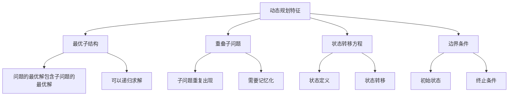

# 动态规划

## 📖 核心概念

**动态规划**是一种通过将复杂问题分解为简单子问题来解决的算法设计技术。它通过存储子问题的解来避免重复计算。

### 🏗️ DP特征



## 🔧 经典DP问题

### 斐波那契数列

```cpp
class FibonacciDP {
public:
    // 递归版本（低效）
    static int fibonacciRecursive(int n) {
        if (n <= 1) return n;
        return fibonacciRecursive(n - 1) + fibonacciRecursive(n - 2);
    }
    
    // 记忆化递归
    static int fibonacciMemo(int n, vector<int>& memo) {
        if (n <= 1) return n;
        if (memo[n] != -1) return memo[n];
        
        memo[n] = fibonacciMemo(n - 1, memo) + fibonacciMemo(n - 2, memo);
        return memo[n];
    }
    
    // 动态规划版本
    static int fibonacciDP(int n) {
        if (n <= 1) return n;
        
        vector<int> dp(n + 1);
        dp[0] = 0;
        dp[1] = 1;
        
        for (int i = 2; i <= n; ++i) {
            dp[i] = dp[i - 1] + dp[i - 2];
        }
        
        return dp[n];
    }
    
    // 空间优化版本
    static int fibonacciOptimized(int n) {
        if (n <= 1) return n;
        
        int prev2 = 0, prev1 = 1;
        for (int i = 2; i <= n; ++i) {
            int current = prev1 + prev2;
            prev2 = prev1;
            prev1 = current;
        }
        
        return prev1;
    }
};
```

### 最长公共子序列

```cpp
class LongestCommonSubsequence {
public:
    static int lcs(string text1, string text2) {
        int m = text1.length(), n = text2.length();
        vector<vector<int>> dp(m + 1, vector<int>(n + 1));
        
        for (int i = 1; i <= m; ++i) {
            for (int j = 1; j <= n; ++j) {
                if (text1[i - 1] == text2[j - 1]) {
                    dp[i][j] = dp[i - 1][j - 1] + 1;
                } else {
                    dp[i][j] = max(dp[i - 1][j], dp[i][j - 1]);
                }
            }
        }
        
        return dp[m][n];
    }
    
    static string lcsString(string text1, string text2) {
        int m = text1.length(), n = text2.length();
        vector<vector<int>> dp(m + 1, vector<int>(n + 1));
        
        for (int i = 1; i <= m; ++i) {
            for (int j = 1; j <= n; ++j) {
                if (text1[i - 1] == text2[j - 1]) {
                    dp[i][j] = dp[i - 1][j - 1] + 1;
                } else {
                    dp[i][j] = max(dp[i - 1][j], dp[i][j - 1]);
                }
            }
        }
        
        // 重构LCS
        string result;
        int i = m, j = n;
        while (i > 0 && j > 0) {
            if (text1[i - 1] == text2[j - 1]) {
                result = text1[i - 1] + result;
                i--;
                j--;
            } else if (dp[i - 1][j] > dp[i][j - 1]) {
                i--;
            } else {
                j--;
            }
        }
        
        return result;
    }
};
```

### 最长递增子序列

```cpp
class LongestIncreasingSubsequence {
public:
    static int lis(vector<int>& nums) {
        int n = nums.size();
        vector<int> dp(n, 1);
        
        for (int i = 1; i < n; ++i) {
            for (int j = 0; j < i; ++j) {
                if (nums[j] < nums[i]) {
                    dp[i] = max(dp[i], dp[j] + 1);
                }
            }
        }
        
        return *max_element(dp.begin(), dp.end());
    }
    
    static vector<int> lisSequence(vector<int>& nums) {
        int n = nums.size();
        vector<int> dp(n, 1);
        vector<int> parent(n, -1);
        
        for (int i = 1; i < n; ++i) {
            for (int j = 0; j < i; ++j) {
                if (nums[j] < nums[i] && dp[j] + 1 > dp[i]) {
                    dp[i] = dp[j] + 1;
                    parent[i] = j;
                }
            }
        }
        
        // 找到最长序列的末尾
        int maxLen = *max_element(dp.begin(), dp.end());
        int endIndex = -1;
        for (int i = 0; i < n; ++i) {
            if (dp[i] == maxLen) {
                endIndex = i;
                break;
            }
        }
        
        // 重构序列
        vector<int> result;
        while (endIndex != -1) {
            result.push_back(nums[endIndex]);
            endIndex = parent[endIndex];
        }
        
        reverse(result.begin(), result.end());
        return result;
    }
    
    // 二分搜索优化版本
    static int lisOptimized(vector<int>& nums) {
        vector<int> tails;
        
        for (int num : nums) {
            auto it = lower_bound(tails.begin(), tails.end(), num);
            if (it == tails.end()) {
                tails.push_back(num);
            } else {
                *it = num;
            }
        }
        
        return tails.size();
    }
};
```

## 🎯 背包问题

### 0-1背包

```cpp
class Knapsack01 {
public:
    static int knapsack(vector<int>& weights, vector<int>& values, int capacity) {
        int n = weights.size();
        vector<vector<int>> dp(n + 1, vector<int>(capacity + 1));
        
        for (int i = 1; i <= n; ++i) {
            for (int w = 1; w <= capacity; ++w) {
                if (weights[i - 1] <= w) {
                    dp[i][w] = max(dp[i - 1][w], 
                                  dp[i - 1][w - weights[i - 1]] + values[i - 1]);
                } else {
                    dp[i][w] = dp[i - 1][w];
                }
            }
        }
        
        return dp[n][capacity];
    }
    
    static vector<int> knapsackItems(vector<int>& weights, vector<int>& values, int capacity) {
        int n = weights.size();
        vector<vector<int>> dp(n + 1, vector<int>(capacity + 1));
        
        for (int i = 1; i <= n; ++i) {
            for (int w = 1; w <= capacity; ++w) {
                if (weights[i - 1] <= w) {
                    dp[i][w] = max(dp[i - 1][w], 
                                  dp[i - 1][w - weights[i - 1]] + values[i - 1]);
                } else {
                    dp[i][w] = dp[i - 1][w];
                }
            }
        }
        
        // 重构选择的物品
        vector<int> items;
        int w = capacity;
        for (int i = n; i > 0; --i) {
            if (dp[i][w] != dp[i - 1][w]) {
                items.push_back(i - 1);
                w -= weights[i - 1];
            }
        }
        
        return items;
    }
    
    // 空间优化版本
    static int knapsackOptimized(vector<int>& weights, vector<int>& values, int capacity) {
        vector<int> dp(capacity + 1);
        
        for (int i = 0; i < weights.size(); ++i) {
            for (int w = capacity; w >= weights[i]; --w) {
                dp[w] = max(dp[w], dp[w - weights[i]] + values[i]);
            }
        }
        
        return dp[capacity];
    }
};
```

### 完全背包

```cpp
class CompleteKnapsack {
public:
    static int completeKnapsack(vector<int>& weights, vector<int>& values, int capacity) {
        vector<int> dp(capacity + 1);
        
        for (int i = 0; i < weights.size(); ++i) {
            for (int w = weights[i]; w <= capacity; ++w) {
                dp[w] = max(dp[w], dp[w - weights[i]] + values[i]);
            }
        }
        
        return dp[capacity];
    }
};
```

## 📊 路径问题

### 最小路径和

```cpp
class MinimumPathSum {
public:
    static int minPathSum(vector<vector<int>>& grid) {
        int m = grid.size(), n = grid[0].size();
        vector<vector<int>> dp(m, vector<int>(n));
        
        dp[0][0] = grid[0][0];
        
        // 初始化第一行
        for (int j = 1; j < n; ++j) {
            dp[0][j] = dp[0][j - 1] + grid[0][j];
        }
        
        // 初始化第一列
        for (int i = 1; i < m; ++i) {
            dp[i][0] = dp[i - 1][0] + grid[i][0];
        }
        
        // 填充其余部分
        for (int i = 1; i < m; ++i) {
            for (int j = 1; j < n; ++j) {
                dp[i][j] = min(dp[i - 1][j], dp[i][j - 1]) + grid[i][j];
            }
        }
        
        return dp[m - 1][n - 1];
    }
    
    static vector<pair<int, int>> minPathSumPath(vector<vector<int>>& grid) {
        int m = grid.size(), n = grid[0].size();
        vector<vector<int>> dp(m, vector<int>(n));
        vector<vector<pair<int, int>>> parent(m, vector<pair<int, int>>(n));
        
        dp[0][0] = grid[0][0];
        parent[0][0] = {-1, -1};
        
        // 初始化第一行
        for (int j = 1; j < n; ++j) {
            dp[0][j] = dp[0][j - 1] + grid[0][j];
            parent[0][j] = {0, j - 1};
        }
        
        // 初始化第一列
        for (int i = 1; i < m; ++i) {
            dp[i][0] = dp[i - 1][0] + grid[i][0];
            parent[i][0] = {i - 1, 0};
        }
        
        // 填充其余部分
        for (int i = 1; i < m; ++i) {
            for (int j = 1; j < n; ++j) {
                if (dp[i - 1][j] < dp[i][j - 1]) {
                    dp[i][j] = dp[i - 1][j] + grid[i][j];
                    parent[i][j] = {i - 1, j};
                } else {
                    dp[i][j] = dp[i][j - 1] + grid[i][j];
                    parent[i][j] = {i, j - 1};
                }
            }
        }
        
        // 重构路径
        vector<pair<int, int>> path;
        int i = m - 1, j = n - 1;
        while (i != -1 && j != -1) {
            path.push_back({i, j});
            int prevI = parent[i][j].first;
            int prevJ = parent[i][j].second;
            i = prevI;
            j = prevJ;
        }
        
        reverse(path.begin(), path.end());
        return path;
    }
};
```

## 🎮 DP优化技巧

### 状态压缩

```cpp
class StateCompression {
public:
    // 旅行商问题（TSP）
    static int tsp(vector<vector<int>>& graph) {
        int n = graph.size();
        vector<vector<int>> dp(1 << n, vector<int>(n, INT_MAX));
        
        dp[1][0] = 0;  // 从城市0开始
        
        for (int mask = 1; mask < (1 << n); ++mask) {
            for (int u = 0; u < n; ++u) {
                if (!(mask & (1 << u))) continue;
                
                for (int v = 0; v < n; ++v) {
                    if (!(mask & (1 << v)) && graph[u][v] != 0) {
                        int newMask = mask | (1 << v);
                        dp[newMask][v] = min(dp[newMask][v], dp[mask][u] + graph[u][v]);
                    }
                }
            }
        }
        
        int result = INT_MAX;
        int fullMask = (1 << n) - 1;
        for (int i = 1; i < n; ++i) {
            if (graph[i][0] != 0) {
                result = min(result, dp[fullMask][i] + graph[i][0]);
            }
        }
        
        return result;
    }
};
```

## 🔗 相关链接

- [[01-搜索技术|搜索技术]]
- [[02-排序艺术|排序艺术]]
- [[03-图论算法|图论算法]]

## 💡 动态规划要点

1. **状态定义**：明确状态的含义
2. **状态转移**：找到状态间的关系
3. **边界条件**：确定初始状态
4. **优化技巧**：空间优化、状态压缩等

---

*📝 规划提示：动态规划是解决最优化问题的重要方法，需要多练习掌握*
