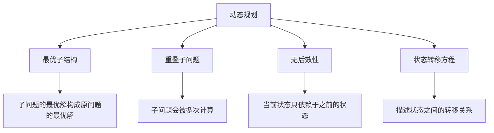

# 动态规划基础

## 📖 核心概念

**动态规划（Dynamic Programming）**是一种通过把原问题分解为相对简单的子问题的方式求解复杂问题的方法。它通过记忆化存储子问题的解来避免重复计算。

### 🏗️ 动态规划特征



## 🔧 动态规划实现

### 基础动态规划

```cpp
class DynamicProgramming {
private:
    map<int, int> memo;
    
public:
    // 斐波那契数列（记忆化）
    int fibonacci(int n) {
        if (n <= 1) return n;
        
        if (memo.find(n) != memo.end()) {
            return memo[n];
        }
        
        memo[n] = fibonacci(n - 1) + fibonacci(n - 2);
        return memo[n];
    }
    
    // 斐波那契数列（迭代）
    int fibonacciIterative(int n) {
        if (n <= 1) return n;
        
        int prev2 = 0, prev1 = 1;
        for (int i = 2; i <= n; ++i) {
            int current = prev1 + prev2;
            prev2 = prev1;
            prev1 = current;
        }
        
        return prev1;
    }
    
    // 爬楼梯问题
    int climbStairs(int n) {
        if (n <= 2) return n;
        
        vector<int> dp(n + 1);
        dp[1] = 1;
        dp[2] = 2;
        
        for (int i = 3; i <= n; ++i) {
            dp[i] = dp[i - 1] + dp[i - 2];
        }
        
        return dp[n];
    }
    
    // 最长递增子序列
    int longestIncreasingSubsequence(vector<int>& nums) {
        if (nums.empty()) return 0;
        
        int n = nums.size();
        vector<int> dp(n, 1);
        
        for (int i = 1; i < n; ++i) {
            for (int j = 0; j < i; ++j) {
                if (nums[j] < nums[i]) {
                    dp[i] = max(dp[i], dp[j] + 1);
                }
            }
        }
        
        return *max_element(dp.begin(), dp.end());
    }
    
    // 最长公共子序列
    int longestCommonSubsequence(string text1, string text2) {
        int m = text1.length();
        int n = text2.length();
        
        vector<vector<int>> dp(m + 1, vector<int>(n + 1, 0));
        
        for (int i = 1; i <= m; ++i) {
            for (int j = 1; j <= n; ++j) {
                if (text1[i - 1] == text2[j - 1]) {
                    dp[i][j] = dp[i - 1][j - 1] + 1;
                } else {
                    dp[i][j] = max(dp[i - 1][j], dp[i][j - 1]);
                }
            }
        }
        
        return dp[m][n];
    }
    
    // 编辑距离
    int editDistance(string word1, string word2) {
        int m = word1.length();
        int n = word2.length();
        
        vector<vector<int>> dp(m + 1, vector<int>(n + 1, 0));
        
        // 初始化
        for (int i = 0; i <= m; ++i) {
            dp[i][0] = i;
        }
        for (int j = 0; j <= n; ++j) {
            dp[0][j] = j;
        }
        
        for (int i = 1; i <= m; ++i) {
            for (int j = 1; j <= n; ++j) {
                if (word1[i - 1] == word2[j - 1]) {
                    dp[i][j] = dp[i - 1][j - 1];
                } else {
                    dp[i][j] = 1 + min({dp[i - 1][j], dp[i][j - 1], dp[i - 1][j - 1]});
                }
            }
        }
        
        return dp[m][n];
    }
    
    // 最大子数组和
    int maxSubArray(vector<int>& nums) {
        int maxSum = nums[0];
        int currentSum = nums[0];
        
        for (int i = 1; i < nums.size(); ++i) {
            currentSum = max(nums[i], currentSum + nums[i]);
            maxSum = max(maxSum, currentSum);
        }
        
        return maxSum;
    }
    
    // 显示动态规划过程
    void displayFibonacci(int n) {
        cout << "Fibonacci sequence up to " << n << ":" << endl;
        cout << "===============================" << endl;
        
        for (int i = 0; i <= n; ++i) {
            cout << "F(" << i << ") = " << fibonacci(i) << endl;
        }
    }
    
    void displayClimbStairs(int n) {
        cout << "Ways to climb " << n << " stairs:" << endl;
        cout << "=============================" << endl;
        
        for (int i = 1; i <= n; ++i) {
            cout << "Stairs " << i << ": " << climbStairs(i) << " ways" << endl;
        }
    }
    
    void displayLIS(vector<int>& nums) {
        cout << "Longest Increasing Subsequence:" << endl;
        cout << "===============================" << endl;
        
        cout << "Array: ";
        for (int num : nums) {
            cout << num << " ";
        }
        cout << endl;
        
        int result = longestIncreasingSubsequence(nums);
        cout << "Length of LIS: " << result << endl;
    }
    
    void displayLCS(string text1, string text2) {
        cout << "Longest Common Subsequence:" << endl;
        cout << "=========================" << endl;
        
        cout << "Text 1: " << text1 << endl;
        cout << "Text 2: " << text2 << endl;
        
        int result = longestCommonSubsequence(text1, text2);
        cout << "Length of LCS: " << result << endl;
    }
    
    void displayEditDistance(string word1, string word2) {
        cout << "Edit Distance:" << endl;
        cout << "=============" << endl;
        
        cout << "Word 1: " << word1 << endl;
        cout << "Word 2: " << word2 << endl;
        
        int result = editDistance(word1, word2);
        cout << "Edit distance: " << result << endl;
    }
    
    void displayMaxSubArray(vector<int>& nums) {
        cout << "Maximum Subarray Sum:" << endl;
        cout << "===================" << endl;
        
        cout << "Array: ";
        for (int num : nums) {
            cout << num << " ";
        }
        cout << endl;
        
        int result = maxSubArray(nums);
        cout << "Maximum sum: " << result << endl;
    }
};
```

### 背包问题

```cpp
class KnapsackProblem {
public:
    // 0-1背包问题
    int knapsack01(vector<int>& weights, vector<int>& values, int capacity) {
        int n = weights.size();
        vector<vector<int>> dp(n + 1, vector<int>(capacity + 1, 0));
        
        for (int i = 1; i <= n; ++i) {
            for (int w = 1; w <= capacity; ++w) {
                if (weights[i - 1] <= w) {
                    dp[i][w] = max(dp[i - 1][w], 
                                 dp[i - 1][w - weights[i - 1]] + values[i - 1]);
                } else {
                    dp[i][w] = dp[i - 1][w];
                }
            }
        }
        
        return dp[n][capacity];
    }
    
    // 0-1背包问题（空间优化）
    int knapsack01Optimized(vector<int>& weights, vector<int>& values, int capacity) {
        int n = weights.size();
        vector<int> dp(capacity + 1, 0);
        
        for (int i = 0; i < n; ++i) {
            for (int w = capacity; w >= weights[i]; --w) {
                dp[w] = max(dp[w], dp[w - weights[i]] + values[i]);
            }
        }
        
        return dp[capacity];
    }
    
    // 完全背包问题
    int knapsackComplete(vector<int>& weights, vector<int>& values, int capacity) {
        int n = weights.size();
        vector<int> dp(capacity + 1, 0);
        
        for (int i = 0; i < n; ++i) {
            for (int w = weights[i]; w <= capacity; ++w) {
                dp[w] = max(dp[w], dp[w - weights[i]] + values[i]);
            }
        }
        
        return dp[capacity];
    }
    
    // 多重背包问题
    int knapsackMultiple(vector<int>& weights, vector<int>& values, 
                        vector<int>& counts, int capacity) {
        int n = weights.size();
        vector<int> dp(capacity + 1, 0);
        
        for (int i = 0; i < n; ++i) {
            for (int w = capacity; w >= weights[i]; --w) {
                for (int k = 1; k <= counts[i] && k * weights[i] <= w; ++k) {
                    dp[w] = max(dp[w], dp[w - k * weights[i]] + k * values[i]);
                }
            }
        }
        
        return dp[capacity];
    }
    
    // 显示背包问题过程
    void displayKnapsack01(vector<int>& weights, vector<int>& values, int capacity) {
        cout << "0-1 Knapsack Problem:" << endl;
        cout << "===================" << endl;
        
        cout << "Weights: ";
        for (int w : weights) cout << w << " ";
        cout << endl;
        
        cout << "Values: ";
        for (int v : values) cout << v << " ";
        cout << endl;
        
        cout << "Capacity: " << capacity << endl;
        
        int result = knapsack01(weights, values, capacity);
        cout << "Maximum value: " << result << endl;
    }
    
    void displayKnapsackComplete(vector<int>& weights, vector<int>& values, int capacity) {
        cout << "Complete Knapsack Problem:" << endl;
        cout << "========================" << endl;
        
        cout << "Weights: ";
        for (int w : weights) cout << w << " ";
        cout << endl;
        
        cout << "Values: ";
        for (int v : values) cout << v << " ";
        cout << endl;
        
        cout << "Capacity: " << capacity << endl;
        
        int result = knapsackComplete(weights, values, capacity);
        cout << "Maximum value: " << result << endl;
    }
    
    void displayKnapsackMultiple(vector<int>& weights, vector<int>& values, 
                                vector<int>& counts, int capacity) {
        cout << "Multiple Knapsack Problem:" << endl;
        cout << "========================" << endl;
        
        cout << "Weights: ";
        for (int w : weights) cout << w << " ";
        cout << endl;
        
        cout << "Values: ";
        for (int v : values) cout << v << " ";
        cout << endl;
        
        cout << "Counts: ";
        for (int c : counts) cout << c << " ";
        cout << endl;
        
        cout << "Capacity: " << capacity << endl;
        
        int result = knapsackMultiple(weights, values, counts, capacity);
        cout << "Maximum value: " << result << endl;
    }
};
```

### 路径问题

```cpp
class PathProblems {
public:
    // 最小路径和
    int minPathSum(vector<vector<int>>& grid) {
        int m = grid.size();
        int n = grid[0].size();
        
        vector<vector<int>> dp(m, vector<int>(n, 0));
        dp[0][0] = grid[0][0];
        
        // 初始化第一行
        for (int j = 1; j < n; ++j) {
            dp[0][j] = dp[0][j - 1] + grid[0][j];
        }
        
        // 初始化第一列
        for (int i = 1; i < m; ++i) {
            dp[i][0] = dp[i - 1][0] + grid[i][0];
        }
        
        // 填充其余部分
        for (int i = 1; i < m; ++i) {
            for (int j = 1; j < n; ++j) {
                dp[i][j] = min(dp[i - 1][j], dp[i][j - 1]) + grid[i][j];
            }
        }
        
        return dp[m - 1][n - 1];
    }
    
    // 不同路径数量
    int uniquePaths(int m, int n) {
        vector<vector<int>> dp(m, vector<int>(n, 1));
        
        for (int i = 1; i < m; ++i) {
            for (int j = 1; j < n; ++j) {
                dp[i][j] = dp[i - 1][j] + dp[i][j - 1];
            }
        }
        
        return dp[m - 1][n - 1];
    }
    
    // 不同路径数量（空间优化）
    int uniquePathsOptimized(int m, int n) {
        vector<int> dp(n, 1);
        
        for (int i = 1; i < m; ++i) {
            for (int j = 1; j < n; ++j) {
                dp[j] += dp[j - 1];
            }
        }
        
        return dp[n - 1];
    }
    
    // 带障碍的不同路径
    int uniquePathsWithObstacles(vector<vector<int>>& obstacleGrid) {
        int m = obstacleGrid.size();
        int n = obstacleGrid[0].size();
        
        vector<vector<int>> dp(m, vector<int>(n, 0));
        
        // 初始化第一行
        for (int j = 0; j < n && obstacleGrid[0][j] == 0; ++j) {
            dp[0][j] = 1;
        }
        
        // 初始化第一列
        for (int i = 0; i < m && obstacleGrid[i][0] == 0; ++i) {
            dp[i][0] = 1;
        }
        
        // 填充其余部分
        for (int i = 1; i < m; ++i) {
            for (int j = 1; j < n; ++j) {
                if (obstacleGrid[i][j] == 0) {
                    dp[i][j] = dp[i - 1][j] + dp[i][j - 1];
                }
            }
        }
        
        return dp[m - 1][n - 1];
    }
    
    // 显示路径问题过程
    void displayMinPathSum(vector<vector<int>>& grid) {
        cout << "Minimum Path Sum:" << endl;
        cout << "================" << endl;
        
        cout << "Grid:" << endl;
        for (const auto& row : grid) {
            for (int val : row) {
                cout << val << " ";
            }
            cout << endl;
        }
        
        int result = minPathSum(grid);
        cout << "Minimum path sum: " << result << endl;
    }
    
    void displayUniquePaths(int m, int n) {
        cout << "Unique Paths:" << endl;
        cout << "============" << endl;
        
        cout << "Grid size: " << m << " x " << n << endl;
        
        int result = uniquePaths(m, n);
        cout << "Number of unique paths: " << result << endl;
    }
    
    void displayUniquePathsWithObstacles(vector<vector<int>>& obstacleGrid) {
        cout << "Unique Paths with Obstacles:" << endl;
        cout << "==========================" << endl;
        
        cout << "Grid:" << endl;
        for (const auto& row : obstacleGrid) {
            for (int val : row) {
                cout << val << " ";
            }
            cout << endl;
        }
        
        int result = uniquePathsWithObstacles(obstacleGrid);
        cout << "Number of unique paths: " << result << endl;
    }
};
```

## 🎯 动态规划应用

### 字符串处理

```cpp
class StringDP {
public:
    // 最长回文子序列
    int longestPalindromeSubseq(string s) {
        int n = s.length();
        vector<vector<int>> dp(n, vector<int>(n, 0));
        
        // 单个字符
        for (int i = 0; i < n; ++i) {
            dp[i][i] = 1;
        }
        
        // 两个字符
        for (int i = 0; i < n - 1; ++i) {
            if (s[i] == s[i + 1]) {
                dp[i][i + 1] = 2;
            } else {
                dp[i][i + 1] = 1;
            }
        }
        
        // 长度大于2的子序列
        for (int len = 3; len <= n; ++len) {
            for (int i = 0; i <= n - len; ++i) {
                int j = i + len - 1;
                if (s[i] == s[j]) {
                    dp[i][j] = dp[i + 1][j - 1] + 2;
                } else {
                    dp[i][j] = max(dp[i + 1][j], dp[i][j - 1]);
                }
            }
        }
        
        return dp[0][n - 1];
    }
    
    // 最长回文子串
    string longestPalindrome(string s) {
        int n = s.length();
        vector<vector<bool>> dp(n, vector<bool>(n, false));
        
        int start = 0, maxLen = 1;
        
        // 单个字符
        for (int i = 0; i < n; ++i) {
            dp[i][i] = true;
        }
        
        // 两个字符
        for (int i = 0; i < n - 1; ++i) {
            if (s[i] == s[i + 1]) {
                dp[i][i + 1] = true;
                start = i;
                maxLen = 2;
            }
        }
        
        // 长度大于2的子串
        for (int len = 3; len <= n; ++len) {
            for (int i = 0; i <= n - len; ++i) {
                int j = i + len - 1;
                if (s[i] == s[j] && dp[i + 1][j - 1]) {
                    dp[i][j] = true;
                    start = i;
                    maxLen = len;
                }
            }
        }
        
        return s.substr(start, maxLen);
    }
    
    // 正则表达式匹配
    bool isMatch(string s, string p) {
        int m = s.length();
        int n = p.length();
        
        vector<vector<bool>> dp(m + 1, vector<bool>(n + 1, false));
        dp[0][0] = true;
        
        // 处理模式中的'*'
        for (int j = 2; j <= n; j += 2) {
            if (p[j - 1] == '*') {
                dp[0][j] = dp[0][j - 2];
            }
        }
        
        for (int i = 1; i <= m; ++i) {
            for (int j = 1; j <= n; ++j) {
                if (p[j - 1] == '*') {
                    dp[i][j] = dp[i][j - 2] || 
                               (dp[i - 1][j] && (s[i - 1] == p[j - 2] || p[j - 2] == '.'));
                } else {
                    dp[i][j] = dp[i - 1][j - 1] && 
                               (s[i - 1] == p[j - 1] || p[j - 1] == '.');
                }
            }
        }
        
        return dp[m][n];
    }
    
    // 显示字符串DP过程
    void displayLongestPalindromeSubseq(string s) {
        cout << "Longest Palindrome Subsequence:" << endl;
        cout << "==============================" << endl;
        
        cout << "String: " << s << endl;
        
        int result = longestPalindromeSubseq(s);
        cout << "Length of longest palindrome subsequence: " << result << endl;
    }
    
    void displayLongestPalindrome(string s) {
        cout << "Longest Palindrome Substring:" << endl;
        cout << "============================" << endl;
        
        cout << "String: " << s << endl;
        
        string result = longestPalindrome(s);
        cout << "Longest palindrome substring: " << result << endl;
    }
    
    void displayRegexMatch(string s, string p) {
        cout << "Regular Expression Matching:" << endl;
        cout << "==========================" << endl;
        
        cout << "String: " << s << endl;
        cout << "Pattern: " << p << endl;
        
        bool result = isMatch(s, p);
        cout << "Match: " << (result ? "Yes" : "No") << endl;
    }
};
```

## 📊 动态规划分析

### 性能分析

```cpp
class DPAnalysis {
public:
    static void analyzePerformance() {
        cout << "Dynamic Programming Performance Analysis:" << endl;
        cout << "=======================================" << endl;
        
        cout << "1. Time Complexity:" << endl;
        cout << "   - Fibonacci: O(n)" << endl;
        cout << "   - LIS: O(n²)" << endl;
        cout << "   - LCS: O(mn)" << endl;
        cout << "   - Edit Distance: O(mn)" << endl;
        cout << "   - Knapsack: O(nW)" << endl;
        
        cout << "2. Space Complexity:" << endl;
        cout << "   - 1D DP: O(n)" << endl;
        cout << "   - 2D DP: O(mn)" << endl;
        cout << "   - Space optimization possible" << endl;
        
        cout << "3. Optimization Techniques:" << endl;
        cout << "   - Memoization: Top-down approach" << endl;
        cout << "   - Tabulation: Bottom-up approach" << endl;
        cout << "   - Space optimization: Reduce space complexity" << endl;
    }
    
    static void analyzeSpaceComplexity() {
        cout << "Dynamic Programming Space Complexity Analysis:" << endl;
        cout << "=============================================" << endl;
        
        cout << "1. Memoization:" << endl;
        cout << "   - Hash map: O(n)" << endl;
        cout << "   - Array: O(n)" << endl;
        cout << "   - Recursion stack: O(n)" << endl;
        
        cout << "2. Tabulation:" << endl;
        cout << "   - 1D array: O(n)" << endl;
        cout << "   - 2D array: O(mn)" << endl;
        cout << "   - No recursion stack" << endl;
        
        cout << "3. Space Optimization:" << endl;
        cout << "   - Rolling array: O(1)" << endl;
        cout << "   - State compression: O(1)" << endl;
        cout << "   - Reduce space complexity" << endl;
    }
    
    static void selectApproach(bool hasOverlappingSubproblems, bool needsOptimalSubstructure) {
        cout << "Approach Selection:" << endl;
        cout << "==================" << endl;
        
        cout << "Has overlapping subproblems: " << (hasOverlappingSubproblems ? "Yes" : "No") << endl;
        cout << "Needs optimal substructure: " << (needsOptimalSubstructure ? "Yes" : "No") << endl;
        
        cout << "Recommendation:" << endl;
        
        if (hasOverlappingSubproblems && needsOptimalSubstructure) {
            cout << "Use Dynamic Programming" << endl;
        } else if (hasOverlappingSubproblems) {
            cout << "Use Memoization" << endl;
        } else {
            cout << "Use Greedy Algorithm" << endl;
        }
    }
};
```

## 🎮 动态规划测试

### 1. 基础功能测试

```cpp
class DPTest {
public:
    static void testBasicDP() {
        cout << "Testing Basic Dynamic Programming:" << endl;
        cout << "=================================" << endl;
        
        DynamicProgramming dp;
        
        dp.displayFibonacci(10);
        dp.displayClimbStairs(10);
        
        vector<int> nums = {10, 9, 2, 5, 3, 7, 101, 18};
        dp.displayLIS(nums);
        
        dp.displayLCS("abcde", "ace");
        dp.displayEditDistance("horse", "ros");
        
        vector<int> nums2 = {-2, 1, -3, 4, -1, 2, 1, -5, 4};
        dp.displayMaxSubArray(nums2);
    }
    
    static void testKnapsack() {
        cout << "Testing Knapsack Problems:" << endl;
        cout << "========================" << endl;
        
        KnapsackProblem knapsack;
        
        vector<int> weights = {1, 3, 4, 5};
        vector<int> values = {1, 4, 5, 7};
        int capacity = 7;
        
        knapsack.displayKnapsack01(weights, values, capacity);
        knapsack.displayKnapsackComplete(weights, values, capacity);
        
        vector<int> counts = {2, 1, 3, 2};
        knapsack.displayKnapsackMultiple(weights, values, counts, capacity);
    }
    
    static void testPathProblems() {
        cout << "Testing Path Problems:" << endl;
        cout << "====================" << endl;
        
        PathProblems path;
        
        vector<vector<int>> grid = {{1, 3, 1}, {1, 5, 1}, {4, 2, 1}};
        path.displayMinPathSum(grid);
        
        path.displayUniquePaths(3, 7);
        
        vector<vector<int>> obstacleGrid = {{0, 0, 0}, {0, 1, 0}, {0, 0, 0}};
        path.displayUniquePathsWithObstacles(obstacleGrid);
    }
    
    static void testStringDP() {
        cout << "Testing String Dynamic Programming:" << endl;
        cout << "=================================" << endl;
        
        StringDP stringDP;
        
        stringDP.displayLongestPalindromeSubseq("bbbab");
        stringDP.displayLongestPalindrome("babad");
        stringDP.displayRegexMatch("aa", "a*");
    }
    
    static void testAnalysis() {
        cout << "Testing Analysis:" << endl;
        cout << "===============" << endl;
        
        DPAnalysis::analyzePerformance();
        DPAnalysis::analyzeSpaceComplexity();
        DPAnalysis::selectApproach(true, true);
    }
};
```

## 🔗 相关链接

- [[01-分治策略|分治策略]]
- [[02-贪心算法|贪心算法]]
- [[03-动态规划思想|动态规划思想]]

## 💡 动态规划要点

1. **最优子结构**: 子问题的最优解构成原问题的最优解
2. **重叠子问题**: 子问题会被多次计算
3. **状态转移方程**: 描述状态之间的转移关系
4. **记忆化**: 避免重复计算，提高效率

---

*📝 动态规划提示：动态规划是解决复杂问题的重要方法，掌握其核心思想有助于解决各种优化问题*