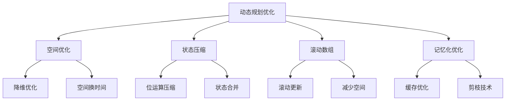

# 动态规划优化

## 📖 核心概念

**动态规划优化**是提高动态规划算法效率的重要技术，包括空间优化、状态压缩、滚动数组等技术。这些优化技术能够显著减少空间复杂度和提高运行效率。

### 🏗️ 动态规划优化分类



## 🔧 动态规划优化实现

### 空间优化

```cpp
class DPSpaceOptimization {
public:
    // 0-1背包问题空间优化
    int knapsackOptimized(vector<int>& weights, vector<int>& values, int capacity) {
        int n = weights.size();
        vector<int> dp(capacity + 1, 0);
        
        for (int i = 0; i < n; ++i) {
            for (int w = capacity; w >= weights[i]; --w) {
                dp[w] = max(dp[w], dp[w - weights[i]] + values[i]);
            }
        }
        
        return dp[capacity];
    }
    
    // 最长公共子序列空间优化
    int lcsOptimized(string text1, string text2) {
        int m = text1.length();
        int n = text2.length();
        
        if (m < n) {
            swap(text1, text2);
            swap(m, n);
        }
        
        vector<int> prev(n + 1, 0);
        vector<int> curr(n + 1, 0);
        
        for (int i = 1; i <= m; ++i) {
            for (int j = 1; j <= n; ++j) {
                if (text1[i - 1] == text2[j - 1]) {
                    curr[j] = prev[j - 1] + 1;
                } else {
                    curr[j] = max(prev[j], curr[j - 1]);
                }
            }
            prev = curr;
        }
        
        return curr[n];
    }
    
    // 编辑距离空间优化
    int editDistanceOptimized(string word1, string word2) {
        int m = word1.length();
        int n = word2.length();
        
        if (m < n) {
            swap(word1, word2);
            swap(m, n);
        }
        
        vector<int> prev(n + 1);
        vector<int> curr(n + 1);
        
        for (int j = 0; j <= n; ++j) {
            prev[j] = j;
        }
        
        for (int i = 1; i <= m; ++i) {
            curr[0] = i;
            for (int j = 1; j <= n; ++j) {
                if (word1[i - 1] == word2[j - 1]) {
                    curr[j] = prev[j - 1];
                } else {
                    curr[j] = 1 + min({prev[j], curr[j - 1], prev[j - 1]});
                }
            }
            prev = curr;
        }
        
        return curr[n];
    }
    
    // 显示空间优化过程
    void displayKnapsackOptimization(vector<int>& weights, vector<int>& values, int capacity) {
        cout << "Knapsack Space Optimization:" << endl;
        cout << "===========================" << endl;
        
        cout << "Weights: ";
        for (int w : weights) cout << w << " ";
        cout << endl;
        
        cout << "Values: ";
        for (int v : values) cout << v << " ";
        cout << endl;
        
        cout << "Capacity: " << capacity << endl;
        
        int result = knapsackOptimized(weights, values, capacity);
        cout << "Maximum value: " << result << endl;
        
        cout << "Space complexity: O(W) instead of O(N*W)" << endl;
    }
    
    void displayLCSOptimization(string text1, string text2) {
        cout << "LCS Space Optimization:" << endl;
        cout << "======================" << endl;
        
        cout << "Text 1: " << text1 << endl;
        cout << "Text 2: " << text2 << endl;
        
        int result = lcsOptimized(text1, text2);
        cout << "Length of LCS: " << result << endl;
        
        cout << "Space complexity: O(min(m,n)) instead of O(m*n)" << endl;
    }
    
    void displayEditDistanceOptimization(string word1, string word2) {
        cout << "Edit Distance Space Optimization:" << endl;
        cout << "===============================" << endl;
        
        cout << "Word 1: " << word1 << endl;
        cout << "Word 2: " << word2 << endl;
        
        int result = editDistanceOptimized(word1, word2);
        cout << "Edit distance: " << result << endl;
        
        cout << "Space complexity: O(min(m,n)) instead of O(m*n)" << endl;
    }
};
```

### 状态压缩

```cpp
class DPStateCompression {
public:
    // 旅行商问题状态压缩
    int tspStateCompression(vector<vector<int>>& graph) {
        int n = graph.size();
        int mask = 1 << n;
        
        vector<vector<int>> dp(mask, vector<int>(n, INT_MAX));
        dp[1][0] = 0; // 从城市0开始
        
        for (int s = 1; s < mask; ++s) {
            for (int u = 0; u < n; ++u) {
                if (dp[s][u] == INT_MAX) continue;
                
                for (int v = 0; v < n; ++v) {
                    if (!(s & (1 << v))) {
                        int newMask = s | (1 << v);
                        dp[newMask][v] = min(dp[newMask][v], dp[s][u] + graph[u][v]);
                    }
                }
            }
        }
        
        int result = INT_MAX;
        int fullMask = mask - 1;
        for (int i = 1; i < n; ++i) {
            if (dp[fullMask][i] != INT_MAX) {
                result = min(result, dp[fullMask][i] + graph[i][0]);
            }
        }
        
        return result;
    }
    
    // 数位DP状态压缩
    int digitDP(int n) {
        string num = to_string(n);
        int len = num.length();
        
        vector<vector<vector<int>>> dp(len, vector<vector<int>>(2, vector<int>(2, -1)));
        
        function<int(int, bool, bool)> dfs = [&](int pos, bool tight, bool hasNum) -> int {
            if (pos == len) return hasNum ? 1 : 0;
            
            if (dp[pos][tight][hasNum] != -1) {
                return dp[pos][tight][hasNum];
            }
            
            int limit = tight ? (num[pos] - '0') : 9;
            int result = 0;
            
            for (int digit = 0; digit <= limit; ++digit) {
                bool newTight = tight && (digit == limit);
                bool newHasNum = hasNum || (digit > 0);
                
                result += dfs(pos + 1, newTight, newHasNum);
            }
            
            return dp[pos][tight][hasNum] = result;
        };
        
        return dfs(0, true, false);
    }
    
    // 轮廓线DP
    int contourLineDP(int m, int n) {
        vector<vector<int>> dp(2, vector<int>(1 << n, 0));
        dp[0][0] = 1;
        
        for (int i = 0; i < m; ++i) {
            for (int j = 0; j < n; ++j) {
                int curr = i * n + j;
                int next = curr + 1;
                
                for (int mask = 0; mask < (1 << n); ++mask) {
                    if (dp[curr & 1][mask] == 0) continue;
                    
                    int newMask = mask;
                    if (j > 0 && (mask & (1 << (j - 1)))) {
                        newMask ^= (1 << (j - 1));
                    }
                    
                    dp[next & 1][newMask] += dp[curr & 1][mask];
                }
            }
        }
        
        return dp[(m * n) & 1][0];
    }
    
    // 显示状态压缩过程
    void displayTSPStateCompression(vector<vector<int>>& graph) {
        cout << "TSP State Compression:" << endl;
        cout << "=====================" << endl;
        
        cout << "Graph:" << endl;
        for (int i = 0; i < graph.size(); ++i) {
            for (int j = 0; j < graph[i].size(); ++j) {
                cout << graph[i][j] << " ";
            }
            cout << endl;
        }
        
        int result = tspStateCompression(graph);
        cout << "Minimum TSP cost: " << result << endl;
        
        cout << "Space complexity: O(2^n * n) instead of O(n!)" << endl;
    }
    
    void displayDigitDPStateCompression(int n) {
        cout << "Digit DP State Compression:" << endl;
        cout << "==========================" << endl;
        
        cout << "Number: " << n << endl;
        
        int result = digitDP(n);
        cout << "Count of numbers: " << result << endl;
        
        cout << "Space complexity: O(log n) instead of O(n)" << endl;
    }
    
    void displayContourLineDPStateCompression(int m, int n) {
        cout << "Contour Line DP State Compression:" << endl;
        cout << "=================================" << endl;
        
        cout << "Grid size: " << m << " x " << n << endl;
        
        int result = contourLineDP(m, n);
        cout << "Number of ways: " << result << endl;
        
        cout << "Space complexity: O(2^n) instead of O(m*n*2^n)" << endl;
    }
};
```

### 滚动数组

```cpp
class DPRollingArray {
public:
    // 斐波那契数列滚动数组
    int fibonacciRolling(int n) {
        if (n <= 1) return n;
        
        int prev2 = 0, prev1 = 1;
        for (int i = 2; i <= n; ++i) {
            int current = prev1 + prev2;
            prev2 = prev1;
            prev1 = current;
        }
        
        return prev1;
    }
    
    // 最长递增子序列滚动数组
    int lisRolling(vector<int>& nums) {
        if (nums.empty()) return 0;
        
        int n = nums.size();
        vector<int> dp(n, 1);
        
        for (int i = 1; i < n; ++i) {
            for (int j = 0; j < i; ++j) {
                if (nums[j] < nums[i]) {
                    dp[i] = max(dp[i], dp[j] + 1);
                }
            }
        }
        
        return *max_element(dp.begin(), dp.end());
    }
    
    // 最大子数组和滚动数组
    int maxSubArrayRolling(vector<int>& nums) {
        int maxSum = nums[0];
        int currentSum = nums[0];
        
        for (int i = 1; i < nums.size(); ++i) {
            currentSum = max(nums[i], currentSum + nums[i]);
            maxSum = max(maxSum, currentSum);
        }
        
        return maxSum;
    }
    
    // 爬楼梯滚动数组
    int climbStairsRolling(int n) {
        if (n <= 2) return n;
        
        int prev2 = 1, prev1 = 2;
        for (int i = 3; i <= n; ++i) {
            int current = prev1 + prev2;
            prev2 = prev1;
            prev1 = current;
        }
        
        return prev1;
    }
    
    // 显示滚动数组过程
    void displayFibonacciRolling(int n) {
        cout << "Fibonacci Rolling Array:" << endl;
        cout << "=======================" << endl;
        
        cout << "Fibonacci sequence up to " << n << ":" << endl;
        for (int i = 0; i <= n; ++i) {
            cout << "F(" << i << ") = " << fibonacciRolling(i) << endl;
        }
        
        cout << "Space complexity: O(1) instead of O(n)" << endl;
    }
    
    void displayLISRolling(vector<int>& nums) {
        cout << "LIS Rolling Array:" << endl;
        cout << "================" << endl;
        
        cout << "Array: ";
        for (int num : nums) cout << num << " ";
        cout << endl;
        
        int result = lisRolling(nums);
        cout << "Length of LIS: " << result << endl;
        
        cout << "Space complexity: O(n) instead of O(n^2)" << endl;
    }
    
    void displayMaxSubArrayRolling(vector<int>& nums) {
        cout << "Max Subarray Rolling Array:" << endl;
        cout << "=========================" << endl;
        
        cout << "Array: ";
        for (int num : nums) cout << num << " ";
        cout << endl;
        
        int result = maxSubArrayRolling(nums);
        cout << "Maximum sum: " << result << endl;
        
        cout << "Space complexity: O(1) instead of O(n)" << endl;
    }
    
    void displayClimbStairsRolling(int n) {
        cout << "Climb Stairs Rolling Array:" << endl;
        cout << "=========================" << endl;
        
        cout << "Ways to climb " << n << " stairs:" << endl;
        for (int i = 1; i <= n; ++i) {
            cout << "Stairs " << i << ": " << climbStairsRolling(i) << " ways" << endl;
        }
        
        cout << "Space complexity: O(1) instead of O(n)" << endl;
    }
};
```

### 记忆化优化

```cpp
class DPMemoizationOptimization {
private:
    unordered_map<string, int> memo;
    
public:
    // 记忆化斐波那契
    int fibonacciMemo(int n) {
        if (n <= 1) return n;
        
        string key = to_string(n);
        if (memo.find(key) != memo.end()) {
            return memo[key];
        }
        
        int result = fibonacciMemo(n - 1) + fibonacciMemo(n - 2);
        memo[key] = result;
        return result;
    }
    
    // 记忆化最长公共子序列
    int lcsMemo(string& s1, string& s2, int i, int j) {
        if (i == 0 || j == 0) return 0;
        
        string key = to_string(i) + "," + to_string(j);
        if (memo.find(key) != memo.end()) {
            return memo[key];
        }
        
        int result;
        if (s1[i - 1] == s2[j - 1]) {
            result = 1 + lcsMemo(s1, s2, i - 1, j - 1);
        } else {
            result = max(lcsMemo(s1, s2, i - 1, j), lcsMemo(s1, s2, i, j - 1));
        }
        
        memo[key] = result;
        return result;
    }
    
    // 记忆化背包问题
    int knapsackMemo(vector<int>& weights, vector<int>& values, int capacity, int index) {
        if (index < 0 || capacity <= 0) return 0;
        
        string key = to_string(index) + "," + to_string(capacity);
        if (memo.find(key) != memo.end()) {
            return memo[key];
        }
        
        int result;
        if (weights[index] > capacity) {
            result = knapsackMemo(weights, values, capacity, index - 1);
        } else {
            int include = values[index] + knapsackMemo(weights, values, capacity - weights[index], index - 1);
            int exclude = knapsackMemo(weights, values, capacity, index - 1);
            result = max(include, exclude);
        }
        
        memo[key] = result;
        return result;
    }
    
    // 记忆化路径计数
    int uniquePathsMemo(int m, int n) {
        if (m == 1 || n == 1) return 1;
        
        string key = to_string(m) + "," + to_string(n);
        if (memo.find(key) != memo.end()) {
            return memo[key];
        }
        
        int result = uniquePathsMemo(m - 1, n) + uniquePathsMemo(m, n - 1);
        memo[key] = result;
        return result;
    }
    
    // 清除记忆
    void clearMemo() {
        memo.clear();
    }
    
    // 显示记忆状态
    void displayMemo() {
        cout << "Memoization Cache:" << endl;
        cout << "=================" << endl;
        
        for (auto& pair : memo) {
            cout << pair.first << " -> " << pair.second << endl;
        }
        
        cout << "Cache size: " << memo.size() << endl;
    }
    
    // 显示记忆化优化过程
    void displayFibonacciMemoOptimization(int n) {
        cout << "Fibonacci Memoization Optimization:" << endl;
        cout << "=================================" << endl;
        
        clearMemo();
        
        cout << "Fibonacci sequence up to " << n << ":" << endl;
        for (int i = 0; i <= n; ++i) {
            cout << "F(" << i << ") = " << fibonacciMemo(i) << endl;
        }
        
        displayMemo();
        cout << "Time complexity: O(n) instead of O(2^n)" << endl;
    }
    
    void displayLCSMemoOptimization(string s1, string s2) {
        cout << "LCS Memoization Optimization:" << endl;
        cout << "============================" << endl;
        
        clearMemo();
        
        cout << "Text 1: " << s1 << endl;
        cout << "Text 2: " << s2 << endl;
        
        int result = lcsMemo(s1, s2, s1.length(), s2.length());
        cout << "Length of LCS: " << result << endl;
        
        displayMemo();
        cout << "Time complexity: O(m*n) instead of O(2^max(m,n))" << endl;
    }
    
    void displayKnapsackMemoOptimization(vector<int>& weights, vector<int>& values, int capacity) {
        cout << "Knapsack Memoization Optimization:" << endl;
        cout << "=================================" << endl;
        
        clearMemo();
        
        cout << "Weights: ";
        for (int w : weights) cout << w << " ";
        cout << endl;
        
        cout << "Values: ";
        for (int v : values) cout << v << " ";
        cout << endl;
        
        cout << "Capacity: " << capacity << endl;
        
        int result = knapsackMemo(weights, values, capacity, weights.size() - 1);
        cout << "Maximum value: " << result << endl;
        
        displayMemo();
        cout << "Time complexity: O(n*W) instead of O(2^n)" << endl;
    }
};
```

## 🎯 动态规划优化应用

### 性能优化

```cpp
class DPOptimizationApplications {
public:
    static void compareOptimizations() {
        cout << "Dynamic Programming Optimization Comparison:" << endl;
        cout << "=========================================" << endl;
        
        cout << "1. Space Optimization:" << endl;
        cout << "   - Reduces space complexity" << endl;
        cout << "   - Maintains time complexity" << endl;
        cout << "   - Examples: 0-1 Knapsack, LCS" << endl;
        
        cout << "2. State Compression:" << endl;
        cout << "   - Uses bit manipulation" << endl;
        cout << "   - Reduces state space" << endl;
        cout << "   - Examples: TSP, Digit DP" << endl;
        
        cout << "3. Rolling Array:" << endl;
        cout << "   - Reuses array space" << endl;
        cout << "   - Reduces memory usage" << endl;
        cout << "   - Examples: Fibonacci, Climb Stairs" << endl;
        
        cout << "4. Memoization:" << endl;
        cout << "   - Caches computed results" << endl;
        cout << "   - Avoids redundant calculations" << endl;
        cout << "   - Examples: Recursive DP" << endl;
    }
    
    static void analyzePerformance() {
        cout << "Performance Analysis:" << endl;
        cout << "===================" << endl;
        
        cout << "1. Time Complexity:" << endl;
        cout << "   - Space Optimization: Same as original" << endl;
        cout << "   - State Compression: Same as original" << endl;
        cout << "   - Rolling Array: Same as original" << endl;
        cout << "   - Memoization: Improved from exponential to polynomial" << endl;
        
        cout << "2. Space Complexity:" << endl;
        cout << "   - Space Optimization: Reduced" << endl;
        cout << "   - State Compression: Reduced" << endl;
        cout << "   - Rolling Array: Reduced" << endl;
        cout << "   - Memoization: Increased (space for cache)" << endl;
        
        cout << "3. Memory Usage:" << endl;
        cout << "   - Space Optimization: Lower" << endl;
        cout << "   - State Compression: Lower" << endl;
        cout << "   - Rolling Array: Lower" << endl;
        cout << "   - Memoization: Higher" << endl;
    }
    
    static void selectOptimization(bool needsSpaceOptimization, bool hasMemoryConstraints, bool needsTimeOptimization) {
        cout << "Optimization Selection:" << endl;
        cout << "=====================" << endl;
        
        cout << "Needs space optimization: " << (needsSpaceOptimization ? "Yes" : "No") << endl;
        cout << "Has memory constraints: " << (hasMemoryConstraints ? "Yes" : "No") << endl;
        cout << "Needs time optimization: " << (needsTimeOptimization ? "Yes" : "No") << endl;
        
        cout << "Recommendation:" << endl;
        
        if (needsTimeOptimization) {
            cout << "Use Memoization (improves time complexity)" << endl;
        } else if (needsSpaceOptimization) {
            cout << "Use Space Optimization (reduces space complexity)" << endl;
        } else if (hasMemoryConstraints) {
            cout << "Use Rolling Array (reduces memory usage)" << endl;
        } else {
            cout << "Use State Compression (reduces state space)" << endl;
        }
    }
};
```

## 📊 动态规划优化分析

### 性能分析

```cpp
class DPOptimizationAnalysis {
public:
    static void analyzePerformance() {
        cout << "Dynamic Programming Optimization Performance Analysis:" << endl;
        cout << "====================================================" << endl;
        
        cout << "1. Space Optimization:" << endl;
        cout << "   - Time Complexity: Same as original" << endl;
        cout << "   - Space Complexity: Reduced" << endl;
        cout << "   - Memory Usage: Lower" << endl;
        cout << "   - Cache Performance: Better" << endl;
        
        cout << "2. State Compression:" << endl;
        cout << "   - Time Complexity: Same as original" << endl;
        cout << "   - Space Complexity: Reduced" << endl;
        cout << "   - Memory Usage: Lower" << endl;
        cout << "   - Bit Operations: Additional overhead" << endl;
        
        cout << "3. Rolling Array:" << endl;
        cout << "   - Time Complexity: Same as original" << endl;
        cout << "   - Space Complexity: Reduced" << endl;
        cout << "   - Memory Usage: Lower" << endl;
        cout << "   - Implementation: Simpler" << endl;
        
        cout << "4. Memoization:" << endl;
        cout << "   - Time Complexity: Improved" << endl;
        cout << "   - Space Complexity: Increased" << endl;
        cout << "   - Memory Usage: Higher" << endl;
        cout << "   - Cache Performance: Depends on hit rate" << endl;
    }
    
    static void analyzeSpaceComplexity() {
        cout << "Dynamic Programming Optimization Space Complexity Analysis:" << endl;
        cout << "========================================================" << endl;
        
        cout << "1. Space Optimization:" << endl;
        cout << "   - Original: O(m*n)" << endl;
        cout << "   - Optimized: O(min(m,n))" << endl;
        cout << "   - Reduction: Significant" << endl;
        
        cout << "2. State Compression:" << endl;
        cout << "   - Original: O(n*2^n)" << endl;
        cout << "   - Optimized: O(2^n)" << endl;
        cout << "   - Reduction: Significant" << endl;
        
        cout << "3. Rolling Array:" << endl;
        cout << "   - Original: O(n)" << endl;
        cout << "   - Optimized: O(1)" << endl;
        cout << "   - Reduction: Significant" << endl;
        
        cout << "4. Memoization:" << endl;
        cout << "   - Original: O(n)" << endl;
        cout << "   - Optimized: O(n) + cache" << endl;
        cout << "   - Reduction: None (space for time)" << endl;
    }
    
    static void analyzeTimeComplexity() {
        cout << "Dynamic Programming Optimization Time Complexity Analysis:" << endl;
        cout << "=======================================================" << endl;
        
        cout << "1. Space Optimization:" << endl;
        cout << "   - Original: O(m*n)" << endl;
        cout << "   - Optimized: O(m*n)" << endl;
        cout << "   - Change: None" << endl;
        
        cout << "2. State Compression:" << endl;
        cout << "   - Original: O(n*2^n)" << endl;
        cout << "   - Optimized: O(n*2^n)" << endl;
        cout << "   - Change: None" << endl;
        
        cout << "3. Rolling Array:" << endl;
        cout << "   - Original: O(n)" << endl;
        cout << "   - Optimized: O(n)" << endl;
        cout << "   - Change: None" << endl;
        
        cout << "4. Memoization:" << endl;
        cout << "   - Original: O(2^n)" << endl;
        cout << "   - Optimized: O(n)" << endl;
        cout << "   - Change: Significant improvement" << endl;
    }
};
```

## 🎮 动态规划优化测试

### 1. 基础功能测试

```cpp
class DPOptimizationTest {
public:
    static void testSpaceOptimization() {
        cout << "Testing Space Optimization:" << endl;
        cout << "=========================" << endl;
        
        DPSpaceOptimization spaceOpt;
        
        vector<int> weights = {1, 3, 4, 5};
        vector<int> values = {1, 4, 5, 7};
        int capacity = 7;
        
        spaceOpt.displayKnapsackOptimization(weights, values, capacity);
        spaceOpt.displayLCSOptimization("abcde", "ace");
        spaceOpt.displayEditDistanceOptimization("horse", "ros");
    }
    
    static void testStateCompression() {
        cout << "Testing State Compression:" << endl;
        cout << "========================" << endl;
        
        DPStateCompression stateComp;
        
        vector<vector<int>> graph = {
            {0, 10, 15, 20},
            {10, 0, 35, 25},
            {15, 35, 0, 30},
            {20, 25, 30, 0}
        };
        
        stateComp.displayTSPStateCompression(graph);
        stateComp.displayDigitDPStateCompression(100);
        stateComp.displayContourLineDPStateCompression(3, 3);
    }
    
    static void testRollingArray() {
        cout << "Testing Rolling Array:" << endl;
        cout << "=====================" << endl;
        
        DPRollingArray rollingArray;
        
        rollingArray.displayFibonacciRolling(10);
        
        vector<int> nums = {10, 9, 2, 5, 3, 7, 101, 18};
        rollingArray.displayLISRolling(nums);
        
        vector<int> nums2 = {-2, 1, -3, 4, -1, 2, 1, -5, 4};
        rollingArray.displayMaxSubArrayRolling(nums2);
        
        rollingArray.displayClimbStairsRolling(10);
    }
    
    static void testMemoizationOptimization() {
        cout << "Testing Memoization Optimization:" << endl;
        cout << "================================" << endl;
        
        DPMemoizationOptimization memoOpt;
        
        memoOpt.displayFibonacciMemoOptimization(10);
        memoOpt.displayLCSMemoOptimization("abcde", "ace");
        
        vector<int> weights = {1, 3, 4, 5};
        vector<int> values = {1, 4, 5, 7};
        int capacity = 7;
        
        memoOpt.displayKnapsackMemoOptimization(weights, values, capacity);
    }
    
    static void testApplications() {
        cout << "Testing Applications:" << endl;
        cout << "===================" << endl;
        
        DPOptimizationApplications::compareOptimizations();
        DPOptimizationApplications::analyzePerformance();
        DPOptimizationApplications::selectOptimization(true, false, false);
    }
    
    static void testAnalysis() {
        cout << "Testing Analysis:" << endl;
        cout << "===============" << endl;
        
        DPOptimizationAnalysis::analyzePerformance();
        DPOptimizationAnalysis::analyzeSpaceComplexity();
        DPOptimizationAnalysis::analyzeTimeComplexity();
    }
};
```

## 🔗 相关链接

- [[01-动态规划基础|动态规划基础]]
- [[02-背包问题详解|背包问题详解]]

## 💡 动态规划优化要点

1. **空间优化**: 减少空间复杂度，保持时间复杂度
2. **状态压缩**: 使用位运算压缩状态空间
3. **滚动数组**: 重用数组空间，减少内存使用
4. **记忆化**: 缓存计算结果，避免重复计算

---

*📝 动态规划优化提示：动态规划优化是提高算法效率的重要技术，掌握这些优化方法有助于解决大规模问题*
