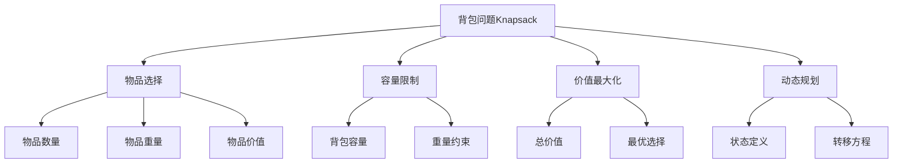

# 背包问题

## 📖 核心概念

**背包问题（Knapsack Problem）**是动态规划中的经典问题，描述的是在给定容量的背包中，如何选择物品使得总价值最大。背包问题有多种变种，是学习动态规划的重要案例。

### 🏗️ 背包问题的组成要素



## 🔍 背包问题分类

### 按物品选择方式分类

| 类型 | 特点 | 时间复杂度 | 空间复杂度 | 应用场景 |
|------|------|------------|------------|----------|
| **0-1背包** | 每件物品最多选一次 | O(n×W) | O(n×W) | 资源分配 |
| **完全背包** | 每件物品可选无限次 | O(n×W) | O(n×W) | 货币兑换 |
| **多重背包** | 每件物品有数量限制 | O(n×W×k) | O(n×W) | 库存管理 |
| **分组背包** | 物品分组选择 | O(n×W) | O(n×W) | 套餐选择 |

### 按优化目标分类

| 目标 | 特点 | 典型问题 |
|------|------|----------|
| **价值最大化** | 在容量限制下最大化价值 | 经典背包问题 |
| **重量最小化** | 在价值要求下最小化重量 | 资源优化 |
| **数量最大化** | 在容量限制下最大化物品数量 | 装载问题 |

## 💻 0-1背包问题实现

### 基础0-1背包

```cpp
class ZeroOneKnapsack {
private:
    vector<int> weights;
    vector<int> values;
    int capacity;
    
public:
    ZeroOneKnapsack(const vector<int>& w, const vector<int>& v, int cap) 
        : weights(w), values(v), capacity(cap) {}
    
    // 基础DP解法
    int maxValue() {
        int n = weights.size();
        vector<vector<int>> dp(n + 1, vector<int>(capacity + 1, 0));
        
        for (int i = 1; i <= n; i++) {
            for (int w = 0; w <= capacity; w++) {
                if (weights[i - 1] <= w) {
                    dp[i][w] = max(dp[i - 1][w], 
                                  dp[i - 1][w - weights[i - 1]] + values[i - 1]);
                } else {
                    dp[i][w] = dp[i - 1][w];
                }
            }
        }
        
        return dp[n][capacity];
    }
    
    // 空间优化版本
    int maxValueOptimized() {
        int n = weights.size();
        vector<int> dp(capacity + 1, 0);
        
        for (int i = 0; i < n; i++) {
            for (int w = capacity; w >= weights[i]; w--) {
                dp[w] = max(dp[w], dp[w - weights[i]] + values[i]);
            }
        }
        
        return dp[capacity];
    }
    
    // 获取最优解方案
    vector<int> getOptimalSolution() {
        int n = weights.size();
        vector<vector<int>> dp(n + 1, vector<int>(capacity + 1, 0));
        
        // 填充DP表
        for (int i = 1; i <= n; i++) {
            for (int w = 0; w <= capacity; w++) {
                if (weights[i - 1] <= w) {
                    dp[i][w] = max(dp[i - 1][w], 
                                  dp[i - 1][w - weights[i - 1]] + values[i - 1]);
                } else {
                    dp[i][w] = dp[i - 1][w];
                }
            }
        }
        
        // 重构最优解
        vector<int> solution;
        int w = capacity;
        
        for (int i = n; i > 0; i--) {
            if (dp[i][w] != dp[i - 1][w]) {
                solution.push_back(i - 1);
                w -= weights[i - 1];
            }
        }
        
        reverse(solution.begin(), solution.end());
        return solution;
    }
    
    // 获取所有最优解
    vector<vector<int>> getAllOptimalSolutions() {
        int n = weights.size();
        vector<vector<int>> dp(n + 1, vector<int>(capacity + 1, 0));
        
        // 填充DP表
        for (int i = 1; i <= n; i++) {
            for (int w = 0; w <= capacity; w++) {
                if (weights[i - 1] <= w) {
                    dp[i][w] = max(dp[i - 1][w], 
                                  dp[i - 1][w - weights[i - 1]] + values[i - 1]);
                } else {
                    dp[i][w] = dp[i - 1][w];
                }
            }
        }
        
        vector<vector<int>> allSolutions;
        getAllSolutionsRecursive(n, capacity, {}, dp, allSolutions);
        
        return allSolutions;
    }
    
private:
    void getAllSolutionsRecursive(int i, int w, vector<int> current, 
                                 const vector<vector<int>>& dp, 
                                 vector<vector<int>>& allSolutions) {
        if (i == 0 || w == 0) {
            if (!current.empty()) {
                allSolutions.push_back(current);
            }
            return;
        }
        
        if (weights[i - 1] <= w && 
            dp[i][w] == dp[i - 1][w - weights[i - 1]] + values[i - 1]) {
            current.push_back(i - 1);
            getAllSolutionsRecursive(i - 1, w - weights[i - 1], current, dp, allSolutions);
            current.pop_back();
        }
        
        if (dp[i][w] == dp[i - 1][w]) {
            getAllSolutionsRecursive(i - 1, w, current, dp, allSolutions);
        }
    }
};
```

## 💻 完全背包问题实现

### 基础完全背包

```cpp
class CompleteKnapsack {
private:
    vector<int> weights;
    vector<int> values;
    int capacity;
    
public:
    CompleteKnapsack(const vector<int>& w, const vector<int>& v, int cap) 
        : weights(w), values(v), capacity(cap) {}
    
    // 基础DP解法
    int maxValue() {
        int n = weights.size();
        vector<vector<int>> dp(n + 1, vector<int>(capacity + 1, 0));
        
        for (int i = 1; i <= n; i++) {
            for (int w = 0; w <= capacity; w++) {
                dp[i][w] = dp[i - 1][w];
                
                for (int k = 1; k * weights[i - 1] <= w; k++) {
                    dp[i][w] = max(dp[i][w], 
                                  dp[i - 1][w - k * weights[i - 1]] + k * values[i - 1]);
                }
            }
        }
        
        return dp[n][capacity];
    }
    
    // 优化版本
    int maxValueOptimized() {
        int n = weights.size();
        vector<int> dp(capacity + 1, 0);
        
        for (int i = 0; i < n; i++) {
            for (int w = weights[i]; w <= capacity; w++) {
                dp[w] = max(dp[w], dp[w - weights[i]] + values[i]);
            }
        }
        
        return dp[capacity];
    }
    
    // 获取最优解方案
    vector<pair<int, int>> getOptimalSolution() {
        int n = weights.size();
        vector<vector<int>> dp(n + 1, vector<int>(capacity + 1, 0));
        
        // 填充DP表
        for (int i = 1; i <= n; i++) {
            for (int w = 0; w <= capacity; w++) {
                dp[i][w] = dp[i - 1][w];
                
                for (int k = 1; k * weights[i - 1] <= w; k++) {
                    dp[i][w] = max(dp[i][w], 
                                  dp[i - 1][w - k * weights[i - 1]] + k * values[i - 1]);
                }
            }
        }
        
        // 重构最优解
        vector<pair<int, int>> solution; // {itemIndex, count}
        int w = capacity;
        
        for (int i = n; i > 0; i--) {
            int count = 0;
            while (w >= weights[i - 1] && 
                   dp[i][w] == dp[i - 1][w - weights[i - 1]] + values[i - 1]) {
                count++;
                w -= weights[i - 1];
            }
            
            if (count > 0) {
                solution.push_back({i - 1, count});
            }
        }
        
        reverse(solution.begin(), solution.end());
        return solution;
    }
};
```

## 💻 多重背包问题实现

### 基础多重背包

```cpp
class MultipleKnapsack {
private:
    vector<int> weights;
    vector<int> values;
    vector<int> counts;
    int capacity;
    
public:
    MultipleKnapsack(const vector<int>& w, const vector<int>& v, 
                     const vector<int>& c, int cap) 
        : weights(w), values(v), counts(c), capacity(cap) {}
    
    // 基础DP解法
    int maxValue() {
        int n = weights.size();
        vector<vector<int>> dp(n + 1, vector<int>(capacity + 1, 0));
        
        for (int i = 1; i <= n; i++) {
            for (int w = 0; w <= capacity; w++) {
                dp[i][w] = dp[i - 1][w];
                
                for (int k = 1; k <= counts[i - 1] && k * weights[i - 1] <= w; k++) {
                    dp[i][w] = max(dp[i][w], 
                                  dp[i - 1][w - k * weights[i - 1]] + k * values[i - 1]);
                }
            }
        }
        
        return dp[n][capacity];
    }
    
    // 二进制优化版本
    int maxValueOptimized() {
        vector<int> newWeights, newValues;
        
        // 二进制分解
        for (int i = 0; i < weights.size(); i++) {
            int count = counts[i];
            int k = 1;
            
            while (k < count) {
                newWeights.push_back(k * weights[i]);
                newValues.push_back(k * values[i]);
                count -= k;
                k *= 2;
            }
            
            if (count > 0) {
                newWeights.push_back(count * weights[i]);
                newValues.push_back(count * values[i]);
            }
        }
        
        // 转换为0-1背包问题
        ZeroOneKnapsack knapsack(newWeights, newValues, capacity);
        return knapsack.maxValueOptimized();
    }
    
    // 单调队列优化版本
    int maxValueMonotonicQueue() {
        int n = weights.size();
        vector<int> dp(capacity + 1, 0);
        
        for (int i = 0; i < n; i++) {
            int weight = weights[i];
            int value = values[i];
            int count = counts[i];
            
            for (int j = 0; j < weight; j++) {
                deque<pair<int, int>> dq; // {value, weight}
                
                for (int k = j; k <= capacity; k += weight) {
                    // 移除过期元素
                    while (!dq.empty() && dq.front().second < k - count * weight) {
                        dq.pop_front();
                    }
                    
                    // 添加当前元素
                    int currentValue = dp[k] - (k / weight) * value;
                    while (!dq.empty() && dq.back().first <= currentValue) {
                        dq.pop_back();
                    }
                    dq.push_back({currentValue, k});
                    
                    // 更新DP值
                    dp[k] = dq.front().first + (k / weight) * value;
                }
            }
        }
        
        return dp[capacity];
    }
};
```

## 🎯 背包问题应用场景

### 1. 资源分配系统

```cpp
class ResourceAllocator {
private:
    vector<int> resourceCosts;
    vector<int> resourceValues;
    int budget;
    
public:
    ResourceAllocator(const vector<int>& costs, const vector<int>& values, int b) 
        : resourceCosts(costs), resourceValues(values), budget(b) {}
    
    // 最优资源分配
    int getMaxValue() {
        ZeroOneKnapsack knapsack(resourceCosts, resourceValues, budget);
        return knapsack.maxValue();
    }
    
    // 获取分配方案
    vector<int> getAllocationPlan() {
        ZeroOneKnapsack knapsack(resourceCosts, resourceValues, budget);
        return knapsack.getOptimalSolution();
    }
    
    // 计算资源利用率
    double getResourceUtilization() {
        ZeroOneKnapsack knapsack(resourceCosts, resourceValues, budget);
        vector<int> plan = knapsack.getOptimalSolution();
        
        int usedBudget = 0;
        for (int resource : plan) {
            usedBudget += resourceCosts[resource];
        }
        
        return (double)usedBudget / budget;
    }
    
    // 敏感性分析
    map<int, double> getSensitivityAnalysis() {
        map<int, double> sensitivity;
        
        for (int i = 0; i < resourceCosts.size(); i++) {
            vector<int> modifiedCosts = resourceCosts;
            modifiedCosts[i] *= 0.9; // 降低10%成本
            
            ZeroOneKnapsack original(resourceCosts, resourceValues, budget);
            ZeroOneKnapsack modified(modifiedCosts, resourceValues, budget);
            
            int originalValue = original.getMaxValue();
            int modifiedValue = modified.getMaxValue();
            
            sensitivity[i] = (double)(modifiedValue - originalValue) / originalValue;
        }
        
        return sensitivity;
    }
};
```

### 2. 投资组合优化

```cpp
class PortfolioOptimizer {
private:
    vector<double> expectedReturns;
    vector<double> risks;
    vector<int> costs;
    int totalBudget;
    
public:
    PortfolioOptimizer(const vector<double>& returns, const vector<double>& risk, 
                      const vector<int>& cost, int budget) 
        : expectedReturns(returns), risks(risk), costs(cost), totalBudget(budget) {}
    
    // 最大收益投资
    double getMaxReturn() {
        vector<int> values;
        for (double ret : expectedReturns) {
            values.push_back((int)(ret * 1000)); // 转换为整数
        }
        
        ZeroOneKnapsack knapsack(costs, values, totalBudget);
        return knapsack.getMaxValue() / 1000.0; // 转换回小数
    }
    
    // 风险调整后收益
    double getRiskAdjustedReturn() {
        vector<double> riskAdjustedReturns;
        for (int i = 0; i < expectedReturns.size(); i++) {
            riskAdjustedReturns.push_back(expectedReturns[i] / risks[i]);
        }
        
        vector<int> values;
        for (double ret : riskAdjustedReturns) {
            values.push_back((int)(ret * 1000));
        }
        
        ZeroOneKnapsack knapsack(costs, values, totalBudget);
        return knapsack.getMaxValue() / 1000.0;
    }
    
    // 获取投资组合
    vector<int> getPortfolio() {
        vector<int> values;
        for (double ret : expectedReturns) {
            values.push_back((int)(ret * 1000));
        }
        
        ZeroOneKnapsack knapsack(costs, values, totalBudget);
        return knapsack.getOptimalSolution();
    }
    
    // 计算组合风险
    double getPortfolioRisk() {
        vector<int> portfolio = getPortfolio();
        double totalRisk = 0.0;
        
        for (int investment : portfolio) {
            totalRisk += risks[investment];
        }
        
        return totalRisk;
    }
    
    // 计算夏普比率
    double getSharpeRatio(double riskFreeRate = 0.02) {
        double portfolioReturn = getMaxReturn();
        double portfolioRisk = getPortfolioRisk();
        
        return (portfolioReturn - riskFreeRate) / portfolioRisk;
    }
};
```

### 3. 任务调度优化

```cpp
class TaskScheduler {
private:
    vector<int> taskDurations;
    vector<int> taskPriorities;
    vector<int> taskDeadlines;
    int timeLimit;
    
public:
    TaskScheduler(const vector<int>& durations, const vector<int>& priorities, 
                  const vector<int>& deadlines, int limit) 
        : taskDurations(durations), taskPriorities(priorities), 
          taskDeadlines(deadlines), timeLimit(limit) {}
    
    // 最大优先级任务调度
    int getMaxPriority() {
        ZeroOneKnapsack knapsack(taskDurations, taskPriorities, timeLimit);
        return knapsack.getMaxValue();
    }
    
    // 获取任务调度方案
    vector<int> getTaskSchedule() {
        ZeroOneKnapsack knapsack(taskDurations, taskPriorities, timeLimit);
        return knapsack.getOptimalSolution();
    }
    
    // 检查任务是否满足截止时间
    bool isScheduleValid() {
        vector<int> schedule = getTaskSchedule();
        int totalTime = 0;
        
        for (int task : schedule) {
            totalTime += taskDurations[task];
            if (totalTime > taskDeadlines[task]) {
                return false;
            }
        }
        
        return true;
    }
    
    // 计算任务完成率
    double getCompletionRate() {
        vector<int> schedule = getTaskSchedule();
        int completedTasks = 0;
        
        for (int task : schedule) {
            if (taskDurations[task] <= taskDeadlines[task]) {
                completedTasks++;
            }
        }
        
        return (double)completedTasks / taskDurations.size();
    }
    
    // 动态调整任务优先级
    void adjustPriorities() {
        for (int i = 0; i < taskPriorities.size(); i++) {
            if (taskDurations[i] > taskDeadlines[i]) {
                taskPriorities[i] *= 2; // 提高超时任务的优先级
            }
        }
    }
};
```

## ⚡ 复杂度分析

### 时间复杂度

| 问题类型 | 时间复杂度 | 说明 |
|----------|------------|------|
| **0-1背包** | O(n×W) | 二维DP表 |
| **完全背包** | O(n×W) | 优化后一维DP |
| **多重背包** | O(n×W×k) | k为最大数量 |
| **二进制优化** | O(n×W×log k) | 二进制分解 |

### 空间复杂度

| 实现方式 | 空间复杂度 | 说明 |
|----------|------------|------|
| **基础DP** | O(n×W) | 二维DP表 |
| **空间优化** | O(W) | 一维DP表 |
| **滚动数组** | O(W) | 空间优化 |
| **记忆化** | O(n×W) | 递归栈空间 |

### 性能特点

| 特点 | 描述 | 影响 |
|------|------|------|
| **最优性** | 保证最优解 | 适用于优化问题 |
| **完整性** | 考虑所有可能 | 解空间完整 |
| **效率性** | 避免重复计算 | 提高计算效率 |
| **适用性** | 广泛适用 | 多种问题类型 |

## 🎓 学习要点总结

### 核心理解

1. **状态定义**：理解DP状态的含义和转移
2. **容量约束**：掌握容量限制的处理方法
3. **物品选择**：理解不同选择策略的区别
4. **优化技巧**：掌握空间和时间优化方法

### 实践要点

1. **状态转移**：正确推导状态转移方程
2. **边界处理**：正确设置初始状态
3. **空间优化**：使用滚动数组优化空间
4. **解重构**：从DP表重构最优解

### 应用思维

1. **问题识别**：识别背包问题的特征
2. **模型建立**：建立合适的数学模型
3. **算法选择**：选择合适的DP算法
4. **实际应用**：将背包问题应用到实际场景

---

**相关链接：**
- [[04-算法武器库/04-动态规划/01-动态规划基础|动态规划基础]] - DP的基本概念
- [[01-理论根基/04-算法思想/01-递归思想|递归思想]] - 分治策略基础
- [[04-算法武器库/02-排序艺术/02-快速排序算法|快速排序算法]] - 分治策略应用
- [[04-算法武器库/02-排序艺术/03-归并排序算法|归并排序算法]] - 分治策略应用
