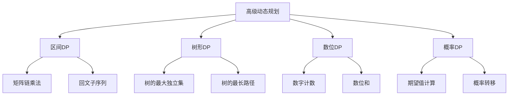

# 高级动态规划

## 📖 核心概念

**高级动态规划**是动态规划的高级应用，包括区间DP、树形DP、数位DP、概率DP等复杂问题。这些算法需要更深入的理解和更复杂的实现技巧。

### 🏗️ 高级动态规划分类



## 🔧 高级动态规划实现

### 区间DP

```cpp
class IntervalDP {
public:
    // 矩阵链乘法
    int matrixChainMultiplication(vector<int>& dimensions) {
        int n = dimensions.size() - 1;
        vector<vector<int>> dp(n, vector<int>(n, 0));
        
        for (int length = 2; length <= n; ++length) {
            for (int i = 0; i <= n - length; ++i) {
                int j = i + length - 1;
                dp[i][j] = INT_MAX;
                
                for (int k = i; k < j; ++k) {
                    int cost = dp[i][k] + dp[k + 1][j] + 
                              dimensions[i] * dimensions[k + 1] * dimensions[j + 1];
                    dp[i][j] = min(dp[i][j], cost);
                }
            }
        }
        
        return dp[0][n - 1];
    }
    
    // 回文子序列
    int longestPalindromeSubseq(string s) {
        int n = s.length();
        vector<vector<int>> dp(n, vector<int>(n, 0));
        
        // 单个字符
        for (int i = 0; i < n; ++i) {
            dp[i][i] = 1;
        }
        
        // 两个字符
        for (int i = 0; i < n - 1; ++i) {
            if (s[i] == s[i + 1]) {
                dp[i][i + 1] = 2;
            } else {
                dp[i][i + 1] = 1;
            }
        }
        
        // 长度大于2的子序列
        for (int length = 3; length <= n; ++length) {
            for (int i = 0; i <= n - length; ++i) {
                int j = i + length - 1;
                if (s[i] == s[j]) {
                    dp[i][j] = dp[i + 1][j - 1] + 2;
                } else {
                    dp[i][j] = max(dp[i + 1][j], dp[i][j - 1]);
                }
            }
        }
        
        return dp[0][n - 1];
    }
    
    // 回文子串
    string longestPalindrome(string s) {
        int n = s.length();
        vector<vector<bool>> dp(n, vector<bool>(n, false));
        
        int start = 0, maxLen = 1;
        
        // 单个字符
        for (int i = 0; i < n; ++i) {
            dp[i][i] = true;
        }
        
        // 两个字符
        for (int i = 0; i < n - 1; ++i) {
            if (s[i] == s[i + 1]) {
                dp[i][i + 1] = true;
                start = i;
                maxLen = 2;
            }
        }
        
        // 长度大于2的子串
        for (int length = 3; length <= n; ++length) {
            for (int i = 0; i <= n - length; ++i) {
                int j = i + length - 1;
                if (s[i] == s[j] && dp[i + 1][j - 1]) {
                    dp[i][j] = true;
                    start = i;
                    maxLen = length;
                }
            }
        }
        
        return s.substr(start, maxLen);
    }
    
    // 石子合并
    int stoneGame(vector<int>& stones) {
        int n = stones.size();
        vector<int> prefixSum(n + 1, 0);
        
        for (int i = 0; i < n; ++i) {
            prefixSum[i + 1] = prefixSum[i] + stones[i];
        }
        
        vector<vector<int>> dp(n, vector<int>(n, 0));
        
        for (int length = 2; length <= n; ++length) {
            for (int i = 0; i <= n - length; ++i) {
                int j = i + length - 1;
                dp[i][j] = INT_MAX;
                
                for (int k = i; k < j; ++k) {
                    int cost = dp[i][k] + dp[k + 1][j] + 
                              prefixSum[j + 1] - prefixSum[i];
                    dp[i][j] = min(dp[i][j], cost);
                }
            }
        }
        
        return dp[0][n - 1];
    }
    
    // 显示区间DP过程
    void displayMatrixChainMultiplication(vector<int>& dimensions) {
        cout << "Matrix Chain Multiplication:" << endl;
        cout << "==========================" << endl;
        
        cout << "Dimensions: ";
        for (int d : dimensions) cout << d << " ";
        cout << endl;
        
        int result = matrixChainMultiplication(dimensions);
        cout << "Minimum multiplications: " << result << endl;
    }
    
    void displayLongestPalindromeSubseq(string s) {
        cout << "Longest Palindrome Subsequence:" << endl;
        cout << "=============================" << endl;
        
        cout << "String: " << s << endl;
        
        int result = longestPalindromeSubseq(s);
        cout << "Length of longest palindrome subsequence: " << result << endl;
    }
    
    void displayLongestPalindrome(string s) {
        cout << "Longest Palindrome Substring:" << endl;
        cout << "============================" << endl;
        
        cout << "String: " << s << endl;
        
        string result = longestPalindrome(s);
        cout << "Longest palindrome substring: " << result << endl;
    }
    
    void displayStoneGame(vector<int>& stones) {
        cout << "Stone Game:" << endl;
        cout << "==========" << endl;
        
        cout << "Stones: ";
        for (int stone : stones) cout << stone << " ";
        cout << endl;
        
        int result = stoneGame(stones);
        cout << "Minimum cost: " << result << endl;
    }
};
```

### 树形DP

```cpp
class TreeDP {
private:
    struct TreeNode {
        int val;
        vector<TreeNode*> children;
        
        TreeNode(int v) : val(v) {}
    };
    
public:
    // 树的最大独立集
    pair<int, int> maxIndependentSet(TreeNode* root) {
        if (!root) return {0, 0};
        
        int include = root->val;
        int exclude = 0;
        
        for (TreeNode* child : root->children) {
            auto childResult = maxIndependentSet(child);
            include += childResult.second; // 不包含子节点
            exclude += max(childResult.first, childResult.second);
        }
        
        return {include, exclude};
    }
    
    // 树的最长路径
    int maxPathSum(TreeNode* root) {
        int maxSum = INT_MIN;
        
        function<int(TreeNode*)> dfs = [&](TreeNode* node) -> int {
            if (!node) return 0;
            
            int leftSum = max(0, dfs(node->left));
            int rightSum = max(0, dfs(node->right));
            
            maxSum = max(maxSum, node->val + leftSum + rightSum);
            
            return node->val + max(leftSum, rightSum);
        };
        
        dfs(root);
        return maxSum;
    }
    
    // 树的直径
    int diameterOfBinaryTree(TreeNode* root) {
        int maxDiameter = 0;
        
        function<int(TreeNode*)> dfs = [&](TreeNode* node) -> int {
            if (!node) return 0;
            
            int leftDepth = dfs(node->left);
            int rightDepth = dfs(node->right);
            
            maxDiameter = max(maxDiameter, leftDepth + rightDepth);
            
            return 1 + max(leftDepth, rightDepth);
        };
        
        dfs(root);
        return maxDiameter;
    }
    
    // 树的最小路径和
    int minPathSum(TreeNode* root) {
        if (!root) return 0;
        
        if (!root->left && !root->right) {
            return root->val;
        }
        
        int leftSum = root->left ? minPathSum(root->left) : INT_MAX;
        int rightSum = root->right ? minPathSum(root->right) : INT_MAX;
        
        return root->val + min(leftSum, rightSum);
    }
    
    // 显示树形DP过程
    void displayMaxIndependentSet(TreeNode* root) {
        cout << "Tree Maximum Independent Set:" << endl;
        cout << "===========================" << endl;
        
        auto result = maxIndependentSet(root);
        cout << "Include root: " << result.first << endl;
        cout << "Exclude root: " << result.second << endl;
        cout << "Maximum independent set: " << max(result.first, result.second) << endl;
    }
    
    void displayMaxPathSum(TreeNode* root) {
        cout << "Tree Maximum Path Sum:" << endl;
        cout << "====================" << endl;
        
        int result = maxPathSum(root);
        cout << "Maximum path sum: " << result << endl;
    }
    
    void displayDiameter(TreeNode* root) {
        cout << "Tree Diameter:" << endl;
        cout << "=============" << endl;
        
        int result = diameterOfBinaryTree(root);
        cout << "Diameter: " << result << endl;
    }
    
    void displayMinPathSum(TreeNode* root) {
        cout << "Tree Minimum Path Sum:" << endl;
        cout << "====================" << endl;
        
        int result = minPathSum(root);
        cout << "Minimum path sum: " << result << endl;
    }
};
```

### 数位DP

```cpp
class DigitDP {
public:
    // 数字计数
    int countNumbers(int n) {
        string num = to_string(n);
        int len = num.length();
        
        vector<vector<vector<int>>> dp(len, vector<vector<int>>(2, vector<int>(2, -1)));
        
        function<int(int, bool, bool)> dfs = [&](int pos, bool tight, bool hasNum) -> int {
            if (pos == len) return hasNum ? 1 : 0;
            
            if (dp[pos][tight][hasNum] != -1) {
                return dp[pos][tight][hasNum];
            }
            
            int limit = tight ? (num[pos] - '0') : 9;
            int result = 0;
            
            for (int digit = 0; digit <= limit; ++digit) {
                bool newTight = tight && (digit == limit);
                bool newHasNum = hasNum || (digit > 0);
                
                result += dfs(pos + 1, newTight, newHasNum);
            }
            
            return dp[pos][tight][hasNum] = result;
        };
        
        return dfs(0, true, false);
    }
    
    // 数位和
    int digitSum(int n) {
        string num = to_string(n);
        int len = num.length();
        
        vector<vector<vector<int>>> dp(len, vector<vector<int>>(2, vector<int>(200, -1)));
        
        function<int(int, bool, int)> dfs = [&](int pos, bool tight, int sum) -> int {
            if (pos == len) return sum;
            
            if (dp[pos][tight][sum] != -1) {
                return dp[pos][tight][sum];
            }
            
            int limit = tight ? (num[pos] - '0') : 9;
            int result = 0;
            
            for (int digit = 0; digit <= limit; ++digit) {
                bool newTight = tight && (digit == limit);
                int newSum = sum + digit;
                
                result += dfs(pos + 1, newTight, newSum);
            }
            
            return dp[pos][tight][sum] = result;
        };
        
        return dfs(0, true, 0);
    }
    
    // 数字中不含特定数字
    int countNumbersWithoutDigit(int n, int forbiddenDigit) {
        string num = to_string(n);
        int len = num.length();
        
        vector<vector<vector<int>>> dp(len, vector<vector<int>>(2, vector<int>(2, -1)));
        
        function<int(int, bool, bool)> dfs = [&](int pos, bool tight, bool hasNum) -> int {
            if (pos == len) return hasNum ? 1 : 0;
            
            if (dp[pos][tight][hasNum] != -1) {
                return dp[pos][tight][hasNum];
            }
            
            int limit = tight ? (num[pos] - '0') : 9;
            int result = 0;
            
            for (int digit = 0; digit <= limit; ++digit) {
                if (digit == forbiddenDigit) continue;
                
                bool newTight = tight && (digit == limit);
                bool newHasNum = hasNum || (digit > 0);
                
                result += dfs(pos + 1, newTight, newHasNum);
            }
            
            return dp[pos][tight][hasNum] = result;
        };
        
        return dfs(0, true, false);
    }
    
    // 显示数位DP过程
    void displayCountNumbers(int n) {
        cout << "Digit DP - Count Numbers:" << endl;
        cout << "=======================" << endl;
        
        cout << "Number: " << n << endl;
        
        int result = countNumbers(n);
        cout << "Count of numbers: " << result << endl;
    }
    
    void displayDigitSum(int n) {
        cout << "Digit DP - Digit Sum:" << endl;
        cout << "===================" << endl;
        
        cout << "Number: " << n << endl;
        
        int result = digitSum(n);
        cout << "Sum of digits: " << result << endl;
    }
    
    void displayCountNumbersWithoutDigit(int n, int forbiddenDigit) {
        cout << "Digit DP - Count Numbers Without Digit:" << endl;
        cout << "=====================================" << endl;
        
        cout << "Number: " << n << endl;
        cout << "Forbidden digit: " << forbiddenDigit << endl;
        
        int result = countNumbersWithoutDigit(n, forbiddenDigit);
        cout << "Count of numbers without digit " << forbiddenDigit << ": " << result << endl;
    }
};
```

### 概率DP

```cpp
class ProbabilityDP {
public:
    // 期望值计算
    double expectedValue(int n) {
        vector<double> dp(n + 1, 0.0);
        
        for (int i = 1; i <= n; ++i) {
            dp[i] = 1.0 + (1.0 / i) * dp[i - 1];
        }
        
        return dp[n];
    }
    
    // 概率转移
    double probabilityTransition(vector<vector<double>>& transitionMatrix, int steps) {
        int n = transitionMatrix.size();
        vector<vector<double>> dp(steps + 1, vector<double>(n, 0.0));
        
        // 初始状态
        dp[0][0] = 1.0;
        
        for (int step = 1; step <= steps; ++step) {
            for (int i = 0; i < n; ++i) {
                for (int j = 0; j < n; ++j) {
                    dp[step][i] += dp[step - 1][j] * transitionMatrix[j][i];
                }
            }
        }
        
        return dp[steps][n - 1];
    }
    
    // 随机游走
    double randomWalk(int n, int target) {
        vector<vector<double>> dp(n + 1, vector<double>(n + 1, 0.0));
        
        // 边界条件
        dp[0][0] = 1.0;
        
        for (int i = 1; i <= n; ++i) {
            for (int j = 0; j <= i; ++j) {
                if (j > 0) {
                    dp[i][j] += 0.5 * dp[i - 1][j - 1];
                }
                if (j < i) {
                    dp[i][j] += 0.5 * dp[i - 1][j];
                }
            }
        }
        
        return dp[n][target];
    }
    
    // 显示概率DP过程
    void displayExpectedValue(int n) {
        cout << "Probability DP - Expected Value:" << endl;
        cout << "==============================" << endl;
        
        cout << "Number: " << n << endl;
        
        double result = expectedValue(n);
        cout << "Expected value: " << result << endl;
    }
    
    void displayProbabilityTransition(vector<vector<double>>& transitionMatrix, int steps) {
        cout << "Probability DP - Probability Transition:" << endl;
        cout << "=====================================" << endl;
        
        cout << "Transition matrix:" << endl;
        for (int i = 0; i < transitionMatrix.size(); ++i) {
            for (int j = 0; j < transitionMatrix[i].size(); ++j) {
                cout << transitionMatrix[i][j] << " ";
            }
            cout << endl;
        }
        
        cout << "Steps: " << steps << endl;
        
        double result = probabilityTransition(transitionMatrix, steps);
        cout << "Probability: " << result << endl;
    }
    
    void displayRandomWalk(int n, int target) {
        cout << "Probability DP - Random Walk:" << endl;
        cout << "============================" << endl;
        
        cout << "Steps: " << n << endl;
        cout << "Target: " << target << endl;
        
        double result = randomWalk(n, target);
        cout << "Probability: " << result << endl;
    }
};
```

## 🎯 高级动态规划应用

### 复杂问题解决

```cpp
class AdvancedDPApplications {
public:
    static void solveComplexProblems() {
        cout << "Advanced Dynamic Programming Applications:" << endl;
        cout << "========================================" << endl;
        
        cout << "1. Interval DP:" << endl;
        cout << "   - Matrix Chain Multiplication" << endl;
        cout << "   - Palindrome Problems" << endl;
        cout << "   - Stone Game" << endl;
        
        cout << "2. Tree DP:" << endl;
        cout << "   - Maximum Independent Set" << endl;
        cout << "   - Maximum Path Sum" << endl;
        cout << "   - Tree Diameter" << endl;
        
        cout << "3. Digit DP:" << endl;
        cout << "   - Number Counting" << endl;
        cout << "   - Digit Sum" << endl;
        cout << "   - Constraint Problems" << endl;
        
        cout << "4. Probability DP:" << endl;
        cout << "   - Expected Value" << endl;
        cout << "   - Probability Transition" << endl;
        cout << "   - Random Walk" << endl;
    }
    
    static void analyzeComplexity() {
        cout << "Complexity Analysis:" << endl;
        cout << "==================" << endl;
        
        cout << "1. Interval DP:" << endl;
        cout << "   - Time: O(n^3)" << endl;
        cout << "   - Space: O(n^2)" << endl;
        
        cout << "2. Tree DP:" << endl;
        cout << "   - Time: O(n)" << endl;
        cout << "   - Space: O(n)" << endl;
        
        cout << "3. Digit DP:" << endl;
        cout << "   - Time: O(log n)" << endl;
        cout << "   - Space: O(log n)" << endl;
        
        cout << "4. Probability DP:" << endl;
        cout << "   - Time: O(n^2)" << endl;
        cout << "   - Space: O(n^2)" << endl;
    }
    
    static void selectAdvancedDP(string problemType, bool hasTreeStructure, bool hasDigitConstraints, bool hasProbability) {
        cout << "Advanced DP Selection:" << endl;
        cout << "=====================" << endl;
        
        cout << "Problem type: " << problemType << endl;
        cout << "Has tree structure: " << (hasTreeStructure ? "Yes" : "No") << endl;
        cout << "Has digit constraints: " << (hasDigitConstraints ? "Yes" : "No") << endl;
        cout << "Has probability: " << (hasProbability ? "Yes" : "No") << endl;
        
        cout << "Recommendation:" << endl;
        
        if (hasTreeStructure) {
            cout << "Use Tree DP" << endl;
        } else if (hasDigitConstraints) {
            cout << "Use Digit DP" << endl;
        } else if (hasProbability) {
            cout << "Use Probability DP" << endl;
        } else {
            cout << "Use Interval DP" << endl;
        }
    }
};
```

## 📊 高级动态规划分析

### 性能分析

```cpp
class AdvancedDPAnalysis {
public:
    static void analyzePerformance() {
        cout << "Advanced Dynamic Programming Performance Analysis:" << endl;
        cout << "===============================================" << endl;
        
        cout << "1. Interval DP:" << endl;
        cout << "   - Time Complexity: O(n^3)" << endl;
        cout << "   - Space Complexity: O(n^2)" << endl;
        cout << "   - Best for: Range-based problems" << endl;
        
        cout << "2. Tree DP:" << endl;
        cout << "   - Time Complexity: O(n)" << endl;
        cout << "   - Space Complexity: O(n)" << endl;
        cout << "   - Best for: Tree-based problems" << endl;
        
        cout << "3. Digit DP:" << endl;
        cout << "   - Time Complexity: O(log n)" << endl;
        cout << "   - Space Complexity: O(log n)" << endl;
        cout << "   - Best for: Number-based problems" << endl;
        
        cout << "4. Probability DP:" << endl;
        cout << "   - Time Complexity: O(n^2)" << endl;
        cout << "   - Space Complexity: O(n^2)" << endl;
        cout << "   - Best for: Probability-based problems" << endl;
    }
    
    static void analyzeSpaceComplexity() {
        cout << "Advanced Dynamic Programming Space Complexity Analysis:" << endl;
        cout << "===================================================" << endl;
        
        cout << "1. Interval DP:" << endl;
        cout << "   - DP table: O(n^2)" << endl;
        cout << "   - Total: O(n^2)" << endl;
        
        cout << "2. Tree DP:" << endl;
        cout << "   - Recursion stack: O(n)" << endl;
        cout << "   - Total: O(n)" << endl;
        
        cout << "3. Digit DP:" << endl;
        cout << "   - DP table: O(log n)" << endl;
        cout << "   - Total: O(log n)" << endl;
        
        cout << "4. Probability DP:" << endl;
        cout << "   - DP table: O(n^2)" << endl;
        cout << "   - Total: O(n^2)" << endl;
    }
    
    static void analyzeTimeComplexity() {
        cout << "Advanced Dynamic Programming Time Complexity Analysis:" << endl;
        cout << "===================================================" << endl;
        
        cout << "1. Interval DP:" << endl;
        cout << "   - Three nested loops: O(n^3)" << endl;
        cout << "   - State transitions: O(n)" << endl;
        
        cout << "2. Tree DP:" << endl;
        cout << "   - Single tree traversal: O(n)" << endl;
        cout << "   - State transitions: O(1)" << endl;
        
        cout << "3. Digit DP:" << endl;
        cout << "   - Digit processing: O(log n)" << endl;
        cout << "   - State transitions: O(1)" << endl;
        
        cout << "4. Probability DP:" << endl;
        cout << "   - Two nested loops: O(n^2)" << endl;
        cout << "   - State transitions: O(n)" << endl;
    }
};
```

## 🎮 高级动态规划测试

### 1. 基础功能测试

```cpp
class AdvancedDPTest {
public:
    static void testIntervalDP() {
        cout << "Testing Interval DP:" << endl;
        cout << "==================" << endl;
        
        IntervalDP intervalDP;
        
        vector<int> dimensions = {1, 2, 3, 4, 5};
        intervalDP.displayMatrixChainMultiplication(dimensions);
        
        intervalDP.displayLongestPalindromeSubseq("bbbab");
        intervalDP.displayLongestPalindrome("babad");
        
        vector<int> stones = {3, 4, 5, 6};
        intervalDP.displayStoneGame(stones);
    }
    
    static void testTreeDP() {
        cout << "Testing Tree DP:" << endl;
        cout << "==============" << endl;
        
        TreeDP treeDP;
        
        // 创建测试树
        TreeNode* root = new TreeNode(1);
        root->left = new TreeNode(2);
        root->right = new TreeNode(3);
        root->left->left = new TreeNode(4);
        root->left->right = new TreeNode(5);
        
        treeDP.displayMaxIndependentSet(root);
        treeDP.displayMaxPathSum(root);
        treeDP.displayDiameter(root);
        treeDP.displayMinPathSum(root);
    }
    
    static void testDigitDP() {
        cout << "Testing Digit DP:" << endl;
        cout << "===============" << endl;
        
        DigitDP digitDP;
        
        digitDP.displayCountNumbers(100);
        digitDP.displayDigitSum(100);
        digitDP.displayCountNumbersWithoutDigit(100, 4);
    }
    
    static void testProbabilityDP() {
        cout << "Testing Probability DP:" << endl;
        cout << "=====================" << endl;
        
        ProbabilityDP probabilityDP;
        
        probabilityDP.displayExpectedValue(10);
        
        vector<vector<double>> transitionMatrix = {
            {0.5, 0.5},
            {0.3, 0.7}
        };
        probabilityDP.displayProbabilityTransition(transitionMatrix, 5);
        
        probabilityDP.displayRandomWalk(10, 5);
    }
    
    static void testApplications() {
        cout << "Testing Applications:" << endl;
        cout << "==================" << endl;
        
        AdvancedDPApplications::solveComplexProblems();
        AdvancedDPApplications::analyzeComplexity();
        AdvancedDPApplications::selectAdvancedDP("Interval", false, false, false);
    }
    
    static void testAnalysis() {
        cout << "Testing Analysis:" << endl;
        cout << "===============" << endl;
        
        AdvancedDPAnalysis::analyzePerformance();
        AdvancedDPAnalysis::analyzeSpaceComplexity();
        AdvancedDPAnalysis::analyzeTimeComplexity();
    }
};
```

## 🔗 相关链接

- [[01-动态规划基础|动态规划基础]]
- [[02-动态规划优化|动态规划优化]]

## 💡 高级动态规划要点

1. **区间DP**: 处理区间相关的问题，O(n³)时间复杂度
2. **树形DP**: 处理树结构问题，O(n)时间复杂度
3. **数位DP**: 处理数字相关问题，O(log n)时间复杂度
4. **概率DP**: 处理概率相关问题，O(n²)时间复杂度

---

*📝 高级动态规划提示：高级动态规划是解决复杂问题的重要方法，掌握这些高级技巧有助于解决更困难的问题*
