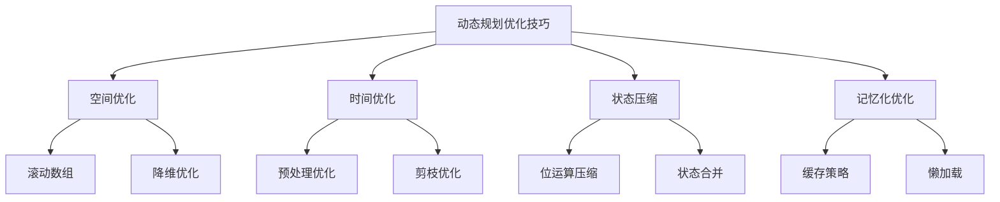

# 动态规划优化技巧

## 📖 核心概念

**动态规划优化技巧**是提高DP算法效率的重要方法，包括空间优化、时间优化、状态压缩、记忆化等。这些技巧能够显著改善算法的性能。

### 🏗️ 优化技巧分类



## 🔧 优化技巧实现

### 空间优化技巧

```cpp
class DPSpaceOptimization {
public:
    // 滚动数组优化
    int fibonacciRolling(int n) {
        if (n <= 1) return n;
        
        int prev2 = 0, prev1 = 1;
        for (int i = 2; i <= n; ++i) {
            int current = prev1 + prev2;
            prev2 = prev1;
            prev1 = current;
        }
        
        return prev1;
    }
    
    // 0-1背包空间优化
    int knapsackSpaceOptimized(vector<int>& weights, vector<int>& values, int capacity) {
        int n = weights.size();
        vector<int> dp(capacity + 1, 0);
        
        for (int i = 0; i < n; ++i) {
            for (int w = capacity; w >= weights[i]; --w) {
                dp[w] = max(dp[w], dp[w - weights[i]] + values[i]);
            }
        }
        
        return dp[capacity];
    }
    
    // LCS空间优化
    int lcsSpaceOptimized(string text1, string text2) {
        int m = text1.length();
        int n = text2.length();
        
        if (m < n) {
            swap(text1, text2);
            swap(m, n);
        }
        
        vector<int> prev(n + 1, 0);
        vector<int> curr(n + 1, 0);
        
        for (int i = 1; i <= m; ++i) {
            for (int j = 1; j <= n; ++j) {
                if (text1[i - 1] == text2[j - 1]) {
                    curr[j] = prev[j - 1] + 1;
                } else {
                    curr[j] = max(prev[j], curr[j - 1]);
                }
            }
            prev = curr;
        }
        
        return curr[n];
    }
    
    // 编辑距离空间优化
    int editDistanceSpaceOptimized(string word1, string word2) {
        int m = word1.length();
        int n = word2.length();
        
        if (m < n) {
            swap(word1, word2);
            swap(m, n);
        }
        
        vector<int> prev(n + 1);
        vector<int> curr(n + 1);
        
        for (int j = 0; j <= n; ++j) {
            prev[j] = j;
        }
        
        for (int i = 1; i <= m; ++i) {
            curr[0] = i;
            for (int j = 1; j <= n; ++j) {
                if (word1[i - 1] == word2[j - 1]) {
                    curr[j] = prev[j - 1];
                } else {
                    curr[j] = 1 + min({prev[j], curr[j - 1], prev[j - 1]});
                }
            }
            prev = curr;
        }
        
        return curr[n];
    }
    
    // 显示空间优化过程
    void displaySpaceOptimization() {
        cout << "Space Optimization Techniques:" << endl;
        cout << "============================" << endl;
        
        cout << "1. Rolling Array:" << endl;
        cout << "   - Fibonacci: O(1) space instead of O(n)" << endl;
        cout << "   - Reuse array space" << endl;
        
        cout << "2. Dimension Reduction:" << endl;
        cout << "   - 0-1 Knapsack: O(W) space instead of O(N*W)" << endl;
        cout << "   - LCS: O(min(m,n)) space instead of O(m*n)" << endl;
        
        cout << "3. Space-Time Tradeoff:" << endl;
        cout << "   - Reduce space complexity" << endl;
        cout << "   - Maintain time complexity" << endl;
    }
};
```

### 时间优化技巧

```cpp
class DPTimeOptimization {
public:
    // 预处理优化
    int longestPalindromeSubseqOptimized(string s) {
        int n = s.length();
        vector<vector<int>> dp(n, vector<int>(n, 0));
        
        // 预处理：单个字符
        for (int i = 0; i < n; ++i) {
            dp[i][i] = 1;
        }
        
        // 预处理：两个字符
        for (int i = 0; i < n - 1; ++i) {
            if (s[i] == s[i + 1]) {
                dp[i][i + 1] = 2;
            } else {
                dp[i][i + 1] = 1;
            }
        }
        
        // 动态规划
        for (int length = 3; length <= n; ++length) {
            for (int i = 0; i <= n - length; ++i) {
                int j = i + length - 1;
                if (s[i] == s[j]) {
                    dp[i][j] = dp[i + 1][j - 1] + 2;
                } else {
                    dp[i][j] = max(dp[i + 1][j], dp[i][j - 1]);
                }
            }
        }
        
        return dp[0][n - 1];
    }
    
    // 剪枝优化
    int coinChangeOptimized(vector<int>& coins, int amount) {
        if (amount == 0) return 0;
        
        vector<int> dp(amount + 1, INT_MAX);
        dp[0] = 0;
        
        for (int i = 1; i <= amount; ++i) {
            for (int coin : coins) {
                if (coin <= i && dp[i - coin] != INT_MAX) {
                    dp[i] = min(dp[i], dp[i - coin] + 1);
                }
            }
        }
        
        return dp[amount] == INT_MAX ? -1 : dp[amount];
    }
    
    // 状态转移优化
    int uniquePathsOptimized(int m, int n) {
        vector<int> dp(n, 1);
        
        for (int i = 1; i < m; ++i) {
            for (int j = 1; j < n; ++j) {
                dp[j] += dp[j - 1];
            }
        }
        
        return dp[n - 1];
    }
    
    // 显示时间优化过程
    void displayTimeOptimization() {
        cout << "Time Optimization Techniques:" << endl;
        cout << "===========================" << endl;
        
        cout << "1. Preprocessing:" << endl;
        cout << "   - Initialize base cases" << endl;
        cout << "   - Reduce computation time" << endl;
        
        cout << "2. Pruning:" << endl;
        cout << "   - Skip impossible states" << endl;
        cout << "   - Early termination" << endl;
        
        cout << "3. State Transition Optimization:" << endl;
        cout << "   - Optimize state updates" << endl;
        cout << "   - Reduce redundant calculations" << endl;
    }
};
```

### 状态压缩技巧

```cpp
class DPStateCompression {
public:
    // 位运算状态压缩
    int tspStateCompression(vector<vector<int>>& graph) {
        int n = graph.size();
        int mask = 1 << n;
        
        vector<vector<int>> dp(mask, vector<int>(n, INT_MAX));
        dp[1][0] = 0; // 从城市0开始
        
        for (int s = 1; s < mask; ++s) {
            for (int u = 0; u < n; ++u) {
                if (dp[s][u] == INT_MAX) continue;
                
                for (int v = 0; v < n; ++v) {
                    if (!(s & (1 << v))) {
                        int newMask = s | (1 << v);
                        dp[newMask][v] = min(dp[newMask][v], dp[s][u] + graph[u][v]);
                    }
                }
            }
        }
        
        int result = INT_MAX;
        int fullMask = mask - 1;
        for (int i = 1; i < n; ++i) {
            if (dp[fullMask][i] != INT_MAX) {
                result = min(result, dp[fullMask][i] + graph[i][0]);
            }
        }
        
        return result;
    }
    
    // 数位DP状态压缩
    int digitDPStateCompression(int n) {
        string num = to_string(n);
        int len = num.length();
        
        vector<vector<vector<int>>> dp(len, vector<vector<int>>(2, vector<int>(2, -1)));
        
        function<int(int, bool, bool)> dfs = [&](int pos, bool tight, bool hasNum) -> int {
            if (pos == len) return hasNum ? 1 : 0;
            
            if (dp[pos][tight][hasNum] != -1) {
                return dp[pos][tight][hasNum];
            }
            
            int limit = tight ? (num[pos] - '0') : 9;
            int result = 0;
            
            for (int digit = 0; digit <= limit; ++digit) {
                bool newTight = tight && (digit == limit);
                bool newHasNum = hasNum || (digit > 0);
                
                result += dfs(pos + 1, newTight, newHasNum);
            }
            
            return dp[pos][tight][hasNum] = result;
        };
        
        return dfs(0, true, false);
    }
    
    // 轮廓线DP
    int contourLineDP(int m, int n) {
        vector<vector<int>> dp(2, vector<int>(1 << n, 0));
        dp[0][0] = 1;
        
        for (int i = 0; i < m; ++i) {
            for (int j = 0; j < n; ++j) {
                int curr = i * n + j;
                int next = curr + 1;
                
                for (int mask = 0; mask < (1 << n); ++mask) {
                    if (dp[curr & 1][mask] == 0) continue;
                    
                    int newMask = mask;
                    if (j > 0 && (mask & (1 << (j - 1)))) {
                        newMask ^= (1 << (j - 1));
                    }
                    
                    dp[next & 1][newMask] += dp[curr & 1][mask];
                }
            }
        }
        
        return dp[(m * n) & 1][0];
    }
    
    // 显示状态压缩过程
    void displayStateCompression() {
        cout << "State Compression Techniques:" << endl;
        cout << "===========================" << endl;
        
        cout << "1. Bit Manipulation:" << endl;
        cout << "   - Use bits to represent states" << endl;
        cout << "   - Reduce state space" << endl;
        
        cout << "2. Digit DP:" << endl;
        cout << "   - Compress digit states" << endl;
        cout << "   - Handle number constraints" << endl;
        
        cout << "3. Contour Line DP:" << endl;
        cout << "   - Compress grid states" << endl;
        cout << "   - Handle connectivity" << endl;
    }
};
```

### 记忆化优化

```cpp
class DPMemoizationOptimization {
private:
    unordered_map<string, int> memo;
    
public:
    // 记忆化斐波那契
    int fibonacciMemo(int n) {
        if (n <= 1) return n;
        
        string key = to_string(n);
        if (memo.find(key) != memo.end()) {
            return memo[key];
        }
        
        int result = fibonacciMemo(n - 1) + fibonacciMemo(n - 2);
        memo[key] = result;
        return result;
    }
    
    // 记忆化LCS
    int lcsMemo(string& s1, string& s2, int i, int j) {
        if (i == 0 || j == 0) return 0;
        
        string key = to_string(i) + "," + to_string(j);
        if (memo.find(key) != memo.end()) {
            return memo[key];
        }
        
        int result;
        if (s1[i - 1] == s2[j - 1]) {
            result = 1 + lcsMemo(s1, s2, i - 1, j - 1);
        } else {
            result = max(lcsMemo(s1, s2, i - 1, j), lcsMemo(s1, s2, i, j - 1));
        }
        
        memo[key] = result;
        return result;
    }
    
    // 记忆化背包问题
    int knapsackMemo(vector<int>& weights, vector<int>& values, int capacity, int index) {
        if (index < 0 || capacity <= 0) return 0;
        
        string key = to_string(index) + "," + to_string(capacity);
        if (memo.find(key) != memo.end()) {
            return memo[key];
        }
        
        int result;
        if (weights[index] > capacity) {
            result = knapsackMemo(weights, values, capacity, index - 1);
        } else {
            int include = values[index] + knapsackMemo(weights, values, capacity - weights[index], index - 1);
            int exclude = knapsackMemo(weights, values, capacity, index - 1);
            result = max(include, exclude);
        }
        
        memo[key] = result;
        return result;
    }
    
    // 清除记忆
    void clearMemo() {
        memo.clear();
    }
    
    // 显示记忆状态
    void displayMemo() {
        cout << "Memoization Cache:" << endl;
        cout << "=================" << endl;
        
        for (auto& pair : memo) {
            cout << pair.first << " -> " << pair.second << endl;
        }
        
        cout << "Cache size: " << memo.size() << endl;
    }
    
    // 显示记忆化优化过程
    void displayMemoizationOptimization() {
        cout << "Memoization Optimization Techniques:" << endl;
        cout << "==================================" << endl;
        
        cout << "1. Cache Strategy:" << endl;
        cout << "   - Store computed results" << endl;
        cout << "   - Avoid redundant calculations" << endl;
        
        cout << "2. Lazy Loading:" << endl;
        cout << "   - Compute on demand" << endl;
        cout << "   - Save memory space" << endl;
        
        cout << "3. Cache Management:" << endl;
        cout << "   - LRU cache" << endl;
        cout << "   - Memory optimization" << endl;
    }
};
```

## 🎯 优化技巧应用

### 性能提升策略

```cpp
class DPOptimizationApplications {
public:
    static void demonstrateOptimizations() {
        cout << "DP Optimization Applications:" << endl;
        cout << "===========================" << endl;
        
        cout << "1. Space Optimization:" << endl;
        cout << "   - Reduce memory usage" << endl;
        cout << "   - Improve cache performance" << endl;
        cout << "   - Handle large datasets" << endl;
        
        cout << "2. Time Optimization:" << endl;
        cout << "   - Reduce computation time" << endl;
        cout << "   - Optimize state transitions" << endl;
        cout << "   - Implement pruning" << endl;
        
        cout << "3. State Compression:" << endl;
        cout << "   - Compress state space" << endl;
        cout << "   - Handle complex states" << endl;
        cout << "   - Use bit manipulation" << endl;
        
        cout << "4. Memoization:" << endl;
        cout << "   - Cache computed results" << endl;
        cout << "   - Avoid redundant calculations" << endl;
        cout << "   - Improve recursive performance" << endl;
    }
    
    static void analyzePerformanceGains() {
        cout << "Performance Gains Analysis:" << endl;
        cout << "=========================" << endl;
        
        cout << "1. Space Optimization:" << endl;
        cout << "   - Fibonacci: O(n) -> O(1)" << endl;
        cout << "   - Knapsack: O(N*W) -> O(W)" << endl;
        cout << "   - LCS: O(m*n) -> O(min(m,n))" << endl;
        
        cout << "2. Time Optimization:" << endl;
        cout << "   - Preprocessing: Reduce setup time" << endl;
        cout << "   - Pruning: Skip impossible states" << endl;
        cout << "   - State transition: Optimize updates" << endl;
        
        cout << "3. State Compression:" << endl;
        cout << "   - TSP: O(n!) -> O(n*2^n)" << endl;
        cout << "   - Digit DP: O(n) -> O(log n)" << endl;
        cout << "   - Contour Line: O(m*n*2^n) -> O(2^n)" << endl;
        
        cout << "4. Memoization:" << endl;
        cout << "   - Fibonacci: O(2^n) -> O(n)" << endl;
        cout << "   - LCS: O(2^max(m,n)) -> O(m*n)" << endl;
        cout << "   - Knapsack: O(2^n) -> O(n*W)" << endl;
    }
    
    static void selectOptimization(bool needsSpaceOptimization, bool needsTimeOptimization, bool hasComplexStates, bool hasRecursiveStructure) {
        cout << "Optimization Selection:" << endl;
        cout << "=====================" << endl;
        
        cout << "Needs space optimization: " << (needsSpaceOptimization ? "Yes" : "No") << endl;
        cout << "Needs time optimization: " << (needsTimeOptimization ? "Yes" : "No") << endl;
        cout << "Has complex states: " << (hasComplexStates ? "Yes" : "No") << endl;
        cout << "Has recursive structure: " << (hasRecursiveStructure ? "Yes" : "No") << endl;
        
        cout << "Recommendation:" << endl;
        
        if (needsSpaceOptimization) {
            cout << "Use Space Optimization (rolling array, dimension reduction)" << endl;
        } else if (needsTimeOptimization) {
            cout << "Use Time Optimization (preprocessing, pruning)" << endl;
        } else if (hasComplexStates) {
            cout << "Use State Compression (bit manipulation, state merging)" << endl;
        } else if (hasRecursiveStructure) {
            cout << "Use Memoization (cache computed results)" << endl;
        } else {
            cout << "Use Basic DP (no optimization needed)" << endl;
        }
    }
};
```

## 📊 优化技巧分析

### 性能分析

```cpp
class DPOptimizationAnalysis {
public:
    static void analyzePerformance() {
        cout << "DP Optimization Performance Analysis:" << endl;
        cout << "===================================" << endl;
        
        cout << "1. Space Optimization:" << endl;
        cout << "   - Time Complexity: Same as original" << endl;
        cout << "   - Space Complexity: Reduced" << endl;
        cout << "   - Memory Usage: Lower" << endl;
        cout << "   - Cache Performance: Better" << endl;
        
        cout << "2. Time Optimization:" << endl;
        cout << "   - Time Complexity: Improved" << endl;
        cout << "   - Space Complexity: Same as original" << endl;
        cout << "   - Computation Time: Reduced" << endl;
        cout << "   - Algorithm Efficiency: Higher" << endl;
        
        cout << "3. State Compression:" << endl;
        cout << "   - Time Complexity: Same as original" << endl;
        cout << "   - Space Complexity: Reduced" << endl;
        cout << "   - State Space: Compressed" << endl;
        cout << "   - Bit Operations: Additional overhead" << endl;
        
        cout << "4. Memoization:" << endl;
        cout << "   - Time Complexity: Improved" << endl;
        cout << "   - Space Complexity: Increased" << endl;
        cout << "   - Memory Usage: Higher" << endl;
        cout << "   - Cache Performance: Depends on hit rate" << endl;
    }
    
    static void analyzeSpaceComplexity() {
        cout << "DP Optimization Space Complexity Analysis:" << endl;
        cout << "=======================================" << endl;
        
        cout << "1. Space Optimization:" << endl;
        cout << "   - Original: O(m*n)" << endl;
        cout << "   - Optimized: O(min(m,n))" << endl;
        cout << "   - Reduction: Significant" << endl;
        
        cout << "2. Time Optimization:" << endl;
        cout << "   - Original: O(m*n)" << endl;
        cout << "   - Optimized: O(m*n)" << endl;
        cout << "   - Reduction: None" << endl;
        
        cout << "3. State Compression:" << endl;
        cout << "   - Original: O(n*2^n)" << endl;
        cout << "   - Optimized: O(2^n)" << endl;
        cout << "   - Reduction: Significant" << endl;
        
        cout << "4. Memoization:" << endl;
        cout << "   - Original: O(n)" << endl;
        cout << "   - Optimized: O(n) + cache" << endl;
        cout << "   - Reduction: None (space for time)" << endl;
    }
    
    static void analyzeTimeComplexity() {
        cout << "DP Optimization Time Complexity Analysis:" << endl;
        cout << "=======================================" << endl;
        
        cout << "1. Space Optimization:" << endl;
        cout << "   - Original: O(m*n)" << endl;
        cout << "   - Optimized: O(m*n)" << endl;
        cout << "   - Change: None" << endl;
        
        cout << "2. Time Optimization:" << endl;
        cout << "   - Original: O(m*n)" << endl;
        cout << "   - Optimized: O(m*n)" << endl;
        cout << "   - Change: None (but faster)" << endl;
        
        cout << "3. State Compression:" << endl;
        cout << "   - Original: O(n*2^n)" << endl;
        cout << "   - Optimized: O(n*2^n)" << endl;
        cout << "   - Change: None" << endl;
        
        cout << "4. Memoization:" << endl;
        cout << "   - Original: O(2^n)" << endl;
        cout << "   - Optimized: O(n)" << endl;
        cout << "   - Change: Significant improvement" << endl;
    }
};
```

## 🎮 优化技巧测试

### 1. 基础功能测试

```cpp
class DPOptimizationTest {
public:
    static void testSpaceOptimization() {
        cout << "Testing Space Optimization:" << endl;
        cout << "=========================" << endl;
        
        DPSpaceOptimization spaceOpt;
        
        cout << "Fibonacci (n=10): " << spaceOpt.fibonacciRolling(10) << endl;
        
        vector<int> weights = {1, 3, 4, 5};
        vector<int> values = {1, 4, 5, 7};
        int capacity = 7;
        cout << "Knapsack: " << spaceOpt.knapsackSpaceOptimized(weights, values, capacity) << endl;
        
        cout << "LCS: " << spaceOpt.lcsSpaceOptimized("abcde", "ace") << endl;
        cout << "Edit Distance: " << spaceOpt.editDistanceSpaceOptimized("horse", "ros") << endl;
        
        spaceOpt.displaySpaceOptimization();
    }
    
    static void testTimeOptimization() {
        cout << "Testing Time Optimization:" << endl;
        cout << "========================" << endl;
        
        DPTimeOptimization timeOpt;
        
        cout << "Longest Palindrome Subseq: " << timeOpt.longestPalindromeSubseqOptimized("bbbab") << endl;
        
        vector<int> coins = {1, 3, 4};
        int amount = 6;
        cout << "Coin Change: " << timeOpt.coinChangeOptimized(coins, amount) << endl;
        
        cout << "Unique Paths: " << timeOpt.uniquePathsOptimized(3, 7) << endl;
        
        timeOpt.displayTimeOptimization();
    }
    
    static void testStateCompression() {
        cout << "Testing State Compression:" << endl;
        cout << "========================" << endl;
        
        DPStateCompression stateComp;
        
        vector<vector<int>> graph = {
            {0, 10, 15, 20},
            {10, 0, 35, 25},
            {15, 35, 0, 30},
            {20, 25, 30, 0}
        };
        
        cout << "TSP: " << stateComp.tspStateCompression(graph) << endl;
        cout << "Digit DP: " << stateComp.digitDPStateCompression(100) << endl;
        cout << "Contour Line DP: " << stateComp.contourLineDP(3, 3) << endl;
        
        stateComp.displayStateCompression();
    }
    
    static void testMemoizationOptimization() {
        cout << "Testing Memoization Optimization:" << endl;
        cout << "=================================" << endl;
        
        DPMemoizationOptimization memoOpt;
        
        cout << "Fibonacci (n=10): " << memoOpt.fibonacciMemo(10) << endl;
        
        string s1 = "abcde", s2 = "ace";
        cout << "LCS: " << memoOpt.lcsMemo(s1, s2, s1.length(), s2.length()) << endl;
        
        vector<int> weights = {1, 3, 4, 5};
        vector<int> values = {1, 4, 5, 7};
        int capacity = 7;
        cout << "Knapsack: " << memoOpt.knapsackMemo(weights, values, capacity, weights.size() - 1) << endl;
        
        memoOpt.displayMemo();
        memoOpt.displayMemoizationOptimization();
    }
    
    static void testApplications() {
        cout << "Testing Applications:" << endl;
        cout << "==================" << endl;
        
        DPOptimizationApplications::demonstrateOptimizations();
        DPOptimizationApplications::analyzePerformanceGains();
        DPOptimizationApplications::selectOptimization(true, false, false, false);
    }
    
    static void testAnalysis() {
        cout << "Testing Analysis:" << endl;
        cout << "===============" << endl;
        
        DPOptimizationAnalysis::analyzePerformance();
        DPOptimizationAnalysis::analyzeSpaceComplexity();
        DPOptimizationAnalysis::analyzeTimeComplexity();
    }
};
```

## 🔗 相关链接

- [[01-动态规划基础|动态规划基础]]
- [[02-动态规划优化|动态规划优化]]
- [[03-最长公共子序列|最长公共子序列]]

## 💡 优化技巧要点

1. **空间优化**: 使用滚动数组和降维技术减少空间复杂度
2. **时间优化**: 通过预处理和剪枝提高算法效率
3. **状态压缩**: 使用位运算和状态合并压缩状态空间
4. **记忆化**: 缓存计算结果避免重复计算

---

*📝 优化技巧提示：动态规划优化技巧是提高算法性能的重要方法，掌握这些技巧有助于解决大规模问题*
