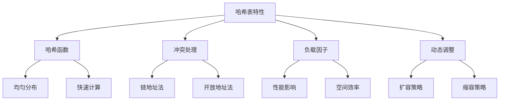

# 哈希宇宙

## 📖 核心概念

**哈希表**是一种基于哈希函数实现的数据结构，提供平均O(1)的查找、插入和删除操作。哈希表是现代计算机系统中最重要的数据结构之一。

### 🏗️ 哈希表特性



## 🔧 哈希表实现

### 链地址法

```cpp
class HashTableChaining {
private:
    struct Node {
        int key;
        int value;
        Node* next;
        
        Node(int k, int v) : key(k), value(v), next(nullptr) {}
    };
    
    vector<Node*> buckets;
    int capacity;
    int size;
    double loadFactor;
    
    int hash(int key) {
        return key % capacity;
    }
    
    void resize() {
        int oldCapacity = capacity;
        capacity *= 2;
        vector<Node*> newBuckets(capacity, nullptr);
        
        for (int i = 0; i < oldCapacity; ++i) {
            Node* current = buckets[i];
            while (current) {
                Node* next = current->next;
                int newIndex = hash(current->key);
                current->next = newBuckets[newIndex];
                newBuckets[newIndex] = current;
                current = next;
            }
        }
        
        buckets = newBuckets;
    }
    
public:
    HashTableChaining(int cap = 16) : capacity(cap), size(0), loadFactor(0.75) {
        buckets.resize(capacity, nullptr);
    }
    
    ~HashTableChaining() {
        for (int i = 0; i < capacity; ++i) {
            Node* current = buckets[i];
            while (current) {
                Node* next = current->next;
                delete current;
                current = next;
            }
        }
    }
    
    void put(int key, int value) {
        int index = hash(key);
        Node* current = buckets[index];
        
        // 查找是否已存在
        while (current) {
            if (current->key == key) {
                current->value = value;
                return;
            }
            current = current->next;
        }
        
        // 插入新节点
        Node* newNode = new Node(key, value);
        newNode->next = buckets[index];
        buckets[index] = newNode;
        size++;
        
        // 检查负载因子
        if ((double)size / capacity > loadFactor) {
            resize();
        }
    }
    
    int get(int key) {
        int index = hash(key);
        Node* current = buckets[index];
        
        while (current) {
            if (current->key == key) {
                return current->value;
            }
            current = current->next;
        }
        
        return -1;  // 未找到
    }
    
    bool remove(int key) {
        int index = hash(key);
        Node* current = buckets[index];
        Node* prev = nullptr;
        
        while (current) {
            if (current->key == key) {
                if (prev) {
                    prev->next = current->next;
                } else {
                    buckets[index] = current->next;
                }
                delete current;
                size--;
                return true;
            }
            prev = current;
            current = current->next;
        }
        
        return false;
    }
    
    bool contains(int key) {
        return get(key) != -1;
    }
    
    int getSize() {
        return size;
    }
    
    bool isEmpty() {
        return size == 0;
    }
};
```

### 开放地址法

```cpp
class HashTableOpenAddressing {
private:
    enum EntryType { EMPTY, OCCUPIED, DELETED };
    
    struct Entry {
        int key;
        int value;
        EntryType type;
        
        Entry() : key(0), value(0), type(EMPTY) {}
    };
    
    vector<Entry> buckets;
    int capacity;
    int size;
    double loadFactor;
    
    int hash(int key) {
        return key % capacity;
    }
    
    int linearProbe(int key, int startIndex) {
        int index = startIndex;
        do {
            if (buckets[index].type == EMPTY || 
                (buckets[index].type == OCCUPIED && buckets[index].key == key)) {
                return index;
            }
            index = (index + 1) % capacity;
        } while (index != startIndex);
        
        return -1;  // 表满
    }
    
    int quadraticProbe(int key, int startIndex) {
        int index = startIndex;
        for (int i = 0; i < capacity; ++i) {
            int probeIndex = (startIndex + i * i) % capacity;
            if (buckets[probeIndex].type == EMPTY || 
                (buckets[probeIndex].type == OCCUPIED && buckets[probeIndex].key == key)) {
                return probeIndex;
            }
        }
        return -1;
    }
    
    void resize() {
        int oldCapacity = capacity;
        capacity *= 2;
        vector<Entry> oldBuckets = buckets;
        
        buckets.clear();
        buckets.resize(capacity);
        size = 0;
        
        for (int i = 0; i < oldCapacity; ++i) {
            if (oldBuckets[i].type == OCCUPIED) {
                put(oldBuckets[i].key, oldBuckets[i].value);
            }
        }
    }
    
public:
    HashTableOpenAddressing(int cap = 16) : capacity(cap), size(0), loadFactor(0.75) {
        buckets.resize(capacity);
    }
    
    void put(int key, int value) {
        int index = hash(key);
        int targetIndex = linearProbe(key, index);
        
        if (targetIndex == -1) {
            resize();
            put(key, value);
            return;
        }
        
        if (buckets[targetIndex].type == EMPTY) {
            size++;
        }
        
        buckets[targetIndex].key = key;
        buckets[targetIndex].value = value;
        buckets[targetIndex].type = OCCUPIED;
        
        // 检查负载因子
        if ((double)size / capacity > loadFactor) {
            resize();
        }
    }
    
    int get(int key) {
        int index = hash(key);
        int startIndex = index;
        
        do {
            if (buckets[index].type == EMPTY) {
                return -1;
            }
            if (buckets[index].type == OCCUPIED && buckets[index].key == key) {
                return buckets[index].value;
            }
            index = (index + 1) % capacity;
        } while (index != startIndex);
        
        return -1;
    }
    
    bool remove(int key) {
        int index = hash(key);
        int startIndex = index;
        
        do {
            if (buckets[index].type == EMPTY) {
                return false;
            }
            if (buckets[index].type == OCCUPIED && buckets[index].key == key) {
                buckets[index].type = DELETED;
                size--;
                return true;
            }
            index = (index + 1) % capacity;
        } while (index != startIndex);
        
        return false;
    }
    
    bool contains(int key) {
        return get(key) != -1;
    }
    
    int getSize() {
        return size;
    }
    
    bool isEmpty() {
        return size == 0;
    }
};
```

## 🎯 哈希函数

### 基本哈希函数

```cpp
class HashFunctions {
public:
    // 除法哈希
    static int divisionHash(int key, int tableSize) {
        return key % tableSize;
    }
    
    // 乘法哈希
    static int multiplicationHash(int key, int tableSize) {
        double A = 0.6180339887;  // (sqrt(5) - 1) / 2
        return (int)(tableSize * (key * A - (int)(key * A)));
    }
    
    // 字符串哈希
    static int stringHash(const string& str, int tableSize) {
        int hash = 0;
        for (char c : str) {
            hash = (hash * 31 + c) % tableSize;
        }
        return hash;
    }
    
    // DJB2哈希
    static int djb2Hash(const string& str, int tableSize) {
        int hash = 5381;
        for (char c : str) {
            hash = ((hash << 5) + hash) + c;
        }
        return abs(hash) % tableSize;
    }
    
    // FNV哈希
    static int fnvHash(const string& str, int tableSize) {
        int hash = 2166136261;
        for (char c : str) {
            hash ^= c;
            hash *= 16777619;
        }
        return abs(hash) % tableSize;
    }
    
    // 双重哈希
    static int doubleHash(int key, int tableSize, int attempt) {
        int hash1 = key % tableSize;
        int hash2 = 1 + (key % (tableSize - 1));
        return (hash1 + attempt * hash2) % tableSize;
    }
};
```

### 一致性哈希

```cpp
class ConsistentHash {
private:
    map<int, string> circle;
    int replicas;
    
    int hash(const string& key) {
        hash<string> hasher;
        return hasher(key);
    }
    
public:
    ConsistentHash(int rep = 100) : replicas(rep) {}
    
    void addNode(const string& node) {
        for (int i = 0; i < replicas; ++i) {
            string virtualNode = node + "#" + to_string(i);
            int hashValue = hash(virtualNode);
            circle[hashValue] = node;
        }
    }
    
    void removeNode(const string& node) {
        for (int i = 0; i < replicas; ++i) {
            string virtualNode = node + "#" + to_string(i);
            int hashValue = hash(virtualNode);
            circle.erase(hashValue);
        }
    }
    
    string getNode(const string& key) {
        if (circle.empty()) return "";
        
        int hashValue = hash(key);
        auto it = circle.lower_bound(hashValue);
        
        if (it == circle.end()) {
            it = circle.begin();
        }
        
        return it->second;
    }
    
    void displayCircle() {
        for (const auto& pair : circle) {
            cout << "Hash: " << pair.first << " -> Node: " << pair.second << endl;
        }
    }
};
```

## 📊 哈希表应用

### 1. LRU缓存

```cpp
class LRUCache {
private:
    struct Node {
        int key, value;
        Node* prev, *next;
        
        Node(int k, int v) : key(k), value(v), prev(nullptr), next(nullptr) {}
    };
    
    unordered_map<int, Node*> cache;
    Node* head, *tail;
    int capacity;
    
    void addToHead(Node* node) {
        node->prev = head;
        node->next = head->next;
        head->next->prev = node;
        head->next = node;
    }
    
    void removeNode(Node* node) {
        node->prev->next = node->next;
        node->next->prev = node->prev;
    }
    
    void moveToHead(Node* node) {
        removeNode(node);
        addToHead(node);
    }
    
    Node* removeTail() {
        Node* lastNode = tail->prev;
        removeNode(lastNode);
        return lastNode;
    }
    
public:
    LRUCache(int cap) : capacity(cap) {
        head = new Node(0, 0);
        tail = new Node(0, 0);
        head->next = tail;
        tail->prev = head;
    }
    
    int get(int key) {
        if (cache.find(key) != cache.end()) {
            Node* node = cache[key];
            moveToHead(node);
            return node->value;
        }
        return -1;
    }
    
    void put(int key, int value) {
        if (cache.find(key) != cache.end()) {
            Node* node = cache[key];
            node->value = value;
            moveToHead(node);
        } else {
            Node* newNode = new Node(key, value);
            
            if (cache.size() >= capacity) {
                Node* tailNode = removeTail();
                cache.erase(tailNode->key);
                delete tailNode;
            }
            
            cache[key] = newNode;
            addToHead(newNode);
        }
    }
};
```

### 2. 布隆过滤器

```cpp
class BloomFilter {
private:
    vector<bool> bits;
    vector<int> hashSeeds;
    int size;
    int hashCount;
    
    int hash(const string& key, int seed) {
        int hash = seed;
        for (char c : key) {
            hash = ((hash * 31) + c) % size;
        }
        return hash;
    }
    
public:
    BloomFilter(int s, int hc = 3) : size(s), hashCount(hc) {
        bits.resize(size, false);
        hashSeeds = {31, 37, 41};  // 不同的种子
    }
    
    void add(const string& key) {
        for (int i = 0; i < hashCount; ++i) {
            int index = hash(key, hashSeeds[i]);
            bits[index] = true;
        }
    }
    
    bool contains(const string& key) {
        for (int i = 0; i < hashCount; ++i) {
            int index = hash(key, hashSeeds[i]);
            if (!bits[index]) {
                return false;
            }
        }
        return true;
    }
    
    double getFalsePositiveRate(int elementCount) {
        double p = pow(1 - exp(-hashCount * elementCount / (double)size), hashCount);
        return p;
    }
};
```

## 🎮 高级应用

### 1. 分布式哈希表

```cpp
class DistributedHashTable {
private:
    map<int, string> data;
    vector<string> nodes;
    ConsistentHash consistentHash;
    
public:
    DistributedHashTable() : consistentHash(100) {}
    
    void addNode(const string& node) {
        nodes.push_back(node);
        consistentHash.addNode(node);
    }
    
    void removeNode(const string& node) {
        nodes.erase(remove(nodes.begin(), nodes.end(), node), nodes.end());
        consistentHash.removeNode(node);
    }
    
    void put(int key, const string& value) {
        string node = consistentHash.getNode(to_string(key));
        data[key] = value;
        cout << "Key " << key << " stored on node " << node << endl;
    }
    
    string get(int key) {
        string node = consistentHash.getNode(to_string(key));
        auto it = data.find(key);
        if (it != data.end()) {
            cout << "Key " << key << " retrieved from node " << node << endl;
            return it->second;
        }
        return "";
    }
    
    void rebalance() {
        cout << "Rebalancing data across nodes..." << endl;
        // 简化的重平衡逻辑
        for (const auto& pair : data) {
            string newNode = consistentHash.getNode(to_string(pair.first));
            cout << "Moving key " << pair.first << " to node " << newNode << endl;
        }
    }
};
```

### 2. 哈希表性能分析

```cpp
class HashTableAnalyzer {
public:
    static void analyzePerformance() {
        vector<int> sizes = {1000, 10000, 100000};
        
        for (int size : sizes) {
            cout << "Testing with " << size << " elements:" << endl;
            
            // 测试链地址法
            auto start = chrono::high_resolution_clock::now();
            HashTableChaining chainingTable(size);
            
            for (int i = 0; i < size; ++i) {
                chainingTable.put(i, i * 2);
            }
            
            for (int i = 0; i < size; ++i) {
                chainingTable.get(i);
            }
            
            auto end = chrono::high_resolution_clock::now();
            auto duration = chrono::duration_cast<chrono::microseconds>(end - start);
            
            cout << "Chaining: " << duration.count() << " microseconds" << endl;
            
            // 测试开放地址法
            start = chrono::high_resolution_clock::now();
            HashTableOpenAddressing openTable(size);
            
            for (int i = 0; i < size; ++i) {
                openTable.put(i, i * 2);
            }
            
            for (int i = 0; i < size; ++i) {
                openTable.get(i);
            }
            
            end = chrono::high_resolution_clock::now();
            duration = chrono::duration_cast<chrono::microseconds>(end - start);
            
            cout << "Open Addressing: " << duration.count() << " microseconds" << endl;
            cout << endl;
        }
    }
};
```

## 🔗 相关链接

- [[02-平衡树族|平衡树族]]
- [[03-特殊结构|特殊结构]]
- [[04-并发结构|并发结构]]

## 💡 哈希宇宙要点

1. **哈希函数**：均匀分布，快速计算
2. **冲突处理**：链地址法、开放地址法
3. **负载因子**：影响性能的重要因素
4. **动态调整**：扩容和缩容策略

---

*📝 宇宙提示：哈希表是现代计算机系统的基础，掌握哈希技术对系统设计很重要*
