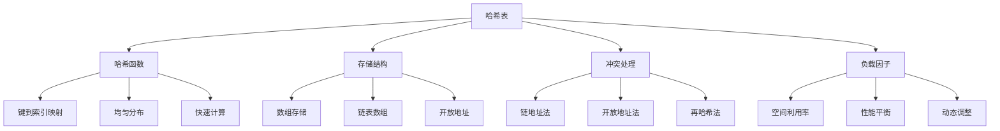

# 哈希表HashTable详解

## 📖 核心概念

**哈希表（Hash Table）**是一种基于哈希函数实现的数据结构，通过键值对存储数据，提供平均O(1)的查找、插入和删除操作。

### 🏗️ 哈希表组成要素



## 🔧 基础实现

### 链地址法哈希表

```cpp
template<typename K, typename V>
class HashTable {
private:
    struct HashNode {
        K key;
        V value;
        HashNode* next;
        
        HashNode(const K& k, const V& v) : key(k), value(v), next(nullptr) {}
    };
    
    vector<HashNode*> buckets;
    size_t bucketCount;
    size_t elementCount;
    double loadFactor;
    static constexpr double MAX_LOAD_FACTOR = 0.75;
    
    // 哈希函数
    size_t hashFunction(const K& key) const {
        return hash<K>{}(key) % bucketCount;
    }
    
    // 重新哈希
    void rehash() {
        size_t oldBucketCount = bucketCount;
        vector<HashNode*> oldBuckets = buckets;
        
        bucketCount *= 2;
        buckets.assign(bucketCount, nullptr);
        elementCount = 0;
        
        for (size_t i = 0; i < oldBucketCount; ++i) {
            HashNode* current = oldBuckets[i];
            while (current) {
                HashNode* next = current->next;
                insertNode(current);
                current = next;
            }
        }
    }
    
    // 插入节点
    void insertNode(HashNode* node) {
        size_t index = hashFunction(node->key);
        node->next = buckets[index];
        buckets[index] = node;
        ++elementCount;
    }
    
public:
    HashTable(size_t initialCapacity = 16) 
        : bucketCount(initialCapacity), elementCount(0), loadFactor(0.0) {
        buckets.assign(bucketCount, nullptr);
    }
    
    ~HashTable() {
        clear();
    }
    
    // 插入键值对
    void put(const K& key, const V& value) {
        size_t index = hashFunction(key);
        
        // 检查是否已存在
        HashNode* current = buckets[index];
        while (current) {
            if (current->key == key) {
                current->value = value;
                return;
            }
            current = current->next;
        }
        
        // 插入新节点
        HashNode* newNode = new HashNode(key, value);
        newNode->next = buckets[index];
        buckets[index] = newNode;
        ++elementCount;
        
        // 检查负载因子
        loadFactor = (double)elementCount / bucketCount;
        if (loadFactor > MAX_LOAD_FACTOR) {
            rehash();
        }
    }
    
    // 获取值
    bool get(const K& key, V& value) const {
        size_t index = hashFunction(key);
        HashNode* current = buckets[index];
        
        while (current) {
            if (current->key == key) {
                value = current->value;
                return true;
            }
            current = current->next;
        }
        
        return false;
    }
    
    // 删除键值对
    bool remove(const K& key) {
        size_t index = hashFunction(key);
        HashNode* current = buckets[index];
        HashNode* prev = nullptr;
        
        while (current) {
            if (current->key == key) {
                if (prev) {
                    prev->next = current->next;
                } else {
                    buckets[index] = current->next;
                }
                
                delete current;
                --elementCount;
                loadFactor = (double)elementCount / bucketCount;
                return true;
            }
            
            prev = current;
            current = current->next;
        }
        
        return false;
    }
    
    // 检查键是否存在
    bool contains(const K& key) const {
        size_t index = hashFunction(key);
        HashNode* current = buckets[index];
        
        while (current) {
            if (current->key == key) {
                return true;
            }
            current = current->next;
        }
        
        return false;
    }
    
    // 获取大小
    size_t size() const {
        return elementCount;
    }
    
    // 检查是否为空
    bool empty() const {
        return elementCount == 0;
    }
    
    // 清空哈希表
    void clear() {
        for (size_t i = 0; i < bucketCount; ++i) {
            HashNode* current = buckets[i];
            while (current) {
                HashNode* next = current->next;
                delete current;
                current = next;
            }
            buckets[i] = nullptr;
        }
        elementCount = 0;
        loadFactor = 0.0;
    }
    
    // 获取所有键
    vector<K> keys() const {
        vector<K> result;
        for (size_t i = 0; i < bucketCount; ++i) {
            HashNode* current = buckets[i];
            while (current) {
                result.push_back(current->key);
                current = current->next;
            }
        }
        return result;
    }
    
    // 获取所有值
    vector<V> values() const {
        vector<V> result;
        for (size_t i = 0; i < bucketCount; ++i) {
            HashNode* current = buckets[i];
            while (current) {
                result.push_back(current->value);
                current = current->next;
            }
        }
        return result;
    }
};
```

## 🎯 开放地址法实现

### 线性探测

```cpp
template<typename K, typename V>
class OpenAddressHashTable {
private:
    enum State { EMPTY, OCCUPIED, DELETED };
    
    struct HashEntry {
        K key;
        V value;
        State state;
        
        HashEntry() : state(EMPTY) {}
    };
    
    vector<HashEntry> buckets;
    size_t bucketCount;
    size_t elementCount;
    double loadFactor;
    static constexpr double MAX_LOAD_FACTOR = 0.5;
    
    size_t hashFunction(const K& key) const {
        return hash<K>{}(key) % bucketCount;
    }
    
    size_t linearProbe(size_t index, const K& key) const {
        size_t originalIndex = index;
        
        while (buckets[index].state == OCCUPIED && buckets[index].key != key) {
            index = (index + 1) % bucketCount;
            if (index == originalIndex) {
                throw runtime_error("Hash table is full");
            }
        }
        
        return index;
    }
    
    void rehash() {
        vector<HashEntry> oldBuckets = buckets;
        
        bucketCount *= 2;
        buckets.assign(bucketCount, HashEntry{});
        elementCount = 0;
        
        for (const auto& entry : oldBuckets) {
            if (entry.state == OCCUPIED) {
                put(entry.key, entry.value);
            }
        }
    }
    
public:
    OpenAddressHashTable(size_t initialCapacity = 16) 
        : bucketCount(initialCapacity), elementCount(0), loadFactor(0.0) {
        buckets.assign(bucketCount, HashEntry{});
    }
    
    void put(const K& key, const V& value) {
        if (loadFactor > MAX_LOAD_FACTOR) {
            rehash();
        }
        
        size_t index = hashFunction(key);
        index = linearProbe(index, key);
        
        if (buckets[index].state != OCCUPIED) {
            ++elementCount;
        }
        
        buckets[index].key = key;
        buckets[index].value = value;
        buckets[index].state = OCCUPIED;
        
        loadFactor = (double)elementCount / bucketCount;
    }
    
    bool get(const K& key, V& value) const {
        size_t index = hashFunction(key);
        size_t originalIndex = index;
        
        while (buckets[index].state != EMPTY) {
            if (buckets[index].state == OCCUPIED && buckets[index].key == key) {
                value = buckets[index].value;
                return true;
            }
            
            index = (index + 1) % bucketCount;
            if (index == originalIndex) {
                break;
            }
        }
        
        return false;
    }
    
    bool remove(const K& key) {
        size_t index = hashFunction(key);
        size_t originalIndex = index;
        
        while (buckets[index].state != EMPTY) {
            if (buckets[index].state == OCCUPIED && buckets[index].key == key) {
                buckets[index].state = DELETED;
                --elementCount;
                loadFactor = (double)elementCount / bucketCount;
                return true;
            }
            
            index = (index + 1) % bucketCount;
            if (index == originalIndex) {
                break;
            }
        }
        
        return false;
    }
    
    bool contains(const K& key) const {
        V value;
        return get(key, value);
    }
    
    size_t size() const {
        return elementCount;
    }
    
    bool empty() const {
        return elementCount == 0;
    }
};
```

## 📊 性能分析

### 时间复杂度

| 操作 | 平均情况 | 最坏情况 | 说明 |
|------|----------|----------|------|
| **查找** | O(1) | O(n) | 哈希冲突影响 |
| **插入** | O(1) | O(n) | 负载因子控制 |
| **删除** | O(1) | O(n) | 冲突处理方式 |
| **重新哈希** | O(n) | O(n) | 扩容操作 |

### 空间复杂度

| 情况 | 空间复杂度 | 说明 |
|------|------------|------|
| **存储** | O(n) | n个键值对 |
| **额外空间** | O(n) | 桶数组和链表 |
| **负载因子** | 0.5-0.75 | 性能平衡点 |

## 🎮 应用场景

### 1. 缓存系统

```cpp
class LRUCache {
private:
    struct Node {
        int key;
        int value;
        Node* prev;
        Node* next;
        
        Node(int k, int v) : key(k), value(v), prev(nullptr), next(nullptr) {}
    };
    
    unordered_map<int, Node*> cache;
    Node* head;
    Node* tail;
    int capacity;
    
    void addToHead(Node* node) {
        node->prev = head;
        node->next = head->next;
        head->next->prev = node;
        head->next = node;
    }
    
    void removeNode(Node* node) {
        node->prev->next = node->next;
        node->next->prev = node->prev;
    }
    
    void moveToHead(Node* node) {
        removeNode(node);
        addToHead(node);
    }
    
    Node* removeTail() {
        Node* lastNode = tail->prev;
        removeNode(lastNode);
        return lastNode;
    }
    
public:
    LRUCache(int cap) : capacity(cap) {
        head = new Node(0, 0);
        tail = new Node(0, 0);
        head->next = tail;
        tail->prev = head;
    }
    
    int get(int key) {
        if (cache.find(key) != cache.end()) {
            Node* node = cache[key];
            moveToHead(node);
            return node->value;
        }
        return -1;
    }
    
    void put(int key, int value) {
        if (cache.find(key) != cache.end()) {
            Node* node = cache[key];
            node->value = value;
            moveToHead(node);
        } else {
            Node* newNode = new Node(key, value);
            
            if (cache.size() >= capacity) {
                Node* tailNode = removeTail();
                cache.erase(tailNode->key);
                delete tailNode;
            }
            
            cache[key] = newNode;
            addToHead(newNode);
        }
    }
};
```

### 2. 频率统计

```cpp
class FrequencyCounter {
private:
    unordered_map<string, int> frequencyMap;
    
public:
    void addWord(const string& word) {
        frequencyMap[word]++;
    }
    
    int getFrequency(const string& word) const {
        auto it = frequencyMap.find(word);
        return (it != frequencyMap.end()) ? it->second : 0;
    }
    
    vector<pair<string, int>> getTopWords(int k) const {
        vector<pair<string, int>> words;
        
        for (const auto& pair : frequencyMap) {
            words.push_back(pair);
        }
        
        sort(words.begin(), words.end(), 
             [](const pair<string, int>& a, const pair<string, int>& b) {
                 return a.second > b.second;
             });
        
        if (words.size() > k) {
            words.resize(k);
        }
        
        return words;
    }
    
    void processText(const string& text) {
        stringstream ss(text);
        string word;
        
        while (ss >> word) {
            // 转换为小写并移除标点
            transform(word.begin(), word.end(), word.begin(), ::tolower);
            word.erase(remove_if(word.begin(), word.end(), ::ispunct), word.end());
            
            if (!word.empty()) {
                addWord(word);
            }
        }
    }
};
```

## 🔧 优化技巧

### 1. 自定义哈希函数

```cpp
class CustomHashFunction {
public:
    // 字符串哈希函数
    size_t stringHash(const string& str) const {
        size_t hash = 5381;
        for (char c : str) {
            hash = ((hash << 5) + hash) + c;  // hash * 33 + c
        }
        return hash;
    }
    
    // 整数哈希函数
    size_t intHash(int key) const {
        key = ((key >> 16) ^ key) * 0x45d9f3b;
        key = ((key >> 16) ^ key) * 0x45d9f3b;
        key = (key >> 16) ^ key;
        return key;
    }
    
    // 组合哈希函数
    template<typename T1, typename T2>
    size_t pairHash(const pair<T1, T2>& p) const {
        size_t h1 = hash<T1>{}(p.first);
        size_t h2 = hash<T2>{}(p.second);
        return h1 ^ (h2 << 1);
    }
};
```

### 2. 布隆过滤器

```cpp
class BloomFilter {
private:
    vector<bool> bits;
    vector<function<size_t(const string&)>> hashFunctions;
    size_t bitCount;
    size_t hashCount;
    
public:
    BloomFilter(size_t expectedElements, double falsePositiveRate) {
        bitCount = -(expectedElements * log(falsePositiveRate)) / (log(2) * log(2));
        hashCount = (bitCount / expectedElements) * log(2);
        
        bits.assign(bitCount, false);
        
        // 创建多个哈希函数
        for (size_t i = 0; i < hashCount; ++i) {
            hashFunctions.push_back([i, this](const string& key) {
                size_t hash = 0;
                for (char c : key) {
                    hash = hash * 31 + c;
                }
                return (hash + i) % bitCount;
            });
        }
    }
    
    void add(const string& key) {
        for (const auto& hashFunc : hashFunctions) {
            size_t index = hashFunc(key);
            bits[index] = true;
        }
    }
    
    bool mightContain(const string& key) const {
        for (const auto& hashFunc : hashFunctions) {
            size_t index = hashFunc(key);
            if (!bits[index]) {
                return false;
            }
        }
        return true;
    }
};
```

## 🔗 相关链接

- [[02-哈希冲突处理|哈希冲突处理]]
- [[03-一致性哈希|一致性哈希]]
- [[04-哈希表应用|哈希表应用]]

## 💡 哈希表要点

1. **哈希函数**：决定分布均匀性和计算效率
2. **冲突处理**：链地址法vs开放地址法
3. **负载因子**：平衡空间利用率和性能
4. **动态扩容**：保持良好性能的关键

---

*📝 实现提示：哈希表是现代编程中最重要的数据结构之一，掌握其实现原理有助于理解各种缓存和索引系统*