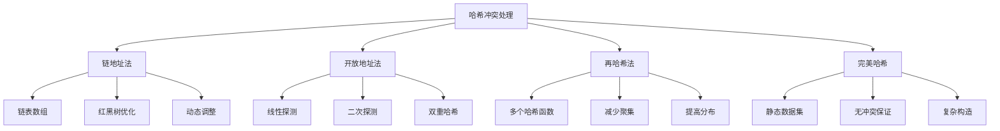

# 哈希冲突处理

## 📖 核心概念

**哈希冲突处理**是哈希表实现中的关键技术。当不同键映射到相同索引时，需要有效的策略来处理冲突，保证哈希表的正确性和性能。

### 🏗️ 冲突处理策略



## 🔧 链地址法实现

### 基础链地址法

```cpp
template<typename K, typename V>
class ChainingHashTable {
private:
    struct HashNode {
        K key;
        V value;
        HashNode* next;
        
        HashNode(const K& k, const V& v) : key(k), value(v), next(nullptr) {}
    };
    
    vector<HashNode*> buckets;
    size_t bucketCount;
    size_t elementCount;
    
    size_t hashFunction(const K& key) const {
        return hash<K>{}(key) % bucketCount;
    }
    
public:
    ChainingHashTable(size_t initialCapacity = 16) 
        : bucketCount(initialCapacity), elementCount(0) {
        buckets.assign(bucketCount, nullptr);
    }
    
    ~ChainingHashTable() {
        clear();
    }
    
    void put(const K& key, const V& value) {
        size_t index = hashFunction(key);
        
        // 检查是否已存在
        HashNode* current = buckets[index];
        while (current) {
            if (current->key == key) {
                current->value = value;
                return;
            }
            current = current->next;
        }
        
        // 插入新节点到链表头部
        HashNode* newNode = new HashNode(key, value);
        newNode->next = buckets[index];
        buckets[index] = newNode;
        ++elementCount;
    }
    
    bool get(const K& key, V& value) const {
        size_t index = hashFunction(key);
        HashNode* current = buckets[index];
        
        while (current) {
            if (current->key == key) {
                value = current->value;
                return true;
            }
            current = current->next;
        }
        
        return false;
    }
    
    bool remove(const K& key) {
        size_t index = hashFunction(key);
        HashNode* current = buckets[index];
        HashNode* prev = nullptr;
        
        while (current) {
            if (current->key == key) {
                if (prev) {
                    prev->next = current->next;
                } else {
                    buckets[index] = current->next;
                }
                
                delete current;
                --elementCount;
                return true;
            }
            
            prev = current;
            current = current->next;
        }
        
        return false;
    }
    
    void clear() {
        for (size_t i = 0; i < bucketCount; ++i) {
            HashNode* current = buckets[i];
            while (current) {
                HashNode* next = current->next;
                delete current;
                current = next;
            }
            buckets[i] = nullptr;
        }
        elementCount = 0;
    }
    
    // 获取冲突统计信息
    void getCollisionStats() const {
        size_t totalCollisions = 0;
        size_t maxChainLength = 0;
        size_t emptyBuckets = 0;
        
        for (size_t i = 0; i < bucketCount; ++i) {
            size_t chainLength = 0;
            HashNode* current = buckets[i];
            
            while (current) {
                ++chainLength;
                current = current->next;
            }
            
            if (chainLength > 1) {
                totalCollisions += chainLength - 1;
            }
            
            if (chainLength == 0) {
                ++emptyBuckets;
            }
            
            maxChainLength = max(maxChainLength, chainLength);
        }
        
        cout << "Total collisions: " << totalCollisions << endl;
        cout << "Max chain length: " << maxChainLength << endl;
        cout << "Empty buckets: " << emptyBuckets << endl;
        cout << "Load factor: " << (double)elementCount / bucketCount << endl;
    }
};
```

### 红黑树优化版本

```cpp
template<typename K, typename V>
class ChainingHashTableWithRBTree {
private:
    struct RBNode {
        K key;
        V value;
        bool color;  // true = red, false = black
        RBNode* left;
        RBNode* right;
        RBNode* parent;
        
        RBNode(const K& k, const V& v) 
            : key(k), value(v), color(true), left(nullptr), right(nullptr), parent(nullptr) {}
    };
    
    vector<RBNode*> buckets;
    size_t bucketCount;
    size_t elementCount;
    static constexpr size_t TREE_THRESHOLD = 8;  // 链表长度超过8时转换为红黑树
    
    size_t hashFunction(const K& key) const {
        return hash<K>{}(key) % bucketCount;
    }
    
    // 红黑树操作
    void leftRotate(RBNode* x, size_t bucketIndex) {
        RBNode* y = x->right;
        x->right = y->left;
        
        if (y->left) {
            y->left->parent = x;
        }
        
        y->parent = x->parent;
        
        if (!x->parent) {
            buckets[bucketIndex] = y;
        } else if (x == x->parent->left) {
            x->parent->left = y;
        } else {
            x->parent->right = y;
        }
        
        y->left = x;
        x->parent = y;
    }
    
    void rightRotate(RBNode* y, size_t bucketIndex) {
        RBNode* x = y->left;
        y->left = x->right;
        
        if (x->right) {
            x->right->parent = y;
        }
        
        x->parent = y->parent;
        
        if (!y->parent) {
            buckets[bucketIndex] = x;
        } else if (y == y->parent->left) {
            y->parent->left = x;
        } else {
            y->parent->right = x;
        }
        
        x->right = y;
        y->parent = x;
    }
    
    void insertFixup(RBNode* z, size_t bucketIndex) {
        while (z->parent && z->parent->color) {
            if (z->parent == z->parent->parent->left) {
                RBNode* y = z->parent->parent->right;
                
                if (y && y->color) {
                    z->parent->color = false;
                    y->color = false;
                    z->parent->parent->color = true;
                    z = z->parent->parent;
                } else {
                    if (z == z->parent->right) {
                        z = z->parent;
                        leftRotate(z, bucketIndex);
                    }
                    
                    z->parent->color = false;
                    z->parent->parent->color = true;
                    rightRotate(z->parent->parent, bucketIndex);
                }
            } else {
                RBNode* y = z->parent->parent->left;
                
                if (y && y->color) {
                    z->parent->color = false;
                    y->color = false;
                    z->parent->parent->color = true;
                    z = z->parent->parent;
                } else {
                    if (z == z->parent->left) {
                        z = z->parent;
                        rightRotate(z, bucketIndex);
                    }
                    
                    z->parent->color = false;
                    z->parent->parent->color = true;
                    leftRotate(z->parent->parent, bucketIndex);
                }
            }
        }
        
        buckets[bucketIndex]->color = false;
    }
    
    RBNode* insertRBTree(RBNode* root, const K& key, const V& value, size_t bucketIndex) {
        RBNode* z = new RBNode(key, value);
        
        RBNode* y = nullptr;
        RBNode* x = root;
        
        while (x) {
            y = x;
            if (z->key < x->key) {
                x = x->left;
            } else {
                x = x->right;
            }
        }
        
        z->parent = y;
        
        if (!y) {
            root = z;
        } else if (z->key < y->key) {
            y->left = z;
        } else {
            y->right = z;
        }
        
        insertFixup(z, bucketIndex);
        return buckets[bucketIndex];
    }
    
public:
    ChainingHashTableWithRBTree(size_t initialCapacity = 16) 
        : bucketCount(initialCapacity), elementCount(0) {
        buckets.assign(bucketCount, nullptr);
    }
    
    void put(const K& key, const V& value) {
        size_t index = hashFunction(key);
        
        // 简化的插入逻辑
        RBNode* newNode = new RBNode(key, value);
        buckets[index] = insertRBTree(buckets[index], key, value, index);
        ++elementCount;
    }
    
    bool get(const K& key, V& value) const {
        size_t index = hashFunction(key);
        RBNode* current = buckets[index];
        
        while (current) {
            if (current->key == key) {
                value = current->value;
                return true;
            } else if (key < current->key) {
                current = current->left;
            } else {
                current = current->right;
            }
        }
        
        return false;
    }
};
```

## 🎯 开放地址法实现

### 线性探测

```cpp
template<typename K, typename V>
class LinearProbingHashTable {
private:
    enum State { EMPTY, OCCUPIED, DELETED };
    
    struct HashEntry {
        K key;
        V value;
        State state;
        
        HashEntry() : state(EMPTY) {}
    };
    
    vector<HashEntry> buckets;
    size_t bucketCount;
    size_t elementCount;
    static constexpr double MAX_LOAD_FACTOR = 0.5;
    
    size_t hashFunction(const K& key) const {
        return hash<K>{}(key) % bucketCount;
    }
    
    size_t findSlot(const K& key) const {
        size_t index = hashFunction(key);
        size_t originalIndex = index;
        
        while (buckets[index].state == OCCUPIED && buckets[index].key != key) {
            index = (index + 1) % bucketCount;
            if (index == originalIndex) {
                throw runtime_error("Hash table is full");
            }
        }
        
        return index;
    }
    
    void rehash() {
        vector<HashEntry> oldBuckets = buckets;
        
        bucketCount *= 2;
        buckets.assign(bucketCount, HashEntry{});
        elementCount = 0;
        
        for (const auto& entry : oldBuckets) {
            if (entry.state == OCCUPIED) {
                put(entry.key, entry.value);
            }
        }
    }
    
public:
    LinearProbingHashTable(size_t initialCapacity = 16) 
        : bucketCount(initialCapacity), elementCount(0) {
        buckets.assign(bucketCount, HashEntry{});
    }
    
    void put(const K& key, const V& value) {
        if ((double)elementCount / bucketCount > MAX_LOAD_FACTOR) {
            rehash();
        }
        
        size_t index = findSlot(key);
        
        if (buckets[index].state != OCCUPIED) {
            ++elementCount;
        }
        
        buckets[index].key = key;
        buckets[index].value = value;
        buckets[index].state = OCCUPIED;
    }
    
    bool get(const K& key, V& value) const {
        size_t index = hashFunction(key);
        size_t originalIndex = index;
        
        while (buckets[index].state != EMPTY) {
            if (buckets[index].state == OCCUPIED && buckets[index].key == key) {
                value = buckets[index].value;
                return true;
            }
            
            index = (index + 1) % bucketCount;
            if (index == originalIndex) {
                break;
            }
        }
        
        return false;
    }
    
    bool remove(const K& key) {
        size_t index = hashFunction(key);
        size_t originalIndex = index;
        
        while (buckets[index].state != EMPTY) {
            if (buckets[index].state == OCCUPIED && buckets[index].key == key) {
                buckets[index].state = DELETED;
                --elementCount;
                return true;
            }
            
            index = (index + 1) % bucketCount;
            if (index == originalIndex) {
                break;
            }
        }
        
        return false;
    }
};
```

### 二次探测

```cpp
template<typename K, typename V>
class QuadraticProbingHashTable {
private:
    enum State { EMPTY, OCCUPIED, DELETED };
    
    struct HashEntry {
        K key;
        V value;
        State state;
        
        HashEntry() : state(EMPTY) {}
    };
    
    vector<HashEntry> buckets;
    size_t bucketCount;
    size_t elementCount;
    static constexpr double MAX_LOAD_FACTOR = 0.5;
    
    size_t hashFunction(const K& key) const {
        return hash<K>{}(key) % bucketCount;
    }
    
    size_t quadraticProbe(size_t index, int i) const {
        return (index + i * i) % bucketCount;
    }
    
    size_t findSlot(const K& key) const {
        size_t index = hashFunction(key);
        
        for (int i = 0; i < bucketCount; ++i) {
            size_t probeIndex = quadraticProbe(index, i);
            
            if (buckets[probeIndex].state != OCCUPIED || buckets[probeIndex].key == key) {
                return probeIndex;
            }
        }
        
        throw runtime_error("Hash table is full");
    }
    
public:
    QuadraticProbingHashTable(size_t initialCapacity = 16) 
        : bucketCount(initialCapacity), elementCount(0) {
        buckets.assign(bucketCount, HashEntry{});
    }
    
    void put(const K& key, const V& value) {
        if ((double)elementCount / bucketCount > MAX_LOAD_FACTOR) {
            // 重新哈希
            return;
        }
        
        size_t index = findSlot(key);
        
        if (buckets[index].state != OCCUPIED) {
            ++elementCount;
        }
        
        buckets[index].key = key;
        buckets[index].value = value;
        buckets[index].state = OCCUPIED;
    }
    
    bool get(const K& key, V& value) const {
        size_t index = hashFunction(key);
        
        for (int i = 0; i < bucketCount; ++i) {
            size_t probeIndex = quadraticProbe(index, i);
            
            if (buckets[probeIndex].state == EMPTY) {
                break;
            }
            
            if (buckets[probeIndex].state == OCCUPIED && buckets[probeIndex].key == key) {
                value = buckets[probeIndex].value;
                return true;
            }
        }
        
        return false;
    }
};
```

### 双重哈希

```cpp
template<typename K, typename V>
class DoubleHashingHashTable {
private:
    enum State { EMPTY, OCCUPIED, DELETED };
    
    struct HashEntry {
        K key;
        V value;
        State state;
        
        HashEntry() : state(EMPTY) {}
    };
    
    vector<HashEntry> buckets;
    size_t bucketCount;
    size_t elementCount;
    static constexpr double MAX_LOAD_FACTOR = 0.5;
    
    size_t hashFunction1(const K& key) const {
        return hash<K>{}(key) % bucketCount;
    }
    
    size_t hashFunction2(const K& key) const {
        return 1 + (hash<K>{}(key) % (bucketCount - 1));
    }
    
    size_t doubleHash(size_t index, const K& key, int i) const {
        return (index + i * hashFunction2(key)) % bucketCount;
    }
    
    size_t findSlot(const K& key) const {
        size_t index = hashFunction1(key);
        
        for (int i = 0; i < bucketCount; ++i) {
            size_t probeIndex = doubleHash(index, key, i);
            
            if (buckets[probeIndex].state != OCCUPIED || buckets[probeIndex].key == key) {
                return probeIndex;
            }
        }
        
        throw runtime_error("Hash table is full");
    }
    
public:
    DoubleHashingHashTable(size_t initialCapacity = 16) 
        : bucketCount(initialCapacity), elementCount(0) {
        buckets.assign(bucketCount, HashEntry{});
    }
    
    void put(const K& key, const V& value) {
        if ((double)elementCount / bucketCount > MAX_LOAD_FACTOR) {
            // 重新哈希
            return;
        }
        
        size_t index = findSlot(key);
        
        if (buckets[index].state != OCCUPIED) {
            ++elementCount;
        }
        
        buckets[index].key = key;
        buckets[index].value = value;
        buckets[index].state = OCCUPIED;
    }
    
    bool get(const K& key, V& value) const {
        size_t index = hashFunction1(key);
        
        for (int i = 0; i < bucketCount; ++i) {
            size_t probeIndex = doubleHash(index, key, i);
            
            if (buckets[probeIndex].state == EMPTY) {
                break;
            }
            
            if (buckets[probeIndex].state == OCCUPIED && buckets[probeIndex].key == key) {
                value = buckets[probeIndex].value;
                return true;
            }
        }
        
        return false;
    }
};
```

## 📊 性能对比

### 冲突处理策略对比

| 策略 | 平均查找时间 | 最坏查找时间 | 空间开销 | 实现复杂度 | 适用场景 |
|------|-------------|-------------|----------|------------|----------|
| **链地址法** | O(1 + α) | O(n) | 高 | 简单 | 通用 |
| **线性探测** | O(1/(1-α)) | O(n) | 低 | 简单 | 内存受限 |
| **二次探测** | O(1/(1-α)) | O(n) | 低 | 中等 | 减少聚集 |
| **双重哈希** | O(1/(1-α)) | O(n) | 低 | 复杂 | 最佳分布 |

其中α是负载因子

## 🔗 相关链接

- [[01-哈希表HashTable详解|哈希表详解]]
- [[03-一致性哈希|一致性哈希]]
- [[04-哈希表应用|哈希表应用]]

## 💡 冲突处理要点

1. **链地址法**：简单可靠，适合大多数场景
2. **开放地址法**：空间效率高，但性能敏感
3. **负载因子**：控制冲突率的关键参数
4. **重新哈希**：保持性能的必要手段

---

*📝 处理提示：选择合适的冲突处理策略是哈希表设计的关键，需要平衡性能和复杂度*
