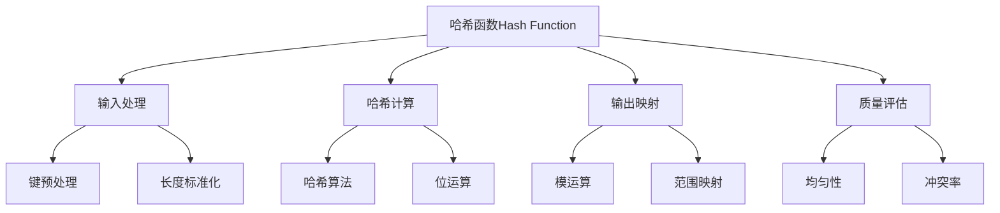

# 哈希函数设计

## 📖 核心概念

**哈希函数（Hash Function）**是将任意长度的输入数据映射为固定长度输出的函数。在哈希表中，哈希函数将键映射到数组索引，是哈希表性能的关键因素。好的哈希函数应该具有均匀分布、快速计算和低冲突率的特点。

### 🏗️ 哈希函数的组成要素



## 🔍 哈希函数分类

### 按算法类型分类

| 类型 | 特点 | 优点 | 缺点 | 适用场景 |
|------|------|------|------|----------|
| **除法哈希** | 取模运算 | 简单快速 | 分布不均匀 | 简单应用 |
| **乘法哈希** | 黄金比例 | 分布均匀 | 计算复杂 | 一般应用 |
| **位运算哈希** | 位操作 | 高效快速 | 质量一般 | 性能要求高 |
| **加密哈希** | 密码学算法 | 质量极高 | 计算慢 | 安全要求高 |

### 按数据类型分类

| 数据类型 | 哈希策略 | 特点 | 示例 |
|----------|----------|------|------|
| **整数** | 直接映射 | 简单高效 | 取模、位运算 |
| **字符串** | 多项式哈希 | 考虑顺序 | 多项式滚动哈希 |
| **浮点数** | 位表示 | 精度处理 | IEEE 754位操作 |
| **复合类型** | 组合哈希 | 多字段组合 | 结构体哈希 |

## 💻 基础哈希函数实现

### 整数哈希函数

```cpp
class IntegerHashFunctions {
public:
    // 除法哈希
    static size_t divisionHash(int key, size_t tableSize) {
        return key % tableSize;
    }
    
    // 乘法哈希（使用黄金比例）
    static size_t multiplicationHash(int key, size_t tableSize) {
        const double A = 0.6180339887; // (sqrt(5) - 1) / 2
        double fractionalPart = key * A - floor(key * A);
        return static_cast<size_t>(fractionalPart * tableSize);
    }
    
    // 位运算哈希
    static size_t bitwiseHash(int key, size_t tableSize) {
        // 使用位运算和异或
        key = ((key >> 16) ^ key) * 0x45d9f3b;
        key = ((key >> 16) ^ key) * 0x45d9f3b;
        key = (key >> 16) ^ key;
        return key % tableSize;
    }
    
    // 平方取中法
    static size_t midSquareHash(int key, size_t tableSize) {
        long long squared = static_cast<long long>(key) * key;
        // 取中间的几位数字
        int middle = (squared / 100) % 10000; // 取中间4位
        return middle % tableSize;
    }
    
    // 折叠哈希
    static size_t foldingHash(int key, size_t tableSize) {
        int sum = 0;
        while (key > 0) {
            sum += key % 1000; // 取最后3位
            key /= 1000;
        }
        return sum % tableSize;
    }
    
    // 测试哈希函数质量
    static void testHashQuality(const vector<int>& keys, size_t tableSize, 
                               function<size_t(int, size_t)> hashFunc) {
        vector<int> distribution(tableSize, 0);
        
        for (int key : keys) {
            size_t index = hashFunc(key, tableSize);
            distribution[index]++;
        }
        
        // 计算统计信息
        int minCount = *min_element(distribution.begin(), distribution.end());
        int maxCount = *max_element(distribution.begin(), distribution.end());
        double avgCount = static_cast<double>(keys.size()) / tableSize;
        
        cout << "Hash Quality Test:" << endl;
        cout << "Min count: " << minCount << endl;
        cout << "Max count: " << maxCount << endl;
        cout << "Average count: " << avgCount << endl;
        cout << "Distribution ratio: " << static_cast<double>(maxCount) / minCount << endl;
    }
};
```

### 字符串哈希函数

```cpp
class StringHashFunctions {
public:
    // 简单字符串哈希
    static size_t simpleStringHash(const string& str, size_t tableSize) {
        size_t hash = 0;
        for (char c : str) {
            hash += c;
        }
        return hash % tableSize;
    }
    
    // 多项式滚动哈希
    static size_t polynomialHash(const string& str, size_t tableSize) {
        const size_t base = 31; // 质数基数
        size_t hash = 0;
        size_t power = 1;
        
        for (char c : str) {
            hash = (hash + (c - 'a' + 1) * power) % tableSize;
            power = (power * base) % tableSize;
        }
        
        return hash;
    }
    
    // DJB2哈希算法
    static size_t djb2Hash(const string& str, size_t tableSize) {
        size_t hash = 5381;
        
        for (char c : str) {
            hash = ((hash << 5) + hash) + c; // hash * 33 + c
        }
        
        return hash % tableSize;
    }
    
    // SDBM哈希算法
    static size_t sdbmHash(const string& str, size_t tableSize) {
        size_t hash = 0;
        
        for (char c : str) {
            hash = c + (hash << 6) + (hash << 16) - hash;
        }
        
        return hash % tableSize;
    }
    
    // FNV-1a哈希算法
    static size_t fnv1aHash(const string& str, size_t tableSize) {
        const size_t FNV_OFFSET_BASIS = 14695981039346656037ULL;
        const size_t FNV_PRIME = 1099511628211ULL;
        
        size_t hash = FNV_OFFSET_BASIS;
        
        for (char c : str) {
            hash ^= static_cast<size_t>(c);
            hash *= FNV_PRIME;
        }
        
        return hash % tableSize;
    }
    
    // 测试字符串哈希质量
    static void testStringHashQuality(const vector<string>& strings, size_t tableSize,
                                    function<size_t(const string&, size_t)> hashFunc) {
        vector<int> distribution(tableSize, 0);
        
        for (const string& str : strings) {
            size_t index = hashFunc(str, tableSize);
            distribution[index]++;
        }
        
        // 计算统计信息
        int minCount = *min_element(distribution.begin(), distribution.end());
        int maxCount = *max_element(distribution.begin(), distribution.end());
        double avgCount = static_cast<double>(strings.size()) / tableSize;
        
        cout << "String Hash Quality Test:" << endl;
        cout << "Min count: " << minCount << endl;
        cout << "Max count: " << maxCount << endl;
        cout << "Average count: " << avgCount << endl;
        cout << "Distribution ratio: " << static_cast<double>(maxCount) / minCount << endl;
    }
};
```

### 通用哈希函数

```cpp
template<typename T>
class UniversalHashFunction {
private:
    size_t a, b, p, m;
    
public:
    UniversalHashFunction(size_t tableSize) : m(tableSize) {
        // 选择大质数p
        p = 2147483647; // 2^31 - 1
        
        // 随机选择a和b
        random_device rd;
        mt19937 gen(rd());
        uniform_int_distribution<size_t> disA(1, p - 1);
        uniform_int_distribution<size_t> disB(0, p - 1);
        
        a = disA(gen);
        b = disB(gen);
    }
    
    size_t hash(const T& key) const {
        // 将key转换为size_t
        size_t keyValue = convertToSizeT(key);
        
        // 通用哈希函数: h(k) = ((a * k + b) mod p) mod m
        return ((a * keyValue + b) % p) % m;
    }
    
private:
    size_t convertToSizeT(const T& key) const {
        if constexpr (is_integral_v<T>) {
            return static_cast<size_t>(key);
        } else if constexpr (is_same_v<T, string>) {
            return std::hash<string>{}(key);
        } else {
            // 对于其他类型，使用std::hash
            return std::hash<T>{}(key);
        }
    }
};

// 特化版本
template<>
size_t UniversalHashFunction<string>::convertToSizeT(const string& key) const {
    size_t hash = 0;
    for (char c : key) {
        hash = hash * 31 + c;
    }
    return hash;
}
```

## 🎯 高级哈希函数应用

### 1. 一致性哈希

```cpp
class ConsistentHash {
private:
    struct VirtualNode {
        string physicalNode;
        size_t hash;
        
        VirtualNode(const string& node, size_t h) : physicalNode(node), hash(h) {}
        
        bool operator<(const VirtualNode& other) const {
            return hash < other.hash;
        }
    };
    
    set<VirtualNode> virtualNodes;
    unordered_map<string, int> physicalNodes;
    int virtualNodeCount;
    
    // 哈希函数
    size_t hashFunction(const string& key) const {
        return std::hash<string>{}(key);
    }
    
public:
    ConsistentHash(int vnc = 150) : virtualNodeCount(vnc) {}
    
    // 添加物理节点
    void addPhysicalNode(const string& nodeId) {
        physicalNodes[nodeId]++;
        
        // 添加虚拟节点
        for (int i = 0; i < virtualNodeCount; i++) {
            string virtualKey = nodeId + "#" + to_string(i);
            size_t hash = hashFunction(virtualKey);
            virtualNodes.insert(VirtualNode(nodeId, hash));
        }
    }
    
    // 移除物理节点
    void removePhysicalNode(const string& nodeId) {
        if (physicalNodes.find(nodeId) == physicalNodes.end()) {
            return;
        }
        
        physicalNodes.erase(nodeId);
        
        // 移除虚拟节点
        auto it = virtualNodes.begin();
        while (it != virtualNodes.end()) {
            if (it->physicalNode == nodeId) {
                it = virtualNodes.erase(it);
            } else {
                ++it;
            }
        }
    }
    
    // 获取数据应该存储的节点
    string getNode(const string& key) const {
        if (virtualNodes.empty()) {
            return "";
        }
        
        size_t keyHash = hashFunction(key);
        
        // 找到第一个hash值大于等于keyHash的虚拟节点
        auto it = virtualNodes.lower_bound(VirtualNode("", keyHash));
        
        if (it == virtualNodes.end()) {
            // 如果没有找到，则使用第一个节点（环形）
            it = virtualNodes.begin();
        }
        
        return it->physicalNode;
    }
    
    // 获取数据分布
    unordered_map<string, int> getDataDistribution(const vector<string>& keys) const {
        unordered_map<string, int> distribution;
        
        for (const string& key : keys) {
            string node = getNode(key);
            distribution[node]++;
        }
        
        return distribution;
    }
    
    // 计算负载均衡度
    double getLoadBalance(const vector<string>& keys) const {
        auto distribution = getDataDistribution(keys);
        
        if (distribution.empty()) {
            return 0.0;
        }
        
        int minLoad = min_element(distribution.begin(), distribution.end(),
            [](const auto& a, const auto& b) { return a.second < b.second; })->second;
        int maxLoad = max_element(distribution.begin(), distribution.end(),
            [](const auto& a, const auto& b) { return a.second < b.second; })->second;
        
        return static_cast<double>(minLoad) / maxLoad;
    }
    
    // 获取节点数量
    int getNodeCount() const {
        return physicalNodes.size();
    }
    
    // 获取虚拟节点数量
    int getVirtualNodeCount() const {
        return virtualNodes.size();
    }
};
```

### 2. 布隆过滤器哈希

```cpp
class BloomFilterHash {
private:
    vector<size_t> seeds;
    size_t filterSize;
    
public:
    BloomFilterHash(size_t size, int hashCount = 3) : filterSize(size) {
        // 生成不同的种子
        seeds = {31, 37, 41, 43, 47, 53, 59, 61};
        if (hashCount > static_cast<int>(seeds.size())) {
            hashCount = seeds.size();
        }
        seeds.resize(hashCount);
    }
    
    // 计算多个哈希值
    vector<size_t> getHashValues(const string& key) const {
        vector<size_t> hashValues;
        
        for (size_t seed : seeds) {
            size_t hash = 0;
            for (char c : key) {
                hash = hash * seed + c;
            }
            hashValues.push_back(hash % filterSize);
        }
        
        return hashValues;
    }
    
    // 计算单个哈希值
    size_t getHashValue(const string& key, int hashIndex) const {
        if (hashIndex >= static_cast<int>(seeds.size())) {
            return 0;
        }
        
        size_t hash = 0;
        size_t seed = seeds[hashIndex];
        
        for (char c : key) {
            hash = hash * seed + c;
        }
        
        return hash % filterSize;
    }
    
    // 测试哈希函数质量
    void testHashQuality(const vector<string>& keys) const {
        vector<int> distribution(filterSize, 0);
        
        for (const string& key : keys) {
            auto hashValues = getHashValues(key);
            for (size_t hash : hashValues) {
                distribution[hash]++;
            }
        }
        
        int minCount = *min_element(distribution.begin(), distribution.end());
        int maxCount = *max_element(distribution.begin(), distribution.end());
        double avgCount = static_cast<double>(keys.size() * seeds.size()) / filterSize;
        
        cout << "Bloom Filter Hash Quality:" << endl;
        cout << "Min count: " << minCount << endl;
        cout << "Max count: " << maxCount << endl;
        cout << "Average count: " << avgCount << endl;
        cout << "Distribution ratio: " << static_cast<double>(maxCount) / minCount << endl;
    }
};
```

### 3. 哈希函数性能测试

```cpp
class HashFunctionBenchmark {
public:
    // 测试哈希函数性能
    static void benchmarkHashFunctions(const vector<string>& testData, size_t tableSize) {
        vector<pair<string, function<size_t(const string&, size_t)>>> hashFunctions = {
            {"Simple Hash", StringHashFunctions::simpleStringHash},
            {"Polynomial Hash", StringHashFunctions::polynomialHash},
            {"DJB2 Hash", StringHashFunctions::djb2Hash},
            {"SDBM Hash", StringHashFunctions::sdbmHash},
            {"FNV-1a Hash", StringHashFunctions::fnv1aHash}
        };
        
        cout << "Hash Function Benchmark:" << endl;
        cout << "Test data size: " << testData.size() << endl;
        cout << "Table size: " << tableSize << endl;
        cout << endl;
        
        for (const auto& [name, hashFunc] : hashFunctions) {
            auto start = chrono::high_resolution_clock::now();
            
            // 执行哈希计算
            for (const string& data : testData) {
                hashFunc(data, tableSize);
            }
            
            auto end = chrono::high_resolution_clock::now();
            auto duration = chrono::duration_cast<chrono::microseconds>(end - start);
            
            cout << name << ": " << duration.count() << " microseconds" << endl;
            
            // 测试哈希质量
            StringHashFunctions::testStringHashQuality(testData, tableSize, hashFunc);
            cout << endl;
        }
    }
    
    // 测试冲突率
    static void testCollisionRate(const vector<string>& testData, size_t tableSize,
                                function<size_t(const string&, size_t)> hashFunc) {
        unordered_set<size_t> hashValues;
        int collisions = 0;
        
        for (const string& data : testData) {
            size_t hash = hashFunc(data, tableSize);
            if (hashValues.find(hash) != hashValues.end()) {
                collisions++;
            } else {
                hashValues.insert(hash);
            }
        }
        
        double collisionRate = static_cast<double>(collisions) / testData.size();
        cout << "Collision rate: " << collisionRate * 100 << "%" << endl;
        cout << "Unique hash values: " << hashValues.size() << endl;
    }
    
    // 生成测试数据
    static vector<string> generateTestData(int count) {
        vector<string> testData;
        random_device rd;
        mt19937 gen(rd());
        uniform_int_distribution<int> dis(1, 20); // 字符串长度1-20
        
        for (int i = 0; i < count; i++) {
            int length = dis(gen);
            string str;
            for (int j = 0; j < length; j++) {
                str += 'a' + (gen() % 26);
            }
            testData.push_back(str);
        }
        
        return testData;
    }
};
```

## ⚡ 复杂度分析

### 时间复杂度

| 哈希函数类型 | 时间复杂度 | 说明 |
|--------------|------------|------|
| **简单哈希** | O(1) | 单次计算 |
| **多项式哈希** | O(n) | n为字符串长度 |
| **加密哈希** | O(n) | 复杂计算 |
| **通用哈希** | O(1) | 预计算参数 |

### 空间复杂度

| 哈希函数类型 | 空间复杂度 | 说明 |
|--------------|------------|------|
| **基础哈希** | O(1) | 常数空间 |
| **状态哈希** | O(n) | 存储状态 |
| **缓存哈希** | O(k) | k为缓存大小 |

### 质量指标

| 指标 | 描述 | 影响 |
|------|------|------|
| **均匀性** | 输出分布均匀 | 减少冲突 |
| **雪崩效应** | 输入微小变化导致输出大幅变化 | 提高随机性 |
| **计算速度** | 哈希计算效率 | 影响整体性能 |
| **冲突率** | 不同输入产生相同输出的概率 | 影响哈希表性能 |

## 🎓 学习要点总结

### 核心理解

1. **哈希原理**：理解哈希函数的基本原理和作用
2. **质量评估**：掌握评估哈希函数质量的方法
3. **算法选择**：根据应用场景选择合适的哈希算法
4. **性能优化**：理解哈希函数的性能优化技巧

### 实践要点

1. **算法实现**：正确实现各种哈希函数
2. **质量测试**：使用统计方法测试哈希质量
3. **性能测试**：测量哈希函数的计算性能
4. **参数调优**：根据测试结果调整哈希参数

### 应用思维

1. **哈希表设计**：理解哈希函数在哈希表中的作用
2. **分布式系统**：掌握一致性哈希的应用
3. **缓存系统**：理解哈希函数在缓存中的应用
4. **安全应用**：掌握加密哈希函数的使用

---

**相关链接：**
- [[05-高级结构/01-哈希宇宙/01-哈希表HashTable详解|哈希表HashTable详解]] - 哈希表的基本实现
- [[05-高级结构/01-哈希宇宙/03-冲突解决策略|冲突解决策略]] - 哈希冲突的处理方法
- [[05-高级结构/03-特殊结构/02-布隆过滤器|布隆过滤器]] - 哈希函数的特殊应用
- [[06-应用实战/04-网络应用/01-分布式系统|分布式系统]] - 一致性哈希的应用
