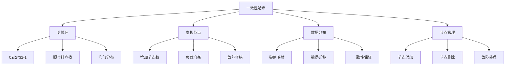

# 一致性哈希

## 📖 核心概念

**一致性哈希**是一种特殊的哈希技术，主要用于分布式系统中。它能够在节点动态增减时最小化数据重新分布，保证系统的高可用性和负载均衡。

### 🏗️ 一致性哈希原理



## 🔧 基础实现

### 一致性哈希环

```cpp
class ConsistentHash {
private:
    struct Node {
        string name;
        size_t hash;
        int virtualCount;
        
        Node(const string& n, size_t h, int vc = 0) 
            : name(n), hash(h), virtualCount(vc) {}
    };
    
    map<size_t, Node> hashRing;
    int totalVirtualNodes;
    
    // 计算哈希值
    size_t hashFunction(const string& key) const {
        hash<string> hasher;
        return hasher(key);
    }
    
    // 计算虚拟节点哈希
    size_t getVirtualNodeHash(const string& nodeName, int virtualIndex) const {
        string virtualKey = nodeName + "#" + to_string(virtualIndex);
        return hashFunction(virtualKey);
    }
    
public:
    ConsistentHash(int virtualNodesPerNode = 150) 
        : totalVirtualNodes(0) {
        // 默认每个物理节点对应150个虚拟节点
    }
    
    // 添加节点
    void addNode(const string& nodeName, int virtualCount = 150) {
        Node node(nodeName, 0, virtualCount);
        
        for (int i = 0; i < virtualCount; ++i) {
            size_t hash = getVirtualNodeHash(nodeName, i);
            hashRing[hash] = node;
            ++totalVirtualNodes;
        }
    }
    
    // 删除节点
    void removeNode(const string& nodeName) {
        auto it = hashRing.begin();
        while (it != hashRing.end()) {
            if (it->second.name == nodeName) {
                it = hashRing.erase(it);
                --totalVirtualNodes;
            } else {
                ++it;
            }
        }
    }
    
    // 获取数据应该存储的节点
    string getNode(const string& key) const {
        if (hashRing.empty()) {
            return "";
        }
        
        size_t keyHash = hashFunction(key);
        
        // 找到第一个大于等于keyHash的节点
        auto it = hashRing.lower_bound(keyHash);
        
        // 如果没有找到，则选择第一个节点（环的起点）
        if (it == hashRing.end()) {
            it = hashRing.begin();
        }
        
        return it->second.name;
    }
    
    // 获取数据应该存储的节点列表（用于复制）
    vector<string> getNodes(const string& key, int replicaCount = 3) const {
        vector<string> nodes;
        if (hashRing.empty()) {
            return nodes;
        }
        
        size_t keyHash = hashFunction(key);
        auto it = hashRing.lower_bound(keyHash);
        
        if (it == hashRing.end()) {
            it = hashRing.begin();
        }
        
        set<string> uniqueNodes;
        auto currentIt = it;
        
        while (uniqueNodes.size() < replicaCount && uniqueNodes.size() < hashRing.size()) {
            string nodeName = currentIt->second.name;
            if (uniqueNodes.find(nodeName) == uniqueNodes.end()) {
                uniqueNodes.insert(nodeName);
                nodes.push_back(nodeName);
            }
            
            ++currentIt;
            if (currentIt == hashRing.end()) {
                currentIt = hashRing.begin();
            }
        }
        
        return nodes;
    }
    
    // 获取节点统计信息
    void getNodeStats() const {
        map<string, int> nodeCounts;
        
        for (const auto& pair : hashRing) {
            nodeCounts[pair.second.name]++;
        }
        
        cout << "Node distribution:" << endl;
        for (const auto& pair : nodeCounts) {
            cout << "Node " << pair.first << ": " << pair.second << " virtual nodes" << endl;
        }
        cout << "Total virtual nodes: " << totalVirtualNodes << endl;
    }
    
    // 计算数据迁移量（当删除节点时）
    map<string, int> calculateMigration(const string& removedNode) const {
        map<string, int> migration;
        
        for (const auto& pair : hashRing) {
            if (pair.second.name == removedNode) {
                // 找到下一个节点
                auto nextIt = hashRing.upper_bound(pair.first);
                if (nextIt == hashRing.end()) {
                    nextIt = hashRing.begin();
                }
                
                migration[nextIt->second.name]++;
            }
        }
        
        return migration;
    }
};
```

## 🎯 分布式缓存实现

### 分布式缓存系统

```cpp
class DistributedCache {
private:
    struct CacheNode {
        string address;
        int port;
        map<string, string> data;
        bool isActive;
        
        CacheNode(const string& addr, int p) 
            : address(addr), port(p), isActive(true) {}
    };
    
    ConsistentHash hashRing;
    map<string, CacheNode> nodes;
    int replicationFactor;
    
public:
    DistributedCache(int replicationFactor = 3) 
        : replicationFactor(replicationFactor) {}
    
    // 添加缓存节点
    void addCacheNode(const string& nodeId, const string& address, int port) {
        nodes[nodeId] = CacheNode(address, port);
        hashRing.addNode(nodeId);
        
        cout << "Added cache node: " << nodeId << " (" << address << ":" << port << ")" << endl;
    }
    
    // 移除缓存节点
    void removeCacheNode(const string& nodeId) {
        if (nodes.find(nodeId) != nodes.end()) {
            // 计算数据迁移
            auto migration = hashRing.calculateMigration(nodeId);
            
            // 迁移数据到其他节点
            for (const auto& pair : nodes[nodeId].data) {
                string key = pair.first;
                string value = pair.second;
                
                // 找到新的存储节点
                vector<string> newNodes = hashRing.getNodes(key, replicationFactor);
                
                for (const string& newNodeId : newNodes) {
                    if (newNodeId != nodeId && nodes.find(newNodeId) != nodes.end()) {
                        nodes[newNodeId].data[key] = value;
                    }
                }
            }
            
            hashRing.removeNode(nodeId);
            nodes.erase(nodeId);
            
            cout << "Removed cache node: " << nodeId << endl;
        }
    }
    
    // 设置缓存
    void set(const string& key, const string& value) {
        vector<string> nodeIds = hashRing.getNodes(key, replicationFactor);
        
        for (const string& nodeId : nodeIds) {
            if (nodes.find(nodeId) != nodes.end() && nodes[nodeId].isActive) {
                nodes[nodeId].data[key] = value;
            }
        }
    }
    
    // 获取缓存
    string get(const string& key) {
        vector<string> nodeIds = hashRing.getNodes(key, replicationFactor);
        
        for (const string& nodeId : nodeIds) {
            if (nodes.find(nodeId) != nodes.end() && 
                nodes[nodeId].isActive && 
                nodes[nodeId].data.find(key) != nodes[nodeId].data.end()) {
                return nodes[nodeId].data[key];
            }
        }
        
        return "";  // 未找到
    }
    
    // 删除缓存
    void remove(const string& key) {
        vector<string> nodeIds = hashRing.getNodes(key, replicationFactor);
        
        for (const string& nodeId : nodeIds) {
            if (nodes.find(nodeId) != nodes.end()) {
                nodes[nodeId].data.erase(key);
            }
        }
    }
    
    // 节点故障处理
    void markNodeFailed(const string& nodeId) {
        if (nodes.find(nodeId) != nodes.end()) {
            nodes[nodeId].isActive = false;
            cout << "Marked node as failed: " << nodeId << endl;
        }
    }
    
    // 恢复节点
    void recoverNode(const string& nodeId) {
        if (nodes.find(nodeId) != nodes.end()) {
            nodes[nodeId].isActive = true;
            cout << "Recovered node: " << nodeId << endl;
        }
    }
    
    // 获取系统状态
    void getSystemStatus() const {
        cout << "Cache System Status:" << endl;
        cout << "Total nodes: " << nodes.size() << endl;
        
        int activeNodes = 0;
        int totalKeys = 0;
        
        for (const auto& pair : nodes) {
            if (pair.second.isActive) {
                ++activeNodes;
                totalKeys += pair.second.data.size();
            }
        }
        
        cout << "Active nodes: " << activeNodes << endl;
        cout << "Total cached keys: " << totalKeys << endl;
        cout << "Replication factor: " << replicationFactor << endl;
    }
};
```

## 🔧 负载均衡实现

### 一致性哈希负载均衡器

```cpp
class ConsistentHashLoadBalancer {
private:
    struct Server {
        string address;
        int port;
        int weight;
        int currentConnections;
        bool isHealthy;
        
        Server(const string& addr, int p, int w = 1) 
            : address(addr), port(p), weight(w), currentConnections(0), isHealthy(true) {}
    };
    
    ConsistentHash hashRing;
    map<string, Server> servers;
    int virtualNodesPerWeight;
    
public:
    ConsistentHashLoadBalancer(int virtualNodesPerWeight = 100) 
        : virtualNodesPerWeight(virtualNodesPerWeight) {}
    
    // 添加服务器
    void addServer(const string& serverId, const string& address, int port, int weight = 1) {
        servers[serverId] = Server(address, port, weight);
        
        // 根据权重添加虚拟节点
        int virtualNodes = weight * virtualNodesPerWeight;
        hashRing.addNode(serverId, virtualNodes);
        
        cout << "Added server: " << serverId << " (" << address << ":" << port 
             << ") with weight " << weight << endl;
    }
    
    // 移除服务器
    void removeServer(const string& serverId) {
        if (servers.find(serverId) != servers.end()) {
            hashRing.removeNode(serverId);
            servers.erase(serverId);
            cout << "Removed server: " << serverId << endl;
        }
    }
    
    // 获取服务器（负载均衡）
    string getServer(const string& clientId) {
        string serverId = hashRing.getNode(clientId);
        
        if (servers.find(serverId) != servers.end() && servers[serverId].isHealthy) {
            servers[serverId].currentConnections++;
            return serverId;
        }
        
        // 如果主服务器不可用，尝试其他服务器
        vector<string> backupServers = hashRing.getNodes(clientId, 3);
        
        for (const string& backupId : backupServers) {
            if (servers.find(backupId) != servers.end() && servers[backupId].isHealthy) {
                servers[backupId].currentConnections++;
                return backupId;
            }
        }
        
        return "";  // 没有可用服务器
    }
    
    // 释放连接
    void releaseConnection(const string& serverId) {
        if (servers.find(serverId) != servers.end()) {
            servers[serverId].currentConnections = max(0, servers[serverId].currentConnections - 1);
        }
    }
    
    // 标记服务器不健康
    void markServerUnhealthy(const string& serverId) {
        if (servers.find(serverId) != servers.end()) {
            servers[serverId].isHealthy = false;
            cout << "Marked server as unhealthy: " << serverId << endl;
        }
    }
    
    // 恢复服务器健康状态
    void markServerHealthy(const string& serverId) {
        if (servers.find(serverId) != servers.end()) {
            servers[serverId].isHealthy = true;
            cout << "Marked server as healthy: " << serverId << endl;
        }
    }
    
    // 获取负载统计
    void getLoadStats() const {
        cout << "Load Balancer Stats:" << endl;
        cout << "Total servers: " << servers.size() << endl;
        
        int healthyServers = 0;
        int totalConnections = 0;
        
        for (const auto& pair : servers) {
            const Server& server = pair.second;
            cout << "Server " << pair.first << ": " 
                 << server.currentConnections << " connections, "
                 << "weight " << server.weight << ", "
                 << (server.isHealthy ? "healthy" : "unhealthy") << endl;
            
            if (server.isHealthy) {
                ++healthyServers;
            }
            totalConnections += server.currentConnections;
        }
        
        cout << "Healthy servers: " << healthyServers << endl;
        cout << "Total connections: " << totalConnections << endl;
    }
};
```

## 📊 性能分析

### 一致性哈希特性

| 特性 | 描述 | 优势 | 劣势 |
|------|------|------|------|
| **数据分布** | 均匀分布 | 负载均衡 | 需要虚拟节点 |
| **节点变化** | 最小迁移 | 高可用性 | 实现复杂 |
| **故障容错** | 自动切换 | 系统稳定 | 数据一致性 |
| **扩展性** | 动态扩展 | 弹性伸缩 | 重新分布成本 |

### 性能对比

| 方案 | 数据迁移量 | 负载均衡 | 实现复杂度 | 适用场景 |
|------|------------|----------|------------|----------|
| **传统哈希** | 100% | 差 | 简单 | 静态环境 |
| **一致性哈希** | ~1/n | 好 | 中等 | 动态环境 |
| **一致性哈希+虚拟节点** | ~1/n | 很好 | 复杂 | 生产环境 |

## 🔗 相关链接

- [[01-哈希表HashTable详解|哈希表详解]]
- [[02-哈希冲突处理|哈希冲突处理]]
- [[04-哈希表应用|哈希表应用]]

## 💡 一致性哈希要点

1. **哈希环**：0到2^32-1的环形空间
2. **虚拟节点**：提高负载均衡效果
3. **数据迁移**：节点变化时最小化迁移
4. **故障容错**：自动处理节点故障

---

*📝 分布式提示：一致性哈希是分布式系统的核心技术，掌握其原理有助于设计高可用的分布式系统*
