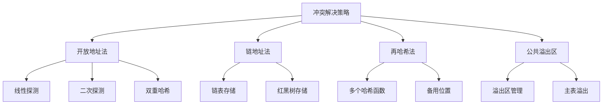

# 冲突解决策略

## 📖 核心概念

**冲突解决策略（Collision Resolution Strategy）**是哈希表中处理哈希冲突的方法。当不同的键映射到相同的哈希值时，需要采用特定的策略来存储这些键值对，保证哈希表的正确性和效率。

### 🏗️ 冲突解决策略的组成要素



## 🔍 冲突解决策略分类

### 按存储方式分类

| 策略 | 存储方式 | 优点 | 缺点 | 适用场景 |
|------|----------|------|------|----------|
| **开放地址法** | 数组内存储 | 空间效率高 | 聚集现象 | 内存受限 |
| **链地址法** | 链表存储 | 简单稳定 | 指针开销 | 一般应用 |
| **再哈希法** | 多函数映射 | 减少聚集 | 计算开销 | 特殊需求 |
| **公共溢出区** | 溢出表 | 主表稳定 | 额外空间 | 固定大小 |

### 按探测方式分类

| 探测方式 | 特点 | 优点 | 缺点 | 性能 |
|----------|------|------|------|------|
| **线性探测** | 顺序查找 | 简单实现 | 聚集严重 | 较差 |
| **二次探测** | 平方步长 | 减少聚集 | 可能死循环 | 中等 |
| **双重哈希** | 两个函数 | 分布均匀 | 实现复杂 | 较好 |
| **随机探测** | 随机步长 | 避免聚集 | 不可重现 | 一般 |

## 💻 开放地址法实现

### 线性探测

```cpp
template<typename K, typename V>
class LinearProbingHashTable {
private:
    enum class BucketState {
        EMPTY,
        OCCUPIED,
        DELETED
    };
    
    struct Bucket {
        K key;
        V value;
        BucketState state;
        
        Bucket() : state(BucketState::EMPTY) {}
    };
    
    vector<Bucket> buckets;
    int capacity;
    int size;
    double loadFactor;
    
    // 哈希函数
    size_t hashFunction(const K& key) const {
        return std::hash<K>{}(key) % capacity;
    }
    
    // 线性探测
    size_t linearProbe(size_t index, int step) const {
        return (index + step) % capacity;
    }
    
    // 扩容
    void resize() {
        int oldCapacity = capacity;
        vector<Bucket> oldBuckets = buckets;
        
        capacity *= 2;
        buckets.clear();
        buckets.resize(capacity);
        size = 0;
        
        // 重新插入所有元素
        for (int i = 0; i < oldCapacity; i++) {
            if (oldBuckets[i].state == BucketState::OCCUPIED) {
                insert(oldBuckets[i].key, oldBuckets[i].value);
            }
        }
    }
    
public:
    LinearProbingHashTable(int cap = 16, double lf = 0.75) 
        : capacity(cap), size(0), loadFactor(lf) {
        buckets.resize(capacity);
    }
    
    // 插入键值对
    void insert(const K& key, const V& value) {
        if (size >= capacity * loadFactor) {
            resize();
        }
        
        size_t index = hashFunction(key);
        int step = 0;
        
        // 查找插入位置
        while (buckets[index].state == BucketState::OCCUPIED) {
            if (buckets[index].key == key) {
                buckets[index].value = value; // 更新值
                return;
            }
            index = linearProbe(index, ++step);
        }
        
        // 插入新元素
        buckets[index].key = key;
        buckets[index].value = value;
        buckets[index].state = BucketState::OCCUPIED;
        size++;
    }
    
    // 查找值
    V* find(const K& key) {
        size_t index = hashFunction(key);
        int step = 0;
        
        while (buckets[index].state != BucketState::EMPTY) {
            if (buckets[index].state == BucketState::OCCUPIED && 
                buckets[index].key == key) {
                return &buckets[index].value;
            }
            index = linearProbe(index, ++step);
        }
        
        return nullptr;
    }
    
    // 删除键值对
    bool erase(const K& key) {
        size_t index = hashFunction(key);
        int step = 0;
        
        while (buckets[index].state != BucketState::EMPTY) {
            if (buckets[index].state == BucketState::OCCUPIED && 
                buckets[index].key == key) {
                buckets[index].state = BucketState::DELETED;
                size--;
                return true;
            }
            index = linearProbe(index, ++step);
        }
        
        return false;
    }
    
    // 获取负载因子
    double getLoadFactor() const {
        return static_cast<double>(size) / capacity;
    }
    
    // 获取聚集程度
    double getClusteringFactor() const {
        int clusters = 0;
        bool inCluster = false;
        
        for (int i = 0; i < capacity; i++) {
            if (buckets[i].state == BucketState::OCCUPIED) {
                if (!inCluster) {
                    clusters++;
                    inCluster = true;
                }
            } else {
                inCluster = false;
            }
        }
        
        return static_cast<double>(size) / clusters;
    }
};
```

### 二次探测

```cpp
template<typename K, typename V>
class QuadraticProbingHashTable {
private:
    enum class BucketState {
        EMPTY,
        OCCUPIED,
        DELETED
    };
    
    struct Bucket {
        K key;
        V value;
        BucketState state;
        
        Bucket() : state(BucketState::EMPTY) {}
    };
    
    vector<Bucket> buckets;
    int capacity;
    int size;
    double loadFactor;
    
    // 哈希函数
    size_t hashFunction(const K& key) const {
        return std::hash<K>{}(key) % capacity;
    }
    
    // 二次探测
    size_t quadraticProbe(size_t index, int step) const {
        return (index + step * step) % capacity;
    }
    
    // 检查容量是否为质数
    bool isPrime(int n) const {
        if (n <= 1) return false;
        if (n <= 3) return true;
        if (n % 2 == 0 || n % 3 == 0) return false;
        
        for (int i = 5; i * i <= n; i += 6) {
            if (n % i == 0 || n % (i + 2) == 0) {
                return false;
            }
        }
        return true;
    }
    
    // 获取下一个质数
    int getNextPrime(int n) const {
        while (!isPrime(n)) {
            n++;
        }
        return n;
    }
    
    // 扩容
    void resize() {
        int oldCapacity = capacity;
        vector<Bucket> oldBuckets = buckets;
        
        capacity = getNextPrime(capacity * 2);
        buckets.clear();
        buckets.resize(capacity);
        size = 0;
        
        // 重新插入所有元素
        for (int i = 0; i < oldCapacity; i++) {
            if (oldBuckets[i].state == BucketState::OCCUPIED) {
                insert(oldBuckets[i].key, oldBuckets[i].value);
            }
        }
    }
    
public:
    QuadraticProbingHashTable(int cap = 16, double lf = 0.75) 
        : capacity(getNextPrime(cap)), size(0), loadFactor(lf) {
        buckets.resize(capacity);
    }
    
    // 插入键值对
    void insert(const K& key, const V& value) {
        if (size >= capacity * loadFactor) {
            resize();
        }
        
        size_t index = hashFunction(key);
        int step = 0;
        
        // 查找插入位置
        while (buckets[index].state == BucketState::OCCUPIED) {
            if (buckets[index].key == key) {
                buckets[index].value = value; // 更新值
                return;
            }
            index = quadraticProbe(index, ++step);
        }
        
        // 插入新元素
        buckets[index].key = key;
        buckets[index].value = value;
        buckets[index].state = BucketState::OCCUPIED;
        size++;
    }
    
    // 查找值
    V* find(const K& key) {
        size_t index = hashFunction(key);
        int step = 0;
        
        while (buckets[index].state != BucketState::EMPTY) {
            if (buckets[index].state == BucketState::OCCUPIED && 
                buckets[index].key == key) {
                return &buckets[index].value;
            }
            index = quadraticProbe(index, ++step);
        }
        
        return nullptr;
    }
    
    // 删除键值对
    bool erase(const K& key) {
        size_t index = hashFunction(key);
        int step = 0;
        
        while (buckets[index].state != BucketState::EMPTY) {
            if (buckets[index].state == BucketState::OCCUPIED && 
                buckets[index].key == key) {
                buckets[index].state = BucketState::DELETED;
                size--;
                return true;
            }
            index = quadraticProbe(index, ++step);
        }
        
        return false;
    }
    
    // 获取负载因子
    double getLoadFactor() const {
        return static_cast<double>(size) / capacity;
    }
};
```

### 双重哈希

```cpp
template<typename K, typename V>
class DoubleHashingHashTable {
private:
    enum class BucketState {
        EMPTY,
        OCCUPIED,
        DELETED
    };
    
    struct Bucket {
        K key;
        V value;
        BucketState state;
        
        Bucket() : state(BucketState::EMPTY) {}
    };
    
    vector<Bucket> buckets;
    int capacity;
    int size;
    double loadFactor;
    
    // 第一个哈希函数
    size_t hashFunction1(const K& key) const {
        return std::hash<K>{}(key) % capacity;
    }
    
    // 第二个哈希函数
    size_t hashFunction2(const K& key) const {
        return 1 + (std::hash<K>{}(key) % (capacity - 1));
    }
    
    // 双重哈希探测
    size_t doubleHashProbe(size_t index, int step, const K& key) const {
        return (index + step * hashFunction2(key)) % capacity;
    }
    
    // 检查容量是否为质数
    bool isPrime(int n) const {
        if (n <= 1) return false;
        if (n <= 3) return true;
        if (n % 2 == 0 || n % 3 == 0) return false;
        
        for (int i = 5; i * i <= n; i += 6) {
            if (n % i == 0 || n % (i + 2) == 0) {
                return false;
            }
        }
        return true;
    }
    
    // 获取下一个质数
    int getNextPrime(int n) const {
        while (!isPrime(n)) {
            n++;
        }
        return n;
    }
    
    // 扩容
    void resize() {
        int oldCapacity = capacity;
        vector<Bucket> oldBuckets = buckets;
        
        capacity = getNextPrime(capacity * 2);
        buckets.clear();
        buckets.resize(capacity);
        size = 0;
        
        // 重新插入所有元素
        for (int i = 0; i < oldCapacity; i++) {
            if (oldBuckets[i].state == BucketState::OCCUPIED) {
                insert(oldBuckets[i].key, oldBuckets[i].value);
            }
        }
    }
    
public:
    DoubleHashingHashTable(int cap = 16, double lf = 0.75) 
        : capacity(getNextPrime(cap)), size(0), loadFactor(lf) {
        buckets.resize(capacity);
    }
    
    // 插入键值对
    void insert(const K& key, const V& value) {
        if (size >= capacity * loadFactor) {
            resize();
        }
        
        size_t index = hashFunction1(key);
        int step = 0;
        
        // 查找插入位置
        while (buckets[index].state == BucketState::OCCUPIED) {
            if (buckets[index].key == key) {
                buckets[index].value = value; // 更新值
                return;
            }
            index = doubleHashProbe(index, ++step, key);
        }
        
        // 插入新元素
        buckets[index].key = key;
        buckets[index].value = value;
        buckets[index].state = BucketState::OCCUPIED;
        size++;
    }
    
    // 查找值
    V* find(const K& key) {
        size_t index = hashFunction1(key);
        int step = 0;
        
        while (buckets[index].state != BucketState::EMPTY) {
            if (buckets[index].state == BucketState::OCCUPIED && 
                buckets[index].key == key) {
                return &buckets[index].value;
            }
            index = doubleHashProbe(index, ++step, key);
        }
        
        return nullptr;
    }
    
    // 删除键值对
    bool erase(const K& key) {
        size_t index = hashFunction1(key);
        int step = 0;
        
        while (buckets[index].state != BucketState::EMPTY) {
            if (buckets[index].state == BucketState::OCCUPIED && 
                buckets[index].key == key) {
                buckets[index].state = BucketState::DELETED;
                size--;
                return true;
            }
            index = doubleHashProbe(index, ++step, key);
        }
        
        return false;
    }
    
    // 获取负载因子
    double getLoadFactor() const {
        return static_cast<double>(size) / capacity;
    }
};
```

## 💻 链地址法实现

### 基础链地址法

```cpp
template<typename K, typename V>
class ChainingHashTable {
private:
    struct HashNode {
        K key;
        V value;
        HashNode* next;
        
        HashNode(const K& k, const V& v) : key(k), value(v), next(nullptr) {}
    };
    
    vector<HashNode*> buckets;
    int capacity;
    int size;
    double loadFactor;
    
    // 哈希函数
    size_t hashFunction(const K& key) const {
        return std::hash<K>{}(key) % capacity;
    }
    
    // 扩容
    void resize() {
        int oldCapacity = capacity;
        vector<HashNode*> oldBuckets = buckets;
        
        capacity *= 2;
        buckets.clear();
        buckets.resize(capacity, nullptr);
        size = 0;
        
        // 重新哈希所有元素
        for (int i = 0; i < oldCapacity; i++) {
            HashNode* current = oldBuckets[i];
            while (current != nullptr) {
                HashNode* next = current->next;
                size_t newIndex = hashFunction(current->key);
                
                current->next = buckets[newIndex];
                buckets[newIndex] = current;
                
                current = next;
            }
        }
    }
    
public:
    ChainingHashTable(int cap = 16, double lf = 0.75) 
        : capacity(cap), size(0), loadFactor(lf) {
        buckets.resize(capacity, nullptr);
    }
    
    ~ChainingHashTable() {
        clear();
    }
    
    // 插入键值对
    void insert(const K& key, const V& value) {
        if (size >= capacity * loadFactor) {
            resize();
        }
        
        size_t index = hashFunction(key);
        HashNode* current = buckets[index];
        
        // 检查键是否已存在
        while (current != nullptr) {
            if (current->key == key) {
                current->value = value; // 更新值
                return;
            }
            current = current->next;
        }
        
        // 插入新节点
        HashNode* newNode = new HashNode(key, value);
        newNode->next = buckets[index];
        buckets[index] = newNode;
        size++;
    }
    
    // 查找值
    V* find(const K& key) {
        size_t index = hashFunction(key);
        HashNode* current = buckets[index];
        
        while (current != nullptr) {
            if (current->key == key) {
                return &current->value;
            }
            current = current->next;
        }
        
        return nullptr;
    }
    
    // 删除键值对
    bool erase(const K& key) {
        size_t index = hashFunction(key);
        HashNode* current = buckets[index];
        HashNode* prev = nullptr;
        
        while (current != nullptr) {
            if (current->key == key) {
                if (prev == nullptr) {
                    buckets[index] = current->next;
                } else {
                    prev->next = current->next;
                }
                
                delete current;
                size--;
                return true;
            }
            
            prev = current;
            current = current->next;
        }
        
        return false;
    }
    
    // 获取负载因子
    double getLoadFactor() const {
        return static_cast<double>(size) / capacity;
    }
    
    // 获取平均链长度
    double getAverageChainLength() const {
        int nonEmptyBuckets = 0;
        for (int i = 0; i < capacity; i++) {
            if (buckets[i] != nullptr) {
                nonEmptyBuckets++;
            }
        }
        
        return nonEmptyBuckets > 0 ? static_cast<double>(size) / nonEmptyBuckets : 0.0;
    }
    
    // 获取最大链长度
    int getMaxChainLength() const {
        int maxLength = 0;
        for (int i = 0; i < capacity; i++) {
            int length = 0;
            HashNode* current = buckets[i];
            while (current != nullptr) {
                length++;
                current = current->next;
            }
            maxLength = max(maxLength, length);
        }
        return maxLength;
    }
    
    // 清空哈希表
    void clear() {
        for (int i = 0; i < capacity; i++) {
            HashNode* current = buckets[i];
            while (current != nullptr) {
                HashNode* next = current->next;
                delete current;
                current = next;
            }
            buckets[i] = nullptr;
        }
        size = 0;
    }
};
```

## 🎯 冲突解决策略比较

### 性能比较

```cpp
class CollisionResolutionComparison {
public:
    // 比较不同冲突解决策略的性能
    static void compareStrategies(const vector<string>& testData) {
        int tableSize = 1000;
        
        cout << "Collision Resolution Strategy Comparison:" << endl;
        cout << "Test data size: " << testData.size() << endl;
        cout << "Table size: " << tableSize << endl;
        cout << endl;
        
        // 测试线性探测
        auto start = chrono::high_resolution_clock::now();
        LinearProbingHashTable<string, int> linearTable(tableSize);
        for (const string& data : testData) {
            linearTable.insert(data, 1);
        }
        auto end = chrono::high_resolution_clock::now();
        auto linearTime = chrono::duration_cast<chrono::microseconds>(end - start);
        
        cout << "Linear Probing:" << endl;
        cout << "Time: " << linearTime.count() << " microseconds" << endl;
        cout << "Load factor: " << linearTable.getLoadFactor() << endl;
        cout << "Clustering factor: " << linearTable.getClusteringFactor() << endl;
        cout << endl;
        
        // 测试二次探测
        start = chrono::high_resolution_clock::now();
        QuadraticProbingHashTable<string, int> quadraticTable(tableSize);
        for (const string& data : testData) {
            quadraticTable.insert(data, 1);
        }
        end = chrono::high_resolution_clock::now();
        auto quadraticTime = chrono::duration_cast<chrono::microseconds>(end - start);
        
        cout << "Quadratic Probing:" << endl;
        cout << "Time: " << quadraticTime.count() << " microseconds" << endl;
        cout << "Load factor: " << quadraticTable.getLoadFactor() << endl;
        cout << endl;
        
        // 测试双重哈希
        start = chrono::high_resolution_clock::now();
        DoubleHashingHashTable<string, int> doubleTable(tableSize);
        for (const string& data : testData) {
            doubleTable.insert(data, 1);
        }
        end = chrono::high_resolution_clock::now();
        auto doubleTime = chrono::duration_cast<chrono::microseconds>(end - start);
        
        cout << "Double Hashing:" << endl;
        cout << "Time: " << doubleTime.count() << " microseconds" << endl;
        cout << "Load factor: " << doubleTable.getLoadFactor() << endl;
        cout << endl;
        
        // 测试链地址法
        start = chrono::high_resolution_clock::now();
        ChainingHashTable<string, int> chainingTable(tableSize);
        for (const string& data : testData) {
            chainingTable.insert(data, 1);
        }
        end = chrono::high_resolution_clock::now();
        auto chainingTime = chrono::duration_cast<chrono::microseconds>(end - start);
        
        cout << "Chaining:" << endl;
        cout << "Time: " << chainingTime.count() << " microseconds" << endl;
        cout << "Load factor: " << chainingTable.getLoadFactor() << endl;
        cout << "Average chain length: " << chainingTable.getAverageChainLength() << endl;
        cout << "Max chain length: " << chainingTable.getMaxChainLength() << endl;
        cout << endl;
    }
    
    // 测试查找性能
    static void compareLookupPerformance(const vector<string>& testData) {
        int tableSize = 1000;
        
        // 构建测试表
        LinearProbingHashTable<string, int> linearTable(tableSize);
        QuadraticProbingHashTable<string, int> quadraticTable(tableSize);
        DoubleHashingHashTable<string, int> doubleTable(tableSize);
        ChainingHashTable<string, int> chainingTable(tableSize);
        
        for (const string& data : testData) {
            linearTable.insert(data, 1);
            quadraticTable.insert(data, 1);
            doubleTable.insert(data, 1);
            chainingTable.insert(data, 1);
        }
        
        cout << "Lookup Performance Comparison:" << endl;
        
        // 测试查找性能
        auto start = chrono::high_resolution_clock::now();
        for (const string& data : testData) {
            linearTable.find(data);
        }
        auto end = chrono::high_resolution_clock::now();
        auto linearTime = chrono::duration_cast<chrono::microseconds>(end - start);
        
        start = chrono::high_resolution_clock::now();
        for (const string& data : testData) {
            quadraticTable.find(data);
        }
        end = chrono::high_resolution_clock::now();
        auto quadraticTime = chrono::duration_cast<chrono::microseconds>(end - start);
        
        start = chrono::high_resolution_clock::now();
        for (const string& data : testData) {
            doubleTable.find(data);
        }
        end = chrono::high_resolution_clock::now();
        auto doubleTime = chrono::duration_cast<chrono::microseconds>(end - start);
        
        start = chrono::high_resolution_clock::now();
        for (const string& data : testData) {
            chainingTable.find(data);
        }
        end = chrono::high_resolution_clock::now();
        auto chainingTime = chrono::duration_cast<chrono::microseconds>(end - start);
        
        cout << "Linear Probing: " << linearTime.count() << " microseconds" << endl;
        cout << "Quadratic Probing: " << quadraticTime.count() << " microseconds" << endl;
        cout << "Double Hashing: " << doubleTime.count() << " microseconds" << endl;
        cout << "Chaining: " << chainingTime.count() << " microseconds" << endl;
    }
};
```

## ⚡ 复杂度分析

### 时间复杂度

| 策略 | 平均情况 | 最坏情况 | 说明 |
|------|----------|----------|------|
| **线性探测** | O(1) | O(n) | 聚集现象 |
| **二次探测** | O(1) | O(n) | 减少聚集 |
| **双重哈希** | O(1) | O(log n) | 分布均匀 |
| **链地址法** | O(1) | O(n) | 链长度影响 |

### 空间复杂度

| 策略 | 空间复杂度 | 说明 |
|------|------------|------|
| **开放地址法** | O(n) | 数组存储 |
| **链地址法** | O(n) | 额外指针开销 |
| **再哈希法** | O(n) | 多个哈希函数 |
| **公共溢出区** | O(n) | 主表+溢出表 |

### 性能特点

| 特点 | 线性探测 | 二次探测 | 双重哈希 | 链地址法 |
|------|----------|----------|----------|----------|
| **实现难度** | 简单 | 中等 | 复杂 | 简单 |
| **空间效率** | 高 | 高 | 高 | 中等 |
| **聚集问题** | 严重 | 中等 | 轻微 | 无 |
| **删除操作** | 复杂 | 复杂 | 复杂 | 简单 |

## 🎓 学习要点总结

### 核心理解

1. **冲突本质**：理解哈希冲突的根本原因
2. **策略选择**：掌握不同策略的适用场景
3. **性能影响**：理解冲突解决对性能的影响
4. **负载因子**：掌握负载因子与性能的关系

### 实践要点

1. **策略实现**：正确实现各种冲突解决策略
2. **性能测试**：测试不同策略的性能表现
3. **参数调优**：根据测试结果调整参数
4. **内存管理**：注意内存泄漏和指针管理

### 应用思维

1. **场景选择**：根据应用场景选择合适的策略
2. **性能优化**：理解性能优化的原理和方法
3. **系统设计**：掌握哈希表在系统设计中的应用
4. **问题解决**：能够分析和解决哈希表相关问题

---

**相关链接：**
- [[05-高级结构/01-哈希宇宙/01-哈希表HashTable详解|哈希表HashTable详解]] - 哈希表的基本实现
- [[05-高级结构/01-哈希宇宙/02-哈希函数设计|哈希函数设计]] - 哈希函数的设计原理
- [[03-层次宇宙/02-二叉树王国/01-二叉树基础|二叉树基础]] - 链地址法中的树结构
- [[06-应用实战/03-缓存系统/01-缓存策略|缓存策略]] - 哈希表在缓存中的应用
