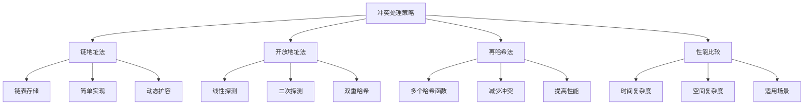

# 冲突处理策略

## 📖 核心概念

**冲突处理策略**是哈希表实现中的重要技术，用于解决不同键映射到相同索引的问题。主要包括链地址法、开放地址法和再哈希法。

### 🏗️ 冲突处理策略分类



## 🔧 冲突处理策略实现

### 链地址法

```cpp
class ChainingHashTable {
private:
    struct Node {
        int key;
        int value;
        Node* next;
        
        Node(int k, int v) : key(k), value(v), next(nullptr) {}
    };
    
    vector<Node*> table;
    int capacity;
    int size;
    
    // 哈希函数
    int hashFunction(int key) {
        return key % capacity;
    }
    
    // 扩容
    void resize() {
        int oldCapacity = capacity;
        capacity *= 2;
        vector<Node*> newTable(capacity, nullptr);
        
        for (int i = 0; i < oldCapacity; ++i) {
            Node* current = table[i];
            while (current) {
                Node* next = current->next;
                int index = hashFunction(current->key);
                current->next = newTable[index];
                newTable[index] = current;
                current = next;
            }
        }
        
        table = newTable;
    }
    
public:
    ChainingHashTable(int cap = 16) : capacity(cap), size(0) {
        table.resize(capacity, nullptr);
    }
    
    // 插入
    void put(int key, int value) {
        int index = hashFunction(key);
        Node* current = table[index];
        
        // 检查是否已存在
        while (current) {
            if (current->key == key) {
                current->value = value;
                return;
            }
            current = current->next;
        }
        
        // 插入新节点
        Node* newNode = new Node(key, value);
        newNode->next = table[index];
        table[index] = newNode;
        size++;
        
        // 检查负载因子
        if (size > capacity * 0.75) {
            resize();
        }
    }
    
    // 获取
    int get(int key) {
        int index = hashFunction(key);
        Node* current = table[index];
        
        while (current) {
            if (current->key == key) {
                return current->value;
            }
            current = current->next;
        }
        
        return -1; // 未找到
    }
    
    // 删除
    bool remove(int key) {
        int index = hashFunction(key);
        Node* current = table[index];
        Node* prev = nullptr;
        
        while (current) {
            if (current->key == key) {
                if (prev) {
                    prev->next = current->next;
                } else {
                    table[index] = current->next;
                }
                delete current;
                size--;
                return true;
            }
            prev = current;
            current = current->next;
        }
        
        return false;
    }
    
    // 显示链地址法过程
    void displayChainingProcess() {
        cout << "Chaining Hash Table Process:" << endl;
        cout << "==========================" << endl;
        cout << "Capacity: " << capacity << endl;
        cout << "Size: " << size << endl;
        cout << "Load Factor: " << (double)size / capacity << endl;
        
        for (int i = 0; i < capacity; ++i) {
            if (table[i]) {
                cout << "Index " << i << ": ";
                Node* current = table[i];
                while (current) {
                    cout << "(" << current->key << ", " << current->value << ") ";
                    current = current->next;
                }
                cout << endl;
            }
        }
    }
    
    // 显示统计信息
    void displayChainingStats() {
        cout << "Chaining Hash Table Statistics:" << endl;
        cout << "==============================" << endl;
        
        int emptySlots = 0;
        int maxChainLength = 0;
        int totalChains = 0;
        int totalCollisions = 0;
        
        for (int i = 0; i < capacity; ++i) {
            if (table[i]) {
                totalChains++;
                int chainLength = 0;
                Node* current = table[i];
                while (current) {
                    chainLength++;
                    current = current->next;
                }
                
                if (chainLength > 1) {
                    totalCollisions += chainLength - 1;
                }
                
                maxChainLength = max(maxChainLength, chainLength);
            } else {
                emptySlots++;
            }
        }
        
        cout << "Empty Slots: " << emptySlots << endl;
        cout << "Non-empty Slots: " << totalChains << endl;
        cout << "Max Chain Length: " << maxChainLength << endl;
        cout << "Total Collisions: " << totalCollisions << endl;
        cout << "Average Chain Length: " << (totalChains > 0 ? (double)size / totalChains : 0) << endl;
    }
};
```

### 开放地址法

```cpp
class OpenAddressingHashTable {
private:
    struct Entry {
        int key;
        int value;
        bool isDeleted;
        
        Entry() : key(-1), value(-1), isDeleted(false) {}
        Entry(int k, int v) : key(k), value(v), isDeleted(false) {}
    };
    
    vector<Entry> table;
    int capacity;
    int size;
    
    // 哈希函数
    int hashFunction(int key) {
        return key % capacity;
    }
    
    // 线性探测
    int linearProbe(int key, int i) {
        return (hashFunction(key) + i) % capacity;
    }
    
    // 二次探测
    int quadraticProbe(int key, int i) {
        return (hashFunction(key) + i * i) % capacity;
    }
    
    // 双重哈希
    int doubleHash(int key, int i) {
        int hash1 = hashFunction(key);
        int hash2 = 7 - (key % 7);
        return (hash1 + i * hash2) % capacity;
    }
    
    // 扩容
    void resize() {
        int oldCapacity = capacity;
        capacity *= 2;
        vector<Entry> newTable(capacity);
        
        for (int i = 0; i < oldCapacity; ++i) {
            if (table[i].key != -1 && !table[i].isDeleted) {
                int key = table[i].key;
                int value = table[i].value;
                
                int index = hashFunction(key);
                int j = 0;
                while (newTable[index].key != -1) {
                    index = linearProbe(key, ++j);
                }
                newTable[index] = Entry(key, value);
            }
        }
        
        table = newTable;
    }
    
public:
    OpenAddressingHashTable(int cap = 16) : capacity(cap), size(0) {
        table.resize(capacity);
    }
    
    // 插入（线性探测）
    void putLinear(int key, int value) {
        int index = hashFunction(key);
        int i = 0;
        
        // 查找插入位置
        while (table[index].key != -1 && table[index].key != key && !table[index].isDeleted) {
            index = linearProbe(key, ++i);
        }
        
        if (table[index].key == key) {
            table[index].value = value;
        } else {
            table[index] = Entry(key, value);
            size++;
            
            // 检查负载因子
            if (size > capacity * 0.5) {
                resize();
            }
        }
    }
    
    // 插入（二次探测）
    void putQuadratic(int key, int value) {
        int index = hashFunction(key);
        int i = 0;
        
        // 查找插入位置
        while (table[index].key != -1 && table[index].key != key && !table[index].isDeleted) {
            index = quadraticProbe(key, ++i);
        }
        
        if (table[index].key == key) {
            table[index].value = value;
        } else {
            table[index] = Entry(key, value);
            size++;
            
            // 检查负载因子
            if (size > capacity * 0.5) {
                resize();
            }
        }
    }
    
    // 插入（双重哈希）
    void putDoubleHash(int key, int value) {
        int index = hashFunction(key);
        int i = 0;
        
        // 查找插入位置
        while (table[index].key != -1 && table[index].key != key && !table[index].isDeleted) {
            index = doubleHash(key, ++i);
        }
        
        if (table[index].key == key) {
            table[index].value = value;
        } else {
            table[index] = Entry(key, value);
            size++;
            
            // 检查负载因子
            if (size > capacity * 0.5) {
                resize();
            }
        }
    }
    
    // 获取
    int get(int key) {
        int index = hashFunction(key);
        int i = 0;
        
        while (table[index].key != -1) {
            if (table[index].key == key && !table[index].isDeleted) {
                return table[index].value;
            }
            index = linearProbe(key, ++i);
        }
        
        return -1; // 未找到
    }
    
    // 删除
    bool remove(int key) {
        int index = hashFunction(key);
        int i = 0;
        
        while (table[index].key != -1) {
            if (table[index].key == key && !table[index].isDeleted) {
                table[index].isDeleted = true;
                size--;
                return true;
            }
            index = linearProbe(key, ++i);
        }
        
        return false;
    }
    
    // 显示开放地址法过程
    void displayOpenAddressingProcess() {
        cout << "Open Addressing Hash Table Process:" << endl;
        cout << "=================================" << endl;
        cout << "Capacity: " << capacity << endl;
        cout << "Size: " << size << endl;
        cout << "Load Factor: " << (double)size / capacity << endl;
        
        for (int i = 0; i < capacity; ++i) {
            if (table[i].key != -1 && !table[i].isDeleted) {
                cout << "Index " << i << ": (" << table[i].key << ", " << table[i].value << ")" << endl;
            }
        }
    }
    
    // 显示统计信息
    void displayOpenAddressingStats() {
        cout << "Open Addressing Hash Table Statistics:" << endl;
        cout << "====================================" << endl;
        
        int emptySlots = 0;
        int deletedSlots = 0;
        int occupiedSlots = 0;
        
        for (int i = 0; i < capacity; ++i) {
            if (table[i].key == -1) {
                emptySlots++;
            } else if (table[i].isDeleted) {
                deletedSlots++;
            } else {
                occupiedSlots++;
            }
        }
        
        cout << "Empty Slots: " << emptySlots << endl;
        cout << "Deleted Slots: " << deletedSlots << endl;
        cout << "Occupied Slots: " << occupiedSlots << endl;
        cout << "Load Factor: " << (double)occupiedSlots / capacity << endl;
    }
};
```

### 再哈希法

```cpp
class RehashingHashTable {
private:
    struct Entry {
        int key;
        int value;
        bool isDeleted;
        
        Entry() : key(-1), value(-1), isDeleted(false) {}
        Entry(int k, int v) : key(k), value(v), isDeleted(false) {}
    };
    
    vector<Entry> table;
    int capacity;
    int size;
    int hashFunctionCount;
    
    // 多个哈希函数
    int hashFunction1(int key) {
        return key % capacity;
    }
    
    int hashFunction2(int key) {
        return (key / capacity) % capacity;
    }
    
    int hashFunction3(int key) {
        return (key * 7) % capacity;
    }
    
    // 选择哈希函数
    int selectHashFunction(int key, int attempt) {
        switch (attempt % hashFunctionCount) {
            case 0: return hashFunction1(key);
            case 1: return hashFunction2(key);
            case 2: return hashFunction3(key);
            default: return hashFunction1(key);
        }
    }
    
    // 扩容
    void resize() {
        int oldCapacity = capacity;
        capacity *= 2;
        vector<Entry> newTable(capacity);
        
        for (int i = 0; i < oldCapacity; ++i) {
            if (table[i].key != -1 && !table[i].isDeleted) {
                int key = table[i].key;
                int value = table[i].value;
                
                int index = hashFunction1(key);
                int attempt = 0;
                while (newTable[index].key != -1) {
                    index = selectHashFunction(key, ++attempt);
                }
                newTable[index] = Entry(key, value);
            }
        }
        
        table = newTable;
    }
    
public:
    RehashingHashTable(int cap = 16, int hfCount = 3) : capacity(cap), size(0), hashFunctionCount(hfCount) {
        table.resize(capacity);
    }
    
    // 插入
    void put(int key, int value) {
        int index = hashFunction1(key);
        int attempt = 0;
        
        // 查找插入位置
        while (table[index].key != -1 && table[index].key != key && !table[index].isDeleted) {
            index = selectHashFunction(key, ++attempt);
        }
        
        if (table[index].key == key) {
            table[index].value = value;
        } else {
            table[index] = Entry(key, value);
            size++;
            
            // 检查负载因子
            if (size > capacity * 0.5) {
                resize();
            }
        }
    }
    
    // 获取
    int get(int key) {
        int index = hashFunction1(key);
        int attempt = 0;
        
        while (table[index].key != -1) {
            if (table[index].key == key && !table[index].isDeleted) {
                return table[index].value;
            }
            index = selectHashFunction(key, ++attempt);
        }
        
        return -1; // 未找到
    }
    
    // 删除
    bool remove(int key) {
        int index = hashFunction1(key);
        int attempt = 0;
        
        while (table[index].key != -1) {
            if (table[index].key == key && !table[index].isDeleted) {
                table[index].isDeleted = true;
                size--;
                return true;
            }
            index = selectHashFunction(key, ++attempt);
        }
        
        return false;
    }
    
    // 显示再哈希法过程
    void displayRehashingProcess() {
        cout << "Rehashing Hash Table Process:" << endl;
        cout << "===========================" << endl;
        cout << "Capacity: " << capacity << endl;
        cout << "Size: " << size << endl;
        cout << "Hash Functions: " << hashFunctionCount << endl;
        cout << "Load Factor: " << (double)size / capacity << endl;
        
        for (int i = 0; i < capacity; ++i) {
            if (table[i].key != -1 && !table[i].isDeleted) {
                cout << "Index " << i << ": (" << table[i].key << ", " << table[i].value << ")" << endl;
            }
        }
    }
    
    // 显示统计信息
    void displayRehashingStats() {
        cout << "Rehashing Hash Table Statistics:" << endl;
        cout << "===============================" << endl;
        
        int emptySlots = 0;
        int deletedSlots = 0;
        int occupiedSlots = 0;
        
        for (int i = 0; i < capacity; ++i) {
            if (table[i].key == -1) {
                emptySlots++;
            } else if (table[i].isDeleted) {
                deletedSlots++;
            } else {
                occupiedSlots++;
            }
        }
        
        cout << "Empty Slots: " << emptySlots << endl;
        cout << "Deleted Slots: " << deletedSlots << endl;
        cout << "Occupied Slots: " << occupiedSlots << endl;
        cout << "Load Factor: " << (double)occupiedSlots / capacity << endl;
        cout << "Hash Functions Used: " << hashFunctionCount << endl;
    }
};
```

## 🎯 冲突处理策略应用

### 性能比较

```cpp
class ConflictResolutionComparison {
public:
    static void compareStrategies() {
        cout << "Conflict Resolution Strategy Comparison:" << endl;
        cout << "======================================" << endl;
        
        cout << "1. Chaining (Separate Chaining):" << endl;
        cout << "   - Time Complexity: O(1 + α) where α is load factor" << endl;
        cout << "   - Space Complexity: O(n + m)" << endl;
        cout << "   - Advantages: Simple, handles deletions well" << endl;
        cout << "   - Disadvantages: Extra memory for pointers" << endl;
        
        cout << "2. Open Addressing:" << endl;
        cout << "   - Time Complexity: O(1/(1-α))" << endl;
        cout << "   - Space Complexity: O(m)" << endl;
        cout << "   - Advantages: Better cache locality" << endl;
        cout << "   - Disadvantages: Complex deletion, clustering" << endl;
        
        cout << "3. Rehashing:" << endl;
        cout << "   - Time Complexity: O(1) average" << endl;
        cout << "   - Space Complexity: O(m)" << endl;
        cout << "   - Advantages: Reduces clustering" << endl;
        cout << "   - Disadvantages: Multiple hash functions" << endl;
    }
    
    static void analyzePerformance() {
        cout << "Performance Analysis:" << endl;
        cout << "===================" << endl;
        
        cout << "1. Best Case:" << endl;
        cout << "   - Chaining: O(1)" << endl;
        cout << "   - Open Addressing: O(1)" << endl;
        cout << "   - Rehashing: O(1)" << endl;
        
        cout << "2. Average Case:" << endl;
        cout << "   - Chaining: O(1 + α)" << endl;
        cout << "   - Open Addressing: O(1/(1-α))" << endl;
        cout << "   - Rehashing: O(1)" << endl;
        
        cout << "3. Worst Case:" << endl;
        cout << "   - Chaining: O(n)" << endl;
        cout << "   - Open Addressing: O(n)" << endl;
        cout << "   - Rehashing: O(n)" << endl;
    }
    
    static void selectStrategy(bool needsDeletion, bool hasMemoryConstraints, bool needsCacheLocality) {
        cout << "Strategy Selection:" << endl;
        cout << "==================" << endl;
        
        cout << "Needs deletion: " << (needsDeletion ? "Yes" : "No") << endl;
        cout << "Has memory constraints: " << (hasMemoryConstraints ? "Yes" : "No") << endl;
        cout << "Needs cache locality: " << (needsCacheLocality ? "Yes" : "No") << endl;
        
        cout << "Recommendation:" << endl;
        
        if (needsDeletion) {
            cout << "Use Chaining (handles deletions well)" << endl;
        } else if (needsCacheLocality) {
            cout << "Use Open Addressing (better cache locality)" << endl;
        } else if (hasMemoryConstraints) {
            cout << "Use Open Addressing (less memory overhead)" << endl;
        } else {
            cout << "Use Rehashing (reduces clustering)" << endl;
        }
    }
};
```

### 实际应用

```cpp
class ConflictResolutionApplications {
public:
    static void testChainingPerformance() {
        cout << "Testing Chaining Performance:" << endl;
        cout << "============================" << endl;
        
        ChainingHashTable chainingTable(8);
        
        vector<int> keys = {1, 2, 3, 4, 5, 6, 7, 8, 9, 10, 11, 12, 13, 14, 15, 16};
        
        for (int key : keys) {
            chainingTable.put(key, key * 10);
        }
        
        chainingTable.displayChainingProcess();
        chainingTable.displayChainingStats();
    }
    
    static void testOpenAddressingPerformance() {
        cout << "Testing Open Addressing Performance:" << endl;
        cout << "==================================" << endl;
        
        OpenAddressingHashTable openAddressingTable(8);
        
        vector<int> keys = {1, 2, 3, 4, 5, 6, 7, 8, 9, 10, 11, 12, 13, 14, 15, 16};
        
        for (int key : keys) {
            openAddressingTable.putLinear(key, key * 10);
        }
        
        openAddressingTable.displayOpenAddressingProcess();
        openAddressingTable.displayOpenAddressingStats();
    }
    
    static void testRehashingPerformance() {
        cout << "Testing Rehashing Performance:" << endl;
        cout << "============================" << endl;
        
        RehashingHashTable rehashingTable(8, 3);
        
        vector<int> keys = {1, 2, 3, 4, 5, 6, 7, 8, 9, 10, 11, 12, 13, 14, 15, 16};
        
        for (int key : keys) {
            rehashingTable.put(key, key * 10);
        }
        
        rehashingTable.displayRehashingProcess();
        rehashingTable.displayRehashingStats();
    }
    
    static void testAllStrategies() {
        cout << "Testing All Conflict Resolution Strategies:" << endl;
        cout << "========================================" << endl;
        
        testChainingPerformance();
        cout << "\n";
        
        testOpenAddressingPerformance();
        cout << "\n";
        
        testRehashingPerformance();
        cout << "\n";
        
        ConflictResolutionComparison::compareStrategies();
        ConflictResolutionComparison::analyzePerformance();
        ConflictResolutionComparison::selectStrategy(true, false, false);
    }
};
```

## 📊 冲突处理策略分析

### 性能分析

```cpp
class ConflictResolutionAnalysis {
public:
    static void analyzePerformance() {
        cout << "Conflict Resolution Strategy Performance Analysis:" << endl;
        cout << "===============================================" << endl;
        
        cout << "1. Time Complexity:" << endl;
        cout << "   - Chaining: O(1 + α) where α is load factor" << endl;
        cout << "   - Open Addressing: O(1/(1-α))" << endl;
        cout << "   - Rehashing: O(1) average" << endl;
        
        cout << "2. Space Complexity:" << endl;
        cout << "   - Chaining: O(n + m)" << endl;
        cout << "   - Open Addressing: O(m)" << endl;
        cout << "   - Rehashing: O(m)" << endl;
        
        cout << "3. Load Factor Impact:" << endl;
        cout << "   - Chaining: Performance degrades linearly" << endl;
        cout << "   - Open Addressing: Performance degrades exponentially" << endl;
        cout << "   - Rehashing: Performance remains stable" << endl;
        
        cout << "4. Memory Usage:" << endl;
        cout << "   - Chaining: Extra memory for pointers" << endl;
        cout << "   - Open Addressing: No extra memory" << endl;
        cout << "   - Rehashing: No extra memory" << endl;
    }
    
    static void analyzeSpaceComplexity() {
        cout << "Conflict Resolution Strategy Space Complexity Analysis:" << endl;
        cout << "====================================================" << endl;
        
        cout << "1. Chaining:" << endl;
        cout << "   - Hash table: O(m)" << endl;
        cout << "   - Linked lists: O(n)" << endl;
        cout << "   - Total: O(m + n)" << endl;
        
        cout << "2. Open Addressing:" << endl;
        cout << "   - Hash table: O(m)" << endl;
        cout << "   - Total: O(m)" << endl;
        
        cout << "3. Rehashing:" << endl;
        cout << "   - Hash table: O(m)" << endl;
        cout << "   - Total: O(m)" << endl;
        
        cout << "4. Memory Efficiency:" << endl;
        cout << "   - Chaining: Less efficient due to pointers" << endl;
        cout << "   - Open Addressing: More efficient" << endl;
        cout << "   - Rehashing: More efficient" << endl;
    }
    
    static void analyzeLoadFactorImpact() {
        cout << "Load Factor Impact Analysis:" << endl;
        cout << "===========================" << endl;
        
        cout << "1. Load Factor 0.5:" << endl;
        cout << "   - Chaining: O(1.5)" << endl;
        cout << "   - Open Addressing: O(2)" << endl;
        cout << "   - Rehashing: O(1)" << endl;
        
        cout << "2. Load Factor 0.75:" << endl;
        cout << "   - Chaining: O(1.75)" << endl;
        cout << "   - Open Addressing: O(4)" << endl;
        cout << "   - Rehashing: O(1)" << endl;
        
        cout << "3. Load Factor 0.9:" << endl;
        cout << "   - Chaining: O(1.9)" << endl;
        cout << "   - Open Addressing: O(10)" << endl;
        cout << "   - Rehashing: O(1)" << endl;
        
        cout << "4. Recommendation:" << endl;
        cout << "   - Chaining: Can handle high load factors" << endl;
        cout << "   - Open Addressing: Keep load factor below 0.75" << endl;
        cout << "   - Rehashing: Can handle high load factors" << endl;
    }
};
```

## 🎮 冲突处理策略测试

### 1. 基础功能测试

```cpp
class ConflictResolutionTest {
public:
    static void testChaining() {
        cout << "Testing Chaining:" << endl;
        cout << "===============" << endl;
        
        ChainingHashTable chainingTable(8);
        
        chainingTable.put(1, 10);
        chainingTable.put(2, 20);
        chainingTable.put(3, 30);
        chainingTable.put(4, 40);
        chainingTable.put(5, 50);
        
        chainingTable.displayChainingProcess();
        chainingTable.displayChainingStats();
        
        cout << "Get key 3: " << chainingTable.get(3) << endl;
        cout << "Contains key 2: " << chainingTable.get(2) << endl;
        
        chainingTable.remove(2);
        cout << "After removing key 2:" << endl;
        chainingTable.displayChainingProcess();
    }
    
    static void testOpenAddressing() {
        cout << "Testing Open Addressing:" << endl;
        cout << "======================" << endl;
        
        OpenAddressingHashTable openAddressingTable(8);
        
        openAddressingTable.putLinear(1, 10);
        openAddressingTable.putLinear(2, 20);
        openAddressingTable.putLinear(3, 30);
        openAddressingTable.putLinear(4, 40);
        openAddressingTable.putLinear(5, 50);
        
        openAddressingTable.displayOpenAddressingProcess();
        openAddressingTable.displayOpenAddressingStats();
        
        cout << "Get key 3: " << openAddressingTable.get(3) << endl;
        cout << "Contains key 2: " << openAddressingTable.get(2) << endl;
        
        openAddressingTable.remove(2);
        cout << "After removing key 2:" << endl;
        openAddressingTable.displayOpenAddressingProcess();
    }
    
    static void testRehashing() {
        cout << "Testing Rehashing:" << endl;
        cout << "================" << endl;
        
        RehashingHashTable rehashingTable(8, 3);
        
        rehashingTable.put(1, 10);
        rehashingTable.put(2, 20);
        rehashingTable.put(3, 30);
        rehashingTable.put(4, 40);
        rehashingTable.put(5, 50);
        
        rehashingTable.displayRehashingProcess();
        rehashingTable.displayRehashingStats();
        
        cout << "Get key 3: " << rehashingTable.get(3) << endl;
        cout << "Contains key 2: " << rehashingTable.get(2) << endl;
        
        rehashingTable.remove(2);
        cout << "After removing key 2:" << endl;
        rehashingTable.displayRehashingProcess();
    }
    
    static void testApplications() {
        cout << "Testing Applications:" << endl;
        cout << "===================" << endl;
        
        ConflictResolutionApplications::testAllStrategies();
    }
    
    static void testAnalysis() {
        cout << "Testing Analysis:" << endl;
        cout << "===============" << endl;
        
        ConflictResolutionAnalysis::analyzePerformance();
        ConflictResolutionAnalysis::analyzeSpaceComplexity();
        ConflictResolutionAnalysis::analyzeLoadFactorImpact();
    }
};
```

## 🔗 相关链接

- [[01-哈希宇宙|哈希宇宙]]
- [[02-哈希表实现|哈希表实现]]
- [[03-哈希函数设计|哈希函数设计]]

## 💡 冲突处理策略要点

1. **链地址法**: 链表存储冲突元素，简单实现
2. **开放地址法**: 在表中查找空位，节省空间
3. **再哈希法**: 多个哈希函数，减少冲突
4. **选择原则**: 根据需求选择合适的策略

---

*📝 冲突处理提示：冲突处理策略是哈希表性能的关键，选择合适的策略有助于提高系统性能*
