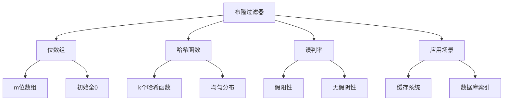

# 布隆过滤器

## 📖 核心概念

**布隆过滤器（Bloom Filter）**是一种空间效率极高的概率型数据结构，用于快速判断一个元素是否存在于集合中。它允许一定的误判率，但绝不会漏判。

### 🏗️ 布隆过滤器结构



## 🔧 布隆过滤器实现

### 基础布隆过滤器

```cpp
class BloomFilter {
private:
    vector<bool> bitArray;
    int m; // 位数组大小
    int k; // 哈希函数数量
    vector<function<size_t(const string&)>> hashFunctions;
    
    // 生成哈希函数
    void generateHashFunctions() {
        hashFunctions.clear();
        
        for (int i = 0; i < k; ++i) {
            hashFunctions.push_back([i, this](const string& key) -> size_t {
                size_t hash = 0;
                for (char c : key) {
                    hash = hash * 31 + c + i;
                }
                return hash % m;
            });
        }
    }
    
public:
    BloomFilter(int m, int k) : m(m), k(k) {
        bitArray.resize(m, false);
        generateHashFunctions();
    }
    
    // 添加元素
    void add(const string& key) {
        for (auto& hashFunc : hashFunctions) {
            size_t index = hashFunc(key);
            bitArray[index] = true;
        }
    }
    
    // 检查元素是否存在
    bool contains(const string& key) {
        for (auto& hashFunc : hashFunctions) {
            size_t index = hashFunc(key);
            if (!bitArray[index]) {
                return false;
            }
        }
        return true;
    }
    
    // 获取位数组状态
    vector<bool> getBitArray() const {
        return bitArray;
    }
    
    // 获取统计信息
    int getSetBits() const {
        int count = 0;
        for (bool bit : bitArray) {
            if (bit) count++;
        }
        return count;
    }
    
    // 显示布隆过滤器状态
    void display() {
        cout << "Bloom Filter Status:" << endl;
        cout << "==================" << endl;
        
        cout << "Bit array size: " << m << endl;
        cout << "Hash functions: " << k << endl;
        cout << "Set bits: " << getSetBits() << endl;
        cout << "Load factor: " << (double)getSetBits() / m << endl;
        
        cout << "Bit array: ";
        for (int i = 0; i < min(m, 50); ++i) {
            cout << (bitArray[i] ? "1" : "0");
        }
        if (m > 50) cout << "...";
        cout << endl;
    }
    
    // 显示位数组
    void displayBitArray() {
        cout << "Bit Array:" << endl;
        cout << "=========" << endl;
        
        for (int i = 0; i < m; ++i) {
            cout << (bitArray[i] ? "1" : "0");
            if ((i + 1) % 32 == 0) cout << endl;
        }
        cout << endl;
    }
};
```

### 可扩展布隆过滤器

```cpp
class ScalableBloomFilter {
private:
    vector<BloomFilter> filters;
    int initialM;
    int initialK;
    double errorRate;
    
public:
    ScalableBloomFilter(int initialM, int initialK, double errorRate) 
        : initialM(initialM), initialK(initialK), errorRate(errorRate) {
        filters.push_back(BloomFilter(initialM, initialK));
    }
    
    // 添加元素
    void add(const string& key) {
        // 检查是否已存在
        if (contains(key)) return;
        
        // 添加到当前过滤器
        filters.back().add(key);
        
        // 检查是否需要扩展
        if (shouldExpand()) {
            expandFilter();
        }
    }
    
    // 检查元素是否存在
    bool contains(const string& key) {
        for (auto& filter : filters) {
            if (filter.contains(key)) {
                return true;
            }
        }
        return false;
    }
    
    // 判断是否需要扩展
    bool shouldExpand() {
        BloomFilter& currentFilter = filters.back();
        double loadFactor = (double)currentFilter.getSetBits() / currentFilter.getBitArray().size();
        return loadFactor > 0.5;
    }
    
    // 扩展过滤器
    void expandFilter() {
        int newM = filters.back().getBitArray().size() * 2;
        int newK = initialK;
        filters.push_back(BloomFilter(newM, newK));
    }
    
    // 显示可扩展布隆过滤器状态
    void display() {
        cout << "Scalable Bloom Filter Status:" << endl;
        cout << "===========================" << endl;
        
        cout << "Number of filters: " << filters.size() << endl;
        cout << "Target error rate: " << errorRate << endl;
        
        for (int i = 0; i < filters.size(); ++i) {
            cout << "Filter " << i << ":" << endl;
            filters[i].display();
        }
    }
    
    // 获取总统计信息
    void displayStats() {
        cout << "Scalable Bloom Filter Statistics:" << endl;
        cout << "===============================" << endl;
        
        int totalBits = 0;
        int totalSetBits = 0;
        
        for (int i = 0; i < filters.size(); ++i) {
            auto bitArray = filters[i].getBitArray();
            totalBits += bitArray.size();
            totalSetBits += filters[i].getSetBits();
        }
        
        cout << "Total filters: " << filters.size() << endl;
        cout << "Total bits: " << totalBits << endl;
        cout << "Total set bits: " << totalSetBits << endl;
        cout << "Overall load factor: " << (double)totalSetBits / totalBits << endl;
    }
};
```

### 计数布隆过滤器

```cpp
class CountingBloomFilter {
private:
    vector<int> counterArray;
    int m; // 计数器数组大小
    int k; // 哈希函数数量
    vector<function<size_t(const string&)>> hashFunctions;
    
    // 生成哈希函数
    void generateHashFunctions() {
        hashFunctions.clear();
        
        for (int i = 0; i < k; ++i) {
            hashFunctions.push_back([i, this](const string& key) -> size_t {
                size_t hash = 0;
                for (char c : key) {
                    hash = hash * 31 + c + i;
                }
                return hash % m;
            });
        }
    }
    
public:
    CountingBloomFilter(int m, int k) : m(m), k(k) {
        counterArray.resize(m, 0);
        generateHashFunctions();
    }
    
    // 添加元素
    void add(const string& key) {
        for (auto& hashFunc : hashFunctions) {
            size_t index = hashFunc(key);
            counterArray[index]++;
        }
    }
    
    // 删除元素
    void remove(const string& key) {
        for (auto& hashFunc : hashFunctions) {
            size_t index = hashFunc(key);
            if (counterArray[index] > 0) {
                counterArray[index]--;
            }
        }
    }
    
    // 检查元素是否存在
    bool contains(const string& key) {
        for (auto& hashFunc : hashFunctions) {
            size_t index = hashFunc(key);
            if (counterArray[index] == 0) {
                return false;
            }
        }
        return true;
    }
    
    // 获取计数器数组
    vector<int> getCounterArray() const {
        return counterArray;
    }
    
    // 获取统计信息
    int getNonZeroCounters() const {
        int count = 0;
        for (int counter : counterArray) {
            if (counter > 0) count++;
        }
        return count;
    }
    
    // 显示计数布隆过滤器状态
    void display() {
        cout << "Counting Bloom Filter Status:" << endl;
        cout << "===========================" << endl;
        
        cout << "Counter array size: " << m << endl;
        cout << "Hash functions: " << k << endl;
        cout << "Non-zero counters: " << getNonZeroCounters() << endl;
        
        cout << "Counter array: ";
        for (int i = 0; i < min(m, 50); ++i) {
            cout << counterArray[i] << " ";
        }
        if (m > 50) cout << "...";
        cout << endl;
    }
    
    // 显示计数器数组
    void displayCounterArray() {
        cout << "Counter Array:" << endl;
        cout << "=============" << endl;
        
        for (int i = 0; i < m; ++i) {
            cout << counterArray[i] << " ";
            if ((i + 1) % 32 == 0) cout << endl;
        }
        cout << endl;
    }
};
```

### 布隆过滤器工具

```cpp
class BloomFilterUtils {
public:
    // 计算最优参数
    static pair<int, int> calculateOptimalParameters(int n, double p) {
        // n: 预期元素数量
        // p: 期望误判率
        
        double m = -(n * log(p)) / (log(2) * log(2));
        int k = (m / n) * log(2);
        
        return {static_cast<int>(m), k};
    }
    
    // 计算实际误判率
    static double calculateFalsePositiveRate(int m, int k, int n) {
        // m: 位数组大小
        // k: 哈希函数数量
        // n: 实际元素数量
        
        double ratio = (double)k * n / m;
        return pow(1 - exp(-ratio), k);
    }
    
    // 测试布隆过滤器性能
    static void testPerformance(BloomFilter& filter, vector<string>& testKeys, vector<string>& falseKeys) {
        cout << "Bloom Filter Performance Test:" << endl;
        cout << "=============================" << endl;
        
        // 添加测试键
        for (const string& key : testKeys) {
            filter.add(key);
        }
        
        // 测试真阳性
        int truePositives = 0;
        for (const string& key : testKeys) {
            if (filter.contains(key)) {
                truePositives++;
            }
        }
        
        // 测试假阳性
        int falsePositives = 0;
        for (const string& key : falseKeys) {
            if (filter.contains(key)) {
                falsePositives++;
            }
        }
        
        cout << "Test keys: " << testKeys.size() << endl;
        cout << "False keys: " << falseKeys.size() << endl;
        cout << "True positives: " << truePositives << "/" << testKeys.size() << endl;
        cout << "False positives: " << falsePositives << "/" << falseKeys.size() << endl;
        cout << "False positive rate: " << (double)falsePositives / falseKeys.size() << endl;
    }
    
    // 显示参数计算
    static void displayParameterCalculation(int n, double p) {
        cout << "Bloom Filter Parameter Calculation:" << endl;
        cout << "=================================" << endl;
        
        cout << "Expected elements: " << n << endl;
        cout << "Desired false positive rate: " << p << endl;
        
        auto params = calculateOptimalParameters(n, p);
        int m = params.first;
        int k = params.second;
        
        cout << "Optimal bit array size: " << m << endl;
        cout << "Optimal hash functions: " << k << endl;
        
        double actualRate = calculateFalsePositiveRate(m, k, n);
        cout << "Actual false positive rate: " << actualRate << endl;
    }
    
    // 显示性能分析
    static void displayPerformanceAnalysis() {
        cout << "Bloom Filter Performance Analysis:" << endl;
        cout << "=================================" << endl;
        
        cout << "1. Space Complexity:" << endl;
        cout << "   - O(m) bits" << endl;
        cout << "   - Independent of element count" << endl;
        
        cout << "2. Time Complexity:" << endl;
        cout << "   - Add: O(k)" << endl;
        cout << "   - Query: O(k)" << endl;
        cout << "   - k is number of hash functions" << endl;
        
        cout << "3. False Positive Rate:" << endl;
        cout << "   - Depends on m, k, n" << endl;
        cout << "   - Can be controlled by parameters" << endl;
        
        cout << "4. False Negative Rate:" << endl;
        cout << "   - Always 0" << endl;
        cout << "   - No false negatives" << endl;
    }
};
```

## 🎯 布隆过滤器应用

### 实际应用场景

```cpp
class BloomFilterApplications {
public:
    static void demonstrateApplications() {
        cout << "Bloom Filter Applications:" << endl;
        cout << "========================" << endl;
        
        cout << "1. 缓存系统:" << endl;
        cout << "   - Redis缓存" << endl;
        cout << "   - 避免缓存穿透" << endl;
        cout << "   - 提高缓存命中率" << endl;
        
        cout << "2. 数据库索引:" << endl;
        cout << "   - 快速判断记录是否存在" << endl;
        cout << "   - 减少磁盘I/O" << endl;
        cout << "   - 提高查询效率" << endl;
        
        cout << "3. 网络应用:" << endl;
        cout << "   - 垃圾邮件过滤" << endl;
        cout << "   - URL去重" << endl;
        cout << "   - 恶意网站检测" << endl;
        
        cout << "4. 分布式系统:" << endl;
        cout << "   - 数据同步" << endl;
        cout << "   - 去重处理" << endl;
        cout << "   - 负载均衡" << endl;
    }
    
    static void analyzePerformance() {
        cout << "Bloom Filter Performance Analysis:" << endl;
        cout << "=================================" << endl;
        
        cout << "1. 空间效率:" << endl;
        cout << "   - 空间复杂度: O(m)" << endl;
        cout << "   - 与元素数量无关" << endl;
        cout << "   - 比哈希表更节省空间" << endl;
        
        cout << "2. 时间效率:" << endl;
        cout << "   - 添加: O(k)" << endl;
        cout << "   - 查询: O(k)" << endl;
        cout << "   - k通常很小" << endl;
        
        cout << "3. 误判率:" << endl;
        cout << "   - 可控制的假阳性率" << endl;
        cout << "   - 无假阴性" << endl;
        cout << "   - 适合允许误判的场景" << endl;
    }
    
    static void selectBloomFilter(bool needsDeletion, bool needsScalability, bool needsAccuracy) {
        cout << "Bloom Filter Selection:" << endl;
        cout << "=====================" << endl;
        
        cout << "Needs deletion: " << (needsDeletion ? "Yes" : "No") << endl;
        cout << "Needs scalability: " << (needsScalability ? "Yes" : "No") << endl;
        cout << "Needs accuracy: " << (needsAccuracy ? "Yes" : "No") << endl;
        
        cout << "Recommendation:" << endl;
        
        if (needsDeletion) {
            cout << "Use Counting Bloom Filter (supports deletion)" << endl;
        } else if (needsScalability) {
            cout << "Use Scalable Bloom Filter (grows dynamically)" << endl;
        } else if (needsAccuracy) {
            cout << "Use Basic Bloom Filter with optimal parameters" << endl;
        } else {
            cout << "Use Basic Bloom Filter (simple and efficient)" << endl;
        }
    }
};
```

## 📊 布隆过滤器分析

### 性能分析

```cpp
class BloomFilterAnalysis {
public:
    static void analyzePerformance() {
        cout << "Bloom Filter Performance Analysis:" << endl;
        cout << "=================================" << endl;
        
        cout << "1. Space Complexity:" << endl;
        cout << "   - Basic: O(m) bits" << endl;
        cout << "   - Counting: O(m) counters" << endl;
        cout << "   - Scalable: O(m) per filter" << endl;
        
        cout << "2. Time Complexity:" << endl;
        cout << "   - Add: O(k)" << endl;
        cout << "   - Query: O(k)" << endl;
        cout << "   - Delete (Counting): O(k)" << endl;
        
        cout << "3. False Positive Rate:" << endl;
        cout << "   - Formula: (1 - e^(-kn/m))^k" << endl;
        cout << "   - Depends on m, k, n" << endl;
        cout << "   - Can be minimized" << endl;
        
        cout << "4. False Negative Rate:" << endl;
        cout << "   - Always 0" << endl;
        cout << "   - No false negatives" << endl;
    }
    
    static void analyzeSpaceComplexity() {
        cout << "Bloom Filter Space Complexity Analysis:" << endl;
        cout << "=====================================" << endl;
        
        cout << "1. Basic Bloom Filter:" << endl;
        cout << "   - Bit array: m bits" << endl;
        cout << "   - Hash functions: k functions" << endl;
        cout << "   - Total: O(m) bits" << endl;
        
        cout << "2. Counting Bloom Filter:" << endl;
        cout << "   - Counter array: m counters" << endl;
        cout << "   - Hash functions: k functions" << endl;
        cout << "   - Total: O(m) counters" << endl;
        
        cout << "3. Scalable Bloom Filter:" << endl;
        cout << "   - Multiple filters: O(m) per filter" << endl;
        cout << "   - Grows dynamically" << endl;
        cout << "   - Total: O(m) per active filter" << endl;
    }
    
    static void analyzeTimeComplexity() {
        cout << "Bloom Filter Time Complexity Analysis:" << endl;
        cout << "====================================" << endl;
        
        cout << "1. Add Operation:" << endl;
        cout << "   - Hash k times: O(k)" << endl;
        cout << "   - Set k bits: O(k)" << endl;
        cout << "   - Total: O(k)" << endl;
        
        cout << "2. Query Operation:" << endl;
        cout << "   - Hash k times: O(k)" << endl;
        cout << "   - Check k bits: O(k)" << endl;
        cout << "   - Total: O(k)" << endl;
        
        cout << "3. Delete Operation (Counting):" << endl;
        cout << "   - Hash k times: O(k)" << endl;
        cout << "   - Decrement k counters: O(k)" << endl;
        cout << "   - Total: O(k)" << endl;
    }
};
```

## 🎮 布隆过滤器测试

### 1. 基础功能测试

```cpp
class BloomFilterTest {
public:
    static void testBasicBloomFilter() {
        cout << "Testing Basic Bloom Filter:" << endl;
        cout << "=========================" << endl;
        
        BloomFilter filter(100, 3);
        
        vector<string> keys = {"apple", "banana", "cherry", "date", "elderberry"};
        vector<string> falseKeys = {"grape", "kiwi", "lemon", "mango", "orange"};
        
        // 添加键
        for (const string& key : keys) {
            filter.add(key);
        }
        
        filter.display();
        
        // 测试存在
        cout << "Testing existing keys:" << endl;
        for (const string& key : keys) {
            cout << key << ": " << (filter.contains(key) ? "Found" : "Not found") << endl;
        }
        
        // 测试不存在
        cout << "Testing non-existing keys:" << endl;
        for (const string& key : falseKeys) {
            cout << key << ": " << (filter.contains(key) ? "Found" : "Not found") << endl;
        }
    }
    
    static void testScalableBloomFilter() {
        cout << "Testing Scalable Bloom Filter:" << endl;
        cout << "============================" << endl;
        
        ScalableBloomFilter scalableFilter(50, 3, 0.01);
        
        vector<string> keys = {"apple", "banana", "cherry", "date", "elderberry", "fig", "grape", "kiwi"};
        
        for (const string& key : keys) {
            scalableFilter.add(key);
        }
        
        scalableFilter.display();
        scalableFilter.displayStats();
    }
    
    static void testCountingBloomFilter() {
        cout << "Testing Counting Bloom Filter:" << endl;
        cout << "============================" << endl;
        
        CountingBloomFilter countingFilter(100, 3);
        
        vector<string> keys = {"apple", "banana", "cherry"};
        
        // 添加键
        for (const string& key : keys) {
            countingFilter.add(key);
        }
        
        countingFilter.display();
        
        // 删除键
        countingFilter.remove("apple");
        cout << "After removing 'apple':" << endl;
        countingFilter.display();
    }
    
    static void testUtils() {
        cout << "Testing Bloom Filter Utils:" << endl;
        cout << "=========================" << endl;
        
        BloomFilterUtils::displayParameterCalculation(1000, 0.01);
        
        BloomFilter filter(100, 3);
        vector<string> testKeys = {"apple", "banana", "cherry"};
        vector<string> falseKeys = {"grape", "kiwi", "lemon"};
        
        BloomFilterUtils::testPerformance(filter, testKeys, falseKeys);
    }
    
    static void testApplications() {
        cout << "Testing Applications:" << endl;
        cout << "==================" << endl;
        
        BloomFilterApplications::demonstrateApplications();
        BloomFilterApplications::analyzePerformance();
        BloomFilterApplications::selectBloomFilter(false, false, true);
    }
    
    static void testAnalysis() {
        cout << "Testing Analysis:" << endl;
        cout << "===============" << endl;
        
        BloomFilterAnalysis::analyzePerformance();
        BloomFilterAnalysis::analyzeSpaceComplexity();
        BloomFilterAnalysis::analyzeTimeComplexity();
    }
};
```

## 🔗 相关链接

- [[01-哈希宇宙|哈希宇宙]]
- [[02-哈希表实现|哈希表实现]]
- [[03-哈希函数设计|哈希函数设计]]

## 💡 布隆过滤器要点

1. **空间效率**: 使用位数组节省空间
2. **时间效率**: O(k)的添加和查询时间
3. **误判率**: 可控制的假阳性率，无假阴性
4. **应用场景**: 适合允许误判的场景

---

*📝 布隆过滤器提示：布隆过滤器是空间效率极高的概率型数据结构，适合快速判断元素是否存在*
