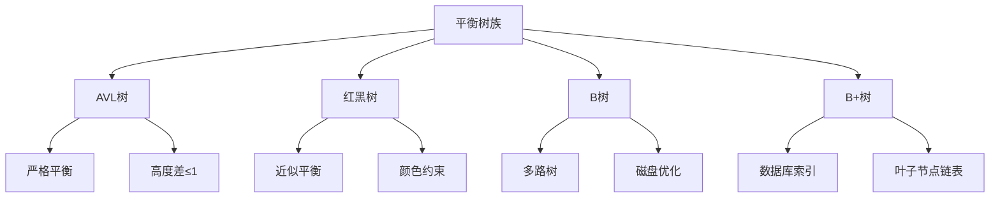

# 平衡树族

## 📖 核心概念

**平衡树**是一类自平衡的二叉搜索树，通过旋转操作保持树的平衡，确保操作的时间复杂度为O(log n)。

### 🏗️ 平衡树类型



## 🔧 AVL树实现

### AVL树节点

```cpp
class AVLNode {
public:
    int key;
    int value;
    AVLNode* left;
    AVLNode* right;
    int height;
    
    AVLNode(int k, int v) : key(k), value(v), left(nullptr), right(nullptr), height(1) {}
    
    int getBalance() {
        int leftHeight = left ? left->height : 0;
        int rightHeight = right ? right->height : 0;
        return leftHeight - rightHeight;
    }
    
    void updateHeight() {
        int leftHeight = left ? left->height : 0;
        int rightHeight = right ? right->height : 0;
        height = 1 + max(leftHeight, rightHeight);
    }
};
```

### AVL树操作

```cpp
class AVLTree {
private:
    AVLNode* root;
    
    AVLNode* rightRotate(AVLNode* y) {
        AVLNode* x = y->left;
        AVLNode* T2 = x->right;
        
        x->right = y;
        y->left = T2;
        
        y->updateHeight();
        x->updateHeight();
        
        return x;
    }
    
    AVLNode* leftRotate(AVLNode* x) {
        AVLNode* y = x->right;
        AVLNode* T2 = y->left;
        
        y->left = x;
        x->right = T2;
        
        x->updateHeight();
        y->updateHeight();
        
        return y;
    }
    
    AVLNode* insertHelper(AVLNode* node, int key, int value) {
        if (!node) {
            return new AVLNode(key, value);
        }
        
        if (key < node->key) {
            node->left = insertHelper(node->left, key, value);
        } else if (key > node->key) {
            node->right = insertHelper(node->right, key, value);
        } else {
            node->value = value;
            return node;
        }
        
        node->updateHeight();
        
        int balance = node->getBalance();
        
        // Left Left Case
        if (balance > 1 && key < node->left->key) {
            return rightRotate(node);
        }
        
        // Right Right Case
        if (balance < -1 && key > node->right->key) {
            return leftRotate(node);
        }
        
        // Left Right Case
        if (balance > 1 && key > node->left->key) {
            node->left = leftRotate(node->left);
            return rightRotate(node);
        }
        
        // Right Left Case
        if (balance < -1 && key < node->right->key) {
            node->right = rightRotate(node->right);
            return leftRotate(node);
        }
        
        return node;
    }
    
    AVLNode* deleteHelper(AVLNode* node, int key) {
        if (!node) return node;
        
        if (key < node->key) {
            node->left = deleteHelper(node->left, key);
        } else if (key > node->key) {
            node->right = deleteHelper(node->right, key);
        } else {
            if (!node->left || !node->right) {
                AVLNode* temp = node->left ? node->left : node->right;
                
                if (!temp) {
                    temp = node;
                    node = nullptr;
                } else {
                    *node = *temp;
                }
                delete temp;
            } else {
                AVLNode* temp = findMin(node->right);
                node->key = temp->key;
                node->value = temp->value;
                node->right = deleteHelper(node->right, temp->key);
            }
        }
        
        if (!node) return node;
        
        node->updateHeight();
        
        int balance = node->getBalance();
        
        // Left Left Case
        if (balance > 1 && node->left->getBalance() >= 0) {
            return rightRotate(node);
        }
        
        // Left Right Case
        if (balance > 1 && node->left->getBalance() < 0) {
            node->left = leftRotate(node->left);
            return rightRotate(node);
        }
        
        // Right Right Case
        if (balance < -1 && node->right->getBalance() <= 0) {
            return leftRotate(node);
        }
        
        // Right Left Case
        if (balance < -1 && node->right->getBalance() > 0) {
            node->right = rightRotate(node->right);
            return leftRotate(node);
        }
        
        return node;
    }
    
    AVLNode* findMin(AVLNode* node) {
        while (node->left) {
            node = node->left;
        }
        return node;
    }
    
public:
    AVLTree() : root(nullptr) {}
    
    void insert(int key, int value) {
        root = insertHelper(root, key, value);
    }
    
    void remove(int key) {
        root = deleteHelper(root, key);
    }
    
    AVLNode* search(int key) {
        AVLNode* current = root;
        while (current) {
            if (key == current->key) {
                return current;
            } else if (key < current->key) {
                current = current->left;
            } else {
                current = current->right;
            }
        }
        return nullptr;
    }
    
    void inorderTraversal() {
        inorderHelper(root);
        cout << endl;
    }
    
    void inorderHelper(AVLNode* node) {
        if (!node) return;
        
        inorderHelper(node->left);
        cout << "(" << node->key << "," << node->value << ") ";
        inorderHelper(node->right);
    }
    
    int getHeight() {
        return root ? root->height : 0;
    }
    
    bool isBalanced() {
        return isBalancedHelper(root);
    }
    
    bool isBalancedHelper(AVLNode* node) {
        if (!node) return true;
        
        int balance = node->getBalance();
        if (abs(balance) > 1) return false;
        
        return isBalancedHelper(node->left) && isBalancedHelper(node->right);
    }
};
```

## 🎯 红黑树实现

### 红黑树节点

```cpp
class RedBlackNode {
public:
    int key;
    int value;
    RedBlackNode* left;
    RedBlackNode* right;
    RedBlackNode* parent;
    bool isRed;
    
    RedBlackNode(int k, int v) : key(k), value(v), left(nullptr), right(nullptr), 
                                 parent(nullptr), isRed(true) {}
};
```

### 红黑树操作

```cpp
class RedBlackTree {
private:
    RedBlackNode* root;
    RedBlackNode* nil;
    
    void leftRotate(RedBlackNode* x) {
        RedBlackNode* y = x->right;
        x->right = y->left;
        
        if (y->left != nil) {
            y->left->parent = x;
        }
        
        y->parent = x->parent;
        
        if (x->parent == nil) {
            root = y;
        } else if (x == x->parent->left) {
            x->parent->left = y;
        } else {
            x->parent->right = y;
        }
        
        y->left = x;
        x->parent = y;
    }
    
    void rightRotate(RedBlackNode* y) {
        RedBlackNode* x = y->left;
        y->left = x->right;
        
        if (x->right != nil) {
            x->right->parent = y;
        }
        
        x->parent = y->parent;
        
        if (y->parent == nil) {
            root = x;
        } else if (y == y->parent->left) {
            y->parent->left = x;
        } else {
            y->parent->right = x;
        }
        
        x->right = y;
        y->parent = x;
    }
    
    void insertFixup(RedBlackNode* z) {
        while (z->parent->isRed) {
            if (z->parent == z->parent->parent->left) {
                RedBlackNode* y = z->parent->parent->right;
                
                if (y->isRed) {
                    z->parent->isRed = false;
                    y->isRed = false;
                    z->parent->parent->isRed = true;
                    z = z->parent->parent;
                } else {
                    if (z == z->parent->right) {
                        z = z->parent;
                        leftRotate(z);
                    }
                    z->parent->isRed = false;
                    z->parent->parent->isRed = true;
                    rightRotate(z->parent->parent);
                }
            } else {
                RedBlackNode* y = z->parent->parent->left;
                
                if (y->isRed) {
                    z->parent->isRed = false;
                    y->isRed = false;
                    z->parent->parent->isRed = true;
                    z = z->parent->parent;
                } else {
                    if (z == z->parent->left) {
                        z = z->parent;
                        rightRotate(z);
                    }
                    z->parent->isRed = false;
                    z->parent->parent->isRed = true;
                    leftRotate(z->parent->parent);
                }
            }
        }
        root->isRed = false;
    }
    
    void insertHelper(RedBlackNode* z) {
        RedBlackNode* y = nil;
        RedBlackNode* x = root;
        
        while (x != nil) {
            y = x;
            if (z->key < x->key) {
                x = x->left;
            } else {
                x = x->right;
            }
        }
        
        z->parent = y;
        
        if (y == nil) {
            root = z;
        } else if (z->key < y->key) {
            y->left = z;
        } else {
            y->right = z;
        }
        
        z->left = nil;
        z->right = nil;
        z->isRed = true;
        
        insertFixup(z);
    }
    
public:
    RedBlackTree() {
        nil = new RedBlackNode(0, 0);
        nil->isRed = false;
        root = nil;
    }
    
    void insert(int key, int value) {
        RedBlackNode* z = new RedBlackNode(key, value);
        insertHelper(z);
    }
    
    RedBlackNode* search(int key) {
        RedBlackNode* current = root;
        while (current != nil) {
            if (key == current->key) {
                return current;
            } else if (key < current->key) {
                current = current->left;
            } else {
                current = current->right;
            }
        }
        return nullptr;
    }
    
    void inorderTraversal() {
        inorderHelper(root);
        cout << endl;
    }
    
    void inorderHelper(RedBlackNode* node) {
        if (node == nil) return;
        
        inorderHelper(node->left);
        cout << "(" << node->key << "," << node->value << "," 
             << (node->isRed ? "R" : "B") << ") ";
        inorderHelper(node->right);
    }
    
    bool isValidRedBlackTree() {
        if (root == nil) return true;
        
        // 检查根节点是黑色
        if (root->isRed) return false;
        
        // 检查红黑树性质
        return checkRedBlackProperties(root);
    }
    
    bool checkRedBlackProperties(RedBlackNode* node) {
        if (node == nil) return true;
        
        // 检查红色节点的子节点都是黑色
        if (node->isRed) {
            if (node->left->isRed || node->right->isRed) {
                return false;
            }
        }
        
        return checkRedBlackProperties(node->left) && 
               checkRedBlackProperties(node->right);
    }
};
```

## 📊 B树实现

### B树节点

```cpp
class BTreeNode {
public:
    vector<int> keys;
    vector<BTreeNode*> children;
    bool isLeaf;
    int degree;
    
    BTreeNode(int t, bool leaf) : degree(t), isLeaf(leaf) {
        keys.resize(2 * t - 1);
        children.resize(2 * t);
    }
    
    void insertNonFull(int key) {
        int i = keys.size() - 1;
        
        if (isLeaf) {
            while (i >= 0 && keys[i] > key) {
                keys[i + 1] = keys[i];
                i--;
            }
            keys[i + 1] = key;
        } else {
            while (i >= 0 && keys[i] > key) {
                i--;
            }
            
            if (children[i + 1]->keys.size() == 2 * degree - 1) {
                splitChild(i + 1, children[i + 1]);
                
                if (keys[i + 1] < key) {
                    i++;
                }
            }
            
            children[i + 1]->insertNonFull(key);
        }
    }
    
    void splitChild(int i, BTreeNode* y) {
        BTreeNode* z = new BTreeNode(y->degree, y->isLeaf);
        
        for (int j = 0; j < degree - 1; ++j) {
            z->keys[j] = y->keys[j + degree];
        }
        
        if (!y->isLeaf) {
            for (int j = 0; j < degree; ++j) {
                z->children[j] = y->children[j + degree];
            }
        }
        
        for (int j = keys.size() - 1; j >= i; --j) {
            keys[j + 1] = keys[j];
        }
        
        keys[i] = y->keys[degree - 1];
        
        for (int j = children.size() - 1; j >= i + 1; --j) {
            children[j + 1] = children[j];
        }
        
        children[i + 1] = z;
    }
    
    BTreeNode* search(int key) {
        int i = 0;
        while (i < keys.size() && key > keys[i]) {
            i++;
        }
        
        if (i < keys.size() && keys[i] == key) {
            return this;
        }
        
        if (isLeaf) {
            return nullptr;
        }
        
        return children[i]->search(key);
    }
};
```

### B树操作

```cpp
class BTree {
private:
    BTreeNode* root;
    int degree;
    
public:
    BTree(int t) : degree(t) {
        root = nullptr;
    }
    
    void insert(int key) {
        if (!root) {
            root = new BTreeNode(degree, true);
            root->keys[0] = key;
        } else {
            if (root->keys.size() == 2 * degree - 1) {
                BTreeNode* s = new BTreeNode(degree, false);
                s->children[0] = root;
                s->splitChild(0, root);
                
                int i = 0;
                if (s->keys[0] < key) {
                    i++;
                }
                s->children[i]->insertNonFull(key);
                
                root = s;
            } else {
                root->insertNonFull(key);
            }
        }
    }
    
    BTreeNode* search(int key) {
        return root ? root->search(key) : nullptr;
    }
    
    void traverse() {
        if (root) {
            traverseHelper(root);
        }
        cout << endl;
    }
    
    void traverseHelper(BTreeNode* node) {
        int i;
        for (i = 0; i < node->keys.size(); ++i) {
            if (!node->isLeaf) {
                traverseHelper(node->children[i]);
            }
            cout << node->keys[i] << " ";
        }
        
        if (!node->isLeaf) {
            traverseHelper(node->children[i]);
        }
    }
};
```

## 🎮 平衡树应用

### 1. 数据库索引

```cpp
class DatabaseIndex {
private:
    BTree* btree;
    
public:
    DatabaseIndex(int degree = 3) {
        btree = new BTree(degree);
    }
    
    void insertRecord(int key, const string& data) {
        btree->insert(key);
        cout << "Record " << key << " inserted: " << data << endl;
    }
    
    bool searchRecord(int key) {
        BTreeNode* result = btree->search(key);
        if (result) {
            cout << "Record " << key << " found" << endl;
            return true;
        } else {
            cout << "Record " << key << " not found" << endl;
            return false;
        }
    }
    
    void displayIndex() {
        cout << "Database Index:" << endl;
        btree->traverse();
    }
};
```

### 2. 平衡树性能比较

```cpp
class BalancedTreeAnalyzer {
public:
    static void comparePerformance() {
        vector<int> sizes = {1000, 10000, 100000};
        
        for (int size : sizes) {
            cout << "Testing with " << size << " elements:" << endl;
            
            // 测试AVL树
            auto start = chrono::high_resolution_clock::now();
            AVLTree avlTree;
            
            for (int i = 0; i < size; ++i) {
                avlTree.insert(i, i * 2);
            }
            
            for (int i = 0; i < size; ++i) {
                avlTree.search(i);
            }
            
            auto end = chrono::high_resolution_clock::now();
            auto duration = chrono::duration_cast<chrono::microseconds>(end - start);
            
            cout << "AVL Tree: " << duration.count() << " microseconds" << endl;
            
            // 测试红黑树
            start = chrono::high_resolution_clock::now();
            RedBlackTree rbTree;
            
            for (int i = 0; i < size; ++i) {
                rbTree.insert(i, i * 2);
            }
            
            for (int i = 0; i < size; ++i) {
                rbTree.search(i);
            }
            
            end = chrono::high_resolution_clock::now();
            duration = chrono::duration_cast<chrono::microseconds>(end - start);
            
            cout << "Red-Black Tree: " << duration.count() << " microseconds" << endl;
            cout << endl;
        }
    }
};
```

## 🔗 相关链接

- [[01-哈希宇宙|哈希宇宙]]
- [[03-特殊结构|特殊结构]]
- [[04-并发结构|并发结构]]

## 💡 平衡树族要点

1. **AVL树**：严格平衡，适合查找密集型应用
2. **红黑树**：近似平衡，适合插入删除密集型应用
3. **B树**：多路树，适合磁盘存储
4. **B+树**：数据库索引的标准实现

---

*📝 树族提示：平衡树是数据库和文件系统的重要数据结构*
