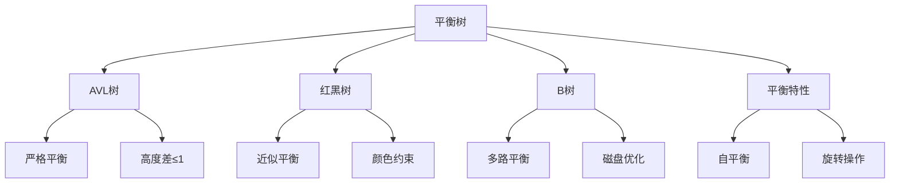

# 平衡树实现

## 📖 核心概念

**平衡树**是一种自平衡的二叉搜索树，通过旋转操作保持树的平衡，确保查找、插入和删除操作的时间复杂度为O(log n)。主要包括AVL树、红黑树、B树等。

### 🏗️ 平衡树分类



## 🔧 平衡树实现

### AVL树

```cpp
class AVLTree {
private:
    struct Node {
        int key;
        int value;
        int height;
        Node* left;
        Node* right;
        
        Node(int k, int v) : key(k), value(v), height(1), left(nullptr), right(nullptr) {}
    };
    
    Node* root;
    
    // 获取节点高度
    int getHeight(Node* node) {
        return node ? node->height : 0;
    }
    
    // 更新节点高度
    void updateHeight(Node* node) {
        if (node) {
            node->height = 1 + max(getHeight(node->left), getHeight(node->right));
        }
    }
    
    // 获取平衡因子
    int getBalance(Node* node) {
        return node ? getHeight(node->left) - getHeight(node->right) : 0;
    }
    
    // 右旋转
    Node* rightRotate(Node* y) {
        Node* x = y->left;
        Node* T2 = x->right;
        
        x->right = y;
        y->left = T2;
        
        updateHeight(y);
        updateHeight(x);
        
        return x;
    }
    
    // 左旋转
    Node* leftRotate(Node* x) {
        Node* y = x->right;
        Node* T2 = y->left;
        
        y->left = x;
        x->right = T2;
        
        updateHeight(x);
        updateHeight(y);
        
        return y;
    }
    
    // 插入节点
    Node* insertNode(Node* node, int key, int value) {
        if (!node) {
            return new Node(key, value);
        }
        
        if (key < node->key) {
            node->left = insertNode(node->left, key, value);
        } else if (key > node->key) {
            node->right = insertNode(node->right, key, value);
        } else {
            node->value = value;
            return node;
        }
        
        updateHeight(node);
        
        int balance = getBalance(node);
        
        // 左左情况
        if (balance > 1 && key < node->left->key) {
            return rightRotate(node);
        }
        
        // 右右情况
        if (balance < -1 && key > node->right->key) {
            return leftRotate(node);
        }
        
        // 左右情况
        if (balance > 1 && key > node->left->key) {
            node->left = leftRotate(node->left);
            return rightRotate(node);
        }
        
        // 右左情况
        if (balance < -1 && key < node->right->key) {
            node->right = rightRotate(node->right);
            return leftRotate(node);
        }
        
        return node;
    }
    
    // 删除节点
    Node* deleteNode(Node* node, int key) {
        if (!node) return node;
        
        if (key < node->key) {
            node->left = deleteNode(node->left, key);
        } else if (key > node->key) {
            node->right = deleteNode(node->right, key);
        } else {
            if (!node->left || !node->right) {
                Node* temp = node->left ? node->left : node->right;
                
                if (!temp) {
                    temp = node;
                    node = nullptr;
                } else {
                    *node = *temp;
                }
                
                delete temp;
            } else {
                Node* temp = getMinNode(node->right);
                node->key = temp->key;
                node->value = temp->value;
                node->right = deleteNode(node->right, temp->key);
            }
        }
        
        if (!node) return node;
        
        updateHeight(node);
        
        int balance = getBalance(node);
        
        // 左左情况
        if (balance > 1 && getBalance(node->left) >= 0) {
            return rightRotate(node);
        }
        
        // 左右情况
        if (balance > 1 && getBalance(node->left) < 0) {
            node->left = leftRotate(node->left);
            return rightRotate(node);
        }
        
        // 右右情况
        if (balance < -1 && getBalance(node->right) <= 0) {
            return leftRotate(node);
        }
        
        // 右左情况
        if (balance < -1 && getBalance(node->right) > 0) {
            node->right = rightRotate(node->right);
            return leftRotate(node);
        }
        
        return node;
    }
    
    // 获取最小节点
    Node* getMinNode(Node* node) {
        while (node->left) {
            node = node->left;
        }
        return node;
    }
    
    // 查找节点
    Node* searchNode(Node* node, int key) {
        if (!node || node->key == key) {
            return node;
        }
        
        if (key < node->key) {
            return searchNode(node->left, key);
        } else {
            return searchNode(node->right, key);
        }
    }
    
    // 中序遍历
    void inorderTraversal(Node* node, vector<pair<int, int>>& result) {
        if (node) {
            inorderTraversal(node->left, result);
            result.push_back({node->key, node->value});
            inorderTraversal(node->right, result);
        }
    }
    
public:
    AVLTree() : root(nullptr) {}
    
    // 插入
    void insert(int key, int value) {
        root = insertNode(root, key, value);
    }
    
    // 删除
    void remove(int key) {
        root = deleteNode(root, key);
    }
    
    // 查找
    int search(int key) {
        Node* node = searchNode(root, key);
        return node ? node->value : -1;
    }
    
    // 获取所有键值对
    vector<pair<int, int>> getAll() {
        vector<pair<int, int>> result;
        inorderTraversal(root, result);
        return result;
    }
    
    // 显示AVL树
    void display() {
        cout << "AVL Tree:" << endl;
        cout << "========" << endl;
        
        vector<pair<int, int>> elements = getAll();
        for (auto& pair : elements) {
            cout << "Key: " << pair.first << ", Value: " << pair.second << endl;
        }
    }
    
    // 显示树结构
    void displayTree() {
        cout << "AVL Tree Structure:" << endl;
        cout << "==================" << endl;
        
        function<void(Node*, int)> printTree = [&](Node* node, int depth) {
            if (node) {
                printTree(node->right, depth + 1);
                for (int i = 0; i < depth; ++i) {
                    cout << "  ";
                }
                cout << node->key << " (h:" << node->height << ")" << endl;
                printTree(node->left, depth + 1);
            }
        };
        
        printTree(root, 0);
    }
    
    // 显示统计信息
    void displayStats() {
        cout << "AVL Tree Statistics:" << endl;
        cout << "===================" << endl;
        
        vector<pair<int, int>> elements = getAll();
        cout << "Number of nodes: " << elements.size() << endl;
        
        if (root) {
            cout << "Tree height: " << root->height << endl;
            cout << "Balance factor: " << getBalance(root) << endl;
        }
    }
};
```

### 红黑树

```cpp
class RedBlackTree {
private:
    enum Color { RED, BLACK };
    
    struct Node {
        int key;
        int value;
        Color color;
        Node* left;
        Node* right;
        Node* parent;
        
        Node(int k, int v, Color c = RED) : key(k), value(v), color(c), 
                                           left(nullptr), right(nullptr), parent(nullptr) {}
    };
    
    Node* root;
    Node* nil;
    
    // 左旋转
    void leftRotate(Node* x) {
        Node* y = x->right;
        x->right = y->left;
        
        if (y->left != nil) {
            y->left->parent = x;
        }
        
        y->parent = x->parent;
        
        if (x->parent == nil) {
            root = y;
        } else if (x == x->parent->left) {
            x->parent->left = y;
        } else {
            x->parent->right = y;
        }
        
        y->left = x;
        x->parent = y;
    }
    
    // 右旋转
    void rightRotate(Node* y) {
        Node* x = y->left;
        y->left = x->right;
        
        if (x->right != nil) {
            x->right->parent = y;
        }
        
        x->parent = y->parent;
        
        if (y->parent == nil) {
            root = x;
        } else if (y == y->parent->left) {
            y->parent->left = x;
        } else {
            y->parent->right = x;
        }
        
        x->right = y;
        y->parent = x;
    }
    
    // 插入修复
    void insertFixup(Node* z) {
        while (z->parent->color == RED) {
            if (z->parent == z->parent->parent->left) {
                Node* y = z->parent->parent->right;
                
                if (y->color == RED) {
                    z->parent->color = BLACK;
                    y->color = BLACK;
                    z->parent->parent->color = RED;
                    z = z->parent->parent;
                } else {
                    if (z == z->parent->right) {
                        z = z->parent;
                        leftRotate(z);
                    }
                    z->parent->color = BLACK;
                    z->parent->parent->color = RED;
                    rightRotate(z->parent->parent);
                }
            } else {
                Node* y = z->parent->parent->left;
                
                if (y->color == RED) {
                    z->parent->color = BLACK;
                    y->color = BLACK;
                    z->parent->parent->color = RED;
                    z = z->parent->parent;
                } else {
                    if (z == z->parent->left) {
                        z = z->parent;
                        rightRotate(z);
                    }
                    z->parent->color = BLACK;
                    z->parent->parent->color = RED;
                    leftRotate(z->parent->parent);
                }
            }
        }
        
        root->color = BLACK;
    }
    
    // 插入节点
    void insertNode(Node* z) {
        Node* y = nil;
        Node* x = root;
        
        while (x != nil) {
            y = x;
            if (z->key < x->key) {
                x = x->left;
            } else {
                x = x->right;
            }
        }
        
        z->parent = y;
        
        if (y == nil) {
            root = z;
        } else if (z->key < y->key) {
            y->left = z;
        } else {
            y->right = z;
        }
        
        z->left = nil;
        z->right = nil;
        z->color = RED;
        
        insertFixup(z);
    }
    
    // 删除修复
    void deleteFixup(Node* x) {
        while (x != root && x->color == BLACK) {
            if (x == x->parent->left) {
                Node* w = x->parent->right;
                
                if (w->color == RED) {
                    w->color = BLACK;
                    x->parent->color = RED;
                    leftRotate(x->parent);
                    w = x->parent->right;
                }
                
                if (w->left->color == BLACK && w->right->color == BLACK) {
                    w->color = RED;
                    x = x->parent;
                } else {
                    if (w->right->color == BLACK) {
                        w->left->color = BLACK;
                        w->color = RED;
                        rightRotate(w);
                        w = x->parent->right;
                    }
                    w->color = x->parent->color;
                    x->parent->color = BLACK;
                    w->right->color = BLACK;
                    leftRotate(x->parent);
                    x = root;
                }
            } else {
                Node* w = x->parent->left;
                
                if (w->color == RED) {
                    w->color = BLACK;
                    x->parent->color = RED;
                    rightRotate(x->parent);
                    w = x->parent->left;
                }
                
                if (w->right->color == BLACK && w->left->color == BLACK) {
                    w->color = RED;
                    x = x->parent;
                } else {
                    if (w->left->color == BLACK) {
                        w->right->color = BLACK;
                        w->color = RED;
                        leftRotate(w);
                        w = x->parent->left;
                    }
                    w->color = x->parent->color;
                    x->parent->color = BLACK;
                    w->left->color = BLACK;
                    rightRotate(x->parent);
                    x = root;
                }
            }
        }
        
        x->color = BLACK;
    }
    
    // 删除节点
    void deleteNode(Node* z) {
        Node* y = z;
        Node* x;
        Color yOriginalColor = y->color;
        
        if (z->left == nil) {
            x = z->right;
            transplant(z, z->right);
        } else if (z->right == nil) {
            x = z->left;
            transplant(z, z->left);
        } else {
            y = getMinNode(z->right);
            yOriginalColor = y->color;
            x = y->right;
            
            if (y->parent == z) {
                x->parent = y;
            } else {
                transplant(y, y->right);
                y->right = z->right;
                y->right->parent = y;
            }
            
            transplant(z, y);
            y->left = z->left;
            y->left->parent = y;
            y->color = z->color;
        }
        
        if (yOriginalColor == BLACK) {
            deleteFixup(x);
        }
        
        delete z;
    }
    
    // 替换节点
    void transplant(Node* u, Node* v) {
        if (u->parent == nil) {
            root = v;
        } else if (u == u->parent->left) {
            u->parent->left = v;
        } else {
            u->parent->right = v;
        }
        
        v->parent = u->parent;
    }
    
    // 获取最小节点
    Node* getMinNode(Node* node) {
        while (node->left != nil) {
            node = node->left;
        }
        return node;
    }
    
    // 查找节点
    Node* searchNode(Node* node, int key) {
        if (node == nil || node->key == key) {
            return node;
        }
        
        if (key < node->key) {
            return searchNode(node->left, key);
        } else {
            return searchNode(node->right, key);
        }
    }
    
    // 中序遍历
    void inorderTraversal(Node* node, vector<pair<int, int>>& result) {
        if (node != nil) {
            inorderTraversal(node->left, result);
            result.push_back({node->key, node->value});
            inorderTraversal(node->right, result);
        }
    }
    
public:
    RedBlackTree() {
        nil = new Node(0, 0, BLACK);
        root = nil;
    }
    
    // 插入
    void insert(int key, int value) {
        Node* z = new Node(key, value);
        insertNode(z);
    }
    
    // 删除
    void remove(int key) {
        Node* z = searchNode(root, key);
        if (z != nil) {
            deleteNode(z);
        }
    }
    
    // 查找
    int search(int key) {
        Node* node = searchNode(root, key);
        return node != nil ? node->value : -1;
    }
    
    // 获取所有键值对
    vector<pair<int, int>> getAll() {
        vector<pair<int, int>> result;
        inorderTraversal(root, result);
        return result;
    }
    
    // 显示红黑树
    void display() {
        cout << "Red-Black Tree:" << endl;
        cout << "==============" << endl;
        
        vector<pair<int, int>> elements = getAll();
        for (auto& pair : elements) {
            cout << "Key: " << pair.first << ", Value: " << pair.second << endl;
        }
    }
    
    // 显示树结构
    void displayTree() {
        cout << "Red-Black Tree Structure:" << endl;
        cout << "========================" << endl;
        
        function<void(Node*, int)> printTree = [&](Node* node, int depth) {
            if (node != nil) {
                printTree(node->right, depth + 1);
                for (int i = 0; i < depth; ++i) {
                    cout << "  ";
                }
                cout << node->key << " (" << (node->color == RED ? "R" : "B") << ")" << endl;
                printTree(node->left, depth + 1);
            }
        };
        
        printTree(root, 0);
    }
    
    // 显示统计信息
    void displayStats() {
        cout << "Red-Black Tree Statistics:" << endl;
        cout << "=========================" << endl;
        
        vector<pair<int, int>> elements = getAll();
        cout << "Number of nodes: " << elements.size() << endl;
        
        if (root != nil) {
            cout << "Root color: " << (root->color == RED ? "Red" : "Black") << endl;
        }
    }
};
```

### B树

```cpp
class BTree {
private:
    struct BTreeNode {
        vector<int> keys;
        vector<int> values;
        vector<BTreeNode*> children;
        bool isLeaf;
        int degree;
        
        BTreeNode(int t, bool leaf) : degree(t), isLeaf(leaf) {
            keys.resize(2 * t - 1);
            values.resize(2 * t - 1);
            children.resize(2 * t);
        }
        
        void insertNonFull(int key, int value) {
            int i = keys.size() - 1;
            
            if (isLeaf) {
                while (i >= 0 && keys[i] > key) {
                    if (i + 1 < keys.size()) {
                        keys[i + 1] = keys[i];
                        values[i + 1] = values[i];
                    }
                    i--;
                }
                
                keys[i + 1] = key;
                values[i + 1] = value;
            } else {
                while (i >= 0 && keys[i] > key) {
                    i--;
                }
                
                if (children[i + 1]->keys.size() == 2 * degree - 1) {
                    splitChild(i + 1, children[i + 1]);
                    
                    if (keys[i + 1] < key) {
                        i++;
                    }
                }
                
                children[i + 1]->insertNonFull(key, value);
            }
        }
        
        void splitChild(int i, BTreeNode* y) {
            BTreeNode* z = new BTreeNode(y->degree, y->isLeaf);
            
            for (int j = 0; j < degree - 1; ++j) {
                z->keys[j] = y->keys[j + degree];
                z->values[j] = y->values[j + degree];
            }
            
            if (!y->isLeaf) {
                for (int j = 0; j < degree; ++j) {
                    z->children[j] = y->children[j + degree];
                }
            }
            
            for (int j = keys.size() - 1; j >= i + 1; --j) {
                children[j + 1] = children[j];
            }
            
            children[i + 1] = z;
            
            for (int j = keys.size() - 2; j >= i; --j) {
                keys[j + 1] = keys[j];
                values[j + 1] = values[j];
            }
            
            keys[i] = y->keys[degree - 1];
            values[i] = y->values[degree - 1];
        }
        
        int search(int key) {
            int i = 0;
            while (i < keys.size() && key > keys[i]) {
                i++;
            }
            
            if (i < keys.size() && keys[i] == key) {
                return values[i];
            }
            
            if (isLeaf) {
                return -1;
            }
            
            return children[i]->search(key);
        }
        
        void traverse(vector<pair<int, int>>& result) {
            int i;
            for (i = 0; i < keys.size(); ++i) {
                if (!isLeaf) {
                    children[i]->traverse(result);
                }
                result.push_back({keys[i], values[i]});
            }
            
            if (!isLeaf) {
                children[i]->traverse(result);
            }
        }
    };
    
    BTreeNode* root;
    int degree;
    
public:
    BTree(int t) : degree(t) {
        root = nullptr;
    }
    
    // 插入
    void insert(int key, int value) {
        if (root == nullptr) {
            root = new BTreeNode(degree, true);
            root->keys[0] = key;
            root->values[0] = value;
        } else {
            if (root->keys.size() == 2 * degree - 1) {
                BTreeNode* s = new BTreeNode(degree, false);
                s->children[0] = root;
                s->splitChild(0, root);
                
                int i = 0;
                if (s->keys[0] < key) {
                    i++;
                }
                s->children[i]->insertNonFull(key, value);
                
                root = s;
            } else {
                root->insertNonFull(key, value);
            }
        }
    }
    
    // 查找
    int search(int key) {
        return root ? root->search(key) : -1;
    }
    
    // 获取所有键值对
    vector<pair<int, int>> getAll() {
        vector<pair<int, int>> result;
        if (root) {
            root->traverse(result);
        }
        return result;
    }
    
    // 显示B树
    void display() {
        cout << "B-Tree:" << endl;
        cout << "======" << endl;
        
        vector<pair<int, int>> elements = getAll();
        for (auto& pair : elements) {
            cout << "Key: " << pair.first << ", Value: " << pair.second << endl;
        }
    }
    
    // 显示树结构
    void displayTree() {
        cout << "B-Tree Structure:" << endl;
        cout << "===============" << endl;
        
        function<void(BTreeNode*, int)> printTree = [&](BTreeNode* node, int depth) {
            if (node) {
                for (int i = 0; i < node->keys.size(); ++i) {
                    if (!node->isLeaf) {
                        printTree(node->children[i], depth + 1);
                    }
                    for (int j = 0; j < depth; ++j) {
                        cout << "  ";
                    }
                    cout << node->keys[i] << endl;
                }
                if (!node->isLeaf) {
                    printTree(node->children[node->keys.size()], depth + 1);
                }
            }
        };
        
        printTree(root, 0);
    }
    
    // 显示统计信息
    void displayStats() {
        cout << "B-Tree Statistics:" << endl;
        cout << "================" << endl;
        
        vector<pair<int, int>> elements = getAll();
        cout << "Number of nodes: " << elements.size() << endl;
        cout << "Degree: " << degree << endl;
    }
};
```

## 🎯 平衡树应用

### 性能比较

```cpp
class BalancedTreeComparison {
public:
    static void compareTrees() {
        cout << "Balanced Tree Comparison:" << endl;
        cout << "=======================" << endl;
        
        cout << "1. AVL Tree:" << endl;
        cout << "   - Balance: Strict (height difference ≤ 1)" << endl;
        cout << "   - Time Complexity: O(log n)" << endl;
        cout << "   - Space Complexity: O(n)" << endl;
        cout << "   - Best for: Frequent lookups" << endl;
        
        cout << "2. Red-Black Tree:" << endl;
        cout << "   - Balance: Approximate (longest path ≤ 2 * shortest path)" << endl;
        cout << "   - Time Complexity: O(log n)" << endl;
        cout << "   - Space Complexity: O(n)" << endl;
        cout << "   - Best for: Frequent insertions/deletions" << endl;
        
        cout << "3. B-Tree:" << endl;
        cout << "   - Balance: Multi-way balanced" << endl;
        cout << "   - Time Complexity: O(log n)" << endl;
        cout << "   - Space Complexity: O(n)" << endl;
        cout << "   - Best for: Disk-based storage" << endl;
    }
    
    static void analyzePerformance() {
        cout << "Performance Analysis:" << endl;
        cout << "===================" << endl;
        
        cout << "1. Insertion:" << endl;
        cout << "   - AVL Tree: O(log n) + rotations" << endl;
        cout << "   - Red-Black Tree: O(log n) + color changes" << endl;
        cout << "   - B-Tree: O(log n) + splits" << endl;
        
        cout << "2. Deletion:" << endl;
        cout << "   - AVL Tree: O(log n) + rotations" << endl;
        cout << "   - Red-Black Tree: O(log n) + color changes" << endl;
        cout << "   - B-Tree: O(log n) + merges" << endl;
        
        cout << "3. Search:" << endl;
        cout << "   - AVL Tree: O(log n)" << endl;
        cout << "   - Red-Black Tree: O(log n)" << endl;
        cout << "   - B-Tree: O(log n)" << endl;
    }
    
    static void selectTree(bool needsStrictBalance, bool hasDiskStorage, bool needsFrequentUpdates) {
        cout << "Tree Selection:" << endl;
        cout << "=============" << endl;
        
        cout << "Needs strict balance: " << (needsStrictBalance ? "Yes" : "No") << endl;
        cout << "Has disk storage: " << (hasDiskStorage ? "Yes" : "No") << endl;
        cout << "Needs frequent updates: " << (needsFrequentUpdates ? "Yes" : "No") << endl;
        
        cout << "Recommendation:" << endl;
        
        if (hasDiskStorage) {
            cout << "Use B-Tree (optimized for disk storage)" << endl;
        } else if (needsStrictBalance) {
            cout << "Use AVL Tree (strict balance)" << endl;
        } else if (needsFrequentUpdates) {
            cout << "Use Red-Black Tree (efficient updates)" << endl;
        } else {
            cout << "Use AVL Tree (good for lookups)" << endl;
        }
    }
};
```

## 📊 平衡树分析

### 性能分析

```cpp
class BalancedTreeAnalysis {
public:
    static void analyzePerformance() {
        cout << "Balanced Tree Performance Analysis:" << endl;
        cout << "=================================" << endl;
        
        cout << "1. Time Complexity:" << endl;
        cout << "   - Insert: O(log n)" << endl;
        cout << "   - Delete: O(log n)" << endl;
        cout << "   - Search: O(log n)" << endl;
        cout << "   - All operations maintain logarithmic time" << endl;
        
        cout << "2. Space Complexity:" << endl;
        cout << "   - AVL Tree: O(n)" << endl;
        cout << "   - Red-Black Tree: O(n)" << endl;
        cout << "   - B-Tree: O(n)" << endl;
        cout << "   - All trees use linear space" << endl;
        
        cout << "3. Balance Maintenance:" << endl;
        cout << "   - AVL Tree: Strict balance, more rotations" << endl;
        cout << "   - Red-Black Tree: Approximate balance, fewer rotations" << endl;
        cout << "   - B-Tree: Multi-way balance, disk-optimized" << endl;
    }
    
    static void analyzeSpaceComplexity() {
        cout << "Balanced Tree Space Complexity Analysis:" << endl;
        cout << "=====================================" << endl;
        
        cout << "1. AVL Tree:" << endl;
        cout << "   - Nodes: O(n)" << endl;
        cout << "   - Height: O(log n)" << endl;
        cout << "   - Total: O(n)" << endl;
        
        cout << "2. Red-Black Tree:" << endl;
        cout << "   - Nodes: O(n)" << endl;
        cout << "   - Height: O(log n)" << endl;
        cout << "   - Total: O(n)" << endl;
        
        cout << "3. B-Tree:" << endl;
        cout << "   - Nodes: O(n)" << endl;
        cout << "   - Height: O(log n)" << endl;
        cout << "   - Total: O(n)" << endl;
    }
    
    static void analyzeTimeComplexity() {
        cout << "Balanced Tree Time Complexity Analysis:" << endl;
        cout << "=====================================" << endl;
        
        cout << "1. AVL Tree:" << endl;
        cout << "   - Insert: O(log n) + O(1) rotations" << endl;
        cout << "   - Delete: O(log n) + O(1) rotations" << endl;
        cout << "   - Search: O(log n)" << endl;
        
        cout << "2. Red-Black Tree:" << endl;
        cout << "   - Insert: O(log n) + O(1) color changes" << endl;
        cout << "   - Delete: O(log n) + O(1) color changes" << endl;
        cout << "   - Search: O(log n)" << endl;
        
        cout << "3. B-Tree:" << endl;
        cout << "   - Insert: O(log n) + O(1) splits" << endl;
        cout << "   - Delete: O(log n) + O(1) merges" << endl;
        cout << "   - Search: O(log n)" << endl;
    }
};
```

## 🎮 平衡树测试

### 1. 基础功能测试

```cpp
class BalancedTreeTest {
public:
    static void testAVLTree() {
        cout << "Testing AVL Tree:" << endl;
        cout << "===============" << endl;
        
        AVLTree avlTree;
        
        avlTree.insert(10, 100);
        avlTree.insert(20, 200);
        avlTree.insert(30, 300);
        avlTree.insert(40, 400);
        avlTree.insert(50, 500);
        
        avlTree.display();
        avlTree.displayTree();
        avlTree.displayStats();
        
        cout << "Search key 30: " << avlTree.search(30) << endl;
        
        avlTree.remove(30);
        cout << "After removing key 30:" << endl;
        avlTree.display();
    }
    
    static void testRedBlackTree() {
        cout << "Testing Red-Black Tree:" << endl;
        cout << "=====================" << endl;
        
        RedBlackTree rbTree;
        
        rbTree.insert(10, 100);
        rbTree.insert(20, 200);
        rbTree.insert(30, 300);
        rbTree.insert(40, 400);
        rbTree.insert(50, 500);
        
        rbTree.display();
        rbTree.displayTree();
        rbTree.displayStats();
        
        cout << "Search key 30: " << rbTree.search(30) << endl;
        
        rbTree.remove(30);
        cout << "After removing key 30:" << endl;
        rbTree.display();
    }
    
    static void testBTree() {
        cout << "Testing B-Tree:" << endl;
        cout << "=============" << endl;
        
        BTree bTree(3);
        
        bTree.insert(10, 100);
        bTree.insert(20, 200);
        bTree.insert(30, 300);
        bTree.insert(40, 400);
        bTree.insert(50, 500);
        
        bTree.display();
        bTree.displayTree();
        bTree.displayStats();
        
        cout << "Search key 30: " << bTree.search(30) << endl;
    }
    
    static void testComparison() {
        cout << "Testing Comparison:" << endl;
        cout << "=================" << endl;
        
        BalancedTreeComparison::compareTrees();
        BalancedTreeComparison::analyzePerformance();
        BalancedTreeComparison::selectTree(false, false, true);
    }
    
    static void testAnalysis() {
        cout << "Testing Analysis:" << endl;
        cout << "===============" << endl;
        
        BalancedTreeAnalysis::analyzePerformance();
        BalancedTreeAnalysis::analyzeSpaceComplexity();
        BalancedTreeAnalysis::analyzeTimeComplexity();
    }
};
```

## 🔗 相关链接

- [[01-平衡树族|平衡树族]]
- [[02-AVL树详解|AVL树详解]]
- [[03-红黑树详解|红黑树详解]]

## 💡 平衡树要点

1. **AVL树**: 严格平衡，适合频繁查找
2. **红黑树**: 近似平衡，适合频繁更新
3. **B树**: 多路平衡，适合磁盘存储
4. **时间复杂度**: 所有操作都是O(log n)

---

*📝 平衡树提示：平衡树是保持高效查找的重要数据结构，选择合适的平衡树有助于优化系统性能*
