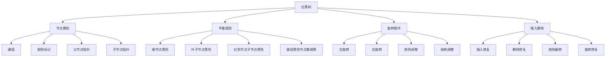

# 红黑树详解

## 📖 核心概念

**红黑树**是一种自平衡的二叉搜索树，通过颜色标记和旋转操作来维持平衡。它是AVL树的替代方案，在保持良好性能的同时，减少了旋转操作的频率。红黑树广泛应用于C++的STL、Java的TreeMap、Linux内核等系统中。

### 🏗️ 红黑树的组成要素



## 🔍 红黑树特性

### 基本特性

| 特性 | 描述 | 作用 | 违反后果 |
|------|------|------|----------|
| **根节点黑色** | 根节点必须是黑色 | 简化边界处理 | 违反基本规则 |
| **叶子节点黑色** | 所有叶子节点（NIL）是黑色 | 统一处理空节点 | 影响路径计算 |
| **红色节点限制** | 红色节点的子节点必须是黑色 | 控制路径长度 | 路径不平衡 |
| **路径平衡** | 从根到叶子的所有路径黑色节点数相等 | 保证平衡性 | 树高度不平衡 |

### 复杂度分析

| 操作 | 时间复杂度 | 空间复杂度 | 旋转次数 | 适用场景 |
|------|------------|------------|----------|----------|
| **查找** | O(log n) | O(1) | 0 | 所有场景 |
| **插入** | O(log n) | O(1) | ≤3次 | 动态数据 |
| **删除** | O(log n) | O(1) | ≤3次 | 动态数据 |
| **遍历** | O(n) | O(log n) | 0 | 范围查询 |

## 💻 红黑树实现

### 节点结构定义

```cpp
// 红黑树节点结构
template<typename T>
struct RBTreeNode {
    T data;
    bool isRed;  // true表示红色，false表示黑色
    RBTreeNode* parent;
    RBTreeNode* left;
    RBTreeNode* right;
    
    RBTreeNode(const T& value) 
        : data(value), isRed(true), parent(nullptr), left(nullptr), right(nullptr) {}
    
    // 获取兄弟节点
    RBTreeNode* getSibling() {
        if (parent == nullptr) return nullptr;
        return (this == parent->left) ? parent->right : parent->left;
    }
    
    // 获取叔叔节点
    RBTreeNode* getUncle() {
        if (parent == nullptr || parent->parent == nullptr) return nullptr;
        return parent->getSibling();
    }
    
    // 获取祖父节点
    RBTreeNode* getGrandparent() {
        if (parent == nullptr) return nullptr;
        return parent->parent;
    }
    
    // 检查是否为左子节点
    bool isLeftChild() {
        return parent != nullptr && this == parent->left;
    }
    
    // 检查是否为右子节点
    bool isRightChild() {
        return parent != nullptr && this == parent->right;
    }
};
```

### 红黑树类定义

```cpp
template<typename T>
class RedBlackTree {
private:
    RBTreeNode<T>* root;
    RBTreeNode<T>* nil;  // 哨兵节点
    
    // 创建哨兵节点
    void createNil() {
        nil = new RBTreeNode<T>(T{});
        nil->isRed = false;
        nil->parent = nullptr;
        nil->left = nullptr;
        nil->right = nullptr;
    }
    
    // 初始化
    void initialize() {
        createNil();
        root = nil;
    }
    
public:
    RedBlackTree() {
        initialize();
    }
    
    ~RedBlackTree() {
        clear();
        delete nil;
    }
    
    // 清空树
    void clear() {
        clearHelper(root);
        root = nil;
    }
    
private:
    void clearHelper(RBTreeNode<T>* node) {
        if (node == nil) return;
        clearHelper(node->left);
        clearHelper(node->right);
        delete node;
    }
    
public:
    // 查找节点
    RBTreeNode<T>* search(const T& value) {
        RBTreeNode<T>* current = root;
        
        while (current != nil) {
            if (value == current->data) {
                return current;
            } else if (value < current->data) {
                current = current->left;
            } else {
                current = current->right;
            }
        }
        
        return nullptr;
    }
    
    // 插入节点
    void insert(const T& value) {
        RBTreeNode<T>* newNode = new RBTreeNode<T>(value);
        newNode->left = nil;
        newNode->right = nil;
        
        // 普通BST插入
        RBTreeNode<T>* parent = nil;
        RBTreeNode<T>* current = root;
        
        while (current != nil) {
            parent = current;
            if (value < current->data) {
                current = current->left;
            } else {
                current = current->right;
            }
        }
        
        newNode->parent = parent;
        
        if (parent == nil) {
            root = newNode;
        } else if (value < parent->data) {
            parent->left = newNode;
        } else {
            parent->right = newNode;
        }
        
        // 修复红黑树性质
        insertFixup(newNode);
    }
    
private:
    // 插入修复
    void insertFixup(RBTreeNode<T>* node) {
        while (node->parent->isRed) {
            if (node->parent == node->parent->parent->left) {
                // 父节点是左子节点
                RBTreeNode<T>* uncle = node->parent->parent->right;
                
                if (uncle->isRed) {
                    // Case 1: 叔叔节点是红色
                    node->parent->isRed = false;
                    uncle->isRed = false;
                    node->parent->parent->isRed = true;
                    node = node->parent->parent;
                } else {
                    if (node == node->parent->right) {
                        // Case 2: 当前节点是右子节点
                        node = node->parent;
                        leftRotate(node);
                    }
                    // Case 3: 当前节点是左子节点
                    node->parent->isRed = false;
                    node->parent->parent->isRed = true;
                    rightRotate(node->parent->parent);
                }
            } else {
                // 父节点是右子节点
                RBTreeNode<T>* uncle = node->parent->parent->left;
                
                if (uncle->isRed) {
                    // Case 1: 叔叔节点是红色
                    node->parent->isRed = false;
                    uncle->isRed = false;
                    node->parent->parent->isRed = true;
                    node = node->parent->parent;
                } else {
                    if (node == node->parent->left) {
                        // Case 2: 当前节点是左子节点
                        node = node->parent;
                        rightRotate(node);
                    }
                    // Case 3: 当前节点是右子节点
                    node->parent->isRed = false;
                    node->parent->parent->isRed = true;
                    leftRotate(node->parent->parent);
                }
            }
        }
        
        root->isRed = false;
    }
    
    // 左旋转
    void leftRotate(RBTreeNode<T>* node) {
        RBTreeNode<T>* rightChild = node->right;
        node->right = rightChild->left;
        
        if (rightChild->left != nil) {
            rightChild->left->parent = node;
        }
        
        rightChild->parent = node->parent;
        
        if (node->parent == nil) {
            root = rightChild;
        } else if (node == node->parent->left) {
            node->parent->left = rightChild;
        } else {
            node->parent->right = rightChild;
        }
        
        rightChild->left = node;
        node->parent = rightChild;
    }
    
    // 右旋转
    void rightRotate(RBTreeNode<T>* node) {
        RBTreeNode<T>* leftChild = node->left;
        node->left = leftChild->right;
        
        if (leftChild->right != nil) {
            leftChild->right->parent = node;
        }
        
        leftChild->parent = node->parent;
        
        if (node->parent == nil) {
            root = leftChild;
        } else if (node == node->parent->right) {
            node->parent->right = leftChild;
        } else {
            node->parent->left = leftChild;
        }
        
        leftChild->right = node;
        node->parent = leftChild;
    }
    
public:
    // 删除节点
    void remove(const T& value) {
        RBTreeNode<T>* nodeToDelete = search(value);
        if (nodeToDelete == nullptr) {
            return;
        }
        
        RBTreeNode<T>* nodeToFix = nodeToDelete;
        bool originalColor = nodeToDelete->isRed;
        RBTreeNode<T>* child;
        
        if (nodeToDelete->left == nil) {
            child = nodeToDelete->right;
            transplant(nodeToDelete, child);
        } else if (nodeToDelete->right == nil) {
            child = nodeToDelete->left;
            transplant(nodeToDelete, child);
        } else {
            // 找到后继节点
            RBTreeNode<T>* successor = minimum(nodeToDelete->right);
            originalColor = successor->isRed;
            child = successor->right;
            
            if (successor->parent == nodeToDelete) {
                child->parent = successor;
            } else {
                transplant(successor, child);
                successor->right = nodeToDelete->right;
                successor->right->parent = successor;
            }
            
            transplant(nodeToDelete, successor);
            successor->left = nodeToDelete->left;
            successor->left->parent = successor;
            successor->isRed = nodeToDelete->isRed;
        }
        
        delete nodeToDelete;
        
        if (!originalColor) {
            deleteFixup(child);
        }
    }
    
private:
    // 替换节点
    void transplant(RBTreeNode<T>* u, RBTreeNode<T>* v) {
        if (u->parent == nil) {
            root = v;
        } else if (u == u->parent->left) {
            u->parent->left = v;
        } else {
            u->parent->right = v;
        }
        
        v->parent = u->parent;
    }
    
    // 找到最小节点
    RBTreeNode<T>* minimum(RBTreeNode<T>* node) {
        while (node->left != nil) {
            node = node->left;
        }
        return node;
    }
    
    // 删除修复
    void deleteFixup(RBTreeNode<T>* node) {
        while (node != root && !node->isRed) {
            if (node == node->parent->left) {
                RBTreeNode<T>* sibling = node->parent->right;
                
                if (sibling->isRed) {
                    // Case 1: 兄弟节点是红色
                    sibling->isRed = false;
                    node->parent->isRed = true;
                    leftRotate(node->parent);
                    sibling = node->parent->right;
                }
                
                if (!sibling->left->isRed && !sibling->right->isRed) {
                    // Case 2: 兄弟节点的子节点都是黑色
                    sibling->isRed = true;
                    node = node->parent;
                } else {
                    if (!sibling->right->isRed) {
                        // Case 3: 兄弟节点的右子节点是黑色
                        sibling->left->isRed = false;
                        sibling->isRed = true;
                        rightRotate(sibling);
                        sibling = node->parent->right;
                    }
                    // Case 4: 兄弟节点的右子节点是红色
                    sibling->isRed = node->parent->isRed;
                    node->parent->isRed = false;
                    sibling->right->isRed = false;
                    leftRotate(node->parent);
                    node = root;
                }
            } else {
                RBTreeNode<T>* sibling = node->parent->left;
                
                if (sibling->isRed) {
                    // Case 1: 兄弟节点是红色
                    sibling->isRed = false;
                    node->parent->isRed = true;
                    rightRotate(node->parent);
                    sibling = node->parent->left;
                }
                
                if (!sibling->right->isRed && !sibling->left->isRed) {
                    // Case 2: 兄弟节点的子节点都是黑色
                    sibling->isRed = true;
                    node = node->parent;
                } else {
                    if (!sibling->left->isRed) {
                        // Case 3: 兄弟节点的左子节点是黑色
                        sibling->right->isRed = false;
                        sibling->isRed = true;
                        leftRotate(sibling);
                        sibling = node->parent->left;
                    }
                    // Case 4: 兄弟节点的左子节点是红色
                    sibling->isRed = node->parent->isRed;
                    node->parent->isRed = false;
                    sibling->left->isRed = false;
                    rightRotate(node->parent);
                    node = root;
                }
            }
        }
        
        node->isRed = false;
    }
    
public:
    // 中序遍历
    void inorderTraversal() {
        cout << "Inorder Traversal: ";
        inorderHelper(root);
        cout << endl;
    }
    
private:
    void inorderHelper(RBTreeNode<T>* node) {
        if (node != nil) {
            inorderHelper(node->left);
            cout << node->data << "(" << (node->isRed ? "R" : "B") << ") ";
            inorderHelper(node->right);
        }
    }
    
public:
    // 验证红黑树性质
    bool validate() {
        if (root == nil) return true;
        
        // 检查根节点是否为黑色
        if (root->isRed) {
            cout << "Violation: Root is red" << endl;
            return false;
        }
        
        // 检查所有路径的黑色节点数
        int blackCount = -1;
        return validateHelper(root, 0, blackCount);
    }
    
private:
    bool validateHelper(RBTreeNode<T>* node, int currentBlackCount, int& expectedBlackCount) {
        if (node == nil) {
            if (expectedBlackCount == -1) {
                expectedBlackCount = currentBlackCount;
            } else if (currentBlackCount != expectedBlackCount) {
                cout << "Violation: Different black counts in paths" << endl;
                return false;
            }
            return true;
        }
        
        if (!node->isRed) {
            currentBlackCount++;
        } else {
            // 检查红色节点的子节点是否为黑色
            if ((node->left != nil && node->left->isRed) ||
                (node->right != nil && node->right->isRed)) {
                cout << "Violation: Red node has red child" << endl;
                return false;
            }
        }
        
        return validateHelper(node->left, currentBlackCount, expectedBlackCount) &&
               validateHelper(node->right, currentBlackCount, expectedBlackCount);
    }
    
public:
    // 获取树的高度
    int getHeight() {
        return getHeightHelper(root);
    }
    
private:
    int getHeightHelper(RBTreeNode<T>* node) {
        if (node == nil) return 0;
        return 1 + max(getHeightHelper(node->left), getHeightHelper(node->right));
    }
    
public:
    // 获取黑色高度
    int getBlackHeight() {
        return getBlackHeightHelper(root);
    }
    
private:
    int getBlackHeightHelper(RBTreeNode<T>* node) {
        if (node == nil) return 0;
        int height = getBlackHeightHelper(node->left);
        if (!node->isRed) height++;
        return height;
    }
    
public:
    // 范围查询
    vector<T> rangeQuery(const T& minValue, const T& maxValue) {
        vector<T> result;
        rangeQueryHelper(root, minValue, maxValue, result);
        return result;
    }
    
private:
    void rangeQueryHelper(RBTreeNode<T>* node, const T& minValue, const T& maxValue, vector<T>& result) {
        if (node == nil) return;
        
        if (node->data >= minValue) {
            rangeQueryHelper(node->left, minValue, maxValue, result);
        }
        
        if (node->data >= minValue && node->data <= maxValue) {
            result.push_back(node->data);
        }
        
        if (node->data <= maxValue) {
            rangeQueryHelper(node->right, minValue, maxValue, result);
        }
    }
    
public:
    // 获取统计信息
    struct TreeStatistics {
        int totalNodes;
        int redNodes;
        int blackNodes;
        int height;
        int blackHeight;
        double averageDepth;
    };
    
    TreeStatistics getStatistics() {
        TreeStatistics stats;
        stats.totalNodes = 0;
        stats.redNodes = 0;
        stats.blackNodes = 0;
        stats.height = getHeight();
        stats.blackHeight = getBlackHeight();
        stats.averageDepth = 0;
        
        int totalDepth = 0;
        calculateStatistics(root, 0, stats, totalDepth);
        
        if (stats.totalNodes > 0) {
            stats.averageDepth = (double)totalDepth / stats.totalNodes;
        }
        
        return stats;
    }
    
private:
    void calculateStatistics(RBTreeNode<T>* node, int depth, TreeStatistics& stats, int& totalDepth) {
        if (node == nil) return;
        
        stats.totalNodes++;
        totalDepth += depth;
        
        if (node->isRed) {
            stats.redNodes++;
        } else {
            stats.blackNodes++;
        }
        
        calculateStatistics(node->left, depth + 1, stats, totalDepth);
        calculateStatistics(node->right, depth + 1, stats, totalDepth);
    }
};
```

## 🎯 红黑树应用

### 实际应用场景

```cpp
// 红黑树在STL中的应用示例
class STLStyleMap {
private:
    RedBlackTree<pair<int, string>> tree;
    
public:
    // 插入键值对
    void insert(int key, const string& value) {
        tree.insert(make_pair(key, value));
    }
    
    // 查找值
    string find(int key) {
        auto node = tree.search(make_pair(key, ""));
        return (node != nullptr) ? node->data.second : "";
    }
    
    // 删除键值对
    void erase(int key) {
        tree.remove(make_pair(key, ""));
    }
    
    // 范围查询
    vector<string> rangeQuery(int minKey, int maxKey) {
        vector<pair<int, string>> pairs = tree.rangeQuery(
            make_pair(minKey, ""), 
            make_pair(maxKey, string(100, 'z'))
        );
        
        vector<string> result;
        for (const auto& pair : pairs) {
            result.push_back(pair.second);
        }
        
        return result;
    }
    
    // 获取所有键
    vector<int> getAllKeys() {
        vector<pair<int, string>> pairs = tree.rangeQuery(
            make_pair(INT_MIN, ""), 
            make_pair(INT_MAX, string(100, 'z'))
        );
        
        vector<int> keys;
        for (const auto& pair : pairs) {
            keys.push_back(pair.first);
        }
        
        return keys;
    }
};
```

### 性能测试

```cpp
// 红黑树性能测试
class RedBlackTreePerformanceTest {
public:
    static void testInsertion(int count) {
        RedBlackTree<int> tree;
        auto start = chrono::high_resolution_clock::now();
        
        for (int i = 0; i < count; i++) {
            tree.insert(i);
        }
        
        auto end = chrono::high_resolution_clock::now();
        auto duration = chrono::duration_cast<chrono::microseconds>(end - start);
        
        cout << "Insertion of " << count << " elements took: " 
             << duration.count() << " microseconds" << endl;
        
        // 验证树的性质
        if (tree.validate()) {
            cout << "Tree validation passed" << endl;
        } else {
            cout << "Tree validation failed" << endl;
        }
        
        auto stats = tree.getStatistics();
        cout << "Tree height: " << stats.height << endl;
        cout << "Black height: " << stats.blackHeight << endl;
        cout << "Average depth: " << stats.averageDepth << endl;
    }
    
    static void testSearch(int count) {
        RedBlackTree<int> tree;
        
        // 插入数据
        for (int i = 0; i < count; i++) {
            tree.insert(i);
        }
        
        auto start = chrono::high_resolution_clock::now();
        
        // 搜索测试
        for (int i = 0; i < count; i++) {
            tree.search(i);
        }
        
        auto end = chrono::high_resolution_clock::now();
        auto duration = chrono::duration_cast<chrono::microseconds>(end - start);
        
        cout << "Search of " << count << " elements took: " 
             << duration.count() << " microseconds" << endl;
    }
    
    static void testDeletion(int count) {
        RedBlackTree<int> tree;
        
        // 插入数据
        for (int i = 0; i < count; i++) {
            tree.insert(i);
        }
        
        auto start = chrono::high_resolution_clock::now();
        
        // 删除测试
        for (int i = 0; i < count; i++) {
            tree.remove(i);
        }
        
        auto end = chrono::high_resolution_clock::now();
        auto duration = chrono::duration_cast<chrono::microseconds>(end - start);
        
        cout << "Deletion of " << count << " elements took: " 
             << duration.count() << " microseconds" << endl;
    }
};
```

## ⚡ 复杂度分析

### 红黑树复杂度

| 操作 | 时间复杂度 | 空间复杂度 | 旋转次数 | 适用场景 |
|------|------------|------------|----------|----------|
| **查找** | O(log n) | O(1) | 0 | 所有场景 |
| **插入** | O(log n) | O(1) | ≤3次 | 动态数据 |
| **删除** | O(log n) | O(1) | ≤3次 | 动态数据 |
| **范围查询** | O(log n + k) | O(k) | 0 | 区间操作 |

### 与其他数据结构比较

| 数据结构 | 查找 | 插入 | 删除 | 旋转次数 | 内存开销 |
|----------|------|------|------|----------|----------|
| **红黑树** | O(log n) | O(log n) | O(log n) | ≤3次 | 中等 |
| **AVL树** | O(log n) | O(log n) | O(log n) | 较多 | 中等 |
| **B树** | O(log n) | O(log n) | O(log n) | 0 | 较高 |
| **哈希表** | O(1) | O(1) | O(1) | 0 | 较高 |

## 🎓 学习要点总结

### 核心理解

1. **平衡机制**：理解红黑树的自平衡原理
2. **颜色标记**：掌握颜色标记的作用和规则
3. **旋转操作**：学会左旋和右旋的实现
4. **修复策略**：理解插入和删除的修复过程

### 实践要点

1. **节点设计**：正确设计红黑树节点结构
2. **旋转实现**：准确实现旋转操作
3. **修复逻辑**：正确处理各种修复情况
4. **验证测试**：验证红黑树的性质

### 应用思维

1. **性能权衡**：理解红黑树的性能特点
2. **适用场景**：选择合适的应用场景
3. **优化策略**：掌握性能优化方法
4. **实际应用**：将红黑树应用到实际问题中

---

**相关链接：**
- [[05-高级结构/02-平衡树族/01-AVL树详解|AVL树详解]] - 平衡树基础
- [[05-高级结构/02-平衡树族/03-B树与B+树|B树与B+树]] - 多路平衡树
- [[03-层次宇宙/02-二叉树王国/01-二叉树基础|二叉树基础]] - 二叉树基础
- [[03-层次宇宙/02-二叉树王国/02-二叉搜索树|二叉搜索树]] - 搜索树基础
