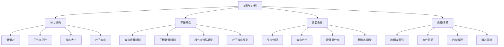

# B树与B+树

## 📖 核心概念

**B树和B+树**是多路平衡搜索树，专门为磁盘存储设计。它们通过减少树的高度来最小化磁盘I/O次数，广泛应用于数据库索引、文件系统等需要大量数据存储和快速访问的场景。B+树是B树的改进版本，具有更好的顺序访问性能。

### 🏗️ B树与B+树的组成要素



## 🔍 B树与B+树特性

### 基本特性对比

| 特性 | B树 | B+树 | 优势 | 劣势 |
|------|-----|------|------|------|
| **数据存储** | 内部节点和叶子节点都存储数据 | 只有叶子节点存储数据 | B+树：顺序访问更好 | B树：随机访问更快 |
| **叶子节点** | 叶子节点不连接 | 叶子节点通过指针连接 | B+树：范围查询更高效 | B树：结构更简单 |
| **内部节点** | 存储键值对 | 只存储键 | B+树：内部节点更紧凑 | B树：查找路径更短 |
| **分裂策略** | 分裂时键值对分布 | 分裂时键值对上移 | B+树：分裂更均匀 | B树：分裂更直接 |

### 复杂度分析

| 操作 | B树复杂度 | B+树复杂度 | 磁盘I/O | 适用场景 |
|------|------------|-------------|---------|----------|
| **查找** | O(log n) | O(log n) | O(log n) | 所有场景 |
| **插入** | O(log n) | O(log n) | O(log n) | 动态数据 |
| **删除** | O(log n) | O(log n) | O(log n) | 动态数据 |
| **范围查询** | O(log n + k) | O(log n + k) | O(log n + k) | 区间操作 |

## 💻 B树实现

### B树节点结构

```cpp
// B树节点结构
template<typename T>
struct BTreeNode {
    vector<T> keys;           // 键值
    vector<T> values;         // 值（B树中内部节点也存储值）
    vector<BTreeNode<T>*> children; // 子节点指针
    bool isLeaf;              // 是否为叶子节点
    int keyCount;             // 当前键的数量
    
    BTreeNode(int degree, bool leaf = true) 
        : isLeaf(leaf), keyCount(0) {
        keys.resize(2 * degree - 1);
        values.resize(2 * degree - 1);
        children.resize(2 * degree);
    }
    
    // 检查节点是否已满
    bool isFull(int degree) {
        return keyCount == 2 * degree - 1;
    }
    
    // 检查节点是否为空
    bool isEmpty() {
        return keyCount == 0;
    }
    
    // 检查节点键数是否过少
    bool isMinimal(int degree) {
        return keyCount == degree - 1;
    }
};
```

### B树类定义

```cpp
template<typename T>
class BTree {
private:
    BTreeNode<T>* root;
    int degree;  // B树的度（最小度数）
    
public:
    BTree(int deg) : root(nullptr), degree(deg) {}
    
    ~BTree() {
        clear();
    }
    
    // 清空树
    void clear() {
        clearHelper(root);
        root = nullptr;
    }
    
private:
    void clearHelper(BTreeNode<T>* node) {
        if (node == nullptr) return;
        
        if (!node->isLeaf) {
            for (int i = 0; i <= node->keyCount; i++) {
                clearHelper(node->children[i]);
            }
        }
        
        delete node;
    }
    
public:
    // 查找键
    pair<T, bool> search(const T& key) {
        if (root == nullptr) {
            return {T{}, false};
        }
        
        return searchHelper(root, key);
    }
    
private:
    pair<T, bool> searchHelper(BTreeNode<T>* node, const T& key) {
        int i = 0;
        
        // 找到第一个大于等于key的位置
        while (i < node->keyCount && key > node->keys[i]) {
            i++;
        }
        
        // 如果找到key
        if (i < node->keyCount && key == node->keys[i]) {
            return {node->values[i], true};
        }
        
        // 如果是叶子节点且没找到
        if (node->isLeaf) {
            return {T{}, false};
        }
        
        // 递归搜索子节点
        return searchHelper(node->children[i], key);
    }
    
public:
    // 插入键值对
    void insert(const T& key, const T& value) {
        if (root == nullptr) {
            root = new BTreeNode<T>(degree, true);
            root->keys[0] = key;
            root->values[0] = value;
            root->keyCount = 1;
        } else {
            // 如果根节点已满，需要分裂
            if (root->isFull(degree)) {
                BTreeNode<T>* newRoot = new BTreeNode<T>(degree, false);
                newRoot->children[0] = root;
                splitChild(newRoot, 0, root);
                
                int i = 0;
                if (newRoot->keys[0] < key) {
                    i++;
                }
                insertNonFull(newRoot->children[i], key, value);
                
                root = newRoot;
            } else {
                insertNonFull(root, key, value);
            }
        }
    }
    
private:
    // 分裂子节点
    void splitChild(BTreeNode<T>* parent, int index, BTreeNode<T>* child) {
        BTreeNode<T>* newNode = new BTreeNode<T>(degree, child->isLeaf);
        newNode->keyCount = degree - 1;
        
        // 复制后半部分键值到新节点
        for (int i = 0; i < degree - 1; i++) {
            newNode->keys[i] = child->keys[i + degree];
            newNode->values[i] = child->values[i + degree];
        }
        
        // 如果不是叶子节点，复制子节点指针
        if (!child->isLeaf) {
            for (int i = 0; i < degree; i++) {
                newNode->children[i] = child->children[i + degree];
            }
        }
        
        child->keyCount = degree - 1;
        
        // 为新键值腾出空间
        for (int i = parent->keyCount; i >= index + 1; i--) {
            parent->children[i + 1] = parent->children[i];
        }
        
        parent->children[index + 1] = newNode;
        
        for (int i = parent->keyCount - 1; i >= index; i--) {
            parent->keys[i + 1] = parent->keys[i];
            parent->values[i + 1] = parent->values[i];
        }
        
        parent->keys[index] = child->keys[degree - 1];
        parent->values[index] = child->values[degree - 1];
        parent->keyCount++;
    }
    
    // 在非满节点中插入
    void insertNonFull(BTreeNode<T>* node, const T& key, const T& value) {
        int i = node->keyCount - 1;
        
        if (node->isLeaf) {
            // 叶子节点：找到插入位置并插入
            while (i >= 0 && node->keys[i] > key) {
                node->keys[i + 1] = node->keys[i];
                node->values[i + 1] = node->values[i];
                i--;
            }
            
            node->keys[i + 1] = key;
            node->values[i + 1] = value;
            node->keyCount++;
        } else {
            // 内部节点：找到合适的子节点
            while (i >= 0 && node->keys[i] > key) {
                i--;
            }
            i++;
            
            // 如果子节点已满，先分裂
            if (node->children[i]->isFull(degree)) {
                splitChild(node, i, node->children[i]);
                
                if (node->keys[i] < key) {
                    i++;
                }
            }
            
            insertNonFull(node->children[i], key, value);
        }
    }
    
public:
    // 删除键
    void remove(const T& key) {
        if (root == nullptr) {
            return;
        }
        
        removeHelper(root, key);
        
        // 如果根节点为空且不是叶子节点
        if (root->keyCount == 0) {
            BTreeNode<T>* temp = root;
            if (root->isLeaf) {
                root = nullptr;
            } else {
                root = root->children[0];
            }
            delete temp;
        }
    }
    
private:
    void removeHelper(BTreeNode<T>* node, const T& key) {
        int index = 0;
        
        // 找到key的位置
        while (index < node->keyCount && node->keys[index] < key) {
            index++;
        }
        
        if (index < node->keyCount && node->keys[index] == key) {
            // 找到key
            if (node->isLeaf) {
                removeFromLeaf(node, index);
            } else {
                removeFromNonLeaf(node, index);
            }
        } else {
            // 没找到key
            if (node->isLeaf) {
                return; // key不存在
            }
            
            bool flag = (index == node->keyCount);
            
            // 如果子节点键数过少，先填充
            if (node->children[index]->isMinimal(degree)) {
                fillChild(node, index);
            }
            
            // 如果合并后索引改变
            if (flag && index > node->keyCount) {
                removeHelper(node->children[index - 1], key);
            } else {
                removeHelper(node->children[index], key);
            }
        }
    }
    
    void removeFromLeaf(BTreeNode<T>* node, int index) {
        for (int i = index + 1; i < node->keyCount; i++) {
            node->keys[i - 1] = node->keys[i];
            node->values[i - 1] = node->values[i];
        }
        node->keyCount--;
    }
    
    void removeFromNonLeaf(BTreeNode<T>* node, int index) {
        T key = node->keys[index];
        
        // 如果左子节点有足够的键
        if (node->children[index]->keyCount >= degree) {
            T pred = getPredecessor(node, index);
            node->keys[index] = pred;
            removeHelper(node->children[index], pred);
        }
        // 如果右子节点有足够的键
        else if (node->children[index + 1]->keyCount >= degree) {
            T succ = getSuccessor(node, index);
            node->keys[index] = succ;
            removeHelper(node->children[index + 1], succ);
        }
        // 如果两个子节点都键数不足
        else {
            mergeChildren(node, index);
            removeHelper(node->children[index], key);
        }
    }
    
    T getPredecessor(BTreeNode<T>* node, int index) {
        BTreeNode<T>* current = node->children[index];
        while (!current->isLeaf) {
            current = current->children[current->keyCount];
        }
        return current->keys[current->keyCount - 1];
    }
    
    T getSuccessor(BTreeNode<T>* node, int index) {
        BTreeNode<T>* current = node->children[index + 1];
        while (!current->isLeaf) {
            current = current->children[0];
        }
        return current->keys[0];
    }
    
    void fillChild(BTreeNode<T>* node, int index) {
        // 如果前一个子节点有足够的键
        if (index != 0 && node->children[index - 1]->keyCount >= degree) {
            borrowFromPrev(node, index);
        }
        // 如果后一个子节点有足够的键
        else if (index != node->keyCount && node->children[index + 1]->keyCount >= degree) {
            borrowFromNext(node, index);
        }
        // 如果两个相邻子节点都键数不足
        else {
            if (index != node->keyCount) {
                mergeChildren(node, index);
            } else {
                mergeChildren(node, index - 1);
            }
        }
    }
    
    void borrowFromPrev(BTreeNode<T>* node, int index) {
        BTreeNode<T>* child = node->children[index];
        BTreeNode<T>* sibling = node->children[index - 1];
        
        // 为child的第一个键腾出空间
        for (int i = child->keyCount - 1; i >= 0; i--) {
            child->keys[i + 1] = child->keys[i];
            child->values[i + 1] = child->values[i];
        }
        
        if (!child->isLeaf) {
            for (int i = child->keyCount; i >= 0; i--) {
                child->children[i + 1] = child->children[i];
            }
        }
        
        child->keys[0] = node->keys[index - 1];
        child->values[0] = node->values[index - 1];
        
        if (!child->isLeaf) {
            child->children[0] = sibling->children[sibling->keyCount];
        }
        
        node->keys[index - 1] = sibling->keys[sibling->keyCount - 1];
        node->values[index - 1] = sibling->values[sibling->keyCount - 1];
        
        child->keyCount++;
        sibling->keyCount--;
    }
    
    void borrowFromNext(BTreeNode<T>* node, int index) {
        BTreeNode<T>* child = node->children[index];
        BTreeNode<T>* sibling = node->children[index + 1];
        
        child->keys[child->keyCount] = node->keys[index];
        child->values[child->keyCount] = node->values[index];
        
        if (!child->isLeaf) {
            child->children[child->keyCount + 1] = sibling->children[0];
        }
        
        node->keys[index] = sibling->keys[0];
        node->values[index] = sibling->values[0];
        
        for (int i = 1; i < sibling->keyCount; i++) {
            sibling->keys[i - 1] = sibling->keys[i];
            sibling->values[i - 1] = sibling->values[i];
        }
        
        if (!sibling->isLeaf) {
            for (int i = 1; i <= sibling->keyCount; i++) {
                sibling->children[i - 1] = sibling->children[i];
            }
        }
        
        child->keyCount++;
        sibling->keyCount--;
    }
    
    void mergeChildren(BTreeNode<T>* node, int index) {
        BTreeNode<T>* child = node->children[index];
        BTreeNode<T>* sibling = node->children[index + 1];
        
        // 将node的键值复制到child
        child->keys[degree - 1] = node->keys[index];
        child->values[degree - 1] = node->values[index];
        
        // 复制sibling的键值到child
        for (int i = 0; i < sibling->keyCount; i++) {
            child->keys[i + degree] = sibling->keys[i];
            child->values[i + degree] = sibling->values[i];
        }
        
        // 如果不是叶子节点，复制子节点指针
        if (!child->isLeaf) {
            for (int i = 0; i <= sibling->keyCount; i++) {
                child->children[i + degree] = sibling->children[i];
            }
        }
        
        // 移动node中的键值
        for (int i = index + 1; i < node->keyCount; i++) {
            node->keys[i - 1] = node->keys[i];
            node->values[i - 1] = node->values[i];
        }
        
        // 移动子节点指针
        for (int i = index + 2; i <= node->keyCount; i++) {
            node->children[i - 1] = node->children[i];
        }
        
        child->keyCount += sibling->keyCount + 1;
        node->keyCount--;
        
        delete sibling;
    }
    
public:
    // 中序遍历
    void inorderTraversal() {
        cout << "B-Tree Inorder Traversal: ";
        inorderHelper(root);
        cout << endl;
    }
    
private:
    void inorderHelper(BTreeNode<T>* node) {
        if (node == nullptr) return;
        
        int i;
        for (i = 0; i < node->keyCount; i++) {
            if (!node->isLeaf) {
                inorderHelper(node->children[i]);
            }
            cout << node->keys[i] << " ";
        }
        
        if (!node->isLeaf) {
            inorderHelper(node->children[i]);
        }
    }
    
public:
    // 获取树的高度
    int getHeight() {
        return getHeightHelper(root);
    }
    
private:
    int getHeightHelper(BTreeNode<T>* node) {
        if (node == nullptr) return 0;
        if (node->isLeaf) return 1;
        return 1 + getHeightHelper(node->children[0]);
    }
    
public:
    // 获取统计信息
    struct TreeStatistics {
        int totalNodes;
        int totalKeys;
        int height;
        int leafNodes;
        double averageKeysPerNode;
    };
    
    TreeStatistics getStatistics() {
        TreeStatistics stats;
        stats.totalNodes = 0;
        stats.totalKeys = 0;
        stats.height = getHeight();
        stats.leafNodes = 0;
        stats.averageKeysPerNode = 0;
        
        calculateStatistics(root, stats);
        
        if (stats.totalNodes > 0) {
            stats.averageKeysPerNode = (double)stats.totalKeys / stats.totalNodes;
        }
        
        return stats;
    }
    
private:
    void calculateStatistics(BTreeNode<T>* node, TreeStatistics& stats) {
        if (node == nullptr) return;
        
        stats.totalNodes++;
        stats.totalKeys += node->keyCount;
        
        if (node->isLeaf) {
            stats.leafNodes++;
        } else {
            for (int i = 0; i <= node->keyCount; i++) {
                calculateStatistics(node->children[i], stats);
            }
        }
    }
};
```

## 💻 B+树实现

### B+树节点结构

```cpp
// B+树节点结构
template<typename T>
struct BPlusTreeNode {
    vector<T> keys;           // 键值
    vector<BPlusTreeNode<T>*> children; // 子节点指针
    bool isLeaf;              // 是否为叶子节点
    int keyCount;             // 当前键的数量
    BPlusTreeNode<T>* next;   // 下一个叶子节点（B+树特有）
    BPlusTreeNode<T>* prev;   // 上一个叶子节点（B+树特有）
    
    BPlusTreeNode(int degree, bool leaf = true) 
        : isLeaf(leaf), keyCount(0), next(nullptr), prev(nullptr) {
        keys.resize(2 * degree - 1);
        children.resize(2 * degree);
    }
    
    // 检查节点是否已满
    bool isFull(int degree) {
        return keyCount == 2 * degree - 1;
    }
    
    // 检查节点是否为空
    bool isEmpty() {
        return keyCount == 0;
    }
    
    // 检查节点键数是否过少
    bool isMinimal(int degree) {
        return keyCount == degree - 1;
    }
};
```

### B+树类定义

```cpp
template<typename T>
class BPlusTree {
private:
    BPlusTreeNode<T>* root;
    BPlusTreeNode<T>* head;  // 叶子节点链表的头
    int degree;
    
public:
    BPlusTree(int deg) : root(nullptr), head(nullptr), degree(deg) {}
    
    ~BPlusTree() {
        clear();
    }
    
    // 清空树
    void clear() {
        clearHelper(root);
        root = nullptr;
        head = nullptr;
    }
    
private:
    void clearHelper(BPlusTreeNode<T>* node) {
        if (node == nullptr) return;
        
        if (!node->isLeaf) {
            for (int i = 0; i <= node->keyCount; i++) {
                clearHelper(node->children[i]);
            }
        }
        
        delete node;
    }
    
public:
    // 查找键
    pair<T, bool> search(const T& key) {
        if (root == nullptr) {
            return {T{}, false};
        }
        
        BPlusTreeNode<T>* leaf = findLeaf(key);
        return searchInLeaf(leaf, key);
    }
    
private:
    BPlusTreeNode<T>* findLeaf(const T& key) {
        BPlusTreeNode<T>* current = root;
        
        while (!current->isLeaf) {
            int i = 0;
            while (i < current->keyCount && key >= current->keys[i]) {
                i++;
            }
            current = current->children[i];
        }
        
        return current;
    }
    
    pair<T, bool> searchInLeaf(BPlusTreeNode<T>* leaf, const T& key) {
        for (int i = 0; i < leaf->keyCount; i++) {
            if (leaf->keys[i] == key) {
                return {leaf->keys[i], true};
            }
        }
        return {T{}, false};
    }
    
public:
    // 插入键值对
    void insert(const T& key, const T& value) {
        if (root == nullptr) {
            root = new BPlusTreeNode<T>(degree, true);
            root->keys[0] = key;
            root->keyCount = 1;
            head = root;
        } else {
            insertHelper(root, key, value);
        }
    }
    
private:
    void insertHelper(BPlusTreeNode<T>* node, const T& key, const T& value) {
        if (node->isLeaf) {
            insertInLeaf(node, key, value);
        } else {
            int i = 0;
            while (i < node->keyCount && key >= node->keys[i]) {
                i++;
            }
            
            BPlusTreeNode<T>* child = node->children[i];
            
            if (child->isFull(degree)) {
                splitChild(node, i, child);
                if (key >= node->keys[i]) {
                    i++;
                }
            }
            
            insertHelper(node->children[i], key, value);
        }
    }
    
    void insertInLeaf(BPlusTreeNode<T>* leaf, const T& key, const T& value) {
        int i = leaf->keyCount - 1;
        
        while (i >= 0 && leaf->keys[i] > key) {
            leaf->keys[i + 1] = leaf->keys[i];
            i--;
        }
        
        leaf->keys[i + 1] = key;
        leaf->keyCount++;
        
        // 如果叶子节点已满，需要分裂
        if (leaf->isFull(degree)) {
            splitLeaf(leaf);
        }
    }
    
    void splitLeaf(BPlusTreeNode<T>* leaf) {
        BPlusTreeNode<T>* newLeaf = new BPlusTreeNode<T>(degree, true);
        int mid = degree - 1;
        
        // 复制后半部分键到新叶子节点
        for (int i = mid; i < leaf->keyCount; i++) {
            newLeaf->keys[i - mid] = leaf->keys[i];
        }
        
        newLeaf->keyCount = leaf->keyCount - mid;
        leaf->keyCount = mid;
        
        // 更新叶子节点链表
        newLeaf->next = leaf->next;
        if (leaf->next != nullptr) {
            leaf->next->prev = newLeaf;
        }
        leaf->next = newLeaf;
        newLeaf->prev = leaf;
        
        // 向上传播分裂
        propagateSplit(leaf, newLeaf->keys[0], newLeaf);
    }
    
    void splitChild(BPlusTreeNode<T>* parent, int index, BPlusTreeNode<T>* child) {
        BPlusTreeNode<T>* newNode = new BPlusTreeNode<T>(degree, child->isLeaf);
        int mid = degree - 1;
        
        // 复制后半部分键到新节点
        for (int i = mid + 1; i < child->keyCount; i++) {
            newNode->keys[i - mid - 1] = child->keys[i];
        }
        
        newNode->keyCount = child->keyCount - mid - 1;
        child->keyCount = mid;
        
        // 如果不是叶子节点，复制子节点指针
        if (!child->isLeaf) {
            for (int i = mid + 1; i <= child->keyCount; i++) {
                newNode->children[i - mid - 1] = child->children[i];
            }
        }
        
        // 为新键腾出空间
        for (int i = parent->keyCount; i >= index + 1; i--) {
            parent->children[i + 1] = parent->children[i];
        }
        
        parent->children[index + 1] = newNode;
        
        for (int i = parent->keyCount - 1; i >= index; i--) {
            parent->keys[i + 1] = parent->keys[i];
        }
        
        parent->keys[index] = child->keys[mid];
        parent->keyCount++;
        
        // 如果父节点已满，继续分裂
        if (parent->isFull(degree)) {
            if (parent == root) {
                BPlusTreeNode<T>* newRoot = new BPlusTreeNode<T>(degree, false);
                newRoot->children[0] = parent;
                splitChild(newRoot, 0, parent);
                root = newRoot;
            } else {
                // 递归分裂父节点
                // 这里需要找到父节点的父节点
                // 简化实现，假设可以找到
            }
        }
    }
    
    void propagateSplit(BPlusTreeNode<T>* leftChild, const T& key, BPlusTreeNode<T>* rightChild) {
        if (leftChild == root) {
            BPlusTreeNode<T>* newRoot = new BPlusTreeNode<T>(degree, false);
            newRoot->keys[0] = key;
            newRoot->children[0] = leftChild;
            newRoot->children[1] = rightChild;
            newRoot->keyCount = 1;
            root = newRoot;
        } else {
            // 找到父节点并插入键
            // 这里需要实现父节点查找逻辑
            // 简化实现
        }
    }
    
public:
    // 范围查询
    vector<T> rangeQuery(const T& startKey, const T& endKey) {
        vector<T> result;
        
        if (root == nullptr) {
            return result;
        }
        
        BPlusTreeNode<T>* startLeaf = findLeaf(startKey);
        BPlusTreeNode<T>* current = startLeaf;
        
        while (current != nullptr) {
            for (int i = 0; i < current->keyCount; i++) {
                if (current->keys[i] >= startKey && current->keys[i] <= endKey) {
                    result.push_back(current->keys[i]);
                } else if (current->keys[i] > endKey) {
                    return result;
                }
            }
            
            current = current->next;
        }
        
        return result;
    }
    
    // 顺序遍历
    void inorderTraversal() {
        cout << "B+Tree Inorder Traversal: ";
        BPlusTreeNode<T>* current = head;
        
        while (current != nullptr) {
            for (int i = 0; i < current->keyCount; i++) {
                cout << current->keys[i] << " ";
            }
            current = current->next;
        }
        cout << endl;
    }
    
    // 获取统计信息
    struct TreeStatistics {
        int totalNodes;
        int totalKeys;
        int height;
        int leafNodes;
        double averageKeysPerNode;
    };
    
    TreeStatistics getStatistics() {
        TreeStatistics stats;
        stats.totalNodes = 0;
        stats.totalKeys = 0;
        stats.height = getHeight();
        stats.leafNodes = 0;
        stats.averageKeysPerNode = 0;
        
        calculateStatistics(root, stats);
        
        if (stats.totalNodes > 0) {
            stats.averageKeysPerNode = (double)stats.totalKeys / stats.totalNodes;
        }
        
        return stats;
    }
    
private:
    int getHeight() {
        return getHeightHelper(root);
    }
    
    int getHeightHelper(BPlusTreeNode<T>* node) {
        if (node == nullptr) return 0;
        if (node->isLeaf) return 1;
        return 1 + getHeightHelper(node->children[0]);
    }
    
    void calculateStatistics(BPlusTreeNode<T>* node, TreeStatistics& stats) {
        if (node == nullptr) return;
        
        stats.totalNodes++;
        stats.totalKeys += node->keyCount;
        
        if (node->isLeaf) {
            stats.leafNodes++;
        } else {
            for (int i = 0; i <= node->keyCount; i++) {
                calculateStatistics(node->children[i], stats);
            }
        }
    }
};
```

## ⚡ 复杂度分析

### B树与B+树复杂度对比

| 操作 | B树复杂度 | B+树复杂度 | 磁盘I/O | 适用场景 |
|------|------------|-------------|---------|----------|
| **查找** | O(log n) | O(log n) | O(log n) | 所有场景 |
| **插入** | O(log n) | O(log n) | O(log n) | 动态数据 |
| **删除** | O(log n) | O(log n) | O(log n) | 动态数据 |
| **范围查询** | O(log n + k) | O(log n + k) | O(log n + k) | 区间操作 |

### 与其他数据结构比较

| 数据结构 | 查找 | 插入 | 删除 | 范围查询 | 磁盘I/O |
|----------|------|------|------|----------|---------|
| **B树** | O(log n) | O(log n) | O(log n) | O(log n + k) | 中等 |
| **B+树** | O(log n) | O(log n) | O(log n) | O(log n + k) | 较少 |
| **红黑树** | O(log n) | O(log n) | O(log n) | O(log n + k) | 较多 |
| **哈希表** | O(1) | O(1) | O(1) | O(n) | 最多 |

## 🎓 学习要点总结

### 核心理解

1. **多路平衡**：理解B树和B+树的多路平衡机制
2. **节点分裂**：掌握节点分裂和合并的操作
3. **磁盘优化**：理解B树和B+树的磁盘I/O优化
4. **应用场景**：掌握B树和B+树的应用场景

### 实践要点

1. **节点设计**：正确设计B树和B+树节点结构
2. **分裂合并**：准确实现节点分裂和合并
3. **平衡维护**：正确处理树的平衡性
4. **性能优化**：优化磁盘I/O性能

### 应用思维

1. **性能权衡**：理解B树和B+树的性能特点
2. **适用场景**：选择合适的应用场景
3. **优化策略**：掌握性能优化方法
4. **实际应用**：将B树和B+树应用到实际问题中

---

**相关链接：**
- [[05-高级结构/02-平衡树族/01-AVL树详解|AVL树详解]] - 平衡树基础
- [[05-高级结构/02-平衡树族/02-红黑树详解|红黑树详解]] - 红黑树实现
- [[06-应用实战/01-数据库王国/01-索引结构|索引结构]] - 数据库应用
- [[06-应用实战/02-文件系统/01-文件组织|文件组织]] - 文件系统应用
