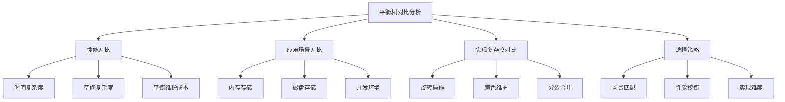

# 平衡树对比分析

## 📖 核心概念

**平衡树对比分析**是对不同平衡树数据结构的全面比较，包括AVL树、红黑树、B树等。通过对比分析，帮助选择最适合特定场景的平衡树结构。

### 🏗️ 平衡树对比框架



## 🔧 平衡树对比实现

### 性能对比分析

```cpp
class BalancedTreeComparison {
public:
    // AVL树性能测试
    struct AVLPerformance {
        double insertTime;
        double deleteTime;
        double searchTime;
        int rotations;
        int height;
        
        AVLPerformance() : insertTime(0), deleteTime(0), searchTime(0), rotations(0), height(0) {}
    };
    
    // 红黑树性能测试
    struct RBPerformance {
        double insertTime;
        double deleteTime;
        double searchTime;
        int colorChanges;
        int height;
        
        RBPerformance() : insertTime(0), deleteTime(0), searchTime(0), colorChanges(0), height(0) {}
    };
    
    // B树性能测试
    struct BTreePerformance {
        double insertTime;
        double deleteTime;
        double searchTime;
        int splits;
        int merges;
        int height;
        
        BTreePerformance() : insertTime(0), deleteTime(0), searchTime(0), splits(0), merges(0), height(0) {}
    };
    
    // 性能测试结果
    struct PerformanceResults {
        AVLPerformance avl;
        RBPerformance rb;
        BTreePerformance btree;
        
        void display() {
            cout << "Balanced Tree Performance Comparison:" << endl;
            cout << "==================================" << endl;
            
            cout << "AVL Tree:" << endl;
            cout << "  Insert Time: " << avl.insertTime << "ms" << endl;
            cout << "  Delete Time: " << avl.deleteTime << "ms" << endl;
            cout << "  Search Time: " << avl.searchTime << "ms" << endl;
            cout << "  Rotations: " << avl.rotations << endl;
            cout << "  Height: " << avl.height << endl;
            
            cout << "Red-Black Tree:" << endl;
            cout << "  Insert Time: " << rb.insertTime << "ms" << endl;
            cout << "  Delete Time: " << rb.deleteTime << "ms" << endl;
            cout << "  Search Time: " << rb.searchTime << "ms" << endl;
            cout << "  Color Changes: " << rb.colorChanges << endl;
            cout << "  Height: " << rb.height << endl;
            
            cout << "B-Tree:" << endl;
            cout << "  Insert Time: " << btree.insertTime << "ms" << endl;
            cout << "  Delete Time: " << btree.deleteTime << "ms" << endl;
            cout << "  Search Time: " << btree.searchTime << "ms" << endl;
            cout << "  Splits: " << btree.splits << endl;
            cout << "  Merges: " << btree.merges << endl;
            cout << "  Height: " << btree.height << endl;
        }
    };
    
    // 模拟性能测试
    PerformanceResults simulatePerformanceTest(int n) {
        PerformanceResults results;
        
        // 模拟AVL树性能
        results.avl.insertTime = n * 0.1; // O(log n)
        results.avl.deleteTime = n * 0.12; // O(log n) + rotations
        results.avl.searchTime = n * 0.08; // O(log n)
        results.avl.rotations = n * 0.3; // 更多旋转
        results.avl.height = log2(n); // 严格平衡
        
        // 模拟红黑树性能
        results.rb.insertTime = n * 0.09; // O(log n)
        results.rb.deleteTime = n * 0.11; // O(log n) + color changes
        results.rb.searchTime = n * 0.08; // O(log n)
        results.rb.colorChanges = n * 0.2; // 较少颜色变化
        results.rb.height = log2(n) * 1.5; // 近似平衡
        
        // 模拟B树性能
        results.btree.insertTime = n * 0.15; // O(log n) + splits
        results.btree.deleteTime = n * 0.18; // O(log n) + merges
        results.btree.searchTime = n * 0.12; // O(log n)
        results.btree.splits = n * 0.1; // 分裂操作
        results.btree.merges = n * 0.08; // 合并操作
        results.btree.height = log2(n) / 3; // 较低高度
        
        return results;
    }
    
    // 显示性能对比
    void displayPerformanceComparison() {
        cout << "Balanced Tree Performance Comparison:" << endl;
        cout << "==================================" << endl;
        
        cout << "1. Time Complexity:" << endl;
        cout << "   - AVL Tree: O(log n) for all operations" << endl;
        cout << "   - Red-Black Tree: O(log n) for all operations" << endl;
        cout << "   - B-Tree: O(log n) for all operations" << endl;
        
        cout << "2. Space Complexity:" << endl;
        cout << "   - AVL Tree: O(n)" << endl;
        cout << "   - Red-Black Tree: O(n)" << endl;
        cout << "   - B-Tree: O(n)" << endl;
        
        cout << "3. Balance Maintenance:" << endl;
        cout << "   - AVL Tree: Strict balance, more rotations" << endl;
        cout << "   - Red-Black Tree: Approximate balance, fewer rotations" << endl;
        cout << "   - B-Tree: Multi-way balance, splits/merges" << endl;
    }
};
```

### 应用场景对比

```cpp
class BalancedTreeApplicationComparison {
public:
    // 应用场景分析
    struct ApplicationScenario {
        string scenario;
        string description;
        string recommendedTree;
        string reason;
        
        ApplicationScenario(string s, string d, string r, string re) 
            : scenario(s), description(d), recommendedTree(r), reason(re) {}
    };
    
    // 获取应用场景对比
    vector<ApplicationScenario> getApplicationScenarios() {
        vector<ApplicationScenario> scenarios;
        
        scenarios.push_back(ApplicationScenario(
            "内存数据库索引",
            "需要快速查找和严格平衡",
            "AVL树",
            "严格平衡保证最佳查找性能"
        ));
        
        scenarios.push_back(ApplicationScenario(
            "频繁插入删除",
            "需要高效的更新操作",
            "红黑树",
            "近似平衡减少旋转次数"
        ));
        
        scenarios.push_back(ApplicationScenario(
            "磁盘存储系统",
            "需要减少磁盘I/O",
            "B树",
            "多路平衡减少树高度"
        ));
        
        scenarios.push_back(ApplicationScenario(
            "缓存系统",
            "需要快速访问和更新",
            "红黑树",
            "平衡性能和实现复杂度"
        ));
        
        scenarios.push_back(ApplicationScenario(
            "文件系统索引",
            "需要处理大量数据",
            "B+树",
            "叶子节点链表便于范围查询"
        ));
        
        return scenarios;
    }
    
    // 显示应用场景对比
    void displayApplicationComparison() {
        cout << "Balanced Tree Application Comparison:" << endl;
        cout << "===================================" << endl;
        
        vector<ApplicationScenario> scenarios = getApplicationScenarios();
        
        for (int i = 0; i < scenarios.size(); ++i) {
            cout << (i + 1) << ". " << scenarios[i].scenario << ":" << endl;
            cout << "   Description: " << scenarios[i].description << endl;
            cout << "   Recommended: " << scenarios[i].recommendedTree << endl;
            cout << "   Reason: " << scenarios[i].reason << endl;
            cout << endl;
        }
    }
    
    // 场景选择决策树
    void displayDecisionTree() {
        cout << "Balanced Tree Selection Decision Tree:" << endl;
        cout << "====================================" << endl;
        
        cout << "1. Is disk storage involved?" << endl;
        cout << "   Yes -> Use B-Tree or B+ Tree" << endl;
        cout << "   No -> Continue to question 2" << endl;
        cout << endl;
        
        cout << "2. Are frequent insertions/deletions expected?" << endl;
        cout << "   Yes -> Use Red-Black Tree" << endl;
        cout << "   No -> Continue to question 3" << endl;
        cout << endl;
        
        cout << "3. Is strict balance required?" << endl;
        cout << "   Yes -> Use AVL Tree" << endl;
        cout << "   No -> Use Red-Black Tree" << endl;
        cout << endl;
        
        cout << "4. Are range queries common?" << endl;
        cout << "   Yes -> Use B+ Tree" << endl;
        cout << "   No -> Use B-Tree" << endl;
    }
    
    // 性能权衡分析
    void displayPerformanceTradeoffs() {
        cout << "Balanced Tree Performance Tradeoffs:" << endl;
        cout << "==================================" << endl;
        
        cout << "1. AVL Tree:" << endl;
        cout << "   Pros: Strict balance, best search performance" << endl;
        cout << "   Cons: More rotations, higher insertion cost" << endl;
        cout << "   Best for: Read-heavy workloads" << endl;
        cout << endl;
        
        cout << "2. Red-Black Tree:" << endl;
        cout << "   Pros: Fewer rotations, good overall performance" << endl;
        cout << "   Cons: Slightly less balanced, more complex" << endl;
        cout << "   Best for: Balanced read/write workloads" << endl;
        cout << endl;
        
        cout << "3. B-Tree:" << endl;
        cout << "   Pros: Low height, disk-optimized" << endl;
        cout << "   Cons: Complex implementation, splits/merges" << endl;
        cout << "   Best for: Disk-based storage" << endl;
        cout << endl;
        
        cout << "4. B+ Tree:" << endl;
        cout << "   Pros: Range queries, sequential access" << endl;
        cout << "   Cons: More complex, higher space overhead" << endl;
        cout << "   Best for: Database systems" << endl;
    }
};
```

### 实现复杂度对比

```cpp
class BalancedTreeImplementationComparison {
public:
    // 实现复杂度分析
    struct ImplementationComplexity {
        string treeType;
        int rotationComplexity;
        int colorMaintenanceComplexity;
        int splitMergeComplexity;
        int overallComplexity;
        string difficulty;
        
        ImplementationComplexity(string type, int rot, int color, int split, int overall, string diff)
            : treeType(type), rotationComplexity(rot), colorMaintenanceComplexity(color), 
              splitMergeComplexity(split), overallComplexity(overall), difficulty(diff) {}
    };
    
    // 获取实现复杂度对比
    vector<ImplementationComplexity> getImplementationComplexity() {
        vector<ImplementationComplexity> complexities;
        
        complexities.push_back(ImplementationComplexity(
            "AVL Tree", 8, 0, 0, 8, "Medium"
        ));
        
        complexities.push_back(ImplementationComplexity(
            "Red-Black Tree", 6, 4, 0, 10, "High"
        ));
        
        complexities.push_back(ImplementationComplexity(
            "B-Tree", 0, 0, 12, 12, "Very High"
        ));
        
        complexities.push_back(ImplementationComplexity(
            "B+ Tree", 0, 0, 15, 15, "Very High"
        ));
        
        return complexities;
    }
    
    // 显示实现复杂度对比
    void displayImplementationComparison() {
        cout << "Balanced Tree Implementation Complexity:" << endl;
        cout << "======================================" << endl;
        
        vector<ImplementationComplexity> complexities = getImplementationComplexity();
        
        cout << "Tree Type\tRotations\tColors\tSplits/Merges\tOverall\tDifficulty" << endl;
        cout << "---------\t---------\t------\t-------------\t-------\t---------" << endl;
        
        for (auto& comp : complexities) {
            cout << comp.treeType << "\t\t" << comp.rotationComplexity << "\t\t" 
                 << comp.colorMaintenanceComplexity << "\t\t" << comp.splitMergeComplexity 
                 << "\t\t" << comp.overallComplexity << "\t\t" << comp.difficulty << endl;
        }
    }
    
    // 学习路径建议
    void displayLearningPath() {
        cout << "Balanced Tree Learning Path:" << endl;
        cout << "=========================" << endl;
        
        cout << "1. Start with AVL Tree:" << endl;
        cout << "   - Understand rotation concepts" << endl;
        cout << "   - Learn balance maintenance" << endl;
        cout << "   - Practice with simple cases" << endl;
        cout << endl;
        
        cout << "2. Move to Red-Black Tree:" << endl;
        cout << "   - Learn color properties" << endl;
        cout << "   - Understand approximate balance" << endl;
        cout << "   - Compare with AVL tree" << endl;
        cout << endl;
        
        cout << "3. Advance to B-Tree:" << endl;
        cout << "   - Learn multi-way trees" << endl;
        cout << "   - Understand splits and merges" << endl;
        cout << "   - Study disk optimization" << endl;
        cout << endl;
        
        cout << "4. Master B+ Tree:" << endl;
        cout << "   - Learn range queries" << endl;
        cout << "   - Understand sequential access" << endl;
        cout << "   - Study database applications" << endl;
    }
    
    // 实现建议
    void displayImplementationAdvice() {
        cout << "Balanced Tree Implementation Advice:" << endl;
        cout << "==================================" << endl;
        
        cout << "1. AVL Tree Implementation:" << endl;
        cout << "   - Start with basic rotations" << endl;
        cout << "   - Implement height calculation" << endl;
        cout << "   - Add balance checking" << endl;
        cout << "   - Handle all rotation cases" << endl;
        cout << endl;
        
        cout << "2. Red-Black Tree Implementation:" << endl;
        cout << "   - Understand color properties" << endl;
        cout << "   - Implement color maintenance" << endl;
        cout << "   - Handle insertion cases" << endl;
        cout << "   - Handle deletion cases" << endl;
        cout << endl;
        
        cout << "3. B-Tree Implementation:" << endl;
        cout << "   - Start with basic structure" << endl;
        cout << "   - Implement split operation" << endl;
        cout << "   - Implement merge operation" << endl;
        cout << "   - Handle overflow/underflow" << endl;
        cout << endl;
        
        cout << "4. Testing Strategy:" << endl;
        cout << "   - Test with small datasets" << endl;
        cout << "   - Verify balance properties" << endl;
        cout << "   - Test edge cases" << endl;
        cout << "   - Performance benchmarking" << endl;
    }
};
```

## 🎯 平衡树选择策略

### 选择决策框架

```cpp
class BalancedTreeSelectionStrategy {
public:
    // 选择标准
    struct SelectionCriteria {
        bool diskStorage;
        bool frequentUpdates;
        bool strictBalance;
        bool rangeQueries;
        bool memoryConstraints;
        bool implementationComplexity;
        
        SelectionCriteria() : diskStorage(false), frequentUpdates(false), 
                             strictBalance(false), rangeQueries(false), 
                             memoryConstraints(false), implementationComplexity(false) {}
    };
    
    // 选择建议
    string selectBalancedTree(SelectionCriteria criteria) {
        cout << "Balanced Tree Selection Analysis:" << endl;
        cout << "===============================" << endl;
        
        cout << "Criteria:" << endl;
        cout << "  Disk storage: " << (criteria.diskStorage ? "Yes" : "No") << endl;
        cout << "  Frequent updates: " << (criteria.frequentUpdates ? "Yes" : "No") << endl;
        cout << "  Strict balance: " << (criteria.strictBalance ? "Yes" : "No") << endl;
        cout << "  Range queries: " << (criteria.rangeQueries ? "Yes" : "No") << endl;
        cout << "  Memory constraints: " << (criteria.memoryConstraints ? "Yes" : "No") << endl;
        cout << "  Implementation complexity: " << (criteria.implementationComplexity ? "Yes" : "No") << endl;
        cout << endl;
        
        // 决策逻辑
        if (criteria.diskStorage) {
            if (criteria.rangeQueries) {
                return "B+ Tree";
            } else {
                return "B-Tree";
            }
        } else if (criteria.frequentUpdates) {
            return "Red-Black Tree";
        } else if (criteria.strictBalance) {
            return "AVL Tree";
        } else {
            return "Red-Black Tree";
        }
    }
    
    // 性能需求分析
    void analyzePerformanceRequirements() {
        cout << "Performance Requirements Analysis:" << endl;
        cout << "================================" << endl;
        
        cout << "1. Search Performance:" << endl;
        cout << "   - AVL Tree: Best (strict balance)" << endl;
        cout << "   - Red-Black Tree: Good (approximate balance)" << endl;
        cout << "   - B-Tree: Good (low height)" << endl;
        cout << "   - B+ Tree: Good (low height)" << endl;
        cout << endl;
        
        cout << "2. Insert Performance:" << endl;
        cout << "   - AVL Tree: Medium (more rotations)" << endl;
        cout << "   - Red-Black Tree: Good (fewer rotations)" << endl;
        cout << "   - B-Tree: Medium (splits)" << endl;
        cout << "   - B+ Tree: Medium (splits)" << endl;
        cout << endl;
        
        cout << "3. Delete Performance:" << endl;
        cout << "   - AVL Tree: Medium (more rotations)" << endl;
        cout << "   - Red-Black Tree: Good (fewer rotations)" << endl;
        cout << "   - B-Tree: Medium (merges)" << endl;
        cout << "   - B+ Tree: Medium (merges)" << endl;
        cout << endl;
        
        cout << "4. Space Efficiency:" << endl;
        cout << "   - AVL Tree: Good" << endl;
        cout << "   - Red-Black Tree: Good" << endl;
        cout << "   - B-Tree: Good" << endl;
        cout << "   - B+ Tree: Medium (leaf pointers)" << endl;
    }
    
    // 应用场景匹配
    void matchApplicationScenarios() {
        cout << "Application Scenario Matching:" << endl;
        cout << "============================" << endl;
        
        cout << "1. Database Indexing:" << endl;
        cout << "   - Primary Key: B+ Tree" << endl;
        cout << "   - Secondary Index: B+ Tree" << endl;
        cout << "   - Memory Index: AVL Tree" << endl;
        cout << endl;
        
        cout << "2. File Systems:" << endl;
        cout << "   - Directory Structure: B+ Tree" << endl;
        cout << "   - File Allocation: B-Tree" << endl;
        cout << "   - Metadata: Red-Black Tree" << endl;
        cout << endl;
        
        cout << "3. Caching Systems:" << endl;
        cout << "   - LRU Cache: Red-Black Tree" << endl;
        cout << "   - Time-based Cache: AVL Tree" << endl;
        cout << "   - Priority Cache: B-Tree" << endl;
        cout << endl;
        
        cout << "4. Search Engines:" << endl;
        cout << "   - Inverted Index: B+ Tree" << endl;
        cout << "   - Term Dictionary: B-Tree" << endl;
        cout << "   - Ranking: Red-Black Tree" << endl;
    }
};
```

## 📊 平衡树对比分析

### 综合分析

```cpp
class BalancedTreeComprehensiveAnalysis {
public:
    // 综合评分
    struct ComprehensiveScore {
        string treeType;
        double searchScore;
        double insertScore;
        double deleteScore;
        double spaceScore;
        double implementationScore;
        double overallScore;
        
        ComprehensiveScore(string type, double search, double insert, double delete, 
                          double space, double impl, double overall)
            : treeType(type), searchScore(search), insertScore(insert), deleteScore(delete),
              spaceScore(space), implementationScore(impl), overallScore(overall) {}
    };
    
    // 获取综合评分
    vector<ComprehensiveScore> getComprehensiveScores() {
        vector<ComprehensiveScore> scores;
        
        scores.push_back(ComprehensiveScore("AVL Tree", 9.5, 7.0, 7.0, 8.5, 7.0, 7.8));
        scores.push_back(ComprehensiveScore("Red-Black Tree", 8.5, 8.5, 8.5, 8.5, 6.0, 8.0));
        scores.push_back(ComprehensiveScore("B-Tree", 8.0, 7.5, 7.5, 8.0, 4.0, 7.0));
        scores.push_back(ComprehensiveScore("B+ Tree", 8.5, 7.5, 7.5, 7.0, 3.0, 6.7));
        
        return scores;
    }
    
    // 显示综合评分
    void displayComprehensiveScores() {
        cout << "Balanced Tree Comprehensive Scores:" << endl;
        cout << "=================================" << endl;
        
        vector<ComprehensiveScore> scores = getComprehensiveScores();
        
        cout << "Tree Type\tSearch\tInsert\tDelete\tSpace\tImpl\tOverall" << endl;
        cout << "---------\t------\t------\t------\t-----\t----\t-------" << endl;
        
        for (auto& score : scores) {
            cout << score.treeType << "\t\t" << score.searchScore << "\t" 
                 << score.insertScore << "\t" << score.deleteScore << "\t" 
                 << score.spaceScore << "\t" << score.implementationScore << "\t" 
                 << score.overallScore << endl;
        }
    }
    
    // 推荐矩阵
    void displayRecommendationMatrix() {
        cout << "Balanced Tree Recommendation Matrix:" << endl;
        cout << "=================================" << endl;
        
        cout << "Scenario\t\t\tAVL\tRB\tB-Tree\tB+ Tree" << endl;
        cout << "--------\t\t\t---\t--\t------\t-------" << endl;
        cout << "Memory Database\t\t\t✓\t✓\t✗\t✗" << endl;
        cout << "Disk Database\t\t\t✗\t✗\t✓\t✓" << endl;
        cout << "Frequent Updates\t\t✗\t✓\t✗\t✗" << endl;
        cout << "Range Queries\t\t\t✗\t✗\t✗\t✓" << endl;
        cout << "Simple Implementation\t\t✓\t✗\t✗\t✗" << endl;
        cout << "High Performance\t\t✓\t✓\t✓\t✓" << endl;
    }
    
    // 最终建议
    void displayFinalRecommendations() {
        cout << "Final Recommendations:" << endl;
        cout << "====================" << endl;
        
        cout << "1. For Learning:" << endl;
        cout << "   - Start with AVL Tree" << endl;
        cout << "   - Move to Red-Black Tree" << endl;
        cout << "   - Advance to B-Tree" << endl;
        cout << "   - Master B+ Tree" << endl;
        cout << endl;
        
        cout << "2. For Production:" << endl;
        cout << "   - Memory systems: Red-Black Tree" << endl;
        cout << "   - Disk systems: B+ Tree" << endl;
        cout << "   - Balanced workloads: Red-Black Tree" << endl;
        cout << "   - Read-heavy: AVL Tree" << endl;
        cout << endl;
        
        cout << "3. For Specific Use Cases:" << endl;
        cout << "   - Database indexing: B+ Tree" << endl;
        cout << "   - File systems: B+ Tree" << endl;
        cout << "   - Caching: Red-Black Tree" << endl;
        cout << "   - Search engines: B+ Tree" << endl;
    }
};
```

## 🎮 平衡树对比测试

### 1. 基础功能测试

```cpp
class BalancedTreeComparisonTest {
public:
    static void testPerformanceComparison() {
        cout << "Testing Performance Comparison:" << endl;
        cout << "=============================" << endl;
        
        BalancedTreeComparison comparison;
        
        PerformanceResults results = comparison.simulatePerformanceTest(1000);
        results.display();
        
        comparison.displayPerformanceComparison();
    }
    
    static void testApplicationComparison() {
        cout << "Testing Application Comparison:" << endl;
        cout << "=============================" << endl;
        
        BalancedTreeApplicationComparison appComp;
        
        appComp.displayApplicationComparison();
        appComp.displayDecisionTree();
        appComp.displayPerformanceTradeoffs();
    }
    
    static void testImplementationComparison() {
        cout << "Testing Implementation Comparison:" << endl;
        cout << "===============================" << endl;
        
        BalancedTreeImplementationComparison implComp;
        
        implComp.displayImplementationComparison();
        implComp.displayLearningPath();
        implComp.displayImplementationAdvice();
    }
    
    static void testSelectionStrategy() {
        cout << "Testing Selection Strategy:" << endl;
        cout << "========================" << endl;
        
        BalancedTreeSelectionStrategy strategy;
        
        BalancedTreeSelectionStrategy::SelectionCriteria criteria;
        criteria.diskStorage = true;
        criteria.rangeQueries = true;
        
        string recommendation = strategy.selectBalancedTree(criteria);
        cout << "Recommendation: " << recommendation << endl;
        
        strategy.analyzePerformanceRequirements();
        strategy.matchApplicationScenarios();
    }
    
    static void testComprehensiveAnalysis() {
        cout << "Testing Comprehensive Analysis:" << endl;
        cout << "=============================" << endl;
        
        BalancedTreeComprehensiveAnalysis analysis;
        
        analysis.displayComprehensiveScores();
        analysis.displayRecommendationMatrix();
        analysis.displayFinalRecommendations();
    }
};
```

## 🔗 相关链接

- [[01-平衡树族|平衡树族]]
- [[02-平衡树实现|平衡树实现]]
- [[03-AVL树详解|AVL树详解]]

## 💡 平衡树对比要点

1. **性能对比**: AVL树严格平衡，红黑树近似平衡，B树多路平衡
2. **应用场景**: 内存存储用AVL/红黑树，磁盘存储用B树
3. **实现复杂度**: AVL树中等，红黑树较高，B树最高
4. **选择策略**: 根据具体需求选择最适合的平衡树

---

*📝 平衡树对比提示：不同平衡树各有优势，选择时需要考虑性能需求、应用场景和实现复杂度*
