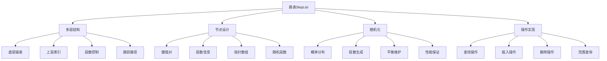

# 跳表SkipList

## 📖 核心概念

**跳表（Skip List）**是一种概率性的数据结构，通过多层链表结构实现快速的查找、插入和删除操作。它结合了链表的简单性和平衡树的性能，在Redis、LevelDB等系统中广泛应用。跳表的核心思想是通过随机化来维持平衡，避免了复杂的旋转操作。

### 🏗️ 跳表的组成要素



## 🔍 跳表特性

### 基本特性

| 特性 | 描述 | 优势 | 实现方式 |
|------|------|------|----------|
| **多层结构** | 多个有序链表层叠 | 快速跳跃查找 | 指针数组 |
| **随机化** | 节点层数随机生成 | 避免复杂平衡 | 概率算法 |
| **有序性** | 每层都是有序的 | 支持范围查询 | 插入时维护 |
| **动态性** | 支持动态插入删除 | 适应数据变化 | 实时调整 |

### 复杂度分析

| 操作 | 时间复杂度 | 空间复杂度 | 概率保证 | 适用场景 |
|------|------------|------------|----------|----------|
| **查找** | O(log n) | O(n) | 高概率 | 所有场景 |
| **插入** | O(log n) | O(n) | 高概率 | 动态数据 |
| **删除** | O(log n) | O(n) | 高概率 | 动态数据 |
| **范围查询** | O(log n + k) | O(k) | 高概率 | 区间操作 |

## 💻 跳表实现

### 跳表节点结构

```cpp
// 跳表节点结构
template<typename T>
struct SkipListNode {
    T key;
    T value;
    int level;
    vector<SkipListNode<T>*> forward;  // 指向各层下一个节点的指针数组
    
    SkipListNode(const T& k, const T& v, int l) 
        : key(k), value(v), level(l) {
        forward.resize(l + 1, nullptr);
    }
    
    // 检查节点是否有效
    bool isValid() {
        return level >= 0 && level < forward.size();
    }
    
    // 获取指定层的下一个节点
    SkipListNode<T>* getNext(int layer) {
        if (layer < 0 || layer > level) {
            return nullptr;
        }
        return forward[layer];
    }
    
    // 设置指定层的下一个节点
    void setNext(int layer, SkipListNode<T>* node) {
        if (layer >= 0 && layer <= level) {
            forward[layer] = node;
        }
    }
};
```

### 跳表类定义

```cpp
template<typename T>
class SkipList {
private:
    SkipListNode<T>* header;  // 头节点
    SkipListNode<T>* tail;    // 尾节点
    int maxLevel;             // 最大层数
    int currentLevel;         // 当前层数
    int size;                 // 节点数量
    double probability;       // 节点升级概率
    
    // 随机数生成器
    random_device rd;
    mt19937 gen;
    uniform_real_distribution<double> dis;
    
public:
    SkipList(int maxL = 16, double prob = 0.5) 
        : maxLevel(maxL), currentLevel(0), size(0), probability(prob),
          gen(rd()), dis(0.0, 1.0) {
        initialize();
    }
    
    ~SkipList() {
        clear();
    }
    
    // 初始化跳表
    void initialize() {
        // 创建头节点和尾节点
        header = new SkipListNode<T>(T{}, T{}, maxLevel);
        tail = new SkipListNode<T>(T{}, T{}, maxLevel);
        
        // 初始化头节点的forward指针
        for (int i = 0; i <= maxLevel; i++) {
            header->setNext(i, tail);
        }
        
        // 初始化尾节点的forward指针
        for (int i = 0; i <= maxLevel; i++) {
            tail->setNext(i, nullptr);
        }
    }
    
    // 清空跳表
    void clear() {
        SkipListNode<T>* current = header->getNext(0);
        
        while (current != tail) {
            SkipListNode<T>* next = current->getNext(0);
            delete current;
            current = next;
        }
        
        delete header;
        delete tail;
        
        size = 0;
        currentLevel = 0;
    }
    
    // 生成随机层数
    int generateRandomLevel() {
        int level = 0;
        while (dis(gen) < probability && level < maxLevel) {
            level++;
        }
        return level;
    }
    
    // 查找节点
    SkipListNode<T>* search(const T& key) {
        SkipListNode<T>* current = header;
        
        // 从最高层开始搜索
        for (int i = currentLevel; i >= 0; i--) {
            while (current->getNext(i) != tail && 
                   current->getNext(i)->key < key) {
                current = current->getNext(i);
            }
        }
        
        // 移动到下一层继续搜索
        current = current->getNext(0);
        
        if (current != tail && current->key == key) {
            return current;
        }
        
        return nullptr;
    }
    
    // 查找值
    pair<T, bool> find(const T& key) {
        SkipListNode<T>* node = search(key);
        if (node != nullptr) {
            return {node->value, true};
        }
        return {T{}, false};
    }
    
    // 插入节点
    bool insert(const T& key, const T& value) {
        // 查找插入位置
        vector<SkipListNode<T>*> update(maxLevel + 1);
        SkipListNode<T>* current = header;
        
        // 从最高层开始搜索
        for (int i = currentLevel; i >= 0; i--) {
            while (current->getNext(i) != tail && 
                   current->getNext(i)->key < key) {
                current = current->getNext(i);
            }
            update[i] = current;
        }
        
        // 移动到下一层
        current = current->getNext(0);
        
        // 如果键已存在，更新值
        if (current != tail && current->key == key) {
            current->value = value;
            return false;  // 表示更新而非插入
        }
        
        // 生成新节点的层数
        int newLevel = generateRandomLevel();
        
        // 如果新层数超过当前层数，更新update数组
        if (newLevel > currentLevel) {
            for (int i = currentLevel + 1; i <= newLevel; i++) {
                update[i] = header;
            }
            currentLevel = newLevel;
        }
        
        // 创建新节点
        SkipListNode<T>* newNode = new SkipListNode<T>(key, value, newLevel);
        
        // 更新指针
        for (int i = 0; i <= newLevel; i++) {
            newNode->setNext(i, update[i]->getNext(i));
            update[i]->setNext(i, newNode);
        }
        
        size++;
        return true;  // 表示插入成功
    }
    
    // 删除节点
    bool remove(const T& key) {
        // 查找删除位置
        vector<SkipListNode<T>*> update(maxLevel + 1);
        SkipListNode<T>* current = header;
        
        // 从最高层开始搜索
        for (int i = currentLevel; i >= 0; i--) {
            while (current->getNext(i) != tail && 
                   current->getNext(i)->key < key) {
                current = current->getNext(i);
            }
            update[i] = current;
        }
        
        // 移动到下一层
        current = current->getNext(0);
        
        // 如果键不存在
        if (current == tail || current->key != key) {
            return false;
        }
        
        // 更新指针
        for (int i = 0; i <= currentLevel; i++) {
            if (update[i]->getNext(i) != current) {
                break;
            }
            update[i]->setNext(i, current->getNext(i));
        }
        
        // 删除节点
        delete current;
        
        // 更新当前层数
        while (currentLevel > 0 && header->getNext(currentLevel) == tail) {
            currentLevel--;
        }
        
        size--;
        return true;
    }
    
    // 范围查询
    vector<pair<T, T>> rangeQuery(const T& startKey, const T& endKey) {
        vector<pair<T, T>> result;
        
        // 找到起始位置
        SkipListNode<T>* current = header;
        for (int i = currentLevel; i >= 0; i--) {
            while (current->getNext(i) != tail && 
                   current->getNext(i)->key < startKey) {
                current = current->getNext(i);
            }
        }
        
        // 移动到下一层
        current = current->getNext(0);
        
        // 收集范围内的键值对
        while (current != tail && current->key <= endKey) {
            result.push_back({current->key, current->value});
            current = current->getNext(0);
        }
        
        return result;
    }
    
    // 获取第一个节点
    SkipListNode<T>* getFirst() {
        SkipListNode<T>* first = header->getNext(0);
        return (first != tail) ? first : nullptr;
    }
    
    // 获取最后一个节点
    SkipListNode<T>* getLast() {
        SkipListNode<T>* current = header;
        
        for (int i = currentLevel; i >= 0; i--) {
            while (current->getNext(i) != tail) {
                current = current->getNext(i);
            }
        }
        
        return (current != header) ? current : nullptr;
    }
    
    // 获取前一个节点
    SkipListNode<T>* getPrevious(const T& key) {
        SkipListNode<T>* current = header;
        
        for (int i = currentLevel; i >= 0; i--) {
            while (current->getNext(i) != tail && 
                   current->getNext(i)->key < key) {
                current = current->getNext(i);
            }
        }
        
        return (current != header) ? current : nullptr;
    }
    
    // 获取后一个节点
    SkipListNode<T>* getNext(const T& key) {
        SkipListNode<T>* current = header;
        
        for (int i = currentLevel; i >= 0; i--) {
            while (current->getNext(i) != tail && 
                   current->getNext(i)->key <= key) {
                current = current->getNext(i);
            }
        }
        
        current = current->getNext(0);
        return (current != tail) ? current : nullptr;
    }
    
    // 检查是否包含键
    bool contains(const T& key) {
        return search(key) != nullptr;
    }
    
    // 获取跳表大小
    int getSize() const {
        return size;
    }
    
    // 检查跳表是否为空
    bool isEmpty() const {
        return size == 0;
    }
    
    // 获取当前层数
    int getCurrentLevel() const {
        return currentLevel;
    }
    
    // 获取最大层数
    int getMaxLevel() const {
        return maxLevel;
    }
    
    // 中序遍历
    void inorderTraversal() {
        cout << "SkipList Inorder Traversal: ";
        SkipListNode<T>* current = header->getNext(0);
        
        while (current != tail) {
            cout << "(" << current->key << ", " << current->value << ") ";
            current = current->getNext(0);
        }
        cout << endl;
    }
    
    // 打印跳表结构
    void printStructure() {
        cout << "SkipList Structure:" << endl;
        
        for (int i = currentLevel; i >= 0; i--) {
            cout << "Level " << i << ": ";
            SkipListNode<T>* current = header;
            
            while (current != tail) {
                if (current == header) {
                    cout << "H -> ";
                } else {
                    cout << current->key << " -> ";
                }
                current = current->getNext(i);
            }
            cout << "T" << endl;
        }
    }
    
    // 验证跳表结构
    bool validate() {
        // 检查每层的有序性
        for (int i = 0; i <= currentLevel; i++) {
            SkipListNode<T>* current = header->getNext(i);
            SkipListNode<T>* prev = header;
            
            while (current != tail) {
                if (current->key <= prev->key) {
                    cout << "Validation failed: Keys not in order at level " << i << endl;
                    return false;
                }
                prev = current;
                current = current->getNext(i);
            }
        }
        
        // 检查节点层数
        SkipListNode<T>* current = header->getNext(0);
        while (current != tail) {
            if (current->level < 0 || current->level > maxLevel) {
                cout << "Validation failed: Invalid level for node " << current->key << endl;
                return false;
            }
            current = current->getNext(0);
        }
        
        return true;
    }
    
    // 获取统计信息
    struct SkipListStatistics {
        int totalNodes;
        int totalLevels;
        int maxLevelUsed;
        double averageLevel;
        double levelDistribution[maxLevel + 1];
    };
    
    SkipListStatistics getStatistics() {
        SkipListStatistics stats;
        stats.totalNodes = size;
        stats.totalLevels = currentLevel + 1;
        stats.maxLevelUsed = currentLevel;
        stats.averageLevel = 0;
        
        // 初始化层数分布
        for (int i = 0; i <= maxLevel; i++) {
            stats.levelDistribution[i] = 0;
        }
        
        // 统计层数分布
        SkipListNode<T>* current = header->getNext(0);
        int totalLevelSum = 0;
        
        while (current != tail) {
            stats.levelDistribution[current->level]++;
            totalLevelSum += current->level;
            current = current->getNext(0);
        }
        
        if (size > 0) {
            stats.averageLevel = (double)totalLevelSum / size;
            
            // 计算层数分布百分比
            for (int i = 0; i <= maxLevel; i++) {
                stats.levelDistribution[i] = stats.levelDistribution[i] / size * 100;
            }
        }
        
        return stats;
    }
};
```

## 🎯 跳表应用

### 实际应用场景

```cpp
// 跳表在缓存系统中的应用
class SkipListCache {
private:
    SkipList<string> cache;
    int maxSize;
    int currentSize;
    
public:
    SkipListCache(int size) : maxSize(size), currentSize(0) {}
    
    // 添加缓存项
    void put(const string& key, const string& value) {
        if (cache.contains(key)) {
            cache.insert(key, value);
        } else {
            if (currentSize >= maxSize) {
                // 删除最旧的项
                auto first = cache.getFirst();
                if (first != nullptr) {
                    cache.remove(first->key);
                    currentSize--;
                }
            }
            
            cache.insert(key, value);
            currentSize++;
        }
    }
    
    // 获取缓存项
    string get(const string& key) {
        auto result = cache.find(key);
        if (result.second) {
            return result.first;
        }
        return "";
    }
    
    // 删除缓存项
    void remove(const string& key) {
        if (cache.remove(key)) {
            currentSize--;
        }
    }
    
    // 获取所有键
    vector<string> getAllKeys() {
        vector<string> keys;
        auto first = cache.getFirst();
        
        while (first != nullptr) {
            keys.push_back(first->key);
            first = cache.getNext(first->key);
        }
        
        return keys;
    }
    
    // 范围查询
    vector<string> rangeQuery(const string& startKey, const string& endKey) {
        vector<string> result;
        auto pairs = cache.rangeQuery(startKey, endKey);
        
        for (const auto& pair : pairs) {
            result.push_back(pair.first);
        }
        
        return result;
    }
};
```

### 性能测试

```cpp
// 跳表性能测试
class SkipListPerformanceTest {
public:
    static void testInsertion(int count) {
        SkipList<int> skipList;
        auto start = chrono::high_resolution_clock::now();
        
        for (int i = 0; i < count; i++) {
            skipList.insert(i, i * 2);
        }
        
        auto end = chrono::high_resolution_clock::now();
        auto duration = chrono::duration_cast<chrono::microseconds>(end - start);
        
        cout << "Insertion of " << count << " elements took: " 
             << duration.count() << " microseconds" << endl;
        
        // 验证跳表结构
        if (skipList.validate()) {
            cout << "SkipList validation passed" << endl;
        } else {
            cout << "SkipList validation failed" << endl;
        }
        
        auto stats = skipList.getStatistics();
        cout << "Total nodes: " << stats.totalNodes << endl;
        cout << "Max level used: " << stats.maxLevelUsed << endl;
        cout << "Average level: " << stats.averageLevel << endl;
    }
    
    static void testSearch(int count) {
        SkipList<int> skipList;
        
        // 插入数据
        for (int i = 0; i < count; i++) {
            skipList.insert(i, i * 2);
        }
        
        auto start = chrono::high_resolution_clock::now();
        
        // 搜索测试
        for (int i = 0; i < count; i++) {
            skipList.find(i);
        }
        
        auto end = chrono::high_resolution_clock::now();
        auto duration = chrono::duration_cast<chrono::microseconds>(end - start);
        
        cout << "Search of " << count << " elements took: " 
             << duration.count() << " microseconds" << endl;
    }
    
    static void testDeletion(int count) {
        SkipList<int> skipList;
        
        // 插入数据
        for (int i = 0; i < count; i++) {
            skipList.insert(i, i * 2);
        }
        
        auto start = chrono::high_resolution_clock::now();
        
        // 删除测试
        for (int i = 0; i < count; i++) {
            skipList.remove(i);
        }
        
        auto end = chrono::high_resolution_clock::now();
        auto duration = chrono::duration_cast<chrono::microseconds>(end - start);
        
        cout << "Deletion of " << count << " elements took: " 
             << duration.count() << " microseconds" << endl;
    }
    
    static void testRangeQuery(int count) {
        SkipList<int> skipList;
        
        // 插入数据
        for (int i = 0; i < count; i++) {
            skipList.insert(i, i * 2);
        }
        
        auto start = chrono::high_resolution_clock::now();
        
        // 范围查询测试
        for (int i = 0; i < count - 100; i++) {
            skipList.rangeQuery(i, i + 100);
        }
        
        auto end = chrono::high_resolution_clock::now();
        auto duration = chrono::duration_cast<chrono::microseconds>(end - start);
        
        cout << "Range query of " << count - 100 << " ranges took: " 
             << duration.count() << " microseconds" << endl;
    }
};
```

## ⚡ 复杂度分析

### 跳表复杂度

| 操作 | 时间复杂度 | 空间复杂度 | 概率保证 | 适用场景 |
|------|------------|------------|----------|----------|
| **查找** | O(log n) | O(n) | 高概率 | 所有场景 |
| **插入** | O(log n) | O(n) | 高概率 | 动态数据 |
| **删除** | O(log n) | O(n) | 高概率 | 动态数据 |
| **范围查询** | O(log n + k) | O(k) | 高概率 | 区间操作 |

### 与其他数据结构比较

| 数据结构 | 查找 | 插入 | 删除 | 范围查询 | 实现复杂度 |
|----------|------|------|------|----------|------------|
| **跳表** | O(log n) | O(log n) | O(log n) | O(log n + k) | 简单 |
| **红黑树** | O(log n) | O(log n) | O(log n) | O(log n + k) | 复杂 |
| **AVL树** | O(log n) | O(log n) | O(log n) | O(log n + k) | 复杂 |
| **B+树** | O(log n) | O(log n) | O(log n) | O(log n + k) | 中等 |

## 🎓 学习要点总结

### 核心理解

1. **概率平衡**：理解跳表的概率平衡机制
2. **多层结构**：掌握跳表的多层链表结构
3. **随机化**：理解随机化在跳表中的作用
4. **性能保证**：掌握跳表的性能保证机制

### 实践要点

1. **节点设计**：正确设计跳表节点结构
2. **层数生成**：准确实现随机层数生成
3. **指针维护**：正确处理多层指针
4. **结构验证**：验证跳表结构的正确性

### 应用思维

1. **性能权衡**：理解跳表的性能特点
2. **适用场景**：选择合适的应用场景
3. **优化策略**：掌握性能优化方法
4. **实际应用**：将跳表应用到实际问题中

---

**相关链接：**
- [[05-高级结构/03-特殊结构/02-布隆过滤器|布隆过滤器]] - 概率数据结构
- [[05-高级结构/02-平衡树族/02-红黑树详解|红黑树详解]] - 平衡树对比
- [[03-层次宇宙/02-二叉树王国/02-二叉搜索树|二叉搜索树]] - 搜索树基础
- [[06-应用实战/03-缓存系统/01-缓存策略|缓存策略]] - 缓存系统应用
