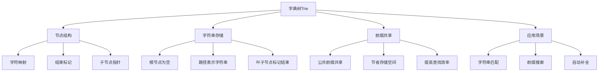

# 字典树Trie

## 📖 核心概念

**字典树（Trie）**是一种树形数据结构，用于高效存储和检索字符串集合。它通过共享前缀来节省空间，支持快速的前缀匹配和字符串查找。

### 🏗️ 字典树结构



## 🔧 字典树实现

### 基础字典树

```cpp
class Trie {
private:
    struct TrieNode {
        unordered_map<char, TrieNode*> children;
        bool isEndOfWord;
        int count;
        
        TrieNode() : isEndOfWord(false), count(0) {}
        
        ~TrieNode() {
            for (auto& pair : children) {
                delete pair.second;
            }
        }
    };
    
    TrieNode* root;
    
public:
    Trie() {
        root = new TrieNode();
    }
    
    ~Trie() {
        delete root;
    }
    
    // 插入字符串
    void insert(const string& word) {
        TrieNode* current = root;
        
        for (char c : word) {
            if (current->children.find(c) == current->children.end()) {
                current->children[c] = new TrieNode();
            }
            current = current->children[c];
            current->count++;
        }
        
        current->isEndOfWord = true;
    }
    
    // 查找字符串
    bool search(const string& word) {
        TrieNode* current = root;
        
        for (char c : word) {
            if (current->children.find(c) == current->children.end()) {
                return false;
            }
            current = current->children[c];
        }
        
        return current->isEndOfWord;
    }
    
    // 查找前缀
    bool startsWith(const string& prefix) {
        TrieNode* current = root;
        
        for (char c : prefix) {
            if (current->children.find(c) == current->children.end()) {
                return false;
            }
            current = current->children[c];
        }
        
        return true;
    }
    
    // 删除字符串
    bool remove(const string& word) {
        TrieNode* current = root;
        vector<TrieNode*> path;
        
        // 找到字符串路径
        for (char c : word) {
            if (current->children.find(c) == current->children.end()) {
                return false;
            }
            path.push_back(current);
            current = current->children[c];
        }
        
        if (!current->isEndOfWord) {
            return false;
        }
        
        // 标记为非结束节点
        current->isEndOfWord = false;
        
        // 更新计数并删除无用节点
        for (int i = path.size() - 1; i >= 0; i--) {
            path[i]->count--;
            if (path[i]->count == 0) {
                delete path[i];
                if (i > 0) {
                    path[i-1]->children.erase(word[i-1]);
                }
            }
        }
        
        return true;
    }
    
    // 获取所有以指定前缀开头的字符串
    vector<string> getWordsWithPrefix(const string& prefix) {
        vector<string> result;
        TrieNode* current = root;
        
        // 找到前缀节点
        for (char c : prefix) {
            if (current->children.find(c) == current->children.end()) {
                return result;
            }
            current = current->children[c];
        }
        
        // 从前缀节点开始DFS
        string currentWord = prefix;
        dfs(current, currentWord, result);
        
        return result;
    }
    
    // DFS辅助函数
    void dfs(TrieNode* node, string& currentWord, vector<string>& result) {
        if (node->isEndOfWord) {
            result.push_back(currentWord);
        }
        
        for (auto& pair : node->children) {
            currentWord.push_back(pair.first);
            dfs(pair.second, currentWord, result);
            currentWord.pop_back();
        }
    }
    
    // 显示字典树结构
    void display() {
        cout << "Trie Structure:" << endl;
        cout << "==============" << endl;
        
        string currentWord = "";
        displayHelper(root, currentWord, 0);
    }
    
    // 显示辅助函数
    void displayHelper(TrieNode* node, string& currentWord, int level) {
        if (node->isEndOfWord) {
            for (int i = 0; i < level; i++) {
                cout << "  ";
            }
            cout << currentWord << " (end)" << endl;
        }
        
        for (auto& pair : node->children) {
            currentWord.push_back(pair.first);
            displayHelper(pair.second, currentWord, level + 1);
            currentWord.pop_back();
        }
    }
    
    // 显示统计信息
    void displayStats() {
        cout << "Trie Statistics:" << endl;
        cout << "==============" << endl;
        
        int totalNodes = countNodes(root);
        int totalWords = countWords(root);
        
        cout << "Total nodes: " << totalNodes << endl;
        cout << "Total words: " << totalWords << endl;
        cout << "Average nodes per word: " << (totalWords > 0 ? (double)totalNodes / totalWords : 0) << endl;
    }
    
    // 计算节点数
    int countNodes(TrieNode* node) {
        int count = 1;
        for (auto& pair : node->children) {
            count += countNodes(pair.second);
        }
        return count;
    }
    
    // 计算单词数
    int countWords(TrieNode* node) {
        int count = node->isEndOfWord ? 1 : 0;
        for (auto& pair : node->children) {
            count += countWords(pair.second);
        }
        return count;
    }
};
```

### 压缩字典树

```cpp
class CompressedTrie {
private:
    struct CompressedTrieNode {
        string label;
        unordered_map<char, CompressedTrieNode*> children;
        bool isEndOfWord;
        int count;
        
        CompressedTrieNode(const string& l = "") : label(l), isEndOfWord(false), count(0) {}
        
        ~CompressedTrieNode() {
            for (auto& pair : children) {
                delete pair.second;
            }
        }
    };
    
    CompressedTrieNode* root;
    
    // 压缩节点
    void compressNode(CompressedTrieNode* node) {
        if (node->children.size() == 1) {
            auto it = node->children.begin();
            char c = it->first;
            CompressedTrieNode* child = it->second;
            
            node->label += c + child->label;
            node->children = child->children;
            node->isEndOfWord = child->isEndOfWord;
            node->count = child->count;
            
            child->children.clear();
            delete child;
        }
    }
    
public:
    CompressedTrie() {
        root = new CompressedTrieNode();
    }
    
    ~CompressedTrie() {
        delete root;
    }
    
    // 插入字符串
    void insert(const string& word) {
        insertHelper(root, word, 0);
    }
    
    // 插入辅助函数
    void insertHelper(CompressedTrieNode* node, const string& word, int index) {
        if (index == word.length()) {
            node->isEndOfWord = true;
            node->count++;
            return;
        }
        
        char c = word[index];
        
        if (node->children.find(c) == node->children.end()) {
            node->children[c] = new CompressedTrieNode();
        }
        
        CompressedTrieNode* child = node->children[c];
        
        // 检查标签匹配
        int matchLength = 0;
        while (matchLength < child->label.length() && 
               index + matchLength < word.length() && 
               child->label[matchLength] == word[index + matchLength]) {
            matchLength++;
        }
        
        if (matchLength == child->label.length()) {
            // 完全匹配，继续插入
            insertHelper(child, word, index + matchLength);
        } else if (matchLength > 0) {
            // 部分匹配，需要分裂
            string remainingLabel = child->label.substr(matchLength);
            string newLabel = child->label.substr(0, matchLength);
            
            CompressedTrieNode* newNode = new CompressedTrieNode(remainingLabel);
            newNode->children = child->children;
            newNode->isEndOfWord = child->isEndOfWord;
            newNode->count = child->count;
            
            child->label = newLabel;
            child->children.clear();
            child->children[remainingLabel[0]] = newNode;
            child->isEndOfWord = false;
            child->count = 0;
            
            insertHelper(child, word, index + matchLength);
        } else {
            // 无匹配，直接插入
            insertHelper(child, word, index);
        }
        
        compressNode(node);
    }
    
    // 查找字符串
    bool search(const string& word) {
        return searchHelper(root, word, 0);
    }
    
    // 查找辅助函数
    bool searchHelper(CompressedTrieNode* node, const string& word, int index) {
        if (index == word.length()) {
            return node->isEndOfWord;
        }
        
        char c = word[index];
        
        if (node->children.find(c) == node->children.end()) {
            return false;
        }
        
        CompressedTrieNode* child = node->children[c];
        
        // 检查标签匹配
        int matchLength = 0;
        while (matchLength < child->label.length() && 
               index + matchLength < word.length() && 
               child->label[matchLength] == word[index + matchLength]) {
            matchLength++;
        }
        
        if (matchLength == child->label.length()) {
            return searchHelper(child, word, index + matchLength);
        } else if (matchLength > 0) {
            return false;
        } else {
            return searchHelper(child, word, index);
        }
    }
    
    // 显示压缩字典树结构
    void display() {
        cout << "Compressed Trie Structure:" << endl;
        cout << "========================" << endl;
        
        displayHelper(root, 0);
    }
    
    // 显示辅助函数
    void displayHelper(CompressedTrieNode* node, int level) {
        for (int i = 0; i < level; i++) {
            cout << "  ";
        }
        
        cout << node->label;
        if (node->isEndOfWord) {
            cout << " (end)";
        }
        cout << endl;
        
        for (auto& pair : node->children) {
            displayHelper(pair.second, level + 1);
        }
    }
    
    // 显示统计信息
    void displayStats() {
        cout << "Compressed Trie Statistics:" << endl;
        cout << "=========================" << endl;
        
        int totalNodes = countNodes(root);
        int totalWords = countWords(root);
        
        cout << "Total nodes: " << totalNodes << endl;
        cout << "Total words: " << totalWords << endl;
        cout << "Average nodes per word: " << (totalWords > 0 ? (double)totalNodes / totalWords : 0) << endl;
    }
    
    // 计算节点数
    int countNodes(CompressedTrieNode* node) {
        int count = 1;
        for (auto& pair : node->children) {
            count += countNodes(pair.second);
        }
        return count;
    }
    
    // 计算单词数
    int countWords(CompressedTrieNode* node) {
        int count = node->isEndOfWord ? 1 : 0;
        for (auto& pair : node->children) {
            count += countWords(pair.second);
        }
        return count;
    }
};
```

### 字典树工具类

```cpp
class TrieUtils {
public:
    // 性能测试
    static void performanceTest(Trie& trie, vector<string>& words) {
        cout << "Trie Performance Test:" << endl;
        cout << "====================" << endl;
        
        // 插入测试
        auto start = chrono::high_resolution_clock::now();
        for (const string& word : words) {
            trie.insert(word);
        }
        auto end = chrono::high_resolution_clock::now();
        auto insertTime = chrono::duration_cast<chrono::microseconds>(end - start);
        
        // 查找测试
        start = chrono::high_resolution_clock::now();
        for (const string& word : words) {
            trie.search(word);
        }
        end = chrono::high_resolution_clock::now();
        auto searchTime = chrono::duration_cast<chrono::microseconds>(end - start);
        
        // 前缀查找测试
        start = chrono::high_resolution_clock::now();
        for (const string& word : words) {
            trie.startsWith(word.substr(0, min(3, (int)word.length())));
        }
        end = chrono::high_resolution_clock::now();
        auto prefixTime = chrono::duration_cast<chrono::microseconds>(end - start);
        
        cout << "Insert time: " << insertTime.count() << " microseconds" << endl;
        cout << "Search time: " << searchTime.count() << " microseconds" << endl;
        cout << "Prefix time: " << prefixTime.count() << " microseconds" << endl;
        cout << "Average insert time: " << (double)insertTime.count() / words.size() << " microseconds" << endl;
        cout << "Average search time: " << (double)searchTime.count() / words.size() << " microseconds" << endl;
        cout << "Average prefix time: " << (double)prefixTime.count() / words.size() << " microseconds" << endl;
    }
    
    // 内存使用分析
    static void memoryAnalysis(Trie& trie) {
        cout << "Trie Memory Analysis:" << endl;
        cout << "===================" << endl;
        
        int totalNodes = trie.countNodes(trie.root);
        int totalWords = trie.countWords(trie.root);
        
        cout << "Total nodes: " << totalNodes << endl;
        cout << "Total words: " << totalWords << endl;
        cout << "Average nodes per word: " << (totalWords > 0 ? (double)totalNodes / totalWords : 0) << endl;
        cout << "Memory per node: " << sizeof(Trie::TrieNode) << " bytes" << endl;
        cout << "Total memory: " << totalNodes * sizeof(Trie::TrieNode) << " bytes" << endl;
    }
    
    // 前缀分析
    static void prefixAnalysis(Trie& trie, const string& prefix) {
        cout << "Trie Prefix Analysis:" << endl;
        cout << "===================" << endl;
        
        cout << "Prefix: " << prefix << endl;
        
        vector<string> words = trie.getWordsWithPrefix(prefix);
        cout << "Words with prefix: " << words.size() << endl;
        
        for (const string& word : words) {
            cout << "  " << word << endl;
        }
    }
    
    // 显示字典树可视化
    static void visualizeTrie(Trie& trie) {
        cout << "Trie Visualization:" << endl;
        cout << "=================" << endl;
        
        trie.display();
        trie.displayStats();
    }
    
    // 比较不同实现
    static void compareImplementations() {
        cout << "Trie Implementation Comparison:" << endl;
        cout << "=============================" << endl;
        
        cout << "1. Basic Trie:" << endl;
        cout << "   - Simple implementation" << endl;
        cout << "   - Easy to understand" << endl;
        cout << "   - Higher memory usage" << endl;
        cout << endl;
        
        cout << "2. Compressed Trie:" << endl;
        cout << "   - Reduced memory usage" << endl;
        cout << "   - More complex implementation" << endl;
        cout << "   - Better for large datasets" << endl;
        cout << endl;
        
        cout << "3. Ternary Search Tree:" << endl;
        cout << "   - Balanced approach" << endl;
        cout << "   - Good for sparse data" << endl;
        cout << "   - Moderate complexity" << endl;
    }
};
```

## 🎯 字典树应用

### 实际应用场景

```cpp
class TrieApplications {
public:
    static void demonstrateApplications() {
        cout << "Trie Applications:" << endl;
        cout << "===============" << endl;
        
        cout << "1. 字符串匹配:" << endl;
        cout << "   - 快速查找字符串" << endl;
        cout << "   - 前缀匹配" << endl;
        cout << "   - 模式匹配" << endl;
        
        cout << "2. 自动补全:" << endl;
        cout << "   - 搜索引擎建议" << endl;
        cout << "   - IDE代码补全" << endl;
        cout << "   - 输入法提示" << endl;
        
        cout << "3. 拼写检查:" << endl;
        cout << "   - 单词纠错" << endl;
        cout << "   - 建议修正" << endl;
        cout << "   - 字典验证" << endl;
        
        cout << "4. 路由表:" << endl;
        cout << "   - IP路由查找" << endl;
        cout << "   - 最长前缀匹配" << endl;
        cout << "   - 网络包转发" << endl;
    }
    
    static void analyzePerformance() {
        cout << "Trie Performance Analysis:" << endl;
        cout << "========================" << endl;
        
        cout << "1. 时间复杂度:" << endl;
        cout << "   - 插入: O(m)" << endl;
        cout << "   - 查找: O(m)" << endl;
        cout << "   - 前缀查找: O(m)" << endl;
        cout << "   - m是字符串长度" << endl;
        
        cout << "2. 空间复杂度:" << endl;
        cout << "   - 最坏: O(ALPHABET_SIZE * N * M)" << endl;
        cout << "   - 平均: O(N * M)" << endl;
        cout << "   - N是字符串数量，M是平均长度" << endl;
        
        cout << "3. 优势:" << endl;
        cout << "   - 前缀共享节省空间" << endl;
        cout << "   - 快速前缀匹配" << endl;
        cout << "   - 支持范围查询" << endl;
    }
    
    static void selectTrie(bool needsCompression, bool needsRangeQueries, bool needsMemoryEfficiency) {
        cout << "Trie Selection:" << endl;
        cout << "=============" << endl;
        
        cout << "Needs compression: " << (needsCompression ? "Yes" : "No") << endl;
        cout << "Needs range queries: " << (needsRangeQueries ? "Yes" : "No") << endl;
        cout << "Needs memory efficiency: " << (needsMemoryEfficiency ? "Yes" : "No") << endl;
        
        cout << "Recommendation:" << endl;
        
        if (needsCompression) {
            cout << "Use Compressed Trie" << endl;
        } else if (needsRangeQueries) {
            cout << "Use Basic Trie with range query support" << endl;
        } else if (needsMemoryEfficiency) {
            cout << "Use Compressed Trie" << endl;
        } else {
            cout << "Use Basic Trie" << endl;
        }
    }
};
```

## 📊 字典树分析

### 性能分析

```cpp
class TrieAnalysis {
public:
    static void analyzePerformance() {
        cout << "Trie Performance Analysis:" << endl;
        cout << "========================" << endl;
        
        cout << "1. 时间复杂度:" << endl;
        cout << "   - 插入: O(m)" << endl;
        cout << "   - 查找: O(m)" << endl;
        cout << "   - 前缀查找: O(m)" << endl;
        cout << "   - 删除: O(m)" << endl;
        
        cout << "2. 空间复杂度:" << endl;
        cout << "   - 最坏: O(ALPHABET_SIZE * N * M)" << endl;
        cout << "   - 平均: O(N * M)" << endl;
        cout << "   - 压缩: O(N + M)" << endl;
        
        cout << "3. 优势:" << endl;
        cout << "   - 前缀共享" << endl;
        cout << "   - 快速查找" << endl;
        cout << "   - 支持范围查询" << endl;
    }
    
    static void analyzeSpaceComplexity() {
        cout << "Trie Space Complexity Analysis:" << endl;
        cout << "=============================" << endl;
        
        cout << "1. 基本字典树:" << endl;
        cout << "   - 每个节点: O(ALPHABET_SIZE)" << endl;
        cout << "   - 总空间: O(ALPHABET_SIZE * N * M)" << endl;
        cout << "   - 适合小字母表" << endl;
        
        cout << "2. 压缩字典树:" << endl;
        cout << "   - 共享前缀" << endl;
        cout << "   - 总空间: O(N + M)" << endl;
        cout << "   - 适合大字母表" << endl;
        
        cout << "3. 空间优化:" << endl;
        cout << "   - 使用哈希表" << endl;
        cout << "   - 延迟分配" << endl;
        cout << "   - 压缩存储" << endl;
    }
    
    static void analyzeTimeComplexity() {
        cout << "Trie Time Complexity Analysis:" << endl;
        cout << "============================" << endl;
        
        cout << "1. 插入操作:" << endl;
        cout << "   - 遍历字符串: O(m)" << endl;
        cout << "   - 创建节点: O(1)" << endl;
        cout << "   - 总时间: O(m)" << endl;
        
        cout << "2. 查找操作:" << endl;
        cout << "   - 遍历字符串: O(m)" << endl;
        cout << "   - 检查节点: O(1)" << endl;
        cout << "   - 总时间: O(m)" << endl;
        
        cout << "3. 前缀查找:" << endl;
        cout << "   - 遍历前缀: O(m)" << endl;
        cout << "   - DFS遍历: O(k)" << endl;
        cout << "   - 总时间: O(m + k)" << endl;
    }
};
```

## 🎮 字典树测试

### 1. 基础功能测试

```cpp
class TrieTest {
public:
    static void testBasicTrie() {
        cout << "Testing Basic Trie:" << endl;
        cout << "=================" << endl;
        
        Trie trie;
        
        // 插入测试
        trie.insert("apple");
        trie.insert("app");
        trie.insert("application");
        trie.insert("banana");
        trie.insert("band");
        
        trie.display();
        trie.displayStats();
        
        // 查找测试
        cout << "Search 'app': " << (trie.search("app") ? "Found" : "Not found") << endl;
        cout << "Search 'apps': " << (trie.search("apps") ? "Found" : "Not found") << endl;
        
        // 前缀查找测试
        cout << "Starts with 'app': " << (trie.startsWith("app") ? "Yes" : "No") << endl;
        cout << "Starts with 'ban': " << (trie.startsWith("ban") ? "Yes" : "No") << endl;
        
        // 前缀单词测试
        vector<string> words = trie.getWordsWithPrefix("app");
        cout << "Words with prefix 'app': ";
        for (const string& word : words) {
            cout << word << " ";
        }
        cout << endl;
    }
    
    static void testCompressedTrie() {
        cout << "Testing Compressed Trie:" << endl;
        cout << "======================" << endl;
        
        CompressedTrie compressedTrie;
        
        // 插入测试
        compressedTrie.insert("apple");
        compressedTrie.insert("app");
        compressedTrie.insert("application");
        compressedTrie.insert("banana");
        compressedTrie.insert("band");
        
        compressedTrie.display();
        compressedTrie.displayStats();
        
        // 查找测试
        cout << "Search 'app': " << (compressedTrie.search("app") ? "Found" : "Not found") << endl;
        cout << "Search 'apps': " << (compressedTrie.search("apps") ? "Found" : "Not found") << endl;
    }
    
    static void testUtils() {
        cout << "Testing Trie Utils:" << endl;
        cout << "=================" << endl;
        
        Trie trie;
        vector<string> words = {"apple", "app", "application", "banana", "band"};
        
        // 性能测试
        TrieUtils::performanceTest(trie, words);
        
        // 内存分析
        TrieUtils::memoryAnalysis(trie);
        
        // 前缀分析
        TrieUtils::prefixAnalysis(trie, "app");
        
        // 可视化
        TrieUtils::visualizeTrie(trie);
        
        // 实现比较
        TrieUtils::compareImplementations();
    }
    
    static void testApplications() {
        cout << "Testing Applications:" << endl;
        cout << "==================" << endl;
        
        TrieApplications::demonstrateApplications();
        TrieApplications::analyzePerformance();
        TrieApplications::selectTrie(false, true, false);
    }
    
    static void testAnalysis() {
        cout << "Testing Analysis:" << endl;
        cout << "===============" << endl;
        
        TrieAnalysis::analyzePerformance();
        TrieAnalysis::analyzeSpaceComplexity();
        TrieAnalysis::analyzeTimeComplexity();
    }
};
```

## 🔗 相关链接

- [[01-特殊结构|特殊结构]]
- [[02-跳表详解|跳表详解]]
- [[03-RMQ与ST表|RMQ与ST表]]

## 💡 字典树要点

1. **前缀共享**: 通过共享前缀节省存储空间
2. **快速查找**: O(m)时间复杂度的字符串查找
3. **前缀匹配**: 支持高效的前缀搜索
4. **应用广泛**: 适合字符串相关的应用场景

---

*📝 字典树提示：字典树是高效的字符串存储结构，通过前缀共享实现空间和时间效率的平衡*
