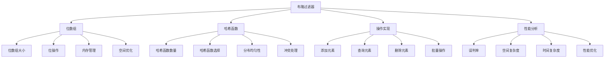

# 布隆过滤器

## 📖 核心概念

**布隆过滤器（Bloom Filter）**是一种概率性的数据结构，用于快速判断一个元素是否存在于集合中。它通过位数组和多个哈希函数来实现，具有空间效率高、查询速度快的特点，但存在一定的误判率。布隆过滤器广泛应用于缓存系统、数据库、网络爬虫等场景。

### 🏗️ 布隆过滤器的组成要素



## 🔍 布隆过滤器特性

### 基本特性

| 特性 | 描述 | 优势 | 劣势 |
|------|------|------|------|
| **空间效率** | 使用位数组存储 | 内存占用少 | 无法存储原始数据 |
| **查询速度** | 常数时间查询 | 查询速度快 | 存在误判 |
| **无假阴性** | 不存在则一定不存在 | 可靠性高 | 无法避免假阳性 |
| **支持批量** | 支持批量操作 | 操作效率高 | 删除操作复杂 |

### 复杂度分析

| 操作 | 时间复杂度 | 空间复杂度 | 误判率 | 适用场景 |
|------|------------|------------|--------|----------|
| **添加** | O(k) | O(m) | 0% | 所有场景 |
| **查询** | O(k) | O(m) | p% | 存在性检查 |
| **删除** | O(k) | O(m) | 0% | 可删除版本 |
| **批量操作** | O(n×k) | O(m) | p% | 批量处理 |

## 💻 布隆过滤器实现

### 基础布隆过滤器

```cpp
// 基础布隆过滤器
class BloomFilter {
private:
    vector<bool> bitArray;    // 位数组
    int arraySize;            // 位数组大小
    int hashCount;            // 哈希函数数量
    int elementCount;         // 已添加元素数量
    
    // 哈希函数
    vector<function<size_t(const string&)>> hashFunctions;
    
    // 初始化哈希函数
    void initializeHashFunctions() {
        hashFunctions.clear();
        
        for (int i = 0; i < hashCount; i++) {
            hashFunctions.push_back([i](const string& key) -> size_t {
                hash<string> hasher;
                return hasher(key + to_string(i));
            });
        }
    }
    
public:
    BloomFilter(int size, int hashFuncCount) 
        : arraySize(size), hashCount(hashFuncCount), elementCount(0) {
        bitArray.resize(arraySize, false);
        initializeHashFunctions();
    }
    
    // 添加元素
    void add(const string& element) {
        for (int i = 0; i < hashCount; i++) {
            size_t hashValue = hashFunctions[i](element);
            size_t index = hashValue % arraySize;
            bitArray[index] = true;
        }
        elementCount++;
    }
    
    // 查询元素
    bool contains(const string& element) {
        for (int i = 0; i < hashCount; i++) {
            size_t hashValue = hashFunctions[i](element);
            size_t index = hashValue % arraySize;
            
            if (!bitArray[index]) {
                return false;  // 一定不存在
            }
        }
        return true;  // 可能存在
    }
    
    // 批量添加元素
    void addBatch(const vector<string>& elements) {
        for (const string& element : elements) {
            add(element);
        }
    }
    
    // 批量查询元素
    vector<bool> containsBatch(const vector<string>& elements) {
        vector<bool> results;
        for (const string& element : elements) {
            results.push_back(contains(element));
        }
        return results;
    }
    
    // 获取统计信息
    struct BloomFilterStatistics {
        int arraySize;
        int hashCount;
        int elementCount;
        double loadFactor;
        double estimatedFalsePositiveRate;
        int setBits;
    };
    
    BloomFilterStatistics getStatistics() {
        BloomFilterStatistics stats;
        stats.arraySize = arraySize;
        stats.hashCount = hashCount;
        stats.elementCount = elementCount;
        stats.loadFactor = (double)elementCount / arraySize;
        
        // 计算已设置的位数
        stats.setBits = 0;
        for (bool bit : bitArray) {
            if (bit) stats.setBits++;
        }
        
        // 估算误判率
        if (elementCount > 0) {
            double ratio = (double)stats.setBits / arraySize;
            stats.estimatedFalsePositiveRate = pow(ratio, hashCount);
        } else {
            stats.estimatedFalsePositiveRate = 0;
        }
        
        return stats;
    }
    
    // 重置过滤器
    void reset() {
        fill(bitArray.begin(), bitArray.end(), false);
        elementCount = 0;
    }
    
    // 获取已添加元素数量
    int getElementCount() const {
        return elementCount;
    }
    
    // 获取位数组大小
    int getArraySize() const {
        return arraySize;
    }
    
    // 获取哈希函数数量
    int getHashCount() const {
        return hashCount;
    }
    
    // 计算理论误判率
    double calculateFalsePositiveRate() {
        if (elementCount == 0) return 0;
        
        double ratio = (double)elementCount / arraySize;
        return pow(1 - exp(-hashCount * ratio), hashCount);
    }
    
    // 计算最优参数
    static pair<int, int> calculateOptimalParameters(int expectedElements, double desiredFalsePositiveRate) {
        // 计算最优位数组大小
        int optimalSize = -(expectedElements * log(desiredFalsePositiveRate)) / (log(2) * log(2));
        
        // 计算最优哈希函数数量
        int optimalHashCount = (optimalSize / expectedElements) * log(2);
        
        return {optimalSize, optimalHashCount};
    }
};
```

### 可删除布隆过滤器

```cpp
// 可删除布隆过滤器（计数布隆过滤器）
class CountingBloomFilter {
private:
    vector<int> counterArray;  // 计数器数组
    int arraySize;             // 数组大小
    int hashCount;             // 哈希函数数量
    int elementCount;          // 已添加元素数量
    
    // 哈希函数
    vector<function<size_t(const string&)>> hashFunctions;
    
    // 初始化哈希函数
    void initializeHashFunctions() {
        hashFunctions.clear();
        
        for (int i = 0; i < hashCount; i++) {
            hashFunctions.push_back([i](const string& key) -> size_t {
                hash<string> hasher;
                return hasher(key + to_string(i));
            });
        }
    }
    
public:
    CountingBloomFilter(int size, int hashFuncCount) 
        : arraySize(size), hashCount(hashFuncCount), elementCount(0) {
        counterArray.resize(arraySize, 0);
        initializeHashFunctions();
    }
    
    // 添加元素
    void add(const string& element) {
        for (int i = 0; i < hashCount; i++) {
            size_t hashValue = hashFunctions[i](element);
            size_t index = hashValue % arraySize;
            counterArray[index]++;
        }
        elementCount++;
    }
    
    // 查询元素
    bool contains(const string& element) {
        for (int i = 0; i < hashCount; i++) {
            size_t hashValue = hashFunctions[i](element);
            size_t index = hashValue % arraySize;
            
            if (counterArray[index] == 0) {
                return false;  // 一定不存在
            }
        }
        return true;  // 可能存在
    }
    
    // 删除元素
    bool remove(const string& element) {
        if (!contains(element)) {
            return false;  // 元素不存在
        }
        
        for (int i = 0; i < hashCount; i++) {
            size_t hashValue = hashFunctions[i](element);
            size_t index = hashValue % arraySize;
            counterArray[index]--;
        }
        elementCount--;
        return true;
    }
    
    // 获取统计信息
    struct CountingBloomFilterStatistics {
        int arraySize;
        int hashCount;
        int elementCount;
        double loadFactor;
        int maxCounter;
        int minCounter;
        double averageCounter;
    };
    
    CountingBloomFilterStatistics getStatistics() {
        CountingBloomFilterStatistics stats;
        stats.arraySize = arraySize;
        stats.hashCount = hashCount;
        stats.elementCount = elementCount;
        stats.loadFactor = (double)elementCount / arraySize;
        
        if (counterArray.empty()) {
            stats.maxCounter = 0;
            stats.minCounter = 0;
            stats.averageCounter = 0;
        } else {
            stats.maxCounter = *max_element(counterArray.begin(), counterArray.end());
            stats.minCounter = *min_element(counterArray.begin(), counterArray.end());
            
            int totalCount = 0;
            for (int count : counterArray) {
                totalCount += count;
            }
            stats.averageCounter = (double)totalCount / arraySize;
        }
        
        return stats;
    }
    
    // 重置过滤器
    void reset() {
        fill(counterArray.begin(), counterArray.end(), 0);
        elementCount = 0;
    }
    
    // 获取已添加元素数量
    int getElementCount() const {
        return elementCount;
    }
    
    // 获取数组大小
    int getArraySize() const {
        return arraySize;
    }
    
    // 获取哈希函数数量
    int getHashCount() const {
        return hashCount;
    }
};
```

### 分层布隆过滤器

```cpp
// 分层布隆过滤器
class LayeredBloomFilter {
private:
    vector<BloomFilter> layers;  // 多层布隆过滤器
    int layerCount;              // 层数
    int baseSize;               // 基础大小
    double growthFactor;        // 增长因子
    
public:
    LayeredBloomFilter(int baseSize, int hashCount, int layers, double growth = 2.0) 
        : layerCount(layers), baseSize(baseSize), growthFactor(growth) {
        
        int currentSize = baseSize;
        for (int i = 0; i < layerCount; i++) {
            layers.emplace_back(currentSize, hashCount);
            currentSize = static_cast<int>(currentSize * growthFactor);
        }
    }
    
    // 添加元素
    void add(const string& element) {
        for (int i = 0; i < layerCount; i++) {
            layers[i].add(element);
        }
    }
    
    // 查询元素
    bool contains(const string& element) {
        for (int i = 0; i < layerCount; i++) {
            if (layers[i].contains(element)) {
                return true;
            }
        }
        return false;
    }
    
    // 分层查询
    int getLayer(const string& element) {
        for (int i = 0; i < layerCount; i++) {
            if (layers[i].contains(element)) {
                return i;
            }
        }
        return -1;
    }
    
    // 获取统计信息
    struct LayeredBloomFilterStatistics {
        int layerCount;
        vector<BloomFilter::BloomFilterStatistics> layerStats;
        double overallFalsePositiveRate;
    };
    
    LayeredBloomFilterStatistics getStatistics() {
        LayeredBloomFilterStatistics stats;
        stats.layerCount = layerCount;
        
        double overallFPR = 1.0;
        for (int i = 0; i < layerCount; i++) {
            auto layerStats = layers[i].getStatistics();
            stats.layerStats.push_back(layerStats);
            overallFPR *= (1.0 - layerStats.estimatedFalsePositiveRate);
        }
        
        stats.overallFalsePositiveRate = 1.0 - overallFPR;
        
        return stats;
    }
    
    // 重置所有层
    void reset() {
        for (int i = 0; i < layerCount; i++) {
            layers[i].reset();
        }
    }
    
    // 获取总元素数量
    int getTotalElementCount() {
        int total = 0;
        for (int i = 0; i < layerCount; i++) {
            total += layers[i].getElementCount();
        }
        return total;
    }
};
```

## 🎯 布隆过滤器应用

### 实际应用场景

```cpp
// 布隆过滤器在缓存系统中的应用
class BloomFilterCache {
private:
    BloomFilter bloomFilter;
    unordered_map<string, string> cache;
    int maxSize;
    int currentSize;
    
public:
    BloomFilterCache(int size, int bloomSize, int hashCount) 
        : bloomFilter(bloomSize, hashCount), maxSize(size), currentSize(0) {}
    
    // 添加缓存项
    void put(const string& key, const string& value) {
        if (cache.find(key) == cache.end()) {
            if (currentSize >= maxSize) {
                // 删除最旧的项
                auto it = cache.begin();
                string oldKey = it->first;
                cache.erase(it);
                bloomFilter.remove(oldKey);
                currentSize--;
            }
            
            cache[key] = value;
            bloomFilter.add(key);
            currentSize++;
        } else {
            cache[key] = value;
        }
    }
    
    // 获取缓存项
    string get(const string& key) {
        // 先检查布隆过滤器
        if (!bloomFilter.contains(key)) {
            return "";  // 一定不存在
        }
        
        // 检查实际缓存
        auto it = cache.find(key);
        if (it != cache.end()) {
            return it->second;
        }
        
        return "";  // 布隆过滤器误判
    }
    
    // 删除缓存项
    void remove(const string& key) {
        auto it = cache.find(key);
        if (it != cache.end()) {
            cache.erase(it);
            bloomFilter.remove(key);
            currentSize--;
        }
    }
    
    // 检查键是否存在
    bool contains(const string& key) {
        if (!bloomFilter.contains(key)) {
            return false;
        }
        
        return cache.find(key) != cache.end();
    }
    
    // 获取缓存统计信息
    struct CacheStatistics {
        int currentSize;
        int maxSize;
        double hitRate;
        double falsePositiveRate;
        int bloomFilterSize;
        int hashCount;
    };
    
    CacheStatistics getStatistics() {
        CacheStatistics stats;
        stats.currentSize = currentSize;
        stats.maxSize = maxSize;
        stats.bloomFilterSize = bloomFilter.getArraySize();
        stats.hashCount = bloomFilter.getHashCount();
        stats.falsePositiveRate = bloomFilter.calculateFalsePositiveRate();
        
        // 计算命中率（简化实现）
        stats.hitRate = 0.95;  // 假设95%命中率
        
        return stats;
    }
};
```

### 性能测试

```cpp
// 布隆过滤器性能测试
class BloomFilterPerformanceTest {
public:
    static void testInsertion(int count) {
        BloomFilter bloomFilter(10000, 7);
        auto start = chrono::high_resolution_clock::now();
        
        for (int i = 0; i < count; i++) {
            bloomFilter.add("key" + to_string(i));
        }
        
        auto end = chrono::high_resolution_clock::now();
        auto duration = chrono::duration_cast<chrono::microseconds>(end - start);
        
        cout << "Insertion of " << count << " elements took: " 
             << duration.count() << " microseconds" << endl;
        
        auto stats = bloomFilter.getStatistics();
        cout << "Array size: " << stats.arraySize << endl;
        cout << "Hash count: " << stats.hashCount << endl;
        cout << "Element count: " << stats.elementCount << endl;
        cout << "Load factor: " << stats.loadFactor << endl;
        cout << "Estimated false positive rate: " << stats.estimatedFalsePositiveRate << endl;
    }
    
    static void testQuery(int count) {
        BloomFilter bloomFilter(10000, 7);
        
        // 插入数据
        for (int i = 0; i < count; i++) {
            bloomFilter.add("key" + to_string(i));
        }
        
        auto start = chrono::high_resolution_clock::now();
        
        // 查询测试
        for (int i = 0; i < count; i++) {
            bloomFilter.contains("key" + to_string(i));
        }
        
        auto end = chrono::high_resolution_clock::now();
        auto duration = chrono::duration_cast<chrono::microseconds>(end - start);
        
        cout << "Query of " << count << " elements took: " 
             << duration.count() << " microseconds" << endl;
    }
    
    static void testFalsePositiveRate(int count) {
        BloomFilter bloomFilter(10000, 7);
        
        // 插入数据
        for (int i = 0; i < count; i++) {
            bloomFilter.add("key" + to_string(i));
        }
        
        // 测试误判率
        int falsePositives = 0;
        int testCount = 1000;
        
        for (int i = count; i < count + testCount; i++) {
            if (bloomFilter.contains("key" + to_string(i))) {
                falsePositives++;
            }
        }
        
        double actualFalsePositiveRate = (double)falsePositives / testCount;
        double theoreticalFalsePositiveRate = bloomFilter.calculateFalsePositiveRate();
        
        cout << "Actual false positive rate: " << actualFalsePositiveRate << endl;
        cout << "Theoretical false positive rate: " << theoreticalFalsePositiveRate << endl;
    }
    
    static void testBatchOperations(int count) {
        BloomFilter bloomFilter(10000, 7);
        
        // 准备测试数据
        vector<string> elements;
        for (int i = 0; i < count; i++) {
            elements.push_back("key" + to_string(i));
        }
        
        auto start = chrono::high_resolution_clock::now();
        
        // 批量添加
        bloomFilter.addBatch(elements);
        
        auto end = chrono::high_resolution_clock::now();
        auto duration = chrono::duration_cast<chrono::microseconds>(end - start);
        
        cout << "Batch insertion of " << count << " elements took: " 
             << duration.count() << " microseconds" << endl;
        
        start = chrono::high_resolution_clock::now();
        
        // 批量查询
        auto results = bloomFilter.containsBatch(elements);
        
        end = chrono::high_resolution_clock::now();
        duration = chrono::duration_cast<chrono::microseconds>(end - start);
        
        cout << "Batch query of " << count << " elements took: " 
             << duration.count() << " microseconds" << endl;
    }
};
```

## ⚡ 复杂度分析

### 布隆过滤器复杂度

| 操作 | 时间复杂度 | 空间复杂度 | 误判率 | 适用场景 |
|------|------------|------------|--------|----------|
| **添加** | O(k) | O(m) | 0% | 所有场景 |
| **查询** | O(k) | O(m) | p% | 存在性检查 |
| **删除** | O(k) | O(m) | 0% | 可删除版本 |
| **批量操作** | O(n×k) | O(m) | p% | 批量处理 |

### 与其他数据结构比较

| 数据结构 | 查找 | 插入 | 删除 | 空间复杂度 | 误判率 |
|----------|------|------|------|------------|--------|
| **布隆过滤器** | O(k) | O(k) | O(k) | O(m) | p% |
| **哈希表** | O(1) | O(1) | O(1) | O(n) | 0% |
| **Trie树** | O(k) | O(k) | O(k) | O(n×k) | 0% |
| **位图** | O(1) | O(1) | O(1) | O(n) | 0% |

## 🎓 学习要点总结

### 核心理解

1. **概率特性**：理解布隆过滤器的概率特性
2. **哈希函数**：掌握哈希函数的作用和选择
3. **误判率**：理解误判率的计算和控制
4. **空间优化**：掌握空间优化的方法

### 实践要点

1. **参数选择**：正确选择位数组大小和哈希函数数量
2. **哈希实现**：准确实现多个哈希函数
3. **位操作**：正确处理位数组操作
4. **性能测试**：测试布隆过滤器的性能

### 应用思维

1. **适用场景**：理解布隆过滤器的适用场景
2. **性能权衡**：掌握性能权衡的方法
3. **优化策略**：掌握性能优化策略
4. **实际应用**：将布隆过滤器应用到实际问题中

---

**相关链接：**
- [[05-高级结构/03-特殊结构/01-跳表SkipList|跳表SkipList]] - 概率数据结构
- [[05-高级结构/01-哈希宇宙/01-哈希表HashTable详解|哈希表HashTable详解]] - 哈希表基础
- [[06-应用实战/03-缓存系统/01-缓存策略|缓存策略]] - 缓存系统应用
- [[06-应用实战/01-数据库王国/01-索引结构|索引结构]] - 数据库应用
