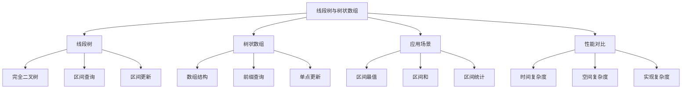

# 线段树与树状数组

## 📖 核心概念

**线段树（Segment Tree）**和**树状数组（Binary Indexed Tree/Fenwick Tree）**是两种重要的区间查询数据结构。线段树支持区间查询和更新，树状数组支持前缀查询和单点更新。

### 🏗️ 线段树与树状数组结构



## 🔧 线段树实现

### 基础线段树

```cpp
class SegmentTree {
private:
    vector<int> tree;
    vector<int> lazy;
    int n;
    
    // 构建线段树
    void build(const vector<int>& arr, int node, int start, int end) {
        if (start == end) {
            tree[node] = arr[start];
        } else {
            int mid = (start + end) / 2;
            build(arr, 2 * node, start, mid);
            build(arr, 2 * node + 1, mid + 1, end);
            tree[node] = tree[2 * node] + tree[2 * node + 1];
        }
    }
    
    // 区间查询
    int query(int node, int start, int end, int left, int right) {
        if (left > end || right < start) {
            return 0;
        }
        
        if (left <= start && end <= right) {
            return tree[node];
        }
        
        int mid = (start + end) / 2;
        int leftSum = query(2 * node, start, mid, left, right);
        int rightSum = query(2 * node + 1, mid + 1, end, left, right);
        
        return leftSum + rightSum;
    }
    
    // 单点更新
    void update(int node, int start, int end, int index, int value) {
        if (start == end) {
            tree[node] = value;
        } else {
            int mid = (start + end) / 2;
            if (index <= mid) {
                update(2 * node, start, mid, index, value);
            } else {
                update(2 * node + 1, mid + 1, end, index, value);
            }
            tree[node] = tree[2 * node] + tree[2 * node + 1];
        }
    }
    
    // 区间更新
    void updateRange(int node, int start, int end, int left, int right, int value) {
        if (lazy[node] != 0) {
            tree[node] += lazy[node] * (end - start + 1);
            if (start != end) {
                lazy[2 * node] += lazy[node];
                lazy[2 * node + 1] += lazy[node];
            }
            lazy[node] = 0;
        }
        
        if (left > end || right < start) {
            return;
        }
        
        if (left <= start && end <= right) {
            tree[node] += value * (end - start + 1);
            if (start != end) {
                lazy[2 * node] += value;
                lazy[2 * node + 1] += value;
            }
            return;
        }
        
        int mid = (start + end) / 2;
        updateRange(2 * node, start, mid, left, right, value);
        updateRange(2 * node + 1, mid + 1, end, left, right, value);
        tree[node] = tree[2 * node] + tree[2 * node + 1];
    }
    
public:
    SegmentTree(const vector<int>& arr) : n(arr.size()) {
        tree.resize(4 * n);
        lazy.resize(4 * n, 0);
        build(arr, 1, 0, n - 1);
    }
    
    // 区间查询
    int query(int left, int right) {
        return query(1, 0, n - 1, left, right);
    }
    
    // 单点更新
    void update(int index, int value) {
        update(1, 0, n - 1, index, value);
    }
    
    // 区间更新
    void updateRange(int left, int right, int value) {
        updateRange(1, 0, n - 1, left, right, value);
    }
    
    // 显示线段树结构
    void display() {
        cout << "Segment Tree Structure:" << endl;
        cout << "=====================" << endl;
        
        for (int i = 1; i < tree.size(); i++) {
            if (tree[i] != 0) {
                cout << "Node " << i << ": " << tree[i] << endl;
            }
        }
    }
    
    // 显示统计信息
    void displayStats() {
        cout << "Segment Tree Statistics:" << endl;
        cout << "======================" << endl;
        
        cout << "Array size: " << n << endl;
        cout << "Tree size: " << tree.size() << endl;
        cout << "Space complexity: O(n)" << endl;
        cout << "Query time: O(log n)" << endl;
        cout << "Update time: O(log n)" << endl;
    }
};
```

### 高级线段树

```cpp
class AdvancedSegmentTree {
private:
    vector<int> tree;
    vector<int> lazy;
    int n;
    
    // 构建线段树
    void build(const vector<int>& arr, int node, int start, int end) {
        if (start == end) {
            tree[node] = arr[start];
        } else {
            int mid = (start + end) / 2;
            build(arr, 2 * node, start, mid);
            build(arr, 2 * node + 1, mid + 1, end);
            tree[node] = max(tree[2 * node], tree[2 * node + 1]);
        }
    }
    
    // 区间最值查询
    int queryMax(int node, int start, int end, int left, int right) {
        if (left > end || right < start) {
            return INT_MIN;
        }
        
        if (left <= start && end <= right) {
            return tree[node];
        }
        
        int mid = (start + end) / 2;
        int leftMax = queryMax(2 * node, start, mid, left, right);
        int rightMax = queryMax(2 * node + 1, mid + 1, end, left, right);
        
        return max(leftMax, rightMax);
    }
    
    // 区间最小值查询
    int queryMin(int node, int start, int end, int left, int right) {
        if (left > end || right < start) {
            return INT_MAX;
        }
        
        if (left <= start && end <= right) {
            return tree[node];
        }
        
        int mid = (start + end) / 2;
        int leftMin = queryMin(2 * node, start, mid, left, right);
        int rightMin = queryMin(2 * node + 1, mid + 1, end, left, right);
        
        return min(leftMin, rightMin);
    }
    
    // 区间和查询
    int querySum(int node, int start, int end, int left, int right) {
        if (left > end || right < start) {
            return 0;
        }
        
        if (left <= start && end <= right) {
            return tree[node];
        }
        
        int mid = (start + end) / 2;
        int leftSum = querySum(2 * node, start, mid, left, right);
        int rightSum = querySum(2 * node + 1, mid + 1, end, left, right);
        
        return leftSum + rightSum;
    }
    
public:
    AdvancedSegmentTree(const vector<int>& arr) : n(arr.size()) {
        tree.resize(4 * n);
        lazy.resize(4 * n, 0);
        build(arr, 1, 0, n - 1);
    }
    
    // 区间最值查询
    int queryMax(int left, int right) {
        return queryMax(1, 0, n - 1, left, right);
    }
    
    // 区间最小值查询
    int queryMin(int left, int right) {
        return queryMin(1, 0, n - 1, left, right);
    }
    
    // 区间和查询
    int querySum(int left, int right) {
        return querySum(1, 0, n - 1, left, right);
    }
    
    // 显示高级线段树结构
    void display() {
        cout << "Advanced Segment Tree Structure:" << endl;
        cout << "==============================" << endl;
        
        for (int i = 1; i < tree.size(); i++) {
            if (tree[i] != 0) {
                cout << "Node " << i << ": " << tree[i] << endl;
            }
        }
    }
    
    // 显示统计信息
    void displayStats() {
        cout << "Advanced Segment Tree Statistics:" << endl;
        cout << "===============================" << endl;
        
        cout << "Array size: " << n << endl;
        cout << "Tree size: " << tree.size() << endl;
        cout << "Space complexity: O(n)" << endl;
        cout << "Query time: O(log n)" << endl;
        cout << "Update time: O(log n)" << endl;
    }
};
```

## 🔧 树状数组实现

### 基础树状数组

```cpp
class BinaryIndexedTree {
private:
    vector<int> bit;
    int n;
    
    // 获取最低位的1
    int getLowBit(int x) {
        return x & (-x);
    }
    
public:
    BinaryIndexedTree(const vector<int>& arr) : n(arr.size()) {
        bit.resize(n + 1, 0);
        
        for (int i = 0; i < n; i++) {
            update(i, arr[i]);
        }
    }
    
    // 单点更新
    void update(int index, int value) {
        index++;
        while (index <= n) {
            bit[index] += value;
            index += getLowBit(index);
        }
    }
    
    // 前缀查询
    int query(int index) {
        index++;
        int sum = 0;
        while (index > 0) {
            sum += bit[index];
            index -= getLowBit(index);
        }
        return sum;
    }
    
    // 区间查询
    int queryRange(int left, int right) {
        return query(right) - query(left - 1);
    }
    
    // 显示树状数组结构
    void display() {
        cout << "Binary Indexed Tree Structure:" << endl;
        cout << "=============================" << endl;
        
        for (int i = 1; i <= n; i++) {
            cout << "BIT[" << i << "]: " << bit[i] << endl;
        }
    }
    
    // 显示统计信息
    void displayStats() {
        cout << "Binary Indexed Tree Statistics:" << endl;
        cout << "==============================" << endl;
        
        cout << "Array size: " << n << endl;
        cout << "BIT size: " << bit.size() << endl;
        cout << "Space complexity: O(n)" << endl;
        cout << "Query time: O(log n)" << endl;
        cout << "Update time: O(log n)" << endl;
    }
};
```

### 高级树状数组

```cpp
class AdvancedBinaryIndexedTree {
private:
    vector<int> bit;
    int n;
    
    // 获取最低位的1
    int getLowBit(int x) {
        return x & (-x);
    }
    
public:
    AdvancedBinaryIndexedTree(const vector<int>& arr) : n(arr.size()) {
        bit.resize(n + 1, 0);
        
        for (int i = 0; i < n; i++) {
            update(i, arr[i]);
        }
    }
    
    // 单点更新
    void update(int index, int value) {
        index++;
        while (index <= n) {
            bit[index] += value;
            index += getLowBit(index);
        }
    }
    
    // 前缀查询
    int query(int index) {
        index++;
        int sum = 0;
        while (index > 0) {
            sum += bit[index];
            index -= getLowBit(index);
        }
        return sum;
    }
    
    // 区间查询
    int queryRange(int left, int right) {
        return query(right) - query(left - 1);
    }
    
    // 查找第k小元素
    int findKth(int k) {
        int left = 1, right = n;
        while (left < right) {
            int mid = (left + right) / 2;
            if (query(mid) >= k) {
                right = mid;
            } else {
                left = mid + 1;
            }
        }
        return left - 1;
    }
    
    // 查找第一个大于等于value的位置
    int findFirst(int value) {
        int left = 1, right = n;
        while (left < right) {
            int mid = (left + right) / 2;
            if (query(mid) >= value) {
                right = mid;
            } else {
                left = mid + 1;
            }
        }
        return left - 1;
    }
    
    // 显示高级树状数组结构
    void display() {
        cout << "Advanced Binary Indexed Tree Structure:" << endl;
        cout << "=====================================" << endl;
        
        for (int i = 1; i <= n; i++) {
            cout << "BIT[" << i << "]: " << bit[i] << endl;
        }
    }
    
    // 显示统计信息
    void displayStats() {
        cout << "Advanced Binary Indexed Tree Statistics:" << endl;
        cout << "======================================" << endl;
        
        cout << "Array size: " << n << endl;
        cout << "BIT size: " << bit.size() << endl;
        cout << "Space complexity: O(n)" << endl;
        cout << "Query time: O(log n)" << endl;
        cout << "Update time: O(log n)" << endl;
    }
};
```

## 🎯 线段树与树状数组应用

### 实际应用场景

```cpp
class SegmentTreeApplications {
public:
    static void demonstrateApplications() {
        cout << "Segment Tree & BIT Applications:" << endl;
        cout << "==============================" << endl;
        
        cout << "1. 区间查询:" << endl;
        cout << "   - 区间和查询" << endl;
        cout << "   - 区间最值查询" << endl;
        cout << "   - 区间统计查询" << endl;
        
        cout << "2. 动态更新:" << endl;
        cout << "   - 单点更新" << endl;
        cout << "   - 区间更新" << endl;
        cout << "   - 批量更新" << endl;
        
        cout << "3. 算法竞赛:" << endl;
        cout << "   - 区间查询问题" << endl;
        cout << "   - 动态规划优化" << endl;
        cout << "   - 数据结构问题" << endl;
        
        cout << "4. 系统应用:" << endl;
        cout << "   - 数据库索引" << endl;
        cout << "   - 缓存系统" << endl;
        cout << "   - 监控系统" << endl;
    }
    
    static void analyzePerformance() {
        cout << "Performance Analysis:" << endl;
        cout << "===================" << endl;
        
        cout << "1. 线段树:" << endl;
        cout << "   - 查询: O(log n)" << endl;
        cout << "   - 更新: O(log n)" << endl;
        cout << "   - 空间: O(n)" << endl;
        cout << "   - 支持区间更新" << endl;
        cout << endl;
        
        cout << "2. 树状数组:" << endl;
        cout << "   - 查询: O(log n)" << endl;
        cout << "   - 更新: O(log n)" << endl;
        cout << "   - 空间: O(n)" << endl;
        cout << "   - 实现简单" << endl;
        cout << endl;
        
        cout << "3. 性能对比:" << endl;
        cout << "   - 线段树: 功能更强大" << endl;
        cout << "   - 树状数组: 实现更简单" << endl;
        cout << "   - 选择: 根据需求决定" << endl;
    }
    
    static void selectDataStructure(bool needsRangeUpdates, bool needsComplexQueries, bool needsSimpleImplementation) {
        cout << "Data Structure Selection:" << endl;
        cout << "=======================" << endl;
        
        cout << "Needs range updates: " << (needsRangeUpdates ? "Yes" : "No") << endl;
        cout << "Needs complex queries: " << (needsComplexQueries ? "Yes" : "No") << endl;
        cout << "Needs simple implementation: " << (needsSimpleImplementation ? "Yes" : "No") << endl;
        
        cout << "Recommendation:" << endl;
        
        if (needsRangeUpdates) {
            cout << "Use Segment Tree (supports range updates)" << endl;
        } else if (needsComplexQueries) {
            cout << "Use Segment Tree (supports complex queries)" << endl;
        } else if (needsSimpleImplementation) {
            cout << "Use Binary Indexed Tree (simple implementation)" << endl;
        } else {
            cout << "Use Binary Indexed Tree (efficient for prefix queries)" << endl;
        }
    }
};
```

## 📊 线段树与树状数组分析

### 性能分析

```cpp
class SegmentTreeAnalysis {
public:
    static void analyzePerformance() {
        cout << "Segment Tree & BIT Performance Analysis:" << endl;
        cout << "======================================" << endl;
        
        cout << "1. 时间复杂度:" << endl;
        cout << "   - 线段树查询: O(log n)" << endl;
        cout << "   - 线段树更新: O(log n)" << endl;
        cout << "   - 树状数组查询: O(log n)" << endl;
        cout << "   - 树状数组更新: O(log n)" << endl;
        
        cout << "2. 空间复杂度:" << endl;
        cout << "   - 线段树: O(n)" << endl;
        cout << "   - 树状数组: O(n)" << endl;
        cout << "   - 两者空间效率相当" << endl;
        
        cout << "3. 功能对比:" << endl;
        cout << "   - 线段树: 支持区间更新" << endl;
        cout << "   - 树状数组: 仅支持单点更新" << endl;
        cout << "   - 线段树: 功能更强大" << endl;
    }
    
    static void analyzeSpaceComplexity() {
        cout << "Space Complexity Analysis:" << endl;
        cout << "========================" << endl;
        
        cout << "1. 线段树:" << endl;
        cout << "   - 存储: O(n)" << endl;
        cout << "   - 懒标记: O(n)" << endl;
        cout << "   - 总空间: O(n)" << endl;
        
        cout << "2. 树状数组:" << endl;
        cout << "   - 存储: O(n)" << endl;
        cout << "   - 辅助: O(1)" << endl;
        cout << "   - 总空间: O(n)" << endl;
        
        cout << "3. 空间效率:" << endl;
        cout << "   - 两者空间效率相当" << endl;
        cout << "   - 树状数组常数更小" << endl;
        cout << "   - 线段树功能更丰富" << endl;
    }
    
    static void analyzeTimeComplexity() {
        cout << "Time Complexity Analysis:" << endl;
        cout << "=======================" << endl;
        
        cout << "1. 线段树:" << endl;
        cout << "   - 构建: O(n)" << endl;
        cout << "   - 查询: O(log n)" << endl;
        cout << "   - 更新: O(log n)" << endl;
        cout << "   - 区间更新: O(log n)" << endl;
        
        cout << "2. 树状数组:" << endl;
        cout << "   - 构建: O(n log n)" << endl;
        cout << "   - 查询: O(log n)" << endl;
        cout << "   - 更新: O(log n)" << endl;
        cout << "   - 区间更新: 不支持" << endl;
        
        cout << "3. 性能对比:" << endl;
        cout << "   - 查询性能相当" << endl;
        cout << "   - 更新性能相当" << endl;
        cout << "   - 线段树功能更强大" << endl;
    }
};
```

## 🎮 线段树与树状数组测试

### 1. 基础功能测试

```cpp
class SegmentTreeTest {
public:
    static void testBasicSegmentTree() {
        cout << "Testing Basic Segment Tree:" << endl;
        cout << "=========================" << endl;
        
        vector<int> arr = {1, 3, 2, 7, 9, 11, 4, 6, 8, 10};
        SegmentTree st(arr);
        
        st.display();
        st.displayStats();
        
        // 查询测试
        cout << "Query [0, 4]: " << st.query(0, 4) << endl;
        cout << "Query [2, 7]: " << st.query(2, 7) << endl;
        
        // 更新测试
        st.update(0, 5);
        cout << "After updating index 0 to 5:" << endl;
        cout << "Query [0, 4]: " << st.query(0, 4) << endl;
    }
    
    static void testAdvancedSegmentTree() {
        cout << "Testing Advanced Segment Tree:" << endl;
        cout << "============================" << endl;
        
        vector<int> arr = {1, 3, 2, 7, 9, 11, 4, 6, 8, 10};
        AdvancedSegmentTree ast(arr);
        
        ast.display();
        ast.displayStats();
        
        // 查询测试
        cout << "Max query [0, 4]: " << ast.queryMax(0, 4) << endl;
        cout << "Min query [0, 4]: " << ast.queryMin(0, 4) << endl;
        cout << "Sum query [0, 4]: " << ast.querySum(0, 4) << endl;
    }
    
    static void testBasicBinaryIndexedTree() {
        cout << "Testing Basic Binary Indexed Tree:" << endl;
        cout << "================================" << endl;
        
        vector<int> arr = {1, 3, 2, 7, 9, 11, 4, 6, 8, 10};
        BinaryIndexedTree bit(arr);
        
        bit.display();
        bit.displayStats();
        
        // 查询测试
        cout << "Prefix query [0, 4]: " << bit.queryRange(0, 4) << endl;
        cout << "Prefix query [2, 7]: " << bit.queryRange(2, 7) << endl;
        
        // 更新测试
        bit.update(0, 5);
        cout << "After updating index 0 by 5:" << endl;
        cout << "Prefix query [0, 4]: " << bit.queryRange(0, 4) << endl;
    }
    
    static void testAdvancedBinaryIndexedTree() {
        cout << "Testing Advanced Binary Indexed Tree:" << endl;
        cout << "===================================" << endl;
        
        vector<int> arr = {1, 3, 2, 7, 9, 11, 4, 6, 8, 10};
        AdvancedBinaryIndexedTree abit(arr);
        
        abit.display();
        abit.displayStats();
        
        // 查询测试
        cout << "Prefix query [0, 4]: " << abit.queryRange(0, 4) << endl;
        cout << "Find 3rd element: " << abit.findKth(3) << endl;
        cout << "Find first >= 10: " << abit.findFirst(10) << endl;
    }
    
    static void testApplications() {
        cout << "Testing Applications:" << endl;
        cout << "==================" << endl;
        
        SegmentTreeApplications::demonstrateApplications();
        SegmentTreeApplications::analyzePerformance();
        SegmentTreeApplications::selectDataStructure(false, false, true);
    }
    
    static void testAnalysis() {
        cout << "Testing Analysis:" << endl;
        cout << "===============" << endl;
        
        SegmentTreeAnalysis::analyzePerformance();
        SegmentTreeAnalysis::analyzeSpaceComplexity();
        SegmentTreeAnalysis::analyzeTimeComplexity();
    }
};
```

## 🔗 相关链接

- [[01-特殊结构|特殊结构]]
- [[02-跳表详解|跳表详解]]
- [[03-RMQ与ST表|RMQ与ST表]]

## 💡 线段树与树状数组要点

1. **线段树**: 支持区间查询和更新，功能强大
2. **树状数组**: 支持前缀查询和单点更新，实现简单
3. **时间复杂度**: 两者都是O(log n)
4. **空间复杂度**: 两者都是O(n)

---

*📝 线段树与树状数组提示：线段树功能更强大，树状数组实现更简单，选择时根据具体需求决定*
