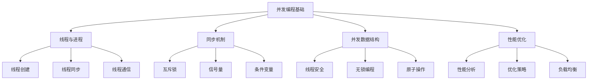

# 并发编程基础

## 📖 核心概念

**并发编程**是计算机科学中的重要概念，涉及多线程、多进程、同步机制等。在数据结构设计中，并发编程确保数据结构的线程安全性和性能优化。

### 🏗️ 并发编程结构



## 🔧 并发编程实现

### 基础线程管理

```cpp
class ThreadManager {
private:
    vector<thread> threads;
    vector<function<void()>> tasks;
    mutex taskMutex;
    condition_variable cv;
    bool stop;
    
public:
    ThreadManager() : stop(false) {}
    
    ~ThreadManager() {
        stopThreads();
    }
    
    // 添加任务
    void addTask(function<void()> task) {
        lock_guard<mutex> lock(taskMutex);
        tasks.push_back(task);
        cv.notify_one();
    }
    
    // 启动线程
    void startThreads(int numThreads) {
        for (int i = 0; i < numThreads; i++) {
            threads.emplace_back([this]() {
                while (true) {
                    unique_lock<mutex> lock(taskMutex);
                    cv.wait(lock, [this] { return !tasks.empty() || stop; });
                    
                    if (stop && tasks.empty()) {
                        break;
                    }
                    
                    if (!tasks.empty()) {
                        auto task = tasks.front();
                        tasks.erase(tasks.begin());
                        lock.unlock();
                        task();
                    }
                }
            });
        }
    }
    
    // 停止线程
    void stopThreads() {
        {
            lock_guard<mutex> lock(taskMutex);
            stop = true;
        }
        cv.notify_all();
        
        for (auto& thread : threads) {
            if (thread.joinable()) {
                thread.join();
            }
        }
        threads.clear();
    }
    
    // 等待所有任务完成
    void waitForCompletion() {
        while (true) {
            lock_guard<mutex> lock(taskMutex);
            if (tasks.empty()) {
                break;
            }
        }
    }
    
    // 显示线程状态
    void displayStatus() {
        cout << "Thread Manager Status:" << endl;
        cout << "====================" << endl;
        
        lock_guard<mutex> lock(taskMutex);
        cout << "Number of threads: " << threads.size() << endl;
        cout << "Pending tasks: " << tasks.size() << endl;
        cout << "Stop flag: " << (stop ? "Yes" : "No") << endl;
    }
};
```

### 同步机制

```cpp
class SynchronizationMechanisms {
private:
    mutex mtx;
    condition_variable cv;
    atomic<int> counter;
    semaphore sem;
    
public:
    SynchronizationMechanisms(int semCount = 1) : counter(0), sem(semCount) {}
    
    // 互斥锁示例
    void mutexExample() {
        cout << "Mutex Example:" << endl;
        cout << "=============" << endl;
        
        vector<thread> threads;
        for (int i = 0; i < 5; i++) {
            threads.emplace_back([this, i]() {
                lock_guard<mutex> lock(mtx);
                cout << "Thread " << i << " acquired mutex" << endl;
                this_thread::sleep_for(chrono::milliseconds(100));
                cout << "Thread " << i << " released mutex" << endl;
            });
        }
        
        for (auto& thread : threads) {
            thread.join();
        }
    }
    
    // 条件变量示例
    void conditionVariableExample() {
        cout << "Condition Variable Example:" << endl;
        cout << "=========================" << endl;
        
        vector<thread> threads;
        for (int i = 0; i < 3; i++) {
            threads.emplace_back([this, i]() {
                unique_lock<mutex> lock(mtx);
                cv.wait(lock, [this] { return counter.load() > 0; });
                cout << "Thread " << i << " woke up" << endl;
            });
        }
        
        // 唤醒所有等待的线程
        this_thread::sleep_for(chrono::milliseconds(100));
        {
            lock_guard<mutex> lock(mtx);
            counter++;
        }
        cv.notify_all();
        
        for (auto& thread : threads) {
            thread.join();
        }
    }
    
    // 信号量示例
    void semaphoreExample() {
        cout << "Semaphore Example:" << endl;
        cout << "================" << endl;
        
        vector<thread> threads;
        for (int i = 0; i < 5; i++) {
            threads.emplace_back([this, i]() {
                sem.acquire();
                cout << "Thread " << i << " acquired semaphore" << endl;
                this_thread::sleep_for(chrono::milliseconds(200));
                cout << "Thread " << i << " released semaphore" << endl;
                sem.release();
            });
        }
        
        for (auto& thread : threads) {
            thread.join();
        }
    }
    
    // 原子操作示例
    void atomicExample() {
        cout << "Atomic Example:" << endl;
        cout << "=============" << endl;
        
        vector<thread> threads;
        for (int i = 0; i < 10; i++) {
            threads.emplace_back([this]() {
                for (int j = 0; j < 1000; j++) {
                    counter++;
                }
            });
        }
        
        for (auto& thread : threads) {
            thread.join();
        }
        
        cout << "Final counter value: " << counter.load() << endl;
    }
    
    // 显示同步机制状态
    void displayStatus() {
        cout << "Synchronization Mechanisms Status:" << endl;
        cout << "=================================" << endl;
        
        cout << "Counter value: " << counter.load() << endl;
        cout << "Semaphore count: " << sem.getCount() << endl;
    }
};

// 信号量实现
class semaphore {
private:
    mutex mtx;
    condition_variable cv;
    int count;
    
public:
    semaphore(int count = 1) : count(count) {}
    
    void acquire() {
        unique_lock<mutex> lock(mtx);
        cv.wait(lock, [this] { return count > 0; });
        count--;
    }
    
    void release() {
        lock_guard<mutex> lock(mtx);
        count++;
        cv.notify_one();
    }
    
    int getCount() {
        lock_guard<mutex> lock(mtx);
        return count;
    }
};
```

### 并发数据结构

```cpp
class ConcurrentDataStructures {
private:
    mutex mtx;
    queue<int> dataQueue;
    atomic<int> atomicCounter;
    
public:
    ConcurrentDataStructures() : atomicCounter(0) {}
    
    // 线程安全队列
    void threadSafeQueue() {
        cout << "Thread Safe Queue:" << endl;
        cout << "================" << endl;
        
        vector<thread> producers;
        vector<thread> consumers;
        
        // 生产者线程
        for (int i = 0; i < 3; i++) {
            producers.emplace_back([this, i]() {
                for (int j = 0; j < 5; j++) {
                    {
                        lock_guard<mutex> lock(mtx);
                        dataQueue.push(i * 5 + j);
                        cout << "Producer " << i << " produced " << (i * 5 + j) << endl;
                    }
                    this_thread::sleep_for(chrono::milliseconds(100));
                }
            });
        }
        
        // 消费者线程
        for (int i = 0; i < 2; i++) {
            consumers.emplace_back([this, i]() {
                while (true) {
                    int value = -1;
                    {
                        lock_guard<mutex> lock(mtx);
                        if (!dataQueue.empty()) {
                            value = dataQueue.front();
                            dataQueue.pop();
                        }
                    }
                    
                    if (value != -1) {
                        cout << "Consumer " << i << " consumed " << value << endl;
                    } else {
                        this_thread::sleep_for(chrono::milliseconds(50));
                    }
                }
            });
        }
        
        // 等待生产者完成
        for (auto& thread : producers) {
            thread.join();
        }
        
        // 等待队列为空
        while (true) {
            lock_guard<mutex> lock(mtx);
            if (dataQueue.empty()) {
                break;
            }
        }
        
        // 停止消费者线程
        for (auto& thread : consumers) {
            thread.detach();
        }
    }
    
    // 无锁计数器
    void lockFreeCounter() {
        cout << "Lock Free Counter:" << endl;
        cout << "================" << endl;
        
        vector<thread> threads;
        for (int i = 0; i < 10; i++) {
            threads.emplace_back([this]() {
                for (int j = 0; j < 1000; j++) {
                    atomicCounter++;
                }
            });
        }
        
        for (auto& thread : threads) {
            thread.join();
        }
        
        cout << "Final atomic counter value: " << atomicCounter.load() << endl;
    }
    
    // 显示并发数据结构状态
    void displayStatus() {
        cout << "Concurrent Data Structures Status:" << endl;
        cout << "===============================" << endl;
        
        lock_guard<mutex> lock(mtx);
        cout << "Queue size: " << dataQueue.size() << endl;
        cout << "Atomic counter: " << atomicCounter.load() << endl;
    }
};
```

## 🎯 并发编程应用

### 实际应用场景

```cpp
class ConcurrentProgrammingApplications {
public:
    static void demonstrateApplications() {
        cout << "Concurrent Programming Applications:" << endl;
        cout << "=================================" << endl;
        
        cout << "1. 多线程服务器:" << endl;
        cout << "   - 处理并发请求" << endl;
        cout << "   - 线程池管理" << endl;
        cout << "   - 负载均衡" << endl;
        
        cout << "2. 并行计算:" << endl;
        cout << "   - 数据并行处理" << endl;
        cout << "   - 任务并行执行" << endl;
        cout << "   - 性能优化" << endl;
        
        cout << "3. 实时系统:" << endl;
        cout << "   - 实时数据处理" << endl;
        cout << "   - 任务调度" << endl;
        cout << "   - 响应时间优化" << endl;
        
        cout << "4. 分布式系统:" << endl;
        cout << "   - 分布式计算" << endl;
        cout << "   - 数据同步" << endl;
        cout << "   - 故障恢复" << endl;
    }
    
    static void analyzePerformance() {
        cout << "Concurrent Programming Performance Analysis:" << endl;
        cout << "=========================================" << endl;
        
        cout << "1. 性能优势:" << endl;
        cout << "   - 提高CPU利用率" << endl;
        cout << "   - 减少等待时间" << endl;
        cout << "   - 提高系统吞吐量" << endl;
        
        cout << "2. 性能挑战:" << endl;
        cout << "   - 线程创建开销" << endl;
        cout << "   - 同步开销" << endl;
        cout << "   - 内存竞争" << endl;
        
        cout << "3. 优化策略:" << endl;
        cout << "   - 线程池技术" << endl;
        cout << "   - 无锁编程" << endl;
        cout << "   - 缓存优化" << endl;
    }
    
    static void selectConcurrencyModel(bool needsHighThroughput, bool needsLowLatency, bool needsScalability) {
        cout << "Concurrency Model Selection:" << endl;
        cout << "=========================" << endl;
        
        cout << "Needs high throughput: " << (needsHighThroughput ? "Yes" : "No") << endl;
        cout << "Needs low latency: " << (needsLowLatency ? "Yes" : "No") << endl;
        cout << "Needs scalability: " << (needsScalability ? "Yes" : "No") << endl;
        
        cout << "Recommendation:" << endl;
        
        if (needsHighThroughput) {
            cout << "Use Thread Pool (high throughput)" << endl;
        } else if (needsLowLatency) {
            cout << "Use Lock-Free Programming (low latency)" << endl;
        } else if (needsScalability) {
            cout << "Use Distributed Computing (scalability)" << endl;
        } else {
            cout << "Use Basic Threading (simple concurrency)" << endl;
        }
    }
};
```

## 📊 并发编程分析

### 性能分析

```cpp
class ConcurrentProgrammingAnalysis {
public:
    static void analyzePerformance() {
        cout << "Concurrent Programming Performance Analysis:" << endl;
        cout << "=========================================" << endl;
        
        cout << "1. 线程性能:" << endl;
        cout << "   - 创建开销: O(1)" << endl;
        cout << "   - 切换开销: O(1)" << endl;
        cout << "   - 同步开销: O(1)" << endl;
        
        cout << "2. 内存性能:" << endl;
        cout << "   - 线程栈: O(stack_size)" << endl;
        cout << "   - 共享内存: O(shared_size)" << endl;
        cout << "   - 缓存影响: O(cache_size)" << endl;
        
        cout << "3. 系统性能:" << endl;
        cout << "   - CPU利用率: 提高" << endl;
        cout << "   - 响应时间: 降低" << endl;
        cout << "   - 吞吐量: 提高" << endl;
    }
    
    static void analyzeSpaceComplexity() {
        cout << "Concurrent Programming Space Complexity Analysis:" << endl;
        cout << "==============================================" << endl;
        
        cout << "1. 线程空间:" << endl;
        cout << "   - 线程栈: O(stack_size)" << endl;
        cout << "   - 线程控制块: O(1)" << endl;
        cout << "   - 总空间: O(num_threads * stack_size)" << endl;
        
        cout << "2. 同步空间:" << endl;
        cout << "   - 互斥锁: O(1)" << endl;
        cout << "   - 条件变量: O(1)" << endl;
        cout << "   - 信号量: O(1)" << endl;
        
        cout << "3. 共享空间:" << endl;
        cout << "   - 共享数据: O(shared_size)" << endl;
        cout << "   - 同步对象: O(num_sync_objects)" << endl;
        cout << "   - 总空间: O(shared_size + num_sync_objects)" << endl;
    }
    
    static void analyzeTimeComplexity() {
        cout << "Concurrent Programming Time Complexity Analysis:" << endl;
        cout << "=============================================" << endl;
        
        cout << "1. 线程创建:" << endl;
        cout << "   - 创建时间: O(1)" << endl;
        cout << "   - 初始化时间: O(1)" << endl;
        cout << "   - 总时间: O(1)" << endl;
        
        cout << "2. 线程同步:" << endl;
        cout << "   - 互斥锁: O(1)" << endl;
        cout << "   - 条件变量: O(1)" << endl;
        cout << "   - 信号量: O(1)" << endl;
        
        cout << "3. 线程通信:" << endl;
        cout << "   - 消息传递: O(1)" << endl;
        cout << "   - 共享内存: O(1)" << endl;
        cout << "   - 总时间: O(1)" << endl;
    }
};
```

## 🎮 并发编程测试

### 1. 基础功能测试

```cpp
class ConcurrentProgrammingTest {
public:
    static void testThreadManager() {
        cout << "Testing Thread Manager:" << endl;
        cout << "=====================" << endl;
        
        ThreadManager tm;
        
        // 添加任务
        for (int i = 0; i < 10; i++) {
            tm.addTask([i]() {
                cout << "Task " << i << " executed" << endl;
                this_thread::sleep_for(chrono::milliseconds(100));
            });
        }
        
        // 启动线程
        tm.startThreads(3);
        
        // 等待完成
        tm.waitForCompletion();
        
        tm.displayStatus();
    }
    
    static void testSynchronizationMechanisms() {
        cout << "Testing Synchronization Mechanisms:" << endl;
        cout << "=================================" << endl;
        
        SynchronizationMechanisms sm;
        
        sm.mutexExample();
        sm.conditionVariableExample();
        sm.semaphoreExample();
        sm.atomicExample();
        
        sm.displayStatus();
    }
    
    static void testConcurrentDataStructures() {
        cout << "Testing Concurrent Data Structures:" << endl;
        cout << "=================================" << endl;
        
        ConcurrentDataStructures cds;
        
        cds.threadSafeQueue();
        cds.lockFreeCounter();
        
        cds.displayStatus();
    }
    
    static void testApplications() {
        cout << "Testing Applications:" << endl;
        cout << "==================" << endl;
        
        ConcurrentProgrammingApplications::demonstrateApplications();
        ConcurrentProgrammingApplications::analyzePerformance();
        ConcurrentProgrammingApplications::selectConcurrencyModel(true, false, false);
    }
    
    static void testAnalysis() {
        cout << "Testing Analysis:" << endl;
        cout << "===============" << endl;
        
        ConcurrentProgrammingAnalysis::analyzePerformance();
        ConcurrentProgrammingAnalysis::analyzeSpaceComplexity();
        ConcurrentProgrammingAnalysis::analyzeTimeComplexity();
    }
};
```

## 🔗 相关链接

- [[01-并发结构|并发结构]]
- [[02-线程安全数据结构|线程安全数据结构]]
- [[03-锁与无锁编程|锁与无锁编程]]

## 💡 并发编程要点

1. **线程管理**: 合理创建和管理线程
2. **同步机制**: 使用互斥锁、条件变量等保证线程安全
3. **性能优化**: 避免锁竞争，使用无锁编程
4. **错误处理**: 正确处理并发环境下的异常

---

*📝 并发编程提示：并发编程是提高系统性能的重要手段，需要合理使用同步机制保证线程安全*
