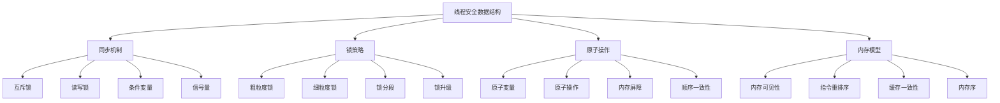

# 线程安全数据结构

## 📖 核心概念

**线程安全数据结构**是在多线程环境下能够安全访问的数据结构，通过同步机制保证数据的一致性和完整性。它们解决了多线程并发访问时的竞争条件、数据竞争等问题，是现代并发编程的重要组成部分。

### 🏗️ 线程安全数据结构的组成要素



## 🔍 线程安全策略

### 同步机制分类

| 同步机制 | 特点 | 优势 | 劣势 | 适用场景 |
|----------|------|------|------|----------|
| **互斥锁** | 独占访问 | 简单可靠 | 性能开销大 | 临界区保护 |
| **读写锁** | 读共享写独占 | 读性能好 | 写性能差 | 读多写少 |
| **条件变量** | 等待通知 | 高效等待 | 复杂易错 | 生产者消费者 |
| **信号量** | 计数控制 | 灵活控制 | 容易死锁 | 资源限制 |

### 复杂度分析

| 操作 | 时间复杂度 | 空间复杂度 | 并发度 | 适用场景 |
|------|------------|------------|--------|----------|
| **加锁** | O(1) | O(1) | 低 | 所有场景 |
| **解锁** | O(1) | O(1) | 低 | 所有场景 |
| **原子操作** | O(1) | O(1) | 高 | 简单操作 |
| **无锁操作** | O(1) | O(1) | 很高 | 高性能场景 |

## 💻 线程安全数据结构实现

### 线程安全栈

```cpp
// 线程安全栈
template<typename T>
class ThreadSafeStack {
private:
    stack<T> data;
    mutable mutex mtx;
    condition_variable cv;
    
public:
    ThreadSafeStack() = default;
    
    // 入栈
    void push(const T& value) {
        lock_guard<mutex> lock(mtx);
        data.push(value);
        cv.notify_one();
    }
    
    // 出栈
    bool pop(T& value) {
        unique_lock<mutex> lock(mtx);
        cv.wait(lock, [this] { return !data.empty(); });
        
        if (data.empty()) {
            return false;
        }
        
        value = data.top();
        data.pop();
        return true;
    }
    
    // 尝试出栈
    bool tryPop(T& value) {
        lock_guard<mutex> lock(mtx);
        if (data.empty()) {
            return false;
        }
        
        value = data.top();
        data.pop();
        return true;
    }
    
    // 检查是否为空
    bool empty() const {
        lock_guard<mutex> lock(mtx);
        return data.empty();
    }
    
    // 获取大小
    size_t size() const {
        lock_guard<mutex> lock(mtx);
        return data.size();
    }
    
    // 获取顶部元素
    bool top(T& value) const {
        lock_guard<mutex> lock(mtx);
        if (data.empty()) {
            return false;
        }
        
        value = data.top();
        return true;
    }
};
```

### 线程安全队列

```cpp
// 线程安全队列
template<typename T>
class ThreadSafeQueue {
private:
    queue<T> data;
    mutable mutex mtx;
    condition_variable cv;
    
public:
    ThreadSafeQueue() = default;
    
    // 入队
    void enqueue(const T& value) {
        lock_guard<mutex> lock(mtx);
        data.push(value);
        cv.notify_one();
    }
    
    // 出队
    bool dequeue(T& value) {
        unique_lock<mutex> lock(mtx);
        cv.wait(lock, [this] { return !data.empty(); });
        
        if (data.empty()) {
            return false;
        }
        
        value = data.front();
        data.pop();
        return true;
    }
    
    // 尝试出队
    bool tryDequeue(T& value) {
        lock_guard<mutex> lock(mtx);
        if (data.empty()) {
            return false;
        }
        
        value = data.front();
        data.pop();
        return true;
    }
    
    // 检查是否为空
    bool empty() const {
        lock_guard<mutex> lock(mtx);
        return data.empty();
    }
    
    // 获取大小
    size_t size() const {
        lock_guard<mutex> lock(mtx);
        return data.size();
    }
    
    // 获取队首元素
    bool front(T& value) const {
        lock_guard<mutex> lock(mtx);
        if (data.empty()) {
            return false;
        }
        
        value = data.front();
        return true;
    }
};
```

### 线程安全哈希表

```cpp
// 线程安全哈希表
template<typename K, typename V>
class ThreadSafeHashMap {
private:
    unordered_map<K, V> data;
    mutable shared_mutex mtx;  // 读写锁
    
public:
    ThreadSafeHashMap() = default;
    
    // 插入键值对
    void insert(const K& key, const V& value) {
        unique_lock<shared_mutex> lock(mtx);
        data[key] = value;
    }
    
    // 查找值
    bool find(const K& key, V& value) const {
        shared_lock<shared_mutex> lock(mtx);
        auto it = data.find(key);
        if (it != data.end()) {
            value = it->second;
            return true;
        }
        return false;
    }
    
    // 删除键值对
    bool erase(const K& key) {
        unique_lock<shared_mutex> lock(mtx);
        return data.erase(key) > 0;
    }
    
    // 检查键是否存在
    bool contains(const K& key) const {
        shared_lock<shared_mutex> lock(mtx);
        return data.find(key) != data.end();
    }
    
    // 获取大小
    size_t size() const {
        shared_lock<shared_mutex> lock(mtx);
        return data.size();
    }
    
    // 检查是否为空
    bool empty() const {
        shared_lock<shared_mutex> lock(mtx);
        return data.empty();
    }
    
    // 清空
    void clear() {
        unique_lock<shared_mutex> lock(mtx);
        data.clear();
    }
    
    // 获取所有键
    vector<K> keys() const {
        shared_lock<shared_mutex> lock(mtx);
        vector<K> result;
        for (const auto& pair : data) {
            result.push_back(pair.first);
        }
        return result;
    }
    
    // 获取所有值
    vector<V> values() const {
        shared_lock<shared_mutex> lock(mtx);
        vector<V> result;
        for (const auto& pair : data) {
            result.push_back(pair.second);
        }
        return result;
    }
};
```

### 线程安全链表

```cpp
// 线程安全链表
template<typename T>
class ThreadSafeLinkedList {
private:
    struct Node {
        T data;
        Node* next;
        mutable mutex mtx;
        
        Node(const T& value) : data(value), next(nullptr) {}
    };
    
    Node* head;
    mutable mutex headMtx;
    
public:
    ThreadSafeLinkedList() : head(nullptr) {}
    
    ~ThreadSafeLinkedList() {
        clear();
    }
    
    // 插入节点
    void insert(const T& value) {
        Node* newNode = new Node(value);
        
        lock_guard<mutex> lock(headMtx);
        newNode->next = head;
        head = newNode;
    }
    
    // 删除节点
    bool remove(const T& value) {
        lock_guard<mutex> lock(headMtx);
        
        if (head == nullptr) {
            return false;
        }
        
        if (head->data == value) {
            Node* toDelete = head;
            head = head->next;
            delete toDelete;
            return true;
        }
        
        Node* current = head;
        while (current->next != nullptr) {
            if (current->next->data == value) {
                Node* toDelete = current->next;
                current->next = current->next->next;
                delete toDelete;
                return true;
            }
            current = current->next;
        }
        
        return false;
    }
    
    // 查找节点
    bool find(const T& value) const {
        lock_guard<mutex> lock(headMtx);
        
        Node* current = head;
        while (current != nullptr) {
            if (current->data == value) {
                return true;
            }
            current = current->next;
        }
        
        return false;
    }
    
    // 获取大小
    size_t size() const {
        lock_guard<mutex> lock(headMtx);
        
        size_t count = 0;
        Node* current = head;
        while (current != nullptr) {
            count++;
            current = current->next;
        }
        
        return count;
    }
    
    // 检查是否为空
    bool empty() const {
        lock_guard<mutex> lock(headMtx);
        return head == nullptr;
    }
    
    // 清空链表
    void clear() {
        lock_guard<mutex> lock(headMtx);
        
        while (head != nullptr) {
            Node* toDelete = head;
            head = head->next;
            delete toDelete;
        }
    }
    
    // 遍历链表
    vector<T> toVector() const {
        lock_guard<mutex> lock(headMtx);
        
        vector<T> result;
        Node* current = head;
        while (current != nullptr) {
            result.push_back(current->data);
            current = current->next;
        }
        
        return result;
    }
};
```

### 线程安全树

```cpp
// 线程安全二叉搜索树
template<typename T>
class ThreadSafeBST {
private:
    struct Node {
        T data;
        Node* left;
        Node* right;
        mutable mutex mtx;
        
        Node(const T& value) : data(value), left(nullptr), right(nullptr) {}
    };
    
    Node* root;
    mutable mutex rootMtx;
    
public:
    ThreadSafeBST() : root(nullptr) {}
    
    ~ThreadSafeBST() {
        clear();
    }
    
    // 插入节点
    void insert(const T& value) {
        lock_guard<mutex> lock(rootMtx);
        root = insertHelper(root, value);
    }
    
private:
    Node* insertHelper(Node* node, const T& value) {
        if (node == nullptr) {
            return new Node(value);
        }
        
        lock_guard<mutex> lock(node->mtx);
        
        if (value < node->data) {
            node->left = insertHelper(node->left, value);
        } else if (value > node->data) {
            node->right = insertHelper(node->right, value);
        }
        
        return node;
    }
    
public:
    // 查找节点
    bool find(const T& value) const {
        lock_guard<mutex> lock(rootMtx);
        return findHelper(root, value);
    }
    
private:
    bool findHelper(Node* node, const T& value) const {
        if (node == nullptr) {
            return false;
        }
        
        lock_guard<mutex> lock(node->mtx);
        
        if (value == node->data) {
            return true;
        } else if (value < node->data) {
            return findHelper(node->left, value);
        } else {
            return findHelper(node->right, value);
        }
    }
    
public:
    // 删除节点
    bool remove(const T& value) {
        lock_guard<mutex> lock(rootMtx);
        root = removeHelper(root, value);
        return root != nullptr;
    }
    
private:
    Node* removeHelper(Node* node, const T& value) {
        if (node == nullptr) {
            return nullptr;
        }
        
        lock_guard<mutex> lock(node->mtx);
        
        if (value < node->data) {
            node->left = removeHelper(node->left, value);
        } else if (value > node->data) {
            node->right = removeHelper(node->right, value);
        } else {
            if (node->left == nullptr) {
                Node* temp = node->right;
                delete node;
                return temp;
            } else if (node->right == nullptr) {
                Node* temp = node->left;
                delete node;
                return temp;
            }
            
            Node* temp = findMin(node->right);
            node->data = temp->data;
            node->right = removeHelper(node->right, temp->data);
        }
        
        return node;
    }
    
    Node* findMin(Node* node) {
        while (node->left != nullptr) {
            node = node->left;
        }
        return node;
    }
    
public:
    // 中序遍历
    vector<T> inorderTraversal() const {
        lock_guard<mutex> lock(rootMtx);
        vector<T> result;
        inorderHelper(root, result);
        return result;
    }
    
private:
    void inorderHelper(Node* node, vector<T>& result) const {
        if (node == nullptr) {
            return;
        }
        
        lock_guard<mutex> lock(node->mtx);
        inorderHelper(node->left, result);
        result.push_back(node->data);
        inorderHelper(node->right, result);
    }
    
public:
    // 获取大小
    size_t size() const {
        lock_guard<mutex> lock(rootMtx);
        return sizeHelper(root);
    }
    
private:
    size_t sizeHelper(Node* node) const {
        if (node == nullptr) {
            return 0;
        }
        
        lock_guard<mutex> lock(node->mtx);
        return 1 + sizeHelper(node->left) + sizeHelper(node->right);
    }
    
public:
    // 检查是否为空
    bool empty() const {
        lock_guard<mutex> lock(rootMtx);
        return root == nullptr;
    }
    
    // 清空树
    void clear() {
        lock_guard<mutex> lock(rootMtx);
        clearHelper(root);
        root = nullptr;
    }
    
private:
    void clearHelper(Node* node) {
        if (node == nullptr) {
            return;
        }
        
        lock_guard<mutex> lock(node->mtx);
        clearHelper(node->left);
        clearHelper(node->right);
        delete node;
    }
};
```

## 🎯 线程安全应用

### 生产者消费者模式

```cpp
// 生产者消费者模式
template<typename T>
class ProducerConsumer {
private:
    ThreadSafeQueue<T> queue;
    int maxSize;
    atomic<bool> running;
    
public:
    ProducerConsumer(int size) : maxSize(size), running(true) {}
    
    // 生产者
    void producer(int id, int count) {
        for (int i = 0; i < count && running; i++) {
            T item = generateItem(id, i);
            
            // 等待队列有空间
            while (queue.size() >= maxSize && running) {
                this_thread::sleep_for(chrono::milliseconds(10));
            }
            
            if (running) {
                queue.enqueue(item);
                cout << "Producer " << id << " produced: " << item << endl;
            }
        }
    }
    
    // 消费者
    void consumer(int id) {
        while (running) {
            T item;
            if (queue.tryDequeue(item)) {
                processItem(id, item);
                cout << "Consumer " << id << " consumed: " << item << endl;
            } else {
                this_thread::sleep_for(chrono::milliseconds(10));
            }
        }
    }
    
    // 停止
    void stop() {
        running = false;
    }
    
private:
    T generateItem(int producerId, int itemId) {
        return static_cast<T>(producerId * 1000 + itemId);
    }
    
    void processItem(int consumerId, const T& item) {
        // 模拟处理时间
        this_thread::sleep_for(chrono::milliseconds(50));
    }
};
```

### 线程池实现

```cpp
// 线程池
class ThreadPool {
private:
    vector<thread> workers;
    ThreadSafeQueue<function<void()>> tasks;
    atomic<bool> running;
    int threadCount;
    
public:
    ThreadPool(int count) : threadCount(count), running(true) {
        for (int i = 0; i < threadCount; i++) {
            workers.emplace_back([this] {
                while (running) {
                    function<void()> task;
                    if (tasks.tryDequeue(task)) {
                        task();
                    } else {
                        this_thread::sleep_for(chrono::milliseconds(10));
                    }
                }
            });
        }
    }
    
    ~ThreadPool() {
        stop();
    }
    
    // 添加任务
    template<typename F, typename... Args>
    auto enqueue(F&& f, Args&&... args) -> future<typename result_of<F(Args...)>::type> {
        using return_type = typename result_of<F(Args...)>::type;
        
        auto task = make_shared<packaged_task<return_type()>>(
            bind(forward<F>(f), forward<Args>(args)...)
        );
        
        future<return_type> result = task->get_future();
        
        tasks.enqueue([task] { (*task)(); });
        
        return result;
    }
    
    // 停止线程池
    void stop() {
        running = false;
        
        for (thread& worker : workers) {
            if (worker.joinable()) {
                worker.join();
            }
        }
    }
    
    // 获取任务数量
    size_t getTaskCount() const {
        return tasks.size();
    }
    
    // 获取线程数量
    int getThreadCount() const {
        return threadCount;
    }
};
```

## ⚡ 复杂度分析

### 线程安全数据结构复杂度

| 数据结构 | 查找 | 插入 | 删除 | 并发度 | 适用场景 |
|----------|------|------|------|--------|----------|
| **线程安全栈** | O(1) | O(1) | O(1) | 低 | 简单操作 |
| **线程安全队列** | O(1) | O(1) | O(1) | 低 | 生产者消费者 |
| **线程安全哈希表** | O(1) | O(1) | O(1) | 中等 | 键值存储 |
| **线程安全链表** | O(n) | O(1) | O(n) | 低 | 顺序访问 |
| **线程安全树** | O(log n) | O(log n) | O(log n) | 低 | 有序数据 |

### 性能优化策略

| 优化策略 | 适用场景 | 优化效果 | 实现难度 | 维护成本 |
|----------|----------|----------|----------|----------|
| **读写锁** | 读多写少 | 显著 | 中等 | 中等 |
| **锁分段** | 大容量数据 | 显著 | 困难 | 高 |
| **无锁设计** | 高性能场景 | 显著 | 很困难 | 很高 |
| **原子操作** | 简单操作 | 明显 | 简单 | 低 |

## 🎓 学习要点总结

### 核心理解

1. **同步机制**：理解各种同步机制的特点和适用场景
2. **锁策略**：掌握不同锁策略的选择和使用
3. **原子操作**：理解原子操作的作用和实现
4. **内存模型**：掌握内存模型对并发的影响

### 实践要点

1. **锁设计**：正确设计锁的粒度和范围
2. **死锁避免**：避免死锁和活锁问题
3. **性能优化**：优化并发性能
4. **测试验证**：验证线程安全性

### 应用思维

1. **并发设计**：设计并发安全的数据结构
2. **性能权衡**：权衡安全性和性能
3. **问题诊断**：诊断并发问题
4. **实际应用**：将线程安全数据结构应用到实际问题中

---

**相关链接：**
- [[05-高级结构/04-并发结构/02-无锁数据结构|无锁数据结构]] - 无锁编程
- [[05-高级结构/01-哈希宇宙/01-哈希表HashTable详解|哈希表HashTable详解]] - 哈希表基础
- [[03-层次宇宙/02-二叉树王国/02-二叉搜索树|二叉搜索树]] - 树结构基础
- [[06-应用实战/04-网络应用/01-分布式系统|分布式系统]] - 分布式应用
