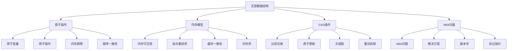

# 无锁数据结构

## 📖 核心概念

**无锁数据结构**是不使用传统锁机制的数据结构，通过原子操作、内存屏障和CAS（Compare-And-Swap）等机制实现并发安全。它们避免了锁带来的性能开销和死锁问题，在高并发场景下具有更好的性能表现。

### 🏗️ 无锁数据结构的组成要素



## 🔍 无锁策略

### 无锁机制分类

| 无锁机制 | 特点 | 优势 | 劣势 | 适用场景 |
|----------|------|------|------|----------|
| **CAS操作** | 比较并交换 | 简单高效 | ABA问题 | 简单更新 |
| **原子变量** | 原子读写 | 性能好 | 功能有限 | 计数器 |
| **内存屏障** | 指令排序 | 精确控制 | 复杂难懂 | 底层优化 |
| **无锁算法** | 复杂算法 | 高性能 | 实现困难 | 复杂结构 |

### 复杂度分析

| 操作 | 时间复杂度 | 空间复杂度 | 并发度 | 适用场景 |
|------|------------|------------|--------|----------|
| **CAS操作** | O(1) | O(1) | 很高 | 简单更新 |
| **原子变量** | O(1) | O(1) | 很高 | 计数器 |
| **无锁队列** | O(1) | O(1) | 很高 | 生产者消费者 |
| **无锁栈** | O(1) | O(1) | 很高 | 简单操作 |

## 💻 无锁数据结构实现

### 无锁栈

```cpp
// 无锁栈
template<typename T>
class LockFreeStack {
private:
    struct Node {
        T data;
        Node* next;
        
        Node(const T& value) : data(value), next(nullptr) {}
    };
    
    atomic<Node*> head;
    
public:
    LockFreeStack() : head(nullptr) {}
    
    ~LockFreeStack() {
        clear();
    }
    
    // 入栈
    void push(const T& value) {
        Node* newNode = new Node(value);
        Node* oldHead = head.load();
        
        do {
            newNode->next = oldHead;
        } while (!head.compare_exchange_weak(oldHead, newNode));
    }
    
    // 出栈
    bool pop(T& value) {
        Node* oldHead = head.load();
        
        do {
            if (oldHead == nullptr) {
                return false;
            }
            
            Node* newHead = oldHead->next;
            if (head.compare_exchange_weak(oldHead, newHead)) {
                value = oldHead->data;
                delete oldHead;
                return true;
            }
        } while (true);
    }
    
    // 尝试出栈
    bool tryPop(T& value) {
        Node* oldHead = head.load();
        
        if (oldHead == nullptr) {
            return false;
        }
        
        Node* newHead = oldHead->next;
        if (head.compare_exchange_weak(oldHead, newHead)) {
            value = oldHead->data;
            delete oldHead;
            return true;
        }
        
        return false;
    }
    
    // 检查是否为空
    bool empty() const {
        return head.load() == nullptr;
    }
    
    // 清空栈
    void clear() {
        while (!empty()) {
            T value;
            pop(value);
        }
    }
    
    // 获取大小（近似）
    size_t size() const {
        size_t count = 0;
        Node* current = head.load();
        while (current != nullptr) {
            count++;
            current = current->next;
        }
        return count;
    }
};
```

### 无锁队列

```cpp
// 无锁队列
template<typename T>
class LockFreeQueue {
private:
    struct Node {
        atomic<T*> data;
        atomic<Node*> next;
        
        Node() : data(nullptr), next(nullptr) {}
    };
    
    atomic<Node*> head;
    atomic<Node*> tail;
    
public:
    LockFreeQueue() {
        Node* dummy = new Node();
        head.store(dummy);
        tail.store(dummy);
    }
    
    ~LockFreeQueue() {
        clear();
        delete head.load();
    }
    
    // 入队
    void enqueue(const T& value) {
        Node* newNode = new Node();
        T* data = new T(value);
        newNode->data.store(data);
        
        Node* oldTail = tail.load();
        Node* oldNext = oldTail->next.load();
        
        do {
            if (oldNext == nullptr) {
                if (oldTail->next.compare_exchange_weak(oldNext, newNode)) {
                    break;
                }
            } else {
                tail.compare_exchange_weak(oldTail, oldNext);
            }
        } while (true);
        
        tail.compare_exchange_weak(oldTail, newNode);
    }
    
    // 出队
    bool dequeue(T& value) {
        Node* oldHead = head.load();
        Node* oldTail = tail.load();
        Node* oldNext = oldHead->next.load();
        
        do {
            if (oldHead == oldTail) {
                if (oldNext == nullptr) {
                    return false;
                }
                tail.compare_exchange_weak(oldTail, oldNext);
            } else {
                if (oldNext == nullptr) {
                    return false;
                }
                
                T* data = oldNext->data.load();
                if (data == nullptr) {
                    return false;
                }
                
                if (head.compare_exchange_weak(oldHead, oldNext)) {
                    value = *data;
                    delete data;
                    delete oldHead;
                    return true;
                }
            }
        } while (true);
    }
    
    // 尝试出队
    bool tryDequeue(T& value) {
        Node* oldHead = head.load();
        Node* oldTail = tail.load();
        Node* oldNext = oldHead->next.load();
        
        if (oldHead == oldTail) {
            if (oldNext == nullptr) {
                return false;
            }
            tail.compare_exchange_weak(oldTail, oldNext);
        } else {
            if (oldNext == nullptr) {
                return false;
            }
            
            T* data = oldNext->data.load();
            if (data == nullptr) {
                return false;
            }
            
            if (head.compare_exchange_weak(oldHead, oldNext)) {
                value = *data;
                delete data;
                delete oldHead;
                return true;
            }
        }
        
        return false;
    }
    
    // 检查是否为空
    bool empty() const {
        Node* oldHead = head.load();
        Node* oldTail = tail.load();
        Node* oldNext = oldHead->next.load();
        
        return (oldHead == oldTail) && (oldNext == nullptr);
    }
    
    // 清空队列
    void clear() {
        while (!empty()) {
            T value;
            dequeue(value);
        }
    }
    
    // 获取大小（近似）
    size_t size() const {
        size_t count = 0;
        Node* current = head.load();
        Node* tailNode = tail.load();
        
        while (current != tailNode) {
            count++;
            current = current->next.load();
        }
        
        return count;
    }
};
```

### 无锁哈希表

```cpp
// 无锁哈希表
template<typename K, typename V>
class LockFreeHashMap {
private:
    struct Node {
        K key;
        V value;
        atomic<Node*> next;
        
        Node(const K& k, const V& v) : key(k), value(v), next(nullptr) {}
    };
    
    vector<atomic<Node*>> buckets;
    size_t bucketCount;
    atomic<size_t> size;
    
    // 哈希函数
    size_t hashFunction(const K& key) const {
        hash<K> hasher;
        return hasher(key) % bucketCount;
    }
    
public:
    LockFreeHashMap(size_t bucketCount = 16) : bucketCount(bucketCount), size(0) {
        buckets.resize(bucketCount);
        for (size_t i = 0; i < bucketCount; i++) {
            buckets[i].store(nullptr);
        }
    }
    
    ~LockFreeHashMap() {
        clear();
    }
    
    // 插入键值对
    bool insert(const K& key, const V& value) {
        size_t bucketIndex = hashFunction(key);
        Node* newNode = new Node(key, value);
        
        Node* oldHead = buckets[bucketIndex].load();
        newNode->next.store(oldHead);
        
        if (buckets[bucketIndex].compare_exchange_weak(oldHead, newNode)) {
            size.fetch_add(1);
            return true;
        }
        
        delete newNode;
        return false;
    }
    
    // 查找值
    bool find(const K& key, V& value) const {
        size_t bucketIndex = hashFunction(key);
        Node* current = buckets[bucketIndex].load();
        
        while (current != nullptr) {
            if (current->key == key) {
                value = current->value;
                return true;
            }
            current = current->next.load();
        }
        
        return false;
    }
    
    // 删除键值对
    bool erase(const K& key) {
        size_t bucketIndex = hashFunction(key);
        Node* current = buckets[bucketIndex].load();
        Node* prev = nullptr;
        
        while (current != nullptr) {
            if (current->key == key) {
                if (prev == nullptr) {
                    if (buckets[bucketIndex].compare_exchange_weak(current, current->next.load())) {
                        size.fetch_sub(1);
                        delete current;
                        return true;
                    }
                } else {
                    if (prev->next.compare_exchange_weak(current, current->next.load())) {
                        size.fetch_sub(1);
                        delete current;
                        return true;
                    }
                }
            }
            prev = current;
            current = current->next.load();
        }
        
        return false;
    }
    
    // 检查键是否存在
    bool contains(const K& key) const {
        size_t bucketIndex = hashFunction(key);
        Node* current = buckets[bucketIndex].load();
        
        while (current != nullptr) {
            if (current->key == key) {
                return true;
            }
            current = current->next.load();
        }
        
        return false;
    }
    
    // 获取大小
    size_t getSize() const {
        return size.load();
    }
    
    // 检查是否为空
    bool empty() const {
        return size.load() == 0;
    }
    
    // 清空
    void clear() {
        for (size_t i = 0; i < bucketCount; i++) {
            Node* current = buckets[i].load();
            while (current != nullptr) {
                Node* next = current->next.load();
                delete current;
                current = next;
            }
            buckets[i].store(nullptr);
        }
        size.store(0);
    }
    
    // 获取所有键
    vector<K> keys() const {
        vector<K> result;
        
        for (size_t i = 0; i < bucketCount; i++) {
            Node* current = buckets[i].load();
            while (current != nullptr) {
                result.push_back(current->key);
                current = current->next.load();
            }
        }
        
        return result;
    }
    
    // 获取所有值
    vector<V> values() const {
        vector<V> result;
        
        for (size_t i = 0; i < bucketCount; i++) {
            Node* current = buckets[i].load();
            while (current != nullptr) {
                result.push_back(current->value);
                current = current->next.load();
            }
        }
        
        return result;
    }
};
```

### 无锁链表

```cpp
// 无锁链表
template<typename T>
class LockFreeLinkedList {
private:
    struct Node {
        T data;
        atomic<Node*> next;
        
        Node(const T& value) : data(value), next(nullptr) {}
    };
    
    atomic<Node*> head;
    
public:
    LockFreeLinkedList() : head(nullptr) {}
    
    ~LockFreeLinkedList() {
        clear();
    }
    
    // 插入节点
    void insert(const T& value) {
        Node* newNode = new Node(value);
        Node* oldHead = head.load();
        
        do {
            newNode->next.store(oldHead);
        } while (!head.compare_exchange_weak(oldHead, newNode));
    }
    
    // 删除节点
    bool remove(const T& value) {
        Node* current = head.load();
        Node* prev = nullptr;
        
        while (current != nullptr) {
            if (current->data == value) {
                if (prev == nullptr) {
                    if (head.compare_exchange_weak(current, current->next.load())) {
                        delete current;
                        return true;
                    }
                } else {
                    if (prev->next.compare_exchange_weak(current, current->next.load())) {
                        delete current;
                        return true;
                    }
                }
            }
            prev = current;
            current = current->next.load();
        }
        
        return false;
    }
    
    // 查找节点
    bool find(const T& value) const {
        Node* current = head.load();
        
        while (current != nullptr) {
            if (current->data == value) {
                return true;
            }
            current = current->next.load();
        }
        
        return false;
    }
    
    // 获取大小
    size_t size() const {
        size_t count = 0;
        Node* current = head.load();
        
        while (current != nullptr) {
            count++;
            current = current->next.load();
        }
        
        return count;
    }
    
    // 检查是否为空
    bool empty() const {
        return head.load() == nullptr;
    }
    
    // 清空链表
    void clear() {
        while (!empty()) {
            Node* current = head.load();
            if (head.compare_exchange_weak(current, current->next.load())) {
                delete current;
            }
        }
    }
    
    // 遍历链表
    vector<T> toVector() const {
        vector<T> result;
        Node* current = head.load();
        
        while (current != nullptr) {
            result.push_back(current->data);
            current = current->next.load();
        }
        
        return result;
    }
};
```

## 🎯 无锁应用

### 无锁计数器

```cpp
// 无锁计数器
class LockFreeCounter {
private:
    atomic<int> count;
    
public:
    LockFreeCounter(int initial = 0) : count(initial) {}
    
    // 增加计数
    void increment() {
        count.fetch_add(1);
    }
    
    // 减少计数
    void decrement() {
        count.fetch_sub(1);
    }
    
    // 获取计数
    int get() const {
        return count.load();
    }
    
    // 重置计数
    void reset() {
        count.store(0);
    }
    
    // 比较并交换
    bool compareAndSet(int expected, int newValue) {
        return count.compare_exchange_weak(expected, newValue);
    }
    
    // 原子加法
    int addAndGet(int delta) {
        return count.fetch_add(delta) + delta;
    }
    
    // 原子减法
    int subtractAndGet(int delta) {
        return count.fetch_sub(delta) - delta;
    }
};
```

### 无锁生产者消费者

```cpp
// 无锁生产者消费者
template<typename T>
class LockFreeProducerConsumer {
private:
    LockFreeQueue<T> queue;
    atomic<bool> running;
    
public:
    LockFreeProducerConsumer() : running(true) {}
    
    // 生产者
    void producer(int id, int count) {
        for (int i = 0; i < count && running; i++) {
            T item = generateItem(id, i);
            queue.enqueue(item);
            cout << "Producer " << id << " produced: " << item << endl;
        }
    }
    
    // 消费者
    void consumer(int id) {
        while (running) {
            T item;
            if (queue.tryDequeue(item)) {
                processItem(id, item);
                cout << "Consumer " << id << " consumed: " << item << endl;
            } else {
                this_thread::sleep_for(chrono::milliseconds(10));
            }
        }
    }
    
    // 停止
    void stop() {
        running = false;
    }
    
    // 获取队列大小
    size_t getQueueSize() const {
        return queue.size();
    }
    
private:
    T generateItem(int producerId, int itemId) {
        return static_cast<T>(producerId * 1000 + itemId);
    }
    
    void processItem(int consumerId, const T& item) {
        // 模拟处理时间
        this_thread::sleep_for(chrono::milliseconds(50));
    }
};
```

### 性能测试

```cpp
// 无锁数据结构性能测试
class LockFreePerformanceTest {
public:
    static void testLockFreeStack(int count) {
        LockFreeStack<int> stack;
        auto start = chrono::high_resolution_clock::now();
        
        // 插入测试
        for (int i = 0; i < count; i++) {
            stack.push(i);
        }
        
        auto end = chrono::high_resolution_clock::now();
        auto duration = chrono::duration_cast<chrono::microseconds>(end - start);
        
        cout << "Lock-free stack insertion of " << count << " elements took: " 
             << duration.count() << " microseconds" << endl;
        
        // 删除测试
        start = chrono::high_resolution_clock::now();
        
        int value;
        while (stack.tryPop(value)) {
            // 模拟处理
        }
        
        end = chrono::high_resolution_clock::now();
        duration = chrono::duration_cast<chrono::microseconds>(end - start);
        
        cout << "Lock-free stack deletion of " << count << " elements took: " 
             << duration.count() << " microseconds" << endl;
    }
    
    static void testLockFreeQueue(int count) {
        LockFreeQueue<int> queue;
        auto start = chrono::high_resolution_clock::now();
        
        // 入队测试
        for (int i = 0; i < count; i++) {
            queue.enqueue(i);
        }
        
        auto end = chrono::high_resolution_clock::now();
        auto duration = chrono::duration_cast<chrono::microseconds>(end - start);
        
        cout << "Lock-free queue enqueue of " << count << " elements took: " 
             << duration.count() << " microseconds" << endl;
        
        // 出队测试
        start = chrono::high_resolution_clock::now();
        
        int value;
        while (queue.tryDequeue(value)) {
            // 模拟处理
        }
        
        end = chrono::high_resolution_clock::now();
        duration = chrono::duration_cast<chrono::microseconds>(end - start);
        
        cout << "Lock-free queue dequeue of " << count << " elements took: " 
             << duration.count() << " microseconds" << endl;
    }
    
    static void testLockFreeCounter(int count) {
        LockFreeCounter counter;
        auto start = chrono::high_resolution_clock::now();
        
        // 增加测试
        for (int i = 0; i < count; i++) {
            counter.increment();
        }
        
        auto end = chrono::high_resolution_clock::now();
        auto duration = chrono::duration_cast<chrono::microseconds>(end - start);
        
        cout << "Lock-free counter increment of " << count << " times took: " 
             << duration.count() << " microseconds" << endl;
        
        cout << "Final count: " << counter.get() << endl;
    }
    
    static void testConcurrentPerformance(int count, int threadCount) {
        LockFreeStack<int> stack;
        vector<thread> threads;
        
        auto start = chrono::high_resolution_clock::now();
        
        // 创建生产者线程
        for (int i = 0; i < threadCount; i++) {
            threads.emplace_back([&stack, count, i] {
                for (int j = 0; j < count; j++) {
                    stack.push(i * count + j);
                }
            });
        }
        
        // 等待所有线程完成
        for (auto& thread : threads) {
            thread.join();
        }
        
        auto end = chrono::high_resolution_clock::now();
        auto duration = chrono::duration_cast<chrono::microseconds>(end - start);
        
        cout << "Concurrent insertion of " << count * threadCount << " elements by " 
             << threadCount << " threads took: " << duration.count() << " microseconds" << endl;
        
        cout << "Stack size: " << stack.size() << endl;
    }
};
```

## ⚡ 复杂度分析

### 无锁数据结构复杂度

| 数据结构 | 查找 | 插入 | 删除 | 并发度 | 适用场景 |
|----------|------|------|------|--------|----------|
| **无锁栈** | O(1) | O(1) | O(1) | 很高 | 简单操作 |
| **无锁队列** | O(1) | O(1) | O(1) | 很高 | 生产者消费者 |
| **无锁哈希表** | O(1) | O(1) | O(1) | 很高 | 键值存储 |
| **无锁链表** | O(n) | O(1) | O(n) | 很高 | 顺序访问 |

### 与有锁数据结构比较

| 数据结构 | 查找 | 插入 | 删除 | 并发度 | 实现复杂度 |
|----------|------|------|------|--------|------------|
| **无锁栈** | O(1) | O(1) | O(1) | 很高 | 中等 |
| **有锁栈** | O(1) | O(1) | O(1) | 低 | 简单 |
| **无锁队列** | O(1) | O(1) | O(1) | 很高 | 困难 |
| **有锁队列** | O(1) | O(1) | O(1) | 低 | 简单 |

## 🎓 学习要点总结

### 核心理解

1. **原子操作**：理解原子操作的作用和实现
2. **CAS操作**：掌握CAS操作的原理和应用
3. **内存模型**：理解内存模型对无锁编程的影响
4. **ABA问题**：掌握ABA问题的解决方案

### 实践要点

1. **原子变量**：正确使用原子变量
2. **CAS操作**：准确实现CAS操作
3. **内存屏障**：正确处理内存屏障
4. **性能测试**：测试无锁数据结构的性能

### 应用思维

1. **性能权衡**：理解无锁数据结构的性能特点
2. **适用场景**：选择合适的应用场景
3. **问题诊断**：诊断无锁编程中的问题
4. **实际应用**：将无锁数据结构应用到实际问题中

---

**相关链接：**
- [[05-高级结构/04-并发结构/01-线程安全数据结构|线程安全数据结构]] - 有锁并发
- [[05-高级结构/01-哈希宇宙/01-哈希表HashTable详解|哈希表HashTable详解]] - 哈希表基础
- [[03-层次宇宙/02-二叉树王国/02-二叉搜索树|二叉搜索树]] - 树结构基础
- [[06-应用实战/04-网络应用/01-分布式系统|分布式系统]] - 分布式应用
