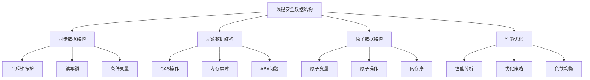

# 线程安全数据结构

## 📖 核心概念

**线程安全数据结构**是在多线程环境下能够安全访问和修改的数据结构。它们通过同步机制确保数据的一致性和完整性，避免竞态条件和数据损坏。

### 🏗️ 线程安全数据结构分类



## 🔧 线程安全数据结构实现

### 同步数据结构

```cpp
class ThreadSafeDataStructures {
private:
    mutex mtx;
    shared_mutex rwMtx;
    condition_variable cv;
    
public:
    // 线程安全栈
    class ThreadSafeStack {
    private:
        stack<int> data;
        mutex mtx;
        
    public:
        void push(int value) {
            lock_guard<mutex> lock(mtx);
            data.push(value);
        }
        
        bool pop(int& value) {
            lock_guard<mutex> lock(mtx);
            if (data.empty()) {
                return false;
            }
            value = data.top();
            data.pop();
            return true;
        }
        
        bool empty() {
            lock_guard<mutex> lock(mtx);
            return data.empty();
        }
        
        size_t size() {
            lock_guard<mutex> lock(mtx);
            return data.size();
        }
    };
    
    // 线程安全队列
    class ThreadSafeQueue {
    private:
        queue<int> data;
        mutex mtx;
        condition_variable cv;
        
    public:
        void push(int value) {
            lock_guard<mutex> lock(mtx);
            data.push(value);
            cv.notify_one();
        }
        
        bool pop(int& value, int timeoutMs = 0) {
            unique_lock<mutex> lock(mtx);
            
            if (timeoutMs > 0) {
                if (!cv.wait_for(lock, chrono::milliseconds(timeoutMs), [this] { return !data.empty(); })) {
                    return false;
                }
            } else {
                cv.wait(lock, [this] { return !data.empty(); });
            }
            
            value = data.front();
            data.pop();
            return true;
        }
        
        bool empty() {
            lock_guard<mutex> lock(mtx);
            return data.empty();
        }
        
        size_t size() {
            lock_guard<mutex> lock(mtx);
            return data.size();
        }
    };
    
    // 线程安全哈希表
    class ThreadSafeHashMap {
    private:
        unordered_map<string, int> data;
        shared_mutex rwMtx;
        
    public:
        void insert(const string& key, int value) {
            unique_lock<shared_mutex> lock(rwMtx);
            data[key] = value;
        }
        
        bool find(const string& key, int& value) {
            shared_lock<shared_mutex> lock(rwMtx);
            auto it = data.find(key);
            if (it != data.end()) {
                value = it->second;
                return true;
            }
            return false;
        }
        
        bool erase(const string& key) {
            unique_lock<shared_mutex> lock(rwMtx);
            return data.erase(key) > 0;
        }
        
        size_t size() {
            shared_lock<shared_mutex> lock(rwMtx);
            return data.size();
        }
    };
    
    // 线程安全链表
    class ThreadSafeList {
    private:
        list<int> data;
        mutex mtx;
        
    public:
        void push_front(int value) {
            lock_guard<mutex> lock(mtx);
            data.push_front(value);
        }
        
        void push_back(int value) {
            lock_guard<mutex> lock(mtx);
            data.push_back(value);
        }
        
        bool pop_front(int& value) {
            lock_guard<mutex> lock(mtx);
            if (data.empty()) {
                return false;
            }
            value = data.front();
            data.pop_front();
            return true;
        }
        
        bool pop_back(int& value) {
            lock_guard<mutex> lock(mtx);
            if (data.empty()) {
                return false;
            }
            value = data.back();
            data.pop_back();
            return true;
        }
        
        bool empty() {
            lock_guard<mutex> lock(mtx);
            return data.empty();
        }
        
        size_t size() {
            lock_guard<mutex> lock(mtx);
            return data.size();
        }
    };
    
    // 显示线程安全数据结构状态
    void displayStatus() {
        cout << "Thread Safe Data Structures Status:" << endl;
        cout << "=================================" << endl;
        
        cout << "Available structures:" << endl;
        cout << "  - ThreadSafeStack" << endl;
        cout << "  - ThreadSafeQueue" << endl;
        cout << "  - ThreadSafeHashMap" << endl;
        cout << "  - ThreadSafeList" << endl;
    }
};
```

### 无锁数据结构

```cpp
class LockFreeDataStructures {
private:
    atomic<int> atomicCounter;
    atomic<bool> atomicFlag;
    
public:
    // 无锁栈
    class LockFreeStack {
    private:
        struct Node {
            int data;
            Node* next;
            
            Node(int d) : data(d), next(nullptr) {}
        };
        
        atomic<Node*> head;
        
    public:
        LockFreeStack() : head(nullptr) {}
        
        void push(int value) {
            Node* newNode = new Node(value);
            Node* oldHead = head.load();
            
            do {
                newNode->next = oldHead;
            } while (!head.compare_exchange_weak(oldHead, newNode));
        }
        
        bool pop(int& value) {
            Node* oldHead = head.load();
            
            do {
                if (oldHead == nullptr) {
                    return false;
                }
            } while (!head.compare_exchange_weak(oldHead, oldHead->next));
            
            value = oldHead->data;
            delete oldHead;
            return true;
        }
        
        bool empty() {
            return head.load() == nullptr;
        }
    };
    
    // 无锁队列
    class LockFreeQueue {
    private:
        struct Node {
            atomic<int> data;
            atomic<Node*> next;
            
            Node() : data(0), next(nullptr) {}
        };
        
        atomic<Node*> head;
        atomic<Node*> tail;
        
    public:
        LockFreeQueue() {
            Node* dummy = new Node();
            head.store(dummy);
            tail.store(dummy);
        }
        
        void enqueue(int value) {
            Node* newNode = new Node();
            newNode->data.store(value);
            
            Node* oldTail = tail.load();
            Node* oldNext = oldTail->next.load();
            
            do {
                if (oldNext == nullptr) {
                    if (oldTail->next.compare_exchange_weak(oldNext, newNode)) {
                        break;
                    }
                } else {
                    tail.compare_exchange_weak(oldTail, oldNext);
                    oldNext = oldTail->next.load();
                }
            } while (true);
            
            tail.compare_exchange_weak(oldTail, newNode);
        }
        
        bool dequeue(int& value) {
            Node* oldHead = head.load();
            Node* oldTail = tail.load();
            Node* oldNext = oldHead->next.load();
            
            if (oldHead == oldTail) {
                if (oldNext == nullptr) {
                    return false;
                }
                tail.compare_exchange_weak(oldTail, oldNext);
            } else {
                if (oldNext == nullptr) {
                    return false;
                }
            }
            
            value = oldNext->data.load();
            head.compare_exchange_weak(oldHead, oldNext);
            delete oldHead;
            return true;
        }
        
        bool empty() {
            Node* oldHead = head.load();
            Node* oldTail = tail.load();
            Node* oldNext = oldHead->next.load();
            
            return (oldHead == oldTail) && (oldNext == nullptr);
        }
    };
    
    // 无锁计数器
    class LockFreeCounter {
    private:
        atomic<int> counter;
        
    public:
        LockFreeCounter() : counter(0) {}
        
        void increment() {
            counter.fetch_add(1);
        }
        
        void decrement() {
            counter.fetch_sub(1);
        }
        
        int get() {
            return counter.load();
        }
        
        void set(int value) {
            counter.store(value);
        }
        
        bool compareAndSet(int expected, int newValue) {
            return counter.compare_exchange_weak(expected, newValue);
        }
    };
    
    // 显示无锁数据结构状态
    void displayStatus() {
        cout << "Lock Free Data Structures Status:" << endl;
        cout << "===============================" << endl;
        
        cout << "Available structures:" << endl;
        cout << "  - LockFreeStack" << endl;
        cout << "  - LockFreeQueue" << endl;
        cout << "  - LockFreeCounter" << endl;
    }
};
```

### 原子数据结构

```cpp
class AtomicDataStructures {
private:
    atomic<int> atomicInt;
    atomic<bool> atomicBool;
    atomic<long long> atomicLong;
    
public:
    AtomicDataStructures() : atomicInt(0), atomicBool(false), atomicLong(0) {}
    
    // 原子整数操作
    void atomicIntOperations() {
        cout << "Atomic Integer Operations:" << endl;
        cout << "========================" << endl;
        
        // 基本操作
        atomicInt.store(10);
        cout << "Store 10: " << atomicInt.load() << endl;
        
        atomicInt.fetch_add(5);
        cout << "Fetch add 5: " << atomicInt.load() << endl;
        
        atomicInt.fetch_sub(3);
        cout << "Fetch sub 3: " << atomicInt.load() << endl;
        
        atomicInt.fetch_and(7);
        cout << "Fetch and 7: " << atomicInt.load() << endl;
        
        atomicInt.fetch_or(8);
        cout << "Fetch or 8: " << atomicInt.load() << endl;
        
        atomicInt.fetch_xor(4);
        cout << "Fetch xor 4: " << atomicInt.load() << endl;
        
        // CAS操作
        int expected = 12;
        bool success = atomicInt.compare_exchange_weak(expected, 20);
        cout << "CAS (12 -> 20): " << (success ? "Success" : "Failed") << endl;
        cout << "Current value: " << atomicInt.load() << endl;
    }
    
    // 原子布尔操作
    void atomicBoolOperations() {
        cout << "Atomic Boolean Operations:" << endl;
        cout << "========================" << endl;
        
        // 基本操作
        atomicBool.store(true);
        cout << "Store true: " << atomicBool.load() << endl;
        
        bool oldValue = atomicBool.exchange(false);
        cout << "Exchange false, old value: " << oldValue << endl;
        cout << "Current value: " << atomicBool.load() << endl;
        
        // CAS操作
        bool expected = false;
        bool success = atomicBool.compare_exchange_weak(expected, true);
        cout << "CAS (false -> true): " << (success ? "Success" : "Failed") << endl;
        cout << "Current value: " << atomicBool.load() << endl;
    }
    
    // 原子长整型操作
    void atomicLongOperations() {
        cout << "Atomic Long Operations:" << endl;
        cout << "=====================" << endl;
        
        // 基本操作
        atomicLong.store(1000000000LL);
        cout << "Store 1000000000: " << atomicLong.load() << endl;
        
        atomicLong.fetch_add(500000000LL);
        cout << "Fetch add 500000000: " << atomicLong.load() << endl;
        
        atomicLong.fetch_sub(200000000LL);
        cout << "Fetch sub 200000000: " << atomicLong.load() << endl;
        
        // CAS操作
        long long expected = 1300000000LL;
        bool success = atomicLong.compare_exchange_weak(expected, 2000000000LL);
        cout << "CAS (1300000000 -> 2000000000): " << (success ? "Success" : "Failed") << endl;
        cout << "Current value: " << atomicLong.load() << endl;
    }
    
    // 内存序操作
    void memoryOrderOperations() {
        cout << "Memory Order Operations:" << endl;
        cout << "======================" << endl;
        
        // 不同内存序
        atomicInt.store(1, memory_order_relaxed);
        cout << "Store with relaxed: " << atomicInt.load(memory_order_relaxed) << endl;
        
        atomicInt.store(2, memory_order_release);
        cout << "Store with release: " << atomicInt.load(memory_order_acquire) << endl;
        
        atomicInt.store(3, memory_order_seq_cst);
        cout << "Store with seq_cst: " << atomicInt.load(memory_order_seq_cst) << endl;
    }
    
    // 显示原子数据结构状态
    void displayStatus() {
        cout << "Atomic Data Structures Status:" << endl;
        cout << "============================" << endl;
        
        cout << "Atomic int: " << atomicInt.load() << endl;
        cout << "Atomic bool: " << atomicBool.load() << endl;
        cout << "Atomic long: " << atomicLong.load() << endl;
    }
};
```

## 🎯 线程安全数据结构应用

### 实际应用场景

```cpp
class ThreadSafeDataStructureApplications {
public:
    static void demonstrateApplications() {
        cout << "Thread Safe Data Structure Applications:" << endl;
        cout << "======================================" << endl;
        
        cout << "1. 多线程服务器:" << endl;
        cout << "   - 请求队列" << endl;
        cout << "   - 连接池" << endl;
        cout << "   - 会话管理" << endl;
        
        cout << "2. 并行计算:" << endl;
        cout << "   - 任务队列" << endl;
        cout << "   - 结果收集" << endl;
        cout << "   - 进度跟踪" << endl;
        
        cout << "3. 实时系统:" << endl;
        cout << "   - 事件队列" << endl;
        cout << "   - 状态管理" << endl;
        cout << "   - 数据缓存" << endl;
        
        cout << "4. 分布式系统:" << endl;
        cout << "   - 消息队列" << endl;
        cout << "   - 状态同步" << endl;
        cout << "   - 负载均衡" << endl;
    }
    
    static void analyzePerformance() {
        cout << "Thread Safe Data Structure Performance Analysis:" << endl;
        cout << "==============================================" << endl;
        
        cout << "1. 同步数据结构:" << endl;
        cout << "   - 优点: 实现简单，易于理解" << endl;
        cout << "   - 缺点: 性能开销大，可能产生死锁" << endl;
        cout << "   - 适用: 低并发场景" << endl;
        cout << endl;
        
        cout << "2. 无锁数据结构:" << endl;
        cout << "   - 优点: 高性能，无死锁" << endl;
        cout << "   - 缺点: 实现复杂，ABA问题" << endl;
        cout << "   - 适用: 高并发场景" << endl;
        cout << endl;
        
        cout << "3. 原子数据结构:" << endl;
        cout << "   - 优点: 高性能，简单易用" << endl;
        cout << "   - 缺点: 功能有限，内存开销" << endl;
        cout << "   - 适用: 简单并发场景" << endl;
    }
    
    static void selectDataStructure(bool needsHighPerformance, bool needsSimpleImplementation, bool needsComplexOperations) {
        cout << "Thread Safe Data Structure Selection:" << endl;
        cout << "===================================" << endl;
        
        cout << "Needs high performance: " << (needsHighPerformance ? "Yes" : "No") << endl;
        cout << "Needs simple implementation: " << (needsSimpleImplementation ? "Yes" : "No") << endl;
        cout << "Needs complex operations: " << (needsComplexOperations ? "Yes" : "No") << endl;
        
        cout << "Recommendation:" << endl;
        
        if (needsHighPerformance) {
            cout << "Use Lock-Free Data Structures (high performance)" << endl;
        } else if (needsSimpleImplementation) {
            cout << "Use Synchronized Data Structures (simple implementation)" << endl;
        } else if (needsComplexOperations) {
            cout << "Use Synchronized Data Structures (complex operations)" << endl;
        } else {
            cout << "Use Atomic Data Structures (simple operations)" << endl;
        }
    }
};
```

## 📊 线程安全数据结构分析

### 性能分析

```cpp
class ThreadSafeDataStructureAnalysis {
public:
    static void analyzePerformance() {
        cout << "Thread Safe Data Structure Performance Analysis:" << endl;
        cout << "==============================================" << endl;
        
        cout << "1. 时间复杂度:" << endl;
        cout << "   - 同步操作: O(1)" << endl;
        cout << "   - 无锁操作: O(1)" << endl;
        cout << "   - 原子操作: O(1)" << endl;
        
        cout << "2. 空间复杂度:" << endl;
        cout << "   - 同步结构: O(n)" << endl;
        cout << "   - 无锁结构: O(n)" << endl;
        cout << "   - 原子结构: O(1)" << endl;
        
        cout << "3. 性能特性:" << endl;
        cout << "   - 同步: 有锁竞争" << endl;
        cout << "   - 无锁: 无锁竞争" << endl;
        cout << "   - 原子: 硬件支持" << endl;
    }
    
    static void analyzeSpaceComplexity() {
        cout << "Thread Safe Data Structure Space Complexity Analysis:" << endl;
        cout << "=================================================" << endl;
        
        cout << "1. 同步数据结构:" << endl;
        cout << "   - 数据存储: O(n)" << endl;
        cout << "   - 同步对象: O(1)" << endl;
        cout << "   - 总空间: O(n)" << endl;
        
        cout << "2. 无锁数据结构:" << endl;
        cout << "   - 数据存储: O(n)" << endl;
        cout << "   - 原子指针: O(1)" << endl;
        cout << "   - 总空间: O(n)" << endl;
        
        cout << "3. 原子数据结构:" << endl;
        cout << "   - 原子变量: O(1)" << endl;
        cout << "   - 内存对齐: O(1)" << endl;
        cout << "   - 总空间: O(1)" << endl;
    }
    
    static void analyzeTimeComplexity() {
        cout << "Thread Safe Data Structure Time Complexity Analysis:" << endl;
        cout << "=================================================" << endl;
        
        cout << "1. 同步操作:" << endl;
        cout << "   - 加锁: O(1)" << endl;
        cout << "   - 操作: O(1)" << endl;
        cout << "   - 解锁: O(1)" << endl;
        
        cout << "2. 无锁操作:" << endl;
        cout << "   - CAS操作: O(1)" << endl;
        cout << "   - 重试: O(k)" << endl;
        cout << "   - 总时间: O(k)" << endl;
        
        cout << "3. 原子操作:" << endl;
        cout << "   - 原子操作: O(1)" << endl;
        cout << "   - 内存序: O(1)" << endl;
        cout << "   - 总时间: O(1)" << endl;
    }
};
```

## 🎮 线程安全数据结构测试

### 1. 基础功能测试

```cpp
class ThreadSafeDataStructureTest {
public:
    static void testSynchronizedDataStructures() {
        cout << "Testing Synchronized Data Structures:" << endl;
        cout << "===================================" << endl;
        
        ThreadSafeDataStructures tsds;
        
        // 测试线程安全栈
        ThreadSafeDataStructures::ThreadSafeStack tsStack;
        tsStack.push(1);
        tsStack.push(2);
        tsStack.push(3);
        
        int value;
        while (tsStack.pop(value)) {
            cout << "Popped: " << value << endl;
        }
        
        // 测试线程安全队列
        ThreadSafeDataStructures::ThreadSafeQueue tsQueue;
        tsQueue.push(10);
        tsQueue.push(20);
        tsQueue.push(30);
        
        while (tsQueue.pop(value)) {
            cout << "Dequeued: " << value << endl;
        }
        
        tsds.displayStatus();
    }
    
    static void testLockFreeDataStructures() {
        cout << "Testing Lock Free Data Structures:" << endl;
        cout << "================================" << endl;
        
        LockFreeDataStructures lfds;
        
        // 测试无锁栈
        LockFreeDataStructures::LockFreeStack lfStack;
        lfStack.push(1);
        lfStack.push(2);
        lfStack.push(3);
        
        int value;
        while (lfStack.pop(value)) {
            cout << "Popped: " << value << endl;
        }
        
        // 测试无锁队列
        LockFreeDataStructures::LockFreeQueue lfQueue;
        lfQueue.enqueue(10);
        lfQueue.enqueue(20);
        lfQueue.enqueue(30);
        
        while (lfQueue.dequeue(value)) {
            cout << "Dequeued: " << value << endl;
        }
        
        lfds.displayStatus();
    }
    
    static void testAtomicDataStructures() {
        cout << "Testing Atomic Data Structures:" << endl;
        cout << "=============================" << endl;
        
        AtomicDataStructures ads;
        
        ads.atomicIntOperations();
        ads.atomicBoolOperations();
        ads.atomicLongOperations();
        ads.memoryOrderOperations();
        
        ads.displayStatus();
    }
    
    static void testApplications() {
        cout << "Testing Applications:" << endl;
        cout << "==================" << endl;
        
        ThreadSafeDataStructureApplications::demonstrateApplications();
        ThreadSafeDataStructureApplications::analyzePerformance();
        ThreadSafeDataStructureApplications::selectDataStructure(true, false, false);
    }
    
    static void testAnalysis() {
        cout << "Testing Analysis:" << endl;
        cout << "===============" << endl;
        
        ThreadSafeDataStructureAnalysis::analyzePerformance();
        ThreadSafeDataStructureAnalysis::analyzeSpaceComplexity();
        ThreadSafeDataStructureAnalysis::analyzeTimeComplexity();
    }
};
```

## 🔗 相关链接

- [[01-并发编程基础|并发编程基础]]
- [[02-锁与无锁编程|锁与无锁编程]]
- [[03-分布式数据结构|分布式数据结构]]

## 💡 线程安全数据结构要点

1. **同步机制**: 使用锁保护共享数据
2. **无锁编程**: 使用CAS操作避免锁竞争
3. **原子操作**: 使用硬件支持的原子操作
4. **性能优化**: 根据场景选择合适的数据结构

---

*📝 线程安全数据结构提示：线程安全是并发编程的核心，需要根据性能需求和复杂度选择合适的实现方式*
