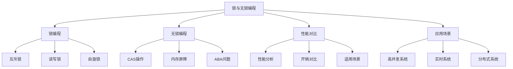

# 锁与无锁编程

## 📖 核心概念

**锁与无锁编程**是并发编程中的两种重要范式。锁编程通过同步机制保证线程安全，无锁编程通过原子操作和CAS实现高性能并发。

### 🏗️ 锁与无锁编程结构



## 🔧 锁编程实现

### 基础锁机制

```cpp
class LockProgramming {
private:
    mutex mtx;
    shared_mutex rwMtx;
    atomic<bool> spinLock;
    recursive_mutex recMtx;
    
public:
    LockProgramming() : spinLock(false) {}
    
    // 互斥锁示例
    void mutexExample() {
        cout << "Mutex Example:" << endl;
        cout << "=============" << endl;
        
        vector<thread> threads;
        for (int i = 0; i < 5; i++) {
            threads.emplace_back([this, i]() {
                lock_guard<mutex> lock(mtx);
                cout << "Thread " << i << " acquired mutex" << endl;
                this_thread::sleep_for(chrono::milliseconds(100));
                cout << "Thread " << i << " released mutex" << endl;
            });
        }
        
        for (auto& thread : threads) {
            thread.join();
        }
    }
    
    // 读写锁示例
    void readWriteLockExample() {
        cout << "Read Write Lock Example:" << endl;
        cout << "======================" << endl;
        
        vector<thread> readers;
        vector<thread> writers;
        
        // 读者线程
        for (int i = 0; i < 3; i++) {
            readers.emplace_back([this, i]() {
                shared_lock<shared_mutex> lock(rwMtx);
                cout << "Reader " << i << " acquired read lock" << endl;
                this_thread::sleep_for(chrono::milliseconds(100));
                cout << "Reader " << i << " released read lock" << endl;
            });
        }
        
        // 写者线程
        for (int i = 0; i < 2; i++) {
            writers.emplace_back([this, i]() {
                unique_lock<shared_mutex> lock(rwMtx);
                cout << "Writer " << i << " acquired write lock" << endl;
                this_thread::sleep_for(chrono::milliseconds(100));
                cout << "Writer " << i << " released write lock" << endl;
            });
        }
        
        for (auto& thread : readers) {
            thread.join();
        }
        for (auto& thread : writers) {
            thread.join();
        }
    }
    
    // 自旋锁示例
    void spinLockExample() {
        cout << "Spin Lock Example:" << endl;
        cout << "================" << endl;
        
        vector<thread> threads;
        for (int i = 0; i < 5; i++) {
            threads.emplace_back([this, i]() {
                // 自旋等待
                while (spinLock.exchange(true)) {
                    this_thread::yield();
                }
                
                cout << "Thread " << i << " acquired spin lock" << endl;
                this_thread::sleep_for(chrono::milliseconds(50));
                cout << "Thread " << i << " released spin lock" << endl;
                
                spinLock.store(false);
            });
        }
        
        for (auto& thread : threads) {
            thread.join();
        }
    }
    
    // 递归锁示例
    void recursiveLockExample() {
        cout << "Recursive Lock Example:" << endl;
        cout << "=====================" << endl;
        
        function<void(int)> recursiveFunction = [&](int depth) {
            lock_guard<recursive_mutex> lock(recMtx);
            cout << "Recursive call at depth " << depth << endl;
            
            if (depth > 0) {
                recursiveFunction(depth - 1);
            }
        };
        
        vector<thread> threads;
        for (int i = 0; i < 3; i++) {
            threads.emplace_back([&, i]() {
                recursiveFunction(3);
            });
        }
        
        for (auto& thread : threads) {
            thread.join();
        }
    }
    
    // 显示锁编程状态
    void displayStatus() {
        cout << "Lock Programming Status:" << endl;
        cout << "======================" << endl;
        
        cout << "Available locks:" << endl;
        cout << "  - Mutex" << endl;
        cout << "  - Read Write Lock" << endl;
        cout << "  - Spin Lock" << endl;
        cout << "  - Recursive Lock" << endl;
    }
};
```

### 高级锁机制

```cpp
class AdvancedLockProgramming {
private:
    mutex mtx;
    condition_variable cv;
    atomic<int> counter;
    
public:
    AdvancedLockProgramming() : counter(0) {}
    
    // 条件变量示例
    void conditionVariableExample() {
        cout << "Condition Variable Example:" << endl;
        cout << "=========================" << endl;
        
        vector<thread> threads;
        for (int i = 0; i < 3; i++) {
            threads.emplace_back([this, i]() {
                unique_lock<mutex> lock(mtx);
                cv.wait(lock, [this] { return counter.load() > 0; });
                cout << "Thread " << i << " woke up" << endl;
            });
        }
        
        // 唤醒所有等待的线程
        this_thread::sleep_for(chrono::milliseconds(100));
        {
            lock_guard<mutex> lock(mtx);
            counter++;
        }
        cv.notify_all();
        
        for (auto& thread : threads) {
            thread.join();
        }
    }
    
    // 生产者消费者示例
    void producerConsumerExample() {
        cout << "Producer Consumer Example:" << endl;
        cout << "========================" << endl;
        
        queue<int> buffer;
        const int maxSize = 5;
        
        vector<thread> producers;
        vector<thread> consumers;
        
        // 生产者线程
        for (int i = 0; i < 2; i++) {
            producers.emplace_back([&, i]() {
                for (int j = 0; j < 5; j++) {
                    unique_lock<mutex> lock(mtx);
                    cv.wait(lock, [&] { return buffer.size() < maxSize; });
                    
                    buffer.push(i * 5 + j);
                    cout << "Producer " << i << " produced " << (i * 5 + j) << endl;
                    
                    cv.notify_all();
                }
            });
        }
        
        // 消费者线程
        for (int i = 0; i < 2; i++) {
            consumers.emplace_back([&, i]() {
                for (int j = 0; j < 5; j++) {
                    unique_lock<mutex> lock(mtx);
                    cv.wait(lock, [&] { return !buffer.empty(); });
                    
                    int value = buffer.front();
                    buffer.pop();
                    cout << "Consumer " << i << " consumed " << value << endl;
                    
                    cv.notify_all();
                }
            });
        }
        
        for (auto& thread : producers) {
            thread.join();
        }
        for (auto& thread : consumers) {
            thread.join();
        }
    }
    
    // 死锁检测示例
    void deadlockDetectionExample() {
        cout << "Deadlock Detection Example:" << endl;
        cout << "=========================" << endl;
        
        mutex mtx1, mtx2;
        
        vector<thread> threads;
        
        // 线程1：先获取mtx1，再获取mtx2
        threads.emplace_back([&]() {
            lock_guard<mutex> lock1(mtx1);
            cout << "Thread 1 acquired mtx1" << endl;
            this_thread::sleep_for(chrono::milliseconds(100));
            
            lock_guard<mutex> lock2(mtx2);
            cout << "Thread 1 acquired mtx2" << endl;
        });
        
        // 线程2：先获取mtx2，再获取mtx1
        threads.emplace_back([&]() {
            lock_guard<mutex> lock2(mtx2);
            cout << "Thread 2 acquired mtx2" << endl;
            this_thread::sleep_for(chrono::milliseconds(100));
            
            lock_guard<mutex> lock1(mtx1);
            cout << "Thread 2 acquired mtx1" << endl;
        });
        
        for (auto& thread : threads) {
            thread.join();
        }
    }
    
    // 显示高级锁编程状态
    void displayStatus() {
        cout << "Advanced Lock Programming Status:" << endl;
        cout << "==============================" << endl;
        
        cout << "Available mechanisms:" << endl;
        cout << "  - Condition Variable" << endl;
        cout << "  - Producer Consumer" << endl;
        cout << "  - Deadlock Detection" << endl;
    }
};
```

## 🔧 无锁编程实现

### 基础无锁机制

```cpp
class LockFreeProgramming {
private:
    atomic<int> atomicCounter;
    atomic<bool> atomicFlag;
    
public:
    LockFreeProgramming() : atomicCounter(0), atomicFlag(false) {}
    
    // CAS操作示例
    void casExample() {
        cout << "CAS Example:" << endl;
        cout << "===========" << endl;
        
        vector<thread> threads;
        for (int i = 0; i < 10; i++) {
            threads.emplace_back([this]() {
                for (int j = 0; j < 1000; j++) {
                    int expected = atomicCounter.load();
                    int desired = expected + 1;
                    
                    while (!atomicCounter.compare_exchange_weak(expected, desired)) {
                        desired = expected + 1;
                    }
                }
            });
        }
        
        for (auto& thread : threads) {
            thread.join();
        }
        
        cout << "Final counter value: " << atomicCounter.load() << endl;
    }
    
    // 无锁栈示例
    void lockFreeStackExample() {
        cout << "Lock Free Stack Example:" << endl;
        cout << "======================" << endl;
        
        struct Node {
            int data;
            Node* next;
            
            Node(int d) : data(d), next(nullptr) {}
        };
        
        atomic<Node*> head(nullptr);
        
        vector<thread> threads;
        
        // 生产者线程
        for (int i = 0; i < 3; i++) {
            threads.emplace_back([&, i]() {
                for (int j = 0; j < 5; j++) {
                    Node* newNode = new Node(i * 5 + j);
                    Node* oldHead = head.load();
                    
                    do {
                        newNode->next = oldHead;
                    } while (!head.compare_exchange_weak(oldHead, newNode));
                    
                    cout << "Pushed: " << (i * 5 + j) << endl;
                }
            });
        }
        
        // 消费者线程
        for (int i = 0; i < 2; i++) {
            threads.emplace_back([&, i]() {
                for (int j = 0; j < 7; j++) {
                    Node* oldHead = head.load();
                    
                    do {
                        if (oldHead == nullptr) {
                            break;
                        }
                    } while (!head.compare_exchange_weak(oldHead, oldHead->next));
                    
                    if (oldHead != nullptr) {
                        cout << "Popped: " << oldHead->data << endl;
                        delete oldHead;
                    }
                }
            });
        }
        
        for (auto& thread : threads) {
            thread.join();
        }
    }
    
    // 无锁队列示例
    void lockFreeQueueExample() {
        cout << "Lock Free Queue Example:" << endl;
        cout << "======================" << endl;
        
        struct Node {
            atomic<int> data;
            atomic<Node*> next;
            
            Node() : data(0), next(nullptr) {}
        };
        
        atomic<Node*> head(new Node());
        atomic<Node*> tail(head.load());
        
        vector<thread> threads;
        
        // 生产者线程
        for (int i = 0; i < 2; i++) {
            threads.emplace_back([&, i]() {
                for (int j = 0; j < 5; j++) {
                    Node* newNode = new Node();
                    newNode->data.store(i * 5 + j);
                    
                    Node* oldTail = tail.load();
                    Node* oldNext = oldTail->next.load();
                    
                    do {
                        if (oldNext == nullptr) {
                            if (oldTail->next.compare_exchange_weak(oldNext, newNode)) {
                                break;
                            }
                        } else {
                            tail.compare_exchange_weak(oldTail, oldNext);
                            oldNext = oldTail->next.load();
                        }
                    } while (true);
                    
                    tail.compare_exchange_weak(oldTail, newNode);
                    cout << "Enqueued: " << (i * 5 + j) << endl;
                }
            });
        }
        
        // 消费者线程
        for (int i = 0; i < 2; i++) {
            threads.emplace_back([&, i]() {
                for (int j = 0; j < 5; j++) {
                    Node* oldHead = head.load();
                    Node* oldTail = tail.load();
                    Node* oldNext = oldHead->next.load();
                    
                    if (oldHead == oldTail) {
                        if (oldNext == nullptr) {
                            continue;
                        }
                        tail.compare_exchange_weak(oldTail, oldNext);
                    } else {
                        if (oldNext == nullptr) {
                            continue;
                        }
                    }
                    
                    int value = oldNext->data.load();
                    head.compare_exchange_weak(oldHead, oldNext);
                    delete oldHead;
                    cout << "Dequeued: " << value << endl;
                }
            });
        }
        
        for (auto& thread : threads) {
            thread.join();
        }
    }
    
    // 显示无锁编程状态
    void displayStatus() {
        cout << "Lock Free Programming Status:" << endl;
        cout << "==========================" << endl;
        
        cout << "Available mechanisms:" << endl;
        cout << "  - CAS Operations" << endl;
        cout << "  - Lock Free Stack" << endl;
        cout << "  - Lock Free Queue" << endl;
    }
};
```

### 高级无锁机制

```cpp
class AdvancedLockFreeProgramming {
private:
    atomic<int> atomicCounter;
    atomic<bool> atomicFlag;
    
public:
    AdvancedLockFreeProgramming() : atomicCounter(0), atomicFlag(false) {}
    
    // 内存屏障示例
    void memoryBarrierExample() {
        cout << "Memory Barrier Example:" << endl;
        cout << "=====================" << endl;
        
        atomic<int> data(0);
        atomic<bool> ready(false);
        
        vector<thread> threads;
        
        // 写者线程
        threads.emplace_back([&]() {
            data.store(42, memory_order_relaxed);
            ready.store(true, memory_order_release);
            cout << "Writer: Data written" << endl;
        });
        
        // 读者线程
        threads.emplace_back([&]() {
            while (!ready.load(memory_order_acquire)) {
                this_thread::yield();
            }
            cout << "Reader: Data = " << data.load(memory_order_relaxed) << endl;
        });
        
        for (auto& thread : threads) {
            thread.join();
        }
    }
    
    // ABA问题示例
    void abaProblemExample() {
        cout << "ABA Problem Example:" << endl;
        cout << "==================" << endl;
        
        atomic<int*> ptr(nullptr);
        
        vector<thread> threads;
        
        // 线程1：修改指针
        threads.emplace_back([&]() {
            int* newPtr = new int(42);
            int* oldPtr = nullptr;
            
            if (ptr.compare_exchange_weak(oldPtr, newPtr)) {
                cout << "Thread 1: Pointer set to " << *newPtr << endl;
            }
        });
        
        // 线程2：修改指针
        threads.emplace_back([&]() {
            int* newPtr = new int(24);
            int* oldPtr = nullptr;
            
            if (ptr.compare_exchange_weak(oldPtr, newPtr)) {
                cout << "Thread 2: Pointer set to " << *newPtr << endl;
            }
        });
        
        for (auto& thread : threads) {
            thread.join();
        }
    }
    
    // 无锁计数器示例
    void lockFreeCounterExample() {
        cout << "Lock Free Counter Example:" << endl;
        cout << "========================" << endl;
        
        vector<thread> threads;
        for (int i = 0; i < 10; i++) {
            threads.emplace_back([this]() {
                for (int j = 0; j < 1000; j++) {
                    atomicCounter.fetch_add(1);
                }
            });
        }
        
        for (auto& thread : threads) {
            thread.join();
        }
        
        cout << "Final counter value: " << atomicCounter.load() << endl;
    }
    
    // 显示高级无锁编程状态
    void displayStatus() {
        cout << "Advanced Lock Free Programming Status:" << endl;
        cout << "===================================" << endl;
        
        cout << "Available mechanisms:" << endl;
        cout << "  - Memory Barriers" << endl;
        cout << "  - ABA Problem" << endl;
        cout << "  - Lock Free Counter" << endl;
    }
};
```

## 🎯 锁与无锁编程应用

### 实际应用场景

```cpp
class LockFreeProgrammingApplications {
public:
    static void demonstrateApplications() {
        cout << "Lock & Lock Free Programming Applications:" << endl;
        cout << "=======================================" << endl;
        
        cout << "1. 高并发系统:" << endl;
        cout << "   - 无锁数据结构" << endl;
        cout << "   - 原子操作" << endl;
        cout << "   - 内存屏障" << endl;
        
        cout << "2. 实时系统:" << endl;
        cout << "   - 低延迟要求" << endl;
        cout << "   - 可预测性能" << endl;
        cout << "   - 无阻塞操作" << endl;
        
        cout << "3. 分布式系统:" << endl;
        cout << "   - 分布式锁" << endl;
        cout << "   - 一致性协议" << endl;
        cout << "   - 故障恢复" << endl;
        
        cout << "4. 数据库系统:" << endl;
        cout << "   - 事务处理" << endl;
        cout << "   - 并发控制" << endl;
        cout << "   - 性能优化" << endl;
    }
    
    static void analyzePerformance() {
        cout << "Lock & Lock Free Programming Performance Analysis:" << endl;
        cout << "===============================================" << endl;
        
        cout << "1. 锁编程:" << endl;
        cout << "   - 优点: 实现简单，易于理解" << endl;
        cout << "   - 缺点: 性能开销大，可能产生死锁" << endl;
        cout << "   - 适用: 低并发场景" << endl;
        cout << endl;
        
        cout << "2. 无锁编程:" << endl;
        cout << "   - 优点: 高性能，无死锁" << endl;
        cout << "   - 缺点: 实现复杂，ABA问题" << endl;
        cout << "   - 适用: 高并发场景" << endl;
        cout << endl;
        
        cout << "3. 性能对比:" << endl;
        cout << "   - 锁: 有锁竞争，性能下降" << endl;
        cout << "   - 无锁: 无锁竞争，性能稳定" << endl;
        cout << "   - 选择: 根据场景决定" << endl;
    }
    
    static void selectProgrammingModel(bool needsHighPerformance, bool needsSimpleImplementation, bool needsRealTime) {
        cout << "Programming Model Selection:" << endl;
        cout << "=========================" << endl;
        
        cout << "Needs high performance: " << (needsHighPerformance ? "Yes" : "No") << endl;
        cout << "Needs simple implementation: " << (needsSimpleImplementation ? "Yes" : "No") << endl;
        cout << "Needs real time: " << (needsRealTime ? "Yes" : "No") << endl;
        
        cout << "Recommendation:" << endl;
        
        if (needsHighPerformance) {
            cout << "Use Lock Free Programming (high performance)" << endl;
        } else if (needsSimpleImplementation) {
            cout << "Use Lock Programming (simple implementation)" << endl;
        } else if (needsRealTime) {
            cout << "Use Lock Free Programming (real time)" << endl;
        } else {
            cout << "Use Lock Programming (general purpose)" << endl;
        }
    }
};
```

## 📊 锁与无锁编程分析

### 性能分析

```cpp
class LockFreeProgrammingAnalysis {
public:
    static void analyzePerformance() {
        cout << "Lock & Lock Free Programming Performance Analysis:" << endl;
        cout << "===============================================" << endl;
        
        cout << "1. 时间复杂度:" << endl;
        cout << "   - 锁操作: O(1)" << endl;
        cout << "   - 无锁操作: O(1)" << endl;
        cout << "   - CAS操作: O(1)" << endl;
        
        cout << "2. 空间复杂度:" << endl;
        cout << "   - 锁: O(1)" << endl;
        cout << "   - 无锁: O(1)" << endl;
        cout << "   - 原子: O(1)" << endl;
        
        cout << "3. 性能特性:" << endl;
        cout << "   - 锁: 有锁竞争" << endl;
        cout << "   - 无锁: 无锁竞争" << endl;
        cout << "   - 原子: 硬件支持" << endl;
    }
    
    static void analyzeSpaceComplexity() {
        cout << "Lock & Lock Free Programming Space Complexity Analysis:" << endl;
        cout << "===================================================" << endl;
        
        cout << "1. 锁编程:" << endl;
        cout << "   - 锁对象: O(1)" << endl;
        cout << "   - 同步对象: O(1)" << endl;
        cout << "   - 总空间: O(1)" << endl;
        
        cout << "2. 无锁编程:" << endl;
        cout << "   - 原子变量: O(1)" << endl;
        cout << "   - 内存屏障: O(1)" << endl;
        cout << "   - 总空间: O(1)" << endl;
        
        cout << "3. 空间效率:" << endl;
        cout << "   - 两者空间效率相当" << endl;
        cout << "   - 无锁编程常数更小" << endl;
        cout << "   - 锁编程功能更丰富" << endl;
    }
    
    static void analyzeTimeComplexity() {
        cout << "Lock & Lock Free Programming Time Complexity Analysis:" << endl;
        cout << "===================================================" << endl;
        
        cout << "1. 锁操作:" << endl;
        cout << "   - 加锁: O(1)" << endl;
        cout << "   - 操作: O(1)" << endl;
        cout << "   - 解锁: O(1)" << endl;
        
        cout << "2. 无锁操作:" << endl;
        cout << "   - CAS操作: O(1)" << endl;
        cout << "   - 重试: O(k)" << endl;
        cout << "   - 总时间: O(k)" << endl;
        
        cout << "3. 性能对比:" << endl;
        cout << "   - 锁: 有锁竞争，性能下降" << endl;
        cout << "   - 无锁: 无锁竞争，性能稳定" << endl;
        cout << "   - 选择: 根据场景决定" << endl;
    }
};
```

## 🎮 锁与无锁编程测试

### 1. 基础功能测试

```cpp
class LockFreeProgrammingTest {
public:
    static void testLockProgramming() {
        cout << "Testing Lock Programming:" << endl;
        cout << "=======================" << endl;
        
        LockProgramming lp;
        
        lp.mutexExample();
        lp.readWriteLockExample();
        lp.spinLockExample();
        lp.recursiveLockExample();
        
        lp.displayStatus();
    }
    
    static void testAdvancedLockProgramming() {
        cout << "Testing Advanced Lock Programming:" << endl;
        cout << "===============================" << endl;
        
        AdvancedLockProgramming alp;
        
        alp.conditionVariableExample();
        alp.producerConsumerExample();
        alp.deadlockDetectionExample();
        
        alp.displayStatus();
    }
    
    static void testLockFreeProgramming() {
        cout << "Testing Lock Free Programming:" << endl;
        cout << "============================" << endl;
        
        LockFreeProgramming lfp;
        
        lfp.casExample();
        lfp.lockFreeStackExample();
        lfp.lockFreeQueueExample();
        
        lfp.displayStatus();
    }
    
    static void testAdvancedLockFreeProgramming() {
        cout << "Testing Advanced Lock Free Programming:" << endl;
        cout << "====================================" << endl;
        
        AdvancedLockFreeProgramming alfp;
        
        alfp.memoryBarrierExample();
        alfp.abaProblemExample();
        alfp.lockFreeCounterExample();
        
        alfp.displayStatus();
    }
    
    static void testApplications() {
        cout << "Testing Applications:" << endl;
        cout << "==================" << endl;
        
        LockFreeProgrammingApplications::demonstrateApplications();
        LockFreeProgrammingApplications::analyzePerformance();
        LockFreeProgrammingApplications::selectProgrammingModel(true, false, false);
    }
    
    static void testAnalysis() {
        cout << "Testing Analysis:" << endl;
        cout << "===============" << endl;
        
        LockFreeProgrammingAnalysis::analyzePerformance();
        LockFreeProgrammingAnalysis::analyzeSpaceComplexity();
        LockFreeProgrammingAnalysis::analyzeTimeComplexity();
    }
};
```

## 🔗 相关链接

- [[01-并发编程基础|并发编程基础]]
- [[02-线程安全数据结构|线程安全数据结构]]
- [[03-分布式数据结构|分布式数据结构]]

## 💡 锁与无锁编程要点

1. **锁编程**: 实现简单，但性能开销大
2. **无锁编程**: 性能高，但实现复杂
3. **CAS操作**: 无锁编程的核心机制
4. **ABA问题**: 无锁编程需要解决的问题

---

*📝 锁与无锁编程提示：锁编程和无锁编程各有优势，需要根据性能需求和实现复杂度选择合适的方案*
