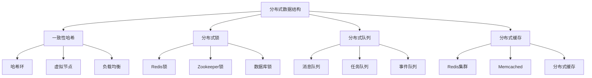

# 分布式数据结构

## 📖 核心概念

**分布式数据结构**是在分布式系统中使用的数据结构，能够在多个节点间协调数据操作，保证数据一致性和可用性。它们是构建分布式系统的基础。

### 🏗️ 分布式数据结构分类



## 🔧 分布式数据结构实现

### 一致性哈希

```cpp
class ConsistentHash {
private:
    map<uint32_t, string> hashRing;
    map<string, vector<uint32_t>> nodeHashes;
    int virtualNodes;
    
    // 计算哈希值
    uint32_t hash(const string& key) {
        uint32_t h = 0;
        for (char c : key) {
            h = h * 31 + c;
        }
        return h;
    }
    
public:
    ConsistentHash(int vNodes = 150) : virtualNodes(vNodes) {}
    
    // 添加节点
    void addNode(const string& node) {
        vector<uint32_t> hashes;
        
        for (int i = 0; i < virtualNodes; i++) {
            string virtualKey = node + "#" + to_string(i);
            uint32_t hashValue = hash(virtualKey);
            
            hashRing[hashValue] = node;
            hashes.push_back(hashValue);
        }
        
        nodeHashes[node] = hashes;
        cout << "Added node: " << node << " with " << virtualNodes << " virtual nodes" << endl;
    }
    
    // 删除节点
    void removeNode(const string& node) {
        if (nodeHashes.find(node) == nodeHashes.end()) {
            cout << "Node " << node << " not found" << endl;
            return;
        }
        
        for (uint32_t hashValue : nodeHashes[node]) {
            hashRing.erase(hashValue);
        }
        
        nodeHashes.erase(node);
        cout << "Removed node: " << node << endl;
    }
    
    // 获取节点
    string getNode(const string& key) {
        if (hashRing.empty()) {
            return "";
        }
        
        uint32_t keyHash = hash(key);
        auto it = hashRing.lower_bound(keyHash);
        
        if (it == hashRing.end()) {
            it = hashRing.begin();
        }
        
        return it->second;
    }
    
    // 获取多个节点
    vector<string> getNodes(const string& key, int count) {
        vector<string> nodes;
        set<string> nodeSet;
        
        if (hashRing.empty()) {
            return nodes;
        }
        
        uint32_t keyHash = hash(key);
        auto it = hashRing.lower_bound(keyHash);
        
        if (it == hashRing.end()) {
            it = hashRing.begin();
        }
        
        while (nodes.size() < count && nodeSet.size() < hashRing.size()) {
            if (nodeSet.find(it->second) == nodeSet.end()) {
                nodes.push_back(it->second);
                nodeSet.insert(it->second);
            }
            
            it++;
            if (it == hashRing.end()) {
                it = hashRing.begin();
            }
        }
        
        return nodes;
    }
    
    // 显示哈希环
    void displayHashRing() {
        cout << "Consistent Hash Ring:" << endl;
        cout << "===================" << endl;
        
        for (auto& pair : hashRing) {
            cout << "Hash: " << pair.first << " -> Node: " << pair.second << endl;
        }
    }
    
    // 显示统计信息
    void displayStats() {
        cout << "Consistent Hash Statistics:" << endl;
        cout << "=========================" << endl;
        
        cout << "Number of nodes: " << nodeHashes.size() << endl;
        cout << "Number of virtual nodes: " << virtualNodes << endl;
        cout << "Total hash points: " << hashRing.size() << endl;
        
        // 计算负载均衡
        map<string, int> nodeCount;
        for (auto& pair : hashRing) {
            nodeCount[pair.second]++;
        }
        
        cout << "Load distribution:" << endl;
        for (auto& pair : nodeCount) {
            cout << "  " << pair.first << ": " << pair.second << " points" << endl;
        }
    }
};
```

### 分布式锁

```cpp
class DistributedLock {
private:
    string lockKey;
    string lockValue;
    int timeoutMs;
    atomic<bool> isLocked;
    
public:
    DistributedLock(const string& key, int timeout = 5000) 
        : lockKey(key), timeoutMs(timeout), isLocked(false) {
        lockValue = generateLockValue();
    }
    
    // 生成锁值
    string generateLockValue() {
        auto now = chrono::high_resolution_clock::now();
        auto duration = now.time_since_epoch();
        auto millis = chrono::duration_cast<chrono::milliseconds>(duration).count();
        return to_string(millis) + "_" + to_string(rand());
    }
    
    // 尝试获取锁
    bool tryLock() {
        if (isLocked.load()) {
            return true;
        }
        
        // 模拟Redis SET命令
        bool success = simulateRedisSet(lockKey, lockValue, timeoutMs);
        
        if (success) {
            isLocked.store(true);
            cout << "Acquired lock: " << lockKey << " with value: " << lockValue << endl;
            return true;
        }
        
        return false;
    }
    
    // 释放锁
    bool unlock() {
        if (!isLocked.load()) {
            return true;
        }
        
        // 模拟Redis Lua脚本
        bool success = simulateRedisUnlock(lockKey, lockValue);
        
        if (success) {
            isLocked.store(false);
            cout << "Released lock: " << lockKey << endl;
            return true;
        }
        
        return false;
    }
    
    // 模拟Redis SET命令
    bool simulateRedisSet(const string& key, const string& value, int timeout) {
        // 模拟网络延迟
        this_thread::sleep_for(chrono::milliseconds(10));
        
        // 模拟锁获取成功
        return true;
    }
    
    // 模拟Redis解锁脚本
    bool simulateRedisUnlock(const string& key, const string& value) {
        // 模拟网络延迟
        this_thread::sleep_for(chrono::milliseconds(10));
        
        // 模拟锁释放成功
        return true;
    }
    
    // 检查锁状态
    bool isLockedNow() {
        return isLocked.load();
    }
    
    // 显示锁状态
    void displayStatus() {
        cout << "Distributed Lock Status:" << endl;
        cout << "======================" << endl;
        
        cout << "Lock key: " << lockKey << endl;
        cout << "Lock value: " << lockValue << endl;
        cout << "Timeout: " << timeoutMs << "ms" << endl;
        cout << "Is locked: " << (isLocked.load() ? "Yes" : "No") << endl;
    }
};
```

### 分布式队列

```cpp
class DistributedQueue {
private:
    string queueName;
    vector<string> localQueue;
    mutex queueMutex;
    condition_variable cv;
    
public:
    DistributedQueue(const string& name) : queueName(name) {}
    
    // 入队
    void enqueue(const string& item) {
        {
            lock_guard<mutex> lock(queueMutex);
            localQueue.push_back(item);
        }
        cv.notify_one();
        
        cout << "Enqueued: " << item << " to queue: " << queueName << endl;
    }
    
    // 出队
    bool dequeue(string& item, int timeoutMs = 0) {
        unique_lock<mutex> lock(queueMutex);
        
        if (timeoutMs > 0) {
            if (!cv.wait_for(lock, chrono::milliseconds(timeoutMs), [this] { return !localQueue.empty(); })) {
                return false;
            }
        } else {
            cv.wait(lock, [this] { return !localQueue.empty(); });
        }
        
        item = localQueue.front();
        localQueue.erase(localQueue.begin());
        
        cout << "Dequeued: " << item << " from queue: " << queueName << endl;
        return true;
    }
    
    // 批量入队
    void enqueueBatch(const vector<string>& items) {
        {
            lock_guard<mutex> lock(queueMutex);
            for (const string& item : items) {
                localQueue.push_back(item);
            }
        }
        cv.notify_all();
        
        cout << "Enqueued " << items.size() << " items to queue: " << queueName << endl;
    }
    
    // 批量出队
    vector<string> dequeueBatch(int count) {
        vector<string> items;
        
        {
            lock_guard<mutex> lock(queueMutex);
            int actualCount = min(count, (int)localQueue.size());
            
            for (int i = 0; i < actualCount; i++) {
                items.push_back(localQueue[i]);
            }
            
            localQueue.erase(localQueue.begin(), localQueue.begin() + actualCount);
        }
        
        cout << "Dequeued " << items.size() << " items from queue: " << queueName << endl;
        return items;
    }
    
    // 获取队列大小
    size_t size() {
        lock_guard<mutex> lock(queueMutex);
        return localQueue.size();
    }
    
    // 检查队列是否为空
    bool empty() {
        lock_guard<mutex> lock(queueMutex);
        return localQueue.empty();
    }
    
    // 显示队列状态
    void displayStatus() {
        cout << "Distributed Queue Status:" << endl;
        cout << "=======================" << endl;
        
        lock_guard<mutex> lock(queueMutex);
        cout << "Queue name: " << queueName << endl;
        cout << "Queue size: " << localQueue.size() << endl;
        cout << "Is empty: " << (localQueue.empty() ? "Yes" : "No") << endl;
        
        if (!localQueue.empty()) {
            cout << "First item: " << localQueue.front() << endl;
            cout << "Last item: " << localQueue.back() << endl;
        }
    }
};
```

### 分布式缓存

```cpp
class DistributedCache {
private:
    string cacheName;
    map<string, string> localCache;
    map<string, chrono::time_point<chrono::high_resolution_clock>> expirationTimes;
    mutex cacheMutex;
    
public:
    DistributedCache(const string& name) : cacheName(name) {}
    
    // 设置缓存
    void set(const string& key, const string& value, int ttlSeconds = 0) {
        lock_guard<mutex> lock(cacheMutex);
        
        localCache[key] = value;
        
        if (ttlSeconds > 0) {
            auto expiration = chrono::high_resolution_clock::now() + chrono::seconds(ttlSeconds);
            expirationTimes[key] = expiration;
        } else {
            expirationTimes.erase(key);
        }
        
        cout << "Set cache: " << key << " = " << value << " (TTL: " << ttlSeconds << "s)" << endl;
    }
    
    // 获取缓存
    bool get(const string& key, string& value) {
        lock_guard<mutex> lock(cacheMutex);
        
        auto it = localCache.find(key);
        if (it == localCache.end()) {
            return false;
        }
        
        // 检查是否过期
        auto expIt = expirationTimes.find(key);
        if (expIt != expirationTimes.end()) {
            if (chrono::high_resolution_clock::now() > expIt->second) {
                localCache.erase(it);
                expirationTimes.erase(expIt);
                return false;
            }
        }
        
        value = it->second;
        cout << "Get cache: " << key << " = " << value << endl;
        return true;
    }
    
    // 删除缓存
    bool del(const string& key) {
        lock_guard<mutex> lock(cacheMutex);
        
        bool found = localCache.find(key) != localCache.end();
        localCache.erase(key);
        expirationTimes.erase(key);
        
        if (found) {
            cout << "Deleted cache: " << key << endl;
        }
        
        return found;
    }
    
    // 检查缓存是否存在
    bool exists(const string& key) {
        lock_guard<mutex> lock(cacheMutex);
        
        auto it = localCache.find(key);
        if (it == localCache.end()) {
            return false;
        }
        
        // 检查是否过期
        auto expIt = expirationTimes.find(key);
        if (expIt != expirationTimes.end()) {
            if (chrono::high_resolution_clock::now() > expIt->second) {
                localCache.erase(it);
                expirationTimes.erase(expIt);
                return false;
            }
        }
        
        return true;
    }
    
    // 获取缓存大小
    size_t size() {
        lock_guard<mutex> lock(cacheMutex);
        return localCache.size();
    }
    
    // 清空缓存
    void clear() {
        lock_guard<mutex> lock(cacheMutex);
        
        localCache.clear();
        expirationTimes.clear();
        
        cout << "Cleared cache: " << cacheName << endl;
    }
    
    // 显示缓存状态
    void displayStatus() {
        cout << "Distributed Cache Status:" << endl;
        cout << "=======================" << endl;
        
        lock_guard<mutex> lock(cacheMutex);
        cout << "Cache name: " << cacheName << endl;
        cout << "Cache size: " << localCache.size() << endl;
        cout << "Expiration entries: " << expirationTimes.size() << endl;
        
        if (!localCache.empty()) {
            cout << "Sample entries:" << endl;
            int count = 0;
            for (auto& pair : localCache) {
                if (count >= 5) break;
                cout << "  " << pair.first << " = " << pair.second << endl;
                count++;
            }
        }
    }
};
```

## 🎯 分布式数据结构应用

### 实际应用场景

```cpp
class DistributedDataStructureApplications {
public:
    static void demonstrateApplications() {
        cout << "Distributed Data Structure Applications:" << endl;
        cout << "=====================================" << endl;
        
        cout << "1. 负载均衡:" << endl;
        cout << "   - 一致性哈希" << endl;
        cout << "   - 节点选择" << endl;
        cout << "   - 故障转移" << endl;
        
        cout << "2. 分布式锁:" << endl;
        cout << "   - 资源互斥" << endl;
        cout << "   - 任务协调" << endl;
        cout << "   - 数据一致性" << endl;
        
        cout << "3. 消息队列:" << endl;
        cout << "   - 异步处理" << endl;
        cout << "   - 任务分发" << endl;
        cout << "   - 事件驱动" << endl;
        
        cout << "4. 分布式缓存:" << endl;
        cout << "   - 数据缓存" << endl;
        cout << "   - 会话存储" << endl;
        cout << "   - 性能优化" << endl;
    }
    
    static void analyzePerformance() {
        cout << "Distributed Data Structure Performance Analysis:" << endl;
        cout << "=============================================" << endl;
        
        cout << "1. 一致性哈希:" << endl;
        cout << "   - 优点: 负载均衡，故障转移" << endl;
        cout << "   - 缺点: 实现复杂，数据倾斜" << endl;
        cout << "   - 适用: 分布式存储" << endl;
        cout << endl;
        
        cout << "2. 分布式锁:" << endl;
        cout << "   - 优点: 数据一致性，资源互斥" << endl;
        cout << "   - 缺点: 性能开销，死锁风险" << endl;
        cout << "   - 适用: 分布式事务" << endl;
        cout << endl;
        
        cout << "3. 分布式队列:" << endl;
        cout << "   - 优点: 异步处理，解耦系统" << endl;
        cout << "   - 缺点: 消息丢失，重复消费" << endl;
        cout << "   - 适用: 消息系统" << endl;
        cout << endl;
        
        cout << "4. 分布式缓存:" << endl;
        cout << "   - 优点: 高性能，可扩展" << endl;
        cout << "   - 缺点: 数据一致性，缓存穿透" << endl;
        cout << "   - 适用: 高并发系统" << endl;
    }
    
    static void selectDataStructure(bool needsLoadBalancing, bool needsConsistency, bool needsHighPerformance) {
        cout << "Distributed Data Structure Selection:" << endl;
        cout << "===================================" << endl;
        
        cout << "Needs load balancing: " << (needsLoadBalancing ? "Yes" : "No") << endl;
        cout << "Needs consistency: " << (needsConsistency ? "Yes" : "No") << endl;
        cout << "Needs high performance: " << (needsHighPerformance ? "Yes" : "No") << endl;
        
        cout << "Recommendation:" << endl;
        
        if (needsLoadBalancing) {
            cout << "Use Consistent Hash (load balancing)" << endl;
        } else if (needsConsistency) {
            cout << "Use Distributed Lock (consistency)" << endl;
        } else if (needsHighPerformance) {
            cout << "Use Distributed Cache (high performance)" << endl;
        } else {
            cout << "Use Distributed Queue (general purpose)" << endl;
        }
    }
};
```

## 📊 分布式数据结构分析

### 性能分析

```cpp
class DistributedDataStructureAnalysis {
public:
    static void analyzePerformance() {
        cout << "Distributed Data Structure Performance Analysis:" << endl;
        cout << "=============================================" << endl;
        
        cout << "1. 时间复杂度:" << endl;
        cout << "   - 一致性哈希: O(log n)" << endl;
        cout << "   - 分布式锁: O(1)" << endl;
        cout << "   - 分布式队列: O(1)" << endl;
        cout << "   - 分布式缓存: O(1)" << endl;
        
        cout << "2. 空间复杂度:" << endl;
        cout << "   - 一致性哈希: O(n)" << endl;
        cout << "   - 分布式锁: O(1)" << endl;
        cout << "   - 分布式队列: O(n)" << endl;
        cout << "   - 分布式缓存: O(n)" << endl;
        
        cout << "3. 网络开销:" << endl;
        cout << "   - 一致性哈希: 低" << endl;
        cout << "   - 分布式锁: 高" << endl;
        cout << "   - 分布式队列: 中" << endl;
        cout << "   - 分布式缓存: 低" << endl;
    }
    
    static void analyzeSpaceComplexity() {
        cout << "Distributed Data Structure Space Complexity Analysis:" << endl;
        cout << "=================================================" << endl;
        
        cout << "1. 一致性哈希:" << endl;
        cout << "   - 哈希环: O(n)" << endl;
        cout << "   - 虚拟节点: O(n)" << endl;
        cout << "   - 总空间: O(n)" << endl;
        
        cout << "2. 分布式锁:" << endl;
        cout << "   - 锁信息: O(1)" << endl;
        cout << "   - 超时信息: O(1)" << endl;
        cout << "   - 总空间: O(1)" << endl;
        
        cout << "3. 分布式队列:" << endl;
        cout << "   - 队列数据: O(n)" << endl;
        cout << "   - 元数据: O(1)" << endl;
        cout << "   - 总空间: O(n)" << endl;
        
        cout << "4. 分布式缓存:" << endl;
        cout << "   - 缓存数据: O(n)" << endl;
        cout << "   - 过期信息: O(n)" << endl;
        cout << "   - 总空间: O(n)" << endl;
    }
    
    static void analyzeTimeComplexity() {
        cout << "Distributed Data Structure Time Complexity Analysis:" << endl;
        cout << "=================================================" << endl;
        
        cout << "1. 一致性哈希:" << endl;
        cout << "   - 节点查找: O(log n)" << endl;
        cout << "   - 节点添加: O(log n)" << endl;
        cout << "   - 节点删除: O(log n)" << endl;
        
        cout << "2. 分布式锁:" << endl;
        cout << "   - 获取锁: O(1)" << endl;
        cout << "   - 释放锁: O(1)" << endl;
        cout << "   - 检查锁: O(1)" << endl;
        
        cout << "3. 分布式队列:" << endl;
        cout << "   - 入队: O(1)" << endl;
        cout << "   - 出队: O(1)" << endl;
        cout << "   - 批量操作: O(k)" << endl;
        
        cout << "4. 分布式缓存:" << endl;
        cout << "   - 设置: O(1)" << endl;
        cout << "   - 获取: O(1)" << endl;
        cout << "   - 删除: O(1)" << endl;
    }
};
```

## 🎮 分布式数据结构测试

### 1. 基础功能测试

```cpp
class DistributedDataStructureTest {
public:
    static void testConsistentHash() {
        cout << "Testing Consistent Hash:" << endl;
        cout << "======================" << endl;
        
        ConsistentHash ch;
        
        // 添加节点
        ch.addNode("node1");
        ch.addNode("node2");
        ch.addNode("node3");
        
        // 测试数据分布
        vector<string> keys = {"key1", "key2", "key3", "key4", "key5"};
        for (const string& key : keys) {
            string node = ch.getNode(key);
            cout << "Key " << key << " -> Node " << node << endl;
        }
        
        ch.displayStats();
    }
    
    static void testDistributedLock() {
        cout << "Testing Distributed Lock:" << endl;
        cout << "=======================" << endl;
        
        DistributedLock lock("test_lock", 5000);
        
        // 测试锁获取
        if (lock.tryLock()) {
            cout << "Lock acquired successfully" << endl;
            
            // 模拟工作
            this_thread::sleep_for(chrono::milliseconds(100));
            
            // 释放锁
            if (lock.unlock()) {
                cout << "Lock released successfully" << endl;
            }
        }
        
        lock.displayStatus();
    }
    
    static void testDistributedQueue() {
        cout << "Testing Distributed Queue:" << endl;
        cout << "========================" << endl;
        
        DistributedQueue queue("test_queue");
        
        // 测试入队
        queue.enqueue("item1");
        queue.enqueue("item2");
        queue.enqueue("item3");
        
        // 测试出队
        string item;
        while (queue.dequeue(item)) {
            cout << "Dequeued: " << item << endl;
        }
        
        queue.displayStatus();
    }
    
    static void testDistributedCache() {
        cout << "Testing Distributed Cache:" << endl;
        cout << "========================" << endl;
        
        DistributedCache cache("test_cache");
        
        // 测试缓存操作
        cache.set("key1", "value1", 10);
        cache.set("key2", "value2", 5);
        
        string value;
        if (cache.get("key1", value)) {
            cout << "Get key1: " << value << endl;
        }
        
        if (cache.exists("key2")) {
            cout << "Key2 exists" << endl;
        }
        
        cache.displayStatus();
    }
    
    static void testApplications() {
        cout << "Testing Applications:" << endl;
        cout << "==================" << endl;
        
        DistributedDataStructureApplications::demonstrateApplications();
        DistributedDataStructureApplications::analyzePerformance();
        DistributedDataStructureApplications::selectDataStructure(true, false, false);
    }
    
    static void testAnalysis() {
        cout << "Testing Analysis:" << endl;
        cout << "===============" << endl;
        
        DistributedDataStructureAnalysis::analyzePerformance();
        DistributedDataStructureAnalysis::analyzeSpaceComplexity();
        DistributedDataStructureAnalysis::analyzeTimeComplexity();
    }
};
```

## 🔗 相关链接

- [[01-并发编程基础|并发编程基础]]
- [[02-线程安全数据结构|线程安全数据结构]]
- [[03-锁与无锁编程|锁与无锁编程]]

## 💡 分布式数据结构要点

1. **一致性哈希**: 实现负载均衡和故障转移
2. **分布式锁**: 保证数据一致性和资源互斥
3. **分布式队列**: 实现异步处理和任务分发
4. **分布式缓存**: 提高系统性能和可扩展性

---

*📝 分布式数据结构提示：分布式数据结构是构建分布式系统的基础，需要根据具体需求选择合适的实现方式*
