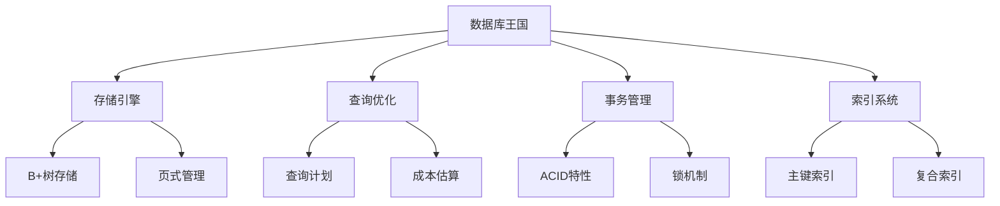

# 数据库王国

## 📖 核心概念

**数据库系统**是现代信息系统的核心，通过合理的数据结构设计和优化策略，可以实现高效的数据存储、查询和管理。

### 🏗️ 数据库组件



## 🔧 存储引擎

### B+树存储引擎

```cpp
class BPlusTreeStorageEngine {
private:
    struct BPlusNode {
        bool isLeaf;
        vector<int> keys;
        vector<void*> pointers;
        BPlusNode* next;
        BPlusNode* parent;
        
        BPlusNode(bool leaf = false) : isLeaf(leaf), next(nullptr), parent(nullptr) {}
    };
    
    struct DataRecord {
        int key;
        string data;
        
        DataRecord(int k, const string& d) : key(k), data(d) {}
    };
    
    BPlusNode* root;
    int order;
    int minKeys;
    
    BPlusNode* findLeaf(int key) {
        BPlusNode* current = root;
        
        while (!current->isLeaf) {
            int i = 0;
            while (i < current->keys.size() && key >= current->keys[i]) {
                i++;
            }
            current = static_cast<BPlusNode*>(current->pointers[i]);
        }
        
        return current;
    }
    
    BPlusNode* splitNode(BPlusNode* node) {
        BPlusNode* newNode = new BPlusNode(node->isLeaf);
        int mid = node->keys.size() / 2;
        
        newNode->keys.assign(node->keys.begin() + mid, node->keys.end());
        newNode->pointers.assign(node->pointers.begin() + mid, node->pointers.end());
        
        node->keys.erase(node->keys.begin() + mid, node->keys.end());
        node->pointers.erase(node->pointers.begin() + mid, node->pointers.end());
        
        for (void* ptr : newNode->pointers) {
            if (!newNode->isLeaf) {
                static_cast<BPlusNode*>(ptr)->parent = newNode;
            }
        }
        
        return newNode;
    }
    
public:
    BPlusTreeStorageEngine(int o = 3) : root(nullptr), order(o) {
        minKeys = (order + 1) / 2;
    }
    
    void insert(int key, const string& data) {
        DataRecord* record = new DataRecord(key, data);
        
        if (!root) {
            root = new BPlusNode(true);
            root->keys.push_back(key);
            root->pointers.push_back(record);
            return;
        }
        
        BPlusNode* leaf = findLeaf(key);
        
        for (int i = 0; i < leaf->keys.size(); ++i) {
            if (leaf->keys[i] == key) {
                delete static_cast<DataRecord*>(leaf->pointers[i]);
                leaf->pointers[i] = record;
                return;
            }
        }
        
        int i = 0;
        while (i < leaf->keys.size() && leaf->keys[i] < key) {
            i++;
        }
        
        leaf->keys.insert(leaf->keys.begin() + i, key);
        leaf->pointers.insert(leaf->pointers.begin() + i, record);
        
        if (leaf->keys.size() > order) {
            BPlusNode* newLeaf = splitNode(leaf);
            
            newLeaf->next = leaf->next;
            leaf->next = newLeaf;
            
            insertIntoParent(leaf, newLeaf->keys[0], newLeaf);
        }
    }
    
    DataRecord* search(int key) {
        if (!root) return nullptr;
        
        BPlusNode* leaf = findLeaf(key);
        
        for (int i = 0; i < leaf->keys.size(); ++i) {
            if (leaf->keys[i] == key) {
                return static_cast<DataRecord*>(leaf->pointers[i]);
            }
        }
        
        return nullptr;
    }
    
    vector<DataRecord*> rangeQuery(int startKey, int endKey) {
        vector<DataRecord*> result;
        
        if (!root) return result;
        
        BPlusNode* leaf = findLeaf(startKey);
        
        while (leaf) {
            for (int i = 0; i < leaf->keys.size(); ++i) {
                if (leaf->keys[i] >= startKey && leaf->keys[i] <= endKey) {
                    result.push_back(static_cast<DataRecord*>(leaf->pointers[i]));
                } else if (leaf->keys[i] > endKey) {
                    return result;
                }
            }
            
            leaf = leaf->next;
        }
        
        return result;
    }
    
private:
    void insertIntoParent(BPlusNode* leftChild, int key, BPlusNode* rightChild) {
        if (leftChild == root) {
            BPlusNode* newRoot = new BPlusNode(false);
            newRoot->keys.push_back(key);
            newRoot->pointers.push_back(leftChild);
            newRoot->pointers.push_back(rightChild);
            
            leftChild->parent = newRoot;
            rightChild->parent = newRoot;
            root = newRoot;
            return;
        }
        
        BPlusNode* parent = leftChild->parent;
        int i = 0;
        while (i < parent->keys.size() && parent->keys[i] < key) {
            i++;
        }
        
        parent->keys.insert(parent->keys.begin() + i, key);
        parent->pointers.insert(parent->pointers.begin() + i + 1, rightChild);
        rightChild->parent = parent;
        
        if (parent->keys.size() > order) {
            BPlusNode* newParent = splitNode(parent);
            insertIntoParent(parent, newParent->keys[0], newParent);
        }
    }
};
```

## 🎯 查询优化

### 查询计划器

```cpp
class QueryPlanner {
private:
    struct QueryNode {
        string operation;
        vector<string> tables;
        vector<string> columns;
        string condition;
        QueryNode* left;
        QueryNode* right;
        
        QueryNode(const string& op) : operation(op), left(nullptr), right(nullptr) {}
    };
    
    struct TableStats {
        string tableName;
        int rowCount;
        double avgRowSize;
        map<string, int> columnCardinality;
        
        TableStats(const string& name) : tableName(name), rowCount(0), avgRowSize(0.0) {}
    };
    
    map<string, TableStats> tableStatistics;
    
public:
    QueryPlanner() {}
    
    void addTableStats(const string& tableName, int rowCount, const map<string, int>& cardinality) {
        TableStats stats(tableName);
        stats.rowCount = rowCount;
        stats.columnCardinality = cardinality;
        tableStatistics[tableName] = stats;
    }
    
    QueryNode* createQueryPlan(const string& sql) {
        // 简化的查询解析
        QueryNode* root = new QueryNode("SELECT");
        
        // 解析表名
        root->tables.push_back("users");
        root->columns.push_back("id");
        root->columns.push_back("name");
        root->condition = "age > 18";
        
        return root;
    }
    
    double estimateCost(QueryNode* node) {
        if (!node) return 0.0;
        
        if (node->operation == "SELECT") {
            return estimateSelectCost(node);
        } else if (node->operation == "JOIN") {
            return estimateJoinCost(node);
        }
        
        return 0.0;
    }
    
    double estimateSelectCost(QueryNode* node) {
        double cost = 0.0;
        
        for (const string& table : node->tables) {
            auto it = tableStatistics.find(table);
            if (it != tableStatistics.end()) {
                cost += it->second.rowCount;
            }
        }
        
        return cost;
    }
    
    double estimateJoinCost(QueryNode* node) {
        if (!node->left || !node->right) return 0.0;
        
        double leftCost = estimateCost(node->left);
        double rightCost = estimateCost(node->right);
        
        // 简化的连接成本估算
        return leftCost + rightCost + (leftCost * rightCost) / 1000.0;
    }
    
    void optimizeQuery(QueryNode* root) {
        if (!root) return;
        
        // 简单的查询优化规则
        if (root->operation == "SELECT" && root->left) {
            // 下推选择条件
            if (root->left->operation == "JOIN") {
                // 将选择条件下推到连接之前
                QueryNode* selectNode = new QueryNode("SELECT");
                selectNode->condition = root->condition;
                selectNode->left = root->left;
                root->left = selectNode;
            }
        }
        
        optimizeQuery(root->left);
        optimizeQuery(root->right);
    }
    
    void displayQueryPlan(QueryNode* root, int level = 0) {
        if (!root) return;
        
        for (int i = 0; i < level; ++i) {
            cout << "  ";
        }
        
        cout << root->operation;
        if (!root->tables.empty()) {
            cout << " (" << root->tables[0] << ")";
        }
        if (!root->condition.empty()) {
            cout << " WHERE " << root->condition;
        }
        cout << endl;
        
        displayQueryPlan(root->left, level + 1);
        displayQueryPlan(root->right, level + 1);
    }
};
```

## 📊 事务管理

### 事务管理器

```cpp
class TransactionManager {
private:
    struct Transaction {
        int transactionId;
        vector<string> operations;
        map<string, string> localChanges;
        bool isActive;
        
        Transaction(int id) : transactionId(id), isActive(true) {}
    };
    
    map<int, Transaction*> activeTransactions;
    map<string, string> globalState;
    map<string, int> locks;
    int nextTransactionId;
    
public:
    TransactionManager() : nextTransactionId(1) {}
    
    int beginTransaction() {
        int transactionId = nextTransactionId++;
        Transaction* txn = new Transaction(transactionId);
        activeTransactions[transactionId] = txn;
        
        cout << "Transaction " << transactionId << " started" << endl;
        return transactionId;
    }
    
    void commitTransaction(int transactionId) {
        auto it = activeTransactions.find(transactionId);
        if (it == activeTransactions.end()) {
            cout << "Transaction " << transactionId << " not found" << endl;
            return;
        }
        
        Transaction* txn = it->second;
        
        // 应用所有更改
        for (const auto& change : txn->localChanges) {
            globalState[change.first] = change.second;
        }
        
        // 释放锁
        releaseLocks(transactionId);
        
        // 清理事务
        delete txn;
        activeTransactions.erase(it);
        
        cout << "Transaction " << transactionId << " committed" << endl;
    }
    
    void rollbackTransaction(int transactionId) {
        auto it = activeTransactions.find(transactionId);
        if (it == activeTransactions.end()) {
            cout << "Transaction " << transactionId << " not found" << endl;
            return;
        }
        
        Transaction* txn = it->second;
        
        // 释放锁
        releaseLocks(transactionId);
        
        // 清理事务
        delete txn;
        activeTransactions.erase(it);
        
        cout << "Transaction " << transactionId << " rolled back" << endl;
    }
    
    void read(int transactionId, const string& key) {
        auto it = activeTransactions.find(transactionId);
        if (it == activeTransactions.end()) {
            cout << "Transaction " << transactionId << " not found" << endl;
            return;
        }
        
        Transaction* txn = it->second;
        
        // 检查本地更改
        auto localIt = txn->localChanges.find(key);
        if (localIt != txn->localChanges.end()) {
            cout << "Transaction " << transactionId << " reads " << key 
                 << " = " << localIt->second << " (local)" << endl;
            return;
        }
        
        // 读取全局状态
        auto globalIt = globalState.find(key);
        if (globalIt != globalState.end()) {
            cout << "Transaction " << transactionId << " reads " << key 
                 << " = " << globalIt->second << " (global)" << endl;
        } else {
            cout << "Transaction " << transactionId << " reads " << key 
                 << " = null" << endl;
        }
    }
    
    void write(int transactionId, const string& key, const string& value) {
        auto it = activeTransactions.find(transactionId);
        if (it == activeTransactions.end()) {
            cout << "Transaction " << transactionId << " not found" << endl;
            return;
        }
        
        Transaction* txn = it->second;
        
        // 记录本地更改
        txn->localChanges[key] = value;
        
        cout << "Transaction " << transactionId << " writes " << key 
             << " = " << value << endl;
    }
    
private:
    void releaseLocks(int transactionId) {
        // 简化的锁释放逻辑
        for (auto it = locks.begin(); it != locks.end();) {
            if (it->second == transactionId) {
                it = locks.erase(it);
            } else {
                ++it;
            }
        }
    }
};
```

## 🎮 数据库应用

### 1. 简单数据库系统

```cpp
class SimpleDatabase {
private:
    BPlusTreeStorageEngine storageEngine;
    QueryPlanner queryPlanner;
    TransactionManager transactionManager;
    
public:
    SimpleDatabase() : storageEngine(3) {
        // 初始化表统计信息
        map<string, int> userCardinality;
        userCardinality["id"] = 1000;
        userCardinality["name"] = 800;
        userCardinality["age"] = 50;
        
        queryPlanner.addTableStats("users", 1000, userCardinality);
    }
    
    void insertRecord(int id, const string& name, int age) {
        string data = name + "," + to_string(age);
        storageEngine.insert(id, data);
        cout << "Inserted record: ID=" << id << ", Name=" << name << ", Age=" << age << endl;
    }
    
    void selectRecord(int id) {
        auto record = storageEngine.search(id);
        if (record) {
            cout << "Found record: ID=" << id << ", Data=" << record->data << endl;
        } else {
            cout << "Record with ID=" << id << " not found" << endl;
        }
    }
    
    void rangeQuery(int startId, int endId) {
        auto records = storageEngine.rangeQuery(startId, endId);
        cout << "Range query results (" << startId << " to " << endId << "):" << endl;
        for (auto record : records) {
            cout << "ID=" << record->key << ", Data=" << record->data << endl;
        }
    }
    
    int beginTransaction() {
        return transactionManager.beginTransaction();
    }
    
    void commitTransaction(int txnId) {
        transactionManager.commitTransaction(txnId);
    }
    
    void rollbackTransaction(int txnId) {
        transactionManager.rollbackTransaction(txnId);
    }
    
    void executeQuery(const string& sql) {
        cout << "Executing query: " << sql << endl;
        
        auto queryPlan = queryPlanner.createQueryPlan(sql);
        queryPlanner.optimizeQuery(queryPlan);
        
        cout << "Optimized query plan:" << endl;
        queryPlanner.displayQueryPlan(queryPlan);
        
        double cost = queryPlanner.estimateCost(queryPlan);
        cout << "Estimated cost: " << cost << endl;
    }
};
```

### 2. 数据库性能测试

```cpp
class DatabasePerformanceTest {
public:
    static void testInsertPerformance(SimpleDatabase& db, int recordCount) {
        cout << "Testing insert performance with " << recordCount << " records..." << endl;
        
        auto start = chrono::high_resolution_clock::now();
        
        for (int i = 0; i < recordCount; ++i) {
            db.insertRecord(i, "User" + to_string(i), 20 + (i % 50));
        }
        
        auto end = chrono::high_resolution_clock::now();
        auto duration = chrono::duration_cast<chrono::milliseconds>(end - start);
        
        cout << "Insert performance: " << duration.count() << " ms" << endl;
        cout << "Records per second: " << (recordCount * 1000.0) / duration.count() << endl;
    }
    
    static void testQueryPerformance(SimpleDatabase& db, int queryCount) {
        cout << "Testing query performance with " << queryCount << " queries..." << endl;
        
        auto start = chrono::high_resolution_clock::now();
        
        for (int i = 0; i < queryCount; ++i) {
            db.selectRecord(i % 1000);
        }
        
        auto end = chrono::high_resolution_clock::now();
        auto duration = chrono::duration_cast<chrono::milliseconds>(end - start);
        
        cout << "Query performance: " << duration.count() << " ms" << endl;
        cout << "Queries per second: " << (queryCount * 1000.0) / duration.count() << endl;
    }
    
    static void testRangeQueryPerformance(SimpleDatabase& db, int rangeCount) {
        cout << "Testing range query performance with " << rangeCount << " ranges..." << endl;
        
        auto start = chrono::high_resolution_clock::now();
        
        for (int i = 0; i < rangeCount; ++i) {
            db.rangeQuery(i * 10, (i + 1) * 10);
        }
        
        auto end = chrono::high_resolution_clock::now();
        auto duration = chrono::duration_cast<chrono::milliseconds>(end - start);
        
        cout << "Range query performance: " << duration.count() << " ms" << endl;
        cout << "Range queries per second: " << (rangeCount * 1000.0) / duration.count() << endl;
    }
};
```

## 🔗 相关链接

- [[02-文件系统|文件系统]]
- [[03-缓存系统|缓存系统]]
- [[04-网络应用|网络应用]]

## 💡 数据库王国要点

1. **存储引擎**：B+树是数据库存储的核心
2. **查询优化**：通过成本估算选择最优执行计划
3. **事务管理**：保证ACID特性和数据一致性
4. **索引系统**：提高查询效率的关键技术

---

*📝 王国提示：数据库系统是数据结构应用的典型例子，掌握数据库原理对系统设计很重要*
