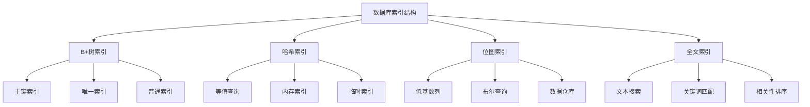

# 数据库索引结构

## 📖 核心概念

**数据库索引结构**是数据库系统中用于快速定位和访问数据的重要机制。通过合理的索引设计，可以显著提高查询性能，减少I/O操作，优化数据库整体性能。

### 🏗️ 数据库索引结构分类



## 🔧 数据库索引结构实现

### B+树索引

```cpp
class BPlusTreeIndex {
private:
    struct BPlusNode {
        vector<int> keys;
        vector<void*> pointers;
        bool isLeaf;
        BPlusNode* parent;
        BPlusNode* next;
        
        BPlusNode(bool leaf = false) : isLeaf(leaf), parent(nullptr), next(nullptr) {}
    };
    
    BPlusNode* root;
    int order;
    
    // 查找键
    BPlusNode* findLeaf(int key) {
        BPlusNode* current = root;
        
        while (!current->isLeaf) {
            int i = 0;
            while (i < current->keys.size() && key >= current->keys[i]) {
                i++;
            }
            current = (BPlusNode*)current->pointers[i];
        }
        
        return current;
    }
    
    // 插入键
    void insertKey(int key, void* value) {
        BPlusNode* leaf = findLeaf(key);
        
        // 在叶子节点中插入
        int pos = 0;
        while (pos < leaf->keys.size() && leaf->keys[pos] < key) {
            pos++;
        }
        
        leaf->keys.insert(leaf->keys.begin() + pos, key);
        leaf->pointers.insert(leaf->pointers.begin() + pos, value);
        
        // 检查是否需要分裂
        if (leaf->keys.size() > order) {
            splitNode(leaf);
        }
    }
    
    // 分裂节点
    void splitNode(BPlusNode* node) {
        int mid = node->keys.size() / 2;
        
        BPlusNode* newNode = new BPlusNode(node->isLeaf);
        
        // 移动后半部分到新节点
        for (int i = mid; i < node->keys.size(); i++) {
            newNode->keys.push_back(node->keys[i]);
            newNode->pointers.push_back(node->pointers[i]);
        }
        
        // 删除原节点中的后半部分
        node->keys.erase(node->keys.begin() + mid, node->keys.end());
        node->pointers.erase(node->pointers.begin() + mid, node->pointers.end());
        
        // 更新指针
        if (node->isLeaf) {
            newNode->next = node->next;
            node->next = newNode;
        }
        
        // 更新父节点
        if (node->parent == nullptr) {
            BPlusNode* newRoot = new BPlusNode(false);
            newRoot->keys.push_back(newNode->keys[0]);
            newRoot->pointers.push_back(node);
            newRoot->pointers.push_back(newNode);
            node->parent = newRoot;
            newNode->parent = newRoot;
            root = newRoot;
        } else {
            insertIntoParent(node->parent, newNode->keys[0], newNode);
        }
    }
    
    // 插入到父节点
    void insertIntoParent(BPlusNode* parent, int key, BPlusNode* child) {
        int pos = 0;
        while (pos < parent->keys.size() && parent->keys[pos] < key) {
            pos++;
        }
        
        parent->keys.insert(parent->keys.begin() + pos, key);
        parent->pointers.insert(parent->pointers.begin() + pos + 1, child);
        
        if (parent->keys.size() > order) {
            splitNode(parent);
        }
    }
    
public:
    BPlusTreeIndex(int o = 3) : root(nullptr), order(o) {
        root = new BPlusNode(true);
    }
    
    // 插入
    void insert(int key, void* value) {
        insertKey(key, value);
    }
    
    // 查找
    void* search(int key) {
        BPlusNode* leaf = findLeaf(key);
        
        for (int i = 0; i < leaf->keys.size(); i++) {
            if (leaf->keys[i] == key) {
                return leaf->pointers[i];
            }
        }
        
        return nullptr;
    }
    
    // 范围查询
    vector<void*> rangeSearch(int start, int end) {
        vector<void*> result;
        BPlusNode* leaf = findLeaf(start);
        
        while (leaf != nullptr) {
            for (int i = 0; i < leaf->keys.size(); i++) {
                if (leaf->keys[i] >= start && leaf->keys[i] <= end) {
                    result.push_back(leaf->pointers[i]);
                }
                if (leaf->keys[i] > end) {
                    return result;
                }
            }
            leaf = leaf->next;
        }
        
        return result;
    }
    
    // 显示B+树结构
    void display() {
        cout << "B+ Tree Index Structure:" << endl;
        cout << "======================" << endl;
        
        displayNode(root, 0);
    }
    
    // 显示节点
    void displayNode(BPlusNode* node, int level) {
        if (node == nullptr) return;
        
        for (int i = 0; i < level; i++) {
            cout << "  ";
        }
        
        cout << "Level " << level << ": ";
        for (int key : node->keys) {
            cout << key << " ";
        }
        cout << endl;
        
        if (!node->isLeaf) {
            for (void* ptr : node->pointers) {
                displayNode((BPlusNode*)ptr, level + 1);
            }
        }
    }
    
    // 显示统计信息
    void displayStats() {
        cout << "B+ Tree Index Statistics:" << endl;
        cout << "========================" << endl;
        
        int nodeCount = countNodes(root);
        int keyCount = countKeys(root);
        
        cout << "Order: " << order << endl;
        cout << "Node count: " << nodeCount << endl;
        cout << "Key count: " << keyCount << endl;
        cout << "Height: " << getHeight(root) << endl;
    }
    
    // 计算节点数
    int countNodes(BPlusNode* node) {
        if (node == nullptr) return 0;
        
        int count = 1;
        if (!node->isLeaf) {
            for (void* ptr : node->pointers) {
                count += countNodes((BPlusNode*)ptr);
            }
        }
        
        return count;
    }
    
    // 计算键数
    int countKeys(BPlusNode* node) {
        if (node == nullptr) return 0;
        
        int count = node->keys.size();
        if (!node->isLeaf) {
            for (void* ptr : node->pointers) {
                count += countKeys((BPlusNode*)ptr);
            }
        }
        
        return count;
    }
    
    // 获取高度
    int getHeight(BPlusNode* node) {
        if (node == nullptr) return 0;
        
        int height = 1;
        if (!node->isLeaf && !node->pointers.empty()) {
            height += getHeight((BPlusNode*)node->pointers[0]);
        }
        
        return height;
    }
};
```

### 哈希索引

```cpp
class HashIndex {
private:
    struct HashEntry {
        int key;
        void* value;
        HashEntry* next;
        
        HashEntry(int k, void* v) : key(k), value(v), next(nullptr) {}
    };
    
    vector<HashEntry*> buckets;
    int bucketCount;
    int size;
    
    // 哈希函数
    int hashFunction(int key) {
        return key % bucketCount;
    }
    
public:
    HashIndex(int buckets = 16) : bucketCount(buckets), size(0) {
        buckets.resize(bucketCount, nullptr);
    }
    
    // 插入
    void insert(int key, void* value) {
        int bucket = hashFunction(key);
        HashEntry* entry = new HashEntry(key, value);
        
        if (buckets[bucket] == nullptr) {
            buckets[bucket] = entry;
        } else {
            entry->next = buckets[bucket];
            buckets[bucket] = entry;
        }
        
        size++;
    }
    
    // 查找
    void* search(int key) {
        int bucket = hashFunction(key);
        HashEntry* entry = buckets[bucket];
        
        while (entry != nullptr) {
            if (entry->key == key) {
                return entry->value;
            }
            entry = entry->next;
        }
        
        return nullptr;
    }
    
    // 删除
    bool remove(int key) {
        int bucket = hashFunction(key);
        HashEntry* entry = buckets[bucket];
        HashEntry* prev = nullptr;
        
        while (entry != nullptr) {
            if (entry->key == key) {
                if (prev == nullptr) {
                    buckets[bucket] = entry->next;
                } else {
                    prev->next = entry->next;
                }
                
                delete entry;
                size--;
                return true;
            }
            
            prev = entry;
            entry = entry->next;
        }
        
        return false;
    }
    
    // 显示哈希索引结构
    void display() {
        cout << "Hash Index Structure:" << endl;
        cout << "===================" << endl;
        
        for (int i = 0; i < bucketCount; i++) {
            cout << "Bucket " << i << ": ";
            HashEntry* entry = buckets[i];
            
            while (entry != nullptr) {
                cout << entry->key << " ";
                entry = entry->next;
            }
            cout << endl;
        }
    }
    
    // 显示统计信息
    void displayStats() {
        cout << "Hash Index Statistics:" << endl;
        cout << "=====================" << endl;
        
        cout << "Bucket count: " << bucketCount << endl;
        cout << "Size: " << size << endl;
        cout << "Load factor: " << (double)size / bucketCount << endl;
        
        // 计算链长分布
        vector<int> chainLengths;
        for (int i = 0; i < bucketCount; i++) {
            int length = 0;
            HashEntry* entry = buckets[i];
            
            while (entry != nullptr) {
                length++;
                entry = entry->next;
            }
            
            chainLengths.push_back(length);
        }
        
        cout << "Chain length distribution:" << endl;
        for (int i = 0; i < chainLengths.size(); i++) {
            if (chainLengths[i] > 0) {
                cout << "  Bucket " << i << ": " << chainLengths[i] << " entries" << endl;
            }
        }
    }
};
```

### 位图索引

```cpp
class BitmapIndex {
private:
    map<int, vector<bool>> bitmaps;
    vector<int> distinctValues;
    
public:
    BitmapIndex() {}
    
    // 插入数据
    void insert(int value) {
        if (bitmaps.find(value) == bitmaps.end()) {
            bitmaps[value] = vector<bool>();
            distinctValues.push_back(value);
        }
        
        // 扩展所有位图
        for (auto& pair : bitmaps) {
            pair.second.push_back(pair.first == value);
        }
    }
    
    // 等值查询
    vector<int> equalQuery(int value) {
        vector<int> result;
        
        if (bitmaps.find(value) == bitmaps.end()) {
            return result;
        }
        
        vector<bool>& bitmap = bitmaps[value];
        for (int i = 0; i < bitmap.size(); i++) {
            if (bitmap[i]) {
                result.push_back(i);
            }
        }
        
        return result;
    }
    
    // 范围查询
    vector<int> rangeQuery(int start, int end) {
        vector<int> result;
        
        for (int value = start; value <= end; value++) {
            if (bitmaps.find(value) != bitmaps.end()) {
                vector<bool>& bitmap = bitmaps[value];
                for (int i = 0; i < bitmap.size(); i++) {
                    if (bitmap[i]) {
                        result.push_back(i);
                    }
                }
            }
        }
        
        return result;
    }
    
    // 布尔查询
    vector<int> booleanQuery(const vector<int>& values, const string& operation) {
        vector<int> result;
        
        if (values.empty()) {
            return result;
        }
        
        vector<bool> combinedBitmap;
        
        if (operation == "AND") {
            combinedBitmap = bitmaps[values[0]];
            for (int i = 1; i < values.size(); i++) {
                if (bitmaps.find(values[i]) != bitmaps.end()) {
                    vector<bool>& bitmap = bitmaps[values[i]];
                    for (int j = 0; j < combinedBitmap.size(); j++) {
                        combinedBitmap[j] = combinedBitmap[j] && bitmap[j];
                    }
                }
            }
        } else if (operation == "OR") {
            combinedBitmap = bitmaps[values[0]];
            for (int i = 1; i < values.size(); i++) {
                if (bitmaps.find(values[i]) != bitmaps.end()) {
                    vector<bool>& bitmap = bitmaps[values[i]];
                    for (int j = 0; j < combinedBitmap.size(); j++) {
                        combinedBitmap[j] = combinedBitmap[j] || bitmap[j];
                    }
                }
            }
        }
        
        for (int i = 0; i < combinedBitmap.size(); i++) {
            if (combinedBitmap[i]) {
                result.push_back(i);
            }
        }
        
        return result;
    }
    
    // 显示位图索引结构
    void display() {
        cout << "Bitmap Index Structure:" << endl;
        cout << "=====================" << endl;
        
        for (int value : distinctValues) {
            cout << "Value " << value << ": ";
            vector<bool>& bitmap = bitmaps[value];
            
            for (bool bit : bitmap) {
                cout << (bit ? "1" : "0");
            }
            cout << endl;
        }
    }
    
    // 显示统计信息
    void displayStats() {
        cout << "Bitmap Index Statistics:" << endl;
        cout << "======================" << endl;
        
        cout << "Distinct values: " << distinctValues.size() << endl;
        cout << "Total records: " << (bitmaps.empty() ? 0 : bitmaps.begin()->second.size()) << endl;
        
        // 计算压缩率
        int totalBits = 0;
        for (auto& pair : bitmaps) {
            totalBits += pair.second.size();
        }
        
        cout << "Total bits: " << totalBits << endl;
        cout << "Compression ratio: " << (double)totalBits / (distinctValues.size() * (bitmaps.empty() ? 0 : bitmaps.begin()->second.size())) << endl;
    }
};
```

## 🎯 数据库索引应用

### 实际应用场景

```cpp
class DatabaseIndexApplications {
public:
    static void demonstrateApplications() {
        cout << "Database Index Applications:" << endl;
        cout << "==========================" << endl;
        
        cout << "1. 查询优化:" << endl;
        cout << "   - 加速SELECT查询" << endl;
        cout << "   - 支持范围查询" << endl;
        cout << "   - 提高JOIN性能" << endl;
        
        cout << "2. 数据仓库:" << endl;
        cout << "   - 位图索引" << endl;
        cout << "   - 星型模式" << endl;
        cout << "   - OLAP查询" << endl;
        
        cout << "3. 全文搜索:" << endl;
        cout << "   - 倒排索引" << endl;
        cout << "   - 关键词匹配" << endl;
        cout << "   - 相关性排序" << endl;
        
        cout << "4. 实时系统:" << endl;
        cout << "   - 内存索引" << endl;
        cout << "   - 快速查找" << endl;
        cout << "   - 低延迟" << endl;
    }
    
    static void analyzePerformance() {
        cout << "Database Index Performance Analysis:" << endl;
        cout << "==================================" << endl;
        
        cout << "1. B+树索引:" << endl;
        cout << "   - 优点: 支持范围查询，平衡性好" << endl;
        cout << "   - 缺点: 维护开销大，空间占用多" << endl;
        cout << "   - 适用: 主键索引，唯一索引" << endl;
        cout << endl;
        
        cout << "2. 哈希索引:" << endl;
        cout << "   - 优点: 查找速度快，实现简单" << endl;
        cout << "   - 缺点: 不支持范围查询，哈希冲突" << endl;
        cout << "   - 适用: 等值查询，内存索引" << endl;
        cout << endl;
        
        cout << "3. 位图索引:" << endl;
        cout << "   - 优点: 空间效率高，支持布尔查询" << endl;
        cout << "   - 缺点: 只适用于低基数列" << endl;
        cout << "   - 适用: 数据仓库，OLAP" << endl;
        cout << endl;
        
        cout << "4. 全文索引:" << endl;
        cout << "   - 优点: 支持文本搜索，相关性排序" << endl;
        cout << "   - 缺点: 空间占用大，维护复杂" << endl;
        cout << "   - 适用: 搜索引擎，文档检索" << endl;
    }
    
    static void selectIndexType(bool needsRangeQuery, bool needsHighPerformance, bool needsSpaceEfficiency) {
        cout << "Index Type Selection:" << endl;
        cout << "===================" << endl;
        
        cout << "Needs range query: " << (needsRangeQuery ? "Yes" : "No") << endl;
        cout << "Needs high performance: " << (needsHighPerformance ? "Yes" : "No") << endl;
        cout << "Needs space efficiency: " << (needsSpaceEfficiency ? "Yes" : "No") << endl;
        
        cout << "Recommendation:" << endl;
        
        if (needsRangeQuery) {
            cout << "Use B+ Tree Index (supports range queries)" << endl;
        } else if (needsHighPerformance) {
            cout << "Use Hash Index (high performance for equality)" << endl;
        } else if (needsSpaceEfficiency) {
            cout << "Use Bitmap Index (space efficient)" << endl;
        } else {
            cout << "Use B+ Tree Index (general purpose)" << endl;
        }
    }
};
```

## 📊 数据库索引分析

### 性能分析

```cpp
class DatabaseIndexAnalysis {
public:
    static void analyzePerformance() {
        cout << "Database Index Performance Analysis:" << endl;
        cout << "==================================" << endl;
        
        cout << "1. 时间复杂度:" << endl;
        cout << "   - B+树查询: O(log n)" << endl;
        cout << "   - 哈希查询: O(1)" << endl;
        cout << "   - 位图查询: O(n)" << endl;
        cout << "   - 全文查询: O(log n)" << endl;
        
        cout << "2. 空间复杂度:" << endl;
        cout << "   - B+树: O(n)" << endl;
        cout << "   - 哈希: O(n)" << endl;
        cout << "   - 位图: O(d*n)" << endl;
        cout << "   - 全文: O(n)" << endl;
        
        cout << "3. 维护开销:" << endl;
        cout << "   - B+树: 高" << endl;
        cout << "   - 哈希: 中" << endl;
        cout << "   - 位图: 低" << endl;
        cout << "   - 全文: 高" << endl;
    }
    
    static void analyzeSpaceComplexity() {
        cout << "Database Index Space Complexity Analysis:" << endl;
        cout << "======================================" << endl;
        
        cout << "1. B+树索引:" << endl;
        cout << "   - 节点存储: O(n)" << endl;
        cout << "   - 指针存储: O(n)" << endl;
        cout << "   - 总空间: O(n)" << endl;
        
        cout << "2. 哈希索引:" << endl;
        cout << "   - 桶存储: O(n)" << endl;
        cout << "   - 链存储: O(n)" << endl;
        cout << "   - 总空间: O(n)" << endl;
        
        cout << "3. 位图索引:" << endl;
        cout << "   - 位图存储: O(d*n)" << endl;
        cout << "   - d是不同值数量" << endl;
        cout << "   - 总空间: O(d*n)" << endl;
        
        cout << "4. 全文索引:" << endl;
        cout << "   - 倒排表: O(n)" << endl;
        cout << "   - 词表: O(v)" << endl;
        cout << "   - 总空间: O(n+v)" << endl;
    }
    
    static void analyzeTimeComplexity() {
        cout << "Database Index Time Complexity Analysis:" << endl;
        cout << "=====================================" << endl;
        
        cout << "1. B+树操作:" << endl;
        cout << "   - 查找: O(log n)" << endl;
        cout << "   - 插入: O(log n)" << endl;
        cout << "   - 删除: O(log n)" << endl;
        
        cout << "2. 哈希操作:" << endl;
        cout << "   - 查找: O(1)" << endl;
        cout << "   - 插入: O(1)" << endl;
        cout << "   - 删除: O(1)" << endl;
        
        cout << "3. 位图操作:" << endl;
        cout << "   - 查找: O(n)" << endl;
        cout << "   - 插入: O(1)" << endl;
        cout << "   - 删除: O(1)" << endl;
        
        cout << "4. 全文操作:" << endl;
        cout << "   - 查找: O(log n)" << endl;
        cout << "   - 插入: O(log n)" << endl;
        cout << "   - 删除: O(log n)" << endl;
    }
};
```

## 🎮 数据库索引测试

### 1. 基础功能测试

```cpp
class DatabaseIndexTest {
public:
    static void testBPlusTreeIndex() {
        cout << "Testing B+ Tree Index:" << endl;
        cout << "====================" << endl;
        
        BPlusTreeIndex bpt;
        
        // 插入测试
        for (int i = 1; i <= 10; i++) {
            bpt.insert(i, (void*)(long)i);
        }
        
        bpt.display();
        bpt.displayStats();
        
        // 查找测试
        for (int i = 1; i <= 5; i++) {
            void* result = bpt.search(i);
            cout << "Search " << i << ": " << (result ? "Found" : "Not found") << endl;
        }
        
        // 范围查询测试
        vector<void*> rangeResult = bpt.rangeSearch(3, 7);
        cout << "Range search [3, 7]: " << rangeResult.size() << " results" << endl;
    }
    
    static void testHashIndex() {
        cout << "Testing Hash Index:" << endl;
        cout << "=================" << endl;
        
        HashIndex hi;
        
        // 插入测试
        for (int i = 1; i <= 10; i++) {
            hi.insert(i, (void*)(long)i);
        }
        
        hi.display();
        hi.displayStats();
        
        // 查找测试
        for (int i = 1; i <= 5; i++) {
            void* result = hi.search(i);
            cout << "Search " << i << ": " << (result ? "Found" : "Not found") << endl;
        }
        
        // 删除测试
        hi.remove(5);
        cout << "After removing key 5:" << endl;
        hi.display();
    }
    
    static void testBitmapIndex() {
        cout << "Testing Bitmap Index:" << endl;
        cout << "===================" << endl;
        
        BitmapIndex bi;
        
        // 插入测试
        vector<int> values = {1, 2, 1, 3, 2, 1, 3, 2, 1, 3};
        for (int value : values) {
            bi.insert(value);
        }
        
        bi.display();
        bi.displayStats();
        
        // 等值查询测试
        vector<int> equalResult = bi.equalQuery(1);
        cout << "Equal query for 1: " << equalResult.size() << " results" << endl;
        
        // 范围查询测试
        vector<int> rangeResult = bi.rangeQuery(1, 2);
        cout << "Range query [1, 2]: " << rangeResult.size() << " results" << endl;
        
        // 布尔查询测试
        vector<int> booleanResult = bi.booleanQuery({1, 2}, "OR");
        cout << "Boolean query (1 OR 2): " << booleanResult.size() << " results" << endl;
    }
    
    static void testApplications() {
        cout << "Testing Applications:" << endl;
        cout << "==================" << endl;
        
        DatabaseIndexApplications::demonstrateApplications();
        DatabaseIndexApplications::analyzePerformance();
        DatabaseIndexApplications::selectIndexType(true, false, false);
    }
    
    static void testAnalysis() {
        cout << "Testing Analysis:" << endl;
        cout << "===============" << endl;
        
        DatabaseIndexAnalysis::analyzePerformance();
        DatabaseIndexAnalysis::analyzeSpaceComplexity();
        DatabaseIndexAnalysis::analyzeTimeComplexity();
    }
};
```

## 🔗 相关链接

- [[01-数据库王国|数据库王国]]
- [[02-事务与锁机制|事务与锁机制]]
- [[03-MySQL索引优化|MySQL索引优化]]

## 💡 数据库索引要点

1. **B+树索引**: 支持范围查询，适合主键和唯一索引
2. **哈希索引**: 查找速度快，适合等值查询
3. **位图索引**: 空间效率高，适合低基数列
4. **全文索引**: 支持文本搜索，适合文档检索

---

*📝 数据库索引提示：数据库索引是提高查询性能的关键，需要根据查询模式和数据特征选择合适的索引类型*
