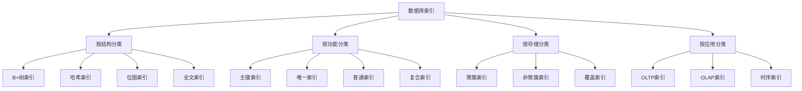

# 数据库索引设计

## 📖 核心概念

**数据库索引设计**是数据库系统性能优化的核心技术。通过合理设计索引结构，可以显著提高查询效率，减少I/O操作，优化数据库性能。

### 🏗️ 索引类型分类



## 🔧 B+树索引实现

### B+树索引结构

```cpp
class BPlusTreeIndex {
private:
    struct BPlusNode {
        bool isLeaf;
        vector<int> keys;
        vector<void*> pointers;  // 叶子节点存储数据指针，内部节点存储子节点指针
        BPlusNode* next;         // 叶子节点链表指针
        BPlusNode* parent;
        
        BPlusNode(bool leaf = false) 
            : isLeaf(leaf), next(nullptr), parent(nullptr) {}
    };
    
    struct DataRecord {
        int key;
        string data;
        
        DataRecord(int k, const string& d) : key(k), data(d) {}
    };
    
    BPlusNode* root;
    int order;  // 树的阶数
    int minKeys;
    
    // 查找叶子节点
    BPlusNode* findLeaf(int key) {
        BPlusNode* current = root;
        
        while (!current->isLeaf) {
            int i = 0;
            while (i < current->keys.size() && key >= current->keys[i]) {
                i++;
            }
            current = static_cast<BPlusNode*>(current->pointers[i]);
        }
        
        return current;
    }
    
    // 分裂节点
    BPlusNode* splitNode(BPlusNode* node) {
        BPlusNode* newNode = new BPlusNode(node->isLeaf);
        int mid = node->keys.size() / 2;
        
        // 移动后半部分到新节点
        newNode->keys.assign(node->keys.begin() + mid, node->keys.end());
        newNode->pointers.assign(node->pointers.begin() + mid, node->pointers.end());
        
        // 更新原节点
        node->keys.erase(node->keys.begin() + mid, node->keys.end());
        node->pointers.erase(node->pointers.begin() + mid, node->pointers.end());
        
        // 更新父指针
        for (void* ptr : newNode->pointers) {
            if (!newNode->isLeaf) {
                static_cast<BPlusNode*>(ptr)->parent = newNode;
            }
        }
        
        return newNode;
    }
    
    // 插入到叶子节点
    void insertIntoLeaf(BPlusNode* leaf, int key, DataRecord* record) {
        int i = 0;
        while (i < leaf->keys.size() && leaf->keys[i] < key) {
            i++;
        }
        
        leaf->keys.insert(leaf->keys.begin() + i, key);
        leaf->pointers.insert(leaf->pointers.begin() + i, record);
    }
    
    // 插入到内部节点
    void insertIntoInternal(BPlusNode* node, int key, BPlusNode* child) {
        int i = 0;
        while (i < node->keys.size() && node->keys[i] < key) {
            i++;
        }
        
        node->keys.insert(node->keys.begin() + i, key);
        node->pointers.insert(node->pointers.begin() + i + 1, child);
        child->parent = node;
    }
    
public:
    BPlusTreeIndex(int o = 3) : root(nullptr), order(o) {
        minKeys = (order + 1) / 2;
    }
    
    ~BPlusTreeIndex() {
        clear();
    }
    
    // 插入记录
    void insert(int key, const string& data) {
        DataRecord* record = new DataRecord(key, data);
        
        if (!root) {
            root = new BPlusNode(true);
            root->keys.push_back(key);
            root->pointers.push_back(record);
            return;
        }
        
        BPlusNode* leaf = findLeaf(key);
        
        // 检查是否已存在
        for (int i = 0; i < leaf->keys.size(); ++i) {
            if (leaf->keys[i] == key) {
                delete static_cast<DataRecord*>(leaf->pointers[i]);
                leaf->pointers[i] = record;
                return;
            }
        }
        
        insertIntoLeaf(leaf, key, record);
        
        // 检查是否需要分裂
        if (leaf->keys.size() > order) {
            BPlusNode* newLeaf = splitNode(leaf);
            
            // 更新叶子节点链表
            newLeaf->next = leaf->next;
            leaf->next = newLeaf;
            
            // 向上传播分裂
            insertIntoParent(leaf, newLeaf->keys[0], newLeaf);
        }
    }
    
    // 查找记录
    DataRecord* search(int key) {
        if (!root) return nullptr;
        
        BPlusNode* leaf = findLeaf(key);
        
        for (int i = 0; i < leaf->keys.size(); ++i) {
            if (leaf->keys[i] == key) {
                return static_cast<DataRecord*>(leaf->pointers[i]);
            }
        }
        
        return nullptr;
    }
    
    // 范围查询
    vector<DataRecord*> rangeQuery(int startKey, int endKey) {
        vector<DataRecord*> result;
        
        if (!root) return result;
        
        BPlusNode* leaf = findLeaf(startKey);
        
        while (leaf) {
            for (int i = 0; i < leaf->keys.size(); ++i) {
                if (leaf->keys[i] >= startKey && leaf->keys[i] <= endKey) {
                    result.push_back(static_cast<DataRecord*>(leaf->pointers[i]));
                } else if (leaf->keys[i] > endKey) {
                    return result;
                }
            }
            
            leaf = leaf->next;
        }
        
        return result;
    }
    
    // 删除记录
    bool remove(int key) {
        if (!root) return false;
        
        BPlusNode* leaf = findLeaf(key);
        
        for (int i = 0; i < leaf->keys.size(); ++i) {
            if (leaf->keys[i] == key) {
                delete static_cast<DataRecord*>(leaf->pointers[i]);
                leaf->keys.erase(leaf->keys.begin() + i);
                leaf->pointers.erase(leaf->pointers.begin() + i);
                
                // 检查是否需要合并
                if (leaf->keys.size() < minKeys) {
                    // 简化的合并逻辑
                }
                
                return true;
            }
        }
        
        return false;
    }
    
private:
    void insertIntoParent(BPlusNode* leftChild, int key, BPlusNode* rightChild) {
        if (leftChild == root) {
            BPlusNode* newRoot = new BPlusNode(false);
            newRoot->keys.push_back(key);
            newRoot->pointers.push_back(leftChild);
            newRoot->pointers.push_back(rightChild);
            
            leftChild->parent = newRoot;
            rightChild->parent = newRoot;
            root = newRoot;
            return;
        }
        
        BPlusNode* parent = leftChild->parent;
        insertIntoInternal(parent, key, rightChild);
        
        if (parent->keys.size() > order) {
            BPlusNode* newParent = splitNode(parent);
            insertIntoParent(parent, newParent->keys[0], newParent);
        }
    }
    
    void clear() {
        // 简化的清理逻辑
        if (root) {
            clearHelper(root);
            root = nullptr;
        }
    }
    
    void clearHelper(BPlusNode* node) {
        if (!node->isLeaf) {
            for (void* ptr : node->pointers) {
                clearHelper(static_cast<BPlusNode*>(ptr));
            }
        } else {
            for (void* ptr : node->pointers) {
                delete static_cast<DataRecord*>(ptr);
            }
        }
        delete node;
    }
};
```

## 🎯 复合索引设计

### 多列索引实现

```cpp
class CompositeIndex {
private:
    struct CompositeKey {
        vector<int> values;
        
        CompositeKey(const vector<int>& vals) : values(vals) {}
        
        bool operator<(const CompositeKey& other) const {
            for (size_t i = 0; i < min(values.size(), other.values.size()); ++i) {
                if (values[i] != other.values[i]) {
                    return values[i] < other.values[i];
                }
            }
            return values.size() < other.values.size();
        }
        
        bool operator==(const CompositeKey& other) const {
            return values == other.values;
        }
    };
    
    struct IndexEntry {
        CompositeKey key;
        vector<int> recordIds;
        
        IndexEntry(const CompositeKey& k) : key(k) {}
    };
    
    map<CompositeKey, IndexEntry> index;
    
public:
    // 插入记录
    void insert(const vector<int>& keyValues, int recordId) {
        CompositeKey key(keyValues);
        
        if (index.find(key) == index.end()) {
            index[key] = IndexEntry(key);
        }
        
        index[key].recordIds.push_back(recordId);
    }
    
    // 精确查找
    vector<int> exactSearch(const vector<int>& keyValues) {
        CompositeKey key(keyValues);
        auto it = index.find(key);
        
        if (it != index.end()) {
            return it->second.recordIds;
        }
        
        return {};
    }
    
    // 前缀查找
    vector<int> prefixSearch(const vector<int>& prefixValues) {
        vector<int> result;
        
        for (const auto& pair : index) {
            const CompositeKey& key = pair.first;
            
            if (key.values.size() >= prefixValues.size()) {
                bool match = true;
                for (size_t i = 0; i < prefixValues.size(); ++i) {
                    if (key.values[i] != prefixValues[i]) {
                        match = false;
                        break;
                    }
                }
                
                if (match) {
                    result.insert(result.end(), 
                                pair.second.recordIds.begin(), 
                                pair.second.recordIds.end());
                }
            }
        }
        
        return result;
    }
    
    // 范围查询
    vector<int> rangeSearch(const vector<pair<int, int>>& ranges) {
        vector<int> result;
        
        for (const auto& pair : index) {
            const CompositeKey& key = pair.first;
            
            if (key.values.size() >= ranges.size()) {
                bool inRange = true;
                for (size_t i = 0; i < ranges.size(); ++i) {
                    if (key.values[i] < ranges[i].first || key.values[i] > ranges[i].second) {
                        inRange = false;
                        break;
                    }
                }
                
                if (inRange) {
                    result.insert(result.end(), 
                                pair.second.recordIds.begin(), 
                                pair.second.recordIds.end());
                }
            }
        }
        
        return result;
    }
    
    // 删除记录
    bool remove(const vector<int>& keyValues, int recordId) {
        CompositeKey key(keyValues);
        auto it = index.find(key);
        
        if (it != index.end()) {
            auto& recordIds = it->second.recordIds;
            auto recordIt = find(recordIds.begin(), recordIds.end(), recordId);
            
            if (recordIt != recordIds.end()) {
                recordIds.erase(recordIt);
                
                if (recordIds.empty()) {
                    index.erase(it);
                }
                
                return true;
            }
        }
        
        return false;
    }
    
    // 获取索引统计
    void getIndexStats() const {
        cout << "Composite Index Statistics:" << endl;
        cout << "Total keys: " << index.size() << endl;
        
        int totalRecords = 0;
        for (const auto& pair : index) {
            totalRecords += pair.second.recordIds.size();
        }
        
        cout << "Total records: " << totalRecords << endl;
        cout << "Average records per key: " << (double)totalRecords / index.size() << endl;
    }
};
```

## 📊 索引优化策略

### 索引选择优化

```cpp
class IndexOptimizer {
private:
    struct QueryPattern {
        vector<string> columns;
        string operation;  // "=", ">", "<", "BETWEEN", "IN"
        double frequency;
        
        QueryPattern(const vector<string>& cols, const string& op, double freq)
            : columns(cols), operation(op), frequency(freq) {}
    };
    
    struct IndexCandidate {
        vector<string> columns;
        double benefit;
        double cost;
        
        IndexCandidate(const vector<string>& cols, double b, double c)
            : columns(cols), benefit(b), cost(c) {}
    };
    
    vector<QueryPattern> queryPatterns;
    map<string, int> columnCardinality;
    
public:
    // 添加查询模式
    void addQueryPattern(const vector<string>& columns, const string& operation, double frequency) {
        queryPatterns.push_back(QueryPattern(columns, operation, frequency));
    }
    
    // 设置列基数
    void setColumnCardinality(const string& column, int cardinality) {
        columnCardinality[column] = cardinality;
    }
    
    // 分析索引候选
    vector<IndexCandidate> analyzeIndexCandidates() {
        vector<IndexCandidate> candidates;
        
        // 单列索引
        for (const auto& pair : columnCardinality) {
            string column = pair.first;
            double benefit = calculateBenefit({column});
            double cost = calculateCost({column});
            candidates.push_back(IndexCandidate({column}, benefit, cost));
        }
        
        // 复合索引（简化版本）
        for (const auto& pattern : queryPatterns) {
            if (pattern.columns.size() > 1) {
                double benefit = calculateBenefit(pattern.columns);
                double cost = calculateCost(pattern.columns);
                candidates.push_back(IndexCandidate(pattern.columns, benefit, cost));
            }
        }
        
        // 按效益排序
        sort(candidates.begin(), candidates.end(), 
             [](const IndexCandidate& a, const IndexCandidate& b) {
                 return a.benefit / a.cost > b.benefit / b.cost;
             });
        
        return candidates;
    }
    
    // 推荐索引
    vector<vector<string>> recommendIndexes(int maxIndexes = 5) {
        vector<IndexCandidate> candidates = analyzeIndexCandidates();
        vector<vector<string>> recommendations;
        
        set<string> usedColumns;
        
        for (const auto& candidate : candidates) {
            if (recommendations.size() >= maxIndexes) break;
            
            // 检查是否有列冲突
            bool hasConflict = false;
            for (const string& col : candidate.columns) {
                if (usedColumns.find(col) != usedColumns.end()) {
                    hasConflict = true;
                    break;
                }
            }
            
            if (!hasConflict) {
                recommendations.push_back(candidate.columns);
                for (const string& col : candidate.columns) {
                    usedColumns.insert(col);
                }
            }
        }
        
        return recommendations;
    }
    
private:
    double calculateBenefit(const vector<string>& columns) {
        double benefit = 0.0;
        
        for (const auto& pattern : queryPatterns) {
            if (canUseIndex(pattern.columns, columns)) {
                benefit += pattern.frequency * getSelectivity(columns);
            }
        }
        
        return benefit;
    }
    
    double calculateCost(const vector<string>& columns) {
        double cost = 1.0;
        
        for (const string& column : columns) {
            auto it = columnCardinality.find(column);
            if (it != columnCardinality.end()) {
                cost *= log2(it->second);
            }
        }
        
        return cost;
    }
    
    bool canUseIndex(const vector<string>& queryColumns, const vector<string>& indexColumns) {
        if (queryColumns.size() > indexColumns.size()) {
            return false;
        }
        
        for (size_t i = 0; i < queryColumns.size(); ++i) {
            if (queryColumns[i] != indexColumns[i]) {
                return false;
            }
        }
        
        return true;
    }
    
    double getSelectivity(const vector<string>& columns) {
        double selectivity = 1.0;
        
        for (const string& column : columns) {
            auto it = columnCardinality.find(column);
            if (it != columnCardinality.end()) {
                selectivity /= it->second;
            }
        }
        
        return selectivity;
    }
};
```

## 🎮 实际应用案例

### 1. 电商系统索引设计

```cpp
class ECommerceIndexDesign {
private:
    struct Product {
        int productId;
        string name;
        int categoryId;
        double price;
        int stock;
        string brand;
        time_t createTime;
    };
    
    // 主键索引
    map<int, Product> primaryIndex;
    
    // 分类索引
    map<int, vector<int>> categoryIndex;
    
    // 价格范围索引
    map<int, vector<int>> priceRangeIndex;
    
    // 品牌索引
    map<string, vector<int>> brandIndex;
    
    // 复合索引：分类+价格
    map<pair<int, int>, vector<int>> categoryPriceIndex;
    
public:
    // 添加商品
    void addProduct(const Product& product) {
        primaryIndex[product.productId] = product;
        
        // 更新各种索引
        categoryIndex[product.categoryId].push_back(product.productId);
        
        int priceRange = static_cast<int>(product.price / 100) * 100;  // 按100元分组
        priceRangeIndex[priceRange].push_back(product.productId);
        
        brandIndex[product.brand].push_back(product.productId);
        
        categoryPriceIndex[{product.categoryId, priceRange}].push_back(product.productId);
    }
    
    // 按分类查询
    vector<Product> searchByCategory(int categoryId) {
        vector<Product> result;
        
        auto it = categoryIndex.find(categoryId);
        if (it != categoryIndex.end()) {
            for (int productId : it->second) {
                result.push_back(primaryIndex[productId]);
            }
        }
        
        return result;
    }
    
    // 按价格范围查询
    vector<Product> searchByPriceRange(double minPrice, double maxPrice) {
        vector<Product> result;
        
        int minRange = static_cast<int>(minPrice / 100) * 100;
        int maxRange = static_cast<int>(maxPrice / 100) * 100;
        
        for (int range = minRange; range <= maxRange; range += 100) {
            auto it = priceRangeIndex.find(range);
            if (it != priceRangeIndex.end()) {
                for (int productId : it->second) {
                    const Product& product = primaryIndex[productId];
                    if (product.price >= minPrice && product.price <= maxPrice) {
                        result.push_back(product);
                    }
                }
            }
        }
        
        return result;
    }
    
    // 复合查询：分类+价格
    vector<Product> searchByCategoryAndPrice(int categoryId, double minPrice, double maxPrice) {
        vector<Product> result;
        
        int minRange = static_cast<int>(minPrice / 100) * 100;
        int maxRange = static_cast<int>(maxPrice / 100) * 100;
        
        for (int range = minRange; range <= maxRange; range += 100) {
            auto it = categoryPriceIndex.find({categoryId, range});
            if (it != categoryPriceIndex.end()) {
                for (int productId : it->second) {
                    const Product& product = primaryIndex[productId];
                    if (product.price >= minPrice && product.price <= maxPrice) {
                        result.push_back(product);
                    }
                }
            }
        }
        
        return result;
    }
    
    // 按品牌查询
    vector<Product> searchByBrand(const string& brand) {
        vector<Product> result;
        
        auto it = brandIndex.find(brand);
        if (it != brandIndex.end()) {
            for (int productId : it->second) {
                result.push_back(primaryIndex[productId]);
            }
        }
        
        return result;
    }
    
    // 获取索引统计
    void getIndexStatistics() const {
        cout << "E-Commerce Index Statistics:" << endl;
        cout << "Total products: " << primaryIndex.size() << endl;
        cout << "Categories: " << categoryIndex.size() << endl;
        cout << "Price ranges: " << priceRangeIndex.size() << endl;
        cout << "Brands: " << brandIndex.size() << endl;
        cout << "Category-Price combinations: " << categoryPriceIndex.size() << endl;
    }
};
```

### 2. 日志系统索引设计

```cpp
class LogSystemIndexDesign {
private:
    struct LogEntry {
        int logId;
        string level;      // INFO, WARN, ERROR
        string service;
        string message;
        time_t timestamp;
        string userId;
    };
    
    // 时间索引（按小时分组）
    map<time_t, vector<int>> timeIndex;
    
    // 级别索引
    map<string, vector<int>> levelIndex;
    
    // 服务索引
    map<string, vector<int>> serviceIndex;
    
    // 用户索引
    map<string, vector<int>> userIndex;
    
    // 复合索引：时间+级别
    map<pair<time_t, string>, vector<int>> timeLevelIndex;
    
public:
    // 添加日志
    void addLog(const LogEntry& log) {
        time_t hour = log.timestamp - (log.timestamp % 3600);  // 按小时分组
        
        timeIndex[hour].push_back(log.logId);
        levelIndex[log.level].push_back(log.logId);
        serviceIndex[log.service].push_back(log.logId);
        userIndex[log.userId].push_back(log.logId);
        timeLevelIndex[{hour, log.level}].push_back(log.logId);
    }
    
    // 按时间范围查询
    vector<int> searchByTimeRange(time_t startTime, time_t endTime) {
        vector<int> result;
        
        time_t startHour = startTime - (startTime % 3600);
        time_t endHour = endTime - (endTime % 3600);
        
        for (time_t hour = startHour; hour <= endHour; hour += 3600) {
            auto it = timeIndex.find(hour);
            if (it != timeIndex.end()) {
                result.insert(result.end(), it->second.begin(), it->second.end());
            }
        }
        
        return result;
    }
    
    // 按级别查询
    vector<int> searchByLevel(const string& level) {
        auto it = levelIndex.find(level);
        if (it != levelIndex.end()) {
            return it->second;
        }
        return {};
    }
    
    // 复合查询：时间+级别
    vector<int> searchByTimeAndLevel(time_t startTime, time_t endTime, const string& level) {
        vector<int> result;
        
        time_t startHour = startTime - (startTime % 3600);
        time_t endHour = endTime - (endTime % 3600);
        
        for (time_t hour = startHour; hour <= endHour; hour += 3600) {
            auto it = timeLevelIndex.find({hour, level});
            if (it != timeLevelIndex.end()) {
                result.insert(result.end(), it->second.begin(), it->second.end());
            }
        }
        
        return result;
    }
    
    // 按服务查询
    vector<int> searchByService(const string& service) {
        auto it = serviceIndex.find(service);
        if (it != serviceIndex.end()) {
            return it->second;
        }
        return {};
    }
    
    // 按用户查询
    vector<int> searchByUser(const string& userId) {
        auto it = userIndex.find(userId);
        if (it != userIndex.end()) {
            return it->second;
        }
        return {};
    }
};
```

## 🔗 相关链接

- [[02-查询优化策略|查询优化策略]]
- [[03-索引维护机制|索引维护机制]]
- [[04-数据库性能调优|数据库性能调优]]

## 💡 索引设计要点

1. **B+树索引**：适合范围查询和排序
2. **复合索引**：考虑查询模式和列顺序
3. **索引选择**：平衡查询性能和存储成本
4. **维护成本**：考虑插入、更新、删除的开销

---

*📝 设计提示：合理的索引设计是数据库性能优化的关键，需要根据实际查询模式进行优化*
