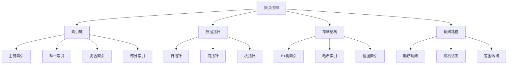

# 索引结构

## 📖 核心概念

**索引结构（Index Structure）**是数据库中用于快速定位和访问数据的数据结构。它通过建立键值到数据位置的映射关系，将查找时间复杂度从O(n)降低到O(log n)或O(1)，是数据库性能优化的核心技术。

### 🏗️ 索引结构的组成要素



## 🔍 索引结构分类

### 按存储结构分类

| 索引类型 | 存储结构 | 优点 | 缺点 | 适用场景 |
|----------|----------|------|------|----------|
| **B+树索引** | 平衡树 | 范围查询好 | 空间开销大 | 一般查询 |
| **哈希索引** | 哈希表 | 等值查询快 | 不支持范围查询 | 精确匹配 |
| **位图索引** | 位图 | 空间效率高 | 更新代价大 | 低基数列 |
| **全文索引** | 倒排索引 | 文本搜索 | 空间开销大 | 文本检索 |

### 按功能分类

| 功能类型 | 特点 | 用途 | 实现方式 |
|----------|------|------|----------|
| **主键索引** | 唯一且非空 | 数据唯一标识 | B+树 |
| **唯一索引** | 值唯一 | 数据完整性 | B+树/哈希 |
| **普通索引** | 可重复 | 查询加速 | B+树 |
| **复合索引** | 多列组合 | 多条件查询 | B+树 |
| **部分索引** | 条件过滤 | 减少存储 | B+树 |

## 💻 B+树索引实现

### B+树节点结构

```cpp
template<typename K, typename V>
class BPlusTreeNode {
public:
    bool isLeaf;
    vector<K> keys;
    vector<V> values; // 仅叶子节点使用
    vector<BPlusTreeNode*> children; // 仅内部节点使用
    BPlusTreeNode* next; // 叶子节点链表
    BPlusTreeNode* prev; // 叶子节点链表
    int degree;
    
    BPlusTreeNode(int d, bool leaf = false) 
        : isLeaf(leaf), degree(d), next(nullptr), prev(nullptr) {
        keys.reserve(2 * degree - 1);
        if (isLeaf) {
            values.reserve(2 * degree - 1);
        } else {
            children.reserve(2 * degree);
        }
    }
    
    // 检查节点是否已满
    bool isFull() const {
        return keys.size() == 2 * degree - 1;
    }
    
    // 检查节点是否为空
    bool isEmpty() const {
        return keys.empty();
    }
    
    // 检查节点是否半满
    bool isHalfFull() const {
        return keys.size() >= degree - 1;
    }
};
```

### B+树索引类实现

```cpp
template<typename K, typename V>
class BPlusTreeIndex {
private:
    BPlusTreeNode<K, V>* root;
    int degree;
    int size;
    
    // 查找键的位置
    int findKeyIndex(const vector<K>& keys, const K& key) const {
        int left = 0, right = keys.size() - 1;
        while (left <= right) {
            int mid = left + (right - left) / 2;
            if (keys[mid] == key) {
                return mid;
            } else if (keys[mid] < key) {
                left = mid + 1;
            } else {
                right = mid - 1;
            }
        }
        return left;
    }
    
    // 插入键到叶子节点
    void insertKeyToLeaf(BPlusTreeNode<K, V>* node, const K& key, const V& value) {
        int index = findKeyIndex(node->keys, key);
        node->keys.insert(node->keys.begin() + index, key);
        node->values.insert(node->values.begin() + index, value);
    }
    
    // 分裂叶子节点
    BPlusTreeNode<K, V>* splitLeafNode(BPlusTreeNode<K, V>* node) {
        BPlusTreeNode<K, V>* newNode = new BPlusTreeNode<K, V>(degree, true);
        
        // 移动后半部分键值对
        int mid = node->keys.size() / 2;
        for (int i = mid; i < node->keys.size(); i++) {
            newNode->keys.push_back(node->keys[i]);
            newNode->values.push_back(node->values[i]);
        }
        
        // 删除原节点中的后半部分
        node->keys.erase(node->keys.begin() + mid, node->keys.end());
        node->values.erase(node->values.begin() + mid, node->values.end());
        
        // 更新链表指针
        newNode->next = node->next;
        newNode->prev = node;
        if (node->next) {
            node->next->prev = newNode;
        }
        node->next = newNode;
        
        return newNode;
    }
    
    // 分裂内部节点
    BPlusTreeNode<K, V>* splitInternalNode(BPlusTreeNode<K, V>* node) {
        BPlusTreeNode<K, V>* newNode = new BPlusTreeNode<K, V>(degree, false);
        
        // 移动后半部分键和子节点
        int mid = node->keys.size() / 2;
        K middleKey = node->keys[mid];
        
        for (int i = mid + 1; i < node->keys.size(); i++) {
            newNode->keys.push_back(node->keys[i]);
        }
        
        for (int i = mid + 1; i < node->children.size(); i++) {
            newNode->children.push_back(node->children[i]);
        }
        
        // 删除原节点中的后半部分
        node->keys.erase(node->keys.begin() + mid, node->keys.end());
        node->children.erase(node->children.begin() + mid + 1, node->children.end());
        
        return newNode;
    }
    
    // 插入内部节点
    BPlusTreeNode<K, V>* insertInternal(BPlusTreeNode<K, V>* node, const K& key, const V& value) {
        if (node->isLeaf) {
            // 叶子节点插入
            if (!node->isFull()) {
                insertKeyToLeaf(node, key, value);
                return nullptr;
            } else {
                // 分裂叶子节点
                BPlusTreeNode<K, V>* newNode = splitLeafNode(node);
                K middleKey = newNode->keys[0];
                
                // 创建新的内部节点
                BPlusTreeNode<K, V>* newInternal = new BPlusTreeNode<K, V>(degree, false);
                newInternal->keys.push_back(middleKey);
                newInternal->children.push_back(node);
                newInternal->children.push_back(newNode);
                
                return newInternal;
            }
        } else {
            // 内部节点插入
            int index = findKeyIndex(node->keys, key);
            BPlusTreeNode<K, V>* child = node->children[index];
            
            BPlusTreeNode<K, V>* newChild = insertInternal(child, key, value);
            
            if (newChild) {
                // 子节点分裂，需要更新当前节点
                K middleKey = newChild->keys[0];
                node->keys.insert(node->keys.begin() + index, middleKey);
                node->children.insert(node->children.begin() + index + 1, newChild);
                
                if (node->isFull()) {
                    return splitInternalNode(node);
                }
            }
            
            return nullptr;
        }
    }
    
    // 查找键
    V* searchKey(BPlusTreeNode<K, V>* node, const K& key) const {
        if (!node) return nullptr;
        
        if (node->isLeaf) {
            int index = findKeyIndex(node->keys, key);
            if (index < node->keys.size() && node->keys[index] == key) {
                return &node->values[index];
            }
            return nullptr;
        } else {
            int index = findKeyIndex(node->keys, key);
            return searchKey(node->children[index], key);
        }
    }
    
    // 范围查询
    void rangeQuery(BPlusTreeNode<K, V>* node, const K& startKey, const K& endKey, 
                   vector<pair<K, V>>& result) const {
        if (!node) return;
        
        if (node->isLeaf) {
            for (int i = 0; i < node->keys.size(); i++) {
                if (node->keys[i] >= startKey && node->keys[i] <= endKey) {
                    result.push_back({node->keys[i], node->values[i]});
                }
            }
        } else {
            int index = findKeyIndex(node->keys, startKey);
            rangeQuery(node->children[index], startKey, endKey, result);
        }
    }
    
    // 清空树
    void clearTree(BPlusTreeNode<K, V>* node) {
        if (node) {
            if (!node->isLeaf) {
                for (auto child : node->children) {
                    clearTree(child);
                }
            }
            delete node;
        }
    }
    
public:
    BPlusTreeIndex(int d = 3) : root(nullptr), degree(d), size(0) {}
    
    ~BPlusTreeIndex() {
        clearTree(root);
    }
    
    // 插入键值对
    void insert(const K& key, const V& value) {
        if (!root) {
            root = new BPlusTreeNode<K, V>(degree, true);
            root->keys.push_back(key);
            root->values.push_back(value);
            size = 1;
            return;
        }
        
        BPlusTreeNode<K, V>* newRoot = insertInternal(root, key, value);
        if (newRoot) {
            root = newRoot;
        }
        size++;
    }
    
    // 查找值
    V* find(const K& key) const {
        return searchKey(root, key);
    }
    
    // 范围查询
    vector<pair<K, V>> rangeQuery(const K& startKey, const K& endKey) const {
        vector<pair<K, V>> result;
        rangeQuery(root, startKey, endKey, result);
        return result;
    }
    
    // 获取所有键值对
    vector<pair<K, V>> getAll() const {
        vector<pair<K, V>> result;
        if (root) {
            BPlusTreeNode<K, V>* current = root;
            while (!current->isLeaf) {
                current = current->children[0];
            }
            
            while (current) {
                for (int i = 0; i < current->keys.size(); i++) {
                    result.push_back({current->keys[i], current->values[i]});
                }
                current = current->next;
            }
        }
        return result;
    }
    
    // 获取大小
    int getSize() const {
        return size;
    }
    
    // 检查是否为空
    bool isEmpty() const {
        return size == 0;
    }
    
    // 获取树的高度
    int getHeight() const {
        if (!root) return 0;
        
        int height = 1;
        BPlusTreeNode<K, V>* current = root;
        while (!current->isLeaf) {
            current = current->children[0];
            height++;
        }
        return height;
    }
};
```

## 🎯 哈希索引实现

### 哈希索引类

```cpp
template<typename K, typename V>
class HashIndex {
private:
    struct HashEntry {
        K key;
        V value;
        HashEntry* next;
        
        HashEntry(const K& k, const V& v) : key(k), value(v), next(nullptr) {}
    };
    
    vector<HashEntry*> buckets;
    int capacity;
    int size;
    double loadFactor;
    
    // 哈希函数
    size_t hashFunction(const K& key) const {
        return std::hash<K>{}(key) % capacity;
    }
    
    // 扩容
    void resize() {
        int oldCapacity = capacity;
        vector<HashEntry*> oldBuckets = buckets;
        
        capacity *= 2;
        buckets.clear();
        buckets.resize(capacity, nullptr);
        size = 0;
        
        // 重新哈希所有元素
        for (int i = 0; i < oldCapacity; i++) {
            HashEntry* current = oldBuckets[i];
            while (current != nullptr) {
                HashEntry* next = current->next;
                size_t newIndex = hashFunction(current->key);
                
                current->next = buckets[newIndex];
                buckets[newIndex] = current;
                
                current = next;
            }
        }
    }
    
public:
    HashIndex(int cap = 16, double lf = 0.75) 
        : capacity(cap), size(0), loadFactor(lf) {
        buckets.resize(capacity, nullptr);
    }
    
    ~HashIndex() {
        clear();
    }
    
    // 插入键值对
    void insert(const K& key, const V& value) {
        if (size >= capacity * loadFactor) {
            resize();
        }
        
        size_t index = hashFunction(key);
        HashEntry* current = buckets[index];
        
        // 检查键是否已存在
        while (current != nullptr) {
            if (current->key == key) {
                current->value = value; // 更新值
                return;
            }
            current = current->next;
        }
        
        // 插入新节点
        HashEntry* newNode = new HashEntry(key, value);
        newNode->next = buckets[index];
        buckets[index] = newNode;
        size++;
    }
    
    // 查找值
    V* find(const K& key) const {
        size_t index = hashFunction(key);
        HashEntry* current = buckets[index];
        
        while (current != nullptr) {
            if (current->key == key) {
                return &current->value;
            }
            current = current->next;
        }
        
        return nullptr;
    }
    
    // 删除键值对
    bool erase(const K& key) {
        size_t index = hashFunction(key);
        HashEntry* current = buckets[index];
        HashEntry* prev = nullptr;
        
        while (current != nullptr) {
            if (current->key == key) {
                if (prev == nullptr) {
                    buckets[index] = current->next;
                } else {
                    prev->next = current->next;
                }
                
                delete current;
                size--;
                return true;
            }
            
            prev = current;
            current = current->next;
        }
        
        return false;
    }
    
    // 获取大小
    int getSize() const {
        return size;
    }
    
    // 检查是否为空
    bool isEmpty() const {
        return size == 0;
    }
    
    // 获取负载因子
    double getLoadFactor() const {
        return static_cast<double>(size) / capacity;
    }
    
    // 清空索引
    void clear() {
        for (int i = 0; i < capacity; i++) {
            HashEntry* current = buckets[i];
            while (current != nullptr) {
                HashEntry* next = current->next;
                delete current;
                current = next;
            }
            buckets[i] = nullptr;
        }
        size = 0;
    }
};
```

## 🎯 复合索引实现

### 复合索引类

```cpp
template<typename K1, typename K2, typename V>
class CompositeIndex {
private:
    struct CompositeKey {
        K1 key1;
        K2 key2;
        
        CompositeKey(const K1& k1, const K2& k2) : key1(k1), key2(k2) {}
        
        bool operator<(const CompositeKey& other) const {
            if (key1 != other.key1) {
                return key1 < other.key1;
            }
            return key2 < other.key2;
        }
        
        bool operator==(const CompositeKey& other) const {
            return key1 == other.key1 && key2 == other.key2;
        }
    };
    
    struct CompositeKeyHash {
        size_t operator()(const CompositeKey& key) const {
            size_t h1 = std::hash<K1>{}(key.key1);
            size_t h2 = std::hash<K2>{}(key.key2);
            return h1 ^ (h2 << 1);
        }
    };
    
    BPlusTreeIndex<CompositeKey, V> btreeIndex;
    unordered_map<CompositeKey, V, CompositeKeyHash> hashIndex;
    
public:
    CompositeIndex() {}
    
    // 插入键值对
    void insert(const K1& key1, const K2& key2, const V& value) {
        CompositeKey compositeKey(key1, key2);
        btreeIndex.insert(compositeKey, value);
        hashIndex[compositeKey] = value;
    }
    
    // 查找值
    V* find(const K1& key1, const K2& key2) const {
        CompositeKey compositeKey(key1, key2);
        return btreeIndex.find(compositeKey);
    }
    
    // 范围查询
    vector<pair<CompositeKey, V>> rangeQuery(const K1& startKey1, const K1& endKey1,
                                           const K2& startKey2, const K2& endKey2) const {
        CompositeKey startKey(startKey1, startKey2);
        CompositeKey endKey(endKey1, endKey2);
        return btreeIndex.rangeQuery(startKey, endKey);
    }
    
    // 前缀查询（仅使用第一个键）
    vector<pair<CompositeKey, V>> prefixQuery(const K1& key1) const {
        CompositeKey startKey(key1, K2{});
        CompositeKey endKey(key1, K2{});
        return btreeIndex.rangeQuery(startKey, endKey);
    }
    
    // 获取大小
    int getSize() const {
        return btreeIndex.getSize();
    }
    
    // 检查是否为空
    bool isEmpty() const {
        return btreeIndex.isEmpty();
    }
};
```

## 🎯 索引管理器

### 索引管理器类

```cpp
template<typename K, typename V>
class IndexManager {
private:
    unordered_map<string, unique_ptr<BPlusTreeIndex<K, V>>> btreeIndexes;
    unordered_map<string, unique_ptr<HashIndex<K, V>>> hashIndexes;
    
public:
    // 创建B+树索引
    void createBTreeIndex(const string& indexName, int degree = 3) {
        btreeIndexes[indexName] = make_unique<BPlusTreeIndex<K, V>>(degree);
    }
    
    // 创建哈希索引
    void createHashIndex(const string& indexName, int capacity = 16) {
        hashIndexes[indexName] = make_unique<HashIndex<K, V>>(capacity);
    }
    
    // 插入数据到指定索引
    void insert(const string& indexName, const K& key, const V& value) {
        if (btreeIndexes.find(indexName) != btreeIndexes.end()) {
            btreeIndexes[indexName]->insert(key, value);
        } else if (hashIndexes.find(indexName) != hashIndexes.end()) {
            hashIndexes[indexName]->insert(key, value);
        } else {
            throw std::runtime_error("Index not found: " + indexName);
        }
    }
    
    // 从指定索引查找数据
    V* find(const string& indexName, const K& key) const {
        if (btreeIndexes.find(indexName) != btreeIndexes.end()) {
            return btreeIndexes.at(indexName)->find(key);
        } else if (hashIndexes.find(indexName) != hashIndexes.end()) {
            return hashIndexes.at(indexName)->find(key);
        } else {
            throw std::runtime_error("Index not found: " + indexName);
        }
    }
    
    // 范围查询（仅B+树索引支持）
    vector<pair<K, V>> rangeQuery(const string& indexName, const K& startKey, const K& endKey) const {
        if (btreeIndexes.find(indexName) != btreeIndexes.end()) {
            return btreeIndexes.at(indexName)->rangeQuery(startKey, endKey);
        } else {
            throw std::runtime_error("Range query not supported for hash index: " + indexName);
        }
    }
    
    // 删除索引
    void dropIndex(const string& indexName) {
        btreeIndexes.erase(indexName);
        hashIndexes.erase(indexName);
    }
    
    // 获取索引信息
    void getIndexInfo(const string& indexName) const {
        if (btreeIndexes.find(indexName) != btreeIndexes.end()) {
            auto index = btreeIndexes.at(indexName);
            cout << "Index: " << indexName << " (B+Tree)" << endl;
            cout << "Size: " << index->getSize() << endl;
            cout << "Height: " << index->getHeight() << endl;
        } else if (hashIndexes.find(indexName) != hashIndexes.end()) {
            auto index = hashIndexes.at(indexName);
            cout << "Index: " << indexName << " (Hash)" << endl;
            cout << "Size: " << index->getSize() << endl;
            cout << "Load Factor: " << index->getLoadFactor() << endl;
        } else {
            cout << "Index not found: " << indexName << endl;
        }
    }
    
    // 列出所有索引
    vector<string> listIndexes() const {
        vector<string> indexes;
        for (const auto& [name, index] : btreeIndexes) {
            indexes.push_back(name + " (B+Tree)");
        }
        for (const auto& [name, index] : hashIndexes) {
            indexes.push_back(name + " (Hash)");
        }
        return indexes;
    }
};
```

## ⚡ 复杂度分析

### 时间复杂度

| 操作 | B+树索引 | 哈希索引 | 说明 |
|------|----------|----------|------|
| **插入** | O(log n) | O(1) | 平均情况 |
| **查找** | O(log n) | O(1) | 平均情况 |
| **删除** | O(log n) | O(1) | 平均情况 |
| **范围查询** | O(log n + k) | O(n) | k为结果数量 |

### 空间复杂度

| 索引类型 | 空间复杂度 | 说明 |
|----------|------------|------|
| **B+树索引** | O(n) | 额外指针开销 |
| **哈希索引** | O(n) | 负载因子控制 |
| **位图索引** | O(n×m) | m为不同值数量 |
| **复合索引** | O(n) | 多键组合 |

### 性能特点

| 特点 | B+树索引 | 哈希索引 | 位图索引 |
|------|----------|----------|----------|
| **等值查询** | 好 | 优秀 | 一般 |
| **范围查询** | 优秀 | 差 | 一般 |
| **插入性能** | 好 | 优秀 | 差 |
| **空间效率** | 一般 | 好 | 优秀 |

## 🎓 学习要点总结

### 核心理解

1. **索引原理**：理解索引如何加速数据访问
2. **结构选择**：掌握不同索引结构的适用场景
3. **性能权衡**：理解空间和时间复杂度的权衡
4. **维护成本**：掌握索引维护的开销

### 实践要点

1. **索引设计**：根据查询模式设计合适的索引
2. **性能测试**：测试不同索引的性能表现
3. **维护策略**：制定索引维护和优化策略
4. **监控分析**：监控索引使用情况和性能

### 应用思维

1. **数据库设计**：理解索引在数据库中的作用
2. **查询优化**：掌握索引对查询性能的影响
3. **系统设计**：将索引应用到系统设计中
4. **性能优化**：使用索引优化系统性能

---

**相关链接：**
- [[05-高级结构/02-平衡树族/03-B树与B+树|B树与B+树]] - B+树索引的基础
- [[05-高级结构/01-哈希宇宙/01-哈希表HashTable详解|哈希表HashTable详解]] - 哈希索引的基础
- [[06-应用实战/01-数据库王国/02-查询优化|查询优化]] - 索引在查询优化中的应用
- [[06-应用实战/01-数据库王国/03-事务管理|事务管理]] - 索引在事务管理中的作用
