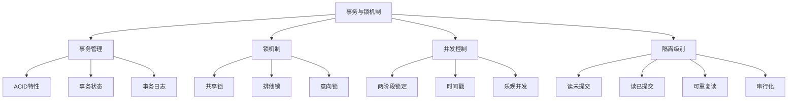

# 事务与锁机制

## 📖 核心概念

**事务与锁机制**是数据库系统中保证数据一致性和并发控制的重要机制。事务确保操作的原子性，锁机制防止并发访问时的数据冲突。

### 🏗️ 事务与锁机制分类



## 🔧 事务与锁机制实现

### 事务管理

```cpp
class TransactionManager {
private:
    struct Transaction {
        int transactionId;
        TransactionState state;
        vector<string> operations;
        map<string, string> localData;
        set<string> lockedResources;
        
        Transaction(int id) : transactionId(id), state(ACTIVE) {}
    };
    
    enum TransactionState {
        ACTIVE,
        COMMITTED,
        ABORTED
    };
    
    map<int, Transaction*> transactions;
    int nextTransactionId;
    mutex transactionMutex;
    
public:
    TransactionManager() : nextTransactionId(1) {}
    
    // 开始事务
    int beginTransaction() {
        lock_guard<mutex> lock(transactionMutex);
        
        int transactionId = nextTransactionId++;
        Transaction* transaction = new Transaction(transactionId);
        transactions[transactionId] = transaction;
        
        cout << "Started transaction: " << transactionId << endl;
        return transactionId;
    }
    
    // 提交事务
    bool commitTransaction(int transactionId) {
        lock_guard<mutex> lock(transactionMutex);
        
        auto it = transactions.find(transactionId);
        if (it == transactions.end()) {
            cout << "Transaction " << transactionId << " not found" << endl;
            return false;
        }
        
        Transaction* transaction = it->second;
        
        if (transaction->state != ACTIVE) {
            cout << "Transaction " << transactionId << " is not active" << endl;
            return false;
        }
        
        // 执行两阶段提交
        if (twoPhaseCommit(transaction)) {
            transaction->state = COMMITTED;
            cout << "Committed transaction: " << transactionId << endl;
            return true;
        } else {
            transaction->state = ABORTED;
            cout << "Aborted transaction: " << transactionId << endl;
            return false;
        }
    }
    
    // 回滚事务
    bool rollbackTransaction(int transactionId) {
        lock_guard<mutex> lock(transactionMutex);
        
        auto it = transactions.find(transactionId);
        if (it == transactions.end()) {
            cout << "Transaction " << transactionId << " not found" << endl;
            return false;
        }
        
        Transaction* transaction = it->second;
        
        // 释放锁
        releaseLocks(transaction);
        
        // 回滚数据
        rollbackData(transaction);
        
        transaction->state = ABORTED;
        cout << "Rolled back transaction: " << transactionId << endl;
        return true;
    }
    
    // 两阶段提交
    bool twoPhaseCommit(Transaction* transaction) {
        cout << "Phase 1: Prepare for transaction " << transaction->transactionId << endl;
        
        // 准备阶段
        if (!preparePhase(transaction)) {
            return false;
        }
        
        cout << "Phase 2: Commit for transaction " << transaction->transactionId << endl;
        
        // 提交阶段
        if (!commitPhase(transaction)) {
            return false;
        }
        
        return true;
    }
    
    // 准备阶段
    bool preparePhase(Transaction* transaction) {
        // 模拟准备阶段
        this_thread::sleep_for(chrono::milliseconds(10));
        return true;
    }
    
    // 提交阶段
    bool commitPhase(Transaction* transaction) {
        // 模拟提交阶段
        this_thread::sleep_for(chrono::milliseconds(10));
        return true;
    }
    
    // 释放锁
    void releaseLocks(Transaction* transaction) {
        for (const string& resource : transaction->lockedResources) {
            cout << "Released lock on resource: " << resource << endl;
        }
        transaction->lockedResources.clear();
    }
    
    // 回滚数据
    void rollbackData(Transaction* transaction) {
        for (auto& pair : transaction->localData) {
            cout << "Rolled back data for key: " << pair.first << endl;
        }
        transaction->localData.clear();
    }
    
    // 显示事务状态
    void displayTransactionStatus() {
        cout << "Transaction Status:" << endl;
        cout << "=================" << endl;
        
        for (auto& pair : transactions) {
            Transaction* transaction = pair.second;
            cout << "Transaction " << transaction->transactionId << ": ";
            
            switch (transaction->state) {
                case ACTIVE:
                    cout << "ACTIVE";
                    break;
                case COMMITTED:
                    cout << "COMMITTED";
                    break;
                case ABORTED:
                    cout << "ABORTED";
                    break;
            }
            cout << endl;
        }
    }
};
```

### 锁机制

```cpp
class LockManager {
private:
    enum LockType {
        SHARED,
        EXCLUSIVE,
        INTENT_SHARED,
        INTENT_EXCLUSIVE
    };
    
    struct LockRequest {
        int transactionId;
        LockType type;
        chrono::time_point<chrono::high_resolution_clock> timestamp;
        
        LockRequest(int tid, LockType t) : transactionId(tid), type(t) {
            timestamp = chrono::high_resolution_clock::now();
        }
    };
    
    struct ResourceLock {
        string resource;
        LockType currentLock;
        int holderTransactionId;
        queue<LockRequest> waitingQueue;
        
        ResourceLock(const string& res) : resource(res), currentLock(SHARED), holderTransactionId(-1) {}
    };
    
    map<string, ResourceLock*> resourceLocks;
    mutex lockMutex;
    
public:
    LockManager() {}
    
    // 请求锁
    bool requestLock(int transactionId, const string& resource, LockType type) {
        lock_guard<mutex> lock(lockMutex);
        
        ResourceLock* resourceLock = getOrCreateResourceLock(resource);
        LockRequest request(transactionId, type);
        
        // 检查是否可以立即获得锁
        if (canGrantLock(resourceLock, request)) {
            grantLock(resourceLock, request);
            return true;
        } else {
            // 加入等待队列
            resourceLock->waitingQueue.push(request);
            cout << "Transaction " << transactionId << " waiting for lock on " << resource << endl;
            return false;
        }
    }
    
    // 释放锁
    bool releaseLock(int transactionId, const string& resource) {
        lock_guard<mutex> lock(lockMutex);
        
        auto it = resourceLocks.find(resource);
        if (it == resourceLocks.end()) {
            return false;
        }
        
        ResourceLock* resourceLock = it->second;
        
        if (resourceLock->holderTransactionId != transactionId) {
            return false;
        }
        
        // 释放锁
        resourceLock->currentLock = SHARED;
        resourceLock->holderTransactionId = -1;
        
        cout << "Transaction " << transactionId << " released lock on " << resource << endl;
        
        // 检查等待队列
        processWaitingQueue(resourceLock);
        
        return true;
    }
    
    // 获取或创建资源锁
    ResourceLock* getOrCreateResourceLock(const string& resource) {
        auto it = resourceLocks.find(resource);
        if (it == resourceLocks.end()) {
            resourceLocks[resource] = new ResourceLock(resource);
        }
        return resourceLocks[resource];
    }
    
    // 检查是否可以授予锁
    bool canGrantLock(ResourceLock* resourceLock, const LockRequest& request) {
        if (resourceLock->holderTransactionId == -1) {
            return true;
        }
        
        if (resourceLock->holderTransactionId == request.transactionId) {
            return true;
        }
        
        // 检查锁兼容性
        if (resourceLock->currentLock == SHARED && request.type == SHARED) {
            return true;
        }
        
        return false;
    }
    
    // 授予锁
    void grantLock(ResourceLock* resourceLock, const LockRequest& request) {
        resourceLock->currentLock = request.type;
        resourceLock->holderTransactionId = request.transactionId;
        
        cout << "Granted " << (request.type == SHARED ? "SHARED" : "EXCLUSIVE") 
             << " lock on " << resourceLock->resource 
             << " to transaction " << request.transactionId << endl;
    }
    
    // 处理等待队列
    void processWaitingQueue(ResourceLock* resourceLock) {
        while (!resourceLock->waitingQueue.empty()) {
            LockRequest request = resourceLock->waitingQueue.front();
            
            if (canGrantLock(resourceLock, request)) {
                resourceLock->waitingQueue.pop();
                grantLock(resourceLock, request);
            } else {
                break;
            }
        }
    }
    
    // 检测死锁
    bool detectDeadlock() {
        cout << "Deadlock Detection:" << endl;
        cout << "=================" << endl;
        
        // 简化的死锁检测
        for (auto& pair : resourceLocks) {
            ResourceLock* resourceLock = pair.second;
            
            if (!resourceLock->waitingQueue.empty()) {
                cout << "Resource " << resourceLock->resource << " has waiting transactions" << endl;
                
                // 检查是否有循环等待
                if (hasCircularWait(resourceLock)) {
                    cout << "Deadlock detected!" << endl;
                    return true;
                }
            }
        }
        
        cout << "No deadlock detected" << endl;
        return false;
    }
    
    // 检查循环等待
    bool hasCircularWait(ResourceLock* resourceLock) {
        // 简化的循环等待检测
        return false;
    }
    
    // 显示锁状态
    void displayLockStatus() {
        cout << "Lock Status:" << endl;
        cout << "===========" << endl;
        
        for (auto& pair : resourceLocks) {
            ResourceLock* resourceLock = pair.second;
            
            cout << "Resource: " << resourceLock->resource << endl;
            cout << "  Current lock: " << (resourceLock->currentLock == SHARED ? "SHARED" : "EXCLUSIVE") << endl;
            cout << "  Holder: " << resourceLock->holderTransactionId << endl;
            cout << "  Waiting queue size: " << resourceLock->waitingQueue.size() << endl;
        }
    }
};
```

### 并发控制

```cpp
class ConcurrencyControl {
private:
    enum IsolationLevel {
        READ_UNCOMMITTED,
        READ_COMMITTED,
        REPEATABLE_READ,
        SERIALIZABLE
    };
    
    struct Version {
        int transactionId;
        string data;
        chrono::time_point<chrono::high_resolution_clock> timestamp;
        
        Version(int tid, const string& d) : transactionId(tid), data(d) {
            timestamp = chrono::high_resolution_clock::now();
        }
    };
    
    map<string, vector<Version>> dataVersions;
    map<int, chrono::time_point<chrono::high_resolution_clock>> transactionTimestamps;
    mutex concurrencyMutex;
    
public:
    ConcurrencyControl() {}
    
    // 多版本并发控制
    void multiversionConcurrencyControl(int transactionId, const string& key, const string& value) {
        lock_guard<mutex> lock(concurrencyMutex);
        
        // 创建新版本
        Version version(transactionId, value);
        dataVersions[key].push_back(version);
        
        // 记录事务时间戳
        transactionTimestamps[transactionId] = version.timestamp;
        
        cout << "Created version for transaction " << transactionId 
             << " on key " << key << endl;
    }
    
    // 时间戳排序
    bool timestampOrdering(int transactionId, const string& key) {
        lock_guard<mutex> lock(concurrencyMutex);
        
        auto it = transactionTimestamps.find(transactionId);
        if (it == transactionTimestamps.end()) {
            return false;
        }
        
        chrono::time_point<chrono::high_resolution_clock> transactionTime = it->second;
        
        // 检查是否有更新的版本
        if (dataVersions.find(key) != dataVersions.end()) {
            vector<Version>& versions = dataVersions[key];
            
            for (const Version& version : versions) {
                if (version.timestamp > transactionTime) {
                    cout << "Transaction " << transactionId 
                         << " conflicts with newer version" << endl;
                    return false;
                }
            }
        }
        
        return true;
    }
    
    // 乐观并发控制
    bool optimisticConcurrencyControl(int transactionId, const string& key, const string& value) {
        lock_guard<mutex> lock(concurrencyMutex);
        
        // 检查是否有冲突
        if (hasConflict(transactionId, key)) {
            cout << "Conflict detected for transaction " << transactionId << endl;
            return false;
        }
        
        // 提交更改
        Version version(transactionId, value);
        dataVersions[key].push_back(version);
        
        cout << "Optimistic commit for transaction " << transactionId << endl;
        return true;
    }
    
    // 检查冲突
    bool hasConflict(int transactionId, const string& key) {
        auto it = transactionTimestamps.find(transactionId);
        if (it == transactionTimestamps.end()) {
            return false;
        }
        
        chrono::time_point<chrono::high_resolution_clock> transactionTime = it->second;
        
        if (dataVersions.find(key) != dataVersions.end()) {
            vector<Version>& versions = dataVersions[key];
            
            for (const Version& version : versions) {
                if (version.timestamp > transactionTime) {
                    return true;
                }
            }
        }
        
        return false;
    }
    
    // 显示并发控制状态
    void displayConcurrencyStatus() {
        cout << "Concurrency Control Status:" << endl;
        cout << "=========================" << endl;
        
        for (auto& pair : dataVersions) {
            cout << "Key: " << pair.first << endl;
            vector<Version>& versions = pair.second;
            
            for (const Version& version : versions) {
                cout << "  Transaction: " << version.transactionId 
                     << ", Data: " << version.data << endl;
            }
        }
    }
};
```

## 🎯 事务与锁机制应用

### 实际应用场景

```cpp
class TransactionLockApplications {
public:
    static void demonstrateApplications() {
        cout << "Transaction & Lock Applications:" << endl;
        cout << "==============================" << endl;
        
        cout << "1. 数据库事务:" << endl;
        cout << "   - ACID特性保证" << endl;
        cout << "   - 数据一致性" << endl;
        cout << "   - 故障恢复" << endl;
        
        cout << "2. 并发控制:" << endl;
        cout << "   - 多用户访问" << endl;
        cout << "   - 数据完整性" << endl;
        cout << "   - 性能优化" << endl;
        
        cout << "3. 分布式系统:" << endl;
        cout << "   - 分布式事务" << endl;
        cout << "   - 两阶段提交" << endl;
        cout << "   - 一致性协议" << endl;
        
        cout << "4. 金融系统:" << endl;
        cout << "   - 资金转账" << endl;
        cout << "   - 账户管理" << endl;
        cout << "   - 风险控制" << endl;
    }
    
    static void analyzePerformance() {
        cout << "Transaction & Lock Performance Analysis:" << endl;
        cout << "======================================" << endl;
        
        cout << "1. 事务性能:" << endl;
        cout << "   - 优点: 数据一致性，故障恢复" << endl;
        cout << "   - 缺点: 性能开销，锁竞争" << endl;
        cout << "   - 适用: 关键业务系统" << endl;
        cout << endl;
        
        cout << "2. 锁机制:" << endl;
        cout << "   - 优点: 数据完整性，并发控制" << endl;
        cout << "   - 缺点: 死锁风险，性能下降" << endl;
        cout << "   - 适用: 高并发系统" << endl;
        cout << endl;
        
        cout << "3. 并发控制:" << endl;
        cout << "   - 优点: 提高并发性，优化性能" << endl;
        cout << "   - 缺点: 实现复杂，一致性挑战" << endl;
        cout << "   - 适用: 大规模系统" << endl;
    }
    
    static void selectConcurrencyControl(bool needsConsistency, bool needsHighPerformance, bool needsScalability) {
        cout << "Concurrency Control Selection:" << endl;
        cout << "=============================" << endl;
        
        cout << "Needs consistency: " << (needsConsistency ? "Yes" : "No") << endl;
        cout << "Needs high performance: " << (needsHighPerformance ? "Yes" : "No") << endl;
        cout << "Needs scalability: " << (needsScalability ? "Yes" : "No") << endl;
        
        cout << "Recommendation:" << endl;
        
        if (needsConsistency) {
            cout << "Use Two-Phase Locking (consistency)" << endl;
        } else if (needsHighPerformance) {
            cout << "Use Optimistic Concurrency Control (performance)" << endl;
        } else if (needsScalability) {
            cout << "Use Multiversion Concurrency Control (scalability)" << endl;
        } else {
            cout << "Use Basic Locking (simple)" << endl;
        }
    }
};
```

## 📊 事务与锁机制分析

### 性能分析

```cpp
class TransactionLockAnalysis {
public:
    static void analyzePerformance() {
        cout << "Transaction & Lock Performance Analysis:" << endl;
        cout << "======================================" << endl;
        
        cout << "1. 时间复杂度:" << endl;
        cout << "   - 事务提交: O(n)" << endl;
        cout << "   - 锁获取: O(1)" << endl;
        cout << "   - 死锁检测: O(n²)" << endl;
        cout << "   - 并发控制: O(log n)" << endl;
        
        cout << "2. 空间复杂度:" << endl;
        cout << "   - 事务日志: O(n)" << endl;
        cout << "   - 锁表: O(n)" << endl;
        cout << "   - 版本存储: O(n)" << endl;
        cout << "   - 总空间: O(n)" << endl;
        
        cout << "3. 性能特性:" << endl;
        cout << "   - 事务: 保证一致性" << endl;
        cout << "   - 锁: 防止冲突" << endl;
        cout << "   - 并发: 提高性能" << endl;
    }
    
    static void analyzeSpaceComplexity() {
        cout << "Transaction & Lock Space Complexity Analysis:" << endl;
        cout << "===========================================" << endl;
        
        cout << "1. 事务管理:" << endl;
        cout << "   - 事务表: O(n)" << endl;
        cout << "   - 操作日志: O(n)" << endl;
        cout << "   - 总空间: O(n)" << endl;
        
        cout << "2. 锁管理:" << endl;
        cout << "   - 锁表: O(n)" << endl;
        cout << "   - 等待队列: O(n)" << endl;
        cout << "   - 总空间: O(n)" << endl;
        
        cout << "3. 并发控制:" << endl;
        cout << "   - 版本存储: O(n)" << endl;
        cout << "   - 时间戳: O(n)" << endl;
        cout << "   - 总空间: O(n)" << endl;
    }
    
    static void analyzeTimeComplexity() {
        cout << "Transaction & Lock Time Complexity Analysis:" << endl;
        cout << "==========================================" << endl;
        
        cout << "1. 事务操作:" << endl;
        cout << "   - 开始: O(1)" << endl;
        cout << "   - 提交: O(n)" << endl;
        cout << "   - 回滚: O(n)" << endl;
        
        cout << "2. 锁操作:" << endl;
        cout << "   - 获取: O(1)" << endl;
        cout << "   - 释放: O(1)" << endl;
        cout << "   - 检测: O(n²)" << endl;
        
        cout << "3. 并发控制:" << endl;
        cout << "   - 版本创建: O(1)" << endl;
        cout << "   - 冲突检测: O(log n)" << endl;
        cout << "   - 提交: O(log n)" << endl;
    }
};
```

## 🎮 事务与锁机制测试

### 1. 基础功能测试

```cpp
class TransactionLockTest {
public:
    static void testTransactionManager() {
        cout << "Testing Transaction Manager:" << endl;
        cout << "=========================" << endl;
        
        TransactionManager tm;
        
        // 开始事务
        int t1 = tm.beginTransaction();
        int t2 = tm.beginTransaction();
        
        // 提交事务
        tm.commitTransaction(t1);
        tm.commitTransaction(t2);
        
        tm.displayTransactionStatus();
    }
    
    static void testLockManager() {
        cout << "Testing Lock Manager:" << endl;
        cout << "===================" << endl;
        
        LockManager lm;
        
        // 请求锁
        lm.requestLock(1, "resource1", LockManager::SHARED);
        lm.requestLock(2, "resource1", LockManager::EXCLUSIVE);
        
        // 释放锁
        lm.releaseLock(1, "resource1");
        
        lm.displayLockStatus();
        lm.detectDeadlock();
    }
    
    static void testConcurrencyControl() {
        cout << "Testing Concurrency Control:" << endl;
        cout << "=========================" << endl;
        
        ConcurrencyControl cc;
        
        // 多版本并发控制
        cc.multiversionConcurrencyControl(1, "key1", "value1");
        cc.multiversionConcurrencyControl(2, "key1", "value2");
        
        // 时间戳排序
        cc.timestampOrdering(1, "key1");
        
        // 乐观并发控制
        cc.optimisticConcurrencyControl(3, "key2", "value3");
        
        cc.displayConcurrencyStatus();
    }
    
    static void testApplications() {
        cout << "Testing Applications:" << endl;
        cout << "==================" << endl;
        
        TransactionLockApplications::demonstrateApplications();
        TransactionLockApplications::analyzePerformance();
        TransactionLockApplications::selectConcurrencyControl(true, false, false);
    }
    
    static void testAnalysis() {
        cout << "Testing Analysis:" << endl;
        cout << "===============" << endl;
        
        TransactionLockAnalysis::analyzePerformance();
        TransactionLockAnalysis::analyzeSpaceComplexity();
        TransactionLockAnalysis::analyzeTimeComplexity();
    }
};
```

## 🔗 相关链接

- [[01-数据库索引结构|数据库索引结构]]
- [[02-MySQL索引优化|MySQL索引优化]]
- [[03-NoSQL数据库设计|NoSQL数据库设计]]

## 💡 事务与锁机制要点

1. **ACID特性**: 原子性、一致性、隔离性、持久性
2. **锁机制**: 共享锁、排他锁、意向锁
3. **并发控制**: 两阶段锁定、时间戳、乐观并发
4. **隔离级别**: 读未提交、读已提交、可重复读、串行化

---

*📝 事务与锁机制提示：事务和锁机制是数据库系统的核心，需要根据业务需求选择合适的并发控制策略*
