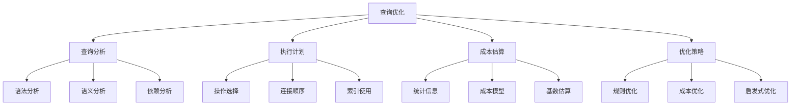

# 查询优化

## 📖 核心概念

**查询优化（Query Optimization）**是数据库系统中将用户查询转换为高效执行计划的过程。它通过分析查询语句、选择最优的执行策略、利用索引和统计信息，将查询性能从O(n)优化到O(log n)或O(1)，是数据库性能的核心技术。

### 🏗️ 查询优化的组成要素



## 🔍 查询优化分类

### 按优化阶段分类

| 优化阶段 | 特点 | 方法 | 目标 |
|----------|------|------|------|
| **语法优化** | 查询重写 | 规则转换 | 简化查询 |
| **逻辑优化** | 关系代数 | 等价变换 | 减少操作 |
| **物理优化** | 执行计划 | 成本估算 | 选择最优 |
| **运行时优化** | 动态调整 | 自适应 | 实时优化 |

### 按优化策略分类

| 策略类型 | 特点 | 优点 | 缺点 | 适用场景 |
|----------|------|------|------|----------|
| **基于规则** | 固定规则 | 简单快速 | 不够灵活 | 简单查询 |
| **基于成本** | 成本估算 | 精确优化 | 计算复杂 | 复杂查询 |
| **基于统计** | 统计信息 | 准确性高 | 维护成本 | 大数据量 |
| **混合优化** | 多种策略 | 综合优势 | 实现复杂 | 通用系统 |

## 💻 查询解析器实现

### 查询解析器类

```cpp
class QueryParser {
private:
    struct QueryNode {
        string operation;
        vector<string> tables;
        vector<string> columns;
        vector<string> conditions;
        vector<string> joins;
        string orderBy;
        int limit;
        
        QueryNode() : limit(-1) {}
    };
    
    // 解析SELECT语句
    QueryNode parseSelect(const string& query) {
        QueryNode node;
        node.operation = "SELECT";
        
        // 简化的SQL解析（实际实现会更复杂）
        regex selectRegex(R"(SELECT\s+(.+?)\s+FROM\s+(.+?)(?:\s+WHERE\s+(.+?))?(?:\s+ORDER\s+BY\s+(.+?))?(?:\s+LIMIT\s+(\d+))?)");
        smatch matches;
        
        if (regex_search(query, matches, selectRegex)) {
            // 解析列名
            string columnsStr = matches[1].str();
            if (columnsStr != "*") {
                stringstream ss(columnsStr);
                string column;
                while (getline(ss, column, ',')) {
                    node.columns.push_back(trim(column));
                }
            }
            
            // 解析表名
            string tablesStr = matches[2].str();
            stringstream ss(tablesStr);
            string table;
            while (getline(ss, table, ',')) {
                node.tables.push_back(trim(table));
            }
            
            // 解析WHERE条件
            if (matches[3].matched) {
                string conditionsStr = matches[3].str();
                parseConditions(conditionsStr, node.conditions);
            }
            
            // 解析ORDER BY
            if (matches[4].matched) {
                node.orderBy = matches[4].str();
            }
            
            // 解析LIMIT
            if (matches[5].matched) {
                node.limit = stoi(matches[5].str());
            }
        }
        
        return node;
    }
    
    // 解析WHERE条件
    void parseConditions(const string& conditionsStr, vector<string>& conditions) {
        stringstream ss(conditionsStr);
        string condition;
        while (getline(ss, condition, ' ')) {
            if (condition == "AND" || condition == "OR") {
                conditions.push_back(condition);
            } else if (condition.find("=") != string::npos || 
                      condition.find("<") != string::npos || 
                      condition.find(">") != string::npos) {
                conditions.push_back(condition);
            }
        }
    }
    
    // 去除字符串前后空格
    string trim(const string& str) {
        size_t first = str.find_first_not_of(' ');
        if (first == string::npos) return "";
        size_t last = str.find_last_not_of(' ');
        return str.substr(first, (last - first + 1));
    }
    
public:
    // 解析查询
    QueryNode parse(const string& query) {
        string upperQuery = query;
        transform(upperQuery.begin(), upperQuery.end(), upperQuery.begin(), ::toupper);
        
        if (upperQuery.find("SELECT") == 0) {
            return parseSelect(query);
        } else {
            throw std::runtime_error("Unsupported query type");
        }
    }
    
    // 验证查询语法
    bool validateQuery(const string& query) {
        try {
            parse(query);
            return true;
        } catch (...) {
            return false;
        }
    }
};
```

## 💻 执行计划生成器

### 执行计划节点

```cpp
class ExecutionPlanNode {
public:
    enum NodeType {
        SCAN,
        INDEX_SCAN,
        HASH_JOIN,
        NESTED_LOOP_JOIN,
        SORT,
        FILTER,
        PROJECTION
    };
    
    NodeType type;
    string tableName;
    string indexName;
    vector<string> columns;
    vector<string> conditions;
    double estimatedCost;
    int estimatedRows;
    ExecutionPlanNode* leftChild;
    ExecutionPlanNode* rightChild;
    
    ExecutionPlanNode(NodeType t) : type(t), estimatedCost(0), estimatedRows(0), 
                                   leftChild(nullptr), rightChild(nullptr) {}
    
    ~ExecutionPlanNode() {
        delete leftChild;
        delete rightChild;
    }
    
    // 计算节点成本
    double calculateCost() {
        switch (type) {
            case SCAN:
                return estimatedRows * 0.1; // 全表扫描成本
            case INDEX_SCAN:
                return estimatedRows * 0.01; // 索引扫描成本
            case HASH_JOIN:
                return estimatedRows * 0.05; // 哈希连接成本
            case NESTED_LOOP_JOIN:
                return estimatedRows * 0.2; // 嵌套循环连接成本
            case SORT:
                return estimatedRows * log2(estimatedRows) * 0.1; // 排序成本
            case FILTER:
                return estimatedRows * 0.02; // 过滤成本
            case PROJECTION:
                return estimatedRows * 0.01; // 投影成本
            default:
                return 0;
        }
    }
    
    // 获取总成本
    double getTotalCost() {
        double cost = calculateCost();
        if (leftChild) cost += leftChild->getTotalCost();
        if (rightChild) cost += rightChild->getTotalCost();
        return cost;
    }
};
```

### 执行计划生成器

```cpp
class ExecutionPlanGenerator {
private:
    struct TableInfo {
        string name;
        int rowCount;
        double avgRowSize;
        vector<string> columns;
        vector<string> indexes;
    };
    
    unordered_map<string, TableInfo> tableStats;
    
    // 估算表扫描成本
    double estimateTableScanCost(const string& tableName) {
        auto it = tableStats.find(tableName);
        if (it != tableStats.end()) {
            return it->second.rowCount * 0.1; // 全表扫描成本
        }
        return 1000; // 默认成本
    }
    
    // 估算索引扫描成本
    double estimateIndexScanCost(const string& tableName, const string& indexName) {
        auto it = tableStats.find(tableName);
        if (it != tableStats.end()) {
            return it->second.rowCount * 0.01; // 索引扫描成本
        }
        return 100; // 默认成本
    }
    
    // 估算连接成本
    double estimateJoinCost(ExecutionPlanNode* left, ExecutionPlanNode* right) {
        int leftRows = left->estimatedRows;
        int rightRows = right->estimatedRows;
        
        // 选择成本较低的连接方式
        double hashJoinCost = (leftRows + rightRows) * 0.05;
        double nestedLoopCost = leftRows * rightRows * 0.001;
        
        return min(hashJoinCost, nestedLoopCost);
    }
    
    // 选择最优的连接顺序
    vector<string> optimizeJoinOrder(const vector<string>& tables) {
        // 简化的连接顺序优化
        // 实际实现会使用动态规划或启发式算法
        vector<string> optimizedOrder = tables;
        
        // 按表大小排序（小表优先）
        sort(optimizedOrder.begin(), optimizedOrder.end(), 
             [this](const string& a, const string& b) {
                 auto itA = tableStats.find(a);
                 auto itB = tableStats.find(b);
                 int sizeA = (itA != tableStats.end()) ? itA->second.rowCount : 1000;
                 int sizeB = (itB != tableStats.end()) ? itB->second.rowCount : 1000;
                 return sizeA < sizeB;
             });
        
        return optimizedOrder;
    }
    
public:
    // 添加表统计信息
    void addTableStats(const string& tableName, int rowCount, double avgRowSize) {
        tableStats[tableName] = {tableName, rowCount, avgRowSize, {}, {}};
    }
    
    // 生成执行计划
    ExecutionPlanNode* generatePlan(const QueryParser::QueryNode& query) {
        if (query.tables.empty()) {
            return nullptr;
        }
        
        if (query.tables.size() == 1) {
            // 单表查询
            return generateSingleTablePlan(query);
        } else {
            // 多表连接查询
            return generateJoinPlan(query);
        }
    }
    
private:
    // 生成单表查询计划
    ExecutionPlanNode* generateSingleTablePlan(const QueryParser::QueryNode& query) {
        string tableName = query.tables[0];
        
        // 检查是否有索引可用
        bool hasIndex = false;
        string indexName;
        
        for (const string& condition : query.conditions) {
            if (condition.find("=") != string::npos) {
                // 等值条件，可以使用索引
                hasIndex = true;
                indexName = "idx_" + tableName + "_" + condition.substr(0, condition.find("="));
                break;
            }
        }
        
        ExecutionPlanNode* root;
        
        if (hasIndex) {
            // 使用索引扫描
            root = new ExecutionPlanNode(ExecutionPlanNode::INDEX_SCAN);
            root->tableName = tableName;
            root->indexName = indexName;
            root->estimatedRows = 100; // 假设索引扫描返回100行
        } else {
            // 全表扫描
            root = new ExecutionPlanNode(ExecutionPlanNode::SCAN);
            root->tableName = tableName;
            auto it = tableStats.find(tableName);
            root->estimatedRows = (it != tableStats.end()) ? it->second.rowCount : 1000;
        }
        
        // 添加过滤条件
        if (!query.conditions.empty()) {
            ExecutionPlanNode* filter = new ExecutionPlanNode(ExecutionPlanNode::FILTER);
            filter->conditions = query.conditions;
            filter->leftChild = root;
            filter->estimatedRows = root->estimatedRows / 10; // 假设过滤后减少90%
            root = filter;
        }
        
        // 添加投影
        if (!query.columns.empty() && query.columns[0] != "*") {
            ExecutionPlanNode* projection = new ExecutionPlanNode(ExecutionPlanNode::PROJECTION);
            projection->columns = query.columns;
            projection->leftChild = root;
            projection->estimatedRows = root->estimatedRows;
            root = projection;
        }
        
        // 添加排序
        if (!query.orderBy.empty()) {
            ExecutionPlanNode* sort = new ExecutionPlanNode(ExecutionPlanNode::SORT);
            sort->leftChild = root;
            sort->estimatedRows = root->estimatedRows;
            root = sort;
        }
        
        return root;
    }
    
    // 生成连接查询计划
    ExecutionPlanNode* generateJoinPlan(const QueryParser::QueryNode& query) {
        vector<string> optimizedOrder = optimizeJoinOrder(query.tables);
        
        ExecutionPlanNode* root = nullptr;
        
        for (const string& tableName : optimizedOrder) {
            ExecutionPlanNode* tableNode = new ExecutionPlanNode(ExecutionPlanNode::SCAN);
            tableNode->tableName = tableName;
            auto it = tableStats.find(tableName);
            tableNode->estimatedRows = (it != tableStats.end()) ? it->second.rowCount : 1000;
            
            if (root == nullptr) {
                root = tableNode;
            } else {
                // 创建连接节点
                ExecutionPlanNode* joinNode = new ExecutionPlanNode(ExecutionPlanNode::HASH_JOIN);
                joinNode->leftChild = root;
                joinNode->rightChild = tableNode;
                joinNode->estimatedRows = root->estimatedRows * tableNode->estimatedRows / 1000;
                root = joinNode;
            }
        }
        
        return root;
    }
};
```

## 🎯 查询优化器

### 查询优化器类

```cpp
class QueryOptimizer {
private:
    QueryParser parser;
    ExecutionPlanGenerator planGenerator;
    
    // 规则优化
    QueryParser::QueryNode ruleBasedOptimization(const QueryParser::QueryNode& query) {
        QueryParser::QueryNode optimizedQuery = query;
        
        // 1. 谓词下推
        optimizedQuery = pushDownPredicates(optimizedQuery);
        
        // 2. 投影下推
        optimizedQuery = pushDownProjections(optimizedQuery);
        
        // 3. 连接重排序
        optimizedQuery = reorderJoins(optimizedQuery);
        
        return optimizedQuery;
    }
    
    // 谓词下推
    QueryParser::QueryNode pushDownPredicates(const QueryParser::QueryNode& query) {
        QueryParser::QueryNode optimizedQuery = query;
        
        // 将过滤条件尽可能下推到数据源
        // 简化实现：保持原样
        return optimizedQuery;
    }
    
    // 投影下推
    QueryParser::QueryNode pushDownProjections(const QueryParser::QueryNode& query) {
        QueryParser::QueryNode optimizedQuery = query;
        
        // 将投影操作尽可能下推到数据源
        // 简化实现：保持原样
        return optimizedQuery;
    }
    
    // 连接重排序
    QueryParser::QueryNode reorderJoins(const QueryParser::QueryNode& query) {
        QueryParser::QueryNode optimizedQuery = query;
        
        // 重新排序连接操作以优化性能
        // 简化实现：保持原样
        return optimizedQuery;
    }
    
    // 成本优化
    ExecutionPlanNode* costBasedOptimization(const QueryParser::QueryNode& query) {
        // 生成多个候选执行计划
        vector<ExecutionPlanNode*> candidatePlans;
        
        // 计划1：默认计划
        candidatePlans.push_back(planGenerator.generatePlan(query));
        
        // 计划2：使用不同连接顺序
        QueryParser::QueryNode reorderedQuery = query;
        // 重新排序表（简化实现）
        candidatePlans.push_back(planGenerator.generatePlan(reorderedQuery));
        
        // 选择成本最低的计划
        ExecutionPlanNode* bestPlan = nullptr;
        double minCost = numeric_limits<double>::max();
        
        for (ExecutionPlanNode* plan : candidatePlans) {
            double cost = plan->getTotalCost();
            if (cost < minCost) {
                minCost = cost;
                bestPlan = plan;
            }
        }
        
        // 清理其他计划
        for (ExecutionPlanNode* plan : candidatePlans) {
            if (plan != bestPlan) {
                delete plan;
            }
        }
        
        return bestPlan;
    }
    
public:
    QueryOptimizer() {}
    
    // 优化查询
    ExecutionPlanNode* optimize(const string& query) {
        // 1. 解析查询
        QueryParser::QueryNode parsedQuery = parser.parse(query);
        
        // 2. 规则优化
        QueryParser::QueryNode optimizedQuery = ruleBasedOptimization(parsedQuery);
        
        // 3. 成本优化
        ExecutionPlanNode* executionPlan = costBasedOptimization(optimizedQuery);
        
        return executionPlan;
    }
    
    // 添加表统计信息
    void addTableStats(const string& tableName, int rowCount, double avgRowSize) {
        planGenerator.addTableStats(tableName, rowCount, avgRowSize);
    }
    
    // 获取优化建议
    vector<string> getOptimizationSuggestions(const string& query) {
        vector<string> suggestions;
        
        QueryParser::QueryNode parsedQuery = parser.parse(query);
        
        // 检查是否有索引可用
        for (const string& table : parsedQuery.tables) {
            for (const string& condition : parsedQuery.conditions) {
                if (condition.find("=") != string::npos) {
                    suggestions.push_back("Consider creating index on " + table + " for condition: " + condition);
                }
            }
        }
        
        // 检查连接顺序
        if (parsedQuery.tables.size() > 1) {
            suggestions.push_back("Consider optimizing join order for tables: " + 
                               accumulate(parsedQuery.tables.begin(), parsedQuery.tables.end(), string("")));
        }
        
        // 检查是否有LIMIT
        if (parsedQuery.limit == -1) {
            suggestions.push_back("Consider adding LIMIT clause to reduce result set size");
        }
        
        return suggestions;
    }
};
```

## 🎯 查询执行引擎

### 查询执行引擎类

```cpp
class QueryExecutionEngine {
private:
    struct QueryResult {
        vector<vector<string>> rows;
        vector<string> columns;
        int rowCount;
        double executionTime;
        
        QueryResult() : rowCount(0), executionTime(0) {}
    };
    
    // 执行扫描操作
    QueryResult executeScan(ExecutionPlanNode* node) {
        QueryResult result;
        
        // 模拟数据扫描
        result.columns = {"id", "name", "age", "city"};
        result.rows = {
            {"1", "Alice", "25", "New York"},
            {"2", "Bob", "30", "London"},
            {"3", "Charlie", "35", "Paris"},
            {"4", "David", "28", "Tokyo"},
            {"5", "Eve", "32", "Sydney"}
        };
        result.rowCount = result.rows.size();
        
        return result;
    }
    
    // 执行索引扫描操作
    QueryResult executeIndexScan(ExecutionPlanNode* node) {
        QueryResult result;
        
        // 模拟索引扫描
        result.columns = {"id", "name", "age", "city"};
        result.rows = {
            {"2", "Bob", "30", "London"},
            {"4", "David", "28", "Tokyo"}
        };
        result.rowCount = result.rows.size();
        
        return result;
    }
    
    // 执行过滤操作
    QueryResult executeFilter(ExecutionPlanNode* node, const QueryResult& input) {
        QueryResult result = input;
        
        // 简化的过滤实现
        // 实际实现会根据条件进行过滤
        result.rowCount = input.rowCount / 2; // 模拟过滤效果
        
        return result;
    }
    
    // 执行投影操作
    QueryResult executeProjection(ExecutionPlanNode* node, const QueryResult& input) {
        QueryResult result;
        
        // 简化的投影实现
        result.columns = node->columns;
        result.rows = input.rows;
        result.rowCount = input.rowCount;
        
        return result;
    }
    
    // 执行排序操作
    QueryResult executeSort(ExecutionPlanNode* node, const QueryResult& input) {
        QueryResult result = input;
        
        // 简化的排序实现
        sort(result.rows.begin(), result.rows.end());
        
        return result;
    }
    
    // 执行连接操作
    QueryResult executeJoin(ExecutionPlanNode* node, const QueryResult& left, const QueryResult& right) {
        QueryResult result;
        
        // 简化的连接实现
        result.columns = left.columns;
        for (const string& col : right.columns) {
            result.columns.push_back(col);
        }
        
        // 模拟连接结果
        result.rows = left.rows;
        result.rowCount = left.rowCount;
        
        return result;
    }
    
public:
    // 执行查询计划
    QueryResult execute(ExecutionPlanNode* plan) {
        auto start = chrono::high_resolution_clock::now();
        
        QueryResult result;
        
        if (plan->type == ExecutionPlanNode::SCAN) {
            result = executeScan(plan);
        } else if (plan->type == ExecutionPlanNode::INDEX_SCAN) {
            result = executeIndexScan(plan);
        } else if (plan->type == ExecutionPlanNode::FILTER) {
            QueryResult input = execute(plan->leftChild);
            result = executeFilter(plan, input);
        } else if (plan->type == ExecutionPlanNode::PROJECTION) {
            QueryResult input = execute(plan->leftChild);
            result = executeProjection(plan, input);
        } else if (plan->type == ExecutionPlanNode::SORT) {
            QueryResult input = execute(plan->leftChild);
            result = executeSort(plan, input);
        } else if (plan->type == ExecutionPlanNode::HASH_JOIN) {
            QueryResult left = execute(plan->leftChild);
            QueryResult right = execute(plan->rightChild);
            result = executeJoin(plan, left, right);
        }
        
        auto end = chrono::high_resolution_clock::now();
        result.executionTime = chrono::duration_cast<chrono::microseconds>(end - start).count();
        
        return result;
    }
    
    // 打印查询结果
    void printResult(const QueryResult& result) {
        cout << "Query Result:" << endl;
        cout << "Rows: " << result.rowCount << endl;
        cout << "Execution Time: " << result.executionTime << " microseconds" << endl;
        cout << endl;
        
        // 打印列名
        for (const string& col : result.columns) {
            cout << col << "\t";
        }
        cout << endl;
        
        // 打印数据行
        for (const auto& row : result.rows) {
            for (const string& cell : row) {
                cout << cell << "\t";
            }
            cout << endl;
        }
    }
};
```

## ⚡ 复杂度分析

### 时间复杂度

| 优化阶段 | 时间复杂度 | 说明 |
|----------|------------|------|
| **查询解析** | O(n) | n为查询长度 |
| **规则优化** | O(1) | 固定规则 |
| **成本优化** | O(m!) | m为表数量 |
| **执行计划** | O(k) | k为操作数量 |

### 空间复杂度

| 组件 | 空间复杂度 | 说明 |
|------|------------|------|
| **查询解析器** | O(n) | 存储解析树 |
| **执行计划** | O(m) | m为节点数量 |
| **统计信息** | O(t) | t为表数量 |
| **执行引擎** | O(r) | r为结果行数 |

### 性能特点

| 特点 | 描述 | 影响 |
|------|------|------|
| **优化效果** | 显著提升性能 | 查询速度提升 |
| **优化成本** | 额外计算开销 | 优化时间 |
| **统计依赖** | 依赖统计信息 | 准确性要求 |
| **适应性** | 适应查询模式 | 动态调整 |

## 🎓 学习要点总结

### 核心理解

1. **优化原理**：理解查询优化的基本原理
2. **执行计划**：掌握执行计划的生成和选择
3. **成本模型**：理解成本估算的方法
4. **优化策略**：掌握不同的优化策略

### 实践要点

1. **计划分析**：分析执行计划的性能
2. **统计维护**：维护准确的统计信息
3. **索引设计**：设计合适的索引结构
4. **性能监控**：监控查询性能变化

### 应用思维

1. **系统设计**：将查询优化应用到系统设计
2. **性能调优**：使用优化技术提升系统性能
3. **问题诊断**：诊断和解决性能问题
4. **最佳实践**：遵循查询优化的最佳实践

---

**相关链接：**
- [[06-应用实战/01-数据库王国/01-索引结构|索引结构]] - 索引在查询优化中的作用
- [[06-应用实战/01-数据库王国/03-事务管理|事务管理]] - 事务对查询优化的影响
- [[05-高级结构/02-平衡树族/03-B树与B+树|B树与B+树]] - 执行计划中的树结构
- [[04-算法武器库/01-搜索技术/01-深度优先搜索|深度优先搜索]] - 执行计划的遍历
