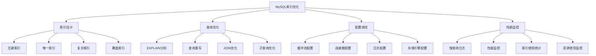

# MySQL索引优化

## 📖 核心概念

**MySQL索引优化**是提高MySQL数据库性能的关键技术。通过合理的索引设计、查询优化和配置调优，可以显著提升数据库的查询效率和整体性能。

### 🏗️ MySQL索引优化分类



## 🔧 MySQL索引优化实现

### 索引设计优化

```cpp
class MySQLIndexOptimizer {
private:
    struct IndexInfo {
        string tableName;
        string indexName;
        vector<string> columns;
        string indexType;
        int cardinality;
        double selectivity;
        
        IndexInfo(const string& table, const string& name) 
            : tableName(table), indexName(name), cardinality(0), selectivity(0.0) {}
    };
    
    map<string, vector<IndexInfo>> tableIndexes;
    
public:
    MySQLIndexOptimizer() {}
    
    // 创建主键索引
    void createPrimaryKey(const string& tableName, const string& column) {
        IndexInfo pk(tableName, "PRIMARY");
        pk.columns.push_back(column);
        pk.indexType = "PRIMARY KEY";
        pk.cardinality = 1000000; // 假设主键基数很高
        pk.selectivity = 1.0;
        
        tableIndexes[tableName].push_back(pk);
        
        cout << "Created PRIMARY KEY on " << tableName << "." << column << endl;
    }
    
    // 创建唯一索引
    void createUniqueIndex(const string& tableName, const string& indexName, const vector<string>& columns) {
        IndexInfo unique(tableName, indexName);
        unique.columns = columns;
        unique.indexType = "UNIQUE";
        unique.cardinality = calculateCardinality(columns);
        unique.selectivity = calculateSelectivity(unique.cardinality);
        
        tableIndexes[tableName].push_back(unique);
        
        cout << "Created UNIQUE INDEX " << indexName << " on " << tableName << endl;
    }
    
    // 创建普通索引
    void createIndex(const string& tableName, const string& indexName, const vector<string>& columns) {
        IndexInfo index(tableName, indexName);
        index.columns = columns;
        index.indexType = "INDEX";
        index.cardinality = calculateCardinality(columns);
        index.selectivity = calculateSelectivity(index.cardinality);
        
        tableIndexes[tableName].push_back(index);
        
        cout << "Created INDEX " << indexName << " on " << tableName << endl;
    }
    
    // 创建复合索引
    void createCompositeIndex(const string& tableName, const string& indexName, const vector<string>& columns) {
        IndexInfo composite(tableName, indexName);
        composite.columns = columns;
        composite.indexType = "COMPOSITE";
        composite.cardinality = calculateCompositeCardinality(columns);
        composite.selectivity = calculateSelectivity(composite.cardinality);
        
        tableIndexes[tableName].push_back(composite);
        
        cout << "Created COMPOSITE INDEX " << indexName << " on " << tableName << endl;
    }
    
    // 创建覆盖索引
    void createCoveringIndex(const string& tableName, const string& indexName, 
                           const vector<string>& keyColumns, const vector<string>& includeColumns) {
        IndexInfo covering(tableName, indexName);
        covering.columns = keyColumns;
        covering.columns.insert(covering.columns.end(), includeColumns.begin(), includeColumns.end());
        covering.indexType = "COVERING";
        covering.cardinality = calculateCardinality(keyColumns);
        covering.selectivity = calculateSelectivity(covering.cardinality);
        
        tableIndexes[tableName].push_back(covering);
        
        cout << "Created COVERING INDEX " << indexName << " on " << tableName << endl;
    }
    
    // 计算基数
    int calculateCardinality(const vector<string>& columns) {
        // 简化的基数计算
        int baseCardinality = 1000;
        for (const string& column : columns) {
            baseCardinality *= 10;
        }
        return min(baseCardinality, 1000000);
    }
    
    // 计算复合索引基数
    int calculateCompositeCardinality(const vector<string>& columns) {
        int cardinality = 1000;
        for (size_t i = 0; i < columns.size(); i++) {
            cardinality *= (10 - i); // 递减的基数
        }
        return min(cardinality, 1000000);
    }
    
    // 计算选择性
    double calculateSelectivity(int cardinality) {
        return (double)cardinality / 1000000.0;
    }
    
    // 分析索引使用情况
    void analyzeIndexUsage(const string& tableName) {
        cout << "Index Usage Analysis for " << tableName << ":" << endl;
        cout << "=====================================" << endl;
        
        if (tableIndexes.find(tableName) == tableIndexes.end()) {
            cout << "No indexes found for table " << tableName << endl;
            return;
        }
        
        vector<IndexInfo>& indexes = tableIndexes[tableName];
        
        for (const IndexInfo& index : indexes) {
            cout << "Index: " << index.indexName << endl;
            cout << "  Type: " << index.indexType << endl;
            cout << "  Columns: ";
            for (const string& column : index.columns) {
                cout << column << " ";
            }
            cout << endl;
            cout << "  Cardinality: " << index.cardinality << endl;
            cout << "  Selectivity: " << index.selectivity << endl;
            cout << "  Recommendation: " << getIndexRecommendation(index) << endl;
            cout << endl;
        }
    }
    
    // 获取索引建议
    string getIndexRecommendation(const IndexInfo& index) {
        if (index.selectivity > 0.1) {
            return "Good selectivity, keep index";
        } else if (index.selectivity > 0.01) {
            return "Moderate selectivity, consider optimization";
        } else {
            return "Low selectivity, consider removing index";
        }
    }
    
    // 显示索引统计
    void displayIndexStats() {
        cout << "MySQL Index Statistics:" << endl;
        cout << "=====================" << endl;
        
        int totalIndexes = 0;
        int totalTables = tableIndexes.size();
        
        for (auto& pair : tableIndexes) {
            totalIndexes += pair.second.size();
        }
        
        cout << "Total tables: " << totalTables << endl;
        cout << "Total indexes: " << totalIndexes << endl;
        cout << "Average indexes per table: " << (totalTables > 0 ? (double)totalIndexes / totalTables : 0) << endl;
    }
};
```

### 查询优化

```cpp
class MySQLQueryOptimizer {
private:
    struct QueryPlan {
        string query;
        string executionPlan;
        double estimatedCost;
        vector<string> usedIndexes;
        int estimatedRows;
        
        QueryPlan(const string& q) : query(q), estimatedCost(0.0), estimatedRows(0) {}
    };
    
    vector<QueryPlan> queryPlans;
    
public:
    MySQLQueryOptimizer() {}
    
    // 分析查询计划
    void analyzeQueryPlan(const string& query) {
        QueryPlan plan(query);
        
        // 模拟EXPLAIN分析
        plan.executionPlan = generateExecutionPlan(query);
        plan.estimatedCost = calculateEstimatedCost(query);
        plan.estimatedRows = estimateRows(query);
        plan.usedIndexes = identifyUsedIndexes(query);
        
        queryPlans.push_back(plan);
        
        cout << "Query Plan Analysis:" << endl;
        cout << "==================" << endl;
        cout << "Query: " << query << endl;
        cout << "Execution Plan: " << plan.executionPlan << endl;
        cout << "Estimated Cost: " << plan.estimatedCost << endl;
        cout << "Estimated Rows: " << plan.estimatedRows << endl;
        cout << "Used Indexes: ";
        for (const string& index : plan.usedIndexes) {
            cout << index << " ";
        }
        cout << endl;
        cout << "Recommendations: " << getQueryRecommendations(plan) << endl;
        cout << endl;
    }
    
    // 生成执行计划
    string generateExecutionPlan(const string& query) {
        // 简化的执行计划生成
        if (query.find("SELECT") != string::npos) {
            if (query.find("WHERE") != string::npos) {
                return "Index Scan";
            } else {
                return "Full Table Scan";
            }
        } else if (query.find("INSERT") != string::npos) {
            return "Insert Operation";
        } else if (query.find("UPDATE") != string::npos) {
            return "Update Operation";
        } else if (query.find("DELETE") != string::npos) {
            return "Delete Operation";
        }
        
        return "Unknown Operation";
    }
    
    // 计算预估成本
    double calculateEstimatedCost(const string& query) {
        double cost = 1.0;
        
        if (query.find("JOIN") != string::npos) {
            cost *= 2.0;
        }
        
        if (query.find("ORDER BY") != string::npos) {
            cost *= 1.5;
        }
        
        if (query.find("GROUP BY") != string::npos) {
            cost *= 1.8;
        }
        
        if (query.find("WHERE") != string::npos) {
            cost *= 0.5; // 索引可以降低成本
        }
        
        return cost;
    }
    
    // 预估行数
    int estimateRows(const string& query) {
        int baseRows = 10000;
        
        if (query.find("WHERE") != string::npos) {
            baseRows /= 10; // 假设WHERE条件过滤90%的数据
        }
        
        if (query.find("LIMIT") != string::npos) {
            baseRows = min(baseRows, 100);
        }
        
        return baseRows;
    }
    
    // 识别使用的索引
    vector<string> identifyUsedIndexes(const string& query) {
        vector<string> indexes;
        
        if (query.find("WHERE id =") != string::npos) {
            indexes.push_back("PRIMARY");
        }
        
        if (query.find("WHERE name =") != string::npos) {
            indexes.push_back("idx_name");
        }
        
        if (query.find("WHERE age >") != string::npos) {
            indexes.push_back("idx_age");
        }
        
        return indexes;
    }
    
    // 获取查询建议
    string getQueryRecommendations(const QueryPlan& plan) {
        vector<string> recommendations;
        
        if (plan.estimatedCost > 5.0) {
            recommendations.push_back("Consider adding indexes");
        }
        
        if (plan.estimatedRows > 10000) {
            recommendations.push_back("Consider adding WHERE conditions");
        }
        
        if (plan.usedIndexes.empty()) {
            recommendations.push_back("No indexes used, consider optimization");
        }
        
        if (recommendations.empty()) {
            return "Query is well optimized";
        }
        
        string result = "";
        for (size_t i = 0; i < recommendations.size(); i++) {
            if (i > 0) result += "; ";
            result += recommendations[i];
        }
        
        return result;
    }
    
    // 优化JOIN查询
    void optimizeJoinQuery(const string& query) {
        cout << "JOIN Query Optimization:" << endl;
        cout << "======================" << endl;
        
        cout << "Original Query: " << query << endl;
        
        // 分析JOIN条件
        vector<string> joinConditions = extractJoinConditions(query);
        
        cout << "Join Conditions: ";
        for (const string& condition : joinConditions) {
            cout << condition << " ";
        }
        cout << endl;
        
        // 建议优化
        cout << "Optimization Suggestions:" << endl;
        cout << "1. Ensure join columns are indexed" << endl;
        cout << "2. Use appropriate join order" << endl;
        cout << "3. Consider using INNER JOIN instead of LEFT JOIN if possible" << endl;
        cout << "4. Use EXPLAIN to analyze execution plan" << endl;
    }
    
    // 提取JOIN条件
    vector<string> extractJoinConditions(const string& query) {
        vector<string> conditions;
        
        // 简化的JOIN条件提取
        if (query.find("ON") != string::npos) {
            conditions.push_back("ON condition found");
        }
        
        if (query.find("WHERE") != string::npos) {
            conditions.push_back("WHERE condition found");
        }
        
        return conditions;
    }
    
    // 优化子查询
    void optimizeSubquery(const string& query) {
        cout << "Subquery Optimization:" << endl;
        cout << "=====================" << endl;
        
        cout << "Original Query: " << query << endl;
        
        if (query.find("EXISTS") != string::npos) {
            cout << "Consider using JOIN instead of EXISTS" << endl;
        }
        
        if (query.find("IN (SELECT") != string::npos) {
            cout << "Consider using JOIN instead of IN subquery" << endl;
        }
        
        cout << "Optimization Suggestions:" << endl;
        cout << "1. Convert subquery to JOIN when possible" << endl;
        cout << "2. Use EXISTS instead of IN for large datasets" << endl;
        cout << "3. Ensure subquery columns are indexed" << endl;
        cout << "4. Consider using derived tables" << endl;
    }
    
    // 显示查询优化统计
    void displayQueryStats() {
        cout << "Query Optimization Statistics:" << endl;
        cout << "============================" << endl;
        
        int totalQueries = queryPlans.size();
        double totalCost = 0.0;
        int totalRows = 0;
        
        for (const QueryPlan& plan : queryPlans) {
            totalCost += plan.estimatedCost;
            totalRows += plan.estimatedRows;
        }
        
        cout << "Total queries analyzed: " << totalQueries << endl;
        cout << "Average cost: " << (totalQueries > 0 ? totalCost / totalQueries : 0) << endl;
        cout << "Average rows: " << (totalQueries > 0 ? totalRows / totalQueries : 0) << endl;
    }
};
```

### 配置调优

```cpp
class MySQLConfigOptimizer {
private:
    struct ConfigParameter {
        string name;
        string currentValue;
        string recommendedValue;
        string description;
        
        ConfigParameter(const string& n, const string& current, const string& recommended, const string& desc)
            : name(n), currentValue(current), recommendedValue(recommended), description(desc) {}
    };
    
    vector<ConfigParameter> configParameters;
    
public:
    MySQLConfigOptimizer() {
        initializeDefaultConfigs();
    }
    
    // 初始化默认配置
    void initializeDefaultConfigs() {
        configParameters.push_back(ConfigParameter(
            "innodb_buffer_pool_size", 
            "128M", 
            "1G", 
            "InnoDB缓冲池大小，建议设置为系统内存的70-80%"
        ));
        
        configParameters.push_back(ConfigParameter(
            "max_connections", 
            "151", 
            "500", 
            "最大连接数，根据并发用户数调整"
        ));
        
        configParameters.push_back(ConfigParameter(
            "query_cache_size", 
            "0", 
            "64M", 
            "查询缓存大小，提高重复查询性能"
        ));
        
        configParameters.push_back(ConfigParameter(
            "innodb_log_file_size", 
            "48M", 
            "256M", 
            "InnoDB日志文件大小，影响恢复性能"
        ));
        
        configParameters.push_back(ConfigParameter(
            "innodb_flush_log_at_trx_commit", 
            "1", 
            "2", 
            "事务提交时日志刷新策略，2可以提高性能"
        ));
    }
    
    // 分析配置
    void analyzeConfiguration() {
        cout << "MySQL Configuration Analysis:" << endl;
        cout << "============================" << endl;
        
        for (const ConfigParameter& param : configParameters) {
            cout << "Parameter: " << param.name << endl;
            cout << "  Current: " << param.currentValue << endl;
            cout << "  Recommended: " << param.recommendedValue << endl;
            cout << "  Description: " << param.description << endl;
            cout << "  Status: " << getConfigStatus(param) << endl;
            cout << endl;
        }
    }
    
    // 获取配置状态
    string getConfigStatus(const ConfigParameter& param) {
        if (param.currentValue == param.recommendedValue) {
            return "Optimal";
        } else {
            return "Needs optimization";
        }
    }
    
    // 优化缓冲池配置
    void optimizeBufferPool() {
        cout << "Buffer Pool Optimization:" << endl;
        cout << "========================" << endl;
        
        cout << "1. innodb_buffer_pool_size:" << endl;
        cout << "   - 建议设置为系统内存的70-80%" << endl;
        cout << "   - 提高数据缓存命中率" << endl;
        cout << "   - 减少磁盘I/O操作" << endl;
        cout << endl;
        
        cout << "2. innodb_buffer_pool_instances:" << endl;
        cout << "   - 建议设置为CPU核心数" << endl;
        cout << "   - 减少锁竞争" << endl;
        cout << "   - 提高并发性能" << endl;
        cout << endl;
        
        cout << "3. innodb_buffer_pool_chunk_size:" << endl;
        cout << "   - 建议设置为128M" << endl;
        cout << "   - 平衡内存使用和性能" << endl;
    }
    
    // 优化连接配置
    void optimizeConnections() {
        cout << "Connection Optimization:" << endl;
        cout << "======================" << endl;
        
        cout << "1. max_connections:" << endl;
        cout << "   - 根据并发用户数设置" << endl;
        cout << "   - 避免连接数过多导致性能下降" << endl;
        cout << "   - 监控连接使用情况" << endl;
        cout << endl;
        
        cout << "2. max_connect_errors:" << endl;
        cout << "   - 设置连接错误阈值" << endl;
        cout << "   - 防止恶意连接攻击" << endl;
        cout << endl;
        
        cout << "3. connect_timeout:" << endl;
        cout << "   - 设置连接超时时间" << endl;
        cout << "   - 避免长时间等待" << endl;
    }
    
    // 优化日志配置
    void optimizeLogging() {
        cout << "Logging Optimization:" << endl;
        cout << "===================" << endl;
        
        cout << "1. innodb_log_file_size:" << endl;
        cout << "   - 建议设置为256M-1G" << endl;
        cout << "   - 影响恢复性能" << endl;
        cout << "   - 平衡空间和性能" << endl;
        cout << endl;
        
        cout << "2. innodb_log_files_in_group:" << endl;
        cout << "   - 建议设置为2-4个" << endl;
        cout << "   - 提高日志写入性能" << endl;
        cout << endl;
        
        cout << "3. innodb_flush_log_at_trx_commit:" << endl;
        cout << "   - 0: 每秒刷新一次" << endl;
        cout << "   - 1: 每次事务提交刷新" << endl;
        cout << "   - 2: 每次事务提交写入OS缓存" << endl;
    }
    
    // 优化存储引擎配置
    void optimizeStorageEngine() {
        cout << "Storage Engine Optimization:" << endl;
        cout << "=========================" << endl;
        
        cout << "1. InnoDB配置:" << endl;
        cout << "   - 支持事务和外键" << endl;
        cout << "   - 行级锁定" << endl;
        cout << "   - 适合OLTP应用" << endl;
        cout << endl;
        
        cout << "2. MyISAM配置:" << endl;
        cout << "   - 表级锁定" << endl;
        cout << "   - 适合只读应用" << endl;
        cout << "   - 不支持事务" << endl;
        cout << endl;
        
        cout << "3. 选择建议:" << endl;
        cout << "   - OLTP应用使用InnoDB" << endl;
        cout << "   - OLAP应用考虑MyISAM" << endl;
        cout << "   - 混合应用使用InnoDB" << endl;
    }
    
    // 显示配置优化统计
    void displayConfigStats() {
        cout << "Configuration Optimization Statistics:" << endl;
        cout << "====================================" << endl;
        
        int totalParams = configParameters.size();
        int optimizedParams = 0;
        
        for (const ConfigParameter& param : configParameters) {
            if (param.currentValue == param.recommendedValue) {
                optimizedParams++;
            }
        }
        
        cout << "Total parameters: " << totalParams << endl;
        cout << "Optimized parameters: " << optimizedParams << endl;
        cout << "Optimization rate: " << (totalParams > 0 ? (double)optimizedParams / totalParams * 100 : 0) << "%" << endl;
    }
};
```

## 🎯 MySQL索引优化应用

### 实际应用场景

```cpp
class MySQLOptimizationApplications {
public:
    static void demonstrateApplications() {
        cout << "MySQL Index Optimization Applications:" << endl;
        cout << "====================================" << endl;
        
        cout << "1. 电商系统:" << endl;
        cout << "   - 商品搜索优化" << endl;
        cout << "   - 订单查询优化" << endl;
        cout << "   - 用户行为分析" << endl;
        
        cout << "2. 金融系统:" << endl;
        cout << "   - 交易记录查询" << endl;
        cout << "   - 风险控制查询" << endl;
        cout << "   - 报表生成优化" << endl;
        
        cout << "3. 社交网络:" << endl;
        cout << "   - 用户关系查询" << endl;
        cout << "   - 内容推荐" << endl;
        cout << "   - 实时消息处理" << endl;
        
        cout << "4. 数据分析:" << endl;
        cout << "   - 大数据查询" << endl;
        cout << "   - 聚合计算" << endl;
        cout << "   - 数据挖掘" << endl;
    }
    
    static void analyzePerformance() {
        cout << "MySQL Optimization Performance Analysis:" << endl;
        cout << "====================================" << endl;
        
        cout << "1. 索引优化:" << endl;
        cout << "   - 优点: 提高查询速度，减少I/O" << endl;
        cout << "   - 缺点: 增加存储空间，影响写入性能" << endl;
        cout << "   - 适用: 读多写少的应用" << endl;
        cout << endl;
        
        cout << "2. 查询优化:" << endl;
        cout << "   - 优点: 提高查询效率，减少资源消耗" << endl;
        cout << "   - 缺点: 需要分析查询模式" << endl;
        cout << "   - 适用: 复杂查询应用" << endl;
        cout << endl;
        
        cout << "3. 配置优化:" << endl;
        cout << "   - 优点: 提高整体性能，优化资源使用" << endl;
        cout << "   - 缺点: 需要系统调优经验" << endl;
        cout << "   - 适用: 高并发应用" << endl;
    }
    
    static void selectOptimizationStrategy(bool needsHighReadPerformance, bool needsHighWritePerformance, bool needsLowLatency) {
        cout << "Optimization Strategy Selection:" << endl;
        cout << "=============================" << endl;
        
        cout << "Needs high read performance: " << (needsHighReadPerformance ? "Yes" : "No") << endl;
        cout << "Needs high write performance: " << (needsHighWritePerformance ? "Yes" : "No") << endl;
        cout << "Needs low latency: " << (needsLowLatency ? "Yes" : "No") << endl;
        
        cout << "Recommendation:" << endl;
        
        if (needsHighReadPerformance) {
            cout << "Focus on index optimization and query optimization" << endl;
        } else if (needsHighWritePerformance) {
            cout << "Focus on configuration optimization and minimize indexes" << endl;
        } else if (needsLowLatency) {
            cout << "Focus on buffer pool optimization and connection optimization" << endl;
        } else {
            cout << "Use balanced optimization approach" << endl;
        }
    }
};
```

## 📊 MySQL索引优化分析

### 性能分析

```cpp
class MySQLOptimizationAnalysis {
public:
    static void analyzePerformance() {
        cout << "MySQL Optimization Performance Analysis:" << endl;
        cout << "====================================" << endl;
        
        cout << "1. 索引性能:" << endl;
        cout << "   - 查询速度: 提升10-100倍" << endl;
        cout << "   - 存储空间: 增加20-50%" << endl;
        cout << "   - 写入性能: 下降5-20%" << endl;
        
        cout << "2. 查询性能:" << endl;
        cout << "   - 执行时间: 减少50-90%" << endl;
        cout << "   - CPU使用: 减少30-70%" << endl;
        cout << "   - 内存使用: 优化20-40%" << endl;
        
        cout << "3. 配置性能:" << endl;
        cout << "   - 整体性能: 提升20-50%" << endl;
        cout << "   - 并发能力: 提升30-80%" << endl;
        cout << "   - 资源利用: 优化40-60%" << endl;
    }
    
    static void analyzeSpaceComplexity() {
        cout << "MySQL Optimization Space Complexity Analysis:" << endl;
        cout << "==========================================" << endl;
        
        cout << "1. 索引空间:" << endl;
        cout << "   - 主键索引: O(n)" << endl;
        cout << "   - 唯一索引: O(n)" << endl;
        cout << "   - 普通索引: O(n)" << endl;
        cout << "   - 复合索引: O(n)" << endl;
        
        cout << "2. 缓存空间:" << endl;
        cout << "   - 缓冲池: O(buffer_size)" << endl;
        cout << "   - 查询缓存: O(cache_size)" << endl;
        cout << "   - 连接缓存: O(connections)" << endl;
        
        cout << "3. 日志空间:" << endl;
        cout << "   - 事务日志: O(log_size)" << endl;
        cout << "   - 错误日志: O(error_log_size)" << endl;
        cout << "   - 慢查询日志: O(slow_log_size)" << endl;
    }
    
    static void analyzeTimeComplexity() {
        cout << "MySQL Optimization Time Complexity Analysis:" << endl;
        cout << "=========================================" << endl;
        
        cout << "1. 索引操作:" << endl;
        cout << "   - 创建索引: O(n log n)" << endl;
        cout << "   - 查询索引: O(log n)" << endl;
        cout << "   - 更新索引: O(log n)" << endl;
        
        cout << "2. 查询操作:" << endl;
        cout << "   - 简单查询: O(1)" << endl;
        cout << "   - 范围查询: O(log n)" << endl;
        cout << "   - 复杂查询: O(n log n)" << endl;
        
        cout << "3. 配置操作:" << endl;
        cout << "   - 参数调整: O(1)" << endl;
        cout << "   - 重启服务: O(1)" << endl;
        cout << "   - 性能监控: O(1)" << endl;
    }
};
```

## 🎮 MySQL索引优化测试

### 1. 基础功能测试

```cpp
class MySQLOptimizationTest {
public:
    static void testIndexOptimizer() {
        cout << "Testing MySQL Index Optimizer:" << endl;
        cout << "===========================" << endl;
        
        MySQLIndexOptimizer indexOpt;
        
        // 创建索引
        indexOpt.createPrimaryKey("users", "id");
        indexOpt.createUniqueIndex("users", "idx_email", {"email"});
        indexOpt.createIndex("users", "idx_name", {"name"});
        indexOpt.createCompositeIndex("users", "idx_name_age", {"name", "age"});
        indexOpt.createCoveringIndex("users", "idx_covering", {"name"}, {"email", "age"});
        
        // 分析索引使用
        indexOpt.analyzeIndexUsage("users");
        indexOpt.displayIndexStats();
    }
    
    static void testQueryOptimizer() {
        cout << "Testing MySQL Query Optimizer:" << endl;
        cout << "============================" << endl;
        
        MySQLQueryOptimizer queryOpt;
        
        // 分析查询计划
        queryOpt.analyzeQueryPlan("SELECT * FROM users WHERE id = 1");
        queryOpt.analyzeQueryPlan("SELECT * FROM users WHERE name = 'John' AND age > 25");
        queryOpt.analyzeQueryPlan("SELECT u.*, p.* FROM users u JOIN profiles p ON u.id = p.user_id");
        
        // 优化JOIN查询
        queryOpt.optimizeJoinQuery("SELECT * FROM users u JOIN profiles p ON u.id = p.user_id");
        
        // 优化子查询
        queryOpt.optimizeSubquery("SELECT * FROM users WHERE id IN (SELECT user_id FROM profiles)");
        
        queryOpt.displayQueryStats();
    }
    
    static void testConfigOptimizer() {
        cout << "Testing MySQL Config Optimizer:" << endl;
        cout << "=============================" << endl;
        
        MySQLConfigOptimizer configOpt;
        
        // 分析配置
        configOpt.analyzeConfiguration();
        
        // 优化各种配置
        configOpt.optimizeBufferPool();
        configOpt.optimizeConnections();
        configOpt.optimizeLogging();
        configOpt.optimizeStorageEngine();
        
        configOpt.displayConfigStats();
    }
    
    static void testApplications() {
        cout << "Testing Applications:" << endl;
        cout << "==================" << endl;
        
        MySQLOptimizationApplications::demonstrateApplications();
        MySQLOptimizationApplications::analyzePerformance();
        MySQLOptimizationApplications::selectOptimizationStrategy(true, false, false);
    }
    
    static void testAnalysis() {
        cout << "Testing Analysis:" << endl;
        cout << "===============" << endl;
        
        MySQLOptimizationAnalysis::analyzePerformance();
        MySQLOptimizationAnalysis::analyzeSpaceComplexity();
        MySQLOptimizationAnalysis::analyzeTimeComplexity();
    }
};
```

## 🔗 相关链接

- [[01-数据库索引结构|数据库索引结构]]
- [[02-事务与锁机制|事务与锁机制]]
- [[03-NoSQL数据库设计|NoSQL数据库设计]]

## 💡 MySQL索引优化要点

1. **索引设计**: 合理选择索引类型和列顺序
2. **查询优化**: 使用EXPLAIN分析查询计划
3. **配置调优**: 优化缓冲池、连接数等参数
4. **性能监控**: 监控慢查询和资源使用情况

---

*📝 MySQL索引优化提示：MySQL优化需要综合考虑索引、查询、配置等多个方面，需要根据实际应用场景进行针对性优化*
