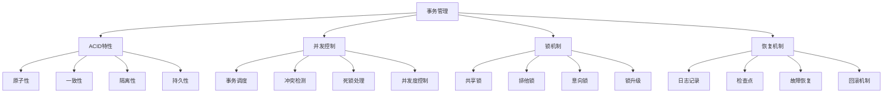

# 事务管理

## 📖 核心概念

**事务管理**是数据库系统中的核心机制，确保数据的一致性、完整性和可靠性。通过ACID特性（原子性、一致性、隔离性、持久性）和并发控制机制，事务管理保证了多用户环境下的数据安全和系统稳定性。

### 🏗️ 事务管理的组成要素



## 🔍 事务特性

### ACID特性详解

| 特性 | 描述 | 实现机制 | 重要性 | 应用场景 |
|------|------|----------|--------|----------|
| **原子性** | 事务要么全部执行，要么全部不执行 | 日志记录、回滚 | 极高 | 所有事务 |
| **一致性** | 事务执行前后数据库状态一致 | 约束检查、触发器 | 极高 | 数据完整性 |
| **隔离性** | 并发事务相互隔离 | 锁机制、MVCC | 高 | 并发访问 |
| **持久性** | 事务提交后数据永久保存 | 日志记录、磁盘写入 | 极高 | 数据安全 |

### 隔离级别

| 隔离级别 | 脏读 | 不可重复读 | 幻读 | 并发度 | 适用场景 |
|----------|------|------------|------|--------|----------|
| **读未提交** | 可能 | 可能 | 可能 | 最高 | 性能优先 |
| **读已提交** | 不可能 | 可能 | 可能 | 高 | 一般应用 |
| **可重复读** | 不可能 | 不可能 | 可能 | 中等 | 事务一致性 |
| **串行化** | 不可能 | 不可能 | 不可能 | 最低 | 强一致性 |

## 💻 事务管理实现

### 事务管理器

```cpp
// 事务管理器
class TransactionManager {
private:
    struct Transaction {
        int transactionId;
        TransactionState state;
        chrono::system_clock::time_point startTime;
        chrono::system_clock::time_point commitTime;
        vector<Operation> operations;
        set<string> lockedResources;
        
        Transaction(int id) : transactionId(id), state(ACTIVE) {
            startTime = chrono::system_clock::now();
        }
    };
    
    enum TransactionState {
        ACTIVE,
        COMMITTED,
        ABORTED,
        PREPARED
    };
    
    struct Operation {
        OperationType type;
        string resourceId;
        string oldValue;
        string newValue;
        chrono::system_clock::time_point timestamp;
        
        Operation(OperationType t, const string& id, const string& oldVal, const string& newVal)
            : type(t), resourceId(id), oldValue(oldVal), newValue(newVal) {
            timestamp = chrono::system_clock::now();
        }
    };
    
    enum OperationType {
        READ,
        WRITE,
        DELETE,
        INSERT
    };
    
    // 事务管理
    map<int, Transaction> transactions;
    atomic<int> nextTransactionId;
    
    // 锁管理
    class LockManager {
    private:
        struct Lock {
            LockType type;
            int transactionId;
            chrono::system_clock::time_point timestamp;
            
            Lock(LockType t, int tid) : type(t), transactionId(tid) {
                timestamp = chrono::system_clock::now();
            }
        };
        
        enum LockType {
            SHARED,
            EXCLUSIVE,
            INTENTION_SHARED,
            INTENTION_EXCLUSIVE
        };
        
        map<string, vector<Lock>> resourceLocks;
        map<int, set<string>> transactionLocks;
        mutex lockMutex;
        
    public:
        // 请求锁
        bool requestLock(int transactionId, const string& resourceId, LockType lockType) {
            lock_guard<mutex> lock(lockMutex);
            
            // 检查是否已有锁
            if (hasLock(transactionId, resourceId, lockType)) {
                return true;
            }
            
            // 检查锁兼容性
            if (isLockCompatible(resourceId, lockType)) {
                grantLock(transactionId, resourceId, lockType);
                return true;
            }
            
            // 等待锁
            return false;
        }
        
        // 释放锁
        void releaseLock(int transactionId, const string& resourceId) {
            lock_guard<mutex> lock(lockMutex);
            
            auto& locks = resourceLocks[resourceId];
            locks.erase(remove_if(locks.begin(), locks.end(),
                [transactionId](const Lock& lock) {
                    return lock.transactionId == transactionId;
                }), locks.end());
            
            transactionLocks[transactionId].erase(resourceId);
        }
        
        // 释放事务的所有锁
        void releaseAllLocks(int transactionId) {
            lock_guard<mutex> lock(lockMutex);
            
            auto it = transactionLocks.find(transactionId);
            if (it != transactionLocks.end()) {
                for (const string& resourceId : it->second) {
                    auto& locks = resourceLocks[resourceId];
                    locks.erase(remove_if(locks.begin(), locks.end(),
                        [transactionId](const Lock& lock) {
                            return lock.transactionId == transactionId;
                        }), locks.end());
                }
                transactionLocks.erase(it);
            }
        }
        
    private:
        bool hasLock(int transactionId, const string& resourceId, LockType lockType) {
            auto it = transactionLocks.find(transactionId);
            if (it == transactionLocks.end()) {
                return false;
            }
            
            if (it->second.find(resourceId) == it->second.end()) {
                return false;
            }
            
            auto& locks = resourceLocks[resourceId];
            for (const Lock& lock : locks) {
                if (lock.transactionId == transactionId && lock.type == lockType) {
                    return true;
                }
            }
            
            return false;
        }
        
        bool isLockCompatible(const string& resourceId, LockType lockType) {
            auto& locks = resourceLocks[resourceId];
            
            for (const Lock& lock : locks) {
                if (!areLocksCompatible(lock.type, lockType)) {
                    return false;
                }
            }
            
            return true;
        }
        
        bool areLocksCompatible(LockType existing, LockType requested) {
            if (existing == SHARED && requested == SHARED) {
                return true;
            }
            if (existing == SHARED && requested == EXCLUSIVE) {
                return false;
            }
            if (existing == EXCLUSIVE && requested == SHARED) {
                return false;
            }
            if (existing == EXCLUSIVE && requested == EXCLUSIVE) {
                return false;
            }
            
            return true;
        }
        
        void grantLock(int transactionId, const string& resourceId, LockType lockType) {
            resourceLocks[resourceId].emplace_back(lockType, transactionId);
            transactionLocks[transactionId].insert(resourceId);
        }
    };
    
    LockManager lockManager;
    
    // 日志管理
    class LogManager {
    private:
        struct LogEntry {
            int transactionId;
            OperationType operation;
            string resourceId;
            string oldValue;
            string newValue;
            chrono::system_clock::time_point timestamp;
            
            LogEntry(int tid, OperationType op, const string& rid, 
                    const string& oldVal, const string& newVal)
                : transactionId(tid), operation(op), resourceId(rid), 
                  oldValue(oldVal), newValue(newVal) {
                timestamp = chrono::system_clock::now();
            }
        };
        
        vector<LogEntry> logEntries;
        mutex logMutex;
        
    public:
        // 记录日志
        void logOperation(int transactionId, OperationType operation, 
                         const string& resourceId, const string& oldValue, 
                         const string& newValue) {
            lock_guard<mutex> lock(logMutex);
            logEntries.emplace_back(transactionId, operation, resourceId, oldValue, newValue);
        }
        
        // 记录事务开始
        void logTransactionStart(int transactionId) {
            lock_guard<mutex> lock(logMutex);
            logEntries.emplace_back(transactionId, READ, "", "", "START");
        }
        
        // 记录事务提交
        void logTransactionCommit(int transactionId) {
            lock_guard<mutex> lock(logMutex);
            logEntries.emplace_back(transactionId, READ, "", "", "COMMIT");
        }
        
        // 记录事务回滚
        void logTransactionAbort(int transactionId) {
            lock_guard<mutex> lock(logMutex);
            logEntries.emplace_back(transactionId, READ, "", "", "ABORT");
        }
        
        // 获取事务日志
        vector<LogEntry> getTransactionLog(int transactionId) {
            lock_guard<mutex> lock(logMutex);
            vector<LogEntry> result;
            
            for (const LogEntry& entry : logEntries) {
                if (entry.transactionId == transactionId) {
                    result.push_back(entry);
                }
            }
            
            return result;
        }
        
        // 清理日志
        void cleanupLog() {
            lock_guard<mutex> lock(logMutex);
            // 保留最近的日志条目
            if (logEntries.size() > 10000) {
                logEntries.erase(logEntries.begin(), logEntries.begin() + 5000);
            }
        }
    };
    
    LogManager logManager;
    
public:
    TransactionManager() : nextTransactionId(1) {}
    
    // 开始事务
    int beginTransaction() {
        int transactionId = nextTransactionId.fetch_add(1);
        transactions[transactionId] = Transaction(transactionId);
        logManager.logTransactionStart(transactionId);
        
        cout << "Transaction " << transactionId << " started" << endl;
        return transactionId;
    }
    
    // 提交事务
    bool commitTransaction(int transactionId) {
        auto it = transactions.find(transactionId);
        if (it == transactions.end()) {
            return false;
        }
        
        Transaction& transaction = it->second;
        
        // 检查事务状态
        if (transaction.state != ACTIVE) {
            return false;
        }
        
        // 执行提交
        transaction.state = COMMITTED;
        transaction.commitTime = chrono::system_clock::now();
        
        // 释放所有锁
        lockManager.releaseAllLocks(transactionId);
        
        // 记录日志
        logManager.logTransactionCommit(transactionId);
        
        cout << "Transaction " << transactionId << " committed" << endl;
        return true;
    }
    
    // 回滚事务
    bool abortTransaction(int transactionId) {
        auto it = transactions.find(transactionId);
        if (it == transactions.end()) {
            return false;
        }
        
        Transaction& transaction = it->second;
        
        // 检查事务状态
        if (transaction.state != ACTIVE) {
            return false;
        }
        
        // 执行回滚
        transaction.state = ABORTED;
        
        // 释放所有锁
        lockManager.releaseAllLocks(transactionId);
        
        // 记录日志
        logManager.logTransactionAbort(transactionId);
        
        cout << "Transaction " << transactionId << " aborted" << endl;
        return true;
    }
    
    // 读取数据
    string readData(int transactionId, const string& resourceId) {
        auto it = transactions.find(transactionId);
        if (it == transactions.end()) {
            return "";
        }
        
        Transaction& transaction = it->second;
        
        // 请求共享锁
        if (!lockManager.requestLock(transactionId, resourceId, LockManager::SHARED)) {
            cout << "Transaction " << transactionId << " waiting for lock on " << resourceId << endl;
            return "";
        }
        
        // 记录操作
        Operation operation(READ, resourceId, "", "");
        transaction.operations.push_back(operation);
        
        // 记录日志
        logManager.logOperation(transactionId, READ, resourceId, "", "");
        
        cout << "Transaction " << transactionId << " read " << resourceId << endl;
        return "data_" + resourceId; // 模拟数据
    }
    
    // 写入数据
    bool writeData(int transactionId, const string& resourceId, const string& value) {
        auto it = transactions.find(transactionId);
        if (it == transactions.end()) {
            return false;
        }
        
        Transaction& transaction = it->second;
        
        // 请求排他锁
        if (!lockManager.requestLock(transactionId, resourceId, LockManager::EXCLUSIVE)) {
            cout << "Transaction " << transactionId << " waiting for lock on " << resourceId << endl;
            return false;
        }
        
        // 记录操作
        Operation operation(WRITE, resourceId, "old_value", value);
        transaction.operations.push_back(operation);
        
        // 记录日志
        logManager.logOperation(transactionId, WRITE, resourceId, "old_value", value);
        
        cout << "Transaction " << transactionId << " wrote " << resourceId << " = " << value << endl;
        return true;
    }
    
    // 获取事务状态
    TransactionState getTransactionState(int transactionId) {
        auto it = transactions.find(transactionId);
        if (it == transactions.end()) {
            return ABORTED;
        }
        return it->second.state;
    }
    
    // 获取事务统计信息
    struct TransactionStatistics {
        int totalTransactions;
        int activeTransactions;
        int committedTransactions;
        int abortedTransactions;
        double averageTransactionTime;
    };
    
    TransactionStatistics getStatistics() {
        TransactionStatistics stats;
        stats.totalTransactions = transactions.size();
        stats.activeTransactions = 0;
        stats.committedTransactions = 0;
        stats.abortedTransactions = 0;
        stats.averageTransactionTime = 0;
        
        double totalTime = 0;
        
        for (const auto& [id, transaction] : transactions) {
            switch (transaction.state) {
                case ACTIVE:
                    stats.activeTransactions++;
                    break;
                case COMMITTED:
                    stats.committedTransactions++;
                    break;
                case ABORTED:
                    stats.abortedTransactions++;
                    break;
            }
            
            if (transaction.state == COMMITTED) {
                auto duration = chrono::duration_cast<chrono::milliseconds>(
                    transaction.commitTime - transaction.startTime).count();
                totalTime += duration;
            }
        }
        
        if (stats.committedTransactions > 0) {
            stats.averageTransactionTime = totalTime / stats.committedTransactions;
        }
        
        return stats;
    }
    
    // 清理完成的事务
    void cleanupCompletedTransactions() {
        auto it = transactions.begin();
        while (it != transactions.end()) {
            if (it->second.state == COMMITTED || it->second.state == ABORTED) {
                it = transactions.erase(it);
            } else {
                ++it;
            }
        }
        
        logManager.cleanupLog();
    }
};
```

### 两阶段提交协议

```cpp
// 两阶段提交协议
class TwoPhaseCommit {
private:
    struct Participant {
        string participantId;
        string host;
        int port;
        bool prepared;
        bool committed;
        
        Participant(const string& id, const string& h, int p) 
            : participantId(id), host(h), port(p), prepared(false), committed(false) {}
    };
    
    vector<Participant> participants;
    string coordinatorId;
    atomic<bool> isCoordinator;
    
public:
    TwoPhaseCommit(const string& coordId) : coordinatorId(coordId), isCoordinator(false) {}
    
    // 添加参与者
    void addParticipant(const string& participantId, const string& host, int port) {
        participants.emplace_back(participantId, host, port);
    }
    
    // 开始两阶段提交
    bool startTwoPhaseCommit(const string& transactionId) {
        if (isCoordinator) {
            return executeTwoPhaseCommit(transactionId);
        } else {
            return participateInTwoPhaseCommit(transactionId);
        }
    }
    
private:
    // 协调者执行两阶段提交
    bool executeTwoPhaseCommit(const string& transactionId) {
        cout << "Coordinator starting 2PC for transaction " << transactionId << endl;
        
        // 阶段1：准备阶段
        vector<bool> prepareResults;
        for (Participant& participant : participants) {
            bool result = sendPrepareRequest(participant, transactionId);
            prepareResults.push_back(result);
            participant.prepared = result;
        }
        
        // 检查所有参与者是否准备就绪
        bool allPrepared = true;
        for (bool result : prepareResults) {
            if (!result) {
                allPrepared = false;
                break;
            }
        }
        
        // 阶段2：提交阶段
        if (allPrepared) {
            cout << "All participants prepared, sending commit" << endl;
            for (Participant& participant : participants) {
                bool result = sendCommitRequest(participant, transactionId);
                participant.committed = result;
            }
            return true;
        } else {
            cout << "Some participants failed to prepare, sending abort" << endl;
            for (Participant& participant : participants) {
                sendAbortRequest(participant, transactionId);
            }
            return false;
        }
    }
    
    // 参与者参与两阶段提交
    bool participateInTwoPhaseCommit(const string& transactionId) {
        cout << "Participant " << coordinatorId << " participating in 2PC for transaction " << transactionId << endl;
        
        // 等待准备请求
        bool prepared = waitForPrepareRequest(transactionId);
        
        if (prepared) {
            // 等待提交或中止请求
            bool committed = waitForCommitOrAbortRequest(transactionId);
            return committed;
        } else {
            return false;
        }
    }
    
    // 发送准备请求
    bool sendPrepareRequest(Participant& participant, const string& transactionId) {
        cout << "Sending prepare request to " << participant.participantId << endl;
        
        // 模拟网络请求
        this_thread::sleep_for(chrono::milliseconds(100));
        
        // 模拟参与者响应
        bool response = simulateParticipantResponse(participant.participantId);
        
        if (response) {
            cout << "Participant " << participant.participantId << " prepared successfully" << endl;
        } else {
            cout << "Participant " << participant.participantId << " failed to prepare" << endl;
        }
        
        return response;
    }
    
    // 发送提交请求
    bool sendCommitRequest(Participant& participant, const string& transactionId) {
        cout << "Sending commit request to " << participant.participantId << endl;
        
        // 模拟网络请求
        this_thread::sleep_for(chrono::milliseconds(100));
        
        // 模拟参与者响应
        bool response = simulateParticipantResponse(participant.participantId);
        
        if (response) {
            cout << "Participant " << participant.participantId << " committed successfully" << endl;
        } else {
            cout << "Participant " << participant.participantId << " failed to commit" << endl;
        }
        
        return response;
    }
    
    // 发送中止请求
    void sendAbortRequest(Participant& participant, const string& transactionId) {
        cout << "Sending abort request to " << participant.participantId << endl;
        
        // 模拟网络请求
        this_thread::sleep_for(chrono::milliseconds(100));
        
        cout << "Participant " << participant.participantId << " aborted" << endl;
    }
    
    // 等待准备请求
    bool waitForPrepareRequest(const string& transactionId) {
        cout << "Waiting for prepare request for transaction " << transactionId << endl;
        
        // 模拟等待
        this_thread::sleep_for(chrono::milliseconds(200));
        
        // 模拟准备响应
        bool response = simulateParticipantResponse(coordinatorId);
        
        if (response) {
            cout << "Prepared for transaction " << transactionId << endl;
        } else {
            cout << "Failed to prepare for transaction " << transactionId << endl;
        }
        
        return response;
    }
    
    // 等待提交或中止请求
    bool waitForCommitOrAbortRequest(const string& transactionId) {
        cout << "Waiting for commit/abort request for transaction " << transactionId << endl;
        
        // 模拟等待
        this_thread::sleep_for(chrono::milliseconds(200));
        
        // 模拟提交响应
        bool response = simulateParticipantResponse(coordinatorId);
        
        if (response) {
            cout << "Committed transaction " << transactionId << endl;
        } else {
            cout << "Aborted transaction " << transactionId << endl;
        }
        
        return response;
    }
    
    // 模拟参与者响应
    bool simulateParticipantResponse(const string& participantId) {
        // 90%的成功率
        return (rand() % 10) < 9;
    }
    
public:
    // 设置协调者
    void setCoordinator(bool isCoord) {
        isCoordinator = isCoord;
    }
    
    // 获取参与者数量
    int getParticipantCount() const {
        return participants.size();
    }
    
    // 获取统计信息
    struct TwoPhaseCommitStatistics {
        int totalParticipants;
        int preparedParticipants;
        int committedParticipants;
        double successRate;
    };
    
    TwoPhaseCommitStatistics getStatistics() {
        TwoPhaseCommitStatistics stats;
        stats.totalParticipants = participants.size();
        stats.preparedParticipants = 0;
        stats.committedParticipants = 0;
        
        for (const Participant& participant : participants) {
            if (participant.prepared) {
                stats.preparedParticipants++;
            }
            if (participant.committed) {
                stats.committedParticipants++;
            }
        }
        
        if (stats.totalParticipants > 0) {
            stats.successRate = (double)stats.committedParticipants / stats.totalParticipants;
        } else {
            stats.successRate = 0;
        }
        
        return stats;
    }
};
```

## ⚡ 复杂度分析

### 事务管理复杂度

| 操作 | 时间复杂度 | 空间复杂度 | 并发度 | 适用场景 |
|------|------------|------------|--------|----------|
| **事务开始** | O(1) | O(1) | 高 | 所有场景 |
| **事务提交** | O(n) | O(n) | 中等 | 所有场景 |
| **事务回滚** | O(n) | O(n) | 中等 | 错误处理 |
| **锁管理** | O(1) | O(n) | 中等 | 并发控制 |

### 性能优化策略

| 优化策略 | 适用场景 | 优化效果 | 实现难度 | 维护成本 |
|----------|----------|----------|----------|----------|
| **锁升级** | 锁竞争激烈 | 显著 | 中等 | 中等 |
| **死锁检测** | 复杂事务 | 显著 | 困难 | 高 |
| **MVCC** | 读多写少 | 显著 | 困难 | 高 |
| **批量提交** | 大量事务 | 明显 | 简单 | 低 |

## 🎓 学习要点总结

### 核心理解

1. **ACID特性**：理解事务的四个基本特性
2. **并发控制**：掌握并发控制的方法和机制
3. **锁机制**：理解各种锁的类型和作用
4. **恢复机制**：掌握故障恢复的方法

### 实践要点

1. **事务设计**：正确设计事务的边界和范围
2. **锁管理**：合理使用锁机制
3. **死锁处理**：避免和处理死锁问题
4. **性能优化**：优化事务性能

### 应用思维

1. **一致性保证**：保证数据的一致性
2. **并发控制**：控制并发访问
3. **故障恢复**：处理系统故障
4. **性能权衡**：权衡一致性和性能

---

**相关链接：**
- [[06-应用实战/01-数据库王国/01-索引结构|索引结构]] - 数据库基础
- [[06-应用实战/01-数据库王国/02-查询优化|查询优化]] - 查询处理
- [[05-高级结构/04-并发结构/01-线程安全数据结构|线程安全数据结构]] - 并发控制
- [[06-应用实战/04-网络应用/01-分布式系统|分布式系统]] - 分布式事务
