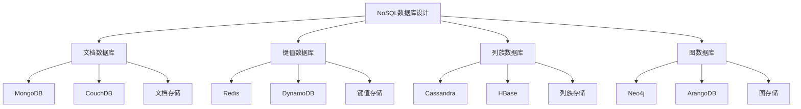

# NoSQL数据库设计

## 📖 核心概念

**NoSQL数据库设计**是面向非关系型数据库的设计方法，包括文档数据库、键值数据库、列族数据库和图数据库等。NoSQL数据库具有高可扩展性、灵活的数据模型和优秀的性能表现。

### 🏗️ NoSQL数据库分类



## 🔧 NoSQL数据库设计实现

### 文档数据库设计

```cpp
class DocumentDatabaseDesign {
private:
    struct Document {
        string id;
        map<string, variant<string, int, double, bool, vector<Document>>> data;
        chrono::time_point<chrono::high_resolution_clock> timestamp;
        
        Document(const string& docId) : id(docId) {
            timestamp = chrono::high_resolution_clock::now();
        }
    };
    
    map<string, vector<Document>> collections;
    
public:
    DocumentDatabaseDesign() {}
    
    // 创建集合
    void createCollection(const string& collectionName) {
        collections[collectionName] = vector<Document>();
        cout << "Created collection: " << collectionName << endl;
    }
    
    // 插入文档
    void insertDocument(const string& collectionName, const Document& document) {
        if (collections.find(collectionName) == collections.end()) {
            createCollection(collectionName);
        }
        
        collections[collectionName].push_back(document);
        cout << "Inserted document " << document.id << " into collection " << collectionName << endl;
    }
    
    // 查询文档
    vector<Document> findDocuments(const string& collectionName, const map<string, variant<string, int, double, bool>>& query) {
        vector<Document> results;
        
        if (collections.find(collectionName) == collections.end()) {
            return results;
        }
        
        for (const Document& doc : collections[collectionName]) {
            bool matches = true;
            
            for (const auto& pair : query) {
                if (doc.data.find(pair.first) == doc.data.end()) {
                    matches = false;
                    break;
                }
                
                // 简化的匹配逻辑
                if (doc.data[pair.first] != pair.second) {
                    matches = false;
                    break;
                }
            }
            
            if (matches) {
                results.push_back(doc);
            }
        }
        
        return results;
    }
    
    // 更新文档
    bool updateDocument(const string& collectionName, const string& documentId, const map<string, variant<string, int, double, bool>>& updates) {
        if (collections.find(collectionName) == collections.end()) {
            return false;
        }
        
        for (Document& doc : collections[collectionName]) {
            if (doc.id == documentId) {
                for (const auto& pair : updates) {
                    doc.data[pair.first] = pair.second;
                }
                doc.timestamp = chrono::high_resolution_clock::now();
                cout << "Updated document " << documentId << " in collection " << collectionName << endl;
                return true;
            }
        }
        
        return false;
    }
    
    // 删除文档
    bool deleteDocument(const string& collectionName, const string& documentId) {
        if (collections.find(collectionName) == collections.end()) {
            return false;
        }
        
        auto it = collections[collectionName].begin();
        while (it != collections[collectionName].end()) {
            if (it->id == documentId) {
                collections[collectionName].erase(it);
                cout << "Deleted document " << documentId << " from collection " << collectionName << endl;
                return true;
            }
            ++it;
        }
        
        return false;
    }
    
    // 创建索引
    void createIndex(const string& collectionName, const string& field) {
        cout << "Created index on field " << field << " in collection " << collectionName << endl;
    }
    
    // 聚合查询
    map<string, int> aggregateQuery(const string& collectionName, const string& field) {
        map<string, int> results;
        
        if (collections.find(collectionName) == collections.end()) {
            return results;
        }
        
        for (const Document& doc : collections[collectionName]) {
            if (doc.data.find(field) != doc.data.end()) {
                string value = get<string>(doc.data[field]);
                results[value]++;
            }
        }
        
        return results;
    }
    
    // 显示集合统计
    void displayCollectionStats() {
        cout << "Document Database Statistics:" << endl;
        cout << "==========================" << endl;
        
        for (const auto& pair : collections) {
            cout << "Collection: " << pair.first << endl;
            cout << "  Document count: " << pair.second.size() << endl;
        }
    }
};
```

### 键值数据库设计

```cpp
class KeyValueDatabaseDesign {
private:
    struct KeyValuePair {
        string key;
        string value;
        chrono::time_point<chrono::high_resolution_clock> timestamp;
        int ttl; // Time to live in seconds
        
        KeyValuePair(const string& k, const string& v, int timeToLive = 0) 
            : key(k), value(v), ttl(timeToLive) {
            timestamp = chrono::high_resolution_clock::now();
        }
    };
    
    map<string, KeyValuePair> keyValueStore;
    map<string, set<string>> keyIndexes;
    
public:
    KeyValueDatabaseDesign() {}
    
    // 设置键值对
    void set(const string& key, const string& value, int ttl = 0) {
        KeyValuePair kvp(key, value, ttl);
        keyValueStore[key] = kvp;
        
        // 更新索引
        updateIndexes(key, value);
        
        cout << "Set key: " << key << " = " << value << endl;
    }
    
    // 获取值
    string get(const string& key) {
        auto it = keyValueStore.find(key);
        if (it == keyValueStore.end()) {
            return "";
        }
        
        KeyValuePair& kvp = it->second;
        
        // 检查TTL
        if (kvp.ttl > 0) {
            auto now = chrono::high_resolution_clock::now();
            auto elapsed = chrono::duration_cast<chrono::seconds>(now - kvp.timestamp).count();
            
            if (elapsed >= kvp.ttl) {
                keyValueStore.erase(it);
                return "";
            }
        }
        
        return kvp.value;
    }
    
    // 删除键
    bool del(const string& key) {
        auto it = keyValueStore.find(key);
        if (it == keyValueStore.end()) {
            return false;
        }
        
        keyValueStore.erase(it);
        cout << "Deleted key: " << key << endl;
        return true;
    }
    
    // 检查键是否存在
    bool exists(const string& key) {
        return keyValueStore.find(key) != keyValueStore.end();
    }
    
    // 设置过期时间
    void expire(const string& key, int seconds) {
        auto it = keyValueStore.find(key);
        if (it != keyValueStore.end()) {
            it->second.ttl = seconds;
            it->second.timestamp = chrono::high_resolution_clock::now();
            cout << "Set expiration for key " << key << " to " << seconds << " seconds" << endl;
        }
    }
    
    // 获取所有键
    vector<string> keys(const string& pattern = "*") {
        vector<string> result;
        
        for (const auto& pair : keyValueStore) {
            if (pattern == "*" || pair.first.find(pattern) != string::npos) {
                result.push_back(pair.first);
            }
        }
        
        return result;
    }
    
    // 更新索引
    void updateIndexes(const string& key, const string& value) {
        // 简化的索引更新
        for (char c : value) {
            string indexKey = string(1, c);
            keyIndexes[indexKey].insert(key);
        }
    }
    
    // 按值查找键
    vector<string> findKeysByValue(const string& value) {
        vector<string> result;
        
        for (const auto& pair : keyValueStore) {
            if (pair.second.value == value) {
                result.push_back(pair.first);
            }
        }
        
        return result;
    }
    
    // 显示键值数据库统计
    void displayKeyValueStats() {
        cout << "Key-Value Database Statistics:" << endl;
        cout << "============================" << endl;
        
        cout << "Total keys: " << keyValueStore.size() << endl;
        cout << "Index count: " << keyIndexes.size() << endl;
        
        // 显示索引统计
        for (const auto& pair : keyIndexes) {
            cout << "Index '" << pair.first << "': " << pair.second.size() << " keys" << endl;
        }
    }
};
```

### 列族数据库设计

```cpp
class ColumnFamilyDatabaseDesign {
private:
    struct Column {
        string name;
        string value;
        chrono::time_point<chrono::high_resolution_clock> timestamp;
        
        Column(const string& n, const string& v) : name(n), value(v) {
            timestamp = chrono::high_resolution_clock::now();
        }
    };
    
    struct Row {
        string rowKey;
        map<string, Column> columns;
        
        Row(const string& key) : rowKey(key) {}
    };
    
    map<string, map<string, Row>> columnFamilies;
    
public:
    ColumnFamilyDatabaseDesign() {}
    
    // 创建列族
    void createColumnFamily(const string& tableName, const string& columnFamilyName) {
        columnFamilies[tableName][columnFamilyName] = Row("");
        cout << "Created column family " << columnFamilyName << " in table " << tableName << endl;
    }
    
    // 插入数据
    void put(const string& tableName, const string& rowKey, const string& columnFamily, const string& column, const string& value) {
        if (columnFamilies.find(tableName) == columnFamilies.end()) {
            columnFamilies[tableName] = map<string, Row>();
        }
        
        if (columnFamilies[tableName].find(columnFamily) == columnFamilies[tableName].end()) {
            createColumnFamily(tableName, columnFamily);
        }
        
        Row& row = columnFamilies[tableName][columnFamily];
        row.rowKey = rowKey;
        row.columns[column] = Column(column, value);
        
        cout << "Put data: " << tableName << ":" << rowKey << ":" << columnFamily << ":" << column << " = " << value << endl;
    }
    
    // 获取数据
    string get(const string& tableName, const string& rowKey, const string& columnFamily, const string& column) {
        if (columnFamilies.find(tableName) == columnFamilies.end()) {
            return "";
        }
        
        if (columnFamilies[tableName].find(columnFamily) == columnFamilies[tableName].end()) {
            return "";
        }
        
        Row& row = columnFamilies[tableName][columnFamily];
        if (row.columns.find(column) == row.columns.end()) {
            return "";
        }
        
        return row.columns[column].value;
    }
    
    // 获取行
    map<string, string> getRow(const string& tableName, const string& rowKey, const string& columnFamily) {
        map<string, string> result;
        
        if (columnFamilies.find(tableName) == columnFamilies.end()) {
            return result;
        }
        
        if (columnFamilies[tableName].find(columnFamily) == columnFamilies[tableName].end()) {
            return result;
        }
        
        Row& row = columnFamilies[tableName][columnFamily];
        for (const auto& pair : row.columns) {
            result[pair.first] = pair.second.value;
        }
        
        return result;
    }
    
    // 扫描表
    vector<map<string, string>> scan(const string& tableName, const string& columnFamily, const string& startRow = "", const string& endRow = "") {
        vector<map<string, string>> result;
        
        if (columnFamilies.find(tableName) == columnFamilies.end()) {
            return result;
        }
        
        if (columnFamilies[tableName].find(columnFamily) == columnFamilies[tableName].end()) {
            return result;
        }
        
        Row& row = columnFamilies[tableName][columnFamily];
        map<string, string> rowData;
        
        for (const auto& pair : row.columns) {
            rowData[pair.first] = pair.second.value;
        }
        
        if (!rowData.empty()) {
            result.push_back(rowData);
        }
        
        return result;
    }
    
    // 删除数据
    bool deleteData(const string& tableName, const string& rowKey, const string& columnFamily, const string& column) {
        if (columnFamilies.find(tableName) == columnFamilies.end()) {
            return false;
        }
        
        if (columnFamilies[tableName].find(columnFamily) == columnFamilies[tableName].end()) {
            return false;
        }
        
        Row& row = columnFamilies[tableName][columnFamily];
        auto it = row.columns.find(column);
        
        if (it != row.columns.end()) {
            row.columns.erase(it);
            cout << "Deleted data: " << tableName << ":" << rowKey << ":" << columnFamily << ":" << column << endl;
            return true;
        }
        
        return false;
    }
    
    // 显示列族数据库统计
    void displayColumnFamilyStats() {
        cout << "Column Family Database Statistics:" << endl;
        cout << "===============================" << endl;
        
        cout << "Total tables: " << columnFamilies.size() << endl;
        
        for (const auto& tablePair : columnFamilies) {
            cout << "Table: " << tablePair.first << endl;
            cout << "  Column families: " << tablePair.second.size() << endl;
            
            for (const auto& cfPair : tablePair.second) {
                cout << "    Column family: " << cfPair.first << endl;
                cout << "      Columns: " << cfPair.second.columns.size() << endl;
            }
        }
    }
};
```

### 图数据库设计

```cpp
class GraphDatabaseDesign {
private:
    struct Node {
        string id;
        map<string, string> properties;
        set<string> labels;
        
        Node(const string& nodeId) : id(nodeId) {}
    };
    
    struct Edge {
        string id;
        string fromNode;
        string toNode;
        string relationship;
        map<string, string> properties;
        
        Edge(const string& edgeId, const string& from, const string& to, const string& rel) 
            : id(edgeId), fromNode(from), toNode(to), relationship(rel) {}
    };
    
    map<string, Node> nodes;
    map<string, Edge> edges;
    map<string, set<string>> nodeLabels;
    map<string, set<string>> relationshipTypes;
    
public:
    GraphDatabaseDesign() {}
    
    // 创建节点
    void createNode(const string& nodeId, const map<string, string>& properties = {}, const set<string>& labels = {}) {
        Node node(nodeId);
        node.properties = properties;
        node.labels = labels;
        
        nodes[nodeId] = node;
        
        // 更新标签索引
        for (const string& label : labels) {
            nodeLabels[label].insert(nodeId);
        }
        
        cout << "Created node: " << nodeId << endl;
    }
    
    // 创建关系
    void createRelationship(const string& edgeId, const string& fromNode, const string& toNode, const string& relationship, const map<string, string>& properties = {}) {
        if (nodes.find(fromNode) == nodes.end() || nodes.find(toNode) == nodes.end()) {
            cout << "Cannot create relationship: nodes not found" << endl;
            return;
        }
        
        Edge edge(edgeId, fromNode, toNode, relationship);
        edge.properties = properties;
        
        edges[edgeId] = edge;
        
        // 更新关系类型索引
        relationshipTypes[relationship].insert(edgeId);
        
        cout << "Created relationship: " << fromNode << " -[" << relationship << "]-> " << toNode << endl;
    }
    
    // 查找节点
    Node* findNode(const string& nodeId) {
        auto it = nodes.find(nodeId);
        if (it != nodes.end()) {
            return &it->second;
        }
        return nullptr;
    }
    
    // 按标签查找节点
    vector<Node*> findNodesByLabel(const string& label) {
        vector<Node*> result;
        
        if (nodeLabels.find(label) != nodeLabels.end()) {
            for (const string& nodeId : nodeLabels[label]) {
                Node* node = findNode(nodeId);
                if (node) {
                    result.push_back(node);
                }
            }
        }
        
        return result;
    }
    
    // 查找邻居节点
    vector<Node*> findNeighbors(const string& nodeId, const string& relationship = "") {
        vector<Node*> result;
        
        for (const auto& edgePair : edges) {
            Edge& edge = edgePair.second;
            
            if (edge.fromNode == nodeId) {
                if (relationship.empty() || edge.relationship == relationship) {
                    Node* neighbor = findNode(edge.toNode);
                    if (neighbor) {
                        result.push_back(neighbor);
                    }
                }
            }
        }
        
        return result;
    }
    
    // 查找路径
    vector<vector<string>> findPath(const string& startNode, const string& endNode, int maxDepth = 3) {
        vector<vector<string>> paths;
        set<string> visited;
        vector<string> currentPath;
        
        findPathDFS(startNode, endNode, maxDepth, visited, currentPath, paths);
        
        return paths;
    }
    
    // 深度优先搜索找路径
    void findPathDFS(const string& currentNode, const string& endNode, int remainingDepth, 
                    set<string>& visited, vector<string>& currentPath, vector<vector<string>>& paths) {
        if (remainingDepth <= 0) {
            return;
        }
        
        if (currentNode == endNode) {
            currentPath.push_back(currentNode);
            paths.push_back(currentPath);
            currentPath.pop_back();
            return;
        }
        
        visited.insert(currentNode);
        currentPath.push_back(currentNode);
        
        vector<Node*> neighbors = findNeighbors(currentNode);
        for (Node* neighbor : neighbors) {
            if (visited.find(neighbor->id) == visited.end()) {
                findPathDFS(neighbor->id, endNode, remainingDepth - 1, visited, currentPath, paths);
            }
        }
        
        currentPath.pop_back();
        visited.erase(currentNode);
    }
    
    // 显示图数据库统计
    void displayGraphStats() {
        cout << "Graph Database Statistics:" << endl;
        cout << "========================" << endl;
        
        cout << "Total nodes: " << nodes.size() << endl;
        cout << "Total edges: " << edges.size() << endl;
        cout << "Total labels: " << nodeLabels.size() << endl;
        cout << "Total relationship types: " << relationshipTypes.size() << endl;
        
        cout << "Labels:" << endl;
        for (const auto& pair : nodeLabels) {
            cout << "  " << pair.first << ": " << pair.second.size() << " nodes" << endl;
        }
        
        cout << "Relationship types:" << endl;
        for (const auto& pair : relationshipTypes) {
            cout << "  " << pair.first << ": " << pair.second.size() << " relationships" << endl;
        }
    }
};
```

## 🎯 NoSQL数据库应用

### 实际应用场景

```cpp
class NoSQLDatabaseApplications {
public:
    static void demonstrateApplications() {
        cout << "NoSQL Database Applications:" << endl;
        cout << "==========================" << endl;
        
        cout << "1. 文档数据库应用:" << endl;
        cout << "   - 内容管理系统" << endl;
        cout << "   - 用户配置文件" << endl;
        cout << "   - 产品目录" << endl;
        
        cout << "2. 键值数据库应用:" << endl;
        cout << "   - 会话存储" << endl;
        cout << "   - 缓存系统" << endl;
        cout << "   - 实时计数" << endl;
        
        cout << "3. 列族数据库应用:" << endl;
        cout << "   - 时间序列数据" << endl;
        cout << "   - 日志分析" << endl;
        cout << "   - 大数据存储" << endl;
        
        cout << "4. 图数据库应用:" << endl;
        cout << "   - 社交网络" << endl;
        cout << "   - 推荐系统" << endl;
        cout << "   - 知识图谱" << endl;
    }
    
    static void analyzePerformance() {
        cout << "NoSQL Database Performance Analysis:" << endl;
        cout << "==================================" << endl;
        
        cout << "1. 文档数据库:" << endl;
        cout << "   - 优点: 灵活的数据模型，支持复杂查询" << endl;
        cout << "   - 缺点: 事务支持有限，一致性挑战" << endl;
        cout << "   - 适用: 内容管理，用户数据" << endl;
        cout << endl;
        
        cout << "2. 键值数据库:" << endl;
        cout << "   - 优点: 高性能，简单易用" << endl;
        cout << "   - 缺点: 功能有限，不支持复杂查询" << endl;
        cout << "   - 适用: 缓存，会话存储" << endl;
        cout << endl;
        
        cout << "3. 列族数据库:" << endl;
        cout << "   - 优点: 高可扩展性，适合大数据" << endl;
        cout << "   - 缺点: 查询模式受限，学习曲线陡峭" << endl;
        cout << "   - 适用: 时间序列，日志分析" << endl;
        cout << endl;
        
        cout << "4. 图数据库:" << endl;
        cout << "   - 优点: 关系查询高效，支持复杂分析" << endl;
        cout << "   - 缺点: 存储开销大，扩展性有限" << endl;
        cout << "   - 适用: 社交网络，推荐系统" << endl;
    }
    
    static void selectDatabaseType(bool needsFlexibility, bool needsHighPerformance, bool needsScalability, bool needsRelationships) {
        cout << "NoSQL Database Type Selection:" << endl;
        cout << "============================" << endl;
        
        cout << "Needs flexibility: " << (needsFlexibility ? "Yes" : "No") << endl;
        cout << "Needs high performance: " << (needsHighPerformance ? "Yes" : "No") << endl;
        cout << "Needs scalability: " << (needsScalability ? "Yes" : "No") << endl;
        cout << "Needs relationships: " << (needsRelationships ? "Yes" : "No") << endl;
        
        cout << "Recommendation:" << endl;
        
        if (needsRelationships) {
            cout << "Use Graph Database (relationships)" << endl;
        } else if (needsScalability) {
            cout << "Use Column Family Database (scalability)" << endl;
        } else if (needsHighPerformance) {
            cout << "Use Key-Value Database (performance)" << endl;
        } else if (needsFlexibility) {
            cout << "Use Document Database (flexibility)" << endl;
        } else {
            cout << "Use Document Database (general purpose)" << endl;
        }
    }
};
```

## 📊 NoSQL数据库分析

### 性能分析

```cpp
class NoSQLDatabaseAnalysis {
public:
    static void analyzePerformance() {
        cout << "NoSQL Database Performance Analysis:" << endl;
        cout << "==================================" << endl;
        
        cout << "1. 查询性能:" << endl;
        cout << "   - 文档数据库: O(log n)" << endl;
        cout << "   - 键值数据库: O(1)" << endl;
        cout << "   - 列族数据库: O(log n)" << endl;
        cout << "   - 图数据库: O(k)" << endl;
        
        cout << "2. 写入性能:" << endl;
        cout << "   - 文档数据库: O(log n)" << endl;
        cout << "   - 键值数据库: O(1)" << endl;
        cout << "   - 列族数据库: O(log n)" << endl;
        cout << "   - 图数据库: O(log n)" << endl;
        
        cout << "3. 扩展性:" << endl;
        cout << "   - 文档数据库: 水平扩展" << endl;
        cout << "   - 键值数据库: 水平扩展" << endl;
        cout << "   - 列族数据库: 水平扩展" << endl;
        cout << "   - 图数据库: 垂直扩展" << endl;
    }
    
    static void analyzeSpaceComplexity() {
        cout << "NoSQL Database Space Complexity Analysis:" << endl;
        cout << "=======================================" << endl;
        
        cout << "1. 存储效率:" << endl;
        cout << "   - 文档数据库: 中等" << endl;
        cout << "   - 键值数据库: 高" << endl;
        cout << "   - 列族数据库: 高" << endl;
        cout << "   - 图数据库: 低" << endl;
        
        cout << "2. 索引开销:" << endl;
        cout << "   - 文档数据库: 中等" << endl;
        cout << "   - 键值数据库: 低" << endl;
        cout << "   - 列族数据库: 低" << endl;
        cout << "   - 图数据库: 高" << endl;
        
        cout << "3. 冗余存储:" << endl;
        cout << "   - 文档数据库: 低" << endl;
        cout << "   - 键值数据库: 低" << endl;
        cout << "   - 列族数据库: 中等" << endl;
        cout << "   - 图数据库: 高" << endl;
    }
    
    static void analyzeTimeComplexity() {
        cout << "NoSQL Database Time Complexity Analysis:" << endl;
        cout << "=====================================" << endl;
        
        cout << "1. 数据操作:" << endl;
        cout << "   - 文档数据库: O(log n)" << endl;
        cout << "   - 键值数据库: O(1)" << endl;
        cout << "   - 列族数据库: O(log n)" << endl;
        cout << "   - 图数据库: O(log n)" << endl;
        
        cout << "2. 关系查询:" << endl;
        cout << "   - 文档数据库: O(n)" << endl;
        cout << "   - 键值数据库: 不支持" << endl;
        cout << "   - 列族数据库: O(n)" << endl;
        cout << "   - 图数据库: O(k)" << endl;
        
        cout << "3. 聚合操作:" << endl;
        cout << "   - 文档数据库: O(n)" << endl;
        cout << "   - 键值数据库: O(n)" << endl;
        cout << "   - 列族数据库: O(n)" << endl;
        cout << "   - 图数据库: O(n)" << endl;
    }
};
```

## 🎮 NoSQL数据库测试

### 1. 基础功能测试

```cpp
class NoSQLDatabaseTest {
public:
    static void testDocumentDatabase() {
        cout << "Testing Document Database:" << endl;
        cout << "=======================" << endl;
        
        DocumentDatabaseDesign docDB;
        
        // 创建文档
        DocumentDatabaseDesign::Document doc1("user1");
        doc1.data["name"] = string("John");
        doc1.data["age"] = 25;
        doc1.data["email"] = string("john@example.com");
        
        DocumentDatabaseDesign::Document doc2("user2");
        doc2.data["name"] = string("Jane");
        doc2.data["age"] = 30;
        doc2.data["email"] = string("jane@example.com");
        
        // 插入文档
        docDB.insertDocument("users", doc1);
        docDB.insertDocument("users", doc2);
        
        // 查询文档
        map<string, variant<string, int, double, bool>> query;
        query["name"] = string("John");
        vector<DocumentDatabaseDesign::Document> results = docDB.findDocuments("users", query);
        
        cout << "Found " << results.size() << " documents" << endl;
        
        docDB.displayCollectionStats();
    }
    
    static void testKeyValueDatabase() {
        cout << "Testing Key-Value Database:" << endl;
        cout << "=========================" << endl;
        
        KeyValueDatabaseDesign kvDB;
        
        // 设置键值对
        kvDB.set("user:1", "John", 3600);
        kvDB.set("user:2", "Jane", 3600);
        kvDB.set("session:abc123", "user:1", 1800);
        
        // 获取值
        string user1 = kvDB.get("user:1");
        cout << "User 1: " << user1 << endl;
        
        // 检查存在性
        bool exists = kvDB.exists("user:1");
        cout << "User 1 exists: " << (exists ? "Yes" : "No") << endl;
        
        // 获取所有键
        vector<string> keys = kvDB.keys("user:*");
        cout << "User keys: ";
        for (const string& key : keys) {
            cout << key << " ";
        }
        cout << endl;
        
        kvDB.displayKeyValueStats();
    }
    
    static void testColumnFamilyDatabase() {
        cout << "Testing Column Family Database:" << endl;
        cout << "=============================" << endl;
        
        ColumnFamilyDatabaseDesign cfDB;
        
        // 插入数据
        cfDB.put("users", "user1", "profile", "name", "John");
        cfDB.put("users", "user1", "profile", "age", "25");
        cfDB.put("users", "user1", "contact", "email", "john@example.com");
        
        cfDB.put("users", "user2", "profile", "name", "Jane");
        cfDB.put("users", "user2", "profile", "age", "30");
        cfDB.put("users", "user2", "contact", "email", "jane@example.com");
        
        // 获取数据
        string name = cfDB.get("users", "user1", "profile", "name");
        cout << "User1 name: " << name << endl;
        
        // 获取行
        map<string, string> profile = cfDB.getRow("users", "user1", "profile");
        cout << "User1 profile: ";
        for (const auto& pair : profile) {
            cout << pair.first << "=" << pair.second << " ";
        }
        cout << endl;
        
        cfDB.displayColumnFamilyStats();
    }
    
    static void testGraphDatabase() {
        cout << "Testing Graph Database:" << endl;
        cout << "=====================" << endl;
        
        GraphDatabaseDesign graphDB;
        
        // 创建节点
        graphDB.createNode("user1", {{"name", "John"}, {"age", "25"}}, {"User", "Person"});
        graphDB.createNode("user2", {{"name", "Jane"}, {"age", "30"}}, {"User", "Person"});
        graphDB.createNode("company1", {{"name", "TechCorp"}, {"industry", "Technology"}}, {"Company"});
        
        // 创建关系
        graphDB.createRelationship("rel1", "user1", "user2", "FRIENDS", {{"since", "2020"}});
        graphDB.createRelationship("rel2", "user1", "company1", "WORKS_FOR", {{"position", "Engineer"}});
        graphDB.createRelationship("rel3", "user2", "company1", "WORKS_FOR", {{"position", "Manager"}});
        
        // 查找邻居
        vector<GraphDatabaseDesign::Node*> neighbors = graphDB.findNeighbors("user1");
        cout << "User1 neighbors: " << neighbors.size() << endl;
        
        // 查找路径
        vector<vector<string>> paths = graphDB.findPath("user1", "company1", 3);
        cout << "Paths from user1 to company1: " << paths.size() << endl;
        
        graphDB.displayGraphStats();
    }
    
    static void testApplications() {
        cout << "Testing Applications:" << endl;
        cout << "==================" << endl;
        
        NoSQLDatabaseApplications::demonstrateApplications();
        NoSQLDatabaseApplications::analyzePerformance();
        NoSQLDatabaseApplications::selectDatabaseType(true, false, false, false);
    }
    
    static void testAnalysis() {
        cout << "Testing Analysis:" << endl;
        cout << "===============" << endl;
        
        NoSQLDatabaseAnalysis::analyzePerformance();
        NoSQLDatabaseAnalysis::analyzeSpaceComplexity();
        NoSQLDatabaseAnalysis::analyzeTimeComplexity();
    }
};
```

## 🔗 相关链接

- [[01-数据库索引结构|数据库索引结构]]
- [[02-事务与锁机制|事务与锁机制]]
- [[03-MySQL索引优化|MySQL索引优化]]

## 💡 NoSQL数据库要点

1. **文档数据库**: 灵活的数据模型，适合内容管理
2. **键值数据库**: 高性能，适合缓存和会话存储
3. **列族数据库**: 高可扩展性，适合大数据存储
4. **图数据库**: 高效的关系查询，适合社交网络

---

*📝 NoSQL数据库提示：NoSQL数据库各有优势，需要根据数据特征和查询模式选择合适的类型*
