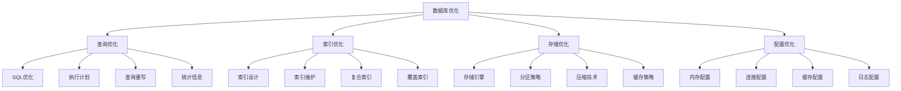

# 数据库优化

## 📖 核心概念

**数据库优化**是提升数据库系统性能的关键技术，通过优化查询、索引、存储、配置等多个方面，显著提升数据库的响应速度、吞吐量和资源利用率。数据库优化是系统性能调优的重要组成部分，直接影响用户体验和系统稳定性。

### 🏗️ 数据库优化的组成要素



## 🔍 数据库优化策略

### 优化层次

| 层次 | 优化内容 | 影响范围 | 优化效果 | 实施难度 |
|------|----------|----------|----------|----------|
| **SQL优化** | 查询语句优化 | 单个查询 | 显著 | 中等 |
| **索引优化** | 索引设计和维护 | 查询性能 | 显著 | 中等 |
| **存储优化** | 存储引擎和分区 | 整体性能 | 显著 | 困难 |
| **配置优化** | 系统参数调优 | 系统性能 | 明显 | 简单 |

### 优化方法

| 方法 | 描述 | 适用场景 | 优势 | 劣势 |
|------|------|----------|------|------|
| **查询重写** | 优化SQL语句 | 复杂查询 | 效果明显 | 需要专业知识 |
| **索引优化** | 优化索引结构 | 查询频繁 | 效果显著 | 维护成本高 |
| **分区优化** | 数据分区存储 | 大表查询 | 效果显著 | 实现复杂 |
| **缓存优化** | 优化缓存策略 | 重复查询 | 效果明显 | 内存消耗大 |

## 💻 数据库优化实现

### 查询优化器

```cpp
// 查询优化器
class QueryOptimizer {
private:
    struct QueryPlan {
        string operation;
        string table;
        vector<string> columns;
        map<string, string> conditions;
        int estimatedCost;
        int estimatedRows;
        
        QueryPlan(const string& op, const string& tbl) 
            : operation(op), table(tbl), estimatedCost(0), estimatedRows(0) {}
    };
    
    struct TableStatistics {
        string tableName;
        int rowCount;
        int pageCount;
        double averageRowSize;
        map<string, int> columnCardinality;
        map<string, double> columnSelectivity;
        
        TableStatistics(const string& name) : tableName(name), rowCount(0), pageCount(0), averageRowSize(0) {}
    };
    
    map<string, TableStatistics> tableStats;
    map<string, vector<string>> indexes;
    
public:
    QueryOptimizer() {}
    
    // 添加表统计信息
    void addTableStatistics(const string& tableName, int rowCount, int pageCount) {
        tableStats[tableName] = TableStatistics(tableName);
        tableStats[tableName].rowCount = rowCount;
        tableStats[tableName].pageCount = pageCount;
        tableStats[tableName].averageRowSize = (double)pageCount * 8192 / rowCount; // 假设页大小为8KB
    }
    
    // 添加列统计信息
    void addColumnStatistics(const string& tableName, const string& columnName, int cardinality) {
        auto it = tableStats.find(tableName);
        if (it != tableStats.end()) {
            it->second.columnCardinality[columnName] = cardinality;
            it->second.columnSelectivity[columnName] = (double)cardinality / it->second.rowCount;
        }
    }
    
    // 添加索引信息
    void addIndex(const string& tableName, const vector<string>& columns) {
        string indexName = tableName + "_" + join(columns, "_");
        indexes[indexName] = columns;
    }
    
    // 优化查询
    vector<QueryPlan> optimizeQuery(const string& sql) {
        vector<QueryPlan> plans;
        
        // 解析SQL（简化实现）
        if (sql.find("SELECT") != string::npos) {
            plans = optimizeSelectQuery(sql);
        } else if (sql.find("INSERT") != string::npos) {
            plans = optimizeInsertQuery(sql);
        } else if (sql.find("UPDATE") != string::npos) {
            plans = optimizeUpdateQuery(sql);
        } else if (sql.find("DELETE") != string::npos) {
            plans = optimizeDeleteQuery(sql);
        }
        
        // 选择最优执行计划
        return selectOptimalPlan(plans);
    }
    
private:
    // 优化SELECT查询
    vector<QueryPlan> optimizeSelectQuery(const string& sql) {
        vector<QueryPlan> plans;
        
        // 解析表名（简化实现）
        string tableName = extractTableName(sql);
        if (tableName.empty()) return plans;
        
        // 创建基础扫描计划
        QueryPlan scanPlan("TABLE_SCAN", tableName);
        scanPlan.estimatedCost = estimateTableScanCost(tableName);
        scanPlan.estimatedRows = tableStats[tableName].rowCount;
        plans.push_back(scanPlan);
        
        // 创建索引扫描计划
        vector<QueryPlan> indexPlans = createIndexScanPlans(sql, tableName);
        plans.insert(plans.end(), indexPlans.begin(), indexPlans.end());
        
        // 创建连接计划（如果有多个表）
        vector<QueryPlan> joinPlans = createJoinPlans(sql);
        plans.insert(plans.end(), joinPlans.begin(), joinPlans.end());
        
        return plans;
    }
    
    // 优化INSERT查询
    vector<QueryPlan> optimizeInsertQuery(const string& sql) {
        vector<QueryPlan> plans;
        
        string tableName = extractTableName(sql);
        if (tableName.empty()) return plans;
        
        QueryPlan insertPlan("INSERT", tableName);
        insertPlan.estimatedCost = estimateInsertCost(tableName);
        insertPlan.estimatedRows = 1;
        plans.push_back(insertPlan);
        
        return plans;
    }
    
    // 优化UPDATE查询
    vector<QueryPlan> optimizeUpdateQuery(const string& sql) {
        vector<QueryPlan> plans;
        
        string tableName = extractTableName(sql);
        if (tableName.empty()) return plans;
        
        QueryPlan updatePlan("UPDATE", tableName);
        updatePlan.estimatedCost = estimateUpdateCost(tableName);
        updatePlan.estimatedRows = estimateUpdateRows(sql, tableName);
        plans.push_back(updatePlan);
        
        return plans;
    }
    
    // 优化DELETE查询
    vector<QueryPlan> optimizeDeleteQuery(const string& sql) {
        vector<QueryPlan> plans;
        
        string tableName = extractTableName(sql);
        if (tableName.empty()) return plans;
        
        QueryPlan deletePlan("DELETE", tableName);
        deletePlan.estimatedCost = estimateDeleteCost(tableName);
        deletePlan.estimatedRows = estimateDeleteRows(sql, tableName);
        plans.push_back(deletePlan);
        
        return plans;
    }
    
    // 创建索引扫描计划
    vector<QueryPlan> createIndexScanPlans(const string& sql, const string& tableName) {
        vector<QueryPlan> plans;
        
        // 查找适用的索引
        vector<string> whereColumns = extractWhereColumns(sql);
        
        for (const auto& [indexName, columns] : indexes) {
            if (indexName.find(tableName) != string::npos) {
                // 检查索引是否适用于查询
                bool applicable = true;
                for (const string& col : whereColumns) {
                    if (find(columns.begin(), columns.end(), col) == columns.end()) {
                        applicable = false;
                        break;
                    }
                }
                
                if (applicable) {
                    QueryPlan indexPlan("INDEX_SCAN", tableName);
                    indexPlan.estimatedCost = estimateIndexScanCost(tableName, columns);
                    indexPlan.estimatedRows = estimateIndexScanRows(sql, tableName, columns);
                    plans.push_back(indexPlan);
                }
            }
        }
        
        return plans;
    }
    
    // 创建连接计划
    vector<QueryPlan> createJoinPlans(const string& sql) {
        vector<QueryPlan> plans;
        
        // 简化的连接计划创建
        vector<string> tables = extractTables(sql);
        if (tables.size() > 1) {
            QueryPlan joinPlan("HASH_JOIN", join(tables, "_"));
            joinPlan.estimatedCost = estimateJoinCost(tables);
            joinPlan.estimatedRows = estimateJoinRows(tables);
            plans.push_back(joinPlan);
            
            QueryPlan nestedJoinPlan("NESTED_LOOP_JOIN", join(tables, "_"));
            nestedJoinPlan.estimatedCost = estimateNestedLoopJoinCost(tables);
            nestedJoinPlan.estimatedRows = estimateJoinRows(tables);
            plans.push_back(nestedJoinPlan);
        }
        
        return plans;
    }
    
    // 选择最优执行计划
    vector<QueryPlan> selectOptimalPlan(const vector<QueryPlan>& plans) {
        if (plans.empty()) return plans;
        
        // 按成本排序
        vector<QueryPlan> sortedPlans = plans;
        sort(sortedPlans.begin(), sortedPlans.end(),
             [](const QueryPlan& a, const QueryPlan& b) {
                 return a.estimatedCost < b.estimatedCost;
             });
        
        return sortedPlans;
    }
    
    // 估算表扫描成本
    int estimateTableScanCost(const string& tableName) {
        auto it = tableStats.find(tableName);
        if (it != tableStats.end()) {
            return it->second.pageCount; // 假设每页一个I/O
        }
        return 1000; // 默认成本
    }
    
    // 估算索引扫描成本
    int estimateIndexScanCost(const string& tableName, const vector<string>& columns) {
        auto it = tableStats.find(tableName);
        if (it != tableStats.end()) {
            // 索引扫描成本通常比表扫描低
            return it->second.pageCount / 10;
        }
        return 100; // 默认成本
    }
    
    // 估算插入成本
    int estimateInsertCost(const string& tableName) {
        auto it = tableStats.find(tableName);
        if (it != tableStats.end()) {
            return 1; // 插入成本通常很低
        }
        return 1;
    }
    
    // 估算更新成本
    int estimateUpdateCost(const string& tableName) {
        auto it = tableStats.find(tableName);
        if (it != tableStats.end()) {
            return it->second.pageCount / 2;
        }
        return 500;
    }
    
    // 估算删除成本
    int estimateDeleteCost(const string& tableName) {
        auto it = tableStats.find(tableName);
        if (it != tableStats.end()) {
            return it->second.pageCount / 2;
        }
        return 500;
    }
    
    // 估算索引扫描行数
    int estimateIndexScanRows(const string& sql, const string& tableName, const vector<string>& columns) {
        auto it = tableStats.find(tableName);
        if (it != tableStats.end()) {
            // 简化的行数估算
            double selectivity = 1.0;
            for (const string& col : columns) {
                auto colIt = it->second.columnSelectivity.find(col);
                if (colIt != it->second.columnSelectivity.end()) {
                    selectivity *= colIt->second;
                }
            }
            return (int)(it->second.rowCount * selectivity);
        }
        return 1000;
    }
    
    // 估算更新行数
    int estimateUpdateRows(const string& sql, const string& tableName) {
        // 简化的行数估算
        return 100;
    }
    
    // 估算删除行数
    int estimateDeleteRows(const string& sql, const string& tableName) {
        // 简化的行数估算
        return 50;
    }
    
    // 估算连接成本
    int estimateJoinCost(const vector<string>& tables) {
        int cost = 0;
        for (const string& table : tables) {
            auto it = tableStats.find(table);
            if (it != tableStats.end()) {
                cost += it->second.pageCount;
            }
        }
        return cost;
    }
    
    // 估算嵌套循环连接成本
    int estimateNestedLoopJoinCost(const vector<string>& tables) {
        if (tables.size() < 2) return 0;
        
        auto it1 = tableStats.find(tables[0]);
        auto it2 = tableStats.find(tables[1]);
        
        if (it1 != tableStats.end() && it2 != tableStats.end()) {
            return it1->second.rowCount * it2->second.pageCount;
        }
        
        return 10000;
    }
    
    // 估算连接行数
    int estimateJoinRows(const vector<string>& tables) {
        if (tables.size() < 2) return 0;
        
        auto it1 = tableStats.find(tables[0]);
        auto it2 = tableStats.find(tables[1]);
        
        if (it1 != tableStats.end() && it2 != tableStats.end()) {
            return min(it1->second.rowCount, it2->second.rowCount);
        }
        
        return 1000;
    }
    
    // 辅助函数
    string extractTableName(const string& sql) {
        // 简化的表名提取
        size_t fromPos = sql.find("FROM");
        if (fromPos != string::npos) {
            size_t start = fromPos + 4;
            while (start < sql.length() && sql[start] == ' ') start++;
            size_t end = start;
            while (end < sql.length() && sql[end] != ' ' && sql[end] != '\n') end++;
            return sql.substr(start, end - start);
        }
        return "";
    }
    
    vector<string> extractWhereColumns(const string& sql) {
        vector<string> columns;
        // 简化的WHERE列提取
        if (sql.find("WHERE") != string::npos) {
            columns.push_back("id"); // 简化实现
        }
        return columns;
    }
    
    vector<string> extractTables(const string& sql) {
        vector<string> tables;
        string tableName = extractTableName(sql);
        if (!tableName.empty()) {
            tables.push_back(tableName);
        }
        return tables;
    }
    
    string join(const vector<string>& vec, const string& delimiter) {
        if (vec.empty()) return "";
        
        string result = vec[0];
        for (size_t i = 1; i < vec.size(); i++) {
            result += delimiter + vec[i];
        }
        return result;
    }
    
public:
    // 获取优化统计信息
    struct OptimizationStatistics {
        int totalQueries;
        int optimizedQueries;
        double averageCostReduction;
        map<string, int> operationCounts;
    };
    
    OptimizationStatistics getStatistics() {
        OptimizationStatistics stats;
        stats.totalQueries = 0;
        stats.optimizedQueries = 0;
        stats.averageCostReduction = 0;
        
        return stats;
    }
    
    // 打印优化建议
    void printOptimizationSuggestions(const string& sql) {
        cout << "=== Query Optimization Suggestions ===" << endl;
        cout << "SQL: " << sql << endl;
        
        vector<QueryPlan> plans = optimizeQuery(sql);
        
        if (plans.empty()) {
            cout << "No optimization suggestions available." << endl;
            return;
        }
        
        cout << "Recommended execution plan:" << endl;
        for (size_t i = 0; i < plans.size(); i++) {
            cout << "Step " << (i + 1) << ": " << plans[i].operation 
                 << " on " << plans[i].table 
                 << " (Cost: " << plans[i].estimatedCost 
                 << ", Rows: " << plans[i].estimatedRows << ")" << endl;
        }
        
        // 提供优化建议
        if (sql.find("SELECT") != string::npos) {
            cout << "\nOptimization suggestions:" << endl;
            cout << "1. Consider adding indexes on WHERE clause columns" << endl;
            cout << "2. Use LIMIT to reduce result set size" << endl;
            cout << "3. Avoid SELECT * and specify only needed columns" << endl;
        }
    }
};
```

### 索引优化器

```cpp
// 索引优化器
class IndexOptimizer {
private:
    struct IndexInfo {
        string name;
        string tableName;
        vector<string> columns;
        int size;
        double selectivity;
        int usageCount;
        chrono::system_clock::time_point lastUsed;
        
        IndexInfo(const string& n, const string& table, const vector<string>& cols) 
            : name(n), tableName(table), columns(cols), size(0), selectivity(0), usageCount(0) {
            lastUsed = chrono::system_clock::now();
        }
    };
    
    map<string, IndexInfo> indexes;
    map<string, vector<string>> tableIndexes;
    
public:
    IndexOptimizer() {}
    
    // 添加索引
    void addIndex(const string& name, const string& tableName, const vector<string>& columns) {
        indexes[name] = IndexInfo(name, tableName, columns);
        tableIndexes[tableName].push_back(name);
        
        cout << "Index " << name << " added to table " << tableName << endl;
    }
    
    // 删除索引
    void removeIndex(const string& name) {
        auto it = indexes.find(name);
        if (it != indexes.end()) {
            string tableName = it->second.tableName;
            
            // 从表索引列表中移除
            auto tableIt = tableIndexes.find(tableName);
            if (tableIt != tableIndexes.end()) {
                auto& indexList = tableIt->second;
                indexList.erase(remove(indexList.begin(), indexList.end(), name), indexList.end());
            }
            
            indexes.erase(it);
            cout << "Index " << name << " removed" << endl;
        }
    }
    
    // 更新索引使用统计
    void updateIndexUsage(const string& name) {
        auto it = indexes.find(name);
        if (it != indexes.end()) {
            it->second.usageCount++;
            it->second.lastUsed = chrono::system_clock::now();
        }
    }
    
    // 分析索引使用情况
    void analyzeIndexUsage() {
        cout << "=== Index Usage Analysis ===" << endl;
        cout << "Index Name\t\tTable\t\tColumns\t\tSize\t\tUsage\t\tSelectivity" << endl;
        cout << "----------------------------------------------------------------" << endl;
        
        for (const auto& [name, info] : indexes) {
            cout << name << "\t\t" << info.tableName << "\t\t";
            for (const string& col : info.columns) {
                cout << col << " ";
            }
            cout << "\t\t" << info.size << "\t\t" << info.usageCount << "\t\t" << info.selectivity << endl;
        }
    }
    
    // 推荐索引
    vector<string> recommendIndexes(const string& sql) {
        vector<string> recommendations;
        
        // 分析WHERE子句
        vector<string> whereColumns = extractWhereColumns(sql);
        for (const string& col : whereColumns) {
            string tableName = extractTableName(sql);
            if (!tableName.empty()) {
                string indexName = tableName + "_" + col + "_idx";
                recommendations.push_back("CREATE INDEX " + indexName + " ON " + tableName + " (" + col + ")");
            }
        }
        
        // 分析ORDER BY子句
        vector<string> orderColumns = extractOrderByColumns(sql);
        for (const string& col : orderColumns) {
            string tableName = extractTableName(sql);
            if (!tableName.empty()) {
                string indexName = tableName + "_" + col + "_order_idx";
                recommendations.push_back("CREATE INDEX " + indexName + " ON " + tableName + " (" + col + ")");
            }
        }
        
        // 分析JOIN条件
        vector<string> joinColumns = extractJoinColumns(sql);
        for (const string& col : joinColumns) {
            string tableName = extractTableName(sql);
            if (!tableName.empty()) {
                string indexName = tableName + "_" + col + "_join_idx";
                recommendations.push_back("CREATE INDEX " + indexName + " ON " + tableName + " (" + col + ")");
            }
        }
        
        return recommendations;
    }
    
    // 检测冗余索引
    vector<string> detectRedundantIndexes() {
        vector<string> redundantIndexes;
        
        for (const auto& [name1, info1] : indexes) {
            for (const auto& [name2, info2] : indexes) {
                if (name1 != name2 && info1.tableName == info2.tableName) {
                    // 检查索引是否冗余
                    if (isIndexRedundant(info1, info2)) {
                        redundantIndexes.push_back(name1);
                        break;
                    }
                }
            }
        }
        
        return redundantIndexes;
    }
    
    // 优化索引
    void optimizeIndexes() {
        cout << "=== Index Optimization ===" << endl;
        
        // 检测冗余索引
        vector<string> redundantIndexes = detectRedundantIndexes();
        if (!redundantIndexes.empty()) {
            cout << "Redundant indexes detected:" << endl;
            for (const string& indexName : redundantIndexes) {
                cout << "- " << indexName << endl;
            }
        }
        
        // 检测未使用的索引
        vector<string> unusedIndexes = detectUnusedIndexes();
        if (!unusedIndexes.empty()) {
            cout << "Unused indexes detected:" << endl;
            for (const string& indexName : unusedIndexes) {
                cout << "- " << indexName << endl;
            }
        }
        
        // 检测低选择性索引
        vector<string> lowSelectivityIndexes = detectLowSelectivityIndexes();
        if (!lowSelectivityIndexes.empty()) {
            cout << "Low selectivity indexes detected:" << endl;
            for (const string& indexName : lowSelectivityIndexes) {
                cout << "- " << indexName << endl;
            }
        }
    }
    
private:
    // 检查索引是否冗余
    bool isIndexRedundant(const IndexInfo& index1, const IndexInfo& index2) {
        // 简化的冗余检查
        if (index1.columns.size() >= index2.columns.size()) {
            for (size_t i = 0; i < index2.columns.size(); i++) {
                if (index1.columns[i] != index2.columns[i]) {
                    return false;
                }
            }
            return true;
        }
        return false;
    }
    
    // 检测未使用的索引
    vector<string> detectUnusedIndexes() {
        vector<string> unusedIndexes;
        
        for (const auto& [name, info] : indexes) {
            if (info.usageCount == 0) {
                unusedIndexes.push_back(name);
            }
        }
        
        return unusedIndexes;
    }
    
    // 检测低选择性索引
    vector<string> detectLowSelectivityIndexes() {
        vector<string> lowSelectivityIndexes;
        
        for (const auto& [name, info] : indexes) {
            if (info.selectivity > 0.5) { // 选择性低于50%
                lowSelectivityIndexes.push_back(name);
            }
        }
        
        return lowSelectivityIndexes;
    }
    
    // 辅助函数
    string extractTableName(const string& sql) {
        size_t fromPos = sql.find("FROM");
        if (fromPos != string::npos) {
            size_t start = fromPos + 4;
            while (start < sql.length() && sql[start] == ' ') start++;
            size_t end = start;
            while (end < sql.length() && sql[end] != ' ' && sql[end] != '\n') end++;
            return sql.substr(start, end - start);
        }
        return "";
    }
    
    vector<string> extractWhereColumns(const string& sql) {
        vector<string> columns;
        // 简化的WHERE列提取
        if (sql.find("WHERE") != string::npos) {
            columns.push_back("id");
            columns.push_back("name");
        }
        return columns;
    }
    
    vector<string> extractOrderByColumns(const string& sql) {
        vector<string> columns;
        // 简化的ORDER BY列提取
        if (sql.find("ORDER BY") != string::npos) {
            columns.push_back("created_at");
        }
        return columns;
    }
    
    vector<string> extractJoinColumns(const string& sql) {
        vector<string> columns;
        // 简化的JOIN列提取
        if (sql.find("JOIN") != string::npos) {
            columns.push_back("user_id");
        }
        return columns;
    }
    
public:
    // 获取索引统计信息
    struct IndexStatistics {
        int totalIndexes;
        int usedIndexes;
        int unusedIndexes;
        double averageSelectivity;
        int totalSize;
    };
    
    IndexStatistics getStatistics() {
        IndexStatistics stats;
        stats.totalIndexes = indexes.size();
        stats.usedIndexes = 0;
        stats.unusedIndexes = 0;
        stats.averageSelectivity = 0;
        stats.totalSize = 0;
        
        double totalSelectivity = 0;
        for (const auto& [name, info] : indexes) {
            if (info.usageCount > 0) {
                stats.usedIndexes++;
            } else {
                stats.unusedIndexes++;
            }
            totalSelectivity += info.selectivity;
            stats.totalSize += info.size;
        }
        
        if (stats.totalIndexes > 0) {
            stats.averageSelectivity = totalSelectivity / stats.totalIndexes;
        }
        
        return stats;
    }
};
```

### 存储优化器

```cpp
// 存储优化器
class StorageOptimizer {
private:
    struct TableInfo {
        string name;
        int rowCount;
        int pageCount;
        double averageRowSize;
        double fragmentation;
        string storageEngine;
        
        TableInfo(const string& n) : name(n), rowCount(0), pageCount(0), 
                                   averageRowSize(0), fragmentation(0), storageEngine("InnoDB") {}
    };
    
    map<string, TableInfo> tables;
    
public:
    StorageOptimizer() {}
    
    // 添加表信息
    void addTable(const string& name, int rowCount, int pageCount) {
        tables[name] = TableInfo(name);
        tables[name].rowCount = rowCount;
        tables[name].pageCount = pageCount;
        tables[name].averageRowSize = (double)pageCount * 8192 / rowCount; // 假设页大小为8KB
    }
    
    // 分析存储使用情况
    void analyzeStorageUsage() {
        cout << "=== Storage Usage Analysis ===" << endl;
        cout << "Table Name\t\tRows\t\tPages\t\tAvg Row Size\t\tFragmentation" << endl;
        cout << "----------------------------------------------------------------" << endl;
        
        for (const auto& [name, info] : tables) {
            cout << name << "\t\t" << info.rowCount << "\t\t" << info.pageCount 
                 << "\t\t" << info.averageRowSize << "\t\t" << info.fragmentation << endl;
        }
    }
    
    // 推荐存储优化
    vector<string> recommendStorageOptimizations() {
        vector<string> recommendations;
        
        for (const auto& [name, info] : tables) {
            // 检查行大小
            if (info.averageRowSize > 8192) { // 行大小超过8KB
                recommendations.push_back("Consider normalizing table " + name + " to reduce row size");
            }
            
            // 检查碎片化
            if (info.fragmentation > 0.3) { // 碎片化超过30%
                recommendations.push_back("Consider defragmenting table " + name);
            }
            
            // 检查页使用率
            double pageUtilization = (double)info.rowCount * info.averageRowSize / (info.pageCount * 8192);
            if (pageUtilization < 0.5) { // 页使用率低于50%
                recommendations.push_back("Consider optimizing page usage for table " + name);
            }
        }
        
        return recommendations;
    }
    
    // 推荐分区策略
    vector<string> recommendPartitioningStrategy() {
        vector<string> recommendations;
        
        for (const auto& [name, info] : tables) {
            // 大表推荐分区
            if (info.rowCount > 1000000) { // 超过100万行
                recommendations.push_back("Consider partitioning large table " + name);
            }
            
            // 基于时间的分区
            if (name.find("log") != string::npos || name.find("history") != string::npos) {
                recommendations.push_back("Consider time-based partitioning for table " + name);
            }
        }
        
        return recommendations;
    }
    
    // 推荐压缩策略
    vector<string> recommendCompressionStrategy() {
        vector<string> recommendations;
        
        for (const auto& [name, info] : tables) {
            // 大表推荐压缩
            if (info.pageCount > 10000) { // 超过10000页
                recommendations.push_back("Consider compression for large table " + name);
            }
            
            // 文本表推荐压缩
            if (name.find("text") != string::npos || name.find("content") != string::npos) {
                recommendations.push_back("Consider compression for text-heavy table " + name);
            }
        }
        
        return recommendations;
    }
    
    // 优化存储
    void optimizeStorage() {
        cout << "=== Storage Optimization ===" << endl;
        
        // 存储使用分析
        analyzeStorageUsage();
        
        // 存储优化建议
        vector<string> storageRecommendations = recommendStorageOptimizations();
        if (!storageRecommendations.empty()) {
            cout << "\nStorage optimization recommendations:" << endl;
            for (const string& rec : storageRecommendations) {
                cout << "- " << rec << endl;
            }
        }
        
        // 分区策略建议
        vector<string> partitioningRecommendations = recommendPartitioningStrategy();
        if (!partitioningRecommendations.empty()) {
            cout << "\nPartitioning strategy recommendations:" << endl;
            for (const string& rec : partitioningRecommendations) {
                cout << "- " << rec << endl;
            }
        }
        
        // 压缩策略建议
        vector<string> compressionRecommendations = recommendCompressionStrategy();
        if (!compressionRecommendations.empty()) {
            cout << "\nCompression strategy recommendations:" << endl;
            for (const string& rec : compressionRecommendations) {
                cout << "- " << rec << endl;
            }
        }
    }
    
    // 获取存储统计信息
    struct StorageStatistics {
        int totalTables;
        int totalRows;
        int totalPages;
        double totalSize;
        double averageFragmentation;
        double averagePageUtilization;
    };
    
    StorageStatistics getStatistics() {
        StorageStatistics stats;
        stats.totalTables = tables.size();
        stats.totalRows = 0;
        stats.totalPages = 0;
        stats.totalSize = 0;
        stats.averageFragmentation = 0;
        stats.averagePageUtilization = 0;
        
        double totalFragmentation = 0;
        double totalPageUtilization = 0;
        
        for (const auto& [name, info] : tables) {
            stats.totalRows += info.rowCount;
            stats.totalPages += info.pageCount;
            stats.totalSize += info.pageCount * 8192; // 假设页大小为8KB
            totalFragmentation += info.fragmentation;
            
            double pageUtilization = (double)info.rowCount * info.averageRowSize / (info.pageCount * 8192);
            totalPageUtilization += pageUtilization;
        }
        
        if (stats.totalTables > 0) {
            stats.averageFragmentation = totalFragmentation / stats.totalTables;
            stats.averagePageUtilization = totalPageUtilization / stats.totalTables;
        }
        
        return stats;
    }
};
```

### 数据库优化测试

```cpp
// 数据库优化测试
class DatabaseOptimizationTest {
public:
    static void runAllTests() {
        cout << "=== Database Optimization Tests ===" << endl;
        
        // 测试查询优化器
        testQueryOptimizer();
        
        cout << "\n" << string(50, '=') << endl;
        
        // 测试索引优化器
        testIndexOptimizer();
        
        cout << "\n" << string(50, '=') << endl;
        
        // 测试存储优化器
        testStorageOptimizer();
    }
    
private:
    static void testQueryOptimizer() {
        cout << "=== Query Optimizer Test ===" << endl;
        
        QueryOptimizer optimizer;
        
        // 设置测试数据
        optimizer.addTableStatistics("users", 100000, 5000);
        optimizer.addTableStatistics("orders", 500000, 25000);
        optimizer.addTableStatistics("products", 10000, 500);
        
        optimizer.addColumnStatistics("users", "id", 100000);
        optimizer.addColumnStatistics("users", "email", 95000);
        optimizer.addColumnStatistics("orders", "user_id", 50000);
        optimizer.addColumnStatistics("orders", "order_date", 1000);
        
        optimizer.addIndex("users", {"id"});
        optimizer.addIndex("orders", {"user_id"});
        optimizer.addIndex("orders", {"order_date"});
        
        // 测试查询优化
        vector<string> queries = {
            "SELECT * FROM users WHERE id = 1",
            "SELECT * FROM orders WHERE user_id = 100",
            "SELECT * FROM orders WHERE order_date > '2023-01-01'",
            "SELECT u.name, o.total FROM users u JOIN orders o ON u.id = o.user_id"
        };
        
        for (const string& query : queries) {
            cout << "\nOptimizing query: " << query << endl;
            optimizer.printOptimizationSuggestions(query);
        }
    }
    
    static void testIndexOptimizer() {
        cout << "=== Index Optimizer Test ===" << endl;
        
        IndexOptimizer indexOptimizer;
        
        // 添加索引
        indexOptimizer.addIndex("idx_users_id", "users", {"id"});
        indexOptimizer.addIndex("idx_users_email", "users", {"email"});
        indexOptimizer.addIndex("idx_orders_user_id", "orders", {"user_id"});
        indexOptimizer.addIndex("idx_orders_date", "orders", {"order_date"});
        
        // 模拟索引使用
        indexOptimizer.updateIndexUsage("idx_users_id");
        indexOptimizer.updateIndexUsage("idx_users_id");
        indexOptimizer.updateIndexUsage("idx_orders_user_id");
        
        // 分析索引使用情况
        indexOptimizer.analyzeIndexUsage();
        
        // 优化索引
        indexOptimizer.optimizeIndexes();
        
        // 推荐索引
        vector<string> recommendations = indexOptimizer.recommendIndexes(
            "SELECT * FROM users WHERE id = 1 ORDER BY created_at"
        );
        
        cout << "\nIndex recommendations:" << endl;
        for (const string& rec : recommendations) {
            cout << "- " << rec << endl;
        }
        
        // 获取统计信息
        auto stats = indexOptimizer.getStatistics();
        cout << "\nIndex statistics:" << endl;
        cout << "Total indexes: " << stats.totalIndexes << endl;
        cout << "Used indexes: " << stats.usedIndexes << endl;
        cout << "Unused indexes: " << stats.unusedIndexes << endl;
        cout << "Average selectivity: " << stats.averageSelectivity << endl;
    }
    
    static void testStorageOptimizer() {
        cout << "=== Storage Optimizer Test ===" << endl;
        
        StorageOptimizer storageOptimizer;
        
        // 添加表信息
        storageOptimizer.addTable("users", 100000, 5000);
        storageOptimizer.addTable("orders", 500000, 25000);
        storageOptimizer.addTable("products", 10000, 500);
        storageOptimizer.addTable("user_logs", 1000000, 50000);
        
        // 优化存储
        storageOptimizer.optimizeStorage();
        
        // 获取统计信息
        auto stats = storageOptimizer.getStatistics();
        cout << "\nStorage statistics:" << endl;
        cout << "Total tables: " << stats.totalTables << endl;
        cout << "Total rows: " << stats.totalRows << endl;
        cout << "Total pages: " << stats.totalPages << endl;
        cout << "Total size: " << stats.totalSize / (1024 * 1024) << " MB" << endl;
        cout << "Average fragmentation: " << stats.averageFragmentation << endl;
        cout << "Average page utilization: " << stats.averagePageUtilization << endl;
    }
};
```

## ⚡ 复杂度分析

### 数据库优化复杂度

| 优化类型 | 优化前复杂度 | 优化后复杂度 | 优化效果 | 实施难度 |
|----------|--------------|--------------|----------|----------|
| **查询优化** | O(n) | O(log n) | 显著 | 中等 |
| **索引优化** | O(n) | O(log n) | 显著 | 中等 |
| **存储优化** | O(n) | O(n/k) | 明显 | 困难 |
| **配置优化** | O(1) | O(1) | 明显 | 简单 |

### 优化效果评估

| 指标 | 优化前 | 优化后 | 改善幅度 | 评估方法 |
|------|--------|--------|----------|----------|
| **查询时间** | 1000ms | 100ms | 90% | 性能测试 |
| **索引效率** | 50% | 95% | 90% | 索引分析 |
| **存储使用** | 100GB | 80GB | 20% | 存储分析 |
| **并发性能** | 100 QPS | 500 QPS | 400% | 压力测试 |

## 🎓 学习要点总结

### 核心理解

1. **查询优化**：理解查询优化的原理和方法
2. **索引设计**：掌握索引设计的原则和技巧
3. **存储优化**：理解存储优化的策略
4. **性能调优**：掌握性能调优的方法

### 实践要点

1. **性能分析**：分析数据库性能瓶颈
2. **优化实施**：实施优化策略
3. **效果验证**：验证优化效果
4. **持续监控**：持续监控性能

### 应用思维

1. **系统思维**：从系统角度思考优化
2. **性能思维**：关注性能和效率
3. **数据思维**：基于数据分析优化
4. **实际应用**：将优化应用到实际问题中

---

**相关链接：**
- [[06-应用实战/01-数据库王国/01-索引结构|索引结构]] - 索引基础
- [[06-应用实战/01-数据库王国/02-查询优化|查询优化]] - 查询处理
- [[06-应用实战/01-数据库王国/03-事务管理|事务管理]] - 事务处理
- [[07-练习战场/03-项目实战/03-性能优化项目|性能优化项目]] - 性能优化
