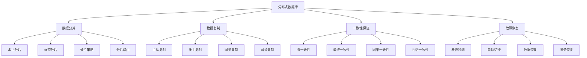

# 分布式数据库

## 📖 核心概念

**分布式数据库**是将数据分布在多个物理节点上的数据库系统，通过分布式架构、数据分片、复制机制等技术，实现高可用性、高扩展性和高性能。分布式数据库是现代大规模应用的核心基础设施，能够处理海量数据和超高并发访问。

### 🏗️ 分布式数据库的组成要素



## 🔍 分布式数据库架构

### 架构类型

| 架构类型 | 特点 | 优势 | 劣势 | 适用场景 |
|----------|------|------|------|----------|
| **主从架构** | 一主多从 | 简单可靠 | 写性能限制 | 读多写少 |
| **多主架构** | 多主节点 | 高可用性 | 一致性复杂 | 高可用需求 |
| **分片架构** | 数据分片 | 高扩展性 | 跨分片查询复杂 | 大数据量 |
| **混合架构** | 多种架构结合 | 功能全面 | 复杂度高 | 复杂场景 |

### 一致性模型

| 一致性模型 | 描述 | 性能 | 复杂度 | 适用场景 |
|------------|------|------|--------|----------|
| **强一致性** | 所有节点数据一致 | 低 | 高 | 金融系统 |
| **最终一致性** | 最终达到一致 | 高 | 低 | 互联网应用 |
| **因果一致性** | 因果相关操作一致 | 中 | 中 | 社交网络 |
| **会话一致性** | 会话内一致 | 高 | 低 | 用户会话 |

## 💻 分布式数据库实现

### 分布式数据库管理器

```cpp
// 分布式数据库管理器
class DistributedDatabaseManager {
private:
    struct DatabaseNode {
        string nodeId;
        string host;
        int port;
        bool isActive;
        bool isMaster;
        chrono::system_clock::time_point lastHeartbeat;
        map<string, int> shardCounts;
        
        DatabaseNode(const string& id, const string& h, int p) 
            : nodeId(id), host(h), port(p), isActive(true), isMaster(false) {
            lastHeartbeat = chrono::system_clock::now();
        }
        
        string getAddress() const {
            return host + ":" + to_string(port);
        }
    };
    
    struct ShardInfo {
        string shardId;
        string tableName;
        string nodeId;
        string rangeStart;
        string rangeEnd;
        int recordCount;
        
        ShardInfo(const string& id, const string& table, const string& node) 
            : shardId(id), tableName(table), nodeId(node), recordCount(0) {}
    };
    
    vector<DatabaseNode> nodes;
    map<string, ShardInfo> shards;
    map<string, vector<string>> tableShards;
    mutex managerMutex;
    
    // 分片策略
    enum ShardingStrategy {
        RANGE_SHARDING,
        HASH_SHARDING,
        DIRECTORY_SHARDING
    };
    
    ShardingStrategy shardingStrategy;
    
public:
    DistributedDatabaseManager(ShardingStrategy strategy = HASH_SHARDING) 
        : shardingStrategy(strategy) {}
    
    // 添加数据库节点
    void addNode(const string& nodeId, const string& host, int port, bool isMaster = false) {
        lock_guard<mutex> lock(managerMutex);
        
        nodes.emplace_back(nodeId, host, port);
        if (isMaster) {
            nodes.back().isMaster = true;
        }
        
        cout << "Node " << nodeId << " added at " << host << ":" << port << endl;
    }
    
    // 移除数据库节点
    void removeNode(const string& nodeId) {
        lock_guard<mutex> lock(managerMutex);
        
        auto it = find_if(nodes.begin(), nodes.end(),
                         [&nodeId](const DatabaseNode& node) {
                             return node.nodeId == nodeId;
                         });
        
        if (it != nodes.end()) {
            // 重新分配该节点的分片
            redistributeShards(nodeId);
            nodes.erase(it);
            cout << "Node " << nodeId << " removed" << endl;
        }
    }
    
    // 创建表分片
    void createTableShards(const string& tableName, int shardCount) {
        lock_guard<mutex> lock(managerMutex);
        
        if (nodes.empty()) {
            cout << "No nodes available for sharding" << endl;
            return;
        }
        
        tableShards[tableName].clear();
        
        for (int i = 0; i < shardCount; i++) {
            string shardId = tableName + "_shard_" + to_string(i);
            string nodeId = selectNodeForShard();
            
            ShardInfo shard(shardId, tableName, nodeId);
            shards[shardId] = shard;
            tableShards[tableName].push_back(shardId);
            
            // 更新节点分片计数
            for (auto& node : nodes) {
                if (node.nodeId == nodeId) {
                    node.shardCounts[tableName]++;
                    break;
                }
            }
        }
        
        cout << "Created " << shardCount << " shards for table " << tableName << endl;
    }
    
    // 插入数据
    bool insertData(const string& tableName, const string& key, const string& value) {
        lock_guard<mutex> lock(managerMutex);
        
        string shardId = getShardForKey(tableName, key);
        if (shardId.empty()) {
            return false;
        }
        
        ShardInfo& shard = shards[shardId];
        shard.recordCount++;
        
        cout << "Inserting data into shard " << shardId << " on node " << shard.nodeId << endl;
        
        // 模拟数据插入
        return true;
    }
    
    // 查询数据
    string queryData(const string& tableName, const string& key) {
        lock_guard<mutex> lock(managerMutex);
        
        string shardId = getShardForKey(tableName, key);
        if (shardId.empty()) {
            return "";
        }
        
        ShardInfo& shard = shards[shardId];
        
        cout << "Querying data from shard " << shardId << " on node " << shard.nodeId << endl;
        
        // 模拟数据查询
        return "data_for_" + key;
    }
    
    // 更新数据
    bool updateData(const string& tableName, const string& key, const string& value) {
        lock_guard<mutex> lock(managerMutex);
        
        string shardId = getShardForKey(tableName, key);
        if (shardId.empty()) {
            return false;
        }
        
        ShardInfo& shard = shards[shardId];
        
        cout << "Updating data in shard " << shardId << " on node " << shard.nodeId << endl;
        
        // 模拟数据更新
        return true;
    }
    
    // 删除数据
    bool deleteData(const string& tableName, const string& key) {
        lock_guard<mutex> lock(managerMutex);
        
        string shardId = getShardForKey(tableName, key);
        if (shardId.empty()) {
            return false;
        }
        
        ShardInfo& shard = shards[shardId];
        if (shard.recordCount > 0) {
            shard.recordCount--;
        }
        
        cout << "Deleting data from shard " << shardId << " on node " << shard.nodeId << endl;
        
        // 模拟数据删除
        return true;
    }
    
    // 跨分片查询
    vector<string> crossShardQuery(const string& tableName, const string& condition) {
        lock_guard<mutex> lock(managerMutex);
        
        vector<string> results;
        
        auto it = tableShards.find(tableName);
        if (it != tableShards.end()) {
            for (const string& shardId : it->second) {
                ShardInfo& shard = shards[shardId];
                cout << "Querying shard " << shardId << " on node " << shard.nodeId << endl;
                
                // 模拟跨分片查询
                results.push_back("result_from_" + shardId);
            }
        }
        
        return results;
    }
    
private:
    // 选择节点用于分片
    string selectNodeForShard() {
        if (nodes.empty()) {
            return "";
        }
        
        // 选择分片数量最少的节点
        string selectedNode = nodes[0].nodeId;
        int minShardCount = nodes[0].shardCounts.size();
        
        for (const auto& node : nodes) {
            int shardCount = node.shardCounts.size();
            if (shardCount < minShardCount) {
                minShardCount = shardCount;
                selectedNode = node.nodeId;
            }
        }
        
        return selectedNode;
    }
    
    // 根据键获取分片
    string getShardForKey(const string& tableName, const string& key) {
        auto it = tableShards.find(tableName);
        if (it == tableShards.end() || it->second.empty()) {
            return "";
        }
        
        switch (shardingStrategy) {
            case HASH_SHARDING:
                return getHashShard(tableName, key);
            case RANGE_SHARDING:
                return getRangeShard(tableName, key);
            case DIRECTORY_SHARDING:
                return getDirectoryShard(tableName, key);
            default:
                return it->second[0];
        }
    }
    
    // 哈希分片
    string getHashShard(const string& tableName, const string& key) {
        auto it = tableShards.find(tableName);
        if (it == tableShards.end() || it->second.empty()) {
            return "";
        }
        
        hash<string> hasher;
        size_t hashValue = hasher(key);
        int shardIndex = hashValue % it->second.size();
        
        return it->second[shardIndex];
    }
    
    // 范围分片
    string getRangeShard(const string& tableName, const string& key) {
        auto it = tableShards.find(tableName);
        if (it == tableShards.end() || it->second.empty()) {
            return "";
        }
        
        // 简化的范围分片
        for (const string& shardId : it->second) {
            ShardInfo& shard = shards[shardId];
            if (shard.rangeStart <= key && key <= shard.rangeEnd) {
                return shardId;
            }
        }
        
        return it->second[0];
    }
    
    // 目录分片
    string getDirectoryShard(const string& tableName, const string& key) {
        auto it = tableShards.find(tableName);
        if (it == tableShards.end() || it->second.empty()) {
            return "";
        }
        
        // 简化的目录分片
        return it->second[0];
    }
    
    // 重新分配分片
    void redistributeShards(const string& nodeId) {
        vector<string> shardsToRedistribute;
        
        // 找到需要重新分配的分片
        for (const auto& [shardId, shard] : shards) {
            if (shard.nodeId == nodeId) {
                shardsToRedistribute.push_back(shardId);
            }
        }
        
        // 重新分配分片
        for (const string& shardId : shardsToRedistribute) {
            string newNodeId = selectNodeForShard();
            if (!newNodeId.empty()) {
                shards[shardId].nodeId = newNodeId;
                
                // 更新节点分片计数
                for (auto& node : nodes) {
                    if (node.nodeId == newNodeId) {
                        node.shardCounts[shards[shardId].tableName]++;
                        break;
                    }
                }
            }
        }
    }
    
public:
    // 更新心跳
    void updateHeartbeat(const string& nodeId) {
        lock_guard<mutex> lock(managerMutex);
        
        for (auto& node : nodes) {
            if (node.nodeId == nodeId) {
                node.lastHeartbeat = chrono::system_clock::now();
                node.isActive = true;
                break;
            }
        }
    }
    
    // 检查节点健康状态
    void checkNodeHealth() {
        lock_guard<mutex> lock(managerMutex);
        
        auto now = chrono::system_clock::now();
        auto timeout = chrono::seconds(30);
        
        for (auto& node : nodes) {
            if (now - node.lastHeartbeat > timeout) {
                node.isActive = false;
                cout << "Node " << node.nodeId << " is inactive" << endl;
            }
        }
    }
    
    // 获取统计信息
    struct DistributedDatabaseStatistics {
        int totalNodes;
        int activeNodes;
        int totalShards;
        int totalTables;
        double averageShardsPerNode;
        double loadBalance;
    };
    
    DistributedDatabaseStatistics getStatistics() {
        lock_guard<mutex> lock(managerMutex);
        
        DistributedDatabaseStatistics stats;
        stats.totalNodes = nodes.size();
        stats.activeNodes = 0;
        stats.totalShards = shards.size();
        stats.totalTables = tableShards.size();
        stats.averageShardsPerNode = 0;
        stats.loadBalance = 0;
        
        int totalShardCount = 0;
        for (const auto& node : nodes) {
            if (node.isActive) {
                stats.activeNodes++;
            }
            totalShardCount += node.shardCounts.size();
        }
        
        if (stats.totalNodes > 0) {
            stats.averageShardsPerNode = (double)totalShardCount / stats.totalNodes;
        }
        
        // 计算负载均衡度
        if (stats.totalNodes > 1) {
            int minShards = INT_MAX;
            int maxShards = 0;
            
            for (const auto& node : nodes) {
                int shardCount = node.shardCounts.size();
                minShards = min(minShards, shardCount);
                maxShards = max(maxShards, shardCount);
            }
            
            if (maxShards > 0) {
                stats.loadBalance = 1.0 - (double)(maxShards - minShards) / maxShards;
            }
        }
        
        return stats;
    }
    
    // 打印分片信息
    void printShardInfo() {
        lock_guard<mutex> lock(managerMutex);
        
        cout << "=== Shard Information ===" << endl;
        cout << "Shard ID\t\tTable\t\tNode\t\tRecords" << endl;
        cout << "----------------------------------------------------------------" << endl;
        
        for (const auto& [shardId, shard] : shards) {
            cout << shardId << "\t\t" << shard.tableName << "\t\t" 
                 << shard.nodeId << "\t\t" << shard.recordCount << endl;
        }
    }
    
    // 打印节点信息
    void printNodeInfo() {
        lock_guard<mutex> lock(managerMutex);
        
        cout << "=== Node Information ===" << endl;
        cout << "Node ID\t\tAddress\t\t\tActive\t\tMaster\t\tShards" << endl;
        cout << "----------------------------------------------------------------" << endl;
        
        for (const auto& node : nodes) {
            cout << node.nodeId << "\t\t" << node.getAddress() << "\t\t" 
                 << (node.isActive ? "Yes" : "No") << "\t\t" 
                 << (node.isMaster ? "Yes" : "No") << "\t\t" 
                 << node.shardCounts.size() << endl;
        }
    }
};
```

### 数据复制管理器

```cpp
// 数据复制管理器
class DataReplicationManager {
private:
    struct ReplicationConfig {
        string tableName;
        int replicationFactor;
        bool synchronous;
        vector<string> replicaNodes;
        
        ReplicationConfig(const string& table, int factor, bool sync) 
            : tableName(table), replicationFactor(factor), synchronous(sync) {}
    };
    
    struct ReplicationLog {
        string logId;
        string tableName;
        string operation;
        string key;
        string value;
        chrono::system_clock::time_point timestamp;
        vector<string> replicaNodes;
        vector<bool> replicaStatus;
        
        ReplicationLog(const string& id, const string& table, const string& op, 
                      const string& k, const string& v) 
            : logId(id), tableName(table), operation(op), key(k), value(v) {
            timestamp = chrono::system_clock::now();
        }
    };
    
    map<string, ReplicationConfig> replicationConfigs;
    vector<ReplicationLog> replicationLogs;
    mutex replicationMutex;
    
public:
    DataReplicationManager() {}
    
    // 配置复制
    void configureReplication(const string& tableName, int replicationFactor, bool synchronous) {
        lock_guard<mutex> lock(replicationMutex);
        
        replicationConfigs[tableName] = ReplicationConfig(tableName, replicationFactor, synchronous);
        
        cout << "Replication configured for table " << tableName 
             << " with factor " << replicationFactor 
             << " (synchronous: " << (synchronous ? "Yes" : "No") << ")" << endl;
    }
    
    // 添加副本节点
    void addReplicaNode(const string& tableName, const string& nodeId) {
        lock_guard<mutex> lock(replicationMutex);
        
        auto it = replicationConfigs.find(tableName);
        if (it != replicationConfigs.end()) {
            it->second.replicaNodes.push_back(nodeId);
            cout << "Replica node " << nodeId << " added for table " << tableName << endl;
        }
    }
    
    // 复制数据
    bool replicateData(const string& tableName, const string& operation, 
                      const string& key, const string& value) {
        lock_guard<mutex> lock(replicationMutex);
        
        auto it = replicationConfigs.find(tableName);
        if (it == replicationConfigs.end()) {
            return false;
        }
        
        ReplicationConfig& config = it->second;
        
        // 创建复制日志
        string logId = generateLogId();
        ReplicationLog log(logId, tableName, operation, key, value);
        log.replicaNodes = config.replicaNodes;
        log.replicaStatus.resize(config.replicaNodes.size(), false);
        
        // 执行复制
        bool success = true;
        for (size_t i = 0; i < config.replicaNodes.size(); i++) {
            string nodeId = config.replicaNodes[i];
            
            if (config.synchronous) {
                // 同步复制
                if (replicateToNode(nodeId, operation, key, value)) {
                    log.replicaStatus[i] = true;
                } else {
                    success = false;
                }
            } else {
                // 异步复制
                replicateToNodeAsync(nodeId, operation, key, value);
                log.replicaStatus[i] = true;
            }
        }
        
        replicationLogs.push_back(log);
        
        return success;
    }
    
    // 同步复制到节点
    bool replicateToNode(const string& nodeId, const string& operation, 
                        const string& key, const string& value) {
        cout << "Synchronously replicating " << operation << " to node " << nodeId << endl;
        
        // 模拟复制操作
        this_thread::sleep_for(chrono::milliseconds(100));
        
        // 模拟复制成功
        return true;
    }
    
    // 异步复制到节点
    void replicateToNodeAsync(const string& nodeId, const string& operation, 
                             const string& key, const string& value) {
        cout << "Asynchronously replicating " << operation << " to node " << nodeId << endl;
        
        // 模拟异步复制
        thread([nodeId, operation, key, value]() {
            this_thread::sleep_for(chrono::milliseconds(50));
            cout << "Async replication completed for node " << nodeId << endl;
        }).detach();
    }
    
    // 处理复制失败
    void handleReplicationFailure(const string& logId) {
        lock_guard<mutex> lock(replicationMutex);
        
        for (auto& log : replicationLogs) {
            if (log.logId == logId) {
                // 重试失败的复制
                for (size_t i = 0; i < log.replicaNodes.size(); i++) {
                    if (!log.replicaStatus[i]) {
                        string nodeId = log.replicaNodes[i];
                        cout << "Retrying replication to node " << nodeId << endl;
                        
                        if (replicateToNode(nodeId, log.operation, log.key, log.value)) {
                            log.replicaStatus[i] = true;
                        }
                    }
                }
                break;
            }
        }
    }
    
    // 检查复制状态
    void checkReplicationStatus() {
        lock_guard<mutex> lock(replicationMutex);
        
        cout << "=== Replication Status ===" << endl;
        
        for (const auto& [tableName, config] : replicationConfigs) {
            cout << "Table: " << tableName << endl;
            cout << "Replication Factor: " << config.replicationFactor << endl;
            cout << "Synchronous: " << (config.synchronous ? "Yes" : "No") << endl;
            cout << "Replica Nodes: ";
            for (const string& nodeId : config.replicaNodes) {
                cout << nodeId << " ";
            }
            cout << endl;
            cout << "---" << endl;
        }
    }
    
private:
    // 生成日志ID
    string generateLogId() {
        auto now = chrono::system_clock::now();
        auto timestamp = chrono::duration_cast<chrono::milliseconds>(now.time_since_epoch()).count();
        return "log_" + to_string(timestamp) + "_" + to_string(rand());
    }
    
public:
    // 获取复制统计信息
    struct ReplicationStatistics {
        int totalTables;
        int totalReplicas;
        int totalLogs;
        int successfulReplications;
        int failedReplications;
        double successRate;
    };
    
    ReplicationStatistics getStatistics() {
        lock_guard<mutex> lock(replicationMutex);
        
        ReplicationStatistics stats;
        stats.totalTables = replicationConfigs.size();
        stats.totalReplicas = 0;
        stats.totalLogs = replicationLogs.size();
        stats.successfulReplications = 0;
        stats.failedReplications = 0;
        stats.successRate = 0;
        
        for (const auto& [tableName, config] : replicationConfigs) {
            stats.totalReplicas += config.replicaNodes.size();
        }
        
        for (const auto& log : replicationLogs) {
            int successCount = 0;
            for (bool status : log.replicaStatus) {
                if (status) {
                    successCount++;
                }
            }
            
            if (successCount == log.replicaStatus.size()) {
                stats.successfulReplications++;
            } else {
                stats.failedReplications++;
            }
        }
        
        if (stats.totalLogs > 0) {
            stats.successRate = (double)stats.successfulReplications / stats.totalLogs;
        }
        
        return stats;
    }
};
```

### 一致性管理器

```cpp
// 一致性管理器
class ConsistencyManager {
private:
    enum ConsistencyLevel {
        STRONG_CONSISTENCY,
        EVENTUAL_CONSISTENCY,
        CAUSAL_CONSISTENCY,
        SESSION_CONSISTENCY
    };
    
    struct ConsistencyConfig {
        string tableName;
        ConsistencyLevel level;
        int quorumSize;
        chrono::milliseconds timeout;
        
        ConsistencyConfig(const string& table, ConsistencyLevel lvl, int quorum) 
            : tableName(table), level(lvl), quorumSize(quorum), timeout(chrono::milliseconds(1000)) {}
    };
    
    map<string, ConsistencyConfig> consistencyConfigs;
    mutex consistencyMutex;
    
public:
    ConsistencyManager() {}
    
    // 配置一致性级别
    void configureConsistency(const string& tableName, ConsistencyLevel level, int quorumSize = 0) {
        lock_guard<mutex> lock(consistencyMutex);
        
        consistencyConfigs[tableName] = ConsistencyConfig(tableName, level, quorumSize);
        
        cout << "Consistency configured for table " << tableName 
             << " with level " << level << endl;
    }
    
    // 检查读一致性
    bool checkReadConsistency(const string& tableName, const string& key) {
        lock_guard<mutex> lock(consistencyMutex);
        
        auto it = consistencyConfigs.find(tableName);
        if (it == consistencyConfigs.end()) {
            return true; // 默认允许
        }
        
        ConsistencyConfig& config = it->second;
        
        switch (config.level) {
            case STRONG_CONSISTENCY:
                return checkStrongConsistency(tableName, key);
            case EVENTUAL_CONSISTENCY:
                return checkEventualConsistency(tableName, key);
            case CAUSAL_CONSISTENCY:
                return checkCausalConsistency(tableName, key);
            case SESSION_CONSISTENCY:
                return checkSessionConsistency(tableName, key);
            default:
                return true;
        }
    }
    
    // 检查写一致性
    bool checkWriteConsistency(const string& tableName, const string& key, const string& value) {
        lock_guard<mutex> lock(consistencyMutex);
        
        auto it = consistencyConfigs.find(tableName);
        if (it == consistencyConfigs.end()) {
            return true; // 默认允许
        }
        
        ConsistencyConfig& config = it->second;
        
        switch (config.level) {
            case STRONG_CONSISTENCY:
                return checkStrongWriteConsistency(tableName, key, value);
            case EVENTUAL_CONSISTENCY:
                return checkEventualWriteConsistency(tableName, key, value);
            case CAUSAL_CONSISTENCY:
                return checkCausalWriteConsistency(tableName, key, value);
            case SESSION_CONSISTENCY:
                return checkSessionWriteConsistency(tableName, key, value);
            default:
                return true;
        }
    }
    
private:
    // 强一致性检查
    bool checkStrongConsistency(const string& tableName, const string& key) {
        cout << "Checking strong consistency for " << tableName << ":" << key << endl;
        
        // 模拟强一致性检查
        return true;
    }
    
    // 最终一致性检查
    bool checkEventualConsistency(const string& tableName, const string& key) {
        cout << "Checking eventual consistency for " << tableName << ":" << key << endl;
        
        // 模拟最终一致性检查
        return true;
    }
    
    // 因果一致性检查
    bool checkCausalConsistency(const string& tableName, const string& key) {
        cout << "Checking causal consistency for " << tableName << ":" << key << endl;
        
        // 模拟因果一致性检查
        return true;
    }
    
    // 会话一致性检查
    bool checkSessionConsistency(const string& tableName, const string& key) {
        cout << "Checking session consistency for " << tableName << ":" << key << endl;
        
        // 模拟会话一致性检查
        return true;
    }
    
    // 强一致性写检查
    bool checkStrongWriteConsistency(const string& tableName, const string& key, const string& value) {
        cout << "Checking strong write consistency for " << tableName << ":" << key << endl;
        
        // 模拟强一致性写检查
        return true;
    }
    
    // 最终一致性写检查
    bool checkEventualWriteConsistency(const string& tableName, const string& key, const string& value) {
        cout << "Checking eventual write consistency for " << tableName << ":" << key << endl;
        
        // 模拟最终一致性写检查
        return true;
    }
    
    // 因果一致性写检查
    bool checkCausalWriteConsistency(const string& tableName, const string& key, const string& value) {
        cout << "Checking causal write consistency for " << tableName << ":" << key << endl;
        
        // 模拟因果一致性写检查
        return true;
    }
    
    // 会话一致性写检查
    bool checkSessionWriteConsistency(const string& tableName, const string& key, const string& value) {
        cout << "Checking session write consistency for " << tableName << ":" << key << endl;
        
        // 模拟会话一致性写检查
        return true;
    }
    
public:
    // 获取一致性统计信息
    struct ConsistencyStatistics {
        int totalTables;
        map<ConsistencyLevel, int> levelCounts;
        int totalChecks;
        int successfulChecks;
        double successRate;
    };
    
    ConsistencyStatistics getStatistics() {
        lock_guard<mutex> lock(consistencyMutex);
        
        ConsistencyStatistics stats;
        stats.totalTables = consistencyConfigs.size();
        stats.totalChecks = 0;
        stats.successfulChecks = 0;
        stats.successRate = 0;
        
        for (const auto& [tableName, config] : consistencyConfigs) {
            stats.levelCounts[config.level]++;
        }
        
        return stats;
    }
};
```

### 分布式数据库测试

```cpp
// 分布式数据库测试
class DistributedDatabaseTest {
public:
    static void runAllTests() {
        cout << "=== Distributed Database Tests ===" << endl;
        
        // 测试分布式数据库管理器
        testDistributedDatabaseManager();
        
        cout << "\n" << string(50, '=') << endl;
        
        // 测试数据复制管理器
        testDataReplicationManager();
        
        cout << "\n" << string(50, '=') << endl;
        
        // 测试一致性管理器
        testConsistencyManager();
    }
    
private:
    static void testDistributedDatabaseManager() {
        cout << "=== Distributed Database Manager Test ===" << endl;
        
        DistributedDatabaseManager manager;
        
        // 添加节点
        manager.addNode("node1", "192.168.1.1", 8080, true);
        manager.addNode("node2", "192.168.1.2", 8080);
        manager.addNode("node3", "192.168.1.3", 8080);
        
        // 创建表分片
        manager.createTableShards("users", 3);
        manager.createTableShards("orders", 2);
        
        // 测试数据操作
        manager.insertData("users", "user1", "user1_data");
        manager.insertData("users", "user2", "user2_data");
        manager.insertData("orders", "order1", "order1_data");
        
        // 测试查询
        string userData = manager.queryData("users", "user1");
        cout << "Query result: " << userData << endl;
        
        // 测试跨分片查询
        vector<string> results = manager.crossShardQuery("users", "age > 18");
        cout << "Cross-shard query results: " << results.size() << " results" << endl;
        
        // 打印信息
        manager.printNodeInfo();
        manager.printShardInfo();
        
        // 获取统计信息
        auto stats = manager.getStatistics();
        cout << "\nStatistics:" << endl;
        cout << "Total nodes: " << stats.totalNodes << endl;
        cout << "Active nodes: " << stats.activeNodes << endl;
        cout << "Total shards: " << stats.totalShards << endl;
        cout << "Load balance: " << stats.loadBalance << endl;
    }
    
    static void testDataReplicationManager() {
        cout << "=== Data Replication Manager Test ===" << endl;
        
        DataReplicationManager replicationManager;
        
        // 配置复制
        replicationManager.configureReplication("users", 2, true);
        replicationManager.configureReplication("orders", 3, false);
        
        // 添加副本节点
        replicationManager.addReplicaNode("users", "node2");
        replicationManager.addReplicaNode("users", "node3");
        replicationManager.addReplicaNode("orders", "node1");
        replicationManager.addReplicaNode("orders", "node2");
        replicationManager.addReplicaNode("orders", "node3");
        
        // 测试数据复制
        replicationManager.replicateData("users", "INSERT", "user1", "user1_data");
        replicationManager.replicateData("orders", "UPDATE", "order1", "order1_updated");
        
        // 检查复制状态
        replicationManager.checkReplicationStatus();
        
        // 获取统计信息
        auto stats = replicationManager.getStatistics();
        cout << "\nReplication statistics:" << endl;
        cout << "Total tables: " << stats.totalTables << endl;
        cout << "Total replicas: " << stats.totalReplicas << endl;
        cout << "Total logs: " << stats.totalLogs << endl;
        cout << "Success rate: " << stats.successRate << endl;
    }
    
    static void testConsistencyManager() {
        cout << "=== Consistency Manager Test ===" << endl;
        
        ConsistencyManager consistencyManager;
        
        // 配置一致性级别
        consistencyManager.configureConsistency("users", ConsistencyManager::STRONG_CONSISTENCY, 2);
        consistencyManager.configureConsistency("orders", ConsistencyManager::EVENTUAL_CONSISTENCY, 1);
        consistencyManager.configureConsistency("products", ConsistencyManager::CAUSAL_CONSISTENCY, 2);
        
        // 测试一致性检查
        bool readConsistency = consistencyManager.checkReadConsistency("users", "user1");
        bool writeConsistency = consistencyManager.checkWriteConsistency("orders", "order1", "order1_data");
        
        cout << "Read consistency check: " << (readConsistency ? "Passed" : "Failed") << endl;
        cout << "Write consistency check: " << (writeConsistency ? "Passed" : "Failed") << endl;
        
        // 获取统计信息
        auto stats = consistencyManager.getStatistics();
        cout << "\nConsistency statistics:" << endl;
        cout << "Total tables: " << stats.totalTables << endl;
        cout << "Strong consistency tables: " << stats.levelCounts[ConsistencyManager::STRONG_CONSISTENCY] << endl;
        cout << "Eventual consistency tables: " << stats.levelCounts[ConsistencyManager::EVENTUAL_CONSISTENCY] << endl;
        cout << "Causal consistency tables: " << stats.levelCounts[ConsistencyManager::CAUSAL_CONSISTENCY] << endl;
    }
};
```

## ⚡ 复杂度分析

### 分布式数据库复杂度

| 操作 | 单机复杂度 | 分布式复杂度 | 一致性影响 | 适用场景 |
|------|------------|--------------|------------|----------|
| **读操作** | O(1) | O(log n) | 高 | 所有场景 |
| **写操作** | O(1) | O(n) | 高 | 所有场景 |
| **跨分片查询** | O(1) | O(n) | 中 | 复杂查询 |
| **数据复制** | O(1) | O(n) | 高 | 高可用场景 |

### 性能优化策略

| 优化策略 | 适用场景 | 优化效果 | 实现难度 | 维护成本 |
|----------|----------|----------|----------|----------|
| **分片优化** | 大数据量 | 显著 | 困难 | 高 |
| **复制优化** | 高可用 | 显著 | 中等 | 中等 |
| **一致性优化** | 强一致性 | 明显 | 困难 | 高 |
| **负载均衡** | 高并发 | 显著 | 中等 | 中等 |

## 🎓 学习要点总结

### 核心理解

1. **分布式架构**：理解分布式数据库的架构设计
2. **数据分片**：掌握数据分片的策略和方法
3. **数据复制**：理解数据复制的机制
4. **一致性保证**：掌握一致性保证的方法

### 实践要点

1. **系统设计**：设计分布式数据库系统
2. **性能优化**：优化分布式数据库性能
3. **故障处理**：处理分布式系统故障
4. **监控管理**：监控和管理分布式系统

### 应用思维

1. **系统思维**：从系统角度思考问题
2. **分布式思维**：理解分布式系统的特点
3. **一致性思维**：平衡一致性和性能
4. **实际应用**：将分布式技术应用到实际问题中

---

**相关链接：**
- [[06-应用实战/01-数据库王国/01-索引结构|索引结构]] - 索引基础
- [[06-应用实战/01-数据库王国/02-查询优化|查询优化]] - 查询处理
- [[06-应用实战/01-数据库王国/03-事务管理|事务管理]] - 事务处理
- [[06-应用实战/04-网络应用/04-分布式系统|分布式系统]] - 分布式系统基础
