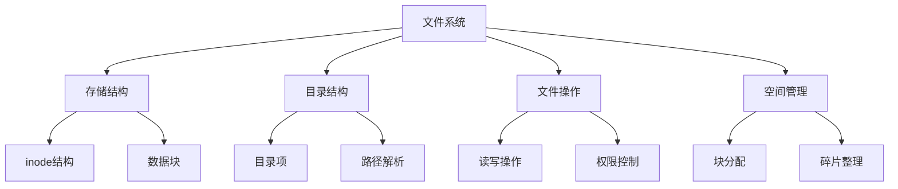

# 文件系统

## 📖 核心概念

**文件系统**是操作系统的重要组成部分，负责管理存储设备上的文件和目录。通过合理的数据结构设计，可以实现高效的文件存储和访问。

### 🏗️ 文件系统组件



## 🔧 文件系统实现

### inode结构

```cpp
class Inode {
private:
    int inodeId;
    int fileSize;
    int blockCount;
    vector<int> directBlocks;    // 直接块指针
    vector<int> indirectBlocks;   // 间接块指针
    time_t createTime;
    time_t modifyTime;
    time_t accessTime;
    int linkCount;
    int permissions;
    
public:
    Inode(int id) : inodeId(id), fileSize(0), blockCount(0), linkCount(1), permissions(0644) {
        createTime = modifyTime = accessTime = time(nullptr);
    }
    
    void setFileSize(int size) {
        fileSize = size;
        modifyTime = time(nullptr);
    }
    
    int getFileSize() const {
        return fileSize;
    }
    
    void addBlock(int blockId) {
        if (directBlocks.size() < 12) {
            directBlocks.push_back(blockId);
        } else {
            indirectBlocks.push_back(blockId);
        }
        blockCount++;
    }
    
    vector<int> getAllBlocks() const {
        vector<int> allBlocks = directBlocks;
        allBlocks.insert(allBlocks.end(), indirectBlocks.begin(), indirectBlocks.end());
        return allBlocks;
    }
    
    void updateAccessTime() {
        accessTime = time(nullptr);
    }
    
    void updateModifyTime() {
        modifyTime = time(nullptr);
    }
    
    void display() const {
        cout << "Inode " << inodeId << ":" << endl;
        cout << "  Size: " << fileSize << " bytes" << endl;
        cout << "  Blocks: " << blockCount << endl;
        cout << "  Direct blocks: " << directBlocks.size() << endl;
        cout << "  Indirect blocks: " << indirectBlocks.size() << endl;
        cout << "  Created: " << ctime(&createTime);
        cout << "  Modified: " << ctime(&modifyTime);
        cout << "  Accessed: " << ctime(&accessTime);
    }
};
```

### 目录结构

```cpp
class Directory {
private:
    struct DirectoryEntry {
        string name;
        int inodeId;
        int entryType;  // 0: file, 1: directory
        
        DirectoryEntry(const string& n, int id, int type) 
            : name(n), inodeId(id), entryType(type) {}
    };
    
    int inodeId;
    vector<DirectoryEntry> entries;
    
public:
    Directory(int id) : inodeId(id) {}
    
    void addEntry(const string& name, int inodeId, int type) {
        entries.push_back(DirectoryEntry(name, inodeId, type));
    }
    
    bool removeEntry(const string& name) {
        for (auto it = entries.begin(); it != entries.end(); ++it) {
            if (it->name == name) {
                entries.erase(it);
                return true;
            }
        }
        return false;
    }
    
    int findInode(const string& name) {
        for (const auto& entry : entries) {
            if (entry.name == name) {
                return entry.inodeId;
            }
        }
        return -1;
    }
    
    vector<string> listEntries() {
        vector<string> names;
        for (const auto& entry : entries) {
            names.push_back(entry.name);
        }
        return names;
    }
    
    void display() {
        cout << "Directory contents:" << endl;
        for (const auto& entry : entries) {
            cout << "  " << (entry.entryType == 1 ? "[DIR]" : "[FILE]") 
                 << " " << entry.name << " (inode: " << entry.inodeId << ")" << endl;
        }
    }
};
```

### 文件系统核心

```cpp
class FileSystem {
private:
    map<int, Inode*> inodes;
    map<int, Directory*> directories;
    map<int, vector<char>> dataBlocks;
    set<int> freeBlocks;
    set<int> freeInodes;
    int blockSize;
    int totalBlocks;
    int nextInodeId;
    
    int allocateInode() {
        if (freeInodes.empty()) {
            return -1;
        }
        
        int inodeId = *freeInodes.begin();
        freeInodes.erase(freeInodes.begin());
        
        inodes[inodeId] = new Inode(inodeId);
        return inodeId;
    }
    
    void freeInode(int inodeId) {
        freeInodes.insert(inodeId);
        delete inodes[inodeId];
        inodes.erase(inodeId);
    }
    
    int allocateBlock() {
        if (freeBlocks.empty()) {
            return -1;
        }
        
        int blockId = *freeBlocks.begin();
        freeBlocks.erase(freeBlocks.begin());
        
        dataBlocks[blockId] = vector<char>(blockSize, 0);
        return blockId;
    }
    
    void freeBlock(int blockId) {
        freeBlocks.insert(blockId);
        dataBlocks.erase(blockId);
    }
    
public:
    FileSystem(int totalBlocks = 1000, int blockSize = 4096) 
        : blockSize(blockSize), totalBlocks(totalBlocks), nextInodeId(1) {
        
        // 初始化空闲块
        for (int i = 0; i < totalBlocks; ++i) {
            freeBlocks.insert(i);
        }
        
        // 初始化空闲inode
        for (int i = 1; i < 100; ++i) {
            freeInodes.insert(i);
        }
        
        // 创建根目录
        createDirectory("/", 0);
    }
    
    ~FileSystem() {
        for (auto& pair : inodes) {
            delete pair.second;
        }
        for (auto& pair : directories) {
            delete pair.second;
        }
    }
    
    int createFile(const string& path, const string& content) {
        int inodeId = allocateInode();
        if (inodeId == -1) {
            cout << "No free inodes available" << endl;
            return -1;
        }
        
        Inode* inode = inodes[inodeId];
        
        // 分配数据块
        int contentSize = content.size();
        int blocksNeeded = (contentSize + blockSize - 1) / blockSize;
        
        for (int i = 0; i < blocksNeeded; ++i) {
            int blockId = allocateBlock();
            if (blockId == -1) {
                cout << "No free blocks available" << endl;
                freeInode(inodeId);
                return -1;
            }
            
            inode->addBlock(blockId);
            
            // 写入数据
            int startPos = i * blockSize;
            int endPos = min(startPos + blockSize, contentSize);
            
            for (int j = startPos; j < endPos; ++j) {
                dataBlocks[blockId][j - startPos] = content[j];
            }
        }
        
        inode->setFileSize(contentSize);
        
        // 添加到父目录
        addToDirectory(path, inodeId, 0);
        
        cout << "Created file: " << path << " (inode: " << inodeId << ")" << endl;
        return inodeId;
    }
    
    string readFile(const string& path) {
        int inodeId = findInode(path);
        if (inodeId == -1) {
            cout << "File not found: " << path << endl;
            return "";
        }
        
        Inode* inode = inodes[inodeId];
        inode->updateAccessTime();
        
        string content;
        vector<int> blocks = inode->getAllBlocks();
        
        for (int blockId : blocks) {
            auto it = dataBlocks.find(blockId);
            if (it != dataBlocks.end()) {
                content.append(it->second.begin(), it->second.end());
            }
        }
        
        return content.substr(0, inode->getFileSize());
    }
    
    bool writeFile(const string& path, const string& content) {
        int inodeId = findInode(path);
        if (inodeId == -1) {
            cout << "File not found: " << path << endl;
            return false;
        }
        
        Inode* inode = inodes[inodeId];
        
        // 释放旧块
        vector<int> oldBlocks = inode->getAllBlocks();
        for (int blockId : oldBlocks) {
            freeBlock(blockId);
        }
        
        // 分配新块
        int contentSize = content.size();
        int blocksNeeded = (contentSize + blockSize - 1) / blockSize;
        
        for (int i = 0; i < blocksNeeded; ++i) {
            int blockId = allocateBlock();
            if (blockId == -1) {
                cout << "No free blocks available" << endl;
                return false;
            }
            
            inode->addBlock(blockId);
            
            // 写入数据
            int startPos = i * blockSize;
            int endPos = min(startPos + blockSize, contentSize);
            
            for (int j = startPos; j < endPos; ++j) {
                dataBlocks[blockId][j - startPos] = content[j];
            }
        }
        
        inode->setFileSize(contentSize);
        inode->updateModifyTime();
        
        cout << "Updated file: " << path << endl;
        return true;
    }
    
    bool deleteFile(const string& path) {
        int inodeId = findInode(path);
        if (inodeId == -1) {
            cout << "File not found: " << path << endl;
            return false;
        }
        
        Inode* inode = inodes[inodeId];
        
        // 释放数据块
        vector<int> blocks = inode->getAllBlocks();
        for (int blockId : blocks) {
            freeBlock(blockId);
        }
        
        // 从目录中删除
        removeFromDirectory(path);
        
        // 释放inode
        freeInode(inodeId);
        
        cout << "Deleted file: " << path << endl;
        return true;
    }
    
    int createDirectory(const string& path, int parentInode) {
        int inodeId = allocateInode();
        if (inodeId == -1) {
            cout << "No free inodes available" << endl;
            return -1;
        }
        
        directories[inodeId] = new Directory(inodeId);
        
        // 添加到父目录
        if (parentInode != -1) {
            addToDirectory(path, inodeId, 1);
        }
        
        cout << "Created directory: " << path << " (inode: " << inodeId << ")" << endl;
        return inodeId;
    }
    
    void listDirectory(const string& path) {
        int inodeId = findInode(path);
        if (inodeId == -1) {
            cout << "Directory not found: " << path << endl;
            return;
        }
        
        auto it = directories.find(inodeId);
        if (it != directories.end()) {
            it->second->display();
        } else {
            cout << "Not a directory: " << path << endl;
        }
    }
    
private:
    int findInode(const string& path) {
        // 简化的路径解析
        if (path == "/") {
            return 0;  // 根目录
        }
        
        auto it = directories.find(0);  // 根目录
        if (it != directories.end()) {
            return it->second->findInode(path.substr(1));  // 去掉开头的'/'
        }
        
        return -1;
    }
    
    void addToDirectory(const string& path, int inodeId, int type) {
        auto it = directories.find(0);  // 根目录
        if (it != directories.end()) {
            string name = path.substr(1);  // 去掉开头的'/'
            it->second->addEntry(name, inodeId, type);
        }
    }
    
    void removeFromDirectory(const string& path) {
        auto it = directories.find(0);  // 根目录
        if (it != directories.end()) {
            string name = path.substr(1);  // 去掉开头的'/'
            it->second->removeEntry(name);
        }
    }
};
```

## 🎮 文件系统应用

### 1. 文件系统测试

```cpp
class FileSystemTest {
public:
    static void testFileOperations(FileSystem& fs) {
        cout << "Testing file operations..." << endl;
        
        // 创建文件
        fs.createFile("/test.txt", "Hello, World!");
        fs.createFile("/data.txt", "This is test data");
        
        // 读取文件
        string content1 = fs.readFile("/test.txt");
        cout << "Content of test.txt: " << content1 << endl;
        
        string content2 = fs.readFile("/data.txt");
        cout << "Content of data.txt: " << content2 << endl;
        
        // 更新文件
        fs.writeFile("/test.txt", "Updated content");
        string updatedContent = fs.readFile("/test.txt");
        cout << "Updated content: " << updatedContent << endl;
        
        // 列出目录
        cout << "Directory listing:" << endl;
        fs.listDirectory("/");
        
        // 删除文件
        fs.deleteFile("/data.txt");
        cout << "After deletion:" << endl;
        fs.listDirectory("/");
    }
    
    static void testDirectoryOperations(FileSystem& fs) {
        cout << "Testing directory operations..." << endl;
        
        // 创建目录
        fs.createDirectory("/documents", 0);
        fs.createDirectory("/images", 0);
        
        // 在目录中创建文件
        fs.createFile("/documents/readme.txt", "Documentation");
        fs.createFile("/images/logo.png", "Image data");
        
        // 列出根目录
        cout << "Root directory:" << endl;
        fs.listDirectory("/");
        
        // 列出子目录
        cout << "Documents directory:" << endl;
        fs.listDirectory("/documents");
        
        cout << "Images directory:" << endl;
        fs.listDirectory("/images");
    }
    
    static void testPerformance(FileSystem& fs, int fileCount) {
        cout << "Testing performance with " << fileCount << " files..." << endl;
        
        auto start = chrono::high_resolution_clock::now();
        
        // 创建文件
        for (int i = 0; i < fileCount; ++i) {
            string filename = "/file" + to_string(i) + ".txt";
            string content = "Content of file " + to_string(i);
            fs.createFile(filename, content);
        }
        
        auto end = chrono::high_resolution_clock::now();
        auto duration = chrono::duration_cast<chrono::milliseconds>(end - start);
        
        cout << "Created " << fileCount << " files in " << duration.count() << " ms" << endl;
        cout << "Files per second: " << (fileCount * 1000.0) / duration.count() << endl;
        
        // 测试读取性能
        start = chrono::high_resolution_clock::now();
        
        for (int i = 0; i < fileCount; ++i) {
            string filename = "/file" + to_string(i) + ".txt";
            fs.readFile(filename);
        }
        
        end = chrono::high_resolution_clock::now();
        duration = chrono::duration_cast<chrono::milliseconds>(end - start);
        
        cout << "Read " << fileCount << " files in " << duration.count() << " ms" << endl;
        cout << "Reads per second: " << (fileCount * 1000.0) / duration.count() << endl;
    }
};
```

### 2. 文件系统统计

```cpp
class FileSystemStats {
public:
    static void displayStats(FileSystem& fs) {
        cout << "File System Statistics:" << endl;
        cout << "======================" << endl;
        
        // 统计inode使用情况
        int totalInodes = 100;  // 假设总inode数
        int usedInodes = fs.inodes.size();
        int freeInodes = totalInodes - usedInodes;
        
        cout << "Inode usage:" << endl;
        cout << "  Total: " << totalInodes << endl;
        cout << "  Used: " << usedInodes << endl;
        cout << "  Free: " << freeInodes << endl;
        cout << "  Usage: " << (usedInodes * 100.0 / totalInodes) << "%" << endl;
        
        // 统计块使用情况
        int totalBlocks = 1000;  // 假设总块数
        int usedBlocks = fs.dataBlocks.size();
        int freeBlocks = fs.freeBlocks.size();
        
        cout << "Block usage:" << endl;
        cout << "  Total: " << totalBlocks << endl;
        cout << "  Used: " << usedBlocks << endl;
        cout << "  Free: " << freeBlocks << endl;
        cout << "  Usage: " << (usedBlocks * 100.0 / totalBlocks) << "%" << endl;
        
        // 统计文件类型
        int fileCount = 0;
        int dirCount = 0;
        
        for (const auto& pair : fs.directories) {
            dirCount++;
        }
        
        fileCount = usedInodes - dirCount;
        
        cout << "File types:" << endl;
        cout << "  Files: " << fileCount << endl;
        cout << "  Directories: " << dirCount << endl;
    }
};
```

## 🔗 相关链接

- [[01-数据库王国|数据库王国]]
- [[03-缓存系统|缓存系统]]
- [[04-网络应用|网络应用]]

## 💡 文件系统要点

1. **inode结构**：文件元数据的管理
2. **目录结构**：文件组织的层次结构
3. **块管理**：数据存储的空间管理
4. **性能优化**：缓存和预读机制

---

*📝 系统提示：文件系统是操作系统的重要组成部分，掌握文件系统原理对系统编程很重要*
