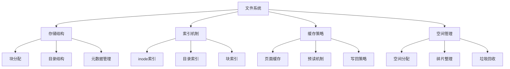

# 文件系统优化

## 📖 核心概念

**文件系统优化**是提高存储性能的关键技术。通过合理的数据结构设计和算法优化，可以显著提升文件系统的读写效率和存储利用率。

### 🏗️ 文件系统组件



## 🔧 文件系统实现

### 基础文件系统

```cpp
class FileSystem {
private:
    struct Inode {
        int inodeId;
        int fileSize;
        int blockCount;
        vector<int> directBlocks;    // 直接块
        vector<int> indirectBlocks;   // 间接块
        time_t createTime;
        time_t modifyTime;
        int linkCount;
        
        Inode(int id) : inodeId(id), fileSize(0), blockCount(0), linkCount(1) {
            createTime = modifyTime = time(nullptr);
        }
    };
    
    struct DirectoryEntry {
        string name;
        int inodeId;
        
        DirectoryEntry(const string& n, int id) : name(n), inodeId(id) {}
    };
    
    map<int, Inode> inodes;
    map<int, vector<DirectoryEntry>> directories;
    map<int, vector<char>> dataBlocks;
    set<int> freeBlocks;
    set<int> freeInodes;
    int blockSize;
    int totalBlocks;
    
public:
    FileSystem(int totalBlocks = 1000, int blockSize = 4096) 
        : totalBlocks(totalBlocks), blockSize(blockSize) {
        // 初始化空闲块
        for (int i = 0; i < totalBlocks; ++i) {
            freeBlocks.insert(i);
        }
        
        // 初始化空闲inode
        for (int i = 1; i < 100; ++i) {
            freeInodes.insert(i);
        }
        
        // 创建根目录
        createDirectory("/", 0);
    }
    
    // 创建文件
    int createFile(const string& path, const string& content) {
        int inodeId = allocateInode();
        Inode& inode = inodes[inodeId];
        
        // 分配数据块
        allocateBlocks(inode, content.size());
        
        // 写入数据
        writeData(inode, content);
        
        // 添加到目录
        addToDirectory(path, inodeId);
        
        return inodeId;
    }
    
    // 读取文件
    string readFile(const string& path) {
        int inodeId = findInode(path);
        if (inodeId == -1) return "";
        
        Inode& inode = inodes[inodeId];
        return readData(inode);
    }
    
    // 写入文件
    bool writeFile(const string& path, const string& content) {
        int inodeId = findInode(path);
        if (inodeId == -1) return false;
        
        Inode& inode = inodes[inodeId];
        
        // 释放旧块
        freeBlocks(inode);
        
        // 分配新块
        allocateBlocks(inode, content.size());
        
        // 写入数据
        writeData(inode, content);
        
        inode.modifyTime = time(nullptr);
        return true;
    }
    
    // 删除文件
    bool deleteFile(const string& path) {
        int inodeId = findInode(path);
        if (inodeId == -1) return false;
        
        Inode& inode = inodes[inodeId];
        
        // 释放数据块
        freeBlocks(inode);
        
        // 从目录中删除
        removeFromDirectory(path);
        
        // 释放inode
        freeInodes.insert(inodeId);
        inodes.erase(inodeId);
        
        return true;
    }
    
private:
    int allocateInode() {
        if (freeInodes.empty()) return -1;
        
        int inodeId = *freeInodes.begin();
        freeInodes.erase(freeInodes.begin());
        
        inodes[inodeId] = Inode(inodeId);
        return inodeId;
    }
    
    void allocateBlocks(Inode& inode, int size) {
        int blocksNeeded = (size + blockSize - 1) / blockSize;
        
        for (int i = 0; i < blocksNeeded; ++i) {
            if (freeBlocks.empty()) break;
            
            int blockId = *freeBlocks.begin();
            freeBlocks.erase(freeBlocks.begin());
            
            inode.directBlocks.push_back(blockId);
            inode.blockCount++;
        }
        
        inode.fileSize = size;
    }
    
    void writeData(Inode& inode, const string& content) {
        int offset = 0;
        
        for (int blockId : inode.directBlocks) {
            int writeSize = min(blockSize, (int)content.size() - offset);
            
            dataBlocks[blockId].assign(content.begin() + offset, 
                                     content.begin() + offset + writeSize);
            offset += writeSize;
        }
    }
    
    string readData(const Inode& inode) {
        string content;
        
        for (int blockId : inode.directBlocks) {
            auto it = dataBlocks.find(blockId);
            if (it != dataBlocks.end()) {
                content.append(it->second.begin(), it->second.end());
            }
        }
        
        return content.substr(0, inode.fileSize);
    }
    
    void freeBlocks(Inode& inode) {
        for (int blockId : inode.directBlocks) {
            freeBlocks.insert(blockId);
            dataBlocks.erase(blockId);
        }
        
        inode.directBlocks.clear();
        inode.blockCount = 0;
        inode.fileSize = 0;
    }
    
    int findInode(const string& path) {
        // 简化的路径解析
        auto it = directories.find(0);  // 根目录
        if (it != directories.end()) {
            for (const auto& entry : it->second) {
                if (entry.name == path) {
                    return entry.inodeId;
                }
            }
        }
        return -1;
    }
    
    void addToDirectory(const string& path, int inodeId) {
        directories[0].push_back(DirectoryEntry(path, inodeId));
    }
    
    void removeFromDirectory(const string& path) {
        auto& entries = directories[0];
        entries.erase(remove_if(entries.begin(), entries.end(),
                               [&path](const DirectoryEntry& entry) {
                                   return entry.name == path;
                               }), entries.end());
    }
    
    int createDirectory(const string& path, int parentInode) {
        int inodeId = allocateInode();
        directories[inodeId] = vector<DirectoryEntry>();
        return inodeId;
    }
};
```

## 🎯 缓存优化

### 页面缓存系统

```cpp
class PageCache {
private:
    struct CachePage {
        int blockId;
        vector<char> data;
        bool dirty;
        time_t lastAccess;
        
        CachePage(int id) : blockId(id), dirty(false) {
            lastAccess = time(nullptr);
        }
    };
    
    map<int, CachePage> cache;
    int maxCacheSize;
    int hitCount;
    int missCount;
    
public:
    PageCache(int maxSize = 100) : maxCacheSize(maxSize), hitCount(0), missCount(0) {}
    
    // 读取页面
    vector<char> readPage(int blockId) {
        auto it = cache.find(blockId);
        
        if (it != cache.end()) {
            // 缓存命中
            it->second.lastAccess = time(nullptr);
            hitCount++;
            return it->second.data;
        } else {
            // 缓存未命中
            missCount++;
            
            // 从磁盘读取
            vector<char> data = readFromDisk(blockId);
            
            // 添加到缓存
            addToCache(blockId, data);
            
            return data;
        }
    }
    
    // 写入页面
    void writePage(int blockId, const vector<char>& data) {
        auto it = cache.find(blockId);
        
        if (it != cache.end()) {
            // 更新缓存
            it->second.data = data;
            it->second.dirty = true;
            it->second.lastAccess = time(nullptr);
        } else {
            // 添加到缓存
            addToCache(blockId, data);
            cache[blockId].dirty = true;
        }
    }
    
    // 刷新缓存
    void flushCache() {
        for (auto& pair : cache) {
            if (pair.second.dirty) {
                writeToDisk(pair.first, pair.second.data);
                pair.second.dirty = false;
            }
        }
    }
    
    // 获取缓存统计
    void getCacheStats() const {
        cout << "Cache Statistics:" << endl;
        cout << "Hit count: " << hitCount << endl;
        cout << "Miss count: " << missCount << endl;
        cout << "Hit rate: " << (double)hitCount / (hitCount + missCount) * 100 << "%" << endl;
        cout << "Cache size: " << cache.size() << "/" << maxCacheSize << endl;
    }
    
private:
    void addToCache(int blockId, const vector<char>& data) {
        // 如果缓存已满，使用LRU策略
        if (cache.size() >= maxCacheSize) {
            evictLRU();
        }
        
        cache[blockId] = CachePage(blockId);
        cache[blockId].data = data;
    }
    
    void evictLRU() {
        auto oldest = cache.begin();
        
        for (auto it = cache.begin(); it != cache.end(); ++it) {
            if (it->second.lastAccess < oldest->second.lastAccess) {
                oldest = it;
            }
        }
        
        // 如果页面被修改，写回磁盘
        if (oldest->second.dirty) {
            writeToDisk(oldest->first, oldest->second.data);
        }
        
        cache.erase(oldest);
    }
    
    vector<char> readFromDisk(int blockId) {
        // 模拟从磁盘读取
        vector<char> data(4096, 'A' + blockId % 26);
        return data;
    }
    
    void writeToDisk(int blockId, const vector<char>& data) {
        // 模拟写入磁盘
        cout << "Writing block " << blockId << " to disk" << endl;
    }
};
```

## 🔗 相关链接

- [[02-存储空间管理|存储空间管理]]
- [[03-文件系统性能调优|性能调优]]
- [[04-分布式文件系统|分布式文件系统]]

## 💡 文件系统要点

1. **inode设计**：高效的文件元数据管理
2. **块分配**：减少碎片，提高空间利用率
3. **缓存机制**：减少磁盘I/O，提高性能
4. **目录结构**：支持快速文件查找

---

*📝 优化提示：文件系统优化需要平衡性能、可靠性和存储效率*
