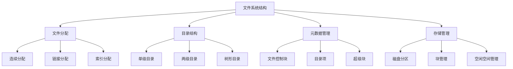

# 文件系统结构

## 📖 核心概念

**文件系统结构**是操作系统管理文件和目录的底层机制。它定义了数据在存储设备上的组织方式，包括文件分配、目录结构、元数据管理等核心功能。

### 🏗️ 文件系统结构分类



## 🔧 文件系统结构实现

### 文件分配策略

```cpp
class FileAllocationStrategy {
private:
    struct FileBlock {
        int blockId;
        bool isAllocated;
        int nextBlockId;
        
        FileBlock(int id) : blockId(id), isAllocated(false), nextBlockId(-1) {}
    };
    
    vector<FileBlock> diskBlocks;
    int totalBlocks;
    
public:
    FileAllocationStrategy(int blocks = 1000) : totalBlocks(blocks) {
        diskBlocks.resize(totalBlocks);
        for (int i = 0; i < totalBlocks; i++) {
            diskBlocks[i] = FileBlock(i);
        }
    }
    
    // 连续分配
    vector<int> contiguousAllocation(int fileSize) {
        vector<int> allocatedBlocks;
        
        for (int i = 0; i < totalBlocks - fileSize + 1; i++) {
            bool canAllocate = true;
            
            // 检查是否有足够的连续空闲块
            for (int j = i; j < i + fileSize; j++) {
                if (diskBlocks[j].isAllocated) {
                    canAllocate = false;
                    break;
                }
            }
            
            if (canAllocate) {
                // 分配连续块
                for (int j = i; j < i + fileSize; j++) {
                    diskBlocks[j].isAllocated = true;
                    allocatedBlocks.push_back(j);
                }
                
                cout << "Contiguous allocation: " << fileSize << " blocks starting from " << i << endl;
                return allocatedBlocks;
            }
        }
        
        cout << "Contiguous allocation failed: not enough contiguous space" << endl;
        return allocatedBlocks;
    }
    
    // 链接分配
    vector<int> linkedAllocation(int fileSize) {
        vector<int> allocatedBlocks;
        vector<int> freeBlocks = getFreeBlocks();
        
        if (freeBlocks.size() < fileSize) {
            cout << "Linked allocation failed: not enough free blocks" << endl;
            return allocatedBlocks;
        }
        
        // 分配第一个块
        int currentBlock = freeBlocks[0];
        diskBlocks[currentBlock].isAllocated = true;
        allocatedBlocks.push_back(currentBlock);
        
        // 链接后续块
        for (int i = 1; i < fileSize; i++) {
            int nextBlock = freeBlocks[i];
            diskBlocks[nextBlock].isAllocated = true;
            diskBlocks[currentBlock].nextBlockId = nextBlock;
            allocatedBlocks.push_back(nextBlock);
            currentBlock = nextBlock;
        }
        
        cout << "Linked allocation: " << fileSize << " blocks linked" << endl;
        return allocatedBlocks;
    }
    
    // 索引分配
    vector<int> indexedAllocation(int fileSize) {
        vector<int> allocatedBlocks;
        vector<int> freeBlocks = getFreeBlocks();
        
        if (freeBlocks.size() < fileSize + 1) { // +1 for index block
            cout << "Indexed allocation failed: not enough free blocks" << endl;
            return allocatedBlocks;
        }
        
        // 分配索引块
        int indexBlock = freeBlocks[0];
        diskBlocks[indexBlock].isAllocated = true;
        allocatedBlocks.push_back(indexBlock);
        
        // 分配数据块
        for (int i = 1; i <= fileSize; i++) {
            int dataBlock = freeBlocks[i];
            diskBlocks[dataBlock].isAllocated = true;
            allocatedBlocks.push_back(dataBlock);
        }
        
        cout << "Indexed allocation: 1 index block + " << fileSize << " data blocks" << endl;
        return allocatedBlocks;
    }
    
    // 获取空闲块
    vector<int> getFreeBlocks() {
        vector<int> freeBlocks;
        
        for (int i = 0; i < totalBlocks; i++) {
            if (!diskBlocks[i].isAllocated) {
                freeBlocks.push_back(i);
            }
        }
        
        return freeBlocks;
    }
    
    // 释放文件块
    void deallocateFile(const vector<int>& blocks) {
        for (int blockId : blocks) {
            if (blockId >= 0 && blockId < totalBlocks) {
                diskBlocks[blockId].isAllocated = false;
                diskBlocks[blockId].nextBlockId = -1;
            }
        }
        
        cout << "Deallocated " << blocks.size() << " blocks" << endl;
    }
    
    // 显示磁盘使用情况
    void displayDiskUsage() {
        cout << "Disk Usage:" << endl;
        cout << "==========" << endl;
        
        int allocatedBlocks = 0;
        int freeBlocks = 0;
        
        for (const FileBlock& block : diskBlocks) {
            if (block.isAllocated) {
                allocatedBlocks++;
            } else {
                freeBlocks++;
            }
        }
        
        cout << "Total blocks: " << totalBlocks << endl;
        cout << "Allocated blocks: " << allocatedBlocks << endl;
        cout << "Free blocks: " << freeBlocks << endl;
        cout << "Usage percentage: " << (double)allocatedBlocks / totalBlocks * 100 << "%" << endl;
    }
};
```

### 目录结构管理

```cpp
class DirectoryStructure {
private:
    struct DirectoryEntry {
        string fileName;
        int fileSize;
        vector<int> blockList;
        chrono::time_point<chrono::high_resolution_clock> createTime;
        chrono::time_point<chrono::high_resolution_clock> modifyTime;
        
        DirectoryEntry(const string& name, int size) : fileName(name), fileSize(size) {
            createTime = chrono::high_resolution_clock::now();
            modifyTime = createTime;
        }
    };
    
    struct Directory {
        string dirName;
        map<string, DirectoryEntry> files;
        map<string, Directory*> subdirectories;
        Directory* parent;
        
        Directory(const string& name, Directory* p = nullptr) : dirName(name), parent(p) {}
    };
    
    Directory* root;
    Directory* currentDir;
    
public:
    DirectoryStructure() {
        root = new Directory("/");
        currentDir = root;
    }
    
    // 创建目录
    bool createDirectory(const string& dirName) {
        if (currentDir->subdirectories.find(dirName) != currentDir->subdirectories.end()) {
            cout << "Directory " << dirName << " already exists" << endl;
            return false;
        }
        
        Directory* newDir = new Directory(dirName, currentDir);
        currentDir->subdirectories[dirName] = newDir;
        
        cout << "Created directory: " << dirName << endl;
        return true;
    }
    
    // 创建文件
    bool createFile(const string& fileName, int fileSize) {
        if (currentDir->files.find(fileName) != currentDir->files.end()) {
            cout << "File " << fileName << " already exists" << endl;
            return false;
        }
        
        DirectoryEntry file(fileName, fileSize);
        currentDir->files[fileName] = file;
        
        cout << "Created file: " << fileName << " (size: " << fileSize << ")" << endl;
        return true;
    }
    
    // 删除文件
    bool deleteFile(const string& fileName) {
        auto it = currentDir->files.find(fileName);
        if (it == currentDir->files.end()) {
            cout << "File " << fileName << " not found" << endl;
            return false;
        }
        
        currentDir->files.erase(it);
        cout << "Deleted file: " << fileName << endl;
        return true;
    }
    
    // 删除目录
    bool deleteDirectory(const string& dirName) {
        auto it = currentDir->subdirectories.find(dirName);
        if (it == currentDir->subdirectories.end()) {
            cout << "Directory " << dirName << " not found" << endl;
            return false;
        }
        
        Directory* dir = it->second;
        
        // 检查目录是否为空
        if (!dir->files.empty() || !dir->subdirectories.empty()) {
            cout << "Directory " << dirName << " is not empty" << endl;
            return false;
        }
        
        currentDir->subdirectories.erase(it);
        delete dir;
        
        cout << "Deleted directory: " << dirName << endl;
        return true;
    }
    
    // 改变目录
    bool changeDirectory(const string& dirName) {
        if (dirName == "..") {
            if (currentDir->parent != nullptr) {
                currentDir = currentDir->parent;
                cout << "Changed to parent directory" << endl;
                return true;
            }
        } else if (dirName == "/") {
            currentDir = root;
            cout << "Changed to root directory" << endl;
            return true;
        } else {
            auto it = currentDir->subdirectories.find(dirName);
            if (it != currentDir->subdirectories.end()) {
                currentDir = it->second;
                cout << "Changed to directory: " << dirName << endl;
                return true;
            }
        }
        
        cout << "Directory " << dirName << " not found" << endl;
        return false;
    }
    
    // 列出目录内容
    void listDirectory() {
        cout << "Directory contents:" << endl;
        cout << "=================" << endl;
        
        cout << "Files:" << endl;
        for (const auto& pair : currentDir->files) {
            const DirectoryEntry& file = pair.second;
            cout << "  " << file.fileName << " (size: " << file.fileSize << ")" << endl;
        }
        
        cout << "Directories:" << endl;
        for (const auto& pair : currentDir->subdirectories) {
            cout << "  " << pair.first << "/" << endl;
        }
    }
    
    // 查找文件
    DirectoryEntry* findFile(const string& fileName) {
        return findFileRecursive(root, fileName);
    }
    
    // 递归查找文件
    DirectoryEntry* findFileRecursive(Directory* dir, const string& fileName) {
        // 在当前目录查找
        auto it = dir->files.find(fileName);
        if (it != dir->files.end()) {
            return &it->second;
        }
        
        // 在子目录中查找
        for (const auto& pair : dir->subdirectories) {
            DirectoryEntry* result = findFileRecursive(pair.second, fileName);
            if (result != nullptr) {
                return result;
            }
        }
        
        return nullptr;
    }
    
    // 显示目录树
    void displayDirectoryTree() {
        cout << "Directory Tree:" << endl;
        cout << "=============" << endl;
        displayDirectoryRecursive(root, 0);
    }
    
    // 递归显示目录
    void displayDirectoryRecursive(Directory* dir, int level) {
        for (int i = 0; i < level; i++) {
            cout << "  ";
        }
        cout << dir->dirName << "/" << endl;
        
        // 显示文件
        for (const auto& pair : dir->files) {
            for (int i = 0; i < level + 1; i++) {
                cout << "  ";
            }
            cout << pair.first << endl;
        }
        
        // 显示子目录
        for (const auto& pair : dir->subdirectories) {
            displayDirectoryRecursive(pair.second, level + 1);
        }
    }
};
```

### 元数据管理

```cpp
class MetadataManager {
private:
    struct FileControlBlock {
        string fileName;
        int fileSize;
        string fileType;
        vector<int> blockList;
        chrono::time_point<chrono::high_resolution_clock> createTime;
        chrono::time_point<chrono::high_resolution_clock> modifyTime;
        chrono::time_point<chrono::high_resolution_clock> accessTime;
        int permissions;
        
        FileControlBlock(const string& name, int size, const string& type) 
            : fileName(name), fileSize(size), fileType(type), permissions(644) {
            createTime = chrono::high_resolution_clock::now();
            modifyTime = createTime;
            accessTime = createTime;
        }
    };
    
    struct SuperBlock {
        int totalBlocks;
        int freeBlocks;
        int blockSize;
        string fileSystemType;
        chrono::time_point<chrono::high_resolution_clock> lastMountTime;
        
        SuperBlock(int total, int blockSz) : totalBlocks(total), freeBlocks(total), blockSize(blockSz), fileSystemType("EXT4") {
            lastMountTime = chrono::high_resolution_clock::now();
        }
    };
    
    map<string, FileControlBlock> fileControlBlocks;
    SuperBlock superBlock;
    
public:
    MetadataManager(int totalBlocks = 1000, int blockSize = 4096) : superBlock(totalBlocks, blockSize) {}
    
    // 创建文件控制块
    bool createFileControlBlock(const string& fileName, int fileSize, const string& fileType) {
        if (fileControlBlocks.find(fileName) != fileControlBlocks.end()) {
            cout << "File control block for " << fileName << " already exists" << endl;
            return false;
        }
        
        FileControlBlock fcb(fileName, fileSize, fileType);
        fileControlBlocks[fileName] = fcb;
        
        cout << "Created file control block for " << fileName << endl;
        return true;
    }
    
    // 更新文件大小
    bool updateFileSize(const string& fileName, int newSize) {
        auto it = fileControlBlocks.find(fileName);
        if (it == fileControlBlocks.end()) {
            cout << "File control block for " << fileName << " not found" << endl;
            return false;
        }
        
        it->second.fileSize = newSize;
        it->second.modifyTime = chrono::high_resolution_clock::now();
        
        cout << "Updated file size for " << fileName << " to " << newSize << endl;
        return true;
    }
    
    // 更新访问时间
    void updateAccessTime(const string& fileName) {
        auto it = fileControlBlocks.find(fileName);
        if (it != fileControlBlocks.end()) {
            it->second.accessTime = chrono::high_resolution_clock::now();
        }
    }
    
    // 设置文件权限
    bool setFilePermissions(const string& fileName, int permissions) {
        auto it = fileControlBlocks.find(fileName);
        if (it == fileControlBlocks.end()) {
            cout << "File control block for " << fileName << " not found" << endl;
            return false;
        }
        
        it->second.permissions = permissions;
        cout << "Set permissions for " << fileName << " to " << permissions << endl;
        return true;
    }
    
    // 添加块到文件
    bool addBlockToFile(const string& fileName, int blockId) {
        auto it = fileControlBlocks.find(fileName);
        if (it == fileControlBlocks.end()) {
            cout << "File control block for " << fileName << " not found" << endl;
            return false;
        }
        
        it->second.blockList.push_back(blockId);
        it->second.modifyTime = chrono::high_resolution_clock::now();
        
        cout << "Added block " << blockId << " to file " << fileName << endl;
        return true;
    }
    
    // 获取文件信息
    FileControlBlock* getFileInfo(const string& fileName) {
        auto it = fileControlBlocks.find(fileName);
        if (it != fileControlBlocks.end()) {
            updateAccessTime(fileName);
            return &it->second;
        }
        return nullptr;
    }
    
    // 删除文件控制块
    bool deleteFileControlBlock(const string& fileName) {
        auto it = fileControlBlocks.find(fileName);
        if (it == fileControlBlocks.end()) {
            cout << "File control block for " << fileName << " not found" << endl;
            return false;
        }
        
        fileControlBlocks.erase(it);
        cout << "Deleted file control block for " << fileName << endl;
        return true;
    }
    
    // 显示超级块信息
    void displaySuperBlock() {
        cout << "Super Block Information:" << endl;
        cout << "======================" << endl;
        
        cout << "File system type: " << superBlock.fileSystemType << endl;
        cout << "Total blocks: " << superBlock.totalBlocks << endl;
        cout << "Free blocks: " << superBlock.freeBlocks << endl;
        cout << "Block size: " << superBlock.blockSize << " bytes" << endl;
        cout << "Usage percentage: " << (double)(superBlock.totalBlocks - superBlock.freeBlocks) / superBlock.totalBlocks * 100 << "%" << endl;
    }
    
    // 显示文件控制块统计
    void displayFileControlBlockStats() {
        cout << "File Control Block Statistics:" << endl;
        cout << "============================" << endl;
        
        cout << "Total files: " << fileControlBlocks.size() << endl;
        
        map<string, int> fileTypeCount;
        int totalSize = 0;
        
        for (const auto& pair : fileControlBlocks) {
            const FileControlBlock& fcb = pair.second;
            fileTypeCount[fcb.fileType]++;
            totalSize += fcb.fileSize;
        }
        
        cout << "Total size: " << totalSize << " bytes" << endl;
        cout << "File types:" << endl;
        for (const auto& pair : fileTypeCount) {
            cout << "  " << pair.first << ": " << pair.second << " files" << endl;
        }
    }
};
```

## 🎯 文件系统应用

### 实际应用场景

```cpp
class FileSystemApplications {
public:
    static void demonstrateApplications() {
        cout << "File System Applications:" << endl;
        cout << "=======================" << endl;
        
        cout << "1. 操作系统:" << endl;
        cout << "   - 文件管理" << endl;
        cout << "   - 目录结构" << endl;
        cout << "   - 权限控制" << endl;
        
        cout << "2. 数据库系统:" << endl;
        cout << "   - 数据文件管理" << endl;
        cout << "   - 日志文件" << endl;
        cout << "   - 索引文件" << endl;
        
        cout << "3. 存储系统:" << endl;
        cout << "   - 磁盘管理" << endl;
        cout << "   - 空间分配" << endl;
        cout << "   - 碎片整理" << endl;
        
        cout << "4. 分布式系统:" << endl;
        cout << "   - 分布式文件系统" << endl;
        cout << "   - 数据复制" << endl;
        cout << "   - 一致性保证" << endl;
    }
    
    static void analyzePerformance() {
        cout << "File System Performance Analysis:" << endl;
        cout << "===============================" << endl;
        
        cout << "1. 文件分配策略:" << endl;
        cout << "   - 连续分配: 访问快，但碎片多" << endl;
        cout << "   - 链接分配: 无碎片，但访问慢" << endl;
        cout << "   - 索引分配: 平衡性能和空间" << endl;
        cout << endl;
        
        cout << "2. 目录结构:" << endl;
        cout << "   - 单级目录: 简单但限制多" << endl;
        cout << "   - 树形目录: 灵活且高效" << endl;
        cout << "   - 图结构: 支持链接和共享" << endl;
        cout << endl;
        
        cout << "3. 元数据管理:" << endl;
        cout << "   - 文件控制块: 存储文件信息" << endl;
        cout << "   - 超级块: 存储文件系统信息" << endl;
        cout << "   - 目录项: 存储目录信息" << endl;
    }
    
    static void selectFileSystemType(bool needsHighPerformance, bool needsFlexibility, bool needsReliability) {
        cout << "File System Type Selection:" << endl;
        cout << "=========================" << endl;
        
        cout << "Needs high performance: " << (needsHighPerformance ? "Yes" : "No") << endl;
        cout << "Needs flexibility: " << (needsFlexibility ? "Yes" : "No") << endl;
        cout << "Needs reliability: " << (needsReliability ? "Yes" : "No") << endl;
        
        cout << "Recommendation:" << endl;
        
        if (needsHighPerformance) {
            cout << "Use contiguous allocation with tree directory" << endl;
        } else if (needsFlexibility) {
            cout << "Use indexed allocation with graph directory" << endl;
        } else if (needsReliability) {
            cout << "Use linked allocation with backup mechanisms" << endl;
        } else {
            cout << "Use indexed allocation with tree directory" << endl;
        }
    }
};
```

## 📊 文件系统分析

### 性能分析

```cpp
class FileSystemAnalysis {
public:
    static void analyzePerformance() {
        cout << "File System Performance Analysis:" << endl;
        cout << "===============================" << endl;
        
        cout << "1. 文件分配性能:" << endl;
        cout << "   - 连续分配: O(1) 访问，O(n) 分配" << endl;
        cout << "   - 链接分配: O(n) 访问，O(1) 分配" << endl;
        cout << "   - 索引分配: O(1) 访问，O(1) 分配" << endl;
        
        cout << "2. 目录操作性能:" << endl;
        cout << "   - 查找文件: O(log n)" << endl;
        cout << "   - 创建文件: O(1)" << endl;
        cout << "   - 删除文件: O(1)" << endl;
        
        cout << "3. 元数据操作性能:" << endl;
        cout << "   - 读取元数据: O(1)" << endl;
        cout << "   - 更新元数据: O(1)" << endl;
        cout << "   - 同步元数据: O(n)" << endl;
    }
    
    static void analyzeSpaceComplexity() {
        cout << "File System Space Complexity Analysis:" << endl;
        cout << "====================================" << endl;
        
        cout << "1. 存储开销:" << endl;
        cout << "   - 文件控制块: O(n)" << endl;
        cout << "   - 目录结构: O(n)" << endl;
        cout << "   - 超级块: O(1)" << endl;
        
        cout << "2. 碎片问题:" << endl;
        cout << "   - 连续分配: 外部碎片" << endl;
        cout << "   - 链接分配: 无碎片" << endl;
        cout << "   - 索引分配: 内部碎片" << endl;
        
        cout << "3. 空间利用率:" << endl;
        cout << "   - 连续分配: 低" << endl;
        cout << "   - 链接分配: 高" << endl;
        cout << "   - 索引分配: 中等" << endl;
    }
    
    static void analyzeTimeComplexity() {
        cout << "File System Time Complexity Analysis:" << endl;
        cout << "===================================" << endl;
        
        cout << "1. 文件操作:" << endl;
        cout << "   - 创建文件: O(1)" << endl;
        cout << "   - 读取文件: O(n)" << endl;
        cout << "   - 写入文件: O(n)" << endl;
        cout << "   - 删除文件: O(1)" << endl;
        
        cout << "2. 目录操作:" << endl;
        cout << "   - 创建目录: O(1)" << endl;
        cout << "   - 查找目录: O(log n)" << endl;
        cout << "   - 删除目录: O(n)" << endl;
        
        cout << "3. 系统操作:" << endl;
        cout << "   - 挂载文件系统: O(1)" << endl;
        cout << "   - 卸载文件系统: O(n)" << endl;
        cout << "   - 检查文件系统: O(n)" << endl;
    }
};
```

## 🎮 文件系统测试

### 1. 基础功能测试

```cpp
class FileSystemTest {
public:
    static void testFileAllocation() {
        cout << "Testing File Allocation:" << endl;
        cout << "======================" << endl;
        
        FileAllocationStrategy fas;
        
        // 测试连续分配
        vector<int> contiguous = fas.contiguousAllocation(5);
        cout << "Contiguous allocation result: " << contiguous.size() << " blocks" << endl;
        
        // 测试链接分配
        vector<int> linked = fas.linkedAllocation(3);
        cout << "Linked allocation result: " << linked.size() << " blocks" << endl;
        
        // 测试索引分配
        vector<int> indexed = fas.indexedAllocation(4);
        cout << "Indexed allocation result: " << indexed.size() << " blocks" << endl;
        
        fas.displayDiskUsage();
    }
    
    static void testDirectoryStructure() {
        cout << "Testing Directory Structure:" << endl;
        cout << "==========================" << endl;
        
        DirectoryStructure ds;
        
        // 创建目录和文件
        ds.createDirectory("documents");
        ds.createDirectory("images");
        ds.createFile("readme.txt", 1024);
        ds.createFile("config.ini", 512);
        
        // 改变目录
        ds.changeDirectory("documents");
        ds.createFile("report.pdf", 2048);
        
        // 列出目录内容
        ds.listDirectory();
        
        // 显示目录树
        ds.displayDirectoryTree();
    }
    
    static void testMetadataManager() {
        cout << "Testing Metadata Manager:" << endl;
        cout << "=======================" << endl;
        
        MetadataManager mm;
        
        // 创建文件控制块
        mm.createFileControlBlock("test.txt", 1024, "text");
        mm.createFileControlBlock("image.jpg", 2048, "image");
        
        // 更新文件信息
        mm.updateFileSize("test.txt", 1536);
        mm.setFilePermissions("test.txt", 755);
        mm.addBlockToFile("test.txt", 100);
        
        // 显示统计信息
        mm.displaySuperBlock();
        mm.displayFileControlBlockStats();
    }
    
    static void testApplications() {
        cout << "Testing Applications:" << endl;
        cout << "==================" << endl;
        
        FileSystemApplications::demonstrateApplications();
        FileSystemApplications::analyzePerformance();
        FileSystemApplications::selectFileSystemType(true, false, false);
    }
    
    static void testAnalysis() {
        cout << "Testing Analysis:" << endl;
        cout << "===============" << endl;
        
        FileSystemAnalysis::analyzePerformance();
        FileSystemAnalysis::analyzeSpaceComplexity();
        FileSystemAnalysis::analyzeTimeComplexity();
    }
};
```

## 🔗 相关链接

- [[01-文件系统|文件系统]]
- [[02-磁盘存储优化|磁盘存储优化]]
- [[03-分布式文件系统|分布式文件系统]]

## 💡 文件系统要点

1. **文件分配**: 连续、链接、索引三种策略各有优势
2. **目录结构**: 树形目录提供灵活的文件组织
3. **元数据管理**: 文件控制块存储文件信息
4. **存储管理**: 超级块管理文件系统全局信息

---

*📝 文件系统提示：文件系统是操作系统的基础组件，需要根据应用需求选择合适的分配策略和目录结构*
