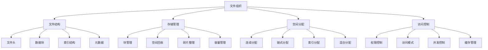

# 文件组织

## 📖 核心概念

**文件组织**是文件系统中数据存储和管理的基础，通过合理的文件结构设计、存储空间管理和数据组织方式，实现高效的文件访问、存储和检索。文件组织直接影响系统的性能、可靠性和可扩展性。

### 🏗️ 文件组织的组成要素



## 🔍 文件组织策略

### 存储分配方式

| 分配方式 | 特点 | 优势 | 劣势 | 适用场景 |
|----------|------|------|------|----------|
| **连续分配** | 文件占用连续块 | 访问速度快 | 碎片问题 | 顺序访问 |
| **链式分配** | 文件占用链表块 | 空间利用率高 | 随机访问慢 | 动态文件 |
| **索引分配** | 文件有索引块 | 随机访问快 | 索引开销 | 随机访问 |
| **混合分配** | 结合多种方式 | 性能平衡 | 实现复杂 | 通用场景 |

### 文件系统类型

| 文件系统 | 特点 | 优势 | 劣势 | 适用场景 |
|----------|------|------|------|----------|
| **FAT32** | 简单结构 | 兼容性好 | 文件大小限制 | 移动存储 |
| **NTFS** | 高级特性 | 功能丰富 | 复杂度高 | Windows系统 |
| **EXT4** | 日志文件系统 | 可靠性高 | Linux专用 | Linux系统 |
| **ZFS** | 高级文件系统 | 数据完整性 | 资源消耗大 | 企业存储 |

## 💻 文件组织实现

### 文件系统管理器

```cpp
// 文件系统管理器
class FileSystemManager {
private:
    struct FileBlock {
        int blockId;
        bool isFree;
        int nextBlockId;
        vector<char> data;
        
        FileBlock(int id, size_t blockSize) 
            : blockId(id), isFree(true), nextBlockId(-1) {
            data.resize(blockSize);
        }
    };
    
    struct FileEntry {
        string fileName;
        int fileSize;
        int firstBlockId;
        int lastBlockId;
        FileType type;
        chrono::system_clock::time_point createdTime;
        chrono::system_clock::time_point modifiedTime;
        FilePermissions permissions;
        
        FileEntry(const string& name, FileType t) 
            : fileName(name), fileSize(0), firstBlockId(-1), lastBlockId(-1), 
              type(t), permissions(FilePermissions::DEFAULT) {
            createdTime = chrono::system_clock::now();
            modifiedTime = createdTime;
        }
    };
    
    enum FileType {
        REGULAR_FILE,
        DIRECTORY,
        SYMBOLIC_LINK
    };
    
    enum FilePermissions {
        READ_ONLY = 1,
        WRITE_ONLY = 2,
        READ_WRITE = 3,
        DEFAULT = READ_WRITE
    };
    
    // 文件系统参数
    size_t blockSize;
    size_t totalBlocks;
    size_t freeBlocks;
    
    // 存储管理
    vector<FileBlock> blocks;
    map<string, FileEntry> fileTable;
    map<int, int> freeBlockList;
    
    // 目录结构
    struct Directory {
        string name;
        map<string, FileEntry> files;
        map<string, Directory*> subdirectories;
        Directory* parent;
        
        Directory(const string& n, Directory* p = nullptr) 
            : name(n), parent(p) {}
    };
    
    Directory* rootDirectory;
    Directory* currentDirectory;
    
public:
    FileSystemManager(size_t totalBlocks, size_t blockSize) 
        : totalBlocks(totalBlocks), blockSize(blockSize), freeBlocks(totalBlocks) {
        initializeBlocks();
        initializeDirectories();
    }
    
    ~FileSystemManager() {
        cleanup();
    }
    
private:
    // 初始化块
    void initializeBlocks() {
        blocks.reserve(totalBlocks);
        for (size_t i = 0; i < totalBlocks; i++) {
            blocks.emplace_back(i, blockSize);
            freeBlockList[i] = i;
        }
    }
    
    // 初始化目录
    void initializeDirectories() {
        rootDirectory = new Directory("/");
        currentDirectory = rootDirectory;
    }
    
    // 清理资源
    void cleanup() {
        delete rootDirectory;
    }
    
public:
    // 创建文件
    bool createFile(const string& fileName, const string& content = "") {
        if (fileTable.find(fileName) != fileTable.end()) {
            return false; // 文件已存在
        }
        
        FileEntry fileEntry(fileName, REGULAR_FILE);
        
        if (!content.empty()) {
            if (!writeFileContent(fileEntry, content)) {
                return false;
            }
        }
        
        fileTable[fileName] = fileEntry;
        currentDirectory->files[fileName] = fileEntry;
        
        cout << "File " << fileName << " created successfully" << endl;
        return true;
    }
    
    // 删除文件
    bool deleteFile(const string& fileName) {
        auto it = fileTable.find(fileName);
        if (it == fileTable.end()) {
            return false; // 文件不存在
        }
        
        FileEntry& fileEntry = it->second;
        
        // 释放文件块
        releaseFileBlocks(fileEntry);
        
        // 从文件表中删除
        fileTable.erase(it);
        currentDirectory->files.erase(fileName);
        
        cout << "File " << fileName << " deleted successfully" << endl;
        return true;
    }
    
    // 读取文件
    string readFile(const string& fileName) {
        auto it = fileTable.find(fileName);
        if (it == fileTable.end()) {
            return ""; // 文件不存在
        }
        
        FileEntry& fileEntry = it->second;
        return readFileContent(fileEntry);
    }
    
    // 写入文件
    bool writeFile(const string& fileName, const string& content) {
        auto it = fileTable.find(fileName);
        if (it == fileTable.end()) {
            return false; // 文件不存在
        }
        
        FileEntry& fileEntry = it->second;
        
        // 释放原有块
        releaseFileBlocks(fileEntry);
        
        // 写入新内容
        if (!writeFileContent(fileEntry, content)) {
            return false;
        }
        
        fileEntry.modifiedTime = chrono::system_clock::now();
        
        cout << "File " << fileName << " written successfully" << endl;
        return true;
    }
    
    // 创建目录
    bool createDirectory(const string& dirName) {
        if (currentDirectory->subdirectories.find(dirName) != currentDirectory->subdirectories.end()) {
            return false; // 目录已存在
        }
        
        Directory* newDir = new Directory(dirName, currentDirectory);
        currentDirectory->subdirectories[dirName] = newDir;
        
        cout << "Directory " << dirName << " created successfully" << endl;
        return true;
    }
    
    // 删除目录
    bool deleteDirectory(const string& dirName) {
        auto it = currentDirectory->subdirectories.find(dirName);
        if (it == currentDirectory->subdirectories.end()) {
            return false; // 目录不存在
        }
        
        Directory* dir = it->second;
        
        // 检查目录是否为空
        if (!dir->files.empty() || !dir->subdirectories.empty()) {
            return false; // 目录不为空
        }
        
        // 删除目录
        currentDirectory->subdirectories.erase(it);
        delete dir;
        
        cout << "Directory " << dirName << " deleted successfully" << endl;
        return true;
    }
    
    // 改变当前目录
    bool changeDirectory(const string& dirName) {
        if (dirName == "..") {
            if (currentDirectory->parent != nullptr) {
                currentDirectory = currentDirectory->parent;
                return true;
            }
            return false;
        }
        
        if (dirName == "/") {
            currentDirectory = rootDirectory;
            return true;
        }
        
        auto it = currentDirectory->subdirectories.find(dirName);
        if (it != currentDirectory->subdirectories.end()) {
            currentDirectory = it->second;
            return true;
        }
        
        return false;
    }
    
    // 列出目录内容
    vector<string> listDirectory() {
        vector<string> contents;
        
        // 列出文件
        for (const auto& [name, file] : currentDirectory->files) {
            contents.push_back("[FILE] " + name);
        }
        
        // 列出子目录
        for (const auto& [name, dir] : currentDirectory->subdirectories) {
            contents.push_back("[DIR] " + name);
        }
        
        return contents;
    }
    
    // 获取当前路径
    string getCurrentPath() {
        vector<string> pathComponents;
        Directory* current = currentDirectory;
        
        while (current != nullptr) {
            pathComponents.push_back(current->name);
            current = current->parent;
        }
        
        reverse(pathComponents.begin(), pathComponents.end());
        
        string path = "";
        for (const string& component : pathComponents) {
            path += component;
            if (component != "/") {
                path += "/";
            }
        }
        
        return path;
    }
    
private:
    // 写入文件内容
    bool writeFileContent(FileEntry& fileEntry, const string& content) {
        if (content.empty()) {
            return true;
        }
        
        size_t contentSize = content.size();
        size_t blocksNeeded = (contentSize + blockSize - 1) / blockSize;
        
        if (blocksNeeded > freeBlocks) {
            return false; // 空间不足
        }
        
        // 分配块
        vector<int> allocatedBlocks;
        for (size_t i = 0; i < blocksNeeded; i++) {
            int blockId = allocateBlock();
            if (blockId == -1) {
                // 分配失败，释放已分配的块
                for (int id : allocatedBlocks) {
                    freeBlock(id);
                }
                return false;
            }
            allocatedBlocks.push_back(blockId);
        }
        
        // 写入数据
        size_t offset = 0;
        for (size_t i = 0; i < allocatedBlocks.size(); i++) {
            int blockId = allocatedBlocks[i];
            size_t copySize = min(blockSize, contentSize - offset);
            
            memcpy(blocks[blockId].data.data(), content.c_str() + offset, copySize);
            offset += copySize;
            
            // 设置链式指针
            if (i < allocatedBlocks.size() - 1) {
                blocks[blockId].nextBlockId = allocatedBlocks[i + 1];
            } else {
                blocks[blockId].nextBlockId = -1;
            }
        }
        
        // 更新文件条目
        fileEntry.firstBlockId = allocatedBlocks[0];
        fileEntry.lastBlockId = allocatedBlocks.back();
        fileEntry.fileSize = contentSize;
        
        return true;
    }
    
    // 读取文件内容
    string readFileContent(const FileEntry& fileEntry) {
        if (fileEntry.firstBlockId == -1) {
            return "";
        }
        
        string content;
        int currentBlockId = fileEntry.firstBlockId;
        
        while (currentBlockId != -1) {
            FileBlock& block = blocks[currentBlockId];
            content.append(block.data.data(), blockSize);
            currentBlockId = block.nextBlockId;
        }
        
        // 截断到实际文件大小
        if (content.size() > fileEntry.fileSize) {
            content.resize(fileEntry.fileSize);
        }
        
        return content;
    }
    
    // 释放文件块
    void releaseFileBlocks(const FileEntry& fileEntry) {
        int currentBlockId = fileEntry.firstBlockId;
        
        while (currentBlockId != -1) {
            FileBlock& block = blocks[currentBlockId];
            int nextBlockId = block.nextBlockId;
            
            freeBlock(currentBlockId);
            currentBlockId = nextBlockId;
        }
    }
    
    // 分配块
    int allocateBlock() {
        if (freeBlockList.empty()) {
            return -1; // 没有可用块
        }
        
        auto it = freeBlockList.begin();
        int blockId = it->first;
        freeBlockList.erase(it);
        
        blocks[blockId].isFree = false;
        blocks[blockId].nextBlockId = -1;
        freeBlocks--;
        
        return blockId;
    }
    
    // 释放块
    void freeBlock(int blockId) {
        if (blockId >= 0 && blockId < totalBlocks) {
            blocks[blockId].isFree = true;
            blocks[blockId].nextBlockId = -1;
            freeBlockList[blockId] = blockId;
            freeBlocks++;
        }
    }
    
public:
    // 获取文件系统统计信息
    struct FileSystemStatistics {
        size_t totalBlocks;
        size_t freeBlocks;
        size_t usedBlocks;
        size_t totalFiles;
        size_t totalDirectories;
        double spaceUtilization;
        size_t averageFileSize;
    };
    
    FileSystemStatistics getStatistics() {
        FileSystemStatistics stats;
        stats.totalBlocks = totalBlocks;
        stats.freeBlocks = freeBlocks;
        stats.usedBlocks = totalBlocks - freeBlocks;
        stats.totalFiles = fileTable.size();
        stats.totalDirectories = countDirectories(rootDirectory);
        stats.spaceUtilization = (double)stats.usedBlocks / totalBlocks;
        
        // 计算平均文件大小
        size_t totalFileSize = 0;
        for (const auto& [name, file] : fileTable) {
            totalFileSize += file.fileSize;
        }
        
        if (stats.totalFiles > 0) {
            stats.averageFileSize = totalFileSize / stats.totalFiles;
        } else {
            stats.averageFileSize = 0;
        }
        
        return stats;
    }
    
private:
    // 计算目录数量
    size_t countDirectories(Directory* dir) {
        size_t count = 1; // 当前目录
        
        for (const auto& [name, subdir] : dir->subdirectories) {
            count += countDirectories(subdir);
        }
        
        return count;
    }
    
public:
    // 碎片整理
    void defragment() {
        cout << "Starting defragmentation..." << endl;
        
        // 收集所有文件块
        vector<pair<int, int>> fileBlocks; // (blockId, fileId)
        
        for (const auto& [name, file] : fileTable) {
            int currentBlockId = file.firstBlockId;
            while (currentBlockId != -1) {
                fileBlocks.push_back({currentBlockId, file.firstBlockId});
                currentBlockId = blocks[currentBlockId].nextBlockId;
            }
        }
        
        // 按文件ID排序
        sort(fileBlocks.begin(), fileBlocks.end(), 
             [](const pair<int, int>& a, const pair<int, int>& b) {
                 return a.second < b.second;
             });
        
        // 重新分配连续块
        int currentBlock = 0;
        for (const auto& [blockId, fileId] : fileBlocks) {
            if (currentBlock != blockId) {
                // 移动块
                blocks[currentBlock] = blocks[blockId];
                blocks[blockId].isFree = true;
                freeBlockList[blockId] = blockId;
            }
            currentBlock++;
        }
        
        cout << "Defragmentation completed" << endl;
    }
    
    // 检查文件系统完整性
    bool checkIntegrity() {
        cout << "Checking file system integrity..." << endl;
        
        // 检查块使用情况
        for (size_t i = 0; i < totalBlocks; i++) {
            bool isUsed = false;
            
            // 检查是否被文件使用
            for (const auto& [name, file] : fileTable) {
                int currentBlockId = file.firstBlockId;
                while (currentBlockId != -1) {
                    if (currentBlockId == i) {
                        isUsed = true;
                        break;
                    }
                    currentBlockId = blocks[currentBlockId].nextBlockId;
                }
                if (isUsed) break;
            }
            
            if (isUsed && blocks[i].isFree) {
                cout << "Integrity check failed: Block " << i << " is used but marked as free" << endl;
                return false;
            }
            
            if (!isUsed && !blocks[i].isFree) {
                cout << "Integrity check failed: Block " << i << " is free but marked as used" << endl;
                return false;
            }
        }
        
        cout << "File system integrity check passed" << endl;
        return true;
    }
};
```

### 文件分配策略

```cpp
// 文件分配策略
class FileAllocationStrategy {
public:
    // 连续分配
    class ContiguousAllocation {
    private:
        struct Allocation {
            int startBlock;
            int blockCount;
            bool isFree;
            
            Allocation(int start, int count, bool free = true) 
                : startBlock(start), blockCount(count), isFree(free) {}
        };
        
        vector<Allocation> allocations;
        size_t totalBlocks;
        
    public:
        ContiguousAllocation(size_t blocks) : totalBlocks(blocks) {
            allocations.emplace_back(0, blocks, true);
        }
        
        // 分配连续块
        int allocate(int blockCount) {
            for (size_t i = 0; i < allocations.size(); i++) {
                if (allocations[i].isFree && allocations[i].blockCount >= blockCount) {
                    if (allocations[i].blockCount == blockCount) {
                        allocations[i].isFree = false;
                        return allocations[i].startBlock;
                    } else {
                        // 分割分配
                        int startBlock = allocations[i].startBlock;
                        allocations[i].startBlock += blockCount;
                        allocations[i].blockCount -= blockCount;
                        
                        allocations.insert(allocations.begin() + i, 
                                         Allocation(startBlock, blockCount, false));
                        return startBlock;
                    }
                }
            }
            return -1; // 分配失败
        }
        
        // 释放分配
        void deallocate(int startBlock, int blockCount) {
            for (size_t i = 0; i < allocations.size(); i++) {
                if (allocations[i].startBlock == startBlock && 
                    allocations[i].blockCount == blockCount) {
                    allocations[i].isFree = true;
                    
                    // 合并相邻的空闲块
                    mergeFreeBlocks();
                    break;
                }
            }
        }
        
    private:
        void mergeFreeBlocks() {
            for (size_t i = 0; i < allocations.size() - 1; i++) {
                if (allocations[i].isFree && allocations[i+1].isFree &&
                    allocations[i].startBlock + allocations[i].blockCount == 
                    allocations[i+1].startBlock) {
                    
                    allocations[i].blockCount += allocations[i+1].blockCount;
                    allocations.erase(allocations.begin() + i + 1);
                    i--; // 重新检查当前块
                }
            }
        }
    };
    
    // 链式分配
    class LinkedAllocation {
    private:
        struct Block {
            int blockId;
            int nextBlockId;
            bool isFree;
            
            Block(int id) : blockId(id), nextBlockId(-1), isFree(true) {}
        };
        
        vector<Block> blocks;
        set<int> freeBlocks;
        
    public:
        LinkedAllocation(size_t totalBlocks) {
            blocks.reserve(totalBlocks);
            for (size_t i = 0; i < totalBlocks; i++) {
                blocks.emplace_back(i);
                freeBlocks.insert(i);
            }
        }
        
        // 分配块链
        vector<int> allocate(int blockCount) {
            if (freeBlocks.size() < blockCount) {
                return {}; // 空间不足
            }
            
            vector<int> allocatedBlocks;
            auto it = freeBlocks.begin();
            
            for (int i = 0; i < blockCount; i++) {
                int blockId = *it;
                allocatedBlocks.push_back(blockId);
                blocks[blockId].isFree = false;
                freeBlocks.erase(it);
                
                if (i < blockCount - 1) {
                    blocks[blockId].nextBlockId = *it;
                } else {
                    blocks[blockId].nextBlockId = -1;
                }
                
                it = freeBlocks.begin();
            }
            
            return allocatedBlocks;
        }
        
        // 释放块链
        void deallocate(const vector<int>& blockIds) {
            for (int blockId : blockIds) {
                blocks[blockId].isFree = true;
                blocks[blockId].nextBlockId = -1;
                freeBlocks.insert(blockId);
            }
        }
        
        // 获取块链
        vector<int> getBlockChain(int firstBlockId) {
            vector<int> chain;
            int currentBlockId = firstBlockId;
            
            while (currentBlockId != -1) {
                chain.push_back(currentBlockId);
                currentBlockId = blocks[currentBlockId].nextBlockId;
            }
            
            return chain;
        }
    };
    
    // 索引分配
    class IndexedAllocation {
    private:
        struct IndexBlock {
            vector<int> blockPointers;
            bool isFree;
            
            IndexBlock() : isFree(true) {}
        };
        
        vector<IndexBlock> indexBlocks;
        set<int> freeIndexBlocks;
        set<int> freeDataBlocks;
        
    public:
        IndexedAllocation(size_t totalBlocks, size_t indexBlockSize) {
            indexBlocks.reserve(totalBlocks / indexBlockSize);
            for (size_t i = 0; i < totalBlocks / indexBlockSize; i++) {
                indexBlocks.emplace_back();
                freeIndexBlocks.insert(i);
            }
            
            for (size_t i = 0; i < totalBlocks; i++) {
                freeDataBlocks.insert(i);
            }
        }
        
        // 分配文件
        int allocateFile(const vector<int>& dataBlocks) {
            if (freeIndexBlocks.empty()) {
                return -1; // 没有可用的索引块
            }
            
            int indexBlockId = *freeIndexBlocks.begin();
            freeIndexBlocks.erase(freeIndexBlocks.begin());
            
            IndexBlock& indexBlock = indexBlocks[indexBlockId];
            indexBlock.isFree = false;
            indexBlock.blockPointers = dataBlocks;
            
            return indexBlockId;
        }
        
        // 释放文件
        void deallocateFile(int indexBlockId) {
            if (indexBlockId >= 0 && indexBlockId < indexBlocks.size()) {
                IndexBlock& indexBlock = indexBlocks[indexBlockId];
                indexBlock.isFree = true;
                indexBlock.blockPointers.clear();
                freeIndexBlocks.insert(indexBlockId);
            }
        }
        
        // 获取文件块
        vector<int> getFileBlocks(int indexBlockId) {
            if (indexBlockId >= 0 && indexBlockId < indexBlocks.size()) {
                return indexBlocks[indexBlockId].blockPointers;
            }
            return {};
        }
    };
};
```

## ⚡ 复杂度分析

### 文件组织复杂度

| 操作 | 连续分配 | 链式分配 | 索引分配 | 适用场景 |
|------|----------|----------|----------|----------|
| **分配** | O(n) | O(1) | O(1) | 文件创建 |
| **释放** | O(n) | O(1) | O(1) | 文件删除 |
| **访问** | O(1) | O(n) | O(1) | 数据读取 |
| **碎片整理** | O(n) | O(n) | O(1) | 空间优化 |

### 性能优化策略

| 优化策略 | 适用场景 | 优化效果 | 实现难度 | 维护成本 |
|----------|----------|----------|----------|----------|
| **预分配** | 大文件 | 显著 | 简单 | 低 |
| **块大小优化** | 文件大小分布 | 明显 | 中等 | 中等 |
| **缓存机制** | 频繁访问 | 显著 | 中等 | 中等 |
| **压缩存储** | 存储空间 | 显著 | 困难 | 高 |

## 🎓 学习要点总结

### 核心理解

1. **文件结构**：理解文件系统的组织结构
2. **存储管理**：掌握存储空间的管理方法
3. **分配策略**：理解不同的分配策略
4. **访问控制**：掌握文件访问控制机制

### 实践要点

1. **空间管理**：合理管理存储空间
2. **碎片处理**：处理存储碎片问题
3. **性能优化**：优化文件访问性能
4. **完整性检查**：保证文件系统完整性

### 应用思维

1. **系统设计**：设计高效的文件系统
2. **性能权衡**：权衡空间和性能
3. **可靠性保证**：保证数据可靠性
4. **扩展性设计**：设计可扩展的文件系统

---

**相关链接：**
- [[06-应用实战/02-文件系统/02-目录结构|目录结构]] - 目录管理
- [[05-高级结构/02-平衡树族/03-B树与B+树|B树与B+树]] - 索引结构
- [[06-应用实战/01-数据库王国/01-索引结构|索引结构]] - 数据库索引
- [[06-应用实战/03-缓存系统/01-缓存策略|缓存策略]] - 缓存管理
