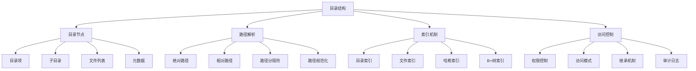

# 目录结构

## 📖 核心概念

**目录结构**是文件系统中组织和访问文件的基础，通过树形结构、索引机制和路径解析，实现文件的层次化管理和快速定位。目录结构直接影响文件系统的可用性、性能和用户体验。

### 🏗️ 目录结构的组成要素



## 🔍 目录结构类型

### 目录组织方式

| 组织方式 | 特点 | 优势 | 劣势 | 适用场景 |
|----------|------|------|------|----------|
| **单级目录** | 所有文件在同一目录 | 简单直接 | 文件数量限制 | 简单系统 |
| **两级目录** | 用户目录分离 | 用户隔离 | 结构简单 | 多用户系统 |
| **树形目录** | 层次化结构 | 组织清晰 | 路径复杂 | 现代系统 |
| **图形目录** | 多路径访问 | 灵活访问 | 实现复杂 | 高级系统 |

### 目录实现方式

| 实现方式 | 特点 | 优势 | 劣势 | 适用场景 |
|----------|------|------|------|----------|
| **线性列表** | 顺序存储 | 实现简单 | 查找慢 | 小目录 |
| **哈希表** | 快速查找 | 查找快 | 冲突处理 | 中等目录 |
| **B+树** | 平衡树结构 | 性能稳定 | 实现复杂 | 大目录 |
| **混合结构** | 结合多种方式 | 性能平衡 | 复杂度高 | 通用场景 |

## 💻 目录结构实现

### 目录管理器

```cpp
// 目录管理器
class DirectoryManager {
private:
    struct DirectoryEntry {
        string name;
        EntryType type;
        int inodeId;
        size_t size;
        chrono::system_clock::time_point createdTime;
        chrono::system_clock::time_point modifiedTime;
        FilePermissions permissions;
        
        DirectoryEntry(const string& n, EntryType t, int inode) 
            : name(n), type(t), inodeId(inode), size(0) {
            createdTime = chrono::system_clock::now();
            modifiedTime = createdTime;
            permissions = FilePermissions::DEFAULT;
        }
    };
    
    enum EntryType {
        REGULAR_FILE,
        DIRECTORY,
        SYMBOLIC_LINK,
        HARD_LINK
    };
    
    enum FilePermissions {
        READ_ONLY = 1,
        WRITE_ONLY = 2,
        READ_WRITE = 3,
        EXECUTE = 4,
        DEFAULT = READ_WRITE
    };
    
    struct Directory {
        int inodeId;
        string name;
        map<string, DirectoryEntry> entries;
        Directory* parent;
        vector<Directory*> children;
        chrono::system_clock::time_point createdTime;
        chrono::system_clock::time_point modifiedTime;
        
        Directory(int id, const string& n, Directory* p = nullptr) 
            : inodeId(id), name(n), parent(p) {
            createdTime = chrono::system_clock::now();
            modifiedTime = createdTime;
        }
        
        ~Directory() {
            for (Directory* child : children) {
                delete child;
            }
        }
    };
    
    // 目录管理
    Directory* rootDirectory;
    Directory* currentDirectory;
    map<int, Directory*> directoryMap;
    atomic<int> nextInodeId;
    
    // 路径解析
    class PathResolver {
    public:
        // 解析路径
        static vector<string> parsePath(const string& path) {
            vector<string> components;
            string current;
            
            for (char c : path) {
                if (c == '/' || c == '\\') {
                    if (!current.empty()) {
                        components.push_back(current);
                        current.clear();
                    }
                } else {
                    current += c;
                }
            }
            
            if (!current.empty()) {
                components.push_back(current);
            }
            
            return components;
        }
        
        // 规范化路径
        static string normalizePath(const string& path) {
            vector<string> components = parsePath(path);
            vector<string> normalized;
            
            for (const string& component : components) {
                if (component == ".") {
                    continue;
                } else if (component == "..") {
                    if (!normalized.empty()) {
                        normalized.pop_back();
                    }
                } else {
                    normalized.push_back(component);
                }
            }
            
            string result = "/";
            for (size_t i = 0; i < normalized.size(); i++) {
                result += normalized[i];
                if (i < normalized.size() - 1) {
                    result += "/";
                }
            }
            
            return result;
        }
        
        // 获取父路径
        static string getParentPath(const string& path) {
            size_t lastSlash = path.find_last_of("/\\");
            if (lastSlash == string::npos) {
                return ".";
            }
            if (lastSlash == 0) {
                return "/";
            }
            return path.substr(0, lastSlash);
        }
        
        // 获取文件名
        static string getFileName(const string& path) {
            size_t lastSlash = path.find_last_of("/\\");
            if (lastSlash == string::npos) {
                return path;
            }
            return path.substr(lastSlash + 1);
        }
    };
    
    // 目录索引
    class DirectoryIndex {
    private:
        map<string, int> nameToInode;
        map<int, string> inodeToName;
        mutex indexMutex;
        
    public:
        // 添加索引
        void addIndex(const string& name, int inodeId) {
            lock_guard<mutex> lock(indexMutex);
            nameToInode[name] = inodeId;
            inodeToName[inodeId] = name;
        }
        
        // 删除索引
        void removeIndex(const string& name) {
            lock_guard<mutex> lock(indexMutex);
            auto it = nameToInode.find(name);
            if (it != nameToInode.end()) {
                inodeToName.erase(it->second);
                nameToInode.erase(it);
            }
        }
        
        // 查找索引
        int findInode(const string& name) {
            lock_guard<mutex> lock(indexMutex);
            auto it = nameToInode.find(name);
            return (it != nameToInode.end()) ? it->second : -1;
        }
        
        // 查找名称
        string findName(int inodeId) {
            lock_guard<mutex> lock(indexMutex);
            auto it = inodeToName.find(inodeId);
            return (it != inodeToName.end()) ? it->second : "";
        }
        
        // 获取所有索引
        map<string, int> getAllIndexes() {
            lock_guard<mutex> lock(indexMutex);
            return nameToInode;
        }
    };
    
    DirectoryIndex directoryIndex;
    
public:
    DirectoryManager() {
        rootDirectory = new Directory(0, "/");
        currentDirectory = rootDirectory;
        directoryMap[0] = rootDirectory;
        nextInodeId = 1;
    }
    
    ~DirectoryManager() {
        delete rootDirectory;
    }
    
    // 创建目录
    bool createDirectory(const string& path) {
        string normalizedPath = PathResolver::normalizePath(path);
        vector<string> components = PathResolver::parsePath(normalizedPath);
        
        if (components.empty()) {
            return false;
        }
        
        // 查找父目录
        Directory* parent = findParentDirectory(components);
        if (parent == nullptr) {
            return false;
        }
        
        string dirName = components.back();
        
        // 检查目录是否已存在
        if (parent->entries.find(dirName) != parent->entries.end()) {
            return false;
        }
        
        // 创建新目录
        int inodeId = nextInodeId.fetch_add(1);
        Directory* newDir = new Directory(inodeId, dirName, parent);
        
        // 添加到父目录
        DirectoryEntry entry(dirName, DIRECTORY, inodeId);
        parent->entries[dirName] = entry;
        parent->children.push_back(newDir);
        parent->modifiedTime = chrono::system_clock::now();
        
        // 更新索引
        directoryMap[inodeId] = newDir;
        directoryIndex.addIndex(normalizedPath, inodeId);
        
        cout << "Directory " << normalizedPath << " created successfully" << endl;
        return true;
    }
    
    // 删除目录
    bool deleteDirectory(const string& path) {
        string normalizedPath = PathResolver::normalizePath(path);
        Directory* dir = findDirectory(normalizedPath);
        
        if (dir == nullptr) {
            return false;
        }
        
        // 检查目录是否为空
        if (!dir->entries.empty()) {
            return false;
        }
        
        // 从父目录中删除
        if (dir->parent != nullptr) {
            auto it = dir->parent->entries.find(dir->name);
            if (it != dir->parent->entries.end()) {
                dir->parent->entries.erase(it);
            }
            
            auto childIt = find(dir->parent->children.begin(), 
                               dir->parent->children.end(), dir);
            if (childIt != dir->parent->children.end()) {
                dir->parent->children.erase(childIt);
            }
            
            dir->parent->modifiedTime = chrono::system_clock::now();
        }
        
        // 更新索引
        directoryIndex.removeIndex(normalizedPath);
        directoryMap.erase(dir->inodeId);
        
        delete dir;
        
        cout << "Directory " << normalizedPath << " deleted successfully" << endl;
        return true;
    }
    
    // 创建文件
    bool createFile(const string& path, const string& content = "") {
        string normalizedPath = PathResolver::normalizePath(path);
        vector<string> components = PathResolver::parsePath(normalizedPath);
        
        if (components.empty()) {
            return false;
        }
        
        // 查找父目录
        Directory* parent = findParentDirectory(components);
        if (parent == nullptr) {
            return false;
        }
        
        string fileName = components.back();
        
        // 检查文件是否已存在
        if (parent->entries.find(fileName) != parent->entries.end()) {
            return false;
        }
        
        // 创建新文件
        int inodeId = nextInodeId.fetch_add(1);
        DirectoryEntry entry(fileName, REGULAR_FILE, inodeId);
        entry.size = content.size();
        
        // 添加到父目录
        parent->entries[fileName] = entry;
        parent->modifiedTime = chrono::system_clock::now();
        
        // 更新索引
        directoryIndex.addIndex(normalizedPath, inodeId);
        
        cout << "File " << normalizedPath << " created successfully" << endl;
        return true;
    }
    
    // 删除文件
    bool deleteFile(const string& path) {
        string normalizedPath = PathResolver::normalizePath(path);
        Directory* parent = findParentDirectory(PathResolver::parsePath(normalizedPath));
        
        if (parent == nullptr) {
            return false;
        }
        
        string fileName = PathResolver::getFileName(normalizedPath);
        auto it = parent->entries.find(fileName);
        
        if (it == parent->entries.end()) {
            return false;
        }
        
        // 删除文件
        parent->entries.erase(it);
        parent->modifiedTime = chrono::system_clock::now();
        
        // 更新索引
        directoryIndex.removeIndex(normalizedPath);
        
        cout << "File " << normalizedPath << " deleted successfully" << endl;
        return true;
    }
    
    // 改变当前目录
    bool changeDirectory(const string& path) {
        string normalizedPath = PathResolver::normalizePath(path);
        Directory* dir = findDirectory(normalizedPath);
        
        if (dir == nullptr) {
            return false;
        }
        
        currentDirectory = dir;
        cout << "Current directory changed to " << normalizedPath << endl;
        return true;
    }
    
    // 列出目录内容
    vector<string> listDirectory(const string& path = "") {
        Directory* dir = currentDirectory;
        
        if (!path.empty()) {
            string normalizedPath = PathResolver::normalizePath(path);
            dir = findDirectory(normalizedPath);
            if (dir == nullptr) {
                return {};
            }
        }
        
        vector<string> contents;
        
        // 列出文件
        for (const auto& [name, entry] : dir->entries) {
            string typeStr = (entry.type == DIRECTORY) ? "[DIR]" : "[FILE]";
            contents.push_back(typeStr + " " + name);
        }
        
        return contents;
    }
    
    // 获取当前路径
    string getCurrentPath() {
        return getDirectoryPath(currentDirectory);
    }
    
    // 获取目录路径
    string getDirectoryPath(Directory* dir) {
        if (dir == rootDirectory) {
            return "/";
        }
        
        vector<string> pathComponents;
        Directory* current = dir;
        
        while (current != nullptr && current != rootDirectory) {
            pathComponents.push_back(current->name);
            current = current->parent;
        }
        
        reverse(pathComponents.begin(), pathComponents.end());
        
        string path = "/";
        for (size_t i = 0; i < pathComponents.size(); i++) {
            path += pathComponents[i];
            if (i < pathComponents.size() - 1) {
                path += "/";
            }
        }
        
        return path;
    }
    
    // 查找文件
    vector<string> findFile(const string& fileName) {
        vector<string> results;
        findFileRecursive(rootDirectory, fileName, results);
        return results;
    }
    
    // 获取文件信息
    DirectoryEntry* getFileInfo(const string& path) {
        string normalizedPath = PathResolver::normalizePath(path);
        Directory* parent = findParentDirectory(PathResolver::parsePath(normalizedPath));
        
        if (parent == nullptr) {
            return nullptr;
        }
        
        string fileName = PathResolver::getFileName(normalizedPath);
        auto it = parent->entries.find(fileName);
        
        if (it == parent->entries.end()) {
            return nullptr;
        }
        
        return &it->second;
    }
    
private:
    // 查找父目录
    Directory* findParentDirectory(const vector<string>& components) {
        if (components.empty()) {
            return nullptr;
        }
        
        Directory* current = rootDirectory;
        
        for (size_t i = 0; i < components.size() - 1; i++) {
            auto it = current->entries.find(components[i]);
            if (it == current->entries.end() || it->second.type != DIRECTORY) {
                return nullptr;
            }
            
            auto dirIt = directoryMap.find(it->second.inodeId);
            if (dirIt == directoryMap.end()) {
                return nullptr;
            }
            
            current = dirIt->second;
        }
        
        return current;
    }
    
    // 查找目录
    Directory* findDirectory(const string& path) {
        vector<string> components = PathResolver::parsePath(path);
        
        if (components.empty()) {
            return rootDirectory;
        }
        
        Directory* current = rootDirectory;
        
        for (const string& component : components) {
            auto it = current->entries.find(component);
            if (it == current->entries.end() || it->second.type != DIRECTORY) {
                return nullptr;
            }
            
            auto dirIt = directoryMap.find(it->second.inodeId);
            if (dirIt == directoryMap.end()) {
                return nullptr;
            }
            
            current = dirIt->second;
        }
        
        return current;
    }
    
    // 递归查找文件
    void findFileRecursive(Directory* dir, const string& fileName, vector<string>& results) {
        for (const auto& [name, entry] : dir->entries) {
            if (entry.type == REGULAR_FILE && name == fileName) {
                results.push_back(getDirectoryPath(dir) + "/" + name);
            } else if (entry.type == DIRECTORY) {
                auto dirIt = directoryMap.find(entry.inodeId);
                if (dirIt != directoryMap.end()) {
                    findFileRecursive(dirIt->second, fileName, results);
                }
            }
        }
    }
    
public:
    // 获取目录统计信息
    struct DirectoryStatistics {
        int totalDirectories;
        int totalFiles;
        int totalLinks;
        size_t totalSize;
        int maxDepth;
        double averageFilesPerDirectory;
    };
    
    DirectoryStatistics getStatistics() {
        DirectoryStatistics stats;
        stats.totalDirectories = 0;
        stats.totalFiles = 0;
        stats.totalLinks = 0;
        stats.totalSize = 0;
        stats.maxDepth = 0;
        stats.averageFilesPerDirectory = 0;
        
        calculateStatistics(rootDirectory, 0, stats);
        
        if (stats.totalDirectories > 0) {
            stats.averageFilesPerDirectory = (double)stats.totalFiles / stats.totalDirectories;
        }
        
        return stats;
    }
    
private:
    void calculateStatistics(Directory* dir, int depth, DirectoryStatistics& stats) {
        stats.totalDirectories++;
        stats.maxDepth = max(stats.maxDepth, depth);
        
        for (const auto& [name, entry] : dir->entries) {
            switch (entry.type) {
                case REGULAR_FILE:
                    stats.totalFiles++;
                    stats.totalSize += entry.size;
                    break;
                case DIRECTORY:
                    // 递归计算子目录
                    auto dirIt = directoryMap.find(entry.inodeId);
                    if (dirIt != directoryMap.end()) {
                        calculateStatistics(dirIt->second, depth + 1, stats);
                    }
                    break;
                case SYMBOLIC_LINK:
                case HARD_LINK:
                    stats.totalLinks++;
                    break;
            }
        }
    }
    
public:
    // 目录树遍历
    void traverseDirectoryTree(Directory* dir, int depth = 0) {
        if (dir == nullptr) {
            return;
        }
        
        // 打印当前目录
        for (int i = 0; i < depth; i++) {
            cout << "  ";
        }
        cout << "[DIR] " << dir->name << endl;
        
        // 遍历子目录
        for (const auto& [name, entry] : dir->entries) {
            for (int i = 0; i < depth + 1; i++) {
                cout << "  ";
            }
            
            string typeStr = (entry.type == DIRECTORY) ? "[DIR]" : "[FILE]";
            cout << typeStr << " " << name;
            
            if (entry.type == REGULAR_FILE) {
                cout << " (" << entry.size << " bytes)";
            }
            cout << endl;
            
            // 递归遍历子目录
            if (entry.type == DIRECTORY) {
                auto dirIt = directoryMap.find(entry.inodeId);
                if (dirIt != directoryMap.end()) {
                    traverseDirectoryTree(dirIt->second, depth + 1);
                }
            }
        }
    }
    
    // 获取目录树
    void printDirectoryTree() {
        cout << "Directory Tree:" << endl;
        traverseDirectoryTree(rootDirectory);
    }
    
    // 检查目录完整性
    bool checkIntegrity() {
        cout << "Checking directory integrity..." << endl;
        
        // 检查目录映射
        for (const auto& [inodeId, dir] : directoryMap) {
            if (dir->inodeId != inodeId) {
                cout << "Integrity check failed: Inode ID mismatch" << endl;
                return false;
            }
        }
        
        // 检查父子关系
        for (const auto& [inodeId, dir] : directoryMap) {
            if (dir->parent != nullptr) {
                bool found = false;
                for (Directory* child : dir->parent->children) {
                    if (child == dir) {
                        found = true;
                        break;
                    }
                }
                if (!found) {
                    cout << "Integrity check failed: Parent-child relationship mismatch" << endl;
                    return false;
                }
            }
        }
        
        cout << "Directory integrity check passed" << endl;
        return true;
    }
};
```

### 路径解析器

```cpp
// 路径解析器
class PathParser {
public:
    // 解析绝对路径
    static vector<string> parseAbsolutePath(const string& path) {
        vector<string> components;
        string current;
        
        for (char c : path) {
            if (c == '/' || c == '\\') {
                if (!current.empty()) {
                    components.push_back(current);
                    current.clear();
                }
            } else {
                current += c;
            }
        }
        
        if (!current.empty()) {
            components.push_back(current);
        }
        
        return components;
    }
    
    // 解析相对路径
    static vector<string> parseRelativePath(const string& path, const string& currentPath) {
        vector<string> components = parseAbsolutePath(path);
        vector<string> currentComponents = parseAbsolutePath(currentPath);
        
        vector<string> result = currentComponents;
        
        for (const string& component : components) {
            if (component == ".") {
                continue;
            } else if (component == "..") {
                if (!result.empty()) {
                    result.pop_back();
                }
            } else {
                result.push_back(component);
            }
        }
        
        return result;
    }
    
    // 构建路径
    static string buildPath(const vector<string>& components) {
        if (components.empty()) {
            return "/";
        }
        
        string path = "/";
        for (size_t i = 0; i < components.size(); i++) {
            path += components[i];
            if (i < components.size() - 1) {
                path += "/";
            }
        }
        
        return path;
    }
    
    // 获取路径组件
    static string getPathComponent(const string& path, int index) {
        vector<string> components = parseAbsolutePath(path);
        
        if (index >= 0 && index < components.size()) {
            return components[index];
        }
        
        return "";
    }
    
    // 获取路径深度
    static int getPathDepth(const string& path) {
        vector<string> components = parseAbsolutePath(path);
        return components.size();
    }
    
    // 检查路径有效性
    static bool isValidPath(const string& path) {
        if (path.empty()) {
            return false;
        }
        
        // 检查非法字符
        for (char c : path) {
            if (c == '<' || c == '>' || c == ':' || c == '"' || c == '|' || c == '?') {
                return false;
            }
        }
        
        // 检查路径长度
        if (path.length() > 260) {
            return false;
        }
        
        return true;
    }
};
```

## ⚡ 复杂度分析

### 目录结构复杂度

| 操作 | 线性列表 | 哈希表 | B+树 | 适用场景 |
|------|----------|--------|------|----------|
| **查找** | O(n) | O(1) | O(log n) | 目录访问 |
| **插入** | O(1) | O(1) | O(log n) | 文件创建 |
| **删除** | O(n) | O(1) | O(log n) | 文件删除 |
| **遍历** | O(n) | O(n) | O(n) | 目录列表 |

### 性能优化策略

| 优化策略 | 适用场景 | 优化效果 | 实现难度 | 维护成本 |
|----------|----------|----------|----------|----------|
| **目录缓存** | 频繁访问 | 显著 | 中等 | 中等 |
| **索引优化** | 大目录 | 显著 | 困难 | 高 |
| **路径缓存** | 路径解析 | 明显 | 简单 | 低 |
| **预分配** | 动态目录 | 明显 | 中等 | 中等 |

## 🎓 学习要点总结

### 核心理解

1. **目录结构**：理解目录的层次化组织
2. **路径解析**：掌握路径的解析和构建
3. **索引机制**：理解目录索引的作用
4. **访问控制**：掌握目录访问控制

### 实践要点

1. **路径管理**：正确管理文件路径
2. **目录操作**：实现目录的增删改查
3. **性能优化**：优化目录访问性能
4. **完整性检查**：保证目录结构完整性

### 应用思维

1. **系统设计**：设计高效的目录系统
2. **用户体验**：提供良好的路径体验
3. **性能权衡**：权衡功能和性能
4. **扩展性设计**：设计可扩展的目录结构

---

**相关链接：**
- [[06-应用实战/02-文件系统/01-文件组织|文件组织]] - 文件管理
- [[05-高级结构/02-平衡树族/03-B树与B+树|B树与B+树]] - 索引结构
- [[03-层次宇宙/01-树形基础|树形基础]] - 树结构基础
- [[06-应用实战/01-数据库王国/01-索引结构|索引结构]] - 数据库索引
