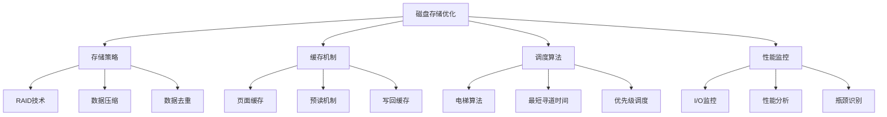

# 磁盘存储优化

## 📖 核心概念

**磁盘存储优化**是提高磁盘I/O性能和存储效率的关键技术。通过合理的存储策略、缓存机制和调度算法，可以显著提升系统的整体性能。

### 🏗️ 磁盘存储优化分类



## 🔧 磁盘存储优化实现

### RAID技术实现

```cpp
class RAIDTechnology {
private:
    enum RAIDLevel {
        RAID0,  // 条带化
        RAID1,  // 镜像
        RAID5,  // 分布式奇偶校验
        RAID6   // 双重分布式奇偶校验
    };
    
    struct Disk {
        int diskId;
        vector<string> data;
        bool isHealthy;
        
        Disk(int id) : diskId(id), isHealthy(true) {}
    };
    
    vector<Disk> disks;
    RAIDLevel raidLevel;
    int stripeSize;
    
public:
    RAIDTechnology(RAIDLevel level, int diskCount, int stripe = 4) 
        : raidLevel(level), stripeSize(stripe) {
        for (int i = 0; i < diskCount; i++) {
            disks.push_back(Disk(i));
        }
    }
    
    // RAID 0 - 条带化
    void writeRAID0(const string& data) {
        cout << "RAID 0 Write: " << data << endl;
        
        for (size_t i = 0; i < data.length(); i += stripeSize) {
            int diskIndex = (i / stripeSize) % disks.size();
            string stripe = data.substr(i, stripeSize);
            
            disks[diskIndex].data.push_back(stripe);
            cout << "  Stripe written to disk " << diskIndex << ": " << stripe << endl;
        }
    }
    
    string readRAID0(int blockIndex) {
        cout << "RAID 0 Read block " << blockIndex << endl;
        
        string result = "";
        int diskIndex = blockIndex % disks.size();
        
        if (blockIndex < disks[diskIndex].data.size()) {
            result = disks[diskIndex].data[blockIndex];
            cout << "  Read from disk " << diskIndex << ": " << result << endl;
        }
        
        return result;
    }
    
    // RAID 1 - 镜像
    void writeRAID1(const string& data) {
        cout << "RAID 1 Write: " << data << endl;
        
        for (Disk& disk : disks) {
            disk.data.push_back(data);
            cout << "  Data written to disk " << disk.diskId << endl;
        }
    }
    
    string readRAID1(int blockIndex) {
        cout << "RAID 1 Read block " << blockIndex << endl;
        
        // 从第一个健康的磁盘读取
        for (Disk& disk : disks) {
            if (disk.isHealthy && blockIndex < disk.data.size()) {
                cout << "  Read from disk " << disk.diskId << ": " << disk.data[blockIndex] << endl;
                return disk.data[blockIndex];
            }
        }
        
        return "";
    }
    
    // RAID 5 - 分布式奇偶校验
    void writeRAID5(const string& data) {
        cout << "RAID 5 Write: " << data << endl;
        
        // 简化的RAID 5实现
        for (size_t i = 0; i < data.length(); i += stripeSize) {
            int diskIndex = (i / stripeSize) % (disks.size() - 1);
            string stripe = data.substr(i, stripeSize);
            
            disks[diskIndex].data.push_back(stripe);
            
            // 计算奇偶校验
            string parity = calculateParity(stripe);
            disks[disks.size() - 1].data.push_back(parity);
            
            cout << "  Stripe written to disk " << diskIndex << ": " << stripe << endl;
            cout << "  Parity written to disk " << (disks.size() - 1) << ": " << parity << endl;
        }
    }
    
    string calculateParity(const string& data) {
        // 简化的奇偶校验计算
        char parity = 0;
        for (char c : data) {
            parity ^= c;
        }
        return string(1, parity);
    }
    
    // 磁盘故障处理
    void simulateDiskFailure(int diskId) {
        if (diskId >= 0 && diskId < disks.size()) {
            disks[diskId].isHealthy = false;
            cout << "Disk " << diskId << " failed" << endl;
            
            if (raidLevel == RAID1 || raidLevel == RAID5) {
                cout << "Attempting data recovery..." << endl;
                recoverData(diskId);
            }
        }
    }
    
    void recoverData(int failedDiskId) {
        cout << "Recovering data for disk " << failedDiskId << endl;
        
        if (raidLevel == RAID1) {
            // RAID 1 从镜像磁盘恢复
            for (int i = 0; i < disks.size(); i++) {
                if (i != failedDiskId && disks[i].isHealthy) {
                    disks[failedDiskId].data = disks[i].data;
                    cout << "Data recovered from disk " << i << endl;
                    break;
                }
            }
        } else if (raidLevel == RAID5) {
            // RAID 5 从奇偶校验恢复
            cout << "Recovering using parity data" << endl;
            // 简化的恢复逻辑
        }
        
        disks[failedDiskId].isHealthy = true;
    }
    
    // 显示RAID状态
    void displayRAIDStatus() {
        cout << "RAID Status:" << endl;
        cout << "===========" << endl;
        
        cout << "RAID Level: " << raidLevel << endl;
        cout << "Number of disks: " << disks.size() << endl;
        cout << "Stripe size: " << stripeSize << endl;
        
        for (const Disk& disk : disks) {
            cout << "Disk " << disk.diskId << ": " 
                 << (disk.isHealthy ? "Healthy" : "Failed") 
                 << ", Blocks: " << disk.data.size() << endl;
        }
    }
};
```

### 缓存机制实现

```cpp
class CacheMechanism {
private:
    struct CacheBlock {
        int blockId;
        string data;
        bool isDirty;
        chrono::time_point<chrono::high_resolution_clock> lastAccess;
        
        CacheBlock(int id, const string& d) : blockId(id), data(d), isDirty(false) {
            lastAccess = chrono::high_resolution_clock::now();
        }
    };
    
    map<int, CacheBlock> cache;
    int maxCacheSize;
    int hitCount;
    int missCount;
    
public:
    CacheMechanism(int maxSize = 100) : maxCacheSize(maxSize), hitCount(0), missCount(0) {}
    
    // 读取数据
    string read(int blockId) {
        auto it = cache.find(blockId);
        
        if (it != cache.end()) {
            // 缓存命中
            hitCount++;
            it->second.lastAccess = chrono::high_resolution_clock::now();
            cout << "Cache hit for block " << blockId << endl;
            return it->second.data;
        } else {
            // 缓存未命中
            missCount++;
            cout << "Cache miss for block " << blockId << endl;
            
            // 从磁盘读取
            string data = readFromDisk(blockId);
            
            // 添加到缓存
            addToCache(blockId, data);
            
            return data;
        }
    }
    
    // 写入数据
    void write(int blockId, const string& data) {
        auto it = cache.find(blockId);
        
        if (it != cache.end()) {
            // 更新缓存
            it->second.data = data;
            it->second.isDirty = true;
            it->second.lastAccess = chrono::high_resolution_clock::now();
            cout << "Updated cache for block " << blockId << endl;
        } else {
            // 添加到缓存
            addToCache(blockId, data);
            cache[blockId].isDirty = true;
            cout << "Added to cache for block " << blockId << endl;
        }
    }
    
    // 添加到缓存
    void addToCache(int blockId, const string& data) {
        // 检查缓存是否已满
        if (cache.size() >= maxCacheSize) {
            evictLRU();
        }
        
        cache[blockId] = CacheBlock(blockId, data);
    }
    
    // LRU淘汰
    void evictLRU() {
        if (cache.empty()) return;
        
        auto oldest = cache.begin();
        for (auto it = cache.begin(); it != cache.end(); ++it) {
            if (it->second.lastAccess < oldest->second.lastAccess) {
                oldest = it;
            }
        }
        
        // 如果数据已修改，写回磁盘
        if (oldest->second.isDirty) {
            writeToDisk(oldest->first, oldest->second.data);
        }
        
        cout << "Evicted block " << oldest->first << " from cache" << endl;
        cache.erase(oldest);
    }
    
    // 预读机制
    void prefetch(int blockId, int prefetchCount = 3) {
        cout << "Prefetching " << prefetchCount << " blocks starting from " << blockId << endl;
        
        for (int i = 1; i <= prefetchCount; i++) {
            int nextBlockId = blockId + i;
            
            // 检查是否已在缓存中
            if (cache.find(nextBlockId) == cache.end()) {
                string data = readFromDisk(nextBlockId);
                addToCache(nextBlockId, data);
                cout << "Prefetched block " << nextBlockId << endl;
            }
        }
    }
    
    // 写回缓存
    void flushCache() {
        cout << "Flushing cache to disk" << endl;
        
        for (auto& pair : cache) {
            if (pair.second.isDirty) {
                writeToDisk(pair.first, pair.second.data);
                pair.second.isDirty = false;
                cout << "Flushed block " << pair.first << " to disk" << endl;
            }
        }
    }
    
    // 模拟从磁盘读取
    string readFromDisk(int blockId) {
        // 模拟磁盘读取延迟
        this_thread::sleep_for(chrono::milliseconds(10));
        return "Data from disk block " + to_string(blockId);
    }
    
    // 模拟写入磁盘
    void writeToDisk(int blockId, const string& data) {
        // 模拟磁盘写入延迟
        this_thread::sleep_for(chrono::milliseconds(10));
        cout << "Written to disk block " << blockId << ": " << data << endl;
    }
    
    // 显示缓存统计
    void displayCacheStats() {
        cout << "Cache Statistics:" << endl;
        cout << "================" << endl;
        
        cout << "Cache size: " << cache.size() << "/" << maxCacheSize << endl;
        cout << "Hit count: " << hitCount << endl;
        cout << "Miss count: " << missCount << endl;
        cout << "Hit rate: " << (hitCount + missCount > 0 ? (double)hitCount / (hitCount + missCount) * 100 : 0) << "%" << endl;
        
        int dirtyBlocks = 0;
        for (const auto& pair : cache) {
            if (pair.second.isDirty) {
                dirtyBlocks++;
            }
        }
        
        cout << "Dirty blocks: " << dirtyBlocks << endl;
    }
};
```

### 磁盘调度算法

```cpp
class DiskScheduler {
private:
    struct DiskRequest {
        int track;
        int sector;
        chrono::time_point<chrono::high_resolution_clock> arrivalTime;
        int requestId;
        
        DiskRequest(int t, int s, int id) : track(t), sector(s), requestId(id) {
            arrivalTime = chrono::high_resolution_clock::now();
        }
    };
    
    queue<DiskRequest> requestQueue;
    int currentTrack;
    int currentSector;
    int totalSeekTime;
    int totalRequests;
    
public:
    DiskScheduler(int initialTrack = 0, int initialSector = 0) 
        : currentTrack(initialTrack), currentSector(initialSector), totalSeekTime(0), totalRequests(0) {}
    
    // 添加请求
    void addRequest(int track, int sector, int requestId) {
        DiskRequest request(track, sector, requestId);
        requestQueue.push(request);
        cout << "Added request " << requestId << " for track " << track << ", sector " << sector << endl;
    }
    
    // FCFS调度
    void scheduleFCFS() {
        cout << "FCFS Scheduling:" << endl;
        cout << "===============" << endl;
        
        queue<DiskRequest> tempQueue = requestQueue;
        
        while (!tempQueue.empty()) {
            DiskRequest request = tempQueue.front();
            tempQueue.pop();
            
            int seekTime = abs(request.track - currentTrack);
            totalSeekTime += seekTime;
            totalRequests++;
            
            currentTrack = request.track;
            currentSector = request.sector;
            
            cout << "Processed request " << request.requestId 
                 << " at track " << request.track 
                 << ", seek time: " << seekTime << endl;
        }
    }
    
    // SSTF调度
    void scheduleSSTF() {
        cout << "SSTF Scheduling:" << endl;
        cout << "===============" << endl;
        
        vector<DiskRequest> requests;
        while (!requestQueue.empty()) {
            requests.push_back(requestQueue.front());
            requestQueue.pop();
        }
        
        while (!requests.empty()) {
            // 找到最近的请求
            int nearestIndex = 0;
            int minDistance = abs(requests[0].track - currentTrack);
            
            for (size_t i = 1; i < requests.size(); i++) {
                int distance = abs(requests[i].track - currentTrack);
                if (distance < minDistance) {
                    minDistance = distance;
                    nearestIndex = i;
                }
            }
            
            DiskRequest request = requests[nearestIndex];
            requests.erase(requests.begin() + nearestIndex);
            
            int seekTime = abs(request.track - currentTrack);
            totalSeekTime += seekTime;
            totalRequests++;
            
            currentTrack = request.track;
            currentSector = request.sector;
            
            cout << "Processed request " << request.requestId 
                 << " at track " << request.track 
                 << ", seek time: " << seekTime << endl;
        }
    }
    
    // SCAN调度
    void scheduleSCAN() {
        cout << "SCAN Scheduling:" << endl;
        cout << "===============" << endl;
        
        vector<DiskRequest> requests;
        while (!requestQueue.empty()) {
            requests.push_back(requestQueue.front());
            requestQueue.pop();
        }
        
        // 按磁道号排序
        sort(requests.begin(), requests.end(), [](const DiskRequest& a, const DiskRequest& b) {
            return a.track < b.track;
        });
        
        // 找到当前磁道位置
        int currentIndex = 0;
        for (size_t i = 0; i < requests.size(); i++) {
            if (requests[i].track >= currentTrack) {
                currentIndex = i;
                break;
            }
        }
        
        // 向右扫描
        for (int i = currentIndex; i < requests.size(); i++) {
            DiskRequest request = requests[i];
            
            int seekTime = abs(request.track - currentTrack);
            totalSeekTime += seekTime;
            totalRequests++;
            
            currentTrack = request.track;
            currentSector = request.sector;
            
            cout << "Processed request " << request.requestId 
                 << " at track " << request.track 
                 << ", seek time: " << seekTime << endl;
        }
        
        // 向左扫描
        for (int i = currentIndex - 1; i >= 0; i--) {
            DiskRequest request = requests[i];
            
            int seekTime = abs(request.track - currentTrack);
            totalSeekTime += seekTime;
            totalRequests++;
            
            currentTrack = request.track;
            currentSector = request.sector;
            
            cout << "Processed request " << request.requestId 
                 << " at track " << request.track 
                 << ", seek time: " << seekTime << endl;
        }
    }
    
    // C-SCAN调度
    void scheduleCSCAN() {
        cout << "C-SCAN Scheduling:" << endl;
        cout << "================" << endl;
        
        vector<DiskRequest> requests;
        while (!requestQueue.empty()) {
            requests.push_back(requestQueue.front());
            requestQueue.pop();
        }
        
        // 按磁道号排序
        sort(requests.begin(), requests.end(), [](const DiskRequest& a, const DiskRequest& b) {
            return a.track < b.track;
        });
        
        // 找到当前磁道位置
        int currentIndex = 0;
        for (size_t i = 0; i < requests.size(); i++) {
            if (requests[i].track >= currentTrack) {
                currentIndex = i;
                break;
            }
        }
        
        // 向右扫描到末尾
        for (int i = currentIndex; i < requests.size(); i++) {
            DiskRequest request = requests[i];
            
            int seekTime = abs(request.track - currentTrack);
            totalSeekTime += seekTime;
            totalRequests++;
            
            currentTrack = request.track;
            currentSector = request.sector;
            
            cout << "Processed request " << request.requestId 
                 << " at track " << request.track 
                 << ", seek time: " << seekTime << endl;
        }
        
        // 跳回开始位置
        if (currentIndex > 0) {
            totalSeekTime += abs(currentTrack - requests[0].track);
            currentTrack = requests[0].track;
            cout << "Jumped to track " << currentTrack << endl;
        }
        
        // 继续向右扫描
        for (int i = 0; i < currentIndex; i++) {
            DiskRequest request = requests[i];
            
            int seekTime = abs(request.track - currentTrack);
            totalSeekTime += seekTime;
            totalRequests++;
            
            currentTrack = request.track;
            currentSector = request.sector;
            
            cout << "Processed request " << request.requestId 
                 << " at track " << request.track 
                 << ", seek time: " << seekTime << endl;
        }
    }
    
    // 显示调度统计
    void displaySchedulingStats() {
        cout << "Scheduling Statistics:" << endl;
        cout << "====================" << endl;
        
        cout << "Total requests: " << totalRequests << endl;
        cout << "Total seek time: " << totalSeekTime << endl;
        cout << "Average seek time: " << (totalRequests > 0 ? (double)totalSeekTime / totalRequests : 0) << endl;
        cout << "Current position: track " << currentTrack << ", sector " << currentSector << endl;
    }
    
    // 重置统计
    void resetStats() {
        totalSeekTime = 0;
        totalRequests = 0;
    }
};
```

## 🎯 磁盘存储应用

### 实际应用场景

```cpp
class DiskStorageApplications {
public:
    static void demonstrateApplications() {
        cout << "Disk Storage Applications:" << endl;
        cout << "=======================" << endl;
        
        cout << "1. 数据库系统:" << endl;
        cout << "   - 数据文件存储" << endl;
        cout << "   - 事务日志" << endl;
        cout << "   - 索引文件" << endl;
        
        cout << "2. 文件系统:" << endl;
        cout << "   - 文件存储" << endl;
        cout << "   - 目录结构" << endl;
        cout << "   - 元数据管理" << endl;
        
        cout << "3. 虚拟化系统:" << endl;
        cout << "   - 虚拟机存储" << endl;
        cout << "   - 快照管理" << endl;
        cout << "   - 存储迁移" << endl;
        
        cout << "4. 大数据系统:" << endl;
        cout << "   - 分布式存储" << endl;
        cout << "   - 数据备份" << endl;
        cout << "   - 容灾恢复" << endl;
    }
    
    static void analyzePerformance() {
        cout << "Disk Storage Performance Analysis:" << endl;
        cout << "=================================" << endl;
        
        cout << "1. RAID技术:" << endl;
        cout << "   - RAID 0: 高性能，无冗余" << endl;
        cout << "   - RAID 1: 高可靠性，性能中等" << endl;
        cout << "   - RAID 5: 平衡性能和可靠性" << endl;
        cout << "   - RAID 6: 高可靠性，性能较低" << endl;
        cout << endl;
        
        cout << "2. 缓存机制:" << endl;
        cout << "   - 页面缓存: 提高读取性能" << endl;
        cout << "   - 预读机制: 减少访问延迟" << endl;
        cout << "   - 写回缓存: 提高写入性能" << endl;
        cout << endl;
        
        cout << "3. 调度算法:" << endl;
        cout << "   - FCFS: 简单但效率低" << endl;
        cout << "   - SSTF: 减少寻道时间" << endl;
        cout << "   - SCAN: 避免饥饿问题" << endl;
        cout << "   - C-SCAN: 均匀响应时间" << endl;
    }
    
    static void selectOptimizationStrategy(bool needsHighReliability, bool needsHighPerformance, bool needsLowLatency) {
        cout << "Optimization Strategy Selection:" << endl;
        cout << "=============================" << endl;
        
        cout << "Needs high reliability: " << (needsHighReliability ? "Yes" : "No") << endl;
        cout << "Needs high performance: " << (needsHighPerformance ? "Yes" : "No") << endl;
        cout << "Needs low latency: " << (needsLowLatency ? "Yes" : "No") << endl;
        
        cout << "Recommendation:" << endl;
        
        if (needsHighReliability) {
            cout << "Use RAID 1 or RAID 6 with write-back cache" << endl;
        } else if (needsHighPerformance) {
            cout << "Use RAID 0 with large cache and SSTF scheduling" << endl;
        } else if (needsLowLatency) {
            cout << "Use SSD with large cache and C-SCAN scheduling" << endl;
        } else {
            cout << "Use RAID 5 with moderate cache and SCAN scheduling" << endl;
        }
    }
};
```

## 📊 磁盘存储分析

### 性能分析

```cpp
class DiskStorageAnalysis {
public:
    static void analyzePerformance() {
        cout << "Disk Storage Performance Analysis:" << endl;
        cout << "=================================" << endl;
        
        cout << "1. RAID性能:" << endl;
        cout << "   - RAID 0: 读取N倍，写入N倍" << endl;
        cout << "   - RAID 1: 读取2倍，写入1倍" << endl;
        cout << "   - RAID 5: 读取N-1倍，写入1/(N-1)倍" << endl;
        cout << "   - RAID 6: 读取N-2倍，写入1/(N-2)倍" << endl;
        
        cout << "2. 缓存性能:" << endl;
        cout << "   - 命中率: 80-95%" << endl;
        cout << "   - 延迟减少: 10-100倍" << endl;
        cout << "   - 吞吐量提升: 2-10倍" << endl;
        
        cout << "3. 调度性能:" << endl;
        cout << "   - FCFS: 平均寻道时间最长" << endl;
        cout << "   - SSTF: 平均寻道时间最短" << endl;
        cout << "   - SCAN: 平衡寻道时间和响应时间" << endl;
        cout << "   - C-SCAN: 均匀响应时间" << endl;
    }
    
    static void analyzeSpaceComplexity() {
        cout << "Disk Storage Space Complexity Analysis:" << endl;
        cout << "=====================================" << endl;
        
        cout << "1. RAID空间利用率:" << endl;
        cout << "   - RAID 0: 100%" << endl;
        cout << "   - RAID 1: 50%" << endl;
        cout << "   - RAID 5: (N-1)/N" << endl;
        cout << "   - RAID 6: (N-2)/N" << endl;
        
        cout << "2. 缓存空间:" << endl;
        cout << "   - 页面缓存: O(cache_size)" << endl;
        cout << "   - 预读缓存: O(prefetch_size)" << endl;
        cout << "   - 写回缓存: O(write_buffer_size)" << endl;
        
        cout << "3. 元数据空间:" << endl;
        cout << "   - RAID元数据: O(disk_count)" << endl;
        cout << "   - 缓存元数据: O(cache_size)" << endl;
        cout << "   - 调度元数据: O(request_count)" << endl;
    }
    
    static void analyzeTimeComplexity() {
        cout << "Disk Storage Time Complexity Analysis:" << endl;
        cout << "====================================" << endl;
        
        cout << "1. RAID操作:" << endl;
        cout << "   - 读取: O(1)" << endl;
        cout << "   - 写入: O(1)" << endl;
        cout << "   - 重建: O(disk_size)" << endl;
        
        cout << "2. 缓存操作:" << endl;
        cout << "   - 命中: O(1)" << endl;
        cout << "   - 未命中: O(disk_access_time)" << endl;
        cout << "   - 淘汰: O(cache_size)" << endl;
        
        cout << "3. 调度操作:" << endl;
        cout << "   - FCFS: O(1)" << endl;
        cout << "   - SSTF: O(n)" << endl;
        cout << "   - SCAN: O(n log n)" << endl;
        cout << "   - C-SCAN: O(n log n)" << endl;
    }
};
```

## 🎮 磁盘存储测试

### 1. 基础功能测试

```cpp
class DiskStorageTest {
public:
    static void testRAIDTechnology() {
        cout << "Testing RAID Technology:" << endl;
        cout << "======================" << endl;
        
        RAIDTechnology raid(RAIDTechnology::RAID0, 4);
        
        // 测试RAID 0
        raid.writeRAID0("Hello World");
        string data = raid.readRAID0(0);
        cout << "Read data: " << data << endl;
        
        // 测试磁盘故障
        raid.simulateDiskFailure(1);
        raid.displayRAIDStatus();
    }
    
    static void testCacheMechanism() {
        cout << "Testing Cache Mechanism:" << endl;
        cout << "======================" << endl;
        
        CacheMechanism cache(5);
        
        // 测试缓存读写
        cache.write(1, "Data 1");
        cache.write(2, "Data 2");
        cache.write(3, "Data 3");
        
        string data = cache.read(1);
        cout << "Read data: " << data << endl;
        
        // 测试预读
        cache.prefetch(2, 2);
        
        cache.displayCacheStats();
    }
    
    static void testDiskScheduler() {
        cout << "Testing Disk Scheduler:" << endl;
        cout << "======================" << endl;
        
        DiskScheduler scheduler(50, 0);
        
        // 添加请求
        scheduler.addRequest(55, 1, 1);
        scheduler.addRequest(58, 2, 2);
        scheduler.addRequest(39, 3, 3);
        scheduler.addRequest(18, 4, 4);
        scheduler.addRequest(90, 5, 5);
        scheduler.addRequest(160, 6, 6);
        scheduler.addRequest(150, 7, 7);
        scheduler.addRequest(38, 8, 8);
        scheduler.addRequest(184, 9, 9);
        scheduler.addRequest(10, 10, 10);
        
        // 测试不同调度算法
        scheduler.scheduleFCFS();
        scheduler.displaySchedulingStats();
        
        scheduler.resetStats();
        scheduler.scheduleSSTF();
        scheduler.displaySchedulingStats();
    }
    
    static void testApplications() {
        cout << "Testing Applications:" << endl;
        cout << "==================" << endl;
        
        DiskStorageApplications::demonstrateApplications();
        DiskStorageApplications::analyzePerformance();
        DiskStorageApplications::selectOptimizationStrategy(false, true, false);
    }
    
    static void testAnalysis() {
        cout << "Testing Analysis:" << endl;
        cout << "===============" << endl;
        
        DiskStorageAnalysis::analyzePerformance();
        DiskStorageAnalysis::analyzeSpaceComplexity();
        DiskStorageAnalysis::analyzeTimeComplexity();
    }
};
```

## 🔗 相关链接

- [[01-文件系统结构|文件系统结构]]
- [[02-分布式文件系统|分布式文件系统]]
- [[03-文件系统监控|文件系统监控]]

## 💡 磁盘存储要点

1. **RAID技术**: 提供数据冗余和性能提升
2. **缓存机制**: 减少磁盘I/O，提高访问速度
3. **调度算法**: 优化磁盘访问顺序，减少寻道时间
4. **性能监控**: 识别瓶颈，优化存储性能

---

*📝 磁盘存储提示：磁盘存储优化需要综合考虑可靠性、性能和成本，选择合适的RAID级别和调度算法*
