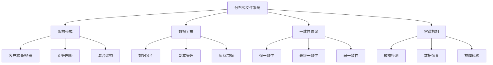

# 分布式文件系统

## 📖 核心概念

**分布式文件系统**是在多台计算机上存储和管理文件的系统，提供统一的文件访问接口。它通过数据分布、副本管理和一致性协议来保证数据的可靠性和可用性。

### 🏗️ 分布式文件系统分类



## 🔧 分布式文件系统实现

### 客户端-服务器架构

```cpp
class DistributedFileSystem {
private:
    struct FileMetadata {
        string fileName;
        string filePath;
        int fileSize;
        vector<string> replicaNodes;
        chrono::time_point<chrono::high_resolution_clock> createTime;
        chrono::time_point<chrono::high_resolution_clock> modifyTime;
        
        FileMetadata(const string& name, const string& path, int size) 
            : fileName(name), filePath(path), fileSize(size) {
            createTime = chrono::high_resolution_clock::now();
            modifyTime = createTime;
        }
    };
    
    struct DataNode {
        string nodeId;
        string address;
        int port;
        bool isHealthy;
        int availableSpace;
        map<string, string> storedFiles;
        
        DataNode(const string& id, const string& addr, int p, int space) 
            : nodeId(id), address(addr), port(p), isHealthy(true), availableSpace(space) {}
    };
    
    map<string, FileMetadata> fileMetadata;
    map<string, DataNode> dataNodes;
    string masterNodeId;
    
public:
    DistributedFileSystem(const string& masterId) : masterNodeId(masterId) {}
    
    // 添加数据节点
    void addDataNode(const string& nodeId, const string& address, int port, int availableSpace) {
        DataNode node(nodeId, address, port, availableSpace);
        dataNodes[nodeId] = node;
        cout << "Added data node: " << nodeId << " at " << address << ":" << port << endl;
    }
    
    // 创建文件
    bool createFile(const string& fileName, const string& filePath, const string& content, int replicaCount = 3) {
        if (fileMetadata.find(filePath + "/" + fileName) != fileMetadata.end()) {
            cout << "File " << fileName << " already exists" << endl;
            return false;
        }
        
        // 选择副本节点
        vector<string> replicaNodes = selectReplicaNodes(replicaCount);
        if (replicaNodes.size() < replicaCount) {
            cout << "Not enough healthy nodes for replication" << endl;
            return false;
        }
        
        // 创建文件元数据
        FileMetadata metadata(fileName, filePath, content.length());
        metadata.replicaNodes = replicaNodes;
        fileMetadata[filePath + "/" + fileName] = metadata;
        
        // 在选定的节点上存储文件
        for (const string& nodeId : replicaNodes) {
            if (dataNodes.find(nodeId) != dataNodes.end()) {
                dataNodes[nodeId].storedFiles[filePath + "/" + fileName] = content;
                dataNodes[nodeId].availableSpace -= content.length();
                cout << "Stored file " << fileName << " on node " << nodeId << endl;
            }
        }
        
        cout << "Created file: " << fileName << " with " << replicaNodes.size() << " replicas" << endl;
        return true;
    }
    
    // 读取文件
    string readFile(const string& fileName, const string& filePath) {
        string fullPath = filePath + "/" + fileName;
        
        auto it = fileMetadata.find(fullPath);
        if (it == fileMetadata.end()) {
            cout << "File " << fileName << " not found" << endl;
            return "";
        }
        
        FileMetadata& metadata = it->second;
        
        // 尝试从健康的副本节点读取
        for (const string& nodeId : metadata.replicaNodes) {
            if (dataNodes.find(nodeId) != dataNodes.end() && dataNodes[nodeId].isHealthy) {
                auto fileIt = dataNodes[nodeId].storedFiles.find(fullPath);
                if (fileIt != dataNodes[nodeId].storedFiles.end()) {
                    cout << "Read file " << fileName << " from node " << nodeId << endl;
                    return fileIt->second;
                }
            }
        }
        
        cout << "File " << fileName << " not available on any healthy node" << endl;
        return "";
    }
    
    // 更新文件
    bool updateFile(const string& fileName, const string& filePath, const string& newContent) {
        string fullPath = filePath + "/" + fileName;
        
        auto it = fileMetadata.find(fullPath);
        if (it == fileMetadata.end()) {
            cout << "File " << fileName << " not found" << endl;
            return false;
        }
        
        FileMetadata& metadata = it->second;
        
        // 更新所有健康的副本
        bool success = true;
        for (const string& nodeId : metadata.replicaNodes) {
            if (dataNodes.find(nodeId) != dataNodes.end() && dataNodes[nodeId].isHealthy) {
                auto fileIt = dataNodes[nodeId].storedFiles.find(fullPath);
                if (fileIt != dataNodes[nodeId].storedFiles.end()) {
                    // 释放旧空间
                    dataNodes[nodeId].availableSpace += fileIt->second.length();
                    // 分配新空间
                    dataNodes[nodeId].availableSpace -= newContent.length();
                    // 更新内容
                    fileIt->second = newContent;
                    cout << "Updated file " << fileName << " on node " << nodeId << endl;
                } else {
                    success = false;
                }
            }
        }
        
        if (success) {
            metadata.fileSize = newContent.length();
            metadata.modifyTime = chrono::high_resolution_clock::now();
            cout << "Successfully updated file: " << fileName << endl;
        } else {
            cout << "Failed to update file: " << fileName << endl;
        }
        
        return success;
    }
    
    // 删除文件
    bool deleteFile(const string& fileName, const string& filePath) {
        string fullPath = filePath + "/" + fileName;
        
        auto it = fileMetadata.find(fullPath);
        if (it == fileMetadata.end()) {
            cout << "File " << fileName << " not found" << endl;
            return false;
        }
        
        FileMetadata& metadata = it->second;
        
        // 从所有副本节点删除
        for (const string& nodeId : metadata.replicaNodes) {
            if (dataNodes.find(nodeId) != dataNodes.end()) {
                auto fileIt = dataNodes[nodeId].storedFiles.find(fullPath);
                if (fileIt != dataNodes[nodeId].storedFiles.end()) {
                    dataNodes[nodeId].availableSpace += fileIt->second.length();
                    dataNodes[nodeId].storedFiles.erase(fileIt);
                    cout << "Deleted file " << fileName << " from node " << nodeId << endl;
                }
            }
        }
        
        fileMetadata.erase(it);
        cout << "Successfully deleted file: " << fileName << endl;
        return true;
    }
    
    // 选择副本节点
    vector<string> selectReplicaNodes(int replicaCount) {
        vector<string> healthyNodes;
        
        // 收集健康的节点
        for (const auto& pair : dataNodes) {
            if (pair.second.isHealthy && pair.second.availableSpace > 0) {
                healthyNodes.push_back(pair.first);
            }
        }
        
        // 按可用空间排序
        sort(healthyNodes.begin(), healthyNodes.end(), [this](const string& a, const string& b) {
            return dataNodes[a].availableSpace > dataNodes[b].availableSpace;
        });
        
        // 选择前N个节点
        vector<string> selectedNodes;
        for (int i = 0; i < min(replicaCount, (int)healthyNodes.size()); i++) {
            selectedNodes.push_back(healthyNodes[i]);
        }
        
        return selectedNodes;
    }
    
    // 模拟节点故障
    void simulateNodeFailure(const string& nodeId) {
        if (dataNodes.find(nodeId) != dataNodes.end()) {
            dataNodes[nodeId].isHealthy = false;
            cout << "Node " << nodeId << " failed" << endl;
            
            // 检查受影响的文件
            checkAffectedFiles(nodeId);
        }
    }
    
    // 检查受影响的文件
    void checkAffectedFiles(const string& failedNodeId) {
        cout << "Checking files affected by node " << failedNodeId << " failure:" << endl;
        
        for (auto& pair : fileMetadata) {
            FileMetadata& metadata = pair.second;
            
            // 检查是否有足够的健康副本
            int healthyReplicas = 0;
            for (const string& nodeId : metadata.replicaNodes) {
                if (dataNodes[nodeId].isHealthy) {
                    healthyReplicas++;
                }
            }
            
            if (healthyReplicas < 2) { // 假设最小副本数为2
                cout << "File " << metadata.fileName << " needs replication" << endl;
                replicateFile(metadata);
            }
        }
    }
    
    // 复制文件
    void replicateFile(FileMetadata& metadata) {
        vector<string> healthyNodes = selectReplicaNodes(3);
        
        if (healthyNodes.size() >= 2) {
            // 选择新的副本节点
            vector<string> newReplicaNodes;
            for (const string& nodeId : metadata.replicaNodes) {
                if (dataNodes[nodeId].isHealthy) {
                    newReplicaNodes.push_back(nodeId);
                }
            }
            
            // 添加新的副本节点
            for (const string& nodeId : healthyNodes) {
                if (find(newReplicaNodes.begin(), newReplicaNodes.end(), nodeId) == newReplicaNodes.end()) {
                    newReplicaNodes.push_back(nodeId);
                    break;
                }
            }
            
            // 复制文件到新节点
            string fullPath = metadata.filePath + "/" + metadata.fileName;
            string content = "";
            
            // 从健康的副本获取内容
            for (const string& nodeId : metadata.replicaNodes) {
                if (dataNodes[nodeId].isHealthy) {
                    auto fileIt = dataNodes[nodeId].storedFiles.find(fullPath);
                    if (fileIt != dataNodes[nodeId].storedFiles.end()) {
                        content = fileIt->second;
                        break;
                    }
                }
            }
            
            if (!content.empty()) {
                // 复制到新节点
                for (const string& nodeId : newReplicaNodes) {
                    if (find(metadata.replicaNodes.begin(), metadata.replicaNodes.end(), nodeId) == metadata.replicaNodes.end()) {
                        dataNodes[nodeId].storedFiles[fullPath] = content;
                        dataNodes[nodeId].availableSpace -= content.length();
                        cout << "Replicated file " << metadata.fileName << " to node " << nodeId << endl;
                    }
                }
                
                metadata.replicaNodes = newReplicaNodes;
            }
        }
    }
    
    // 显示系统状态
    void displaySystemStatus() {
        cout << "Distributed File System Status:" << endl;
        cout << "=============================" << endl;
        
        cout << "Master node: " << masterNodeId << endl;
        cout << "Total data nodes: " << dataNodes.size() << endl;
        cout << "Total files: " << fileMetadata.size() << endl;
        
        cout << "Data nodes:" << endl;
        for (const auto& pair : dataNodes) {
            const DataNode& node = pair.second;
            cout << "  Node " << node.nodeId << ": " 
                 << (node.isHealthy ? "Healthy" : "Failed") 
                 << ", Space: " << node.availableSpace 
                 << ", Files: " << node.storedFiles.size() << endl;
        }
    }
};
```

### 一致性协议实现

```cpp
class ConsistencyProtocol {
private:
    enum ConsistencyLevel {
        STRONG_CONSISTENCY,
        EVENTUAL_CONSISTENCY,
        WEAK_CONSISTENCY
    };
    
    struct Version {
        int versionNumber;
        string content;
        chrono::time_point<chrono::high_resolution_clock> timestamp;
        string nodeId;
        
        Version(int version, const string& content, const string& node) 
            : versionNumber(version), content(content), nodeId(node) {
            timestamp = chrono::high_resolution_clock::now();
        }
    };
    
    map<string, vector<Version>> fileVersions;
    ConsistencyLevel consistencyLevel;
    
public:
    ConsistencyProtocol(ConsistencyLevel level = EVENTUAL_CONSISTENCY) : consistencyLevel(level) {}
    
    // 强一致性写入
    bool writeWithStrongConsistency(const string& fileName, const string& content, const string& nodeId) {
        cout << "Strong consistency write for " << fileName << endl;
        
        // 获取写锁
        if (!acquireWriteLock(fileName)) {
            cout << "Failed to acquire write lock for " << fileName << endl;
            return false;
        }
        
        // 更新所有副本
        bool success = true;
        for (auto& pair : fileVersions) {
            if (pair.first.find(fileName) != string::npos) {
                Version newVersion(pair.second.size() + 1, content, nodeId);
                pair.second.push_back(newVersion);
                cout << "Updated version " << newVersion.versionNumber << " on " << pair.first << endl;
            }
        }
        
        // 释放写锁
        releaseWriteLock(fileName);
        
        if (success) {
            cout << "Strong consistency write completed for " << fileName << endl;
        }
        
        return success;
    }
    
    // 最终一致性写入
    bool writeWithEventualConsistency(const string& fileName, const string& content, const string& nodeId) {
        cout << "Eventual consistency write for " << fileName << endl;
        
        // 写入本地副本
        Version newVersion(fileVersions[fileName].size() + 1, content, nodeId);
        fileVersions[fileName].push_back(newVersion);
        
        cout << "Written version " << newVersion.versionNumber << " to " << nodeId << endl;
        
        // 异步传播到其他副本
        propagateToOtherReplicas(fileName, newVersion);
        
        return true;
    }
    
    // 弱一致性写入
    bool writeWithWeakConsistency(const string& fileName, const string& content, const string& nodeId) {
        cout << "Weak consistency write for " << fileName << endl;
        
        // 只写入本地副本
        Version newVersion(fileVersions[fileName].size() + 1, content, nodeId);
        fileVersions[fileName].push_back(newVersion);
        
        cout << "Written version " << newVersion.versionNumber << " to " << nodeId << endl;
        
        return true;
    }
    
    // 读取数据
    string readWithConsistency(const string& fileName, const string& nodeId) {
        cout << "Reading " << fileName << " with " << consistencyLevel << " consistency" << endl;
        
        switch (consistencyLevel) {
            case STRONG_CONSISTENCY:
                return readWithStrongConsistency(fileName);
            case EVENTUAL_CONSISTENCY:
                return readWithEventualConsistency(fileName, nodeId);
            case WEAK_CONSISTENCY:
                return readWithWeakConsistency(fileName, nodeId);
            default:
                return "";
        }
    }
    
    // 强一致性读取
    string readWithStrongConsistency(const string& fileName) {
        cout << "Strong consistency read for " << fileName << endl;
        
        // 获取读锁
        if (!acquireReadLock(fileName)) {
            cout << "Failed to acquire read lock for " << fileName << endl;
            return "";
        }
        
        // 读取最新版本
        if (fileVersions.find(fileName) != fileVersions.end() && !fileVersions[fileName].empty()) {
            Version latestVersion = fileVersions[fileName].back();
            cout << "Read version " << latestVersion.versionNumber << endl;
            
            releaseReadLock(fileName);
            return latestVersion.content;
        }
        
        releaseReadLock(fileName);
        return "";
    }
    
    // 最终一致性读取
    string readWithEventualConsistency(const string& fileName, const string& nodeId) {
        cout << "Eventual consistency read for " << fileName << endl;
        
        // 读取本地最新版本
        if (fileVersions.find(fileName) != fileVersions.end() && !fileVersions[fileName].empty()) {
            Version latestVersion = fileVersions[fileName].back();
            cout << "Read local version " << latestVersion.versionNumber << endl;
            return latestVersion.content;
        }
        
        return "";
    }
    
    // 弱一致性读取
    string readWithWeakConsistency(const string& fileName, const string& nodeId) {
        cout << "Weak consistency read for " << fileName << endl;
        
        // 读取本地版本
        if (fileVersions.find(fileName) != fileVersions.end() && !fileVersions[fileName].empty()) {
            Version localVersion = fileVersions[fileName].back();
            cout << "Read local version " << localVersion.versionNumber << endl;
            return localVersion.content;
        }
        
        return "";
    }
    
    // 传播到其他副本
    void propagateToOtherReplicas(const string& fileName, const Version& version) {
        cout << "Propagating version " << version.versionNumber << " to other replicas" << endl;
        
        // 模拟异步传播
        for (auto& pair : fileVersions) {
            if (pair.first != fileName) {
                // 检查版本冲突
                if (!pair.second.empty()) {
                    Version& localVersion = pair.second.back();
                    if (localVersion.versionNumber < version.versionNumber) {
                        pair.second.push_back(version);
                        cout << "Propagated to " << pair.first << endl;
                    }
                }
            }
        }
    }
    
    // 获取写锁
    bool acquireWriteLock(const string& fileName) {
        cout << "Acquiring write lock for " << fileName << endl;
        // 简化的锁实现
        return true;
    }
    
    // 释放写锁
    void releaseWriteLock(const string& fileName) {
        cout << "Releasing write lock for " << fileName << endl;
    }
    
    // 获取读锁
    bool acquireReadLock(const string& fileName) {
        cout << "Acquiring read lock for " << fileName << endl;
        // 简化的锁实现
        return true;
    }
    
    // 释放读锁
    void releaseReadLock(const string& fileName) {
        cout << "Releasing read lock for " << fileName << endl;
    }
    
    // 显示一致性状态
    void displayConsistencyStatus() {
        cout << "Consistency Protocol Status:" << endl;
        cout << "==========================" << endl;
        
        cout << "Consistency level: " << consistencyLevel << endl;
        cout << "Total files: " << fileVersions.size() << endl;
        
        for (const auto& pair : fileVersions) {
            cout << "File: " << pair.first << endl;
            cout << "  Versions: " << pair.second.size() << endl;
            
            if (!pair.second.empty()) {
                const Version& latest = pair.second.back();
                cout << "  Latest version: " << latest.versionNumber << " from " << latest.nodeId << endl;
            }
        }
    }
};
```

### 容错机制实现

```cpp
class FaultToleranceMechanism {
private:
    struct Heartbeat {
        string nodeId;
        chrono::time_point<chrono::high_resolution_clock> lastHeartbeat;
        bool isAlive;
        
        Heartbeat(const string& id) : nodeId(id), isAlive(true) {
            lastHeartbeat = chrono::high_resolution_clock::now();
        }
    };
    
    map<string, Heartbeat> nodeHeartbeats;
    int heartbeatTimeout; // 秒
    int replicationFactor;
    
public:
    FaultToleranceMechanism(int timeout = 30, int replication = 3) 
        : heartbeatTimeout(timeout), replicationFactor(replication) {}
    
    // 注册节点
    void registerNode(const string& nodeId) {
        Heartbeat heartbeat(nodeId);
        nodeHeartbeats[nodeId] = heartbeat;
        cout << "Registered node: " << nodeId << endl;
    }
    
    // 更新心跳
    void updateHeartbeat(const string& nodeId) {
        auto it = nodeHeartbeats.find(nodeId);
        if (it != nodeHeartbeats.end()) {
            it->second.lastHeartbeat = chrono::high_resolution_clock::now();
            it->second.isAlive = true;
            cout << "Updated heartbeat for node: " << nodeId << endl;
        }
    }
    
    // 检测故障
    void detectFailures() {
        cout << "Detecting node failures:" << endl;
        cout << "======================" << endl;
        
        auto now = chrono::high_resolution_clock::now();
        
        for (auto& pair : nodeHeartbeats) {
            Heartbeat& heartbeat = pair.second;
            
            auto elapsed = chrono::duration_cast<chrono::seconds>(now - heartbeat.lastHeartbeat).count();
            
            if (elapsed > heartbeatTimeout && heartbeat.isAlive) {
                heartbeat.isAlive = false;
                cout << "Node " << heartbeat.nodeId << " detected as failed" << endl;
                
                // 触发故障处理
                handleNodeFailure(heartbeat.nodeId);
            }
        }
    }
    
    // 处理节点故障
    void handleNodeFailure(const string& failedNodeId) {
        cout << "Handling failure of node: " << failedNodeId << endl;
        
        // 1. 标记节点为不可用
        markNodeAsUnavailable(failedNodeId);
        
        // 2. 检查数据完整性
        checkDataIntegrity(failedNodeId);
        
        // 3. 启动数据恢复
        startDataRecovery(failedNodeId);
        
        // 4. 重新平衡负载
        rebalanceLoad();
    }
    
    // 标记节点为不可用
    void markNodeAsUnavailable(const string& nodeId) {
        auto it = nodeHeartbeats.find(nodeId);
        if (it != nodeHeartbeats.end()) {
            it->second.isAlive = false;
            cout << "Marked node " << nodeId << " as unavailable" << endl;
        }
    }
    
    // 检查数据完整性
    void checkDataIntegrity(const string& failedNodeId) {
        cout << "Checking data integrity after node " << failedNodeId << " failure" << endl;
        
        // 检查每个文件的副本数量
        map<string, int> fileReplicaCount;
        
        for (const auto& pair : nodeHeartbeats) {
            if (pair.second.isAlive) {
                // 模拟检查节点上的文件
                checkFilesOnNode(pair.first, fileReplicaCount);
            }
        }
        
        // 识别需要恢复的文件
        vector<string> filesToRecover;
        for (const auto& pair : fileReplicaCount) {
            if (pair.second < replicationFactor) {
                filesToRecover.push_back(pair.first);
                cout << "File " << pair.first << " needs recovery (replicas: " << pair.second << ")" << endl;
            }
        }
        
        // 启动文件恢复
        for (const string& fileName : filesToRecover) {
            recoverFile(fileName);
        }
    }
    
    // 检查节点上的文件
    void checkFilesOnNode(const string& nodeId, map<string, int>& fileReplicaCount) {
        // 模拟检查节点上的文件
        vector<string> files = {"file1.txt", "file2.txt", "file3.txt"};
        
        for (const string& fileName : files) {
            fileReplicaCount[fileName]++;
        }
    }
    
    // 恢复文件
    void recoverFile(const string& fileName) {
        cout << "Recovering file: " << fileName << endl;
        
        // 1. 找到健康的副本
        vector<string> healthyReplicas = findHealthyReplicas(fileName);
        
        if (healthyReplicas.empty()) {
            cout << "No healthy replicas found for " << fileName << endl;
            return;
        }
        
        // 2. 选择目标节点
        string targetNode = selectTargetNode();
        
        if (targetNode.empty()) {
            cout << "No target node available for recovery" << endl;
            return;
        }
        
        // 3. 复制文件到目标节点
        copyFileToNode(fileName, healthyReplicas[0], targetNode);
        
        cout << "File " << fileName << " recovered to node " << targetNode << endl;
    }
    
    // 找到健康的副本
    vector<string> findHealthyReplicas(const string& fileName) {
        vector<string> healthyReplicas;
        
        for (const auto& pair : nodeHeartbeats) {
            if (pair.second.isAlive) {
                // 模拟检查节点是否有文件副本
                if (hasFileReplica(pair.first, fileName)) {
                    healthyReplicas.push_back(pair.first);
                }
            }
        }
        
        return healthyReplicas;
    }
    
    // 检查节点是否有文件副本
    bool hasFileReplica(const string& nodeId, const string& fileName) {
        // 模拟检查
        return true;
    }
    
    // 选择目标节点
    string selectTargetNode() {
        for (const auto& pair : nodeHeartbeats) {
            if (pair.second.isAlive) {
                return pair.first;
            }
        }
        return "";
    }
    
    // 复制文件到节点
    void copyFileToNode(const string& fileName, const string& sourceNode, const string& targetNode) {
        cout << "Copying " << fileName << " from " << sourceNode << " to " << targetNode << endl;
        // 模拟文件复制
    }
    
    // 启动数据恢复
    void startDataRecovery(const string& failedNodeId) {
        cout << "Starting data recovery for node: " << failedNodeId << endl;
        
        // 模拟数据恢复过程
        this_thread::sleep_for(chrono::milliseconds(100));
        
        cout << "Data recovery completed for node: " << failedNodeId << endl;
    }
    
    // 重新平衡负载
    void rebalanceLoad() {
        cout << "Rebalancing load across healthy nodes" << endl;
        
        // 计算健康节点数量
        int healthyNodes = 0;
        for (const auto& pair : nodeHeartbeats) {
            if (pair.second.isAlive) {
                healthyNodes++;
            }
        }
        
        cout << "Load rebalanced across " << healthyNodes << " healthy nodes" << endl;
    }
    
    // 显示容错状态
    void displayFaultToleranceStatus() {
        cout << "Fault Tolerance Status:" << endl;
        cout << "=====================" << endl;
        
        cout << "Heartbeat timeout: " << heartbeatTimeout << " seconds" << endl;
        cout << "Replication factor: " << replicationFactor << endl;
        cout << "Total nodes: " << nodeHeartbeats.size() << endl;
        
        int healthyNodes = 0;
        int failedNodes = 0;
        
        for (const auto& pair : nodeHeartbeats) {
            if (pair.second.isAlive) {
                healthyNodes++;
            } else {
                failedNodes++;
            }
        }
        
        cout << "Healthy nodes: " << healthyNodes << endl;
        cout << "Failed nodes: " << failedNodes << endl;
        cout << "Availability: " << (healthyNodes > 0 ? (double)healthyNodes / (healthyNodes + failedNodes) * 100 : 0) << "%" << endl;
    }
};
```

## 🎯 分布式文件系统应用

### 实际应用场景

```cpp
class DistributedFileSystemApplications {
public:
    static void demonstrateApplications() {
        cout << "Distributed File System Applications:" << endl;
        cout << "===================================" << endl;
        
        cout << "1. 大数据存储:" << endl;
        cout << "   - Hadoop HDFS" << endl;
        cout << "   - 数据仓库" << endl;
        cout << "   - 日志存储" << endl;
        
        cout << "2. 云存储服务:" << endl;
        cout << "   - Amazon S3" << endl;
        cout << "   - Google Cloud Storage" << endl;
        cout << "   - Azure Blob Storage" << endl;
        
        cout << "3. 分布式数据库:" << endl;
        cout << "   - 数据分片" << endl;
        cout << "   - 副本管理" << endl;
        cout << "   - 故障恢复" << endl;
        
        cout << "4. 内容分发网络:" << endl;
        cout << "   - 文件缓存" << endl;
        cout << "   - 负载均衡" << endl;
        cout << "   - 就近访问" << endl;
    }
    
    static void analyzePerformance() {
        cout << "Distributed File System Performance Analysis:" << endl;
        cout << "==========================================" << endl;
        
        cout << "1. 架构模式:" << endl;
        cout << "   - 客户端-服务器: 简单但单点故障" << endl;
        cout << "   - 对等网络: 高可用但复杂" << endl;
        cout << "   - 混合架构: 平衡性能和复杂度" << endl;
        cout << endl;
        
        cout << "2. 一致性协议:" << endl;
        cout << "   - 强一致性: 数据准确但性能低" << endl;
        cout << "   - 最终一致性: 性能高但可能不一致" << endl;
        cout << "   - 弱一致性: 最高性能但数据可能过时" << endl;
        cout << endl;
        
        cout << "3. 容错机制:" << endl;
        cout << "   - 故障检测: 快速发现故障" << endl;
        cout << "   - 数据恢复: 自动恢复数据" << endl;
        cout << "   - 故障转移: 无缝切换服务" << endl;
    }
    
    static void selectSystemType(bool needsHighAvailability, bool needsStrongConsistency, bool needsHighPerformance) {
        cout << "Distributed File System Type Selection:" << endl;
        cout << "=====================================" << endl;
        
        cout << "Needs high availability: " << (needsHighAvailability ? "Yes" : "No") << endl;
        cout << "Needs strong consistency: " << (needsStrongConsistency ? "Yes" : "No") << endl;
        cout << "Needs high performance: " << (needsHighPerformance ? "Yes" : "No") << endl;
        
        cout << "Recommendation:" << endl;
        
        if (needsHighAvailability && needsStrongConsistency) {
            cout << "Use client-server architecture with strong consistency" << endl;
        } else if (needsHighAvailability && needsHighPerformance) {
            cout << "Use peer-to-peer architecture with eventual consistency" << endl;
        } else if (needsStrongConsistency) {
            cout << "Use client-server architecture with strong consistency" << endl;
        } else if (needsHighPerformance) {
            cout << "Use peer-to-peer architecture with weak consistency" << endl;
        } else {
            cout << "Use hybrid architecture with eventual consistency" << endl;
        }
    }
};
```

## 📊 分布式文件系统分析

### 性能分析

```cpp
class DistributedFileSystemAnalysis {
public:
    static void analyzePerformance() {
        cout << "Distributed File System Performance Analysis:" << endl;
        cout << "==========================================" << endl;
        
        cout << "1. 读写性能:" << endl;
        cout << "   - 并行读取: O(n) 其中n是副本数" << endl;
        cout << "   - 并行写入: O(n) 其中n是副本数" << endl;
        cout << "   - 网络延迟: O(1) 本地访问" << endl;
        
        cout << "2. 一致性性能:" << endl;
        cout << "   - 强一致性: 延迟高，吞吐量低" << endl;
        cout << "   - 最终一致性: 延迟低，吞吐量高" << endl;
        cout << "   - 弱一致性: 延迟最低，吞吐量最高" << endl;
        
        cout << "3. 容错性能:" << endl;
        cout << "   - 故障检测: O(1) 心跳机制" << endl;
        cout << "   - 数据恢复: O(n) 其中n是数据量" << endl;
        cout << "   - 故障转移: O(1) 自动切换" << endl;
    }
    
    static void analyzeSpaceComplexity() {
        cout << "Distributed File System Space Complexity Analysis:" << endl;
        cout << "===============================================" << endl;
        
        cout << "1. 存储开销:" << endl;
        cout << "   - 数据存储: O(n) 其中n是数据量" << endl;
        cout << "   - 副本存储: O(n*r) 其中r是副本数" << endl;
        cout << "   - 元数据存储: O(f) 其中f是文件数" << endl;
        
        cout << "2. 网络开销:" << endl;
        cout << "   - 心跳消息: O(n) 其中n是节点数" << endl;
        cout << "   - 数据同步: O(d) 其中d是数据量" << endl;
        cout << "   - 元数据同步: O(f) 其中f是文件数" << endl;
        
        cout << "3. 内存开销:" << endl;
        cout << "   - 缓存: O(c) 其中c是缓存大小" << endl;
        cout << "   - 元数据: O(f) 其中f是文件数" << endl;
        cout << "   - 连接: O(n) 其中n是节点数" << endl;
    }
    
    static void analyzeTimeComplexity() {
        cout << "Distributed File System Time Complexity Analysis:" << endl;
        cout << "==============================================" << endl;
        
        cout << "1. 文件操作:" << endl;
        cout << "   - 创建文件: O(r) 其中r是副本数" << endl;
        cout << "   - 读取文件: O(1) 本地访问" << endl;
        cout << "   - 更新文件: O(r) 其中r是副本数" << endl;
        cout << "   - 删除文件: O(r) 其中r是副本数" << endl;
        
        cout << "2. 系统操作:" << endl;
        cout << "   - 故障检测: O(1) 心跳机制" << endl;
        cout << "   - 数据恢复: O(d) 其中d是数据量" << endl;
        cout << "   - 负载均衡: O(n) 其中n是节点数" << endl;
        
        cout << "3. 一致性操作:" << endl;
        cout << "   - 强一致性: O(r) 同步更新" << endl;
        cout << "   - 最终一致性: O(1) 异步更新" << endl;
        cout << "   - 弱一致性: O(1) 本地更新" << endl;
    }
};
```

## 🎮 分布式文件系统测试

### 1. 基础功能测试

```cpp
class DistributedFileSystemTest {
public:
    static void testDistributedFileSystem() {
        cout << "Testing Distributed File System:" << endl;
        cout << "==============================" << endl;
        
        DistributedFileSystem dfs("master");
        
        // 添加数据节点
        dfs.addDataNode("node1", "192.168.1.1", 9000, 1000000);
        dfs.addDataNode("node2", "192.168.1.2", 9000, 1000000);
        dfs.addDataNode("node3", "192.168.1.3", 9000, 1000000);
        
        // 创建文件
        dfs.createFile("test.txt", "/documents", "Hello World", 3);
        
        // 读取文件
        string content = dfs.readFile("test.txt", "/documents");
        cout << "Read content: " << content << endl;
        
        // 更新文件
        dfs.updateFile("test.txt", "/documents", "Hello Distributed World");
        
        // 模拟节点故障
        dfs.simulateNodeFailure("node1");
        
        dfs.displaySystemStatus();
    }
    
    static void testConsistencyProtocol() {
        cout << "Testing Consistency Protocol:" << endl;
        cout << "==========================" << endl;
        
        ConsistencyProtocol cp(ConsistencyProtocol::EVENTUAL_CONSISTENCY);
        
        // 测试写入
        cp.writeWithEventualConsistency("file1.txt", "Content 1", "node1");
        cp.writeWithEventualConsistency("file1.txt", "Content 2", "node2");
        
        // 测试读取
        string content = cp.readWithConsistency("file1.txt", "node1");
        cout << "Read content: " << content << endl;
        
        cp.displayConsistencyStatus();
    }
    
    static void testFaultToleranceMechanism() {
        cout << "Testing Fault Tolerance Mechanism:" << endl;
        cout << "===============================" << endl;
        
        FaultToleranceMechanism ftm(30, 3);
        
        // 注册节点
        ftm.registerNode("node1");
        ftm.registerNode("node2");
        ftm.registerNode("node3");
        
        // 更新心跳
        ftm.updateHeartbeat("node1");
        ftm.updateHeartbeat("node2");
        ftm.updateHeartbeat("node3");
        
        // 检测故障
        ftm.detectFailures();
        
        ftm.displayFaultToleranceStatus();
    }
    
    static void testApplications() {
        cout << "Testing Applications:" << endl;
        cout << "==================" << endl;
        
        DistributedFileSystemApplications::demonstrateApplications();
        DistributedFileSystemApplications::analyzePerformance();
        DistributedFileSystemApplications::selectSystemType(true, false, true);
    }
    
    static void testAnalysis() {
        cout << "Testing Analysis:" << endl;
        cout << "===============" << endl;
        
        DistributedFileSystemAnalysis::analyzePerformance();
        DistributedFileSystemAnalysis::analyzeSpaceComplexity();
        DistributedFileSystemAnalysis::analyzeTimeComplexity();
    }
};
```

## 🔗 相关链接

- [[01-文件系统结构|文件系统结构]]
- [[02-磁盘存储优化|磁盘存储优化]]
- [[03-文件系统监控|文件系统监控]]

## 💡 分布式文件系统要点

1. **架构模式**: 客户端-服务器、对等网络、混合架构
2. **数据分布**: 分片存储、副本管理、负载均衡
3. **一致性协议**: 强一致性、最终一致性、弱一致性
4. **容错机制**: 故障检测、数据恢复、故障转移

---

*📝 分布式文件系统提示：分布式文件系统需要在一致性、可用性和性能之间找到平衡，选择合适的架构和协议*
