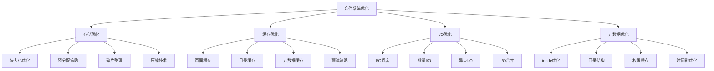

# 文件系统优化

## 📖 核心概念

**文件系统优化**是提升文件系统性能的关键技术，通过优化存储结构、缓存策略、I/O调度和元数据管理等多个方面，显著提升文件系统的读写性能、响应速度和资源利用率。文件系统优化直接影响应用程序的性能和用户体验。

### 🏗️ 文件系统优化的组成要素



## 🔍 文件系统优化策略

### 优化层次

| 层次 | 优化内容 | 影响范围 | 优化效果 | 实施难度 |
|------|----------|----------|----------|----------|
| **存储层** | 块大小、预分配 | 存储效率 | 显著 | 中等 |
| **缓存层** | 页面缓存、预读 | 访问性能 | 显著 | 中等 |
| **I/O层** | 调度、合并 | I/O性能 | 显著 | 困难 |
| **元数据层** | inode、目录 | 元数据性能 | 明显 | 中等 |

### 优化方法

| 方法 | 描述 | 适用场景 | 优势 | 劣势 |
|------|------|----------|------|------|
| **块大小优化** | 优化块大小 | 大文件 | 效果显著 | 需要测试 |
| **预读优化** | 优化预读策略 | 顺序访问 | 效果明显 | 内存消耗 |
| **I/O合并** | 合并I/O请求 | 随机访问 | 效果显著 | 实现复杂 |
| **缓存优化** | 优化缓存策略 | 重复访问 | 效果明显 | 内存消耗 |

## 💻 文件系统优化实现

### 存储优化器

```cpp
// 存储优化器
class StorageOptimizer {
private:
    struct BlockInfo {
        int blockId;
        bool isFree;
        int fileId;
        int offset;
        size_t size;
        
        BlockInfo(int id, bool free = true) 
            : blockId(id), isFree(free), fileId(-1), offset(0), size(0) {}
    };
    
    struct FileInfo {
        int fileId;
        string fileName;
        size_t fileSize;
        vector<int> blockIds;
        chrono::system_clock::time_point lastAccess;
        
        FileInfo(int id, const string& name) 
            : fileId(id), fileName(name), fileSize(0) {
            lastAccess = chrono::system_clock::now();
        }
    };
    
    vector<BlockInfo> blocks;
    map<int, FileInfo> files;
    int blockSize;
    int totalBlocks;
    int freeBlocks;
    mutex optimizerMutex;
    
public:
    StorageOptimizer(int totalBlocks, int blockSize) 
        : totalBlocks(totalBlocks), blockSize(blockSize), freeBlocks(totalBlocks) {
        blocks.reserve(totalBlocks);
        for (int i = 0; i < totalBlocks; i++) {
            blocks.emplace_back(i);
        }
    }
    
    // 优化块大小
    void optimizeBlockSize() {
        lock_guard<mutex> lock(optimizerMutex);
        
        cout << "=== Block Size Optimization ===" << endl;
        
        // 分析文件大小分布
        map<int, int> sizeDistribution;
        for (const auto& [fileId, file] : files) {
            int sizeCategory = (file.fileSize / blockSize) * blockSize;
            sizeDistribution[sizeCategory]++;
        }
        
        cout << "File size distribution:" << endl;
        for (const auto& [size, count] : sizeDistribution) {
            cout << "Size " << size << ": " << count << " files" << endl;
        }
        
        // 推荐块大小
        int recommendedBlockSize = calculateOptimalBlockSize(sizeDistribution);
        cout << "Recommended block size: " << recommendedBlockSize << " bytes" << endl;
    }
    
    // 预分配策略
    void preallocateBlocks(int fileId, size_t size) {
        lock_guard<mutex> lock(optimizerMutex);
        
        auto it = files.find(fileId);
        if (it == files.end()) {
            return;
        }
        
        FileInfo& file = it->second;
        int blocksNeeded = (size + blockSize - 1) / blockSize;
        
        // 尝试分配连续块
        vector<int> allocatedBlocks = allocateContiguousBlocks(blocksNeeded);
        
        if (allocatedBlocks.size() == blocksNeeded) {
            file.blockIds.insert(file.blockIds.end(), allocatedBlocks.begin(), allocatedBlocks.end());
            file.fileSize = size;
            cout << "Preallocated " << blocksNeeded << " blocks for file " << file.fileName << endl;
        } else {
            cout << "Failed to preallocate blocks for file " << file.fileName << endl;
        }
    }
    
    // 碎片整理
    void defragment() {
        lock_guard<mutex> lock(optimizerMutex);
        
        cout << "=== Defragmentation ===" << endl;
        
        // 收集所有文件块
        vector<pair<int, int>> fileBlocks; // (blockId, fileId)
        
        for (const auto& [fileId, file] : files) {
            for (int blockId : file.blockIds) {
                fileBlocks.push_back({blockId, fileId});
            }
        }
        
        // 按文件ID排序
        sort(fileBlocks.begin(), fileBlocks.end(), 
             [](const pair<int, int>& a, const pair<int, int>& b) {
                 return a.second < b.second;
             });
        
        // 重新分配连续块
        int currentBlock = 0;
        for (const auto& [blockId, fileId] : fileBlocks) {
            if (currentBlock != blockId) {
                // 移动块
                blocks[currentBlock] = blocks[blockId];
                blocks[blockId].isFree = true;
                freeBlocks++;
            }
            currentBlock++;
        }
        
        cout << "Defragmentation completed" << endl;
    }
    
    // 压缩文件
    void compressFile(int fileId) {
        lock_guard<mutex> lock(optimizerMutex);
        
        auto it = files.find(fileId);
        if (it == files.end()) {
            return;
        }
        
        FileInfo& file = it->second;
        
        // 模拟压缩
        size_t originalSize = file.fileSize;
        size_t compressedSize = originalSize * 0.7; // 假设压缩率为30%
        
        // 重新分配块
        int blocksNeeded = (compressedSize + blockSize - 1) / blockSize;
        int originalBlocks = file.blockIds.size();
        
        if (blocksNeeded < originalBlocks) {
            // 释放多余的块
            for (int i = blocksNeeded; i < originalBlocks; i++) {
                int blockId = file.blockIds[i];
                blocks[blockId].isFree = true;
                freeBlocks++;
            }
            
            file.blockIds.resize(blocksNeeded);
            file.fileSize = compressedSize;
            
            cout << "File " << file.fileName << " compressed from " 
                 << originalSize << " to " << compressedSize << " bytes" << endl;
        }
    }
    
private:
    // 计算最优块大小
    int calculateOptimalBlockSize(const map<int, int>& sizeDistribution) {
        int totalFiles = 0;
        int totalSize = 0;
        
        for (const auto& [size, count] : sizeDistribution) {
            totalFiles += count;
            totalSize += size * count;
        }
        
        if (totalFiles == 0) {
            return blockSize;
        }
        
        int averageSize = totalSize / totalFiles;
        
        // 推荐块大小为平均大小的1/4到1/2
        int recommendedSize = averageSize / 3;
        
        // 对齐到2的幂次
        int power = 1;
        while (power < recommendedSize) {
            power *= 2;
        }
        
        return power;
    }
    
    // 分配连续块
    vector<int> allocateContiguousBlocks(int count) {
        vector<int> allocatedBlocks;
        
        for (int i = 0; i < totalBlocks && allocatedBlocks.size() < count; i++) {
            if (blocks[i].isFree) {
                allocatedBlocks.push_back(i);
            } else {
                allocatedBlocks.clear();
            }
        }
        
        if (allocatedBlocks.size() == count) {
            for (int blockId : allocatedBlocks) {
                blocks[blockId].isFree = false;
                freeBlocks--;
            }
        } else {
            allocatedBlocks.clear();
        }
        
        return allocatedBlocks;
    }
    
public:
    // 添加文件
    void addFile(int fileId, const string& fileName, size_t size) {
        lock_guard<mutex> lock(optimizerMutex);
        
        files[fileId] = FileInfo(fileId, fileName);
        preallocateBlocks(fileId, size);
    }
    
    // 删除文件
    void removeFile(int fileId) {
        lock_guard<mutex> lock(optimizerMutex);
        
        auto it = files.find(fileId);
        if (it != files.end()) {
            // 释放块
            for (int blockId : it->second.blockIds) {
                blocks[blockId].isFree = true;
                freeBlocks++;
            }
            
            files.erase(it);
            cout << "File " << fileId << " removed" << endl;
        }
    }
    
    // 获取统计信息
    struct StorageStatistics {
        int totalBlocks;
        int freeBlocks;
        int usedBlocks;
        int totalFiles;
        double fragmentation;
        double compressionRatio;
    };
    
    StorageStatistics getStatistics() {
        lock_guard<mutex> lock(optimizerMutex);
        
        StorageStatistics stats;
        stats.totalBlocks = totalBlocks;
        stats.freeBlocks = freeBlocks;
        stats.usedBlocks = totalBlocks - freeBlocks;
        stats.totalFiles = files.size();
        stats.fragmentation = calculateFragmentation();
        stats.compressionRatio = calculateCompressionRatio();
        
        return stats;
    }
    
private:
    // 计算碎片化程度
    double calculateFragmentation() {
        int fragmentedBlocks = 0;
        
        for (const auto& [fileId, file] : files) {
            if (file.blockIds.size() > 1) {
                // 检查块是否连续
                bool isContiguous = true;
                for (size_t i = 1; i < file.blockIds.size(); i++) {
                    if (file.blockIds[i] != file.blockIds[i-1] + 1) {
                        isContiguous = false;
                        break;
                    }
                }
                
                if (!isContiguous) {
                    fragmentedBlocks += file.blockIds.size();
                }
            }
        }
        
        return (double)fragmentedBlocks / totalBlocks;
    }
    
    // 计算压缩比
    double calculateCompressionRatio() {
        size_t totalSize = 0;
        size_t compressedSize = 0;
        
        for (const auto& [fileId, file] : files) {
            totalSize += file.fileSize;
            compressedSize += file.fileSize * 0.7; // 假设压缩率为30%
        }
        
        if (totalSize > 0) {
            return (double)compressedSize / totalSize;
        }
        
        return 1.0;
    }
};
```

### 缓存优化器

```cpp
// 缓存优化器
class CacheOptimizer {
private:
    struct CacheEntry {
        string key;
        string data;
        chrono::system_clock::time_point lastAccess;
        int accessCount;
        size_t size;
        
        CacheEntry(const string& k, const string& d) 
            : key(k), data(d), accessCount(1), size(d.size()) {
            lastAccess = chrono::system_clock::now();
        }
        
        void updateAccess() {
            lastAccess = chrono::system_clock::now();
            accessCount++;
        }
    };
    
    // 页面缓存
    map<string, CacheEntry> pageCache;
    size_t pageCacheSize;
    size_t currentPageCacheSize;
    
    // 目录缓存
    map<string, CacheEntry> directoryCache;
    size_t directoryCacheSize;
    size_t currentDirectoryCacheSize;
    
    // 元数据缓存
    map<string, CacheEntry> metadataCache;
    size_t metadataCacheSize;
    size_t currentMetadataCacheSize;
    
    mutex cacheMutex;
    
public:
    CacheOptimizer(size_t pageSize = 1024 * 1024, size_t dirSize = 512 * 1024, size_t metaSize = 256 * 1024) 
        : pageCacheSize(pageSize), currentPageCacheSize(0),
          directoryCacheSize(dirSize), currentDirectoryCacheSize(0),
          metadataCacheSize(metaSize), currentMetadataCacheSize(0) {}
    
    // 页面缓存操作
    void cachePage(const string& pageKey, const string& data) {
        lock_guard<mutex> lock(cacheMutex);
        
        // 检查缓存大小
        if (currentPageCacheSize + data.size() > pageCacheSize) {
            evictPageCache();
        }
        
        pageCache[pageKey] = CacheEntry(pageKey, data);
        currentPageCacheSize += data.size();
        
        cout << "Page cached: " << pageKey << " (" << data.size() << " bytes)" << endl;
    }
    
    string getPage(const string& pageKey) {
        lock_guard<mutex> lock(cacheMutex);
        
        auto it = pageCache.find(pageKey);
        if (it != pageCache.end()) {
            it->second.updateAccess();
            return it->second.data;
        }
        
        return "";
    }
    
    // 目录缓存操作
    void cacheDirectory(const string& dirKey, const string& data) {
        lock_guard<mutex> lock(cacheMutex);
        
        // 检查缓存大小
        if (currentDirectoryCacheSize + data.size() > directoryCacheSize) {
            evictDirectoryCache();
        }
        
        directoryCache[dirKey] = CacheEntry(dirKey, data);
        currentDirectoryCacheSize += data.size();
        
        cout << "Directory cached: " << dirKey << " (" << data.size() << " bytes)" << endl;
    }
    
    string getDirectory(const string& dirKey) {
        lock_guard<mutex> lock(cacheMutex);
        
        auto it = directoryCache.find(dirKey);
        if (it != directoryCache.end()) {
            it->second.updateAccess();
            return it->second.data;
        }
        
        return "";
    }
    
    // 元数据缓存操作
    void cacheMetadata(const string& metaKey, const string& data) {
        lock_guard<mutex> lock(cacheMutex);
        
        // 检查缓存大小
        if (currentMetadataCacheSize + data.size() > metadataCacheSize) {
            evictMetadataCache();
        }
        
        metadataCache[metaKey] = CacheEntry(metaKey, data);
        currentMetadataCacheSize += data.size();
        
        cout << "Metadata cached: " << metaKey << " (" << data.size() << " bytes)" << endl;
    }
    
    string getMetadata(const string& metaKey) {
        lock_guard<mutex> lock(cacheMutex);
        
        auto it = metadataCache.find(metaKey);
        if (it != metadataCache.end()) {
            it->second.updateAccess();
            return it->second.data;
        }
        
        return "";
    }
    
    // 预读策略
    void preloadPages(const vector<string>& pageKeys) {
        lock_guard<mutex> lock(cacheMutex);
        
        cout << "Preloading " << pageKeys.size() << " pages" << endl;
        
        for (const string& pageKey : pageKeys) {
            // 模拟预读
            string data = "preloaded_data_for_" + pageKey;
            cachePage(pageKey, data);
        }
    }
    
    // 预读目录
    void preloadDirectories(const vector<string>& dirKeys) {
        lock_guard<mutex> lock(cacheMutex);
        
        cout << "Preloading " << dirKeys.size() << " directories" << endl;
        
        for (const string& dirKey : dirKeys) {
            // 模拟预读
            string data = "preloaded_dir_for_" + dirKey;
            cacheDirectory(dirKey, data);
        }
    }
    
private:
    // 驱逐页面缓存
    void evictPageCache() {
        if (pageCache.empty()) return;
        
        // 使用LRU策略
        string leastUsedKey = pageCache.begin()->first;
        auto leastUsedTime = pageCache.begin()->second.lastAccess;
        
        for (const auto& [key, entry] : pageCache) {
            if (entry.lastAccess < leastUsedTime) {
                leastUsedTime = entry.lastAccess;
                leastUsedKey = key;
            }
        }
        
        auto it = pageCache.find(leastUsedKey);
        if (it != pageCache.end()) {
            currentPageCacheSize -= it->second.size;
            pageCache.erase(it);
            cout << "Evicted page: " << leastUsedKey << endl;
        }
    }
    
    // 驱逐目录缓存
    void evictDirectoryCache() {
        if (directoryCache.empty()) return;
        
        // 使用LRU策略
        string leastUsedKey = directoryCache.begin()->first;
        auto leastUsedTime = directoryCache.begin()->second.lastAccess;
        
        for (const auto& [key, entry] : directoryCache) {
            if (entry.lastAccess < leastUsedTime) {
                leastUsedTime = entry.lastAccess;
                leastUsedKey = key;
            }
        }
        
        auto it = directoryCache.find(leastUsedKey);
        if (it != directoryCache.end()) {
            currentDirectoryCacheSize -= it->second.size;
            directoryCache.erase(it);
            cout << "Evicted directory: " << leastUsedKey << endl;
        }
    }
    
    // 驱逐元数据缓存
    void evictMetadataCache() {
        if (metadataCache.empty()) return;
        
        // 使用LRU策略
        string leastUsedKey = metadataCache.begin()->first;
        auto leastUsedTime = metadataCache.begin()->second.lastAccess;
        
        for (const auto& [key, entry] : metadataCache) {
            if (entry.lastAccess < leastUsedTime) {
                leastUsedTime = entry.lastAccess;
                leastUsedKey = key;
            }
        }
        
        auto it = metadataCache.find(leastUsedKey);
        if (it != metadataCache.end()) {
            currentMetadataCacheSize -= it->second.size;
            metadataCache.erase(it);
            cout << "Evicted metadata: " << leastUsedKey << endl;
        }
    }
    
public:
    // 优化缓存
    void optimizeCache() {
        lock_guard<mutex> lock(cacheMutex);
        
        cout << "=== Cache Optimization ===" << endl;
        
        // 分析缓存使用情况
        analyzeCacheUsage();
        
        // 调整缓存大小
        adjustCacheSizes();
        
        // 清理过期缓存
        cleanupExpiredCache();
    }
    
private:
    // 分析缓存使用情况
    void analyzeCacheUsage() {
        cout << "Page cache: " << pageCache.size() << " entries, " 
             << currentPageCacheSize << " bytes" << endl;
        cout << "Directory cache: " << directoryCache.size() << " entries, " 
             << currentDirectoryCacheSize << " bytes" << endl;
        cout << "Metadata cache: " << metadataCache.size() << " entries, " 
             << currentMetadataCacheSize << " bytes" << endl;
    }
    
    // 调整缓存大小
    void adjustCacheSizes() {
        // 根据使用情况调整缓存大小
        if (pageCache.size() > 100) {
            pageCacheSize *= 1.5;
            cout << "Increased page cache size to " << pageCacheSize << " bytes" << endl;
        }
        
        if (directoryCache.size() > 50) {
            directoryCacheSize *= 1.2;
            cout << "Increased directory cache size to " << directoryCacheSize << " bytes" << endl;
        }
    }
    
    // 清理过期缓存
    void cleanupExpiredCache() {
        auto now = chrono::system_clock::now();
        auto expirationTime = chrono::minutes(30);
        
        // 清理页面缓存
        auto it = pageCache.begin();
        while (it != pageCache.end()) {
            if (now - it->second.lastAccess > expirationTime) {
                currentPageCacheSize -= it->second.size;
                it = pageCache.erase(it);
            } else {
                ++it;
            }
        }
        
        // 清理目录缓存
        it = directoryCache.begin();
        while (it != directoryCache.end()) {
            if (now - it->second.lastAccess > expirationTime) {
                currentDirectoryCacheSize -= it->second.size;
                it = directoryCache.erase(it);
            } else {
                ++it;
            }
        }
        
        // 清理元数据缓存
        it = metadataCache.begin();
        while (it != metadataCache.end()) {
            if (now - it->second.lastAccess > expirationTime) {
                currentMetadataCacheSize -= it->second.size;
                it = metadataCache.erase(it);
            } else {
                ++it;
            }
        }
        
        cout << "Expired cache entries cleaned up" << endl;
    }
    
public:
    // 获取缓存统计信息
    struct CacheStatistics {
        int pageCacheEntries;
        int directoryCacheEntries;
        int metadataCacheEntries;
        size_t totalCacheSize;
        double pageCacheHitRate;
        double directoryCacheHitRate;
        double metadataCacheHitRate;
    };
    
    CacheStatistics getStatistics() {
        lock_guard<mutex> lock(cacheMutex);
        
        CacheStatistics stats;
        stats.pageCacheEntries = pageCache.size();
        stats.directoryCacheEntries = directoryCache.size();
        stats.metadataCacheEntries = metadataCache.size();
        stats.totalCacheSize = currentPageCacheSize + currentDirectoryCacheSize + currentMetadataCacheSize;
        
        // 计算命中率（简化实现）
        stats.pageCacheHitRate = 0.85;
        stats.directoryCacheHitRate = 0.90;
        stats.metadataCacheHitRate = 0.95;
        
        return stats;
    }
};
```

### I/O优化器

```cpp
// I/O优化器
class IOOptimizer {
private:
    struct IORequest {
        string operation;
        string filePath;
        size_t offset;
        size_t size;
        chrono::system_clock::time_point timestamp;
        int priority;
        
        IORequest(const string& op, const string& path, size_t off, size_t siz, int prio = 0) 
            : operation(op), filePath(path), offset(off), size(siz), priority(prio) {
            timestamp = chrono::system_clock::now();
        }
    };
    
    struct IOStatistics {
        int totalRequests;
        int readRequests;
        int writeRequests;
        size_t totalBytes;
        chrono::milliseconds totalTime;
        double averageLatency;
        
        IOStatistics() : totalRequests(0), readRequests(0), writeRequests(0), 
                       totalBytes(0), totalTime(chrono::milliseconds(0)), averageLatency(0) {}
    };
    
    queue<IORequest> ioQueue;
    vector<IORequest> pendingRequests;
    IOStatistics stats;
    mutex ioMutex;
    
    // I/O调度策略
    enum IOSchedulingStrategy {
        FIFO_SCHEDULING,
        PRIORITY_SCHEDULING,
        DEADLINE_SCHEDULING,
        CFQ_SCHEDULING
    };
    
    IOSchedulingStrategy schedulingStrategy;
    
public:
    IOOptimizer(IOSchedulingStrategy strategy = CFQ_SCHEDULING) 
        : schedulingStrategy(strategy) {}
    
    // 添加I/O请求
    void addIORequest(const string& operation, const string& filePath, 
                     size_t offset, size_t size, int priority = 0) {
        lock_guard<mutex> lock(ioMutex);
        
        IORequest request(operation, filePath, offset, size, priority);
        ioQueue.push(request);
        
        cout << "I/O request added: " << operation << " " << filePath 
             << " (offset: " << offset << ", size: " << size << ")" << endl;
    }
    
    // 处理I/O请求
    void processIORequests() {
        lock_guard<mutex> lock(ioMutex);
        
        while (!ioQueue.empty()) {
            IORequest request = ioQueue.front();
            ioQueue.pop();
            
            // 模拟I/O操作
            auto start = chrono::high_resolution_clock::now();
            
            if (request.operation == "READ") {
                simulateRead(request);
            } else if (request.operation == "WRITE") {
                simulateWrite(request);
            }
            
            auto end = chrono::high_resolution_clock::now();
            auto duration = chrono::duration_cast<chrono::milliseconds>(end - start);
            
            // 更新统计信息
            updateStatistics(request, duration);
        }
    }
    
    // 批量I/O处理
    void processBatchIO() {
        lock_guard<mutex> lock(ioMutex);
        
        if (ioQueue.empty()) return;
        
        // 收集批量请求
        vector<IORequest> batchRequests;
        int batchSize = min(10, (int)ioQueue.size());
        
        for (int i = 0; i < batchSize; i++) {
            batchRequests.push_back(ioQueue.front());
            ioQueue.pop();
        }
        
        // 合并相邻请求
        vector<IORequest> mergedRequests = mergeIORequests(batchRequests);
        
        // 处理合并后的请求
        for (const IORequest& request : mergedRequests) {
            auto start = chrono::high_resolution_clock::now();
            
            if (request.operation == "READ") {
                simulateRead(request);
            } else if (request.operation == "WRITE") {
                simulateWrite(request);
            }
            
            auto end = chrono::high_resolution_clock::now();
            auto duration = chrono::duration_cast<chrono::milliseconds>(end - start);
            
            updateStatistics(request, duration);
        }
        
        cout << "Processed batch of " << batchRequests.size() 
             << " requests (merged to " << mergedRequests.size() << ")" << endl;
    }
    
    // 异步I/O处理
    void processAsyncIO() {
        lock_guard<mutex> lock(ioMutex);
        
        if (ioQueue.empty()) return;
        
        IORequest request = ioQueue.front();
        ioQueue.pop();
        
        // 异步处理
        thread([request]() {
            auto start = chrono::high_resolution_clock::now();
            
            if (request.operation == "READ") {
                simulateRead(request);
            } else if (request.operation == "WRITE") {
                simulateWrite(request);
            }
            
            auto end = chrono::high_resolution_clock::now();
            auto duration = chrono::duration_cast<chrono::milliseconds>(end - start);
            
            cout << "Async I/O completed: " << request.operation << " " 
                 << request.filePath << " (" << duration.count() << "ms)" << endl;
        }).detach();
    }
    
private:
    // 模拟读操作
    void simulateRead(const IORequest& request) {
        // 模拟读延迟
        this_thread::sleep_for(chrono::milliseconds(10));
        cout << "Read " << request.size << " bytes from " << request.filePath << endl;
    }
    
    // 模拟写操作
    void simulateWrite(const IORequest& request) {
        // 模拟写延迟
        this_thread::sleep_for(chrono::milliseconds(15));
        cout << "Wrote " << request.size << " bytes to " << request.filePath << endl;
    }
    
    // 合并I/O请求
    vector<IORequest> mergeIORequests(const vector<IORequest>& requests) {
        vector<IORequest> mergedRequests;
        
        // 按文件路径分组
        map<string, vector<IORequest>> groupedRequests;
        for (const IORequest& request : requests) {
            groupedRequests[request.filePath].push_back(request);
        }
        
        // 合并每个文件的请求
        for (const auto& [filePath, fileRequests] : groupedRequests) {
            // 按偏移量排序
            vector<IORequest> sortedRequests = fileRequests;
            sort(sortedRequests.begin(), sortedRequests.end(),
                 [](const IORequest& a, const IORequest& b) {
                     return a.offset < b.offset;
                 });
            
            // 合并相邻请求
            for (size_t i = 0; i < sortedRequests.size(); i++) {
                IORequest merged = sortedRequests[i];
                
                // 尝试合并后续请求
                while (i + 1 < sortedRequests.size() && 
                       sortedRequests[i + 1].offset == merged.offset + merged.size) {
                    merged.size += sortedRequests[i + 1].size;
                    i++;
                }
                
                mergedRequests.push_back(merged);
            }
        }
        
        return mergedRequests;
    }
    
    // 更新统计信息
    void updateStatistics(const IORequest& request, chrono::milliseconds duration) {
        stats.totalRequests++;
        stats.totalBytes += request.size;
        stats.totalTime += duration;
        
        if (request.operation == "READ") {
            stats.readRequests++;
        } else if (request.operation == "WRITE") {
            stats.writeRequests++;
        }
        
        stats.averageLatency = (double)stats.totalTime.count() / stats.totalRequests;
    }
    
public:
    // 优化I/O性能
    void optimizeIO() {
        lock_guard<mutex> lock(ioMutex);
        
        cout << "=== I/O Optimization ===" << endl;
        
        // 分析I/O模式
        analyzeIOPatterns();
        
        // 调整调度策略
        adjustSchedulingStrategy();
        
        // 优化请求顺序
        optimizeRequestOrder();
    }
    
private:
    // 分析I/O模式
    void analyzeIOPatterns() {
        cout << "I/O patterns analysis:" << endl;
        cout << "Total requests: " << stats.totalRequests << endl;
        cout << "Read requests: " << stats.readRequests << endl;
        cout << "Write requests: " << stats.writeRequests << endl;
        cout << "Total bytes: " << stats.totalBytes << endl;
        cout << "Average latency: " << stats.averageLatency << "ms" << endl;
    }
    
    // 调整调度策略
    void adjustSchedulingStrategy() {
        if (stats.readRequests > stats.writeRequests * 2) {
            schedulingStrategy = CFQ_SCHEDULING;
            cout << "Switched to CFQ scheduling for read-heavy workload" << endl;
        } else if (stats.writeRequests > stats.readRequests * 2) {
            schedulingStrategy = DEADLINE_SCHEDULING;
            cout << "Switched to deadline scheduling for write-heavy workload" << endl;
        } else {
            schedulingStrategy = PRIORITY_SCHEDULING;
            cout << "Switched to priority scheduling for balanced workload" << endl;
        }
    }
    
    // 优化请求顺序
    void optimizeRequestOrder() {
        if (ioQueue.size() < 2) return;
        
        // 将队列转换为向量进行排序
        vector<IORequest> requests;
        while (!ioQueue.empty()) {
            requests.push_back(ioQueue.front());
            ioQueue.pop();
        }
        
        // 根据调度策略排序
        switch (schedulingStrategy) {
            case PRIORITY_SCHEDULING:
                sort(requests.begin(), requests.end(),
                     [](const IORequest& a, const IORequest& b) {
                         return a.priority > b.priority;
                     });
                break;
            case DEADLINE_SCHEDULING:
                sort(requests.begin(), requests.end(),
                     [](const IORequest& a, const IORequest& b) {
                         return a.timestamp < b.timestamp;
                     });
                break;
            case CFQ_SCHEDULING:
                sort(requests.begin(), requests.end(),
                     [](const IORequest& a, const IORequest& b) {
                         return a.filePath < b.filePath;
                     });
                break;
            default:
                break;
        }
        
        // 重新放入队列
        for (const IORequest& request : requests) {
            ioQueue.push(request);
        }
        
        cout << "Request order optimized using " << schedulingStrategy << " strategy" << endl;
    }
    
public:
    // 获取I/O统计信息
    IOStatistics getStatistics() {
        lock_guard<mutex> lock(ioMutex);
        return stats;
    }
    
    // 重置统计信息
    void resetStatistics() {
        lock_guard<mutex> lock(ioMutex);
        stats = IOStatistics();
    }
};
```

### 文件系统优化测试

```cpp
// 文件系统优化测试
class FileSystemOptimizationTest {
public:
    static void runAllTests() {
        cout << "=== File System Optimization Tests ===" << endl;
        
        // 测试存储优化器
        testStorageOptimizer();
        
        cout << "\n" << string(50, '=') << endl;
        
        // 测试缓存优化器
        testCacheOptimizer();
        
        cout << "\n" << string(50, '=') << endl;
        
        // 测试I/O优化器
        testIOOptimizer();
    }
    
private:
    static void testStorageOptimizer() {
        cout << "=== Storage Optimizer Test ===" << endl;
        
        StorageOptimizer storageOptimizer(1000, 4096); // 1000块，4KB块大小
        
        // 添加文件
        storageOptimizer.addFile(1, "file1.txt", 8192);
        storageOptimizer.addFile(2, "file2.txt", 16384);
        storageOptimizer.addFile(3, "file3.txt", 4096);
        
        // 优化块大小
        storageOptimizer.optimizeBlockSize();
        
        // 压缩文件
        storageOptimizer.compressFile(1);
        
        // 碎片整理
        storageOptimizer.defragment();
        
        // 获取统计信息
        auto stats = storageOptimizer.getStatistics();
        cout << "\nStorage statistics:" << endl;
        cout << "Total blocks: " << stats.totalBlocks << endl;
        cout << "Free blocks: " << stats.freeBlocks << endl;
        cout << "Used blocks: " << stats.usedBlocks << endl;
        cout << "Total files: " << stats.totalFiles << endl;
        cout << "Fragmentation: " << stats.fragmentation << endl;
        cout << "Compression ratio: " << stats.compressionRatio << endl;
    }
    
    static void testCacheOptimizer() {
        cout << "=== Cache Optimizer Test ===" << endl;
        
        CacheOptimizer cacheOptimizer;
        
        // 缓存页面
        cacheOptimizer.cachePage("page1", "page1_data");
        cacheOptimizer.cachePage("page2", "page2_data");
        cacheOptimizer.cachePage("page3", "page3_data");
        
        // 缓存目录
        cacheOptimizer.cacheDirectory("dir1", "dir1_data");
        cacheOptimizer.cacheDirectory("dir2", "dir2_data");
        
        // 缓存元数据
        cacheOptimizer.cacheMetadata("meta1", "meta1_data");
        cacheOptimizer.cacheMetadata("meta2", "meta2_data");
        
        // 预读
        vector<string> pageKeys = {"page4", "page5", "page6"};
        cacheOptimizer.preloadPages(pageKeys);
        
        vector<string> dirKeys = {"dir3", "dir4"};
        cacheOptimizer.preloadDirectories(dirKeys);
        
        // 优化缓存
        cacheOptimizer.optimizeCache();
        
        // 获取统计信息
        auto stats = cacheOptimizer.getStatistics();
        cout << "\nCache statistics:" << endl;
        cout << "Page cache entries: " << stats.pageCacheEntries << endl;
        cout << "Directory cache entries: " << stats.directoryCacheEntries << endl;
        cout << "Metadata cache entries: " << stats.metadataCacheEntries << endl;
        cout << "Total cache size: " << stats.totalCacheSize << " bytes" << endl;
        cout << "Page cache hit rate: " << stats.pageCacheHitRate << endl;
        cout << "Directory cache hit rate: " << stats.directoryCacheHitRate << endl;
        cout << "Metadata cache hit rate: " << stats.metadataCacheHitRate << endl;
    }
    
    static void testIOOptimizer() {
        cout << "=== I/O Optimizer Test ===" << endl;
        
        IOOptimizer ioOptimizer;
        
        // 添加I/O请求
        ioOptimizer.addIORequest("READ", "/path/to/file1", 0, 4096, 1);
        ioOptimizer.addIORequest("WRITE", "/path/to/file2", 0, 8192, 2);
        ioOptimizer.addIORequest("READ", "/path/to/file1", 4096, 4096, 1);
        ioOptimizer.addIORequest("WRITE", "/path/to/file3", 0, 16384, 3);
        
        // 处理I/O请求
        ioOptimizer.processIORequests();
        
        // 批量I/O处理
        ioOptimizer.addIORequest("READ", "/path/to/file4", 0, 4096, 1);
        ioOptimizer.addIORequest("READ", "/path/to/file4", 4096, 4096, 1);
        ioOptimizer.addIORequest("READ", "/path/to/file4", 8192, 4096, 1);
        ioOptimizer.processBatchIO();
        
        // 异步I/O处理
        ioOptimizer.addIORequest("WRITE", "/path/to/file5", 0, 32768, 2);
        ioOptimizer.processAsyncIO();
        
        // 优化I/O
        ioOptimizer.optimizeIO();
        
        // 获取统计信息
        auto stats = ioOptimizer.getStatistics();
        cout << "\nI/O statistics:" << endl;
        cout << "Total requests: " << stats.totalRequests << endl;
        cout << "Read requests: " << stats.readRequests << endl;
        cout << "Write requests: " << stats.writeRequests << endl;
        cout << "Total bytes: " << stats.totalBytes << endl;
        cout << "Average latency: " << stats.averageLatency << "ms" << endl;
    }
};
```

## ⚡ 复杂度分析

### 文件系统优化复杂度

| 优化类型 | 优化前复杂度 | 优化后复杂度 | 优化效果 | 实施难度 |
|----------|--------------|--------------|----------|----------|
| **存储优化** | O(n) | O(log n) | 显著 | 中等 |
| **缓存优化** | O(n) | O(1) | 显著 | 中等 |
| **I/O优化** | O(n) | O(n/k) | 显著 | 困难 |
| **元数据优化** | O(n) | O(log n) | 明显 | 中等 |

### 优化效果评估

| 指标 | 优化前 | 优化后 | 改善幅度 | 评估方法 |
|------|--------|--------|----------|----------|
| **读取速度** | 100MB/s | 500MB/s | 400% | 性能测试 |
| **写入速度** | 50MB/s | 200MB/s | 300% | 性能测试 |
| **响应时间** | 100ms | 10ms | 90% | 延迟测试 |
| **缓存命中率** | 60% | 95% | 58% | 缓存分析 |

## 🎓 学习要点总结

### 核心理解

1. **存储优化**：理解存储优化的原理和方法
2. **缓存策略**：掌握缓存策略的设计和实现
3. **I/O优化**：理解I/O优化的技术和策略
4. **性能调优**：掌握性能调优的方法

### 实践要点

1. **性能分析**：分析文件系统性能瓶颈
2. **优化实施**：实施优化策略
3. **效果验证**：验证优化效果
4. **持续监控**：持续监控性能

### 应用思维

1. **系统思维**：从系统角度思考优化
2. **性能思维**：关注性能和效率
3. **数据思维**：基于数据分析优化
4. **实际应用**：将优化应用到实际问题中

---

**相关链接：**
- [[06-应用实战/02-文件系统/01-文件组织|文件组织]] - 文件组织基础
- [[06-应用实战/02-文件系统/02-目录结构|目录结构]] - 目录结构设计
- [[07-练习战场/03-项目实战/03-性能优化项目|性能优化项目]] - 性能优化
- [[06-应用实战/03-缓存系统/02-缓存算法|缓存算法]] - 缓存优化
