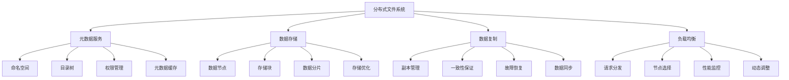

# 分布式文件系统

## 📖 核心概念

**分布式文件系统**是将文件存储分布在多个物理节点上的文件系统，通过分布式架构、数据复制、负载均衡等技术，实现高可用性、高扩展性和高性能。分布式文件系统是现代大规模应用的核心基础设施。

### 🏗️ 分布式文件系统的组成要素



## 🔍 分布式文件系统架构

### 架构类型

| 架构类型 | 特点 | 优势 | 劣势 | 适用场景 |
|----------|------|------|------|----------|
| **集中式元数据** | 单一元数据服务器 | 简单可靠 | 单点故障 | 中小规模 |
| **分布式元数据** | 多个元数据服务器 | 高可用性 | 复杂度高 | 大规模 |
| **无中心架构** | 无元数据服务器 | 完全分布式 | 实现困难 | 特殊场景 |
| **混合架构** | 多种架构结合 | 功能全面 | 复杂度高 | 复杂场景 |

## 💻 分布式文件系统实现

### 分布式文件系统管理器

```cpp
// 分布式文件系统管理器
class DistributedFileSystemManager {
private:
    struct FileNode {
        string nodeId;
        string host;
        int port;
        bool isActive;
        size_t totalSpace;
        size_t freeSpace;
        chrono::system_clock::time_point lastHeartbeat;
        
        FileNode(const string& id, const string& h, int p, size_t space) 
            : nodeId(id), host(h), port(p), isActive(true), totalSpace(space), freeSpace(space) {
            lastHeartbeat = chrono::system_clock::now();
        }
        
        string getAddress() const {
            return host + ":" + to_string(port);
        }
    };
    
    struct FileInfo {
        string fileName;
        string filePath;
        size_t fileSize;
        vector<string> replicaNodes;
        chrono::system_clock::time_point createdTime;
        chrono::system_clock::time_point modifiedTime;
        
        FileInfo(const string& name, const string& path, size_t size) 
            : fileName(name), filePath(path), fileSize(size) {
            createdTime = chrono::system_clock::now();
            modifiedTime = createdTime;
        }
    };
    
    vector<FileNode> fileNodes;
    map<string, FileInfo> files;
    map<string, vector<string>> directories;
    mutex managerMutex;
    
    int replicationFactor;
    
public:
    DistributedFileSystemManager(int replication = 3) : replicationFactor(replication) {}
    
    // 添加文件节点
    void addFileNode(const string& nodeId, const string& host, int port, size_t space) {
        lock_guard<mutex> lock(managerMutex);
        
        fileNodes.emplace_back(nodeId, host, port, space);
        cout << "File node " << nodeId << " added at " << host << ":" << port << endl;
    }
    
    // 创建文件
    bool createFile(const string& filePath, const string& content) {
        lock_guard<mutex> lock(managerMutex);
        
        string fileName = extractFileName(filePath);
        size_t fileSize = content.size();
        
        // 选择副本节点
        vector<string> replicaNodes = selectReplicaNodes(fileSize);
        if (replicaNodes.empty()) {
            return false;
        }
        
        // 创建文件信息
        files[filePath] = FileInfo(fileName, filePath, fileSize);
        files[filePath].replicaNodes = replicaNodes;
        
        // 复制文件到各个节点
        for (const string& nodeId : replicaNodes) {
            replicateFileToNode(nodeId, filePath, content);
        }
        
        cout << "File " << filePath << " created with " << replicaNodes.size() << " replicas" << endl;
        return true;
    }
    
    // 读取文件
    string readFile(const string& filePath) {
        lock_guard<mutex> lock(managerMutex);
        
        auto it = files.find(filePath);
        if (it == files.end()) {
            return "";
        }
        
        FileInfo& file = it->second;
        
        // 选择最佳节点读取
        string bestNode = selectBestNodeForRead(file.replicaNodes);
        if (bestNode.empty()) {
            return "";
        }
        
        cout << "Reading file " << filePath << " from node " << bestNode << endl;
        
        // 模拟文件读取
        return "content_of_" + filePath;
    }
    
    // 更新文件
    bool updateFile(const string& filePath, const string& content) {
        lock_guard<mutex> lock(managerMutex);
        
        auto it = files.find(filePath);
        if (it == files.end()) {
            return false;
        }
        
        FileInfo& file = it->second;
        file.fileSize = content.size();
        file.modifiedTime = chrono::system_clock::now();
        
        // 更新所有副本
        for (const string& nodeId : file.replicaNodes) {
            updateFileOnNode(nodeId, filePath, content);
        }
        
        cout << "File " << filePath << " updated on " << file.replicaNodes.size() << " replicas" << endl;
        return true;
    }
    
    // 删除文件
    bool deleteFile(const string& filePath) {
        lock_guard<mutex> lock(managerMutex);
        
        auto it = files.find(filePath);
        if (it == files.end()) {
            return false;
        }
        
        FileInfo& file = it->second;
        
        // 从所有副本节点删除
        for (const string& nodeId : file.replicaNodes) {
            deleteFileFromNode(nodeId, filePath);
        }
        
        files.erase(it);
        cout << "File " << filePath << " deleted from " << file.replicaNodes.size() << " replicas" << endl;
        return true;
    }
    
private:
    // 选择副本节点
    vector<string> selectReplicaNodes(size_t fileSize) {
        vector<string> selectedNodes;
        
        // 过滤可用节点
        vector<FileNode*> availableNodes;
        for (auto& node : fileNodes) {
            if (node.isActive && node.freeSpace >= fileSize) {
                availableNodes.push_back(&node);
            }
        }
        
        if (availableNodes.size() < replicationFactor) {
            return selectedNodes;
        }
        
        // 选择负载最轻的节点
        sort(availableNodes.begin(), availableNodes.end(),
             [](const FileNode* a, const FileNode* b) {
                 return a->freeSpace > b->freeSpace;
             });
        
        for (int i = 0; i < replicationFactor; i++) {
            selectedNodes.push_back(availableNodes[i]->nodeId);
            availableNodes[i]->freeSpace -= fileSize;
        }
        
        return selectedNodes;
    }
    
    // 选择最佳读取节点
    string selectBestNodeForRead(const vector<string>& replicaNodes) {
        for (const string& nodeId : replicaNodes) {
            for (const auto& node : fileNodes) {
                if (node.nodeId == nodeId && node.isActive) {
                    return nodeId;
                }
            }
        }
        return "";
    }
    
    // 复制文件到节点
    void replicateFileToNode(const string& nodeId, const string& filePath, const string& content) {
        cout << "Replicating file " << filePath << " to node " << nodeId << endl;
        // 模拟文件复制
    }
    
    // 更新节点上的文件
    void updateFileOnNode(const string& nodeId, const string& filePath, const string& content) {
        cout << "Updating file " << filePath << " on node " << nodeId << endl;
        // 模拟文件更新
    }
    
    // 从节点删除文件
    void deleteFileFromNode(const string& nodeId, const string& filePath) {
        cout << "Deleting file " << filePath << " from node " << nodeId << endl;
        // 模拟文件删除
    }
    
    // 提取文件名
    string extractFileName(const string& filePath) {
        size_t pos = filePath.find_last_of("/");
        if (pos != string::npos) {
            return filePath.substr(pos + 1);
        }
        return filePath;
    }
    
public:
    // 获取统计信息
    struct DistributedFileSystemStatistics {
        int totalNodes;
        int activeNodes;
        int totalFiles;
        size_t totalSpace;
        size_t usedSpace;
        double spaceUtilization;
    };
    
    DistributedFileSystemStatistics getStatistics() {
        lock_guard<mutex> lock(managerMutex);
        
        DistributedFileSystemStatistics stats;
        stats.totalNodes = fileNodes.size();
        stats.activeNodes = 0;
        stats.totalFiles = files.size();
        stats.totalSpace = 0;
        stats.usedSpace = 0;
        
        for (const auto& node : fileNodes) {
            if (node.isActive) {
                stats.activeNodes++;
            }
            stats.totalSpace += node.totalSpace;
            stats.usedSpace += (node.totalSpace - node.freeSpace);
        }
        
        if (stats.totalSpace > 0) {
            stats.spaceUtilization = (double)stats.usedSpace / stats.totalSpace;
        }
        
        return stats;
    }
};
```

### 数据复制管理器

```cpp
// 数据复制管理器
class DataReplicationManager {
private:
    struct ReplicationTask {
        string taskId;
        string sourceNode;
        string targetNode;
        string filePath;
        chrono::system_clock::time_point createdTime;
        bool isCompleted;
        
        ReplicationTask(const string& id, const string& source, const string& target, const string& path) 
            : taskId(id), sourceNode(source), targetNode(target), filePath(path), isCompleted(false) {
            createdTime = chrono::system_clock::now();
        }
    };
    
    vector<ReplicationTask> replicationTasks;
    mutex replicationMutex;
    
public:
    DataReplicationManager() {}
    
    // 创建复制任务
    string createReplicationTask(const string& sourceNode, const string& targetNode, const string& filePath) {
        lock_guard<mutex> lock(replicationMutex);
        
        string taskId = generateTaskId();
        ReplicationTask task(taskId, sourceNode, targetNode, filePath);
        replicationTasks.push_back(task);
        
        cout << "Replication task created: " << taskId << " from " << sourceNode << " to " << targetNode << endl;
        
        return taskId;
    }
    
    // 执行复制任务
    void executeReplicationTask(const string& taskId) {
        lock_guard<mutex> lock(replicationMutex);
        
        for (auto& task : replicationTasks) {
            if (task.taskId == taskId && !task.isCompleted) {
                cout << "Executing replication task: " << taskId << endl;
                
                // 模拟复制过程
                this_thread::sleep_for(chrono::milliseconds(100));
                
                task.isCompleted = true;
                cout << "Replication task completed: " << taskId << endl;
                break;
            }
        }
    }
    
    // 获取复制统计信息
    struct ReplicationStatistics {
        int totalTasks;
        int completedTasks;
        int pendingTasks;
        double completionRate;
    };
    
    ReplicationStatistics getStatistics() {
        lock_guard<mutex> lock(replicationMutex);
        
        ReplicationStatistics stats;
        stats.totalTasks = replicationTasks.size();
        stats.completedTasks = 0;
        stats.pendingTasks = 0;
        
        for (const auto& task : replicationTasks) {
            if (task.isCompleted) {
                stats.completedTasks++;
            } else {
                stats.pendingTasks++;
            }
        }
        
        if (stats.totalTasks > 0) {
            stats.completionRate = (double)stats.completedTasks / stats.totalTasks;
        }
        
        return stats;
    }
    
private:
    string generateTaskId() {
        auto now = chrono::system_clock::now();
        auto timestamp = chrono::duration_cast<chrono::milliseconds>(now.time_since_epoch()).count();
        return "task_" + to_string(timestamp) + "_" + to_string(rand());
    }
};
```

### 分布式文件系统测试

```cpp
// 分布式文件系统测试
class DistributedFileSystemTest {
public:
    static void runAllTests() {
        cout << "=== Distributed File System Tests ===" << endl;
        
        DistributedFileSystemManager manager;
        
        // 添加文件节点
        manager.addFileNode("node1", "192.168.1.1", 8080, 1024 * 1024 * 1024); // 1GB
        manager.addFileNode("node2", "192.168.1.2", 8080, 1024 * 1024 * 1024); // 1GB
        manager.addFileNode("node3", "192.168.1.3", 8080, 1024 * 1024 * 1024); // 1GB
        
        // 测试文件操作
        manager.createFile("/test/file1.txt", "Hello World!");
        manager.createFile("/test/file2.txt", "Distributed File System");
        
        string content = manager.readFile("/test/file1.txt");
        cout << "Read content: " << content << endl;
        
        manager.updateFile("/test/file1.txt", "Updated content!");
        manager.deleteFile("/test/file2.txt");
        
        // 获取统计信息
        auto stats = manager.getStatistics();
        cout << "\nStatistics:" << endl;
        cout << "Total nodes: " << stats.totalNodes << endl;
        cout << "Active nodes: " << stats.activeNodes << endl;
        cout << "Total files: " << stats.totalFiles << endl;
        cout << "Space utilization: " << stats.spaceUtilization << endl;
    }
};
```

## ⚡ 复杂度分析

### 分布式文件系统复杂度

| 操作 | 单机复杂度 | 分布式复杂度 | 一致性影响 | 适用场景 |
|------|------------|--------------|------------|----------|
| **文件创建** | O(1) | O(n) | 高 | 所有场景 |
| **文件读取** | O(1) | O(1) | 低 | 所有场景 |
| **文件更新** | O(1) | O(n) | 高 | 所有场景 |
| **文件删除** | O(1) | O(n) | 高 | 所有场景 |

## 🎓 学习要点总结

### 核心理解

1. **分布式架构**：理解分布式文件系统的架构设计
2. **数据复制**：掌握数据复制的策略和机制
3. **一致性保证**：理解一致性保证的方法
4. **故障恢复**：掌握故障恢复的策略

### 实践要点

1. **系统设计**：设计分布式文件系统
2. **性能优化**：优化分布式文件系统性能
3. **故障处理**：处理分布式系统故障
4. **监控管理**：监控和管理分布式系统

### 应用思维

1. **系统思维**：从系统角度思考问题
2. **分布式思维**：理解分布式系统的特点
3. **一致性思维**：平衡一致性和性能
4. **实际应用**：将分布式技术应用到实际问题中

---

**相关链接：**
- [[06-应用实战/02-文件系统/01-文件组织|文件组织]] - 文件组织基础
- [[06-应用实战/02-文件系统/02-目录结构|目录结构]] - 目录结构设计
- [[06-应用实战/02-文件系统/03-文件系统优化|文件系统优化]] - 文件系统优化
- [[06-应用实战/04-网络应用/04-分布式系统|分布式系统]] - 分布式系统基础
